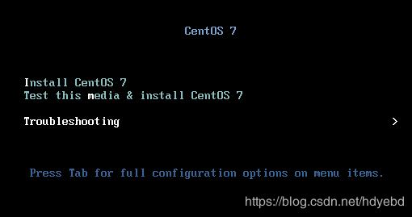

由于断电引起的centos7 开机提示破坏了/boot/下的initramfs-3.10.0-693.el7.x86_64.img  not found  或者 vmlinuz-3.10.0-693.el7.x86_64文件导致系统启动不了


这里可以看到，系统重启报错，`vmlinuz-3.10.0-693.e17.x86_64` 文件找不到，而这个文件是系统内核加载需要调用的文件


而这个文件其实是在装系统之前就存在的，只是装好系统后，从光盘内复制到/boot目录下的，所以我们只需要进入救援模式，把这个文件从挂载光盘目录下,`solinux/*`中将此文件再拷贝一份出来就行。


#### 救援模式
1. 将系统BIOS设置成优先光盘引导启动，重启系统，进入救援系统(选择第三项如下图)

	

2. 选择第二项，进入救援模式 如下图

	

3. 故障系统挂载在了`/mnt/sysimage/`，进入光盘目录下的solinux子目录内，执行如下命令 

	```
	cp vmlinuz /mnt/sysimage/boot/vmlinuz-`uname -r` # 将vmliuz 复制至/mnt/sysimage/boot/ 下
	```

    

4. 进入`/mnt/sysimage/boot/`下 确认文件已经存在，执行`sync；reboot`系统（此处执行sync 的意义是怕部分复制文件任然在缓冲buffer 中，没写入磁盘，执行sync 让缓冲中的数据立即写入磁盘）

	
	


如果开机提示 如下错误


- 通过救援模式进入系统（上述步骤）。进入到`/mnt/sysimage/boot/` 目录下，执行如下
	```
	mkinitrd /boot/initramfs-`uname -r`.img  `uname -r`
	```
	但是要进行根切换，这一点很关键

	

	因为`mkinitrd`是依赖`/usr/share/drocut/drocut-functions`，如果根目录不对，找不到对应文件，会导致无法执行`mkinitrd`。 执行命令，这里时间可能会久一点要耐心等待一下

	


#### 修改default.target 不能启动的处理办法

- 进入单用户模式，修改启动项，在 linux16 末尾添加 `init=/bin/sh`, Ctrl+x 启动。
- 挂载根目录，使文件可写`mount -o remount,rw /`
- 找到 `/lib/systemd/system/default.target`文件修改。
```
[Unit]
Description=Multi-User System
Documentation=man:systemd.special(7)
Requires=basic.target
Conflicts=rescue.service rescue.target
After=basic.target rescue.service rescue.target
AllowIsolate=yes
```
- 最后 `exec /sbin/init` 启动到命令行模式