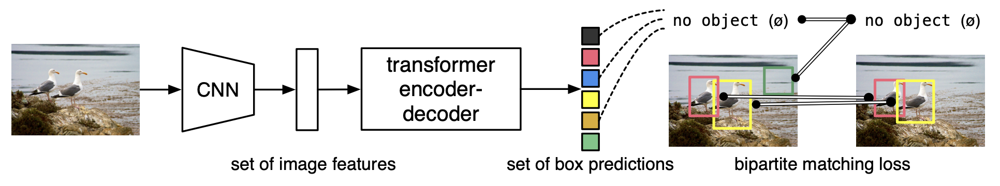
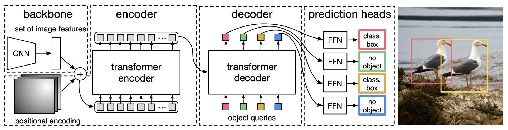
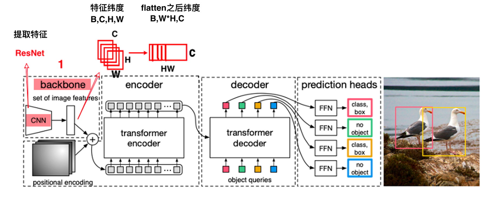
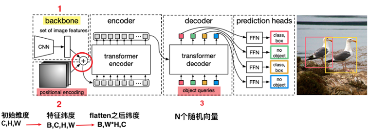
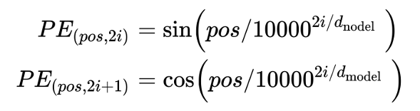

### DETR

这篇文章提出了一个非常简单的端到端的框架，DETR 的网络结构很简单，分为三个部分，第一部分是一个传统 CNN 用于提取图片特征到更高维度，第二部分一个Transformer 的 Encoder 和 Decoder 来提取 Bounding Box，最后使用 Bipartite matching loss 来训练网络

#### 模型

把一张3通道图片输入backbone为CNN的网络中，提取图片特征，然后结合位置信息，输入到transformer模型的编码器中，和解码器，得到transformer的检测结果，每个结果就是一个box，每个box表示一个元组，包含物体的类别和检测框位置。举个例子，这个box可能是表示一只鸟，这只鸟的检测框为(x=20,y=20,w=10,h=20),x、y表示框的中心坐标，w表示框宽度、h表示框高度。又比如绿色这个检测框没有物体，（O/，（x=60,y=10,w=10,h=10）），没有物体这个类别也是一个有效的类别，相当于背景 

#### 主干网络（ResNet）

使用ResNet作为backbone提取图片特征，同时会使用一个1*1的卷积进行降维。因为transformer的编码器模块只处理序列输入，所以后续还需要把CNN特征展开为一个序列。

#### DETR Transformer
接下来我们一步一步讲解DETR，首先是位置编码部分，转成特征序列后，图像就失去了像素的空间分布信息，所以Transformer就引入位置编码，也需要然后把降维后的特征与位置编码信息结合：

DETR论文提出了两种编码：

- spatial positional encoding
- object queries

第一种spatial positional encoding，从图4可以看出即会输入到encoder也会输入到decoder中。spatial positional encoding也包含两种计算方式：

- **learned** emmbeding向量，从网络中学习；
- **sine**

PE为二维矩阵，大小跟输入embedding的维度一样，行表示词语，列表示词向量；pos 表示词语在句子中的位置；$d_{model}$表示词向量的维度；i表示词向量的位置。因此，上述公式表示在每个词语的词向量的偶数位置添加sin变量，奇数位置添加cos变量，从而来填满整个PE矩阵，然后concatenate送到编码器中。
两种方法实现代码如下：

https://aistudio.baidu.com/projectdetail/2290729