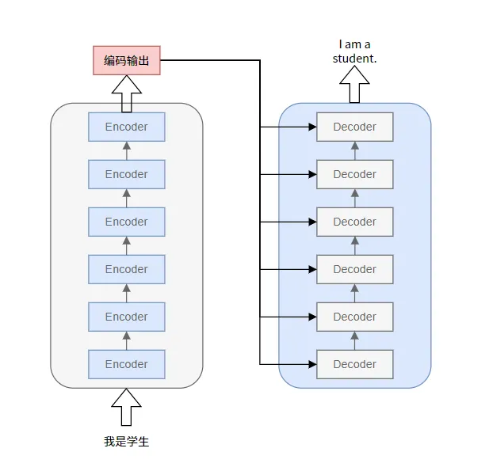
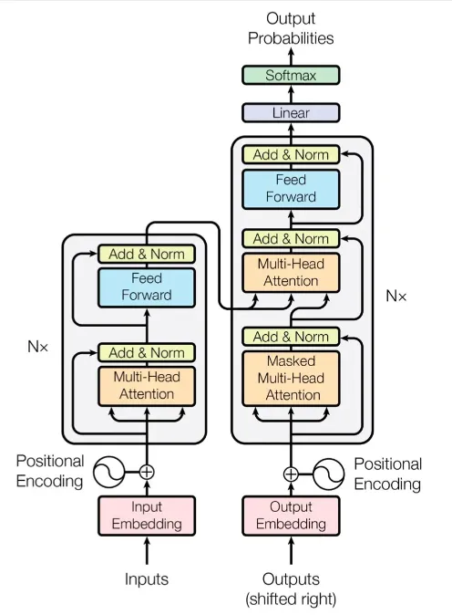
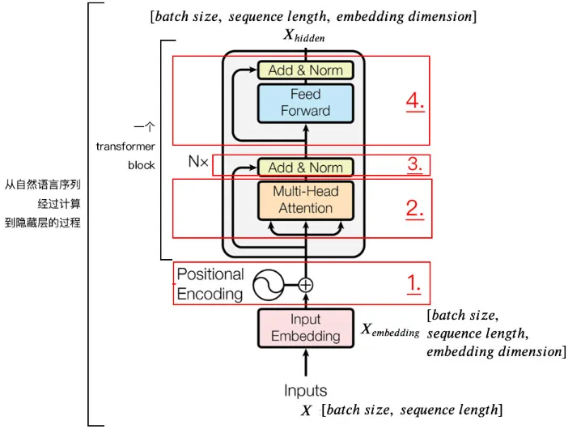
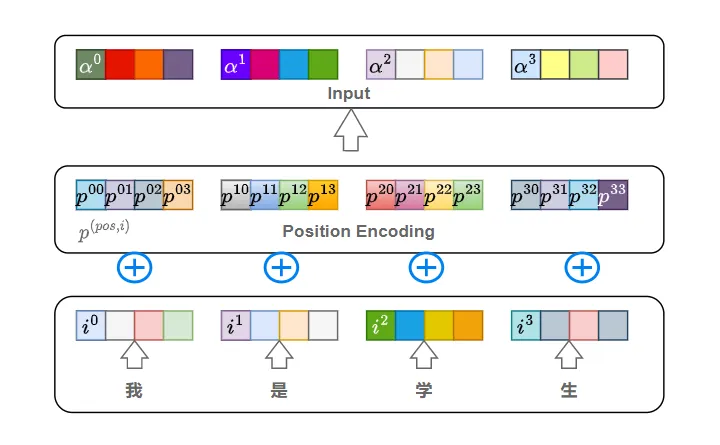
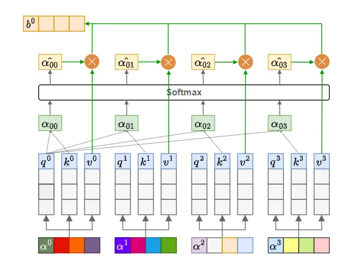
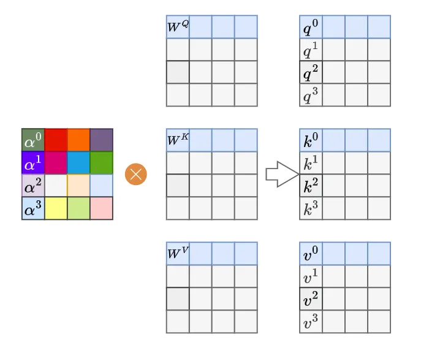
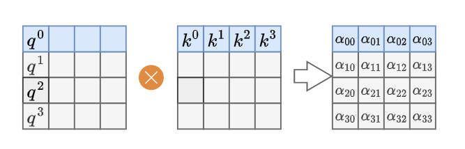
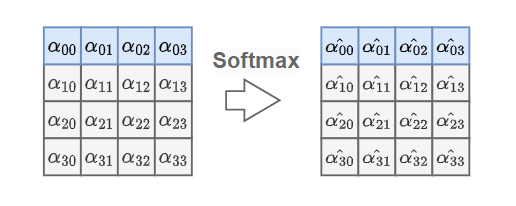
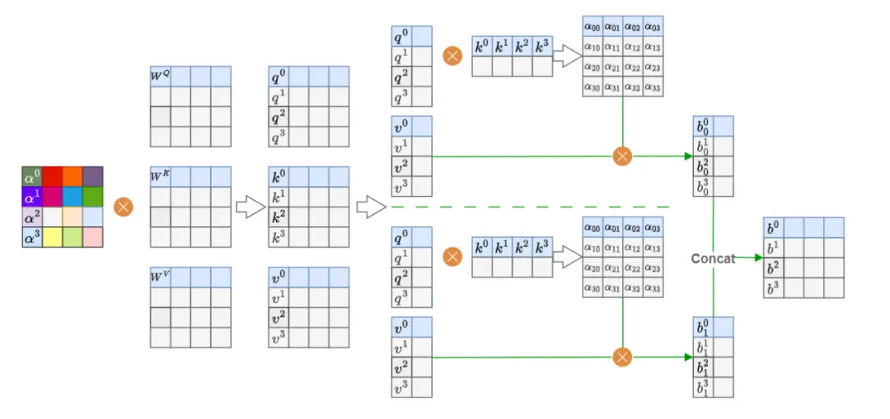
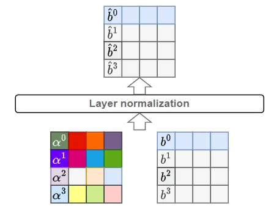

https://mp.weixin.qq.com/s/XFniIyQcrxambld5KmXr6Q

#### 回顾

首先我们先回顾一下Transformer原理。宏观层面，Transformer可以看成是一个黑箱操作的序列到序列（seq2seq）模型。例如，在机器翻译中，输入一种语言，经Transformer输出翻译后的另一种语言。

拆开这个黑箱，可以看到模型本质就是一个Encoders-Decoders结构。

- 每个Encoders中分别由6层Encoder组成。(所有Encoder结构完全相同，但是训练参数不同，每个参数是独立训练的，循环执行6次Encode，而不是只训练了一个Encoder然后复制5份)。
- Decoders同理。
- 这里每个Encoders包含6层Encoder，只是论文中Nx=6，实际可以自定义。



Transformer整体架构如下图所示。



其中，

- 编码端：经过词向量层（Input Embedding）和位置编码层（Positional Encoding），得到最终输入，流经自注意力层（Multi-Head Attention）、残差和层归一化（Add&Norm）、前馈神经网络层（Feed Forward）、残差和层归一化（Add&Norm），得到编码端的输出（后续会和解码端进行交互）。
- 解码端：经过词向量层（Output Embedding）和位置编码层（Positional Encoding），得到最终输入，流经掩码自注意力层（Masked Multi-Head Attention，把当前词之后的词全部mask掉）、残差和层归一化（Add&Norm）、交互注意力层（Multi-Head Attention，把编码端的输出和解码端的信息进行交互，Q矩阵来自解码端，K、V矩阵来自编码端的输出）、残差和层归一化（Add&Norm）、前馈神经网络层（Feed Forward）、残差和层归一化（Add&Norm），得到解码端的输出。


#### Encoder



下面还是以机器翻译("我是学生"->"I am a student")为例说明。

对于上图中，整个模型的输入即为"我是学生"，目标是将其翻译为"I am a student"，但是计算机是无法识别"我是学生"的，需要将其转化为二进制形式，再送入模型。

将中文转换为计算机可以识别的向量通常有两种方法：

- One Hot编码：形成高维向量，对于中文来说，汉字的数量就是向量的维度，然后是哪个字就将对应位置变为1，其它位置变为0，以此来表示一句话。
- Embedding词嵌入：通过网络进行训练或者通过一些训练好的模型将其转化成连续性的向量。

一般来说第二种方法使用较多，因为第一种有几个缺点，第一个就是每个字都是相互独立的，缺少语义联系信息，第二就是汉字数量太多，会导致生成的维度过大，占用系统内存。

##### 输入Input

输入Inputs维度是[batch size,sequence length]，经Word2Vec，转换为计算机可以识别的Input Embedding，论文中每个词对应一个512维度的向量，维度是[batch_size,sequence_length,embedding_dimmension]。batch size指的是句子数，sequence length指的是输入的句子中最长的句子的字数，embedding_dimmension是词向量长度。



如上图所示，以机器翻译("我是学生"->"I am a student")为例，首先对输入的文字进行Word Embedding处理，每个字（词）用一个连续型向量表示（这里定义的是4维向量），称为词向量。这样一个句子，也就是嵌入后的输入向量input Embedding就可以用一个矩阵表示(4*4维，序列长度为4，每个字用4维向量表示)。input Embedding加上位置信息得到编码器的输入

矩阵。

「为什么需要在input Embedding加上位置信息？」 与RNN相比，RNN是一个字一个字输入，自然可以保留每个字的顺序关系信息，而Transformer使用的是自注意力机制来提取信息，一个句子中的每个字/词是并行计算，虽然处理每个字的时候考虑到了所有字对其的影响，但是并没有考虑到各个字相互之间的位置信息，也就是上下文。所以需要引入位置信息。

Transformer中使用Positional Encoding表示每个字/词的位置信息。定义如下：

```math
PE_{(pos, 2i)}   = sin(pos / 10000^{2i/d_{model}}) \\
PE_{(pos, 2i+1)} = cos(pos / 10000^{2i/d_{model}})
```

- pos：当前位置（坐标）。例如 $P^{03}$，表示第1个字，pos=0；$P^{13}$ ，表示第2个字，pos=1。
- $PE_{(pos, i)}$ 表示pos位置处的字的Positional Encoding向量，该向量可以用来给句子中每个字提供位置信息。换句话说，就是我们通过注入每个字的位置信息，增强了模型输入。
- i：维度索引（0 ≤ i < $d_{model}/2$ ）
- d_model：嵌入维度,例如上述示例定义的4，例如论文中的512


例如 $P^{22}$ 表示第3个字(pos=2) “学” 的第3维度(i=2)，对应的值就是 
```math
PE_{2,2}=sin(\frac{2}{ 10000^{ \frac {2}{4}}})
```


例如 $P^{13}$ 表示第2个字(pos=1) “是” 的第4维度(i=3)，对应的值就是 
```math
PE_{1,3}=cos(\frac{1}{ 10000^{ \frac {2}{4}}})
```

假设词向量Embedding的维度是6，即 $d_{model}=6$ ，根据上面的公式：

pos = 0 的情况

```math
PE_{0} = \begin{bmatrix} \sin(\frac{1}{10000^\frac{0}{6}} \cdot 0), \\ \cos(\frac{1}{10000^\frac{0}{6}} \cdot 0), \\ \sin(\frac{1}{10000^\frac{2}{6}} \cdot 0), \\ \cos(\frac{1}{10000^\frac{2}{6}} \cdot 0), \\ \sin(\frac{1}{10000^\frac{4}{6}} \cdot 0), \\ \cos(\frac{1}{10000^\frac{4}{6}}\cdot 0) \\ \end{bmatrix}  =  \begin{bmatrix} 0, \\ 1, \\0, \\ 1, \\ 0, \\ 1 \end{bmatrix}
```

pos = 1 的情况

```math

PE_{1} = \begin{bmatrix} \sin(\frac{1}{10000^\frac{0}{6}} \cdot 1), \\ \cos(\frac{1}{10000^\frac{0}{6}} \cdot 1), \\ \sin(\frac{1}{10000^\frac{2}{6}} \cdot 1), \\ \cos(\frac{1}{10000^\frac{2}{6}} \cdot 1), \\ \sin(\frac{1}{10000^\frac{4}{6}} \cdot 1), \\ \cos(\frac{1}{10000^\frac{4}{6}}\cdot 1) \\ \end{bmatrix}  =  \begin{bmatrix} 0.8414709848, \\ 0.54030230586, \\0.04639922346, \\ 0.99892297604, \\ 0.00215443302, \\ 0.9999976792 \end{bmatrix}
```

pos = 2 的情况


```math

PE_{2} = \begin{bmatrix} \sin(\frac{1}{10000^\frac{0}{6}} \cdot 2), \\ \cos(\frac{1}{10000^\frac{0}{6}} \cdot 2), \\ \sin(\frac{1}{10000^\frac{2}{6}} \cdot 2), \\ \cos(\frac{1}{10000^\frac{2}{6}} \cdot 2), \\ \sin(\frac{1}{10000^\frac{4}{6}} \cdot 2), \\ \cos(\frac{1}{10000^\frac{4}{6}}\cdot 2) \\ \end{bmatrix}  =  \begin{bmatrix} 0.90929742682, \\-0.41614683654, \\0.09269850077, \\ 0.99569422412, \\ 0.00430885604, \\ 0.99999071683\end{bmatrix}
```

```python
position = paddle.arange(0, 6, dtype='float32').unsqueeze(1)
div_term = paddle.exp(paddle.arange(0, 6, 2) * (-math.log(10000.0) / 6)) 
```


在2D中，我们有两个坐标：行（height）和列（width）。因此，我们可以分别为行和列构建位置嵌入，然后将它们拼接起来或者相加。常见的做法是分别构建两个方向的位置嵌入，然后按元素相加。


对于2D图像，DETR将2D坐标视为两个独立的1D坐标，然后分别计算位置嵌入（每个方向嵌入的维度是embed_dim/2），最后拼接起来得到embed_dim维的位置嵌入。具体如下：


 步骤：
  1. 确定网格的高度H和宽度W。
  2. 确定嵌入的维度d_model（必须为偶数，因为要分成两个方向）。
  3. 分别构建x轴（宽度方向）和y轴（高度方向）的位置编码，每个轴的位置编码维度为d_model//2。
  4. 将两个位置编码在最后一个维度拼接，得到每个位置d_model维的嵌入。


**具体实现**：

第一步：构建div_term，用于计算频率。
```    
div_term = torch.exp(torch.arange(0, self.embed_dim, 2).float() * (-math.log(10000.0) / self.embed_dim)
```


> 注意：这里我们每个方向的位置嵌入维度为d_model//2，因此每个方向需要d_model//2个频率。每个频率对应一个正弦和余弦对（在位置编码中，每个频率会生成两个值：正弦和余弦，所以一个频率占两个维度？不对，实际上在1D位置嵌入中，每个位置嵌入的每个偶数索引用正弦，奇数索引用余弦。所以一个频率分量会出现在两个连续的维度上。因此，我们需要d_model//2个频率分量来生成d_model//2维的位置嵌入（注意：这里每个频率分量对应两个维度，但这里我们每个方向只生成d_model//2维的位置嵌入，所以需要d_model//4个频率分量？）

> 实际上，在1D位置嵌入中，如果我们想要一个d维的位置嵌入，我们只需要d/2个频率分量（因为每个分量产生两个值：一个正弦，一个余弦）。因此，对于每个方向（x或y），我们需要d_model//4个频率分量？不对，因为每个方向的位置嵌入维度是d_model//2，所以需要d_model//4个频率分量（每个分量生成两个值，一共d_model//2个值）。

> 所以，div_term的长度为d_model//4。


例如 如果 d_model等于256， embed_dim为 128, 所有div_term 计算如下

```
div_term = torch.exp(torch.arange(0, self.embed_dim, 2).float() * (-math.log(10000.0) / self.embed_dim)
# div_term.shape = [64], 即上述等式等于如下

assert d_model % 4 == 0, 'Embed dimension must be divisible by 4 for 2D sin-cos position embedding'
pos_dim = d_model // 4
# # 计算频率向量 (每个方向使用 d_model//2//2 个频率)
omega = paddle.arange(pos_dim, dtype=paddle.float32) / pos_dim
omega = 1. / (temperature**omega)

```

第二步：分别计算x轴和y轴的位置编码。


对于x轴（宽度方向）：

```
pos_x = torch.arange(0, W).unsqueeze(1)   # (W, 1)
pe_x = torch.zeros(W, d_model//2)         # 初始化，后面填充
# 计算位置编码
pe_x[:, 0::2] = torch.sin(pos_x * div_term)   # 从0开始，每隔一个位置赋值给偶数索引
pe_x[:, 1::2] = torch.cos(pos_x * div_term)   # 从1开始，每隔一个位置赋值给奇数索引
```
> 但是注意：这里div_term的形状是(1, d_model//4)，而pos_x的形状是(W,1)，所以pos_x * div_term 的形状为(W, d_model//4)。然后我们将其赋值给pe_x的偶数索引（0,2,4,..., d_model//2-2）和奇数索引（1,3,5,..., d_model//2-1）。这样，pe_x的每个位置有d_model//2维。
    
同样，对于y轴（高度方向）：

第三步：将x轴和y轴的位置编码扩展到整个网格。

第四步：将两个位置编码在最后一个维度拼接

```
pe = torch.cat([pe_y, pe_x], dim=-1)  # (H, W, d_model)
```


##### 自注意力机制(Self Attention Mechanism)

注意力机制，顾名思义，就是我们对某件事或某个人或物的关注重点。举个生活中的例子，当我们阅读一篇文章时，并非每个词都会被同等重视，我们会更关注那些关键的、与上下文紧密相关的词语，而非每个停顿或者辅助词。

对于机器来说其实就是赋予多少权重(比如0-1之间的小数)，越重要的地方或者越相关的地方赋予的权重越高。

注意力机制的实现思想是先计算第1个字与句中每个字的注意力分数（包括第1个字），再用求得的注意力分数与对应字的信息相乘，并相加，得到的结果就是第1个字与句子中所有字的加权和，第2个字、第3个字...以此类推。



如上图所示，以包含位置信息的词向量 $a^i$ 作为Self Attention Mechanism的输入。 $a^i$ 即为一句话中第i+1个词的词向量。 $a^i$ 分别乘以 $W^Q$ 、 $W^K$ 、 $W^V$ 三个矩阵，得到 $q^i$ 、 $k^i$ 、 $v^i$ 。其中，

    q是查询向量
    k是词的“被查”向量
    v是词的“内容”向量


下来计算每个字的注意力信息。以第1个字与句子中所有字的注意力信息为例，首先 $q^0$ 分别乘以 $k^0$ 、 $k^1$ 、 $k^2$ 、 $k^3$ ，得到4个常数注意力值 $a_{00}$ 、 $a_{01}$ 、$a_{02}$ 、$a_{03}$ ，再对其分别经过Softmax归一化，得到第1个字与所有字的注意力分数 $\hat{a_{00}}$ 、 $\hat{a_{01}}$ 、 $\hat{a_{02}}$ 、 $\hat{a_{03}}$ ，它们的和为1，最后再用注意力分数与对应的字信息、、、相乘，即可得到第1个字与句中所有字的加权信息。加权和：

```math
b^0=\hat{\alpha_{00}}*v^0+\hat{\alpha_{01}}*v^1+\hat{\alpha_{02}}*v^2+\hat{\alpha_{03}}*v^3
```
第2、3、4个字与句子中所有字的加权和 $b^1、b^2、b^3$

以此类推。

如上所述，即为注意力机制的思想。

实际中计算机为了加速计算，通常采用矩阵计算思想。


**矩阵计算思想**

如下图所示，首先词向量矩阵 $a^i$ 分别乘以 $W^Q$ 、 $W^K$ 、 $W^V$ 三个矩阵，得到 $q^i$ 、 $k^i$ 、 $v^i$ 。其中 $W^Q$ 、 $W^K$ 、 $W^V$ 矩阵的维度是[词向量长度，词向量长度]。




再用q矩阵乘以k矩阵得到注意力值矩阵 $a$ ，如下图所示。其中，

```math
a_{i,j} = \frac{q*k^T}{\sqrt{d}}
```

- $k^T$ :k矩阵的转置
- d：词向量长度。这里是4，论文中是512。
> 将点积分数除以一个缩放因子（通常是键向量维度 d_k 的平方根 sqrt(d_k)）。这有助于防止点积结果过大导致 softmax 梯度过小



然后， $a$ 矩阵每一行，经过Softmax计算出注意力分数矩阵 $\hat{a_{ij}}$。公式如下：

```math
\hat{\alpha}_{i,j} = \frac{(i,j)}{\sum_{j=0}^{j=s}(i,)}
```
这里，s=3。
> 注： $\hat{a_{ij}}$ 矩阵每一行的分数值和为1。



最后，用注意力分数矩阵 $\hat{a_{ij}}$ 乘以 $v^j$ 矩阵得到输出矩阵 $b^j$，其中，

```math
i=\sum_{j=0}^{j=s}\hat{\alpha}^j_{i,j} \\

b^0=\hat{\alpha}_{00}*v_0+\hat{\alpha}_{01}*v_1+\hat{\alpha}_{02}*v_2+\hat{\alpha}_{03}*v_3
```

即为注意力分数矩阵 $\hat{a_{ij}}$  与 $v^j$ 矩阵的点积，也是加权和。以上就是注意力机制计算的完整过程。


##### 多头注意力机制（Multi-Head Attention ）

多头注意力机制即就是把上述的 $q^i$ 、 $k^i$ 、 $v^i$ 三个矩阵从特征维度(词向量长度)上拆分为形状相同的小矩阵，如下图所示，拆分为2个形状相同的小矩阵，即为二头注意力。本例中，句子长度为4，词向量维度是4，小矩阵维度即为[4,4/2=2]。接下来以上述方式计算2个b矩阵，再将每个Head Attention计算出来的b矩阵拼接，即为最终的注意力矩阵。

注：论文中句子长度为5，词向量维度是512，将 $q^i$ 、 $k^i$ 、 $v^i$ 三个矩阵拆分成了8个形状相同的小矩阵，也就是8头注意力，小矩阵维度为[5,512/8=64]。



##### Add & Layer normalization

Add采用残差神经网络思想，也就是Multi-Head Attention的输入 $a$ 矩阵直接与输出b相加，这样可以让网络训练的更深，得到 $\bar{b}$ 矩阵，再经过Layer normalization归一化处理，加快训练速度，使得 $\bar{b}$ 的每一行也就是每个句子归一化为标准正态分布，输出为 $\hat{b}$ 。公式如下：

- 均值： $μ_i = \frac{1}{s}\sum_{j=1}^s{b_{ij}}$ ，其中，s是 $\bar{b_i}$ 的长度。
- 方差： $\sigma_i=\frac{1}{s}\sum_{j=0}^s(b_{ij}-μ_i)^2$
- 归一化： $LayerNorm(x)=\frac{b_{ij}-μ_i}{\sqrt{\sigma_i+\epsilon}}*\gamma+\beta$




##### Feed Forward前馈神经网络

将Add & Layer normalization输出 $\bar{b}$ ，经过两个全连接层（第一层的激活函数为 Relu，第二层不使用激活函数），再经过Add & Layer normalization得到最后输出矩阵O。

