### Transformer
#### 回顾

首先我们先回顾一下Transformer原理。宏观层面，Transformer可以看成是一个黑箱操作的序列到序列（seq2seq）模型。例如，在机器翻译中，输入一种语言，经Transformer输出翻译后的另一种语言。

拆开这个黑箱，可以看到模型本质就是一个Encoders-Decoders结构。

- 每个Encoders中分别由6层Encoder组成。(所有Encoder结构完全相同，但是训练参数不同，每个参数是独立训练的，循环执行6次Encode，而不是只训练了一个Encoder然后复制5份)。
- Decoders同理。
- 这里每个Encoders包含6层Encoder，只是论文中Nx=6，实际可以自定义。

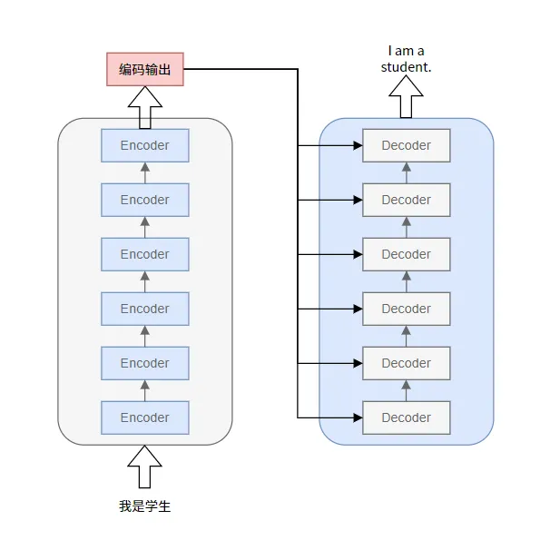

Transformer整体架构如下图所示。

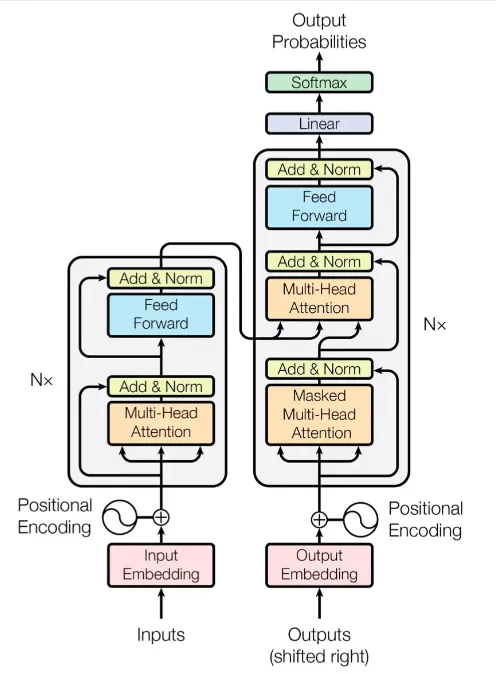

其中，

- 编码端：经过词向量层（Input Embedding）和位置编码层（Positional Encoding），得到最终输入，流经自注意力层（Multi-Head Attention）、残差和层归一化（Add&Norm）、前馈神经网络层（Feed Forward）、残差和层归一化（Add&Norm），得到编码端的输出（后续会和解码端进行交互）。
- 解码端：经过词向量层（Output Embedding）和位置编码层（Positional Encoding），得到最终输入，流经掩码自注意力层（Masked Multi-Head Attention，把当前词之后的词全部mask掉）、残差和层归一化（Add&Norm）、交互注意力层（Multi-Head Attention，把编码端的输出和解码端的信息进行交互，Q矩阵来自解码端，K、V矩阵来自编码端的输出）、残差和层归一化（Add&Norm）、前馈神经网络层（Feed Forward）、残差和层归一化（Add&Norm），得到解码端的输出。


#### Encoder

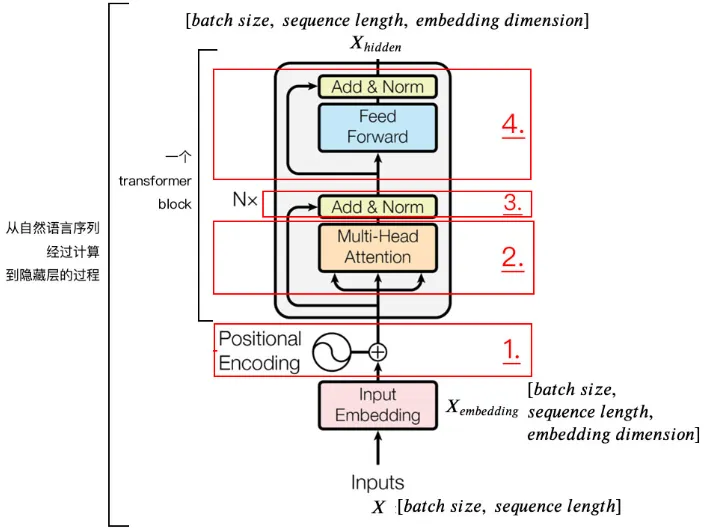

下面还是以机器翻译("我是学生"->"I am a student")为例说明。

对于上图中，整个模型的输入即为"我是学生"，目标是将其翻译为"I am a student"，但是计算机是无法识别"我是学生"的，需要将其转化为二进制形式，再送入模型。

将中文转换为计算机可以识别的向量通常有两种方法：

- One Hot编码：形成高维向量，对于中文来说，汉字的数量就是向量的维度，然后是哪个字就将对应位置变为1，其它位置变为0，以此来表示一句话。
- Embedding词嵌入：通过网络进行训练或者通过一些训练好的模型将其转化成连续性的向量。

一般来说第二种方法使用较多，因为第一种有几个缺点，第一个就是每个字都是相互独立的，缺少语义联系信息，第二就是汉字数量太多，会导致生成的维度过大，占用系统内存。

##### 输入Input

输入Inputs维度是[batch size,sequence length]，经Word2Vec，转换为计算机可以识别的Input Embedding，论文中每个词对应一个512维度的向量，维度是[batch_size,sequence_length,embedding_dimmension]。batch size指的是句子数，sequence length指的是输入的句子中最长的句子的字数，embedding_dimmension是词向量长度。

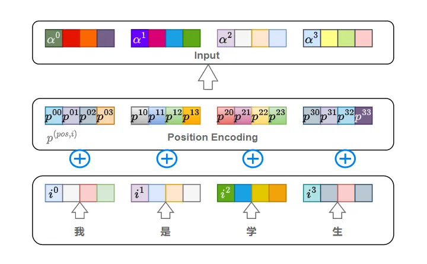

如上图所示，以机器翻译("我是学生"->"I am a student")为例，首先对输入的文字进行Word Embedding处理，每个字（词）用一个连续型向量表示（这里定义的是4维向量），称为词向量。这样一个句子，也就是嵌入后的输入向量input Embedding就可以用一个矩阵表示(4*4维，序列长度为4，每个字用4维向量表示)。input Embedding加上位置信息得到编码器的输入

矩阵。

「为什么需要在input Embedding加上位置信息？」 与RNN相比，RNN是一个字一个字输入，自然可以保留每个字的顺序关系信息，而Transformer使用的是自注意力机制来提取信息，一个句子中的每个字/词是并行计算，虽然处理每个字的时候考虑到了所有字对其的影响，但是并没有考虑到各个字相互之间的位置信息，也就是上下文。所以需要引入位置信息。

Transformer中使用Positional Encoding表示每个字/词的位置信息。定义如下：

```math
PE_{(pos, 2i)}   = sin(pos / 10000^{2i/d_{model}}) \\
PE_{(pos, 2i+1)} = cos(pos / 10000^{2i/d_{model}})
```

- pos：当前位置（坐标）。例如 $P^{03}$，表示第1个字，pos=0；$P^{13}$ ，表示第2个字，pos=1。
- $PE_{(pos, i)}$ 表示pos位置处的字的Positional Encoding向量，该向量可以用来给句子中每个字提供位置信息。换句话说，就是我们通过注入每个字的位置信息，增强了模型输入。
- i：维度索引（0 ≤ i < $d_{model}/2$ ）
- d_model：嵌入维度,例如上述示例定义的4，例如论文中的512


例如 $P^{22}$ 表示第3个字(pos=2) “学” 的第3维度(i=2)，对应的值就是 
```math
PE_{2,2}=sin(\frac{2}{ 10000^{ \frac {2}{4}}})
```


例如 $P^{13}$ 表示第2个字(pos=1) “是” 的第4维度(i=3)，对应的值就是 
```math
PE_{1,3}=cos(\frac{1}{ 10000^{ \frac {2}{4}}})
```

假设词向量Embedding的维度是6，即 $d_{model}=6$ ，根据上面的公式：

pos = 0 的情况

```math
PE_{0} = \begin{bmatrix} \sin(\frac{1}{10000^\frac{0}{6}} \cdot 0), \\ \cos(\frac{1}{10000^\frac{0}{6}} \cdot 0), \\ \sin(\frac{1}{10000^\frac{2}{6}} \cdot 0), \\ \cos(\frac{1}{10000^\frac{2}{6}} \cdot 0), \\ \sin(\frac{1}{10000^\frac{4}{6}} \cdot 0), \\ \cos(\frac{1}{10000^\frac{4}{6}}\cdot 0) \\ \end{bmatrix}  =  \begin{bmatrix} 0, \\ 1, \\0, \\ 1, \\ 0, \\ 1 \end{bmatrix}
```

pos = 1 的情况

```math

PE_{1} = \begin{bmatrix} \sin(\frac{1}{10000^\frac{0}{6}} \cdot 1), \\ \cos(\frac{1}{10000^\frac{0}{6}} \cdot 1), \\ \sin(\frac{1}{10000^\frac{2}{6}} \cdot 1), \\ \cos(\frac{1}{10000^\frac{2}{6}} \cdot 1), \\ \sin(\frac{1}{10000^\frac{4}{6}} \cdot 1), \\ \cos(\frac{1}{10000^\frac{4}{6}}\cdot 1) \\ \end{bmatrix}  =  \begin{bmatrix} 0.8414709848, \\ 0.54030230586, \\0.04639922346, \\ 0.99892297604, \\ 0.00215443302, \\ 0.9999976792 \end{bmatrix}
```

pos = 2 的情况


```math

PE_{2} = \begin{bmatrix} \sin(\frac{1}{10000^\frac{0}{6}} \cdot 2), \\ \cos(\frac{1}{10000^\frac{0}{6}} \cdot 2), \\ \sin(\frac{1}{10000^\frac{2}{6}} \cdot 2), \\ \cos(\frac{1}{10000^\frac{2}{6}} \cdot 2), \\ \sin(\frac{1}{10000^\frac{4}{6}} \cdot 2), \\ \cos(\frac{1}{10000^\frac{4}{6}}\cdot 2) \\ \end{bmatrix}  =  \begin{bmatrix} 0.90929742682, \\-0.41614683654, \\0.09269850077, \\ 0.99569422412, \\ 0.00430885604, \\ 0.99999071683\end{bmatrix}
```

```python
position = paddle.arange(0, 6, dtype='float32').unsqueeze(1)
div_term = paddle.exp(paddle.arange(0, 6, 2) * (-math.log(10000.0) / 6)) 
```


在2D中，我们有两个坐标：行（height）和列（width）。因此，我们可以分别为行和列构建位置嵌入，然后将它们拼接起来或者相加。常见的做法是分别构建两个方向的位置嵌入，然后按元素相加。


对于2D图像，DETR将2D坐标视为两个独立的1D坐标，然后分别计算位置嵌入（每个方向嵌入的维度是embed_dim/2），最后拼接起来得到embed_dim维的位置嵌入。具体如下：


 步骤：
  1. 确定网格的高度H和宽度W。
  2. 确定嵌入的维度d_model（必须为偶数，因为要分成两个方向）。
  3. 分别构建x轴（宽度方向）和y轴（高度方向）的位置编码，每个轴的位置编码维度为d_model//2。
  4. 将两个位置编码在最后一个维度拼接，得到每个位置d_model维的嵌入。


**具体实现**：

第一步：构建div_term，用于计算频率。
```    
div_term = torch.exp(torch.arange(0, self.embed_dim, 2).float() * (-math.log(10000.0) / self.embed_dim)
```


> 注意：这里我们每个方向的位置嵌入维度为d_model//2，因此每个方向需要d_model//2个频率。每个频率对应一个正弦和余弦对（在位置编码中，每个频率会生成两个值：正弦和余弦，所以一个频率占两个维度？不对，实际上在1D位置嵌入中，每个位置嵌入的每个偶数索引用正弦，奇数索引用余弦。所以一个频率分量会出现在两个连续的维度上。因此，我们需要d_model//2个频率分量来生成d_model//2维的位置嵌入（注意：这里每个频率分量对应两个维度，但这里我们每个方向只生成d_model//2维的位置嵌入，所以需要d_model//4个频率分量？）

> 实际上，在1D位置嵌入中，如果我们想要一个d维的位置嵌入，我们只需要d/2个频率分量（因为每个分量产生两个值：一个正弦，一个余弦）。因此，对于每个方向（x或y），我们需要d_model//4个频率分量？不对，因为每个方向的位置嵌入维度是d_model//2，所以需要d_model//4个频率分量（每个分量生成两个值，一共d_model//2个值）。

> 所以，div_term的长度为d_model//4。


例如 如果 d_model等于256， embed_dim为 128, 所有div_term 计算如下

```
div_term = torch.exp(torch.arange(0, self.embed_dim, 2).float() * (-math.log(10000.0) / self.embed_dim)
# div_term.shape = [64], 即上述等式等于如下

assert d_model % 4 == 0, 'Embed dimension must be divisible by 4 for 2D sin-cos position embedding'
pos_dim = d_model // 4
# # 计算频率向量 (每个方向使用 d_model//2//2 个频率)
omega = paddle.arange(pos_dim, dtype=paddle.float32) / pos_dim
omega = 1. / (temperature**omega)

```

第二步：分别计算x轴和y轴的位置编码。


对于x轴（宽度方向）：

```
pos_x = torch.arange(0, W).unsqueeze(1)   # (W, 1)
pe_x = torch.zeros(W, d_model//2)         # 初始化，后面填充
# 计算位置编码
pe_x[:, 0::2] = torch.sin(pos_x * div_term)   # 从0开始，每隔一个位置赋值给偶数索引
pe_x[:, 1::2] = torch.cos(pos_x * div_term)   # 从1开始，每隔一个位置赋值给奇数索引
```
> 但是注意：这里div_term的形状是(1, d_model//4)，而pos_x的形状是(W,1)，所以pos_x * div_term 的形状为(W, d_model//4)。然后我们将其赋值给pe_x的偶数索引（0,2,4,..., d_model//2-2）和奇数索引（1,3,5,..., d_model//2-1）。这样，pe_x的每个位置有d_model//2维。
    
同样，对于y轴（高度方向）：

第三步：将x轴和y轴的位置编码扩展到整个网格。

第四步：将两个位置编码在最后一个维度拼接

```
pe = torch.cat([pe_y, pe_x], dim=-1)  # (H, W, d_model)
```


##### 自注意力机制(Self Attention Mechanism)

注意力机制，顾名思义，就是我们对某件事或某个人或物的关注重点。举个生活中的例子，当我们阅读一篇文章时，并非每个词都会被同等重视，我们会更关注那些关键的、与上下文紧密相关的词语，而非每个停顿或者辅助词。

对于机器来说其实就是赋予多少权重(比如0-1之间的小数)，越重要的地方或者越相关的地方赋予的权重越高。

注意力机制的实现思想是先计算第1个字与句中每个字的注意力分数（包括第1个字），再用求得的注意力分数与对应字的信息相乘，并相加，得到的结果就是第1个字与句子中所有字的加权和，第2个字、第3个字...以此类推。

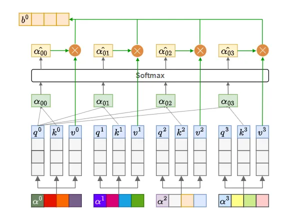

如上图所示，以包含位置信息的词向量 $a^i$ 作为Self Attention Mechanism的输入。 $a^i$ 即为一句话中第i+1个词的词向量。 $a^i$ 分别乘以 $W^Q$ 、 $W^K$ 、 $W^V$ 三个矩阵，得到 $q^i$ 、 $k^i$ 、 $v^i$ 。其中，

    q是查询向量
    k是词的“被查”向量
    v是词的“内容”向量


下来计算每个字的注意力信息。以第1个字与句子中所有字的注意力信息为例，首先 $q^0$ 分别乘以 $k^0$ 、 $k^1$ 、 $k^2$ 、 $k^3$ ，得到4个常数注意力值 $a_{00}$ 、 $a_{01}$ 、$a_{02}$ 、$a_{03}$ ，再对其分别经过Softmax归一化，得到第1个字与所有字的注意力分数 $\hat{a_{00}}$ 、 $\hat{a_{01}}$ 、 $\hat{a_{02}}$ 、 $\hat{a_{03}}$ ，它们的和为1，最后再用注意力分数与对应的字信息、、、相乘，即可得到第1个字与句中所有字的加权信息。加权和：

```math
b^0=\hat{\alpha_{00}}*v^0+\hat{\alpha_{01}}*v^1+\hat{\alpha_{02}}*v^2+\hat{\alpha_{03}}*v^3
```
第2、3、4个字与句子中所有字的加权和 $b^1、b^2、b^3$

以此类推。

如上所述，即为注意力机制的思想。

实际中计算机为了加速计算，通常采用矩阵计算思想。


**矩阵计算思想**

如下图所示，首先词向量矩阵 $a^i$ 分别乘以 $W^Q$ 、 $W^K$ 、 $W^V$ 三个矩阵，得到 $q^i$ 、 $k^i$ 、 $v^i$ 。其中 $W^Q$ 、 $W^K$ 、 $W^V$ 矩阵的维度是[词向量长度，词向量长度]。

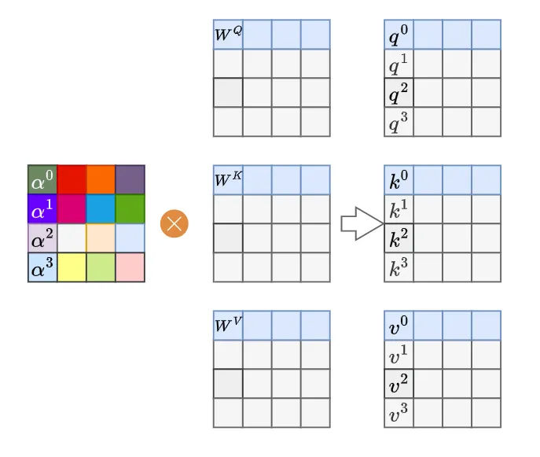


再用q矩阵乘以k矩阵得到注意力值矩阵 $a$ ，如下图所示。其中，

```math
a_{i,j} = \frac{q*k^T}{\sqrt{d}}
```

- $k^T$ :k矩阵的转置
- d：词向量长度。这里是4，论文中是512。
> 将点积分数除以一个缩放因子（通常是键向量维度 d_k 的平方根 sqrt(d_k)）。这有助于防止点积结果过大导致 softmax 梯度过小

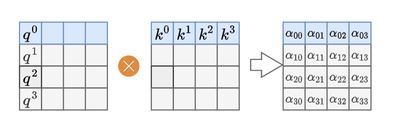

然后， $a$ 矩阵每一行，经过Softmax计算出注意力分数矩阵 $\hat{a_{ij}}$。公式如下：

```math
\hat{\alpha}_{i,j} = \frac{(i,j)}{\sum_{j=0}^{j=s}(i,)}
```
这里，s=3。
> 注： $\hat{a_{ij}}$ 矩阵每一行的分数值和为1。

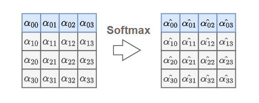

最后，用注意力分数矩阵 $\hat{a_{ij}}$ 乘以 $v^j$ 矩阵得到输出矩阵 $b^j$，其中，

```math
i=\sum_{j=0}^{j=s}\hat{\alpha}^j_{i,j} \\

b^0=\hat{\alpha}_{00}*v_0+\hat{\alpha}_{01}*v_1+\hat{\alpha}_{02}*v_2+\hat{\alpha}_{03}*v_3
```

即为注意力分数矩阵 $\hat{a_{ij}}$  与 $v^j$ 矩阵的点积，也是加权和。以上就是注意力机制计算的完整过程。


##### 多头注意力机制（Multi-Head Attention ）

多头注意力机制即就是把上述的 $q^i$ 、 $k^i$ 、 $v^i$ 三个矩阵从特征维度(词向量长度)上拆分为形状相同的小矩阵，如下图所示，拆分为2个形状相同的小矩阵，即为二头注意力。本例中，句子长度为4，词向量维度是4，小矩阵维度即为[4,4/2=2]。接下来以上述方式计算2个b矩阵，再将每个Head Attention计算出来的b矩阵拼接，即为最终的注意力矩阵。

注：论文中句子长度为5，词向量维度是512，将 $q^i$ 、 $k^i$ 、 $v^i$ 三个矩阵拆分成了8个形状相同的小矩阵，也就是8头注意力，小矩阵维度为[5,512/8=64]。

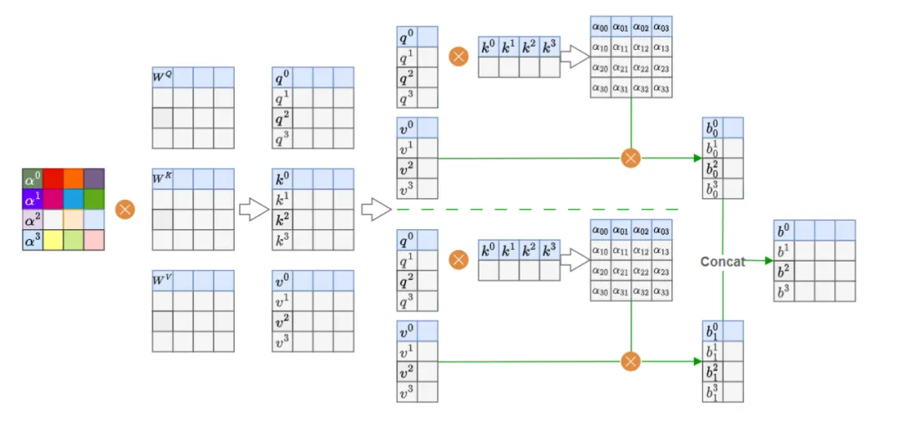

##### Add & Layer normalization

Add采用残差神经网络思想，也就是Multi-Head Attention的输入 $a$ 矩阵直接与输出b相加，这样可以让网络训练的更深，得到 $\bar{b}$ 矩阵，再经过Layer normalization归一化处理，加快训练速度，使得 $\bar{b}$ 的每一行也就是每个句子归一化为标准正态分布，输出为 $\hat{b}$ 。公式如下：

- 均值： $μ_i = \frac{1}{s}\sum_{j=1}^s{b_{ij}}$ ，其中，s是 $\bar{b_i}$ 的长度。
- 方差： $\sigma_i=\frac{1}{s}\sum_{j=0}^s(b_{ij}-μ_i)^2$
- 归一化： $LayerNorm(x)=\frac{b_{ij}-μ_i}{\sqrt{\sigma_i+\epsilon}}*\gamma+\beta$

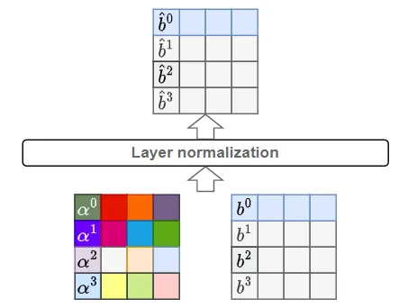


##### Feed Forward前馈神经网络

将Add & Layer normalization输出 $\bar{b}$ ，经过两个全连接层（第一层的激活函数为 Relu，第二层不使用激活函数），再经过Add & Layer normalization得到最后输出矩阵O。


用公式把一个Transformer Encoder block 的计算过程整理一下

- 自注意力机制

  ```math
  Q=XW_{Q} \\
  K=XW_{K} \\
  V=XW_{V} \\
  X_{attention}=selfAttention(Q,K,V)

  ```
- self-attention 残差连接与 Layer Normalization
  ```math
  X_{attention}=LayerNorm(X_{attention})
  ```
- FeedForward，其实就是两层线性映射并用激活函数激活，比如说RELU
  ```math
  X_{hidden}=Linear(RELU(Linear(X_{attention})))
  ```
- FeedForward 残差连接与 Layer Normalization
  ```math
  X_{hidden}=X_{attention}+X_{hidden} \\
  X_{hidden}=LayerNorm(X_{hidden})

  ```


> https://aistudio.baidu.com/projectdetail/10238286
> https://mp.weixin.qq.com/s/XFniIyQcrxambld5KmXr6Q


### Transformer-Vit,DeiT

#### ViT算法综述

论文地址：An Image is Worth 16x16 Words:Transformers for Image Recognition at Scale

之前的算法大都是保持CNN整体结构不变，在CNN中增加attention模块或者使用attention模块替换CNN中的某些部分。ViT算法中，作者提出没有必要总是依赖于CNN，仅仅使用Transformer结构也能够在图像分类任务中表现很好。

受到NLP领域中Transformer成功应用的启发，ViT算法中尝试将标准的Transformer结构直接应用于图像，并对整个图像分类流程进行最少的修改。具体来讲，ViT算法中，会将整幅图像拆分成小图像块，然后把这些小图像块的线性嵌入序列作为Transformer的输入送入网络，然后使用监督学习的方式进行图像分类的训练。ViT算法的整体结构如 图1 所示。


#### 图像分块嵌入

考虑到之前课程中学习的，Transformer结构中，输入需要是一个二维的矩阵，矩阵的形状可以表示为 (N,D)，其中 N 是sequence的长度，而 D 是sequence中每个向量的维度。因此，在ViT算法中，首先需要设法将 `H×W×C` 的三维图像转化为 (N,D) 的二维输入。

ViT中的具体实现方式为：将 `H×W×C` 的图像，变为一个 $N \times (P^2 * C)$ 的序列。这个序列可以看作是一系列展平的图像块，也就是将图像切分成小块后，再将其展平。该序列中一共包含了 $N=HW/P^2$ 个图像块，每个图像块的维度则是 $(P^2*C)$ 。其中 P 是图像块的大小，C 是通道数量。经过如上变换，就可以将 N 视为sequence的长度了。
但是，此时每个图像块的维度是 $(P^2*C)$ ，而我们实际需要的向量维度是 D，因此我们还需要对图像块进行 Embedding。这里 Embedding 的方式非常简单，只需要对每个 $(P^2*C)$ 的图像块做一个线性变换，将维度压缩为 D 即可。

上述对图像进行分块以及 Embedding 的具体方式如 图3 所示


具体代码实现如下所示。其中，使用了大小为 P 的卷积来代替对每个大小为 P 图像块展平后使用全连接进行运算的过程

```python
# 导入环境
import os
import numpy as np
import cv2
from PIL import Image
import paddle
from paddle.io import Dataset
from paddle.nn import Conv2D, MaxPool2D, Linear, Dropout, BatchNorm, AdaptiveAvgPool2D, AvgPool2D
import paddle.nn.functional as F
import paddle.nn as nn

# 图像分块、Embedding
class PatchEmbed(nn.Layer):
    def __init__(self, img_size=224, patch_size=16, in_chans=3, embed_dim=768):
        super().__init__()
        # 原始大小为int，转为tuple，即：img_size原始输入224，变换后为[224,224]
        img_size = to_2tuple(img_size)
        patch_size = to_2tuple(patch_size)
        # 图像块的个数
        num_patches = (img_size[1] // patch_size[1]) * \
            (img_size[0] // patch_size[0])
        self.img_size = img_size
        self.patch_size = patch_size
        self.num_patches = num_patches
        # kernel_size=块大小，即每个块输出一个值，类似每个块展平后使用相同的全连接层进行处理
        # 输入维度为3，输出维度为块向量长度
        # 与原文中：分块、展平、全连接降维保持一致
        # 输出为[B, C, H, W]
        self.proj = nn.Conv2D(
            in_chans, embed_dim, kernel_size=patch_size, stride=patch_size)

    def forward(self, x):
        B, C, H, W = x.shape
        assert H == self.img_size[0] and W == self.img_size[1], \
            "Input image size ({H}*{W}) doesn't match model ({self.img_size[0]}*{self.img_size[1]})."
        # [B, C, H, W] -> [B, C, H*W] ->[B, H*W, C]
        x = self.proj(x).flatten(2).transpose((0, 2, 1))
        return x
```

```
# 向量的维度D为512
# 图像的高和宽分别为 224，224
#  P 是图像块大小为16 ，C输入通道数为3经过卷积输出512 
# N = hw/p*p = 196
>>> a.shape
paddle.Size([1, 3, 224, 224])
>>> conv = nn.Conv2D(3, 512, (16, 16), stride=(16,16))
>>> conv(a).shape
paddle.Size([1, 512, 14, 14])
# [batch,N,D] - [batch,196,512]
>>> conv(a).flatten(2).transpose([0,2,1])
```

#### Multi-head Attention

将图像转化为 $N \times (P^2 * C)$ 的序列后，就可以将其输入到 Tranformer 结构中进行特征提取了。在前面的课程中，我们了解到 Tranformer 结构中最重要的结构就是 Multi-head Attention，即多头注意力结构，如 图4 所示


具有2个head的 Multi-head Attention 结构如 图5 所示。输入 $a^i$ 经过转移矩阵，并切分生成 $q^{(i,1)}$ 、 $q^{(i,2)}$ 、 $k^{(i,1)}$ 、 $k^{(i,2)}$ 、 $v^{(i,1)}$ 、 $v^{(i,2)}$ ，然后 $q^{(i,1)}$ 与 $k^{(i,1)}$  做 attention，得到权重向量 α，将 α与 $v^{(i,1)}$ 进行加权求和，得到最终的 $b^{(i,1)}(i=1,2,…,N)$ ，同理可以得到 $b^{(i,2)}(i=1,2,…,N)$ 。接着将它们拼接起来，通过一个线性层进行处理，得到最终的结果。


其中，使用 $q^{(i,j)}$ 、 $k^{(i,j)}$ 与 $v^{(i,j)}$ 计算 $b^{(i,j)}(i=1,2,…,N)$ 的方法是 Scaled Dot-Product Attention。 结构如 图6 所示。首先使用每个 $q^{(i,j)}$ 去与 $k^{(i,j)}$ 做 attention，这里说的 attention 就是匹配这两个向量有多接近，具体的方式就是计算向量的加权内积，得到 $\alpha_{(i,j)}$ ​。这里的加权内积计算方式如下所示：

```math
\alpha_{(1,i)} =  q^1 * k^i / \sqrt{d} 
```

其中，d 是 q 和 k 的维度，因为 `q*k` 的数值会随着维度的增大而增大，因此除以 $\sqrt{d}$ 的值也就相当于归一化的效果。

接下来，把计算得到的 $\alpha_{(i,j)}$​ 取 softmax 操作，再将其与 $v^{(i,j)}$ 相乘。


```python
# Multi-head Attention
class Attention(nn.Layer):
    def __init__(self,
                 dim,
                 num_heads=8,
                 qkv_bias=False,
                 qk_scale=None,
                 attn_drop=0.,
                 proj_drop=0.):
        super().__init__()
        self.num_heads = num_heads
        head_dim = dim // num_heads
        self.scale = qk_scale or head_dim**-0.5
        # 计算 q,k,v 的转移矩阵
        self.qkv = nn.Linear(dim, dim * 3, bias_attr=qkv_bias)
        self.attn_drop = nn.Dropout(attn_drop)
        # 最终的线性层
        self.proj = nn.Linear(dim, dim)
        self.proj_drop = nn.Dropout(proj_drop)

    def forward(self, x):
        N, C = x.shape[1:]
        # 线性变换
        qkv = self.qkv(x).reshape((-1, N, 3, self.num_heads, C //
                                   self.num_heads)).transpose((2, 0, 3, 1, 4))
        # 分割 query key value
        q, k, v = qkv[0], qkv[1], qkv[2]
        # Scaled Dot-Product Attention
        # Matmul + Scale
        attn = (q.matmul(k.transpose((0, 1, 3, 2)))) * self.scale
        # SoftMax
        attn = nn.functional.softmax(attn, axis=-1)
        attn = self.attn_drop(attn)
        # Matmul
        x = (attn.matmul(v)).transpose((0, 2, 1, 3)).reshape((-1, N, C))
        # 线性变换
        x = self.proj(x)
        x = self.proj_drop(x)
        return x
```

```
# dim = 512 
# [1,192,512]
N, C = x.shape[1:] # N = 192, C = 512

# Linear(in_features=512, out_features=512*3, dtype=float32)
# [1,192,512] -> [1,192,512*3] - [1,192,3,8,64] - [3,1,8,192,64]
# 线性变换输出维度增大3倍就是x向量分别乘以3个同纬度的矩阵 
qkv = self.qkv(x).reshape((-1, N, 3, self.num_heads, C //self.num_heads)).transpose((2, 0, 3, 1, 4))
# 
q, k, v = qkv[0], qkv[1], qkv[2]
# q矩阵乘以k矩阵 。scale= (512/8)**-0.5
attn = (q.matmul(k.transpose((0, 1, 3, 2)))) * self.scale

# 矩阵相乘
[1,8,196,64]->[1,196,8,64]->[1,196,512]
x = (attn.matmul(v)).transpose((0, 2, 1, 3)).reshape((-1, N, C))
```


#### 多层感知机（MLP）

Tranformer 结构中还有一个重要的结构就是 MLP，即多层感知机，如 图7 所示。


多层感知机由输入层、输出层和至少一层的隐藏层构成。网络中各个隐藏层中神经元可接收相邻前序隐藏层中所有神经元传递而来的信息，经过加工处理后将信息输出给相邻后续隐藏层中所有神经元。在多层感知机中，相邻层所包含的神经元之间通常使用“全连接”方式进行连接。多层感知机可以模拟复杂非线性函数功能，所模拟函数的复杂性取决于网络隐藏层数目和各层中神经元数目。多层感知机的结构如 图8 所示。


```python
class Mlp(nn.Layer):
    def __init__(self,
                 in_features,
                 hidden_features=None,
                 out_features=None,
                 act_layer=nn.GELU,
                 drop=0.):
        super().__init__()
        out_features = out_features or in_features
        hidden_features = hidden_features or in_features
        self.fc1 = nn.Linear(in_features, hidden_features)
        self.act = act_layer()
        self.fc2 = nn.Linear(hidden_features, out_features)
        self.drop = nn.Dropout(drop)

    def forward(self, x):
        # 输入层：线性变换
        x = self.fc1(x)
        # 应用激活函数
        x = self.act(x)
        # Dropout
        x = self.drop(x)
        # 输出层：线性变换
        x = self.fc2(x)
        # Dropout
        x = self.drop(x)
        return x
```


#### 定义ViT网络

基础模块构建好后，就可以构建完整的ViT网络了。ViT的完整结构如 图10 所示


在实现完整网络结构之前，还需要给大家介绍几个模块：

1. Class Token

可以看到，假设我们将原始图像切分成 3×33 \times 33×3 共9个小图像块，最终的输入序列长度却是10，也就是说我们这里人为的增加了一个向量进行输入，我们通常将人为增加的这个向量称为 Class Token。那么这个 Class Token 有什么作用呢？

我们可以想象，如果没有这个向量，也就是将 N=9 个向量输入 Transformer 结构中进行编码，我们最终会得到9个编码向量，可对于图像分类任务而言，我们应该选择哪个输出向量进行后续分类呢？

由于选择9个中的哪个都不合适，所以ViT算法中，提出了一个可学习的嵌入向量 Class Token，将它与9个向量一起输入到 Transformer 结构中，输出10个编码向量，然后用这个 Class Token 进行分类预测即可。

其实这里也可以理解为：ViT 其实只用到了 Transformer 中的 Encoder，而并没有用到 Decoder，而 Class Token 的作用就是寻找其他9个输入向量对应的类别。


2. Positional Encoding

按照 Transformer 结构中的位置编码习惯，这个工作也使用了位置编码。不同的是，ViT 中的位置编码没有采用原版 Transformer 中的 sincossincossincos 编码，而是直接设置为**可学习的 Positional Encoding**。对训练好的 Positional Encoding 进行可视化，如 图11 所示。我们可以看到，位置越接近，往往具有更相似的位置编码。此外，出现了行列结构，同一行/列中的 patch 具有相似的位置编码。


```python
class VisionTransformer(nn.Layer):
    def __init__(self,
                 img_size=384,
                 patch_size=16,
                 in_chans=3,
                 class_dim=1000,
                 embed_dim=768,
                 depth=12,
                 num_heads=12,
                 mlp_ratio=4,
                 qkv_bias=False,
                 qk_scale=None,
                 drop_rate=0.,
                 attn_drop_rate=0.,
                 drop_path_rate=0.,
                 norm_layer='nn.LayerNorm',
                 epsilon=1e-5,
                 **args):
        super().__init__()
        self.class_dim = class_dim

        self.num_features = self.embed_dim = embed_dim
        # 图片分块和降维，块大小为patch_size，最终块向量维度为768
        self.patch_embed = PatchEmbed(
            img_size=img_size,
            patch_size=patch_size,
            in_chans=in_chans,
            embed_dim=embed_dim)
        # 分块数量
        num_patches = self.patch_embed.num_patches
        # 可学习的位置编码
        self.pos_embed = self.create_parameter(
            shape=(1, num_patches + 1, embed_dim), default_initializer=zeros_)
        self.add_parameter("pos_embed", self.pos_embed)
        # 人为追加class token，并使用该向量进行分类预测
        self.cls_token = self.create_parameter(
            shape=(1, 1, embed_dim), default_initializer=zeros_)
        self.add_parameter("cls_token", self.cls_token)
        self.pos_drop = nn.Dropout(p=drop_rate)

        dpr = np.linspace(0, drop_path_rate, depth)
        # transformer
        self.blocks = nn.LayerList([
            Block(
                dim=embed_dim,
                num_heads=num_heads,
                mlp_ratio=mlp_ratio,
                qkv_bias=qkv_bias,
                qk_scale=qk_scale,
                drop=drop_rate,
                attn_drop=attn_drop_rate,
                drop_path=dpr[i],
                norm_layer=norm_layer,
                epsilon=epsilon) for i in range(depth)
        ])

        self.norm = eval(norm_layer)(embed_dim, epsilon=epsilon)

        # Classifier head
        self.head = nn.Linear(embed_dim,
                              class_dim) if class_dim > 0 else Identity()

        trunc_normal_(self.pos_embed)
        trunc_normal_(self.cls_token)
        self.apply(self._init_weights)
    # 参数初始化
    def _init_weights(self, m):
        if isinstance(m, nn.Linear):
            trunc_normal_(m.weight)
            if isinstance(m, nn.Linear) and m.bias is not None:
                zeros_(m.bias)
        elif isinstance(m, nn.LayerNorm):
            zeros_(m.bias)
            ones_(m.weight)
    # 获取图像特征
    def forward_features(self, x):
        B = paddle.shape(x)[0]
        # 将图片分块，并调整每个块向量的维度
        x = self.patch_embed(x)
        # 将class token与前面的分块进行拼接
        cls_tokens = self.cls_token.expand((B, -1, -1))
        x = paddle.concat((cls_tokens, x), axis=1)
        # 将编码向量中加入位置编码
        x = x + self.pos_embed
        x = self.pos_drop(x)
        # 堆叠 transformer 结构
        for blk in self.blocks:
            x = blk(x)
        # LayerNorm
        x = self.norm(x)
        # 提取分类 tokens 的输出
        return x[:, 0]

    def forward(self, x):
        # 获取图像特征
        x = self.forward_features(x)
        # 图像分类
        x = self.head(x)
        return x
```

> https://aistudio.baidu.com/projectdetail/10239478


### NaViT

NaViT（Native Resolution Vision Transformer）是Google DeepMind在2023年提出的突破性视觉编码器，它标志着计算机视觉模型从"强迫图像适应模型"向"模型原生适应图像"的根本性范式转变。通过创新的"Patch n' Pack"技术，NaViT能够以完全无损的方式处理任意分辨率和纵横比的图像，打破了传统ViT必须将图像强行调整为固定正方形尺寸的限制。

#### Patch n' Pack的精髓

- 保留原始长宽比：图像以其原始分辨率输入，不再做任何resize或crop；
- 可变序列长度：不同分辨率的图像生成不同数量的patch tokens，例如64×64图像产生16个token，而1024×1024图像则产生4096个token；
- 多图混部于同一序列：将来自不同图像的多个patch序列拼接成一个超长序列，打包后在单个前向传播中同时处理多个样本。

这种设计使NaViT能够在一个计算批次（batch）中混合处理多个不同分辨率、不同长宽比的图像，显著提高了训练效率和计算吞吐量。在其设计下，NaViT-L/16在训练时处理的图像数量是传统ViT的5倍


#### 架构设计

为实现Patch n' Pack并保证模型训练的稳定性，NaViT对标准ViT架构进行了如下修改

- 掩码自注意力与掩码池化

当多个图像被打包进同一序列后，关键在于防止不同图像之间的信息相互干扰。NaViT引入了掩码自注意力（Masked Self-Attention）：每个token只能关注同一图像中其他token的注意力权重，不同图像之间的注意力连接被主动屏蔽。此外，在编码器之上使用掩码池化（Masked Pooling），对每个图像样本内部的token进行池化，输出统一的样本级表示，进一步隔离序列内的不同样本


- 分解式与分数位置嵌入

传统ViT使用固定的1D位置编码，仅适用于正方形图像。当NaViT处理任意分辨率（如800×600、300×1200等）的图像时，传统位置编码难以泛化。

NaViT采用了分解式位置嵌入（Factorized Positional Embedding），将2D空间的位置编码解耦为x坐标和y坐标两个独立的嵌入，随后相加融合。为增强模型在任意分辨率下的外推能力，NaViT进一步探索了分数位置嵌入（Fractional Positional Embedding）——基于相对距离而非绝对索引的新型嵌入方法。实验证明，因子化方法显著优于基线ViT和Pix2struct的学习型二维嵌入，后者在高分辨率外推时表现较弱。

- 多尺度Patch嵌入

NaViT在patch embedding阶段引入了多尺度Patch嵌入（Multi-Scale Patch Embedding），能够动态适应不同尺寸的输入，而不局限于单一patch大小

- 连续Token丢弃

传统token丢弃是对批量中所有样本采用相同的丢弃比例。NaViT的Patch n' Pack技术支持连续token丢弃（Continuous Token Dropping）：每个图像的token丢弃率可以独立变化，既享受丢弃策略带来的训练加速，又保留部分完整图像的语义信息。丢弃率的分布还可以在训练过程中按照预定计划动态调整，实现最大化效率与精度的平衡

- 分辨率采样

NaViT的训练不固守某一固定的图像尺寸，而是从一个预设分布（如U(160, 352)）中随机采样图像的分辨率。这种混合分辨率训练策略，使模型在同一训练过程中同时接触到低分辨率图像（吞吐量高、收敛快）和高分辨率图像（保留更多细节、泛化能力强），在效率与性能之间实现最优平衡


为什么要将图像打包进一个列表处理？ 传统方法需要填充到相同尺寸，浪费大量计算在无用的填充 token 上。NaViT 将所有图像的所有图块 (patch) 全部展平，在内部合并成一个“超长”序列，从根本上消除了计算浪费，极大提升了训练吞吐量

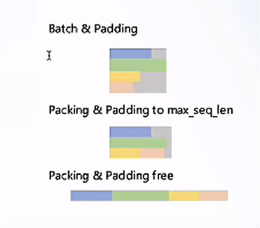


### SigLIP

SigLIP Vision Transformer是谷歌提出的一种视觉语言模型，它的核心是给训练图像-文本模型换了一种更高效的损失函数，让模型更精准地理解图文关系

更准确地说，SiglipVisionTransformer是这套技术里的视觉编码器。它继承了经典的Vision Transformer (ViT) 框架，负责把一张张图片转成AI能懂的“特征向量”

简单来说，SigLIP的图像编码器SiglipVisionTransformer，主要由以下核心部分组成：

- Patch Embedding：将图像分割成固定大小的图像块（如16x16），每个图像块就像文本里的一个“词”
- Transformer层：模型通过这些层逐步抽象图像特征，低层学习纹理、边缘，高层学习物体类别等高级语义
- 输出：最终输出是图像的特征向量，这个向量代表了图像的核心语义


