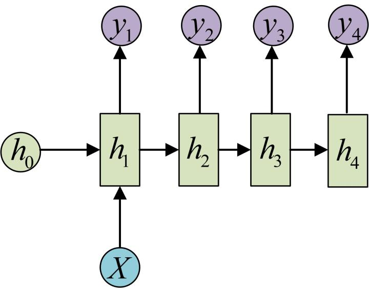
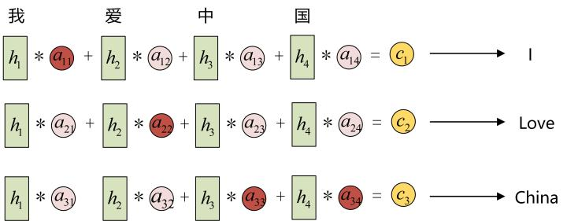
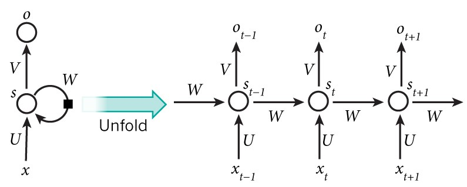
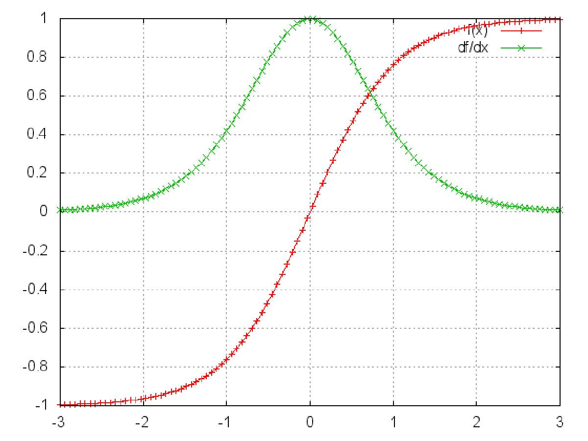
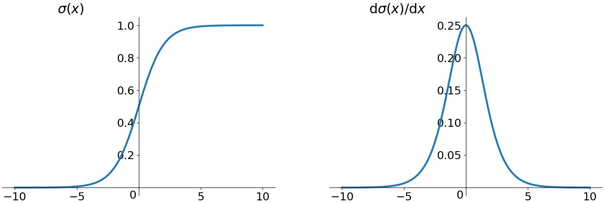
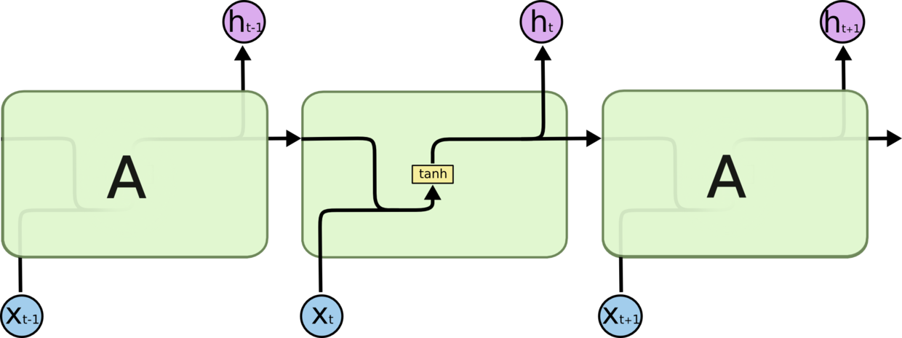
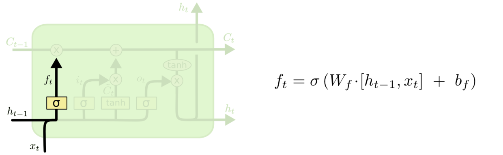
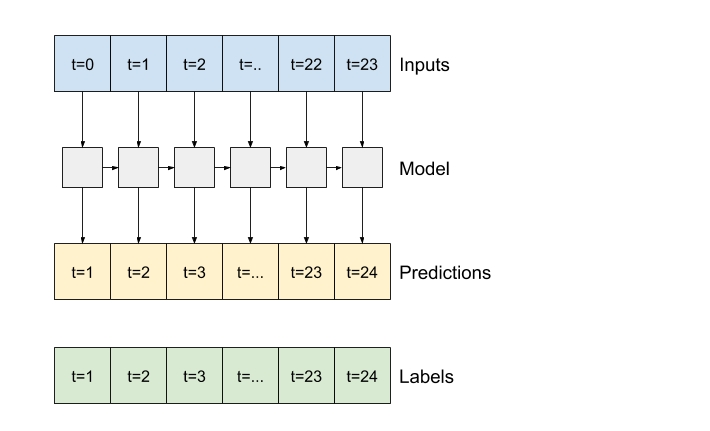

#### 为什么需要RNN？

时间序列数据是指在不同时间点上收集到的数据，这类数据反映了某一事物、现象等随时间的变化状态或程度。一般的神经网络，在训练数据足够、算法模型优越的情况下，给定特定的x，就能得到期望y。其一般处理单个的输入，前一个输入和后一个输入完全无关，但实际应用中，某些任务需要能够更好的处理序列的信息，即前面的输入和后面的输入是有关系的。

当我们在理解一句话意思时，孤立的理解这句话的每个词不足以理解整体意思，我们通常需要处理这些词连接起来的整个序列； 当我们处理视频的时候，我们也不能只单独的去分析每一帧，而要分析这些帧连接起来的整个序列。为了解决一些这样类似的问题，能够更好的处理序列的信息，RNN就由此诞生了


图解经典RNN结构

在实际应用中，我们还会遇到很多序列形的数据，如：

- 自然语言处理问题。x1可以看做是第一个单词，x2可以看做是第二个单词，依次类推。
- 语音处理。此时，x1、x2、x3……是每帧的声音信号。
- 时间序列问题。例如每天的股票价格等等。
- 其单个序列如下图所示：


前面介绍了诸如此类的序列数据用原始的神经网络难以建模，基于此，RNN引入了隐状态$h$（hidden state），$h​$可对序列数据提取特征，接着再转换为输出

为了便于理解，先计算$h_1​$


注：图中的圆圈表示向量，箭头表示对向量做变换。

RNN中，每个步骤使用的参数$U,W,b$​相同，$h_2$的计算方式和$h_1​$类似，其计算结果如下：


计算$h_3$,$h_4​$也相似，可得：


接下来，计算RNN的输出$y_1$，采用$Softmax$作为激活函数，根据$y_n=f(Wx+b)$，得$y_1​$:


使用和$y_1​$相同的参数$V,c​$，得到$y_1,y_2,y_3,y_4​$的输出结构：


以上即为最经典的RNN结构，其输入为$x_1,x_2,x_3,x_4$，输出为$y_1,y_2,y_3,y_4$，当然实际中最大值为$y_n$，这里为了便于理解和展示，只计算4个输入和输出。从以上结构可看出，RNN结构的输入和输出等长


**vector-to-sequence结构**

​有时我们要处理的问题输入是一个单独的值，输出是一个序列。此时，有两种主要建模方式

方式一：可只在其中的某一个序列进行计算，比如序列第一个进行输入计算，其建模方式如下：



方式二：把输入信息X作为每个阶段的输入，其建模方式如下


**sequence-to-vector结构**


有时我们要处理的问题输入是一个序列，输出是一个单独的值，此时通常在最后的一个序列上进行输出变换，其建模如下所示


**Encoder-Decoder结构**

原始的sequence-to-sequence结构的RNN要求序列等长，然而我们遇到的大部分问题序列都是不等长的，如机器翻译中，源语言和目标语言的句子往往并没有相同的长度。

其建模步骤如下：

步骤一：将输入数据编码成一个上下文向量$c$，这部分称为Encoder，得到$c$有多种方式，最简单的方法就是把Encoder的最后一个隐状态赋值给$c$，还可以对最后的隐状态做一个变换得到$c$，也可以对所有的隐状态做变换。其示意如下所示：


步骤二：用另一个RNN网络（我们将其称为Decoder）对其进行编码，方法一是将步骤一中的$c​$作为初始状态输入到Decoder，示意图如下所示：


方法二是将$c$作为Decoder的每一步输入，示意图如下所示


#### 以上三种结构各有怎样的应用场景


| 网络结构 |        结构图示         | 应用场景举例                                                 |
| -------- | :---------------------: | ------------------------------------------------------------ |
| 1 vs N   |   | 1、从图像生成文字，输入为图像的特征，输出为一段句子<br />2、根据图像生成语音或音乐，输入为图像特征，输出为一段语音或音乐 |
| N vs 1   |   | 1、输出一段文字，判断其所属类别<br />2、输入一个句子，判断其情感倾向<br />3、输入一段视频，判断其所属类别 |
| N vs M   |  | 1、机器翻译，输入一种语言文本序列，输出另外一种语言的文本序列<br />2、文本摘要，输入文本序列，输出这段文本序列摘要<br />3、阅读理解，输入文章，输出问题答案<br />4、语音识别，输入语音序列信息，输出文字序列 |


#### 图解RNN中的Attention机制

在上述通用的Encoder-Decoder结构中，Encoder把所有的输入序列都编码成一个统一的语义特征$c​$再解码，因此，$c​$中必须包含原始序列中的所有信息，它的长度就成了限制模型性能的瓶颈。如机器翻译问题，当要翻译的句子较长时，一个$c​$可能存不下那么多信息，就会造成翻译精度的下降。Attention机制通过在每个时间输入不同的$c​$来解决此问题


引入了Attention机制的Decoder中，有不同的$c$，每个$c​$会自动选择与当前输出最匹配的上下文信息，其示意图如下所示：


举例，比如输入序列是“我爱中国”，要将此输入翻译成英文

假如用$a_{ij}$衡量Encoder中第$j$阶段的$h_j$和解码时第$i$阶段的相关性，$a_{ij}$从模型中学习得到，和Decoder的第$i-1$阶段的隐状态、Encoder 第$j$个阶段的隐状态有关，比如$a_{3j}​$的计算示意如下所示


最终Decoder中第$i$阶段的输入的上下文信息 来自于所有$h_j$对$a_{ij}$的加权和



在Encoder中，$h_1,h_2,h_3,h_4$分别代表“我”，“爱”，“中”，“国”所代表信息。翻译的过程中，$c_1$会选择和“我”最相关的上下午信息，如上图所示，会优先选择$a_{11}$，以此类推，$c_2$会优先选择相关性较大的$a_{22}$，$c_3$会优先选择相关性较大的$a_{33}，a_{34}$，这就是attention机制。

#### RNNs典型特点
- RNNs主要用于处理序列数据。对于传统神经网络模型，从输入层到隐含层再到输出层，层与层之间一般为全连接，每层之间神经元是无连接的。但是传统神经网络无法处理数据间的前后关联问题。例如，为了预测句子的下一个单词，一般需要该词之前的语义信息。这是因为一个句子中前后单词是存在语义联系的。
- RNNs中当前单元的输出与之前步骤输出也有关，因此称之为循环神经网络。具体的表现形式为当前单元会对之前步骤信息进行储存并应用于当前输出的计算中。隐藏层之间的节点连接起来，隐藏层当前输出由当前时刻输入向量和之前时刻隐藏层状态共同决定。
- 标准的RNNs结构图，图中每个箭头代表做一次变换，也就是说箭头连接带有权值。
- 在标准的RNN结构中，隐层的神经元之间也是带有权值的，且权值共享。
- 理论上，RNNs能够对任何长度序列数据进行处理。但是在实践中，为了降低复杂度往往假设当前的状态只与之前某几个时刻状态相关，下图便是一个典型的RNNs




输入单元(Input units)：输入集 ${ x_0,x_1,...,x_t,x_{t+1},... }$，

输出单元(Output units)：输出集${y_0,y_1,...,y_t,y_{y+1},...}$，

隐藏单元(Hidden units)：输出集${s_0,s_1,...,s_t,s_{t+1},...}$。


图中信息传递特点：

    一条单向流动的信息流是从输入单元到隐藏单元。
    一条单向流动的信息流从隐藏单元到输出单元。
    在某些情况下，RNNs会打破后者的限制，引导信息从输出单元返回隐藏单元，这些被称为“Back Projections”。
    在某些情况下，隐藏层的输入还包括上一时刻隐藏层的状态，即隐藏层内的节点可以自连也可以互连。
    当前单元（cell）输出是由当前时刻输入和上一时刻隐藏层状态共同决定

#### CNN和RNN的区别 

| 类别   | 特点描述                                                     |
| ------ | ------------------------------------------------------------ |
| 相同点 | 1、传统神经网络的扩展。<br />2、前向计算产生结果，反向计算模型更新。<br />3、每层神经网络横向可以多个神经元共存,纵向可以有多层神经网络连接。 |
| 不同点 | 1、CNN空间扩展，神经元与特征卷积；RNN时间扩展，神经元与多个时间输出计算<br />2、RNN可以用于描述时间上连续状态的输出，有记忆功能，CNN用于静态输出 |


#### 为什么RNN 训练的时候Loss波动很大

由于RNN特有的memory会影响后期其他的RNN的特点，梯度时大时小，learning rate没法个性化的调整，导致RNN在train的过程中，Loss会震荡起伏，为了解决RNN的这个问题，在训练的时候，可以设置临界值，当梯度大于某个临界值，直接截断，用这个临界值作为梯度的大小，防止大幅震荡。


#### 标准RNN前向输出流程

以$x$表示输入，$h$是隐层单元，$o$是输出，$L$为损失函数，$y$为训练集标签。$t$表示$t$时刻的状态，$V,U,W$是权值，同一类型的连接权值相同。以下图为例进行说明标准RNN的前向传播算法


对于$t$时刻： $$ h^{(t)}=\phi(Ux^{(t)}+Wh^{(t-1)}+b) $$ 其中$\phi()$为激活函数，一般会选择tanh函数，$b$为偏置。

$t$时刻的输出为： $$ o^{(t)}=Vh^{(t)}+c $$ 模型的预测输出为： $$ \widehat{y}^{(t)}=\sigma(o^{(t)}) $$ 其中$\sigma​$为激活函数，通常RNN用于分类，故这里一般用softmax函数。


#### RNN中为什么会出现梯度消失

首先来看tanh函数的函数及导数图如下所示:




sigmoid函数的函数及导数图如下所示:



从上图观察可知，sigmoid函数的导数范围是(0,0.25]，tanh函数的导数范围是(0,1]，他们的导数最大都不大于1


​ 基于6.8中式（9-10）中的推导，RNN的激活函数是嵌套在里面的，如果选择激活函数为$tanh$或$sigmoid$，把激活函数放进去，拿出中间累乘的那部分可得： $$ \prod_{j=k+1}^{t}{\frac{\partial{h^{j}}}{\partial{h^{j-1}}}} = \prod_{j=k+1}^{t}{tanh^{'}}\cdot W_{s} $$

**​梯度消失现象**：基于上式，会发现累乘会导致激活函数导数的累乘，如果取tanh或sigmoid函数作为激活函数的话，那么必然是一堆小数在做乘法，结果就是越乘越小。随着时间序列的不断深入，小数的累乘就会导致梯度越来越小直到接近于0，这就是“梯度消失“现象。

实际使用中，会优先选择tanh函数，原因是tanh函数相对于sigmoid函数来说梯度较大，收敛速度更快且引起梯度消失更慢。

#### 如何解决RNN中的梯度消失问题？

上节描述的梯度消失是在无限的利用历史数据而造成，但是RNN的特点本来就是能利用历史数据获取更多的可利用信息，解决RNN中的梯度消失方法主要有：

​1、选取更好的激活函数，如Relu激活函数。ReLU函数的左侧导数为0，右侧导数恒为1，这就避免了“梯度消失“的发生。但恒为1的导数容易导致“梯度爆炸“，但设定合适的阈值可以解决这个问题。

​2、加入BN层，其优点包括可加速收敛、控制过拟合，可以少用或不用Dropout和正则、降低网络对初始化权重不敏感，且能允许使用较大的学习率等。

​3、改变传播结构，LSTM结构可以有效解决这个问题。下面将介绍LSTM相关内容。


### LSTM

#### LSTM的产生原因

RNN在处理长期依赖（时间序列上距离较远的节点）时会遇到巨大的困难，因为计算距离较远的节点之间的联系时会涉及雅可比矩阵的多次相乘，会造成梯度消失或者梯度膨胀的现象。为了解决该问题，研究人员提出了许多解决办法，例如ESN（Echo State Network），增加有漏单元（Leaky Units）等等。其中最成功应用最广泛的就是门限RNN（Gated RNN），而LSTM就是门限RNN中最著名的一种。有漏单元通过设计连接间的权重系数，从而允许RNN累积距离较远节点间的长期联系；而门限RNN则泛化了这样的思想，允许在不同时刻改变该系数，且允许网络忘记当前已经累积的信息。


#### 图解标准RNN和LSTM的区别

所有 RNN 都具有一种重复神经网络模块的链式的形式。在标准的 RNN 中，这个重复的模块只有一个非常简单的结构，例如一个 tanh 层，如下图所示



LSTM 同样是这样的结构，但是重复的模块拥有一个不同的结构。不同于单一神经网络层，这里是有四个，以一种非常特殊的方式进行交互


#### LSTM核心思想图解

LSTM 的关键就是细胞状态，水平线在图上方贯穿运行。细胞状态类似于传送带。直接在整个链上运行，只有一些少量的线性交互。信息在上面流传保持不变会很容易。示意图如下所示：


LSTM 有通过精心设计的称作为“门”的结构来去除或者增加信息到细胞状态的能力。门是一种让信息选择式通过的方法。他们包含一个 sigmoid 神经网络层和一个 pointwise 乘法操作。示意图如下


LSTM 拥有三个门，分别是忘记层门，输入层门和输出层门，来保护和控制细胞状态

**忘记层门**

作用对象：细胞状态 。

作用：将细胞状态中的信息选择性的遗忘。

操作步骤：该门会读取$h_{t-1}$和$x_t$，输出一个在 0 到 1 之间的数值给每个在细胞状态$C_{t-1}​$中的数字。1 表示“完全保留”，0 表示“完全舍弃”。示意图如下：




**输入层门**

作用对象：细胞状态

作用：将新的信息选择性的记录到细胞状态中。

操作步骤：

步骤一，sigmoid 层称 “输入门层” 决定什么值我们将要更新。

步骤二，tanh 层创建一个新的候选值向量$\tilde{C}_t$加入到状态中。其示意图如下：


步骤三：将$c_{t-1}$更新为$c_{t}$。将旧状态与$f_t$相乘，丢弃掉我们确定需要丢弃的信息。接着加上$i_t * \tilde{C}_t$得到新的候选值，根据我们决定更新每个状态的程度进行变化。其示意图如下


**输出层门 **

作用对象：隐层$h_t$

作用：确定输出什么值。

操作步骤：

步骤一：通过sigmoid 层来确定细胞状态的哪个部分将输出。

步骤二：把细胞状态通过 tanh 进行处理，并将它和 sigmoid 门的输出相乘，最终我们仅仅会输出我们确定输出的那部分。

其示意图如下所示


**tensorflow lstm**

```
inputs = tf.random.normal([32, 10, 8])
lstm = tf.keras.layers.LSTM(4)
output = lstm(inputs)
print(output.shape)
(32,4)
lstm = tf.keras.layers.LSTM(4, return_sequences=True, return_state=True)
whole_seq_output, final_memory_state, final_carry_state = lstm(inputs)
print(whole_seq_output.shape)
(32,10,4)
print(final_memory_state.shape)
(32,4)
print(final_carry_state.shape)
(32,4)
```

`return_sequences=True` 时
```
lstm_model = tf.keras.models.Sequential([
    # Shape [batch, time, features] => [batch, time, lstm_units]
    tf.keras.layers.LSTM(32, return_sequences=True),
    # Shape => [batch, time, features]
    tf.keras.layers.Dense(units=1)
])
```
如果输入的数据是形状为: (32, 24, 19)  模型一次可以在 24 小时的数据上进行训练



> 这将对模型的性能给出悲观看法。在第一个时间步骤中，模型无法访问之前的步骤


https://www.bilibili.com/video/BV1qM4y1M7Nv?p=5&vd_source=fd9d3676d4ba7b42ca42d8336ebcaee6