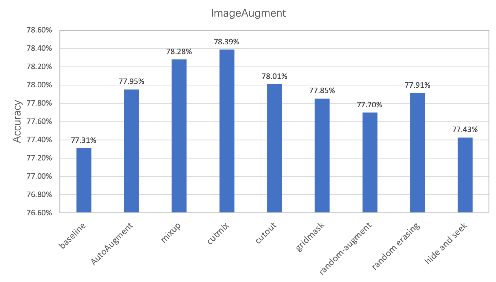
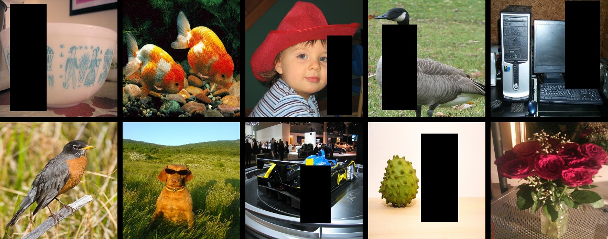

#### 算法介绍

在图像分类任务中，图像数据的增广是一种常用的正则化方法，常用于数据量不足或者模型参数较多的场景。在本章节中，我们将对除 ImageNet 分类任务标准数据增强外的 8 种数据增强方式进行简单的介绍和对比，用户也可以将这些增广方法应用到自己的任务中，以获得模型精度的提升。这 8 种数据增强方式在 ImageNet 上的精度指标如下所示。





#### paddle.vision.transforms

**亮度调节**
```
import numpy as np
from PIL import Image
from paddle.vision.transforms import functional as F

img_path = "/home/aistudio/work/cat.jpg"

image=Image.open(img_path)

# adjust_brightness对输入图像进行亮度值调整
new_img = F.adjust_brightness(image, 0.4)
```

<center style='display: flex'><div></div><div></div></center>


**色调调整**

```
# adjust_hue对输入图像进行色调的调整
F.adjust_hue(image, 0.1)
```

<center style='display: flex'><div></div><div></div></center>


**随机旋转**

```
from paddle.vision.transforms import RandomRotation

img_path = "/home/aistudio/work/cat.jpg"

image=Image.open(img_path)

# RandomRotation依据90度，按照均匀分布随机产生一个角度对图像进行旋转
transform = RandomRotation(90)
new_img = transform(image)
```

<center style='display: flex'><div></div><div></div></center>


#### 数据增强简介

如果没有特殊说明，本章节中所有示例为 ImageNet 分类，并且假设最终输入网络的数据维度为：[batch-size, 3, 224, 224]

其中 ImageNet 分类训练阶段的标准数据增强方式分为以下几个步骤：

- 图像解码：简写为 ImageDecode
- 随机裁剪到长宽均为 224 的图像：简写为 RandCrop
- 水平方向随机翻转：简写为 RandFlip
- 图像数据的归一化：简写为 Normalize
- 图像数据的重排，[224, 224, 3] 变为 [3, 224, 224]：简写为 Transpose
- 多幅图像数据组成 batch 数据，如 batch-size 个 [3, 224, 224] 的图像数据拼组成 [batch-size, 3, 224, 224]：简写为 Batch

相比于上述标准的图像增广方法，研究者也提出了很多改进的图像增广策略，这些策略均是在标准增广方法的不同阶段插入一定的操作，基于这些策略操作所处的不同阶段，我们将其分为了三类：

- 对 RandCrop 后的 224 的图像进行一些变换: AutoAugment，RandAugment
- 对 Transpose 后的 224 的图像进行一些裁剪: CutOut，RandErasing，HideAndSeek，GridMask
- 对 Batch 后的数据进行混合: Mixup，Cutmix

增广后的可视化效果如下所示。


#### 图像变换类

图像变换类指的是对 RandCrop 后的 224 的图像进行一些变换，主要包括
- AutoAugment
- RandAugment
- TimmAutoAugment

**AutoAugment 算法介绍**
论文地址：https://arxiv.org/abs/1805.09501v1

开源代码 github 地址：https://github.com/DeepVoltaire/AutoAugment

不同于常规的人工设计图像增广方式，AutoAugment 是在一系列图像增广子策略的搜索空间中通过搜索算法找到的适合特定数据集的图像增广方案。针对 ImageNet 数据集，最终搜索出来的数据增强方案包含 25 个子策略组合，每个子策略中都包含两种变换，针对每幅图像都随机的挑选一个子策略组合，然后以一定的概率来决定是否执行子策略中的每种变换。

经过 AutoAugment 数据增强后结果如下图所示。


**AutoAugment 配置**
AotoAugment 的图像增广方式的配置如下。AutoAugment 是在 uint8 的数据格式上转换的，所以其处理过程应该放在归一化操作(NormalizeImage)之前

```
      transform_ops:
        - DecodeImage:
            to_rgb: True
            channel_first: False
        - RandCropImage:
            size: 224
        - RandFlipImage:
            flip_code: 1
        - AutoAugment:
        - NormalizeImage:
            scale: 1.0/255.0
            mean: [0.485, 0.456, 0.406]
            std: [0.229, 0.224, 0.225]
            order: ''
```

**RandAugment 算法介绍**

论文地址：https://arxiv.org/pdf/1909.13719.pdf

开源代码 github 地址：https://github.com/heartInsert/randaugment

AutoAugment 的搜索方法比较暴力，直接在数据集上搜索针对该数据集的最优策略，其计算量很大。在 RandAugment 文章中作者发现，一方面，针对越大的模型，越大的数据集，使用 AutoAugment 方式搜索到的增广方式产生的收益也就越小；另一方面，这种搜索出的最优策略是针对该数据集的，其迁移能力较差，并不太适合迁移到其他数据集上。

在 RandAugment 中，作者提出了一种随机增广的方式，不再像 AutoAugment 中那样使用特定的概率确定是否使用某种子策略，而是所有的子策略都会以同样的概率被选择到，论文中的实验也表明这种数据增强方式即使在大模型的训练中也具有很好的效果。

经过 RandAugment 数据增强后结果如下图所示。


**RandAugment 配置**

RandAugment 的图像增广方式的配置如下，其中用户需要指定其中的参数 num_layers 与 magnitude，默认的数值分别是 2 和 5。RandAugment 是在 uint8 的数据格式上转换的，所以其处理过程应该放在归一化操作(NormalizeImage)之前。

```
      transform_ops:
        - DecodeImage:
            to_rgb: True
            channel_first: False
        - RandCropImage:
            size: 224
        - RandFlipImage:
            flip_code: 1
        - RandAugment:
            num_layers: 2
            magnitude: 5
        - NormalizeImage:
            scale: 1.0/255.0
            mean: [0.485, 0.456, 0.406]
            std: [0.229, 0.224, 0.225]
            order: ''
```

**TimmAutoAugment 算法介绍**

开源代码 github 地址：https://github.com/rwightman/pytorch-image-models/blob/master/timm/data/auto_augment.py

TimmAutoAugment 是开源作者对 AutoAugment 和 RandAugment 的改进，事实证明，其在很多视觉任务上有更好的表现，目前绝大多数 VisionTransformer 模型都是基于 TimmAutoAugment 去实现的。

**TimmAutoAugment 配置**
TimmAutoAugment 的图像增广方式的配置如下，其中用户需要指定其中的参数 config_str、interpolation、img_size，默认的数值分别是 rand-m9-mstd0.5-inc1、bicubic、224。TimmAutoAugment 是在 uint8 的数据格式上转换的，所以其处理过程应该放在归一化操作(NormalizeImage)之前。

```
      transform_ops:
        - DecodeImage:
            to_rgb: True
            channel_first: False
        - RandCropImage:
            size: 224
        - RandFlipImage:
            flip_code: 1
        - TimmAutoAugment:
            config_str: rand-m9-mstd0.5-inc1
            interpolation: bicubic
            img_size: 224
        - NormalizeImage:
            scale: 1.0/255.0
            mean: [0.485, 0.456, 0.406]
            std: [0.229, 0.224, 0.225]
            order: ''
```

#### 图像裁剪类


图像裁剪类主要是对 Transpose 后的 224 的图像进行一些裁剪，并将裁剪区域的像素值置为特定的常数（默认为 0），主要包括：

- CutOut
- RandErasing
- HideAndSeek
- GridMask

图像裁剪的这些增广并非一定要放在归一化之后，也有不少实现是放在归一化之前的，也就是直接对 uint8 的图像进行操作，两种方式的差别是：如果直接对 uint8 的图像进行操作，那么再经过归一化之后被裁剪的区域将不再是纯黑或纯白（减均值除方差之后像素值不为 0）。而对归一后之后的数据进行操作，裁剪的区域会是纯黑或纯白。

上述的裁剪变换思路是相同的，都是为了解决训练出的模型在有遮挡数据上泛化能力较差的问题，不同的是他们的裁剪方式、区域不太一样。


**Cutout 算法介绍**

论文地址：https://arxiv.org/abs/1708.04552

开源代码 github 地址：https://github.com/uoguelph-mlrg/Cutout

Cutout 可以理解为 Dropout 的一种扩展操作，不同的是 Dropout 是对图像经过网络后生成的特征进行遮挡，而 Cutout 是直接对输入的图像进行遮挡，相对于 Dropout 对噪声的鲁棒性更好。作者在论文中也进行了说明，这样做法有以下两点优势：(1)通过 Cutout 可以模拟真实场景中主体被部分遮挡时的分类场景；(2)可以促进模型充分利用图像中更多的内容来进行分类，防止网络只关注显著性的图像区域，从而发生过拟合。

经过 RandAugment 数据增强后结果如下图所示。


**Cutout 配置**

Cutout 的图像增广方式的配置如下，其中用户需要指定其中的参数 n_holes 与 length，默认的数值分别是 1 和 112。类似其他图像裁剪类的数据增强方式，Cutout 既可以在 uint8 格式的数据上操作，也可以在归一化)(NormalizeImage)后的数据上操作，此处给出的是在归一化后的操作。

```
      transform_ops:
        - DecodeImage:
            to_rgb: True
            channel_first: False
        - RandCropImage:
            size: 224
        - RandFlipImage:
            flip_code: 1
        - NormalizeImage:
            scale: 1.0/255.0
            mean: [0.485, 0.456, 0.406]
            std: [0.229, 0.224, 0.225]
            order: ''
        - Cutout:
            n_holes: 1
            length: 112
```

**RandomErasing 算法介绍**

论文地址：https://arxiv.org/pdf/1708.04896.pdf

开源代码 github 地址：https://github.com/zhunzhong07/Random-Erasing

RandomErasing 与 Cutout 方法类似，同样是为了解决训练出的模型在有遮挡数据上泛化能力较差的问题，作者在论文中也指出，随机裁剪的方式与随机水平翻转具有一定的互补性。作者也在行人再识别(REID)上验证了该方法的有效性。与 Cutout 不同的是，在 RandomErasing 中，图片以一定的概率接受该种预处理方法，生成掩码的尺寸大小与长宽比也是根据预设的超参数随机生成。

PaddleClas 中 RandomErasing 的使用方法如下所示。

经过 RandomErasing 数据增强后结果如下图所示。



**RandomErasing 配置**

RandomErasing 的图像增广方式的配置如下，其中用户需要指定其中的参数 EPSILON、sl、sh、r1、attempt、use_log_aspect、mode，默认的数值分别是 0.25、0.02、1.0/3.0、0.3、10、True、pixel。类似其他图像裁剪类的数据增强方式，RandomErasing 既可以在 uint8 格式的数据上操作，也可以在归一化(NormalizeImage)后的数据上操作，此处给出的是在归一化后的操作。

```
      transform_ops:
        - DecodeImage:
            to_rgb: True
            channel_first: False
        - RandCropImage:
            size: 224
        - RandFlipImage:
            flip_code: 1
        - NormalizeImage:
            scale: 1.0/255.0
            mean: [0.485, 0.456, 0.406]
            std: [0.229, 0.224, 0.225]
            order: ''
        - RandomErasing:
            EPSILON: 0.25
            sl: 0.02
            sh: 1.0/3.0
            r1: 0.3
            attempt: 10
            use_log_aspect: True
            mode: pixel
```


https://github.com/PaddlePaddle/PaddleClas/blob/release/2.5.2/docs/zh_CN/training/config_description/data_augmentation.md