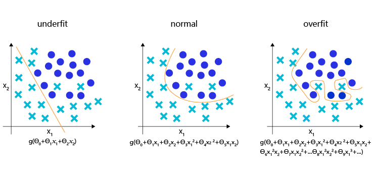

####
# https://aistudio.baidu.com/projectdetail/8774917
####

我们研究了资源部署优化的方法，通过使用单GPU和分布式部署，提升模型训练的效率。本节我们依旧横向展开"横纵式"，如 图1 所示，探讨在手写数字识别任务中，为了保证模型的真实效果，在模型训练部分，对模型进行一些调试和优化的方法。


训练过程优化思路主要有如下五个关键环节：
（1）计算分类准确率，观测模型训练效果
交叉熵损失函数只能作为优化目标，无法直接准确衡量模型的训练效果。准确率可以直接衡量训练效果，但由于其离散性质，不适合做为损失函数优化神经网络。
（2）检查模型训练过程，识别潜在问题
如果模型的损失或者评估指标表现异常，通常需要打印模型每一层的输入和输出来定位问题，分析每一层的内容来获取错误的原因。
（3）加入校验或测试，更好评价模型效果
理想的模型训练结果是在训练集和验证集上均有较高的准确率，如果训练集的准确率低于验证集，说明网络训练程度不够；如果训练集的准确率高于验证集，可能是发生了过拟合现象。通过在优化目标中加入正则化项的办法，解决过拟合的问题。
（4）加入正则化项，避免模型过拟合
飞桨框架支持为整体参数加入正则化项，这是通常的做法。此外，飞桨框架也支持为某一层或某一部分的网络单独加入正则化项，以达到精细调整参数训练的效果。
（5）可视化分析
用户不仅可以通过打印或使用matplotlib库作图，飞桨还提供了更专业的可视化分析工具VisualDL，提供便捷的可视化分析方法。

#### 计算模型的分类准确率


准确率是一个直观衡量分类模型效果的指标，由于这个指标是离散的，因此不适合作为损失来优化。通常情况下，交叉熵损失越小的模型，分类的准确率也越高。基于分类准确率，我们可以公平地比较两种损失函数的优劣，例如在【手写数字识别】之损失函数章节中均方误差和交叉熵的比较。

使用飞桨提供的计算分类准确率API，可以直接计算准确率。

> class paddle.metric.Accuracy

该API的输入参数input为预测的分类结果predict，输入参数label为数据真实的label。飞桨还提供了更多衡量模型效果的计算指标，详细可以查看paddle.meric包下面的API。

在下述代码中，我们在模型前向计算过程forward函数中计算分类准确率，并在训练时打印每个批次样本的分类准确率

```python
# 定义模型结构
import paddle.nn.functional as F
from paddle.nn import Conv2D, MaxPool2D, Linear

# 多层卷积神经网络实现
class MNIST(paddle.nn.Layer):
     def __init__(self):
         super(MNIST, self).__init__()
         
         # 定义卷积层，输出特征通道out_channels设置为20，卷积核的大小kernel_size为5，卷积步长stride=1，padding=2
         self.conv1 = Conv2D(in_channels=1, out_channels=20, kernel_size=5, stride=1, padding=2)
         # 定义池化层，池化核的大小kernel_size为2，池化步长为2
         self.max_pool1 = MaxPool2D(kernel_size=2, stride=2)
         # 定义卷积层，输出特征通道out_channels设置为20，卷积核的大小kernel_size为5，卷积步长stride=1，padding=2
         self.conv2 = Conv2D(in_channels=20, out_channels=20, kernel_size=5, stride=1, padding=2)
         # 定义池化层，池化核的大小kernel_size为2，池化步长为2
         self.max_pool2 = MaxPool2D(kernel_size=2, stride=2)
         # 定义一层全连接层，输出维度是10
         self.fc = Linear(in_features=980, out_features=10)
         
   # 定义网络前向计算过程，卷积后紧接着使用池化层，最后使用全连接层计算最终输出
   # 卷积层激活函数使用Relu，全连接层激活函数使用softmax
     def forward(self, inputs, label):
         x = self.conv1(inputs)
         x = F.relu(x)
         x = self.max_pool1(x)
         x = self.conv2(x)
         x = F.relu(x)
         x = self.max_pool2(x)
         x = paddle.reshape(x, [x.shape[0], 980])
         x = self.fc(x)
         if label is not None:
             acc = paddle.metric.accuracy(input=x, label=label)
             return x, acc
         else:
             return x
#在使用GPU机器时，可以将use_gpu变量设置成True
use_gpu = True
paddle.set_device('gpu:0') if use_gpu else paddle.set_device('cpu')

#仅优化算法的设置有所差别
def train(model):
    model = MNIST()
    model.train()
    
    #四种优化算法的设置方案，可以逐一尝试效果
    # opt = paddle.optimizer.SGD(learning_rate=0.01, parameters=model.parameters())
    # opt = paddle.optimizer.Momentum(learning_rate=0.01, momentum=0.9, parameters=model.parameters())
    # opt = paddle.optimizer.Adagrad(learning_rate=0.01, parameters=model.parameters())
    opt = paddle.optimizer.Adam(learning_rate=0.01, parameters=model.parameters())
    
    EPOCH_NUM = 5
    for epoch_id in range(EPOCH_NUM):
        for batch_id, data in enumerate(train_loader()):
            #准备数据
            images, labels = data
            images = paddle.to_tensor(images)
            labels = paddle.to_tensor(labels)
            
            #前向计算的过程
            predicts, acc = model(images, labels)
            
            #计算损失，取一个批次样本损失的平均值
            loss = F.cross_entropy(predicts, labels)
            avg_loss = paddle.mean(loss)
            
            #每训练了100批次的数据，打印下当前Loss的情况
            if batch_id % 200 == 0:
                print("epoch: {}, batch: {}, loss is: {}, acc is {}".format(epoch_id, batch_id, avg_loss.numpy(), acc.numpy()))
                
            #后向传播，更新参数，消除梯度的过程
            avg_loss.backward()
            opt.step()
            opt.clear_grad()

    #保存模型参数
    paddle.save(model.state_dict(), 'mnist.pdparams')
    
#创建模型    
model = MNIST()
#启动训练过程
train(model)
```

####  检查模型训练过程，识别潜在训练问题

使用飞桨动态图编程可以方便的查看和调试训练的执行过程。在网络定义的Forward函数中，可以打印每一层输入输出的尺寸，以及每层网络的参数。通过查看这些信息，不仅可以更好地理解训练的执行过程，还可以发现潜在问题，或者启发继续优化的思路。

在下述程序中，使用`check_shape`变量控制是否打印“尺寸”，验证网络结构是否正确。使用`check_content`变量控制是否打印“内容值”，验证数据分布是否合理。假如在训练中发现中间层的部分输出持续为0，说明该部分的网络结构设计存在问题，没有充分利用。

```python
import numpy as np
import paddle.nn.functional as F

# 定义模型结构
class MNIST(paddle.nn.Layer):
     def __init__(self):
         super(MNIST, self).__init__()
         
         # 定义卷积层，输出特征通道out_channels设置为20，卷积核的大小kernel_size为5，卷积步长stride=1，padding=2
         self.conv1 = Conv2D(in_channels=1, out_channels=20, kernel_size=5, stride=1, padding=2)
         # 定义池化层，池化核的大小kernel_size为2，池化步长为2
         self.max_pool1 = MaxPool2D(kernel_size=2, stride=2)
         # 定义卷积层，输出特征通道out_channels设置为20，卷积核的大小kernel_size为5，卷积步长stride=1，padding=2
         self.conv2 = Conv2D(in_channels=20, out_channels=20, kernel_size=5, stride=1, padding=2)
         # 定义池化层，池化核的大小kernel_size为2，池化步长为2
         self.max_pool2 = MaxPool2D(kernel_size=2, stride=2)
         # 定义一层全连接层，输出维度是10
         self.fc = Linear(in_features=980, out_features=10)
     
     #加入对每一层输入和输出的尺寸和数据内容的打印，根据check参数决策是否打印每层的参数和输出尺寸
     # 卷积层激活函数使用Relu，全连接层激活函数使用softmax
     def forward(self, inputs, label=None, check_shape=False, check_content=False):
         # 给不同层的输出不同命名，方便调试
         outputs1 = self.conv1(inputs)
         outputs2 = F.relu(outputs1)
         outputs3 = self.max_pool1(outputs2)
         outputs4 = self.conv2(outputs3)
         outputs5 = F.relu(outputs4)
         outputs6 = self.max_pool2(outputs5)
         outputs6 = paddle.reshape(outputs6, [outputs6.shape[0], -1])
         outputs7 = self.fc(outputs6)
         
         # 选择是否打印神经网络每层的参数尺寸和输出尺寸，验证网络结构是否设置正确
         if check_shape:
             # 打印每层网络设置的超参数-卷积核尺寸，卷积步长，卷积padding，池化核尺寸
             print("\n########## print network layer's superparams ##############")
             print("conv1-- kernel_size:{}, padding:{}, stride:{}".format(self.conv1.weight.shape, self.conv1._padding, self.conv1._stride))
             print("conv2-- kernel_size:{}, padding:{}, stride:{}".format(self.conv2.weight.shape, self.conv2._padding, self.conv2._stride))
             #print("max_pool1-- kernel_size:{}, padding:{}, stride:{}".format(self.max_pool1.pool_size, self.max_pool1.pool_stride, self.max_pool1._stride))
             #print("max_pool2-- kernel_size:{}, padding:{}, stride:{}".format(self.max_pool2.weight.shape, self.max_pool2._padding, self.max_pool2._stride))
             print("fc-- weight_size:{}, bias_size_{}".format(self.fc.weight.shape, self.fc.bias.shape))
             
             # 打印每层的输出尺寸
             print("\n########## print shape of features of every layer ###############")
             print("inputs_shape: {}".format(inputs.shape))
             print("outputs1_shape: {}".format(outputs1.shape))
             print("outputs2_shape: {}".format(outputs2.shape))
             print("outputs3_shape: {}".format(outputs3.shape))
             print("outputs4_shape: {}".format(outputs4.shape))
             print("outputs5_shape: {}".format(outputs5.shape))
             print("outputs6_shape: {}".format(outputs6.shape))
             print("outputs7_shape: {}".format(outputs7.shape))
             # print("outputs8_shape: {}".format(outputs8.shape))
             
         # 选择是否打印训练过程中的参数和输出内容，可用于训练过程中的调试
         if check_content:
            # 打印卷积层的参数-卷积核权重，权重参数较多，此处只打印部分参数
             print("\n########## print convolution layer's kernel ###############")
             print("conv1 params -- kernel weights:", self.conv1.weight[0][0])
             print("conv2 params -- kernel weights:", self.conv2.weight[0][0])

             # 创建随机数，随机打印某一个通道的输出值
             idx1 = np.random.randint(0, outputs1.shape[1])
             idx2 = np.random.randint(0, outputs4.shape[1])
             # 打印卷积-池化后的结果，仅打印batch中第一个图像对应的特征
             print("\nThe {}th channel of conv1 layer: ".format(idx1), outputs1[0][idx1])
             print("The {}th channel of conv2 layer: ".format(idx2), outputs4[0][idx2])
             print("The output of last layer:", outputs7[0], '\n')
            
        # 如果label不是None，则计算分类精度并返回
         if label is not None:
             acc = paddle.metric.accuracy(input=F.softmax(outputs7), label=label)
             return outputs7, acc
         else:
             return outputs7

#在使用GPU机器时，可以将use_gpu变量设置成True
use_gpu = True
paddle.set_device('gpu:0') if use_gpu else paddle.set_device('cpu')    

def train(model):
    model = MNIST()
    model.train()
    
    #四种优化算法的设置方案，可以逐一尝试效果
    opt = paddle.optimizer.SGD(learning_rate=0.01, parameters=model.parameters())
    # opt = paddle.optimizer.Momentum(learning_rate=0.01, momentum=0.9, parameters=model.parameters())
    # opt = paddle.optimizer.Adagrad(learning_rate=0.01, parameters=model.parameters())
    # opt = paddle.optimizer.Adam(learning_rate=0.01, parameters=model.parameters())
    
    EPOCH_NUM = 1
    for epoch_id in range(EPOCH_NUM):
        for batch_id, data in enumerate(train_loader()):
            #准备数据，变得更加简洁
            images, labels = data
            images = paddle.to_tensor(images)
            labels = paddle.to_tensor(labels)
            
            #前向计算的过程，同时拿到模型输出值和分类准确率
            if batch_id == 0 and epoch_id==0:
                # 打印模型参数和每层输出的尺寸
                predicts, acc = model(images, labels, check_shape=True, check_content=False)
            elif batch_id==401:
                # 打印模型参数和每层输出的值
                predicts, acc = model(images, labels, check_shape=False, check_content=True)
            else:
                predicts, acc = model(images, labels)
            
            #计算损失，取一个批次样本损失的平均值
            loss = F.cross_entropy(predicts, labels)
            avg_loss = paddle.mean(loss)
            
            #每训练了100批次的数据，打印下当前Loss的情况
            if batch_id % 200 == 0:
                print("epoch: {}, batch: {}, loss is: {}, acc is {}".format(epoch_id, batch_id, avg_loss.numpy(), acc.numpy()))
            
            #后向传播，更新参数的过程
            avg_loss.backward()
            opt.step()
            opt.clear_grad()

    #保存模型参数
    paddle.save(model.state_dict(), 'mnist_test.pdparams')
    
#创建模型    
model = MNIST()
#启动训练过程
train(model)

print("Model has been saved.")

```

#### 加入校验或测试，更好评价模型效果

在训练过程中，我们会发现模型在训练样本集上的损失在不断减小。但这是否代表模型在未来的应用场景上依然有效？为了验证模型的有效性，通常将样本集合分成三份，训练集、校验集和测试集。
- 训练集 ：用于训练模型的参数，即训练过程中主要完成的工作。
- 验证集 ：用于对模型超参数的选择，比如网络结构的调整、正则化项权重的选择等
- 用于模拟模型在应用后的真实效果。因为测试集没有参与任何模型优化或参数训练的工作，所以它对模型来说是完全未知的样本。在不以校验数据优化网络结构或模型超参数时，校验数据和测试数据的效果是类似的，均更真实的反映模型效果。


如下程序读取上一步训练保存的模型参数，读取校验数据集，并测试模型在校验数据集上的效果。

```python

def evaluation(model):
    print('start evaluation .......')
    # 定义预测过程
    params_file_path = 'mnist.pdparams'
    # 加载模型参数
    param_dict = paddle.load(params_file_path)
    model.load_dict(param_dict)

    model.eval()
    eval_loader = test_loader

    acc_set = []
    avg_loss_set = []
    for batch_id, data in enumerate(eval_loader()):
        images, labels = data
        images = paddle.to_tensor(images)
        labels = paddle.to_tensor(labels)
        predicts, acc = model(images, labels)
        loss = F.cross_entropy(input=predicts, label=labels)
        avg_loss = paddle.mean(loss)
        acc_set.append(float(acc.numpy()))
        avg_loss_set.append(float(avg_loss.numpy()))
    
    #计算多个batch的平均损失和准确率
    acc_val_mean = np.array(acc_set).mean()
    avg_loss_val_mean = np.array(avg_loss_set).mean()

    print('loss={}, acc={}'.format(avg_loss_val_mean, acc_val_mean))

model = MNIST()
evaluation(model)
```


#### 加入正则化项，避免模型过拟合


**过拟合现象**

对于样本量有限、但需要使用强大模型的复杂任务，模型很容易出现过拟合的表现，即在训练集上的损失小，在验证集或测试集上的损失较大，如 图2 所示。


> 过拟合现象，训练误差不断降低，但测试误差先降后增

反之，如果模型在训练集和测试集上均损失较大，则称为欠拟合。过拟合表示模型过于敏感，学习到了训练数据中的一些误差，而这些误差并不是真实的泛化规律（可推广到测试集上的规律）。欠拟合表示模型还不够强大，还没有很好的拟合已知的训练样本，更别提测试样本了。因为欠拟合情况容易观察和解决，只要训练loss不够好，就不断使用更强大的模型即可，因此实际中我们更需要处理好过拟合的问题。


**导致过拟合原因**

造成过拟合的原因是模型过于敏感，而训练数据量太少或其中的噪音太多。如图3 所示，理想的回归模型是一条坡度较缓的抛物线，欠拟合的模型只拟合出一条直线，显然没有捕捉到真实的规律，但过拟合的模型拟合出存在很多拐点的抛物线，显然是过于敏感，也没有正确表达真实规律。


> 回归模型的过拟合，理想和欠拟合状态的表现


如图4 所示，理想的分类模型是一条半圆形的曲线，欠拟合用直线作为分类边界，显然没有捕捉到真实的边界，但过拟合的模型拟合出很扭曲的分类边界，虽然对所有的训练数据正确分类，但对一些较为个例的样本所做出的妥协，高概率不是真实的规律。


> 分类模型的欠拟合，理想和过拟合状态的表现


**过拟合的成因与防控**

为了更好的理解过拟合的成因，可以参考侦探定位罪犯的案例逻辑，如 图5 所示。


> 侦探定位罪犯与模型假设示意

对于这个案例，假设侦探也会犯错，通过分析发现可能的原因：

（1）情况1：罪犯证据存在错误，依据错误的证据寻找罪犯肯定是缘木求鱼。

（2）情况2：搜索范围太大的同时证据太少，导致符合条件的候选（嫌疑人）太多，无法准确定位罪犯。

那么侦探解决这个问题的方法有两种：或者缩小搜索范围（比如假设该案件只能是熟人作案），或者寻找更多的证据。归结到深度学习中，假设模型也会犯错，通过分析发现可能的原因：

（1） 情况1：训练数据存在噪音，导致模型学到了噪音，而不是真实规律。

（2）情况2：使用强大模型（表示空间大）的同时训练数据太少，导致在训练数据上表现良好的候选假设太多，锁定了一个“虚假正确”的假设。

对于情况1，我们使用数据清洗和修正来解决。 对于情况2，我们或者限制模型表示能力，或者收集更多的训练数据。而清洗训练数据中的错误，或收集更多的训练数据往往是一句“正确的废话”，在任何时候我们都想获得更多更高质量的数据。在实际项目中，更快、更低成本可控制过拟合的方法，只有限制模型的表示能力。

**正则化项**

为了防止模型过拟合，在没有扩充样本量的可能下，只能降低模型的复杂度，可以通过限制参数的数量或可能取值（参数值尽量小）实现。具体来说，在模型的优化目标（损失）中人为加入对参数规模的惩罚项。当参数越多或取值越大时，该惩罚项就越大。通过调整惩罚项的权重系数，可以使模型在“尽量减少训练损失”和“保持模型的泛化能力”之间取得平衡。泛化能力表示模型在没有见过的样本上依然有效。通过调整正则化项的权重，可以灵活设置模型参数量和训练集上的损失，从而限制模型能力，避免过拟合。

飞桨支持为所有参数加上统一的正则化项，也支持为特定的参数添加正则化项。前者的实现如下代码所示，仅在优化器中设置weight_decay参数即可实现。使用参数`coeff`调节正则化项的权重，权重越大时，对模型复杂度的惩罚越高。