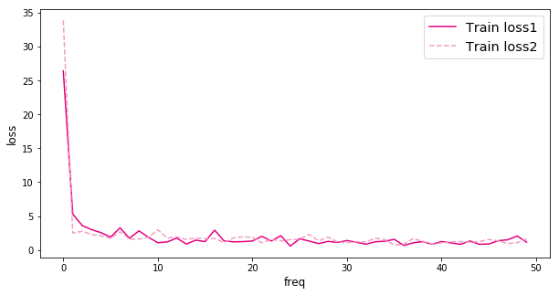

####
# https://aistudio.baidu.com/projectdetail/8773459
####

第2节我们尝试使用与房价预测相同的简单神经网络解决手写数字识别问题，但是效果并不理想。原因是手写数字识别的输入是28×28的像素值，输出是0~9的数字标签，而线性回归模型无法捕捉二维图像数据中蕴含的复杂信息。

如 图1 所示。无论是牛顿第二定律任务，还是房价预测任务，输入特征和输出预测值之间的关系均可以使用“直线”刻画（使用线性方程来表达）。但手写数字识别任务的输入像素和输出数字标签之间的关系显然不是线性的，甚至这个关系复杂到我们靠人脑难以直观理解的程度


因此，我们需要尝试使用其他更复杂、更强大的网络来构建手写数字识别任务，观察一下训练效果，即将“横纵式”教学法从横向展开，如 图2 所示。本节主要介绍两种常见的网络结构：经典的多层全连接神经网络和卷积神经网络


#### 经典的全连接神经网络

神经元是构成神经网络的基本单元，其基本结构如 图3 所示


神经元输入为向量 $x=[x_1​;...;x_D​]$ ，净输入 $z∈R$ 表示神经元输入的加权和，公式如下：

```math
z = \sum^D_{d=1}w_dx_d+b,
```
其中 $\boldsymbol{w}=[w_1;...;w_D] \in R^D$ 为权重向量, $b∈R$ 是偏置。
然后净输入 $z$ 经过激活函数 $f(.)$ 得到该神经元的活性值 $a \in R$ ：

```math
a = f(z).
```

经典的全连接神经网络来包含四层网络：输入层、两个隐含层和输出层，将手写数字识别任务通过全连接神经网络表示，如 图4 所示。


- 输入层：将数据输入给神经网络。在该任务中，输入层的尺度为28×28的像素值。
- 隐含层：增加网络深度和复杂度，隐含层的节点数是可以调整的，节点数越多，神经网络表示能力越强，参数量也会增加。在该任务中，中间的两个隐含层为10×10的结构，通常隐含层会比输入层的尺寸小，以便对关键信息做抽象，激活函数使用常见的Sigmoid函数
- 输出层：输出网络计算结果，输出层的节点数是固定的。如果是回归问题，节点数量为需要回归的数字数量。如果是分类问题，则是分类标签的数量。在该任务中，模型的输出是回归一个数字，输出层的尺寸为1

> 隐含层引入非线性激活函数Sigmoid是为了增加神经网络的非线性能力
> 举例来说，如果一个神经网络采用线性变换，有四个输入 $x_1 ​~ x_4$ ​，一个输出y。假设第一层的变换是 $z_1=x_1-x_2$ ​和  $z_2=x_3+x_4$ ​，第二层的变换是 $y=z_1+z_2$ ​，则将两层的变换展开后得到 $y=x_1-x_2+x_3+x_4$ ​。也就是说，无论中间累积了多少层线性变换，原始输入和最终输出之间依然是线性关系


Sigmoid是早期神经网络模型中常见的非线性变换函数，公式为

```math
\sigma(x) = \frac{1}{1+e^{-x}}
```

数据迭代器train_loader在每次迭代时的数据shape为[batch_size, 1, 28*28]，因此需要将该数据形式改变为向量形式

```python
import paddle
import paddle.nn.functional as F
from paddle.nn import Linear

# 定义多层全连接神经网络
class MNIST(paddle.nn.Layer):
    def __init__(self):
        super(MNIST, self).__init__()
        # 定义两层全连接隐含层，输出维度是10，当前设定隐含节点数为10，可根据任务调整
        self.fc1 = Linear(in_features=784, out_features=10)
        self.fc2 = Linear(in_features=10, out_features=10)
        # 定义一层全连接输出层，输出维度是1
        self.fc3 = Linear(in_features=10, out_features=1)
    
    # 定义网络的前向计算，隐含层激活函数为sigmoid，输出层不使用激活函数
    def forward(self, inputs):
        inputs = paddle.reshape(inputs, [inputs.shape[0], 784])
        outputs1 = self.fc1(inputs)
        outputs1 = F.sigmoid(outputs1)
        outputs2 = self.fc2(outputs1)
        outputs2 = F.sigmoid(outputs2)
        outputs_final = self.fc3(outputs2)
        return outputs_final
```

下面我们打印上面定义的全连接神经网络基础结构和参数信息

```python
model = MNIST()
params_info = paddle.summary(model, (1, 1, 28, 28))
print(params_info)
```


#### 卷积神经网络

虽然使用经典的全连接神经网络可以提升一定的准确率，但其输入数据的形式导致丢失了图像像素间的空间信息，这影响了网络对图像内容的理解。对于计算机视觉问题，效果最好的模型仍然是卷积神经网络。卷积神经网络针对视觉问题的特点进行了网络结构优化，可以直接处理原始形式的图像数据，保留像素间的空间信息，因此更适合处理视觉问题。

卷积神经网络由多个卷积层和池化层组成，如 图5 所示。卷积层负责对输入进行扫描以生成更抽象的特征表示，池化层对这些特征表示进行过滤，保留最关键的特征信息。


```python
# 定义 SimpleNet 网络结构
import paddle
from paddle.nn import Conv2D, MaxPool2D, Linear
import paddle.nn.functional as F
# 多层卷积神经网络实现
class MNIST(paddle.nn.Layer):
     def __init__(self):
         super(MNIST, self).__init__()
         
         # 定义卷积层，输出特征通道out_channels设置为20，卷积核的大小kernel_size为5，卷积步长stride=1，padding=2
         self.conv1 = Conv2D(in_channels=1, out_channels=20, kernel_size=5, stride=1, padding=2)
         # 定义池化层，池化核的大小kernel_size为2，池化步长为2
         self.max_pool1 = MaxPool2D(kernel_size=2, stride=2)
         # 定义卷积层，输出特征通道out_channels设置为20，卷积核的大小kernel_size为5，卷积步长stride=1，padding=2
         self.conv2 = Conv2D(in_channels=20, out_channels=20, kernel_size=5, stride=1, padding=2)
         # 定义池化层，池化核的大小kernel_size为2，池化步长为2
         self.max_pool2 = MaxPool2D(kernel_size=2, stride=2)
         # 定义一层全连接层，输出维度是1
         self.fc = Linear(in_features=980, out_features=1)
         
    # 定义网络前向计算过程，卷积后紧接着使用池化层，最后使用全连接层计算最终输出
    # 卷积层激活函数使用Relu，全连接层不使用激活函数
     def forward(self, inputs):
         x = self.conv1(inputs)
         x = F.relu(x)
         x = self.max_pool1(x)
         x = self.conv2(x)
         x = F.relu(x)
         x = self.max_pool2(x)
         x = paddle.reshape(x, [x.shape[0], -1])
         x = self.fc(x)
         return x
```

```
model = MNIST()
params_info = paddle.summary(model, (1, 1, 28, 28))
print(params_info)
```
输出如下
```
---------------------------------------------------------------------------
 Layer (type)       Input Shape          Output Shape         Param #    
===========================================================================
   Conv2D-1       [[1, 1, 28, 28]]     [1, 20, 28, 28]          520      
  MaxPool2D-1    [[1, 20, 28, 28]]     [1, 20, 14, 14]           0       
   Conv2D-2      [[1, 20, 14, 14]]     [1, 20, 14, 14]        10,020     
  MaxPool2D-2    [[1, 20, 14, 14]]      [1, 20, 7, 7]            0       
   Linear-10         [[1, 980]]             [1, 1]              981      
===========================================================================
Total params: 11,521
Trainable params: 11,521
Non-trainable params: 0
---------------------------------------------------------------------------
Input size (MB): 0.00
Forward/backward pass size (MB): 0.19
Params size (MB): 0.04
Estimated Total Size (MB): 0.23
---------------------------------------------------------------------------

{'total_params': 11521, 'trainable_params': 11521}
```

绘制两个网络结构训练时损失函数变化曲线



从损失函数变化趋势看，全连接神经网络和卷积神经网络收敛速度相当。目前我们的卷积神经网络做的是一个回归任务，接下来我们尝试将回归任务替换成分类任务，看看卷积神经网络效果如何