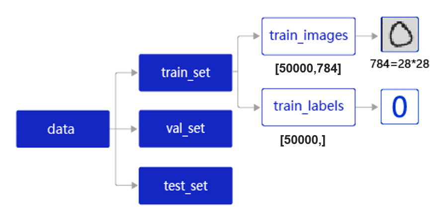

####
# https://aistudio.baidu.com/projectdetail/8772910
####

我们通过调用飞桨提供的`paddle.vision.datasets.MNIST` API加载MNIST数据集。但实践中，我们面临的任务和数据环境千差万别，通常需要自己编写适合当前任务的数据处理程序，一般涉及如下五个环节：

- 读入数据
- 划分数据集
- 生成批次数据
- 训练样本集乱序
- 校验数据有效性

在数据读取与处理前，首先要加载飞桨平台和数据处理库，代码如下
```python
# 数据处理部分之前的代码，加入部分数据处理的库
import paddle
from paddle.nn import Linear
import paddle.nn.functional as F
import os
import gzip
import json
import random
import numpy as np
```
#### 读入数据并划分数据集

在实际应用中，保存到本地的数据存储格式多种多样，如MNIST数据集以json格式存储在本地，其数据存储结构如 图2 所示




data包含三个元素的列表：训练集train_set、验证集val_set、测试集test_set，分别为50 000条训练样本、10 000条验证样本和10 000条测试样本。每条样本数据都包含手写数字的图像和对应的标签。

- 训练集：用于确定模型参数。
- 验证集：用于调节模型超参数（如多个网络结构、正则化权重的最优选择）。
- 测试集：用于估计应用效果（没有在模型中应用过的数据，更贴近模型在真实场景应用的效果）。

train_set包含两个元素的列表：train_images、train_labels。

- train_images：[50 000, 784]的二维列表，包含50 000张图片。每张图片用一个长度为784的向量表示，内容是28×2828\times 2828×28像素的灰度值（黑白图片）。
- train_labels：[50 000, ]的列表，表示这些图片对应的分类标签，即0~9之间的一个数字

在本地`./work/`目录下读取文件名称为mnist.json.gz的MNIST数据，并拆分成训练集、验证集和测试集，代码实现如下

```python
# 声明数据集文件位置
datafile = './work/mnist.json.gz'
print('loading mnist dataset from {} ......'.format(datafile))
# 加载json数据文件
data = json.load(gzip.open(datafile))
print('mnist dataset load done')
# 读取到的数据区分训练集，验证集，测试集
train_set, val_set, eval_set = data

# 观察训练集数据
imgs, labels = train_set[0], train_set[1]
print("训练数据集数量: ", len(imgs))

# 观察验证集数量
imgs, labels = val_set[0], val_set[1]
print("验证数据集数量: ", len(imgs))

# 观察测试集数量
imgs, labels = val= eval_set[0], eval_set[1]
print("测试数据集数量: ", len(imgs))
print(len(imgs[0]))
```

#### 训练样本乱序、生成批次数据
- （1）**训练样本乱序**： 先将样本按顺序进行编号，建立ID集合index_list。然后将index_list乱序，最后按乱序后的顺序读取数据
- （2）**生成批次数据**： 先设置合理的batch size，再将数据转变成符合模型输入要求的np.array格式返回。同时，在返回数据时将Python生成器设置为yield模式，以减少内存占用

```python
imgs, labels = train_set[0], train_set[1]
print("训练数据集数量: ", len(imgs))
# 获得数据集长度
imgs_length = len(imgs)
# 定义数据集每个数据的序号，根据序号读取数据
index_list = list(range(imgs_length))
# 读入数据时用到的批次大小
BATCHSIZE = 100

# 随机打乱训练数据的索引序号
random.shuffle(index_list)

# 定义数据生成器，返回批次数据
def data_generator():
    imgs_list = []
    labels_list = []
    for i in index_list:
        # 将数据处理成希望的类型
        img = np.array(imgs[i]).astype('float32')
        label = np.array(labels[i]).astype('float32')
        imgs_list.append(img) 
        labels_list.append(label)
        if len(imgs_list) == BATCHSIZE:
            # 获得一个batchsize的数据，并返回
            yield np.array(imgs_list), np.array(labels_list)
            # 清空数据读取列表
            imgs_list = []
            labels_list = []

    # 如果剩余数据的数目小于BATCHSIZE，
    # 则剩余数据一起构成一个大小为len(imgs_list)的mini-batch
    if len(imgs_list) > 0:
        yield np.array(imgs_list), np.array(labels_list)
    return data_generator
```

```python
# 声明数据读取函数，从训练集中读取数据
train_loader = data_generator
# 以迭代的形式读取数据
for batch_id, data in enumerate(train_loader()):
    image_data, label_data = data
    if batch_id == 0:
        # 打印数据shape和类型
        print("打印第一个batch数据的维度:")
        print("图像维度: {}, 标签维度: {}".format(image_data.shape, label_data.shape))
    break
```
打印第一个batch数据的维度:
图像维度: (100, 784), 标签维度: (100,)


#### 校验数据有效性

在实际应用中，原始数据可能存在标注不准确、数据杂乱或格式不统一等情况。因此在完成数据处理流程后，还需要进行数据校验，一般有两种方式：
- 机器校验：加入一些校验和清理数据的操作。
- 人工校验：先打印数据输出结果，观察是否是设置的格式。再从训练的结果验证数据处理和读取的有效性。


#### 封装数据读取与处理函数

上文我们从读取数据、划分数据集、到打乱训练数据、构建数据读取器以及数据数据校验，完成了一整套一般性的数据处理流程，下面将这些步骤放在一个函数中实现，方便在神经网络训练时直接调用
```python
def load_data(mode='train'):
    datafile = './work/mnist.json.gz'
    print('loading mnist dataset from {} ......'.format(datafile))
    # 加载json数据文件
    data = json.load(gzip.open(datafile))
    print('mnist dataset load done')
   
    # 读取到的数据区分训练集，验证集，测试集
    train_set, val_set, eval_set = data
    if mode=='train':
        # 获得训练数据集
        imgs, labels = train_set[0], train_set[1]
    elif mode=='valid':
        # 获得验证数据集
        imgs, labels = val_set[0], val_set[1]
    elif mode=='eval':
        # 获得测试数据集
        imgs, labels = eval_set[0], eval_set[1]
    else:
        raise Exception("mode can only be one of ['train', 'valid', 'eval']")
    print("训练数据集数量: ", len(imgs))
    
    # 校验数据
    imgs_length = len(imgs)

    assert len(imgs) == len(labels), \
          "length of train_imgs({}) should be the same as train_labels({})".format(len(imgs), len(labels))
    
    # 获得数据集长度
    imgs_length = len(imgs)
    
    # 定义数据集每个数据的序号，根据序号读取数据
    index_list = list(range(imgs_length))
    # 读入数据时用到的批次大小
    BATCHSIZE = 100
    
    # 定义数据生成器
    def data_generator():
        if mode == 'train':
            # 训练模式下打乱数据
            random.shuffle(index_list)
        imgs_list = []
        labels_list = []
        for i in index_list:
            # 将数据处理成希望的类型
            img = np.array(imgs[i]).astype('float32')
            label = np.array(labels[i]).astype('float32')
            imgs_list.append(img) 
            labels_list.append(label)
            if len(imgs_list) == BATCHSIZE:
                # 获得一个batchsize的数据，并返回
                yield np.array(imgs_list), np.array(labels_list)
                # 清空数据读取列表
                imgs_list = []
                labels_list = []
    
        # 如果剩余数据的数目小于BATCHSIZE，
        # 则剩余数据一起构成一个大小为len(imgs_list)的mini-batch
        if len(imgs_list) > 0:
            yield np.array(imgs_list), np.array(labels_list)
    return data_generator
```
下面定义一层神经网络，利用定义好的数据处理函数，完成神经网络的训练。

```python
# 数据处理部分之后的代码,数据读取的部分调用Load_data函数
# 定义网络结构,同上一节所使用的网络结构
class MNIST(paddle.nn.Layer):
    def __init__(self):
        super(MNIST, self).__init__()
        # 定义一层全连接层，输出维度是1
        self.fc = paddle.nn.Linear(in_features=784, out_features=1)

    def forward(self, inputs):
        outputs = self.fc(inputs)
        return outputs
```

```
练配置，并启动训练过程
def train(model):
    model = MNIST()
    model.train()
    #调用加载数据的函数
    train_loader = load_data('train')
    opt = paddle.optimizer.SGD(learning_rate=0.001, parameters=model.parameters())
    EPOCH_NUM = 10
    for epoch_id in range(EPOCH_NUM):
        for batch_id, data in enumerate(train_loader()):
            #准备数据，变得更加简洁
            images, labels = data
            images = paddle.to_tensor(images)
            labels = paddle.to_tensor(labels) 

            #前向计算的过程
            predits = model(images)
            
            #计算损失，取一个批次样本损失的平均值
            loss = F.square_error_cost(predits, labels)
            avg_loss = paddle.mean(loss)      
            
            #每训练了200批次的数据，打印下当前Loss的情况
            if batch_id % 200 == 0:
                print("epoch: {}, batch: {}, loss is: {}".format(epoch_id, batch_id, avg_loss.numpy()))
            
            #后向传播，更新参数的过程
            avg_loss.backward()
            opt.step()
            opt.clear_grad()

    # 保存模型
    paddle.save(model.state_dict(), './mnist.pdparams')
# 创建模型           
model = MNIST()
# 启动训练过程
train(model)
```
### 基于飞桨Dataset和DataLoader API完成数据处理

上面我们对数据划分、训练样本乱序、生成批次数据以及如何封装数据读取与处理函数进行了详细的介绍。在飞桨框架中，可通过如下两个核心步骤完成数据集的定义与加载。

#### 定义数据集

将磁盘中保存的原始图片、文字等样本和对应的标签映射到`Dataset`，方便后续通过索引index读取数据，在`Dataset`中还可以进行一些数据变换、数据增广等预处理操作。在飞桨框架中推荐使用 `paddle.io.Dataset` 自定义数据集，另外在 `paddle.vision.datasets` 和 `paddle.text` 目录下飞桨内置了一些经典数据集方便直接调用

#### 迭代读取数据集

自动将数据集的样本进行分批、乱序等操作，方便训练时迭代读取，同时还支持多进程异步读取功能可加快数据读取速度。在飞桨框架中可使用 `paddle.io.DataLoader` 迭代读取数据集。对于样本量较大、数据读取较慢的场景，建议采用异步数据读取方式。异步读取数据时，数据读取和模型训练并行执行，从而加快了数据读取速度，牺牲一小部分内存换取数据读取效率的提升，二者关系如 图4 所示。


（1）**同步数据读取**：数据读取与模型训练串行。当模型需要数据时，才运行数据读取函数获得当前批次的数据。在读取数据期间，模型一直等待数据读取结束才进行训练，数据读取速度相对较慢。

（2）**异步数据读取**：数据读取和模型训练并行。读取到的数据不断的放入缓存区，无需等待模型训练就可以启动下一轮数据读取。当模型训练完一个批次后，不用等待数据读取过程，直接从缓存区获得下一批次数据进行训练，从而加快了数据读取速度。

（3）**异步队列**：数据读取和模型训练交互的仓库，二者均可以从仓库中读取数据，它的存在使得两者的工作节奏可以解耦。

通过飞桨`paddle.io.Dataset`和`paddle.io.DataLoader`两个API可以轻松创建异步数据读取的迭代器

```python
import json
import gzip
import paddle
from paddle.vision.transforms import Normalize
from paddle.io import Dataset

# 定义图像归一化处理方法,这里的CHW指图像格式需为 [C通道数,H图像高度,W图像宽度]
transform = Normalize(mean=[127.5], std=[127.5], data_format='CHW')

class MNISTDataset(Dataset):
    """
    步骤一:继承paddle.io.Dataset类
    """
    
    def __init__(self, datafile, mode='train', transform = None):
        """
        步骤二:实现构造函数
        """
        super().__init__()

        self.mode = mode
        self.transform = transform

        print('loading mnist dataset from {} ......'.format(datafile))
        # 加载json数据文件
        data = json.load(gzip.open(datafile))
        print('mnist dataset load done')
   
        # 读取到的数据区分训练集,验证集,测试集
        train_set, val_set, eval_set = data

        if mode=='train':
            # 获得训练数据集
            self.imgs, self.labels = train_set[0], train_set[1]
        elif mode=='valid':
            # 获得验证数据集
            self.imgs, self.labels = val_set[0], val_set[1]
        elif mode=='test':
            # 获得测试数据集
            self.imgs, self.labels = eval_set[0], eval_set[1]
        else:
            raise Exception("mode can only be one of ['train', 'valid', 'test']")
    
    def __getitem__(self, index):
        """
        步骤三：实现__getitem__方法，定义指定index时如何获取数据
        """
        data = self.imgs[index]
        label = self.labels[index]

        return self.transform(data),label

    def __len__(self):
        """
        步骤四：实现__len__方法，返回数据集总数目
        """
        return len(self.imgs)

datafile = './work/mnist.json.gz'

# 下载数据集并初始化 DataSet
train_dataset = MNISTDataset(datafile, mode='train', transform=transform)
test_dataset = MNISTDataset(datafile, mode='test', transform=transform)

print('train images: ', train_dataset.__len__(), ', test images: ', test_dataset.__len__())
```
在定义完`paddle.io.Dataset`后，使用`paddle.io.DataLoader` API即可实现异步数据读取，数据会由Python线程预先读取，并异步送入一个队列中，并且可自动完成划分 batch 的工作
> class paddle.io.DataLoader(dataset, batch_size=100, shuffle=True, num_workers=2)

DataLoader返回一个迭代器，迭代的返回dataset中的数据内容；

dataset是支持 map-style 的数据集(可通过下标索引样本)， map-style 的数据集请参考 paddle.io.Dataset API

```python
# 定义并初始化数据读取器
train_loader = paddle.io.DataLoader(train_dataset, batch_size=64, shuffle=True, 
                                    num_workers=1, 
                                    drop_last=True)
print('step num:',len(train_loader))
```

通过上述方法，初始化了一个数据读取器 `train_loader`，用于加载训练数据集。在数据读取器中几个常用的字段如下：
- batch_size：每批次读取样本数，示例中 batch_size=64 表示每批次读取 64 个样本
- shuffle：样本乱序，示例中 shuffle=True 表示在取数据时打乱样本顺序，以减少过拟合发生的可能
- drop_last：丢弃不完整的批次样本，示例中 drop_last=True 表示丢弃因数据集样本数不能被 batch_size 整除而产生的最后一个不完整的 batch 样本
- num_workers：同步/异步读取数据，通过 num_workers 来设置加载数据的子进程个数，num_workers的值设为大于0时，即开启多进程方式异步加载数据，可提升数据读取速度


数据迭代器train_loader在每次迭代时的数据shape为[batch_size, 1, 28*28]，因此需要将该数据形式reshape为向量形式
```python
def train(model):
    print('train:')
    model.train()
    opt = paddle.optimizer.SGD(learning_rate=0.001, parameters=model.parameters())
    EPOCH_NUM = 3
    for epoch_id in range(EPOCH_NUM):
        print('epoch:',epoch_id)
        for batch_id, data in enumerate(train_loader()):
            images, labels = data
            images = paddle.to_tensor(images).astype('float32')
            labels = paddle.to_tensor(labels).astype('float32')
            
            images = paddle.reshape(images, [images.shape[0], images.shape[2]*images.shape[3]])

            #前向计算的过程  
            predicts = model(images)

            #计算损失，取一个批次样本损失的平均值
            loss = F.square_error_cost(predicts, labels)
            avg_loss = paddle.mean(loss)       
            
            #每训练了200批次的数据，打印下当前Loss的情况
            if batch_id % 200 == 0:
                print("epoch: {}, batch: {}, loss is: {}".format(epoch_id, batch_id, avg_loss.numpy()))
            
            #后向传播，更新参数的过程
            avg_loss.backward()
            opt.step()
            opt.clear_grad()

    #保存模型参数
    paddle.save(model.state_dict(), 'mnist.pdparams')

#创建模型
print("create model:")
model = MNIST()
#启动训练过程
train(model)
```
