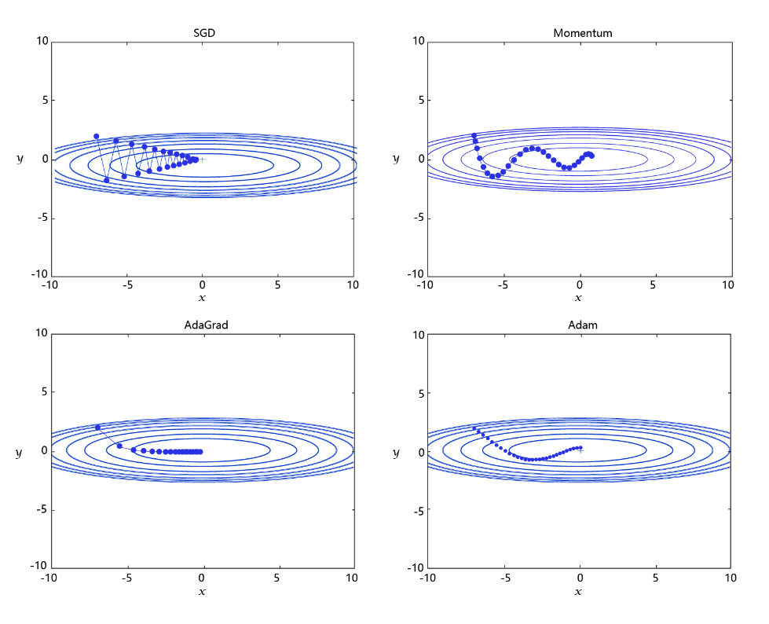

####
# https://aistudio.baidu.com/projectdetail/8774795
####


#### 学习率

在深度学习神经网络模型中，通常使用标准的随机梯度下降算法更新参数，学习率代表参数更新幅度的大小，即步长。当学习率最优时，模型的有效容量最大，最终能达到的效果最好。学习率和深度学习任务类型有关，合适的学习率往往需要大量的实验和调参经验。探索学习率最优值时需要注意如下两点：

- **学习率不是越小越好**。学习率越小，损失函数的变化速度越慢，意味着我们需要花费更长的时间进行收敛，如 图2 左图所示
- **学习率不是越大越好**。只根据总样本集中的一个批次计算梯度，抽样误差会导致计算出的梯度不是全局最优的方向，且存在波动。在接近最优解时，过大的学习率会导致参数在最优解附近震荡，损失难以收敛，如 图2 右图所示


> 不同学习率（步长过大/过小）的示意图

在训练前，我们往往不清楚一个特定问题设置成怎样的学习率是合理的，因此在训练时可以尝试调小或调大，通过观察Loss下降的情况判断合理的学习率，设置学习率的代码如下所示

```python
import paddle.nn.functional as F

#仅优化算法的设置有所差别
def train(model):
    model.train()
    
    #设置不同初始学习率
    opt = paddle.optimizer.SGD(learning_rate=0.001, parameters=model.parameters())
    # opt = paddle.optimizer.SGD(learning_rate=0.0001, parameters=model.parameters())
    # opt = paddle.optimizer.SGD(learning_rate=0.01, parameters=model.parameters())
    ...
```

#### 学习率的四种主流优化算法

学习率是优化器的一个参数，调整学习率看似是一件非常麻烦的事情，需要不断的调整步长，观察训练时间和Loss的变化。经过科研人员的不断的实验，当前已经形成了四种比较成熟的优化算法：SGD、Momentum、AdaGrad和Adam，效果如 图3 所示




- **SGD**： 随机梯度下降算法，每次训练少量数据，抽样偏差导致的参数收敛过程中震荡。

- **Momentum**： 引入物理“动量”的概念，累积速度，减少震荡，使参数更新的方向更稳定

每个批次的数据含有抽样误差，导致梯度更新的方向波动较大。如果我们引入物理动量的概念，给梯度下降的过程加入一定的“惯性”累积，就可以减少更新路径上的震荡，即每次更新的梯度由“历史多次梯度的累积方向”和“当次梯度”加权相加得到。历史多次梯度的累积方向往往是从全局视角更正确的方向，这与“惯性”的物理概念很像，也是为何其起名为“Momentum”的原因。类似不同品牌和材质的篮球有一定的重量差别，街头篮球队中的投手（擅长中远距离投篮）往往更喜欢稍重篮球。一个很重要的原因是，重的篮球惯性大，更不容易受到手势的小幅变形或风吹的影响。

因此，常常将 $y_t$ 看做对最近 1/(1- γ) 个时间步的 $x_t$ 值得加权平均。例如，当 γ=0.95 时，$y_t$ 可以被看作是对最近 20 个时间步的 $x_t$ 值的加权平均；

当 γ=0.9 时，yt 可以看作是对最近 10 个时间步的 xt 值的加权平均。而且，离当前时间步 t 越近的 xt 值获得的权重越大(越接近 1)

https://www.pianshen.com/article/48611288219/
https://www.pianshen.com/article/4680565118/

- **AdaGrad**： 根据不同参数距离最优解的远近，动态调整学习率。学习率逐渐下降，依据各参数变化大小调整学习率。

通过调整学习率的实验可以发现：当某个参数的现值距离最优解较远时（表现为梯度的绝对值较大），我们期望参数更新的步长大一些，以便更快收敛到最优解。当某个参数的现值距离最优解较近时（表现为梯度的绝对值较小），我们期望参数的更新步长小一些，以便更精细的逼近最优解。类似于打高尔夫球，专业运动员第一杆开球时，通常会大力打一个远球，让球尽量落在洞口附近。当第二杆面对离洞口较近的球时，他会更轻柔而细致的推杆，避免将球打飞。与此类似，参数更新的步长应该随着优化过程逐渐减少，减少的程度与当前梯度的大小有关。根据这个思想编写的优化算法称为“AdaGrad”，Ada是Adaptive的缩写，表示“适应环境而变化”的意思。RMSProp是在AdaGrad基础上的改进，学习率随着梯度变化而适应，解决AdaGrad学习率急剧下降的问题。

- **Adam**： 由于动量和自适应学习率两个优化思路是正交的，因此可以将两个思路结合起来，这是当前广泛应用的算法。

深度学习中的神经网络优化。Adam（Adaptive Moment Estimation）优化器是一种自适应优化算法，可以根据历史梯度信息来调整学习率。它结合了RMSProp和Momentum两种优化算法的思想，并且对参数的更新进行了归一化处理，使得每个参数的更新都有一个相似的量级，从而提高训练效果。Adam优化器在很多实际问题中表现良好，尤其是在大规模数据集上训练深度神经网络时效果更佳。

该方法“计算效率高，内存需求小，梯度对角重新缩放不变

一阶矩估计：梯度的平均值（期望）。
二阶矩估计：梯度平方的平均值（期望）。

```
def __init__(
        self,
        learning_rate=0.001,
        beta_1=0.9,
        beta_2=0.999,
        epsilon=1e-7,
        amsgrad=False,
        weight_decay=None,
        clipnorm=None,
        clipvalue=None,
        global_clipnorm=None,
        use_ema=False,
        ema_momentum=0.99,
        ema_overwrite_frequency=None,
        jit_compile=True,
        name="Adam",
        **kwargs
    ):
```
```
t = 0
m = 0
v = 0
β1 = 0.9   # 一阶矩估计指数衰减率
β2 = 0.999 # 二阶矩估计指数衰减率
δ = 10e-8 # 避免分母为0

while loss_gradient ≠ 0
    t = t + 1
    g = compute_gradient(loss_function)
    m = β1 * m + (1 - β1) * g        # 更新一阶矩向量
    v = β2 * v + (1 - β2) * g^2   # 更新二阶矩向量
    m_hat = m / (1 - β1^t)              # 考虑一阶矩估计偏差
    v_hat = v / (1 - β2^t)              # 考虑二阶矩估计偏差
    θ = θ - α * m_hat / (sqrt(v_hat) + δ)  # 更新参数

```

其中，m和v分别表示一阶矩和二阶矩的向量。β1和β2分别是一阶矩和二阶矩指数衰减率，它们控制了一阶/二阶矩估计向量的权重，通常设置为0.9和0.999。t表示迭代次数，δ是为了避免分母出现0而加的很小的数。α是学习率，用来控制每次更新参数的步伐。

Adam的优势

- 梯度修正: Adam使用梯度的一阶矩估计和二阶矩估计来修正梯度，这种修正可以减少梯度震荡，从而提高梯度在参数空间内的稳定性
- 学习率自适应: Adam使用动态学习率。在训练开始时，学习率较大，可以快速收敛。随着训练的进行，学习率逐渐减小，以避免在极值处震荡
- 均值修正: Adam对平均梯度和平均平方梯度进行了指数加权平均。由于训练开始时平均梯度和平均平方梯度值都较小，进行指数加权平均后，得到的修正值也相对较小。在训练后期，由于平均梯度和平均平方梯度值都较大，修正值也更大，这种修正保证了梯度下降过程的稳定性


我们可以尝试选择不同的优化算法训练模型，观察训练时间和损失变化的情况，代码实现如下。

```python
#仅优化算法的设置有所差别
def train(model):
    model.train()
    
    #四种优化算法的设置方案，可以逐一尝试效果
    opt = paddle.optimizer.SGD(learning_rate=0.01, parameters=model.parameters())
    # opt = paddle.optimizer.Momentum(learning_rate=0.01, momentum=0.9, parameters=model.parameters())
    # opt = paddle.optimizer.Adagrad(learning_rate=0.01, parameters=model.parameters())
    # opt = paddle.optimizer.Adam(learning_rate=0.01, parameters=model.parameters())
    ...
```

#### 模型参数初始化

模型参数初始化是指在训练前，给要训练的参数一个初始的值。比如我们最终的目的是走到山谷底，如果一开始把你放到半山腰和放到山脚，那是否能够顺利走到谷底以及走到谷底的速度是有很大差距的。同样，在我们训练神经网络的时候，训练参数初始值不同也会导致模型收敛速度和最终训练效果的不同。

在PaddlePaddle框架中，MNIST模型中用到的Conv2D和Linear层都有`weight_attr`和`bias_attr`两个参数，默认为None，表示使用默认的权重参数属性。这两个参数可以使用模型的`named_parameters()`函数获得。

```
# 遍历所有的参数名和参数值
for name, param in model.named_parameters():
    print(name, param)  
```

```
state_dict = model.state_dict() #collections.OrderedDict类型

print(state_dict.keys())

# 根据某个参数的名字，打印对应的参数值
# 如打印“conv1.weight”的参数值
print("conv1.weight:",state_dict["conv1.weight"])
```

通过`print(state_dict.keys())`打印的结果为`['conv1.weight', 'conv1.bias', 'conv2.weight', 'conv2.bias', 'fc.weight', 'fc.bias']`，对应我们模型结构：两个卷积层，一个全连接层。每一层都有一个权重项和偏置项。由于有两个卷积层，所以卷积的权重名称有对应的编号


`paddle.ParamAttr`可创建一个参数属性的对象，用户可设置参数的名称name、初始化方式initializer、学习率learning_rate、正则化规则regularizer、是否需要训练trainable、梯度裁剪方式need_clip、是否做模型平均do_model_average等属性。其参数初始化方式initializer默认值为None，表示权重参数采用Xavier初始化方式，偏置参数采用全0初始化方式。Xavier初始化方式可以缓解梯度消失的问题。

下面简单介绍几个常用的权重初始化方法：

- XavierUniform、XavierNormal初始化函数用于保持所有层的梯度尺度几乎一致。
- Constant为常量初始化函数，用于权重初始化，通过输入的value值初始化输入变量。
- KaimingNormal、KaimingUniform方法来自Kaiming He，Xiangyu Zhang，Shaoqing Ren 和 Jian Sun所写的论文: `Delving Deep into Rectifiers: Surpassing Human-Level Performance on ImageNet Classification`。这是一个鲁棒性特别强的初始化方法，并且适应了非线性激活函数（rectifier nonlinearities）。
- Normal随机正态（高斯）分布初始化函数


