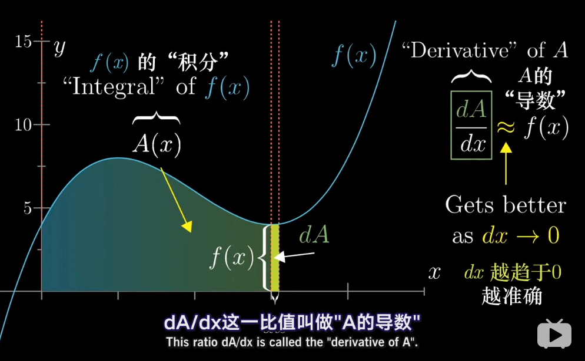

### 微积分

#### 导数



导数(derivative)代表了在自变量变化趋于无穷小的时候，函数值的变化与自变量的变化的比值。几何意义是这个点的切线。物理意义是该时刻的（瞬时）变化率。 

*注意*：在一元函数中，只有一个自变量变动，也就是说只存在一个方向的变化率，这也就是为什么一元函数没有偏导数的原因。在物理学中有平均速度和瞬时速度之说。平均速度有

$$ v=\frac{s}{t} $$

其中$v$表示平均速度，$s$表示路程，$t$表示时间。这个公式可以改写为

$$ \bar{v}=\frac{\Delta s}{\Delta t}=\frac{s(t_0+\Delta t)-s(t_0)}{\Delta t} $$

其中$\Delta s$表示两点之间的距离，而 $\Delta t$ 表示走过这段距离需要花费的时间。当 $\Delta t$ 趋向于0（ $\Delta t \to 0$ ）时，也就是时间变得很短时，平均速度也就变成了在$t_0$时刻的瞬时速度，表示成如下形式：

$$ v(t_0)=\lim_{\Delta t \to 0}{\bar{v}}=\lim_{\Delta t \to 0}{\frac{\Delta s}{\Delta t}}=\lim_{\Delta t \to 0}{\frac{s(t_0+\Delta t)-s(t_0)}{\Delta t}} $$

实际上，上式表示的是路程$s$关于时间$t$的函数在$t=t_0$处的导数。一般的，这样定义导数：如果平均变化率的极限存在，即有

$$ \lim_{\Delta x \to 0}{\frac{\Delta y}{\Delta x}}=\lim_{\Delta x \to 0}{\frac{f(x_0+\Delta x)-f(x_0)}{\Delta x}} $$

则称此极限为函数 $y=f(x)$ 在点 $x_0$ 处的导数。记作 $f'(x_0)$ 或 $y'\vert_{x=x_0}$ 或 $\frac{dy}{dx}\vert_{x=x_0}$ 或 $\frac{df(x)}{dx}\vert_{x=x_0}$。

通俗地说，导数就是曲线在某一点切线的斜率。

幂函数的导数 $\frac {d(x^n)}{dx} = nx^{n-1}$

$sin(\theta)$的导数 $cos(\theta)$

$cos(\theta)$的导数是 - $sin(\theta)$

 ($a^{x}$)' = $a^xlna$

($e^x$)' = $e^{x}$

常数的导数为0

#### 偏导数

既然谈到偏导数(partial derivative)，那就至少涉及到两个自变量。以两个自变量为例，$z=f(x,y)​$，从导数到偏导数，也就是从曲线来到了曲面。曲线上的一点，其切线只有一条。但是曲面上的一点，切线有无数条。而偏导数就是指多元函数沿着坐标轴的变化率。

注意：直观地说，偏导数也就是函数在某一点上沿坐标轴正方向的的变化率。

设函数 $z=f(x,y)​$ 在点 $(x_0,y_0)​$ 的领域内有定义，当$y=y_0​$ 时，$z​$ 可以看作关于$x​$的一元函数 $f(x,y_0)​$，若该一元函数在 $x=x_0​$ 处可导，即有

```math
    \lim_{\Delta x \to 0}{\frac{f(x_0+\Delta x,y_0)-f(x_0,y_0)}{\Delta x}}=A
```

函数的极限$A$存在。那么称 $A$ 为函数 $z=f(x,y)$ 在点 $(x_0,y_0)$ 处关于自变量$x$的偏导数，记作 $f_x(x_0,y_0)$ 或 $\frac{\partial z}{\partial x}\vert_{y=y_0}^{x=x_0}$ 或 $\frac{\partial f}{\partial x}\vert_{y=y_0}^{x=x_0}$ 或 $z_x\vert_{y=y_0}^{x=x_0}$。

偏导数在求解时可以将另外一个变量看做常数，利用普通的求导方式求解，比如 $z=3x^2+xy$ 关于 $x$ 的偏导数就为 $z_x=6x+y$ ，这个时候 $y$ 相当于 $x$ 的系数。

某点 $(x_0,y_0)$ 处的偏导数的几何意义为曲面 $z=f(x,y)$ 与面$x=x_0$ 或面 $y=y_0$ 交线在 $y=y_0$ 或 $x=x_0$ 处切线的斜率。

#### 导数和偏导数有什么区别？

导数和偏导没有本质区别，如果极限存在，都是当自变量的变化量趋于0时，函数值的变化量与自变量变化量比值的极限。


>一元函数，一个 $y$ 对应一个 $x$ ，导数只有一个。
>二元函数，一个 $z$ 对应一个 $x$ 和一个 $y$ ，有两个导数：一个是 $z$ 对 $x$ 的导数，一个是 $z$ 对 $y$ 的导数，称之为偏导。
>求偏导时要注意，对一个变量求导，则视另一个变量为常数，只对改变量求导，从而将偏导的求解转化成了一元函数的求导。


#### 定积分


### 统计学

事件的概率是衡量该事件发生的可能性的量度。虽然在一次随机试验中某个事件的发生是带有偶然性的，但那些可在相同条件下大量重复的随机试验却往往呈现出明显的数量规律。
​机器学习除了处理不确定量，也需处理随机量。不确定性和随机性可能来自多个方面，使用概率论来量化不确定性。
​概率论在机器学习中扮演着一个核心角色，因为机器学习算法的设计通常依赖于对数据的概率假设。

#### 随机变量（random variable）

表示随机现象（在一定条件下，并不总是出现相同结果的现象称为随机现象）中各种结果的实值函数（一切可能的样本点）。例如某一时间内公共汽车站等车乘客人数，电话交换台在一定时间内收到的呼叫次数等，都是随机变量的实例。
​随机变量与模糊变量的不确定性的本质差别在于，后者的测定结果仍具有不确定性，即模糊性。

​当变量的取值的概率不是1时,变量就变成了随机变量；当随机变量取值的概率为1时,随机变量就变成了变量。

比如：当变量$x$值为100的概率为1的话,那么$x=100$就是确定了的,不会再有变化,除非有进一步运算. ​ 当变量$x$的值为100的概率不为1,比如为50的概率是0.5,为100的概率是0.5,那么这个变量就是会随不同条件而变化的,是随机变量,取到50或者100的概率都是0.5,即50%。


#### 随机变量与概率分布的联系

一个随机变量仅仅表示一个可能取得的状态，还必须给定与之相伴的概率分布来制定每个状态的可能性。用来描述随机变量或一簇随机变量的每一个可能的状态的可能性大小的方法，就是 概率分布(probability distribution).

随机变量可以分为离散型随机变量和连续型随机变量。

相应的描述其概率分布的函数是

- 概率质量函数(Probability Mass Function, PMF):描述离散型随机变量的概率分布，通常用大写字母$P$表示。
- 概率密度函数(Probability Density Function, PDF):描述连续型随机变量的概率分布，通常用小写字母$p$表示


#### 独立性和条件独立性

**独立性** ​两个随机变量 $x$ 和 $y$ ，概率分布表示成两个因子乘积形式，一个因子只包含 $x$ ，另一个因子只包含 $y$ ，两个随机变量相互独立(independent)。

条件有时为不独立的事件之间带来独立，有时也会把本来独立的事件，因为此条件的存在，而失去独立性。
​举例：$P(XY)=P(X)P(Y)$ , 事件 $X$ 和事件 $Y$ 独立。此时给定 $Z$， $$ P(X,Y|Z) \not = P(X|Z)P(Y|Z) $$ 事件独立时，联合概率等于概率的乘积。这是一个非常好的数学性质，然而不幸的是，无条件的独立是十分稀少的，因为大部分情况下，事件之间都是互相影响的。

**条件独立性** ​给定$Z$的情况下,$X$和$Y$条件独立，当且仅当 $$ X\bot Y|Z \iff P(X,Y|Z) = P(X|Z)P(Y|Z) $$ 和 $Y$ 的关系依赖于 $Z$ ，而不是直接产生

> **举例**定义如下事件：  
> $X$：明天下雨；  
> $Y$：今天的地面是湿的；  
> $Z$：今天是否下雨；  
> $Z$事件的成立，对$X$和$Y$均有影响，然而，在$Z$事件成立的前提下，今天的地面情况对明天是否下雨没有影响。 


### 其它

#### 平均数

算数平均数 各数相加除以个数 

#### 中位数

从小到大排序  中间的那个数就是中位数，偶数个数中间会有两个数，所以取其平均值

#### 众数

数据集众出现频率最多的数字

#### 极差

极差指的是这些数字分开的有多远，最大数减去最小数

#### 中程数

考虑集中趋势的一种方式， 最大数和最小数的平均值


#### 平均绝对误差

（Mean Absolute Error，MAE），平均绝对误差就是指预测值与真实值之间平均相差多大 

#### 均方误差

均方误差是各数据偏离真实值的距离平方和的平均数。均方误差越小,说明预测模型的准确性越高

mean-square error, MSE）是反映估计量与被估计量之间差异程度的一种度量。设t是根据子样确定的总体参数θ的一个估计量，(θ-t)2的数学期望，称为估计量t的均方误差。它等于σ2+b2，其中σ2与b分别是t的方差与偏倚。


#### 平均绝对百分比误差

MAPE（平均绝对百分比误差）是一种度量模型预测准确性的指标，常用于评估时间序列预测模型的性能。它反映了预测值与实际值之间的差异，以百分比的形式表示。MAPE的值越小，说明模型的预测精度越高。在时间序列分析中，我们通常需要对未来的趋势和变化进行预测。因此，选择一个合适的评估指标至关重要。

MAPE的计算方式是对每个预测值与实际值之差进行绝对值和百分比的计算，然后取平均值。公式如下：

MAPE = (1/n) * Σ(|(predicted_value - actual_value)| / actual_value) * 100%

#### 离差

也称为偏差，deviation，它表明了某个原始数值与均值之间的绝对距离
离差的数学公式为：离差=X-μ（X为原始数值，μ为均值）

### 方差

离差平方的和的平均值。而这个数值，就是统计学上的方差（variance，简写为 ”V” ）


#### 标准差

方差开根号后的数值，即是标准差（Standard Deviation，简写为 “S” ）。相比方差，标准差表现出的数据波动程度会更接近原始数据中的数值

标准差不仅能够描述数据的分布状态，还可以作为度量标准，描述某个具体数值与均值的标准距离


#### 标量 scalar

一个标量表示一个单独的数，它不同于线性代数中研究的其他大部分对象（通常是多个数的数组）。我们用斜体表示标量。标量通常被赋予小写的变量名称。

#### 向量 vector
一个向量表示一组有序排列的数。通过次序中的索引，我们可以确定每个单独的数。通常我们赋予向量粗体的小写变量名称，比如x。向量中的元素可以通过带脚标的斜体表示向量$X_1$ , 第二个元素是$X_2$，以此类推。我们也会注明存储在向量中的元素的类型（实数、虚数等）		


**零均值**

零均值是指一个数据集合的平均值等于零。这个概念在计量经济学中很常见，因为它与许多经济模型所做的假设相符合。例如，经典的线性回归模型就假设残差项有零均值。这个假设使得回归系数的解释更加可信。


#### 伯努利分布

在概率论和统计学中，伯努利分布是以瑞士数学家雅各布·伯努利(Jacob Bernoulli)的名字命名的，是一个随机变量的离散概率分布

伯努利分布一般指0—1分布。 0—1分布就是n=1情况下的二项分布。即只先进行一次事件试验，该事件发生的概率为p，不发生的概率为1-p。这是一个最简单的分布，任何一个只有两种结果的随机现象都服从0-1分布


#### 纳什效率系数

纳什效率系数（Nash-Sutcliffe efficiency coefficient，简称：NSE），一般用以验证水文模型模拟结果的好坏

