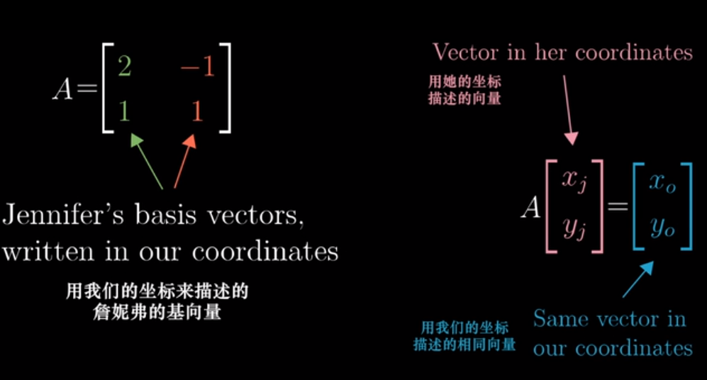
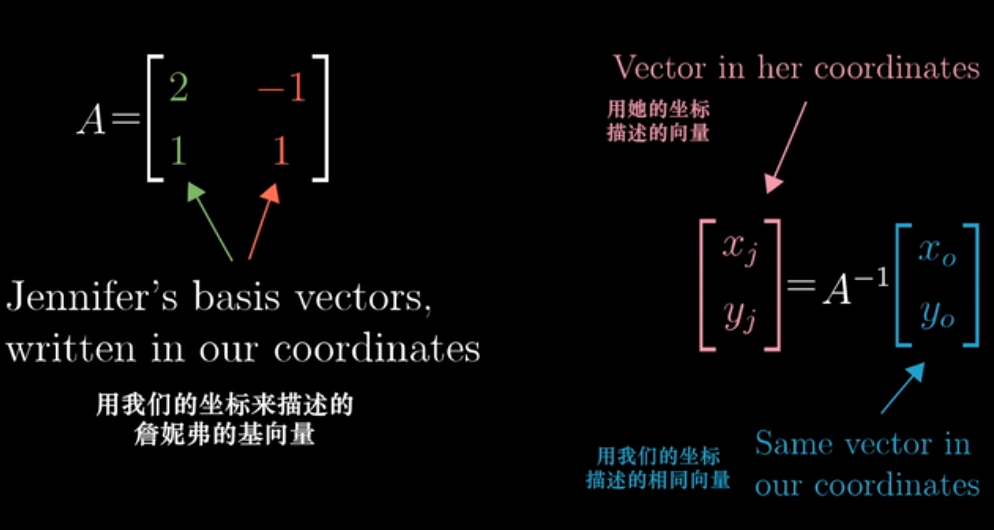
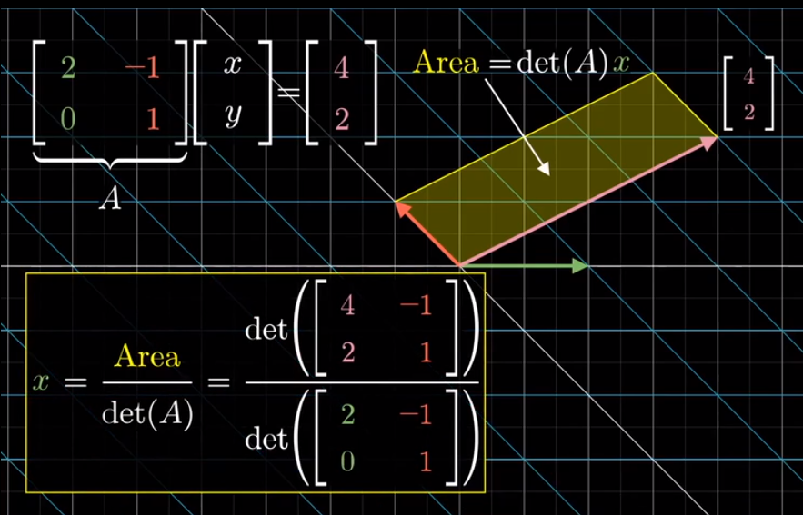

### 向量和矩阵

#### 标量、向量、矩阵、张量之间的联系

**标量（scalar）**
一个标量表示一个单独的数，它不同于线性代数中研究的其他大部分对象（通常是多个数的数组）。我们用斜体表示标量。标量通常被赋予小写的变量名称。

**向量（vector）**
一个向量表示一组有序排列的数。通过次序中的索引，我们可以确定每个单独的数。通常我们赋予向量粗体的小写变量名称，比如x。向量中的元素可以通过带脚标的斜体表示向量 $X_1$ , 第二个元素是 $X_2$ ，以此类推。我们也会注明存储在向量中的元素的类型（实数、虚数等）	

把数排成一列就是向量

```math
\left\{\begin{matrix}3\\6\end{matrix}\right\}
\left\{\begin{matrix}3\\4\\6\end{matrix}\right\}
\left\{\begin{matrix}x_1\\x_2\\\vdots\\x_n\end{matrix}  \right\} 
```

向量一般用粗体小写字母或粗体希腊字母表示，如 $x$ 等（有时候也会用箭头来标识，如 $\vec{x}$ ），其元素记作 $x_i$

- 物理专业视角：向量是空间中的箭头，决定一个向量的是它的长度和方向
- 计算机专业视角：向量是有序的数字列表
- 数学专业视角：向量可以是任何东西，只要保证两个向量相加以及数字与向量相乘是有意义的即可

**矩阵（matrix）**
矩阵是具有相同特征和纬度的对象的集合，表现为一张二维数据表。其意义是一个对象表示为矩阵中的一行，一个特征表示为矩阵中的一列，每个特征都有数值型的取值。通常会赋予矩阵粗体的大写变量名称，比如 $A$ 
当矩阵行数和列数相同时，称为方阵


**张量（tensor）**
在某些情况下，我们会讨论坐标超过两维的数组。一般地，一个数组中的元素分布在若干维坐标的规则网格中，我们将其称之为张量。使用 $A$ 来表示张量“A”。张量 $A$ 中坐标为 $(i,j,k)$ 的元素记作 $A_{(i,j,k)}$ 。

**四者之间关系**

> 标量是0阶张量，向量是一阶张量。举例：
> ​标量就是知道棍子的长度，但是你不会知道棍子指向哪儿。
> ​向量就是不但知道棍子的长度，还知道棍子指向前面还是后面。
> ​张量就是不但知道棍子的长度，也知道棍子指向前面还是后面，还能知道这棍子又向上/下和左/右偏转了多少。

#### 张量与矩阵的区别

- 从代数角度讲， 矩阵它是向量的推广。向量可以看成一维的“表格”（即分量按照顺序排成一排）， 矩阵是二维的“表格”（分量按照纵横位置排列）， 那么$n$阶张量就是所谓的$n$维的“表格”。 张量的严格定义是利用线性映射来描述。
- 从几何角度讲， 矩阵是一个真正的几何量，也就是说，它是一个不随参照系的坐标变换而变化的东西。向量也具有这种特性。
- 张量可以用3×3矩阵形式来表达。 
- 表示标量的数和表示向量的三维数组也可分别看作1×1，1×3的矩阵。 

#### 矩阵和向量相乘结果

若使用爱因斯坦求和约定（Einstein summation convention），矩阵 $A$ , 相乘得到矩阵 $C$ 可以用下式表示： $$a_{ik}*b_{kj}=c_{ij}\tag{1.3-1}$$ 其中, $a_{ik}$ , , 分别表示矩阵 $A$ , $B$ , $C$ 的元素, $k$ 出现两次，是一个哑变量（Dummy Variables）表示对该参数进行遍历求和。 而矩阵和向量相乘可以看成是矩阵相乘的一个特殊情况，例如：矩阵 $B$ 是一个 $n\times1$ 的矩阵。

### 向量的范数(norm)

定义一个向量为: $\vec{a}=[-5,6,8,-10]$ 。任意一组向量设为 $\vec{x}=(x_1,x_2,...,x_N)$ 。其不同范数求解如下：

- 向量的1范数：向量的各个元素的绝对值之和，上述向量 $\vec{a}$ 的1范数结果就是：29。

```math
	\Vert\vec{x}\Vert_1=\sum_{i=1}^N\vert{x_i}\vert
```
- 向量的2范数：向量的每个元素的平方和再开平方根，上述 $\vec{a}$ 的2范数结果就是：15。

```math
	\Vert\vec{x}\Vert_2=\sqrt{\sum_{i=1}^N{\vert{x_i}\vert}^2}
```
- 向量的负无穷范数：向量的所有元素的绝对值中最小的：上述向量 $\vec{a}$ 的负无穷范数结果就是：5。

```math
	\Vert\vec{x}\Vert_{-\infty}=\min{|{x_i}|}
```
- 向量的正无穷范数：向量的所有元素的绝对值中最大的：上述向量 $\vec{a}$ 的正无穷范数结果就是：10

```math
	\Vert\vec{x}\Vert_{+\infty}=\max{|{x_i}|}
```
- 向量的p范数

```math
	L_p=\Vert\vec{x}\Vert_p=\sqrt[p]{\sum_{i=1}^{N}|{x_i}|^p}
```

####  向量运算规则

加法 相同维数的向量之间的加法为(1)

```math
\left[ \begin{matrix}
	x_{1} \\
	x_{2} \\ 
	x_{3} \\
	\vdots\\
	x_{n}
\end{matrix}\right]  + \left[ \begin{matrix}
	y_{1} \\
	y_{2} \\ 
	y_{3} \\
	\vdots\\
	y_{n}
\end{matrix}\right]  = \left[ \begin{matrix}
	x_{1} + y_{1} \\
	x_{2} + y_{2} \\ 
	x_{3} + y_{3} \\
	\vdots\\
	x_{n} + y_{n}
\end{matrix}\right]
```

数量乘法 任意的常数 $c$ 和向量的乘法为(2)

$$c \left[ \begin{matrix}
	x_{1} \\
	x_{2} \\ 
	x_{3} \\
	\vdots\\
	x_{n}
\end{matrix}\right] = \left[ \begin{matrix}
	cx_{1} \\
	cx_{2} \\ 
	cx_{3} \\
	\vdots\\
	cx_{n}
\end{matrix}\right]
$$


### 张成的空间(span)

**任何一个向量都是由基向量拉伸或缩放组合而来的**

$\vec{v}=a\hat{i}+b\hat{j}$   （ $\hat{i} , \hat{j}$ 被称为坐标系的“**基向量**”）

三维

```math
\vec V = \left\{
 \begin{matrix}
   x \\
   y  \\
   z  
  \end{matrix} 
\right\} = x \hat i + y \hat j + z \hat k
```

**两个向量标量乘法之和的结果被称为这两个向量的线性组合**

**所有可以表示为给定向量线性组合的向量集合，被称为给定向量张成(span)的空间**

张成的空间是向量 $\vec \nu$ 和 $\vec \omega$ 全部线性组合构成的向量集合，即：

```math
a \vec\nu  + b \vec\omega
```
  ( $a$ , $b$ 在实数范围内变动)

### 线性相关和线性无关

两个向量恰好共线时 即一组向量中至少有一个是多余的，没有对张成空间做出任何贡献

你有多个向量，并且可以移除其中一个而不减少张成空间

当这种情况发生时，相关术语称它为**线性相关**

$\vec U$ = $a \vec V + b \vec W$   ($a, b$ 取某些值)

另一种表示方法就是其中一个向量可以表示为其它向量的线性组合，因为这个向量已经落在其它向量张成的空间之中

所有的向量都给张成的空间添加了新的维度 它就被称为**线性无关**

$\vec W \neq a \vec V$    ($a$ 取所有值)

$\vec U \neq a \vec V + b \vec W$   ($a, b$ 取所有值)

### 向量空间的基

基的严格定义

**向量空间中的一组基是张成该空间的一个线性无关向量的集合。**

只有当以下两个条件同时满足时，一组向量  ($\vec e_{1},... \vec e_{n} "$)   才能成为基底。

1. （当前空间中的）任意向量 $v$ 都可以表示成 $\vec v = x_{1} \vec e_{1} + ... + x_{n} \vec e_{n}$ 的形式（** $x_{1}, ... x_{n}$ **为任意数)
2. 并且这种表示方法是唯一的

向量空间的维数

空间的维数可以通过基向量的个数来定义

维数 = 基向量的个数 = 坐标的分量数

### 线性变换

“变换” 本质上是“函数”的一种花哨的说话， 它接受输入内容，并输出对应的结果

如果一个变换具有以下两条性质，我们就称它为线性的

1. 直线在变换后依旧是直线 ，不能有所弯曲
2. 原点保持固定

线性的严格定义：


**线性变换保持网格线平行且等距分布，并且保持原点不动**

$\vec v$ =-1 $i$ + 2 $j$，当整个空间完成线性变换后，其**对应的线性组合并不发生改变（平行等距不离开原点，始终保持相似关系）**，也即寻找到变换后的基向量便可以找到对应的变换向量。

```math
\left[\begin{matrix}3\\2\end{matrix}\right]
```  
就是变换后的 $i$ 。  

```math
\left[ \begin{matrix}2\\1\end{matrix}\right]
```   
就是变换后的 $j$    我们通常将这些坐标包装在一个2X2的格子中，称它为2x2矩阵

```math
\left[ \begin{matrix}3 & 2\\ 2 & 1\end{matrix}\right]
```    

矩阵在这里只是一个记号，它含有描述一个线性变换的信息

如果你有一个描述线性变换的2x2矩阵，以及一个给定向量，你想了解线性变换对这个向量的作用，将它们分别与矩阵的特定列相乘，然后将结果相加 即如下

```math
\left[ \begin{matrix}
	a & b\\ 
	c & d
\end{matrix}\right] \left[ \begin{matrix}
	x\\ 
	y
\end{matrix}\right] = x \left[ \begin{matrix}
	a\\ 
	c
\end{matrix}\right] + y \left[ \begin{matrix}
	b\\ 
	d
\end{matrix}\right] = \left[ \begin{matrix}
	ax + by\\ 
	cx + dy
\end{matrix}\right]
```
**矩阵向量乘法**

矩阵向量乘法就是计算线性变换作用于给定向量的一种途径


>  旋转矩阵

任意向量 

```math
\left[ \begin{matrix}
	x\\ 
	y
\end{matrix}\right]
```
逆时针旋转90°  
```math
\left[ \begin{matrix}
	0\\ 
	1
\end{matrix}\right]
```  
就是变换后的 $i$   

```math
\left[ \begin{matrix}
	-1\\ 
	0
\end{matrix}\right]
```
就是变换后的 $j$    即
```math
\left[ \begin{matrix}
	0 & -1\\ 
	1 & 0
\end{matrix}\right] \left[ \begin{matrix}
	x\\ 
	y
\end{matrix}\right]
```

>  剪切 Shear 矩阵 (联想为正方形在对角线的压缩或伸长)

$i$  保持不变 

```math
\left[ \begin{matrix}
	1\\ 
	0
\end{matrix}\right]
```   
$j$ 移动到 
```math
\left[ \begin{matrix}
	1\\ 
	1
\end{matrix}\right]
```     
即 
```math 
\left[ \begin{matrix}
	1 & 1\\ 
	0 & 1
\end{matrix}\right] \left[ \begin{matrix}
	x\\ 
	y
\end{matrix}\right]
```

> 先旋转在剪切 后的矩阵

```math
\left[ \begin{matrix}
	1 & -1\\ 
	1 & 0
\end{matrix}\right]
```
如果一个向量，先旋转再剪切 ，计算首先将它左乘旋转矩阵，然后将得到的结果再左乘剪切矩阵。结果都应该与复合变换作用结果相同


​	两个矩阵相乘的几何意义就是两个线性变换相继作用

三维

```math
\left[
 \begin{matrix}
   0 & 1 & 2\\
   3 & 4 & 5 \\
   6 & 7 & 8 
  \end{matrix}\right]  \left[\begin{matrix}
   x \\
   y  \\
   z  
  \end{matrix}\right] = x  \left[\begin{matrix}
   0 \\
   3  \\
   6  
  \end{matrix}\right] + y  \left[\begin{matrix}
   1 \\
   4  \\
   7  
  \end{matrix}\right]+ z \left[\begin{matrix}
   2 \\
   5  \\
   8  
  \end{matrix}\right]
```


### 矩阵（matrix）

矩阵就是映射，或者说是向量运动的描述。
将 $N$维向量 $x$ 乘以 $M * N$ 矩阵 $A$ 能得到 $M$ 维向量 $ Y = A x$ 。也就是说，指定了矩阵  $A$ ，就确定了从向量到另外一个向量的映射。

矩阵类比函数 从右向左转换 f(g(x)) 是先g 在f 

矩阵乘积服从分配律： $A(B+C) = AB + AC$
矩阵乘积也服从结合律： $A(BC) = (AB)C$

矩阵乘积不满足交换律: $AB = BA$ 的情况并非总是满足

加法

只要两个矩阵的形状一样，就可以把两个矩阵相加，两个矩阵相加是指对应位置的元素相加。 矩阵 $A$ ,  $B$ 相加得到矩阵 $C$ 可以用下式表示: $a_{ij} + b_{ij}=c_{ij}$

乘法：

两个矩阵 $A$ 和 $B$ 的矩阵乘积是第三个矩阵 $C$ 。为了使乘法可被定义，矩阵A的列数必须和矩阵B的行数相等。如果矩阵 $A$ 的形状是 M*N，矩阵 $B$ 的形状是 N*P，那么矩阵 $C$ 的形状是 M*P 。例如 $C = AB$

具体地，该乘法操作定义为：

$C_{i,j} = \sum_{k} A_{i,k} B_{k,j}$

$k$ 出现两次，是一个哑变量（Dummy Variables）表示对该参数进行遍历求和


线性方程组


$A \vec x = \vec v$    A称为线性方程组的系数矩阵  由线性方程组的系数矩阵和常数构成的矩阵称为改线性方程组的**增广矩阵** 

A逆乘以A等于一个‘什么都不做’的矩阵。$A^{-1}A = \left( \begin{matrix}
	1 & 0\\ 
	0 & 1
\end{matrix}\right) $  这个什么都不做的变换叫做“**恒等变换**”

- 一旦找到A逆，就可以在两步同乘A的逆矩阵$A^{-1}$来求解向量方程  即$ A^{-1}A \vec x = A^{-1}\vec v $  即  $ \vec x = A^{-1}\vec v $
- 行列式不为零($det (A) \neq 0$)，则矩阵的逆存在

#### 矩阵的秩

矩阵的秩，为变换后的空间的维数

当变换的结果为一条直线时，也就是说结果是一维的，我们称这个变换的秩为1

当变换的的向量落在一个二维平面上，我们称这个变换的秩为2

#### 列空间

矩阵 $A$ 的列空间为所有可能的输出向量 $Av$ 构成的集合，换句话说，列空间就是矩阵的列所张成的空间。

所以更精确的秩的定义是列空间的维数；当秩达到最大值时，意味着秩和列数相等，也即满秩。

#### 零空间

变换后落在原点的向量的集合被称为矩阵的‘零空间’或者‘核’。

- 零向量一定在列空间中
- 对于一个满秩变换来说，唯一能在变换后落在原点的就是零向量自身
- 对于一个非满秩的矩阵来说，它将空间压缩到一个更低的维度上，变换后的已给向量落在零向量上，而“零空间”正是这些向量所构成的空间

#### 奇异矩阵

行列式为零的矩阵

#### 逆矩阵

设**A**是数域上的一个n阶矩阵，若在相同数域上存在另一个n阶矩阵***B***，使得： ***AB***=**BA**=**E** ，则我们称***B***是**A**的逆矩阵，而A则被称为可逆矩阵。注：E为单位矩阵

$A$ 的逆矩阵记作 $A^{-1}$  = $\frac{1}{det(A)} A^*$    其中  $A^*$ 是的伴随矩阵。

设矩阵 $A= (a_{ij})_{n*n}$  将矩阵 $A$ 的元素 $a_{ij}$ 所在的第i行第j列元素划去后，剩余的各元素按原来的排列顺序组成的n-1阶矩阵所确定的行列式称为元素 $a_{ij}$ 的余子式,记为 $M_{ij}$ , 称 $A_{ij}$ = $(-1)^{i+j}M_{ij}$ 为元素 $a_{ij}$ 的代数余子式


### 行列式

线性变换的行列式即线性变换改变面积的比例

线性变换对面积产生改变的比例，被称为这个改变的行列式

```math
det（\left [ \begin{matrix}
	3 & 2\\ 
	0 & 2
\end{matrix}\right]）= 6
```

行列式是允许出现负值的(一个区域缩放的负倍数即空间取向发生了变换 $i$ 在$j$的左边)

```math
det（\left [ \begin{matrix}
	1 & 2\\ 
	3 & 4
\end{matrix}\right]）= -2.0
```
但是行列式的绝对值依然表是区域面积的缩放比例

在三维空间中行列式是体积的缩放比例

```math
det（\left [ \begin{matrix}
	1 & 0 & 1\\ 
	0.5 & 1 & 1.5 \\ 1 & 0 & 1 \end{matrix}\right]）= 0
```
矩阵的列必然线性相关

三维空间的取向，“右手定则”    食指指向$x$ 轴   大拇指指向z轴，中指指向y轴

对于一个2*2的矩阵公式

```math
det（\left [ \begin{matrix}
	a & b\\ 
	c & d
\end{matrix}\right]）= ad-bc 
```

对于一个3*3的矩阵公式如下

```math
det（\left [ \begin{matrix}
	a & b & c\\ 
	d & e & f \\ g & h & i 
\end{matrix}\right]）= a det（\left [ \begin{matrix}
	e & f\\ 
	h & i
\end{matrix}\right]）-b det（\left [ \begin{matrix}
	d & f\\ 
	g & i
\end{matrix}\right]）+c det（\left [ \begin{matrix}
	d & e\\ 
	g & h
\end{matrix}\right]）
```

$det (M_1M_2) = detM_1detM_2$   最终缩放比例等于第一次乘第二次缩放比


### 向量的点积

向量的点积

点乘，也叫向量的内积、数量积。顾名思义，求下来的结果是一个数。两个维度相同的向量，点积定义如下：

```math
\left[\begin{matrix}
   2 \\
   5  \\
   1  
  \end{matrix}\right] . \left[\begin{matrix}
   4 \\
   7  \\
   5  
  \end{matrix}\right] = 2·4 + 5·7 + 1·5
```

- 点积和顺序无关
- 两个向量相互垂直时，点积为0
- 两个向量方向相同时，点积为正；相反时，点积为负

 $(2 \vec V) \vec W = 2 (\vec V \vec W)$


两个向量点乘，就是将其中一个向量转换为线性变换

```math
\vec p · \left[
 \begin{matrix}
   x \\
   y  \\
   z  
  \end{matrix} 
\right] = p_1x + p_2y + p_3z
```
点积的几何意义将其他向量投影到p上，然后将投影的长度与p的长度相乘

### 对偶向量

给定一个向量，如果存在这样一个映射,它把给定的向量映射为一个实数,就说这个映射是对偶向量。例如一个n维行向量(a1,a2...an)，它既可以理解为行向量，也可理解为某种映射，该映射把给定的n维列向量(b1,b2...bn)(矢量)映射为实数k,k=a1b1+a2b2+...anbn，即矩阵的乘积。则这个映射满足对偶向量的定义，因此行向量(a1,a2...an)是对偶(b1,b2...bn)的对偶向量。

### 向量的叉积

叉乘，也叫向量的外积、向量积。顾名思义，求下来的结果是一个向量。

- 向量的叉积不满足交换律

叉积的结果是一个向量，方向与a,b均垂直，并且满足右手系

 $\vec V · \vec W = \vec P$     $\vec P$ 向量的长度为 $det(\vec V \vec W)$    方向垂直于 $\vec V$ 和 $\vec W$

```math
\left[
 \begin{matrix}
   v_1 \\
   v_2  \\
   v_3  
  \end{matrix} 
\right] \times \left[
 \begin{matrix}
   w_1 \\
   w_2  \\
   w_3  
  \end{matrix} 
\right] = det（\left [ \begin{matrix}
	i & v_1 & w_1\\ 
	j & v_2 & w_2 \\ k & v_3 & w_3 
\end{matrix}\right]）  = i(v_2w_3 - v_3w_2) + j(v_3w_1 - v_1w_3) + k(v_1w_2 - v_2w_1) = i(v_2w_3 - v_3w_2) - v1(jw_3 - w_2k) + w_1(jv_3 - v_2k)
```

其中ijk为基向量


当你将向量p和某个向量（x,y,z）点乘时，所得结果等于一个3X3矩阵的行列式  即

$p_1$ = $v_2w_3 - v_3w_2$

$p_2$ = $v_3w_1 - v_1w_3$

$p_3$ = $v_1w_2 - v_2w_1$


### 基变换

在不同的坐标系转换

对于两个不同基向量的坐标系，它们所说的[2; 1]（任意的除零向量的具体的向量）并不是同一个向量。比如小明的基向量下的[2; 1]可能是小红的基向量下的[1; 2]。将小明所说的向量转换为小红理解的向量，这个过程就是基变换。

表达式 $A^{-1}MA$ 暗示这一种数学上的转移作用

### 特征向量和特征值

在一个变换矩阵中，可能存在一些向量，在经过变换后方向并没有改变，只是长度变为原来的n倍（即在变换后仍然留在自己的张成空间），也就是说变换矩阵的对这些向量的效果只是数乘（scaling）。满足这种条件的向量称为该变换矩阵的**特征向量**，而这个数乘n倍的n则为该特征向量的**特征值**

每一个特征向量都有一个所属的值，被称为“特征值”  即衡量特征向量在变换中拉伸或压缩比例的因子

如果说一个向量 $v$是矩阵 $A$ 的特征向量，将一定可以表示成下面的形式：

$Av$ = $\lambda v$

$A$   代表变换的矩阵

$v$  特征向量   $\lambda$  是一个数，也就是对应的特征值


#### 特征基

使用变换矩阵的特征向量作为坐标系的基向量，称为特征基

如果基向量恰好是特征向量  如 
```math
\left[
 \begin{matrix}
   -1 & 0 \\
   0 & 2  
  \end{matrix} 
\right]
``` 
位于矩阵的对角线上，而其他元素均为0

除了对角以外的其它元素均为0的矩阵被称为对角矩阵     它们的所有基向量都是特征向量，矩阵的对角元素是它们所属的特征值

对于非对角矩阵的幂次计算，变换你的坐标系，使得这些特征向量（能张成全空间的特征向量）就是基向量。即用特征向量作为基

注： 并非所有的矩阵都能找到俩个合适的特征向量作为特征基






#### 克莱姆法制


