### 统计学

事件的概率是衡量该事件发生的可能性的量度。虽然在一次随机试验中某个事件的发生是带有偶然性的，但那些可在相同条件下大量重复的随机试验却往往呈现出明显的数量规律。
​机器学习除了处理不确定量，也需处理随机量。不确定性和随机性可能来自多个方面，使用概率论来量化不确定性。
​概率论在机器学习中扮演着一个核心角色，因为机器学习算法的设计通常依赖于对数据的概率假设。

#### 随机变量（random variable）

表示随机现象（在一定条件下，并不总是出现相同结果的现象称为随机现象）中各种结果的实值函数（一切可能的样本点）。例如某一时间内公共汽车站等车乘客人数，电话交换台在一定时间内收到的呼叫次数等，都是随机变量的实例。
​随机变量与模糊变量的不确定性的本质差别在于，后者的测定结果仍具有不确定性，即模糊性。

​当变量的取值的概率不是1时,变量就变成了随机变量；当随机变量取值的概率为1时,随机变量就变成了变量。

比如：当变量$x$值为100的概率为1的话,那么$x=100$就是确定了的,不会再有变化,除非有进一步运算. ​ 当变量$x$的值为100的概率不为1,比如为50的概率是0.5,为100的概率是0.5,那么这个变量就是会随不同条件而变化的,是随机变量,取到50或者100的概率都是0.5,即50%。


#### 随机变量与概率分布的联系

一个随机变量仅仅表示一个可能取得的状态，还必须给定与之相伴的概率分布来制定每个状态的可能性。用来描述随机变量或一簇随机变量的每一个可能的状态的可能性大小的方法，就是 概率分布(probability distribution).

随机变量可以分为离散型随机变量和连续型随机变量。

相应的描述其概率分布的函数是

- 概率质量函数(Probability Mass Function, PMF):描述离散型随机变量的概率分布，通常用大写字母 $P$ 表示。
- 概率密度函数(Probability Density Function, PDF):描述连续型随机变量的概率分布，通常用小写字母 $p$ 表示


#### 独立性和条件独立性

**独立性** ​两个随机变量 $x$ 和 $y$ ，概率分布表示成两个因子乘积形式，一个因子只包含 $x$ ，另一个因子只包含 $y$ ，两个随机变量相互独立(independent)。

条件有时为不独立的事件之间带来独立，有时也会把本来独立的事件，因为此条件的存在，而失去独立性。
​举例：$P(XY)=P(X)P(Y)$ , 事件 $X$ 和事件 $Y$ 独立。此时给定 $Z$， $$P(X,Y|Z) \not = P(X|Z)P(Y|Z)$$ 事件独立时，联合概率等于概率的乘积。这是一个非常好的数学性质，然而不幸的是，无条件的独立是十分稀少的，因为大部分情况下，事件之间都是互相影响的。

**条件独立性** ​给定$Z$的情况下, $X$ 和 $Y$ 条件独立，当且仅当 $$X\bot Y|Z \iff P(X,Y|Z) = P(X|Z)P(Y|Z)$$ 和 $Y$ 的关系依赖于 $Z$ ，而不是直接产生

> **举例**定义如下事件：  
> $X$：明天下雨；  
> $Y$：今天的地面是湿的；  
> $Z$：今天是否下雨；  
> $Z$ 事件的成立，对 $X$ 和 $Y$ 均有影响，然而，在 $Z$ 事件成立的前提下，今天的地面情况对明天是否下雨没有影响。 


### 概率分布  

在数据科学领域，概率分布不仅有助于深入洞察数据内在规律，还能够为模型预测、假设检验、模拟实验等任务提供强大工具，从而提升数据驱动决策的准确性和可靠性。本文将详细总结这10种不可或缺的概率分布及其在实践中的典型应用。

#### 正态分布

正态分布Normal Distribution，也被称为高斯分布（Gaussian  Distribution），是一种连续型概率分布。

正态分布的图形呈现出对称的钟形曲线，该曲线以均值（μ）为中心，标准差（σ）为宽度，左右两边完全对称。曲线在均值处达到峰值，随着与均值距离的增加，密度函数值逐渐减小

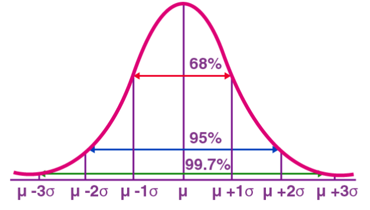

参数含义

- 均值（μ）：决定了分布的中心位置，所有数据围绕这个值集中分布。
- 标准差（σ）：衡量了数据分布的离散程度，标准差越大，数据分布越分散；标准差越小，数据分布越集中。在正态分布图形中，标准差决定了曲线的宽度，即钟形曲线的“胖瘦”。

概率密度函数

正态分布的概率密度函数公式为：

```math

f(x) = \frac{1}{\sigma \sqrt{2\pi}} \exp\left(-\frac{(x - \mu)^2}{2\sigma^2}\right) 

```

这意味着给定一个特定数值x，在正态分布下，单位区间内随机变量取值为x的概率密度可以通过上述函数计算得出。

当μ=0,σ=1时，正态分布就成为标准正态分布


实际应用

- 人的身高、体重等生理指标通常近似服从正态分布，例如，大多数人的身高集中在某个平均值附近，过高或过矮的人数相对较少。
- 考试成绩往往符合正态分布规律，大部分学生的得分集中在平均分附近，极高的和极低的成绩人数较少。

示例代码

```
# 生成标准正态分布随机数
a = np.random.randn(3, 3)

# 生成正态分布随机数，指定均值loc和方差scale
a = np.random.normal(loc = 1.0, scale = 1.0, size = (3,3))
```

如下代码定义了一个均值为100、标准差为15的正态分布，并生成了1000个模拟的考试成绩。通过绘制这些模拟成绩的直方图，并叠加了根据正态分布概率密度函数计算出的理论曲线，可以直观地看到模拟数据与正态分布之间的拟合情况，进一步证实了考试成绩分布符合正态分布的特点。


```
# 定义正态分布参数
mu = 100  # 均值，假设考试平均分为100分
sigma = 15  # 标准差，假设考试成绩的标准差为15分

# 生成1000个服从正态分布的模拟考试成绩
exam_scores = np.random.normal(mu, sigma, 1000)


# 绘制正态分布直方图
plt.hist(exam_scores, bins='auto', density=True, alpha=0.6, color='b')
plt.title('模拟考试成绩的正态分布：均值μ=%s, 标准差σ=%s' % (mu, sigma))
plt.xlabel('考试成绩'), plt.ylabel('概率密度')

# 绘制理论上的正态分布曲线
x = np.linspace(mu - 3*sigma, mu + 3*sigma, 100)
plt.plot(x, (1/(sigma * np.sqrt(2 * np.pi)) * np.exp(-(x - mu)**2 / (2 * sigma**2))), 'r', linewidth=2, label='理论正态分布曲线')

plt.legend()
plt.show()
```

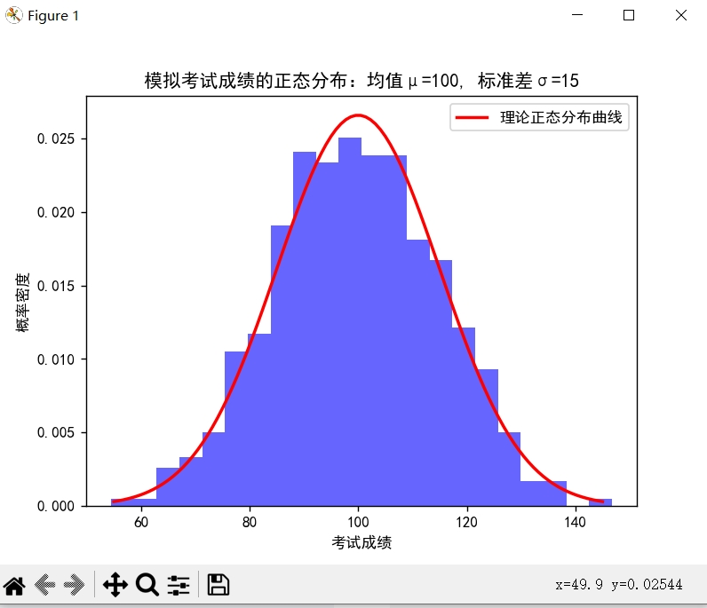


#### 伯努利分布


伯努利分布（Bernoulli  Distribution）是一种离散型概率分布，用于描述只有两种可能结果的单次随机试验。伯努利试验可以是正面或反面，成功或失败，是或否等。例如，抛硬币、检测产品是否合格、某人是否购买某种产品等

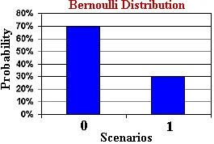


概率质量函数

对于伯努利随机变量X，其取值只能是0或1。

    当X=1时，即发生成功事件，其概率质量函数为P(X=1) = p。
    当X=0时，即发生失败事件，其概率质量函数为P(X=0) = 1-p。

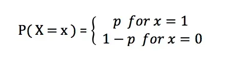

其中，参数p决定了分布的形状，当p=0.5时，伯努利分布实际上就是均匀分布，因为此时成功和失败的概率相等

实际应用

伯努利分布的一个重要应用是在二项分布中，当进行n次独立且同分布的伯努利试验时，试验成功的次数就服从二项分布。

示例代码

如下代码定义了一个成功概率为0.3的伯努利分布，并计算出其在结果0（失败）和1（成功）时的概率质量函数值，再使用matplotlib将这些概率以条形图的形式展示出来，直观反映了伯努利分布的概率分布情况。

```
import matplotlib.pyplot as plt
from scipy import stats
from matplotlib.font_manager import FontProperties

# 设置中文字体为SimHei
font = FontProperties(fname=r"C:\Windows\Fonts\simsun.ttc", size=14)
plt.rcParams['font.family'] = 'sans-serif'
plt.rcParams['font.sans-serif'] = ['SimHei']

# 定义伯努利分布参数
p = 0.3  # 硬币正面朝上的概率

# 创建伯努利分布对象
ber_dist = stats.bernoulli(p)

# 定义结果值及其标签
x = [0, 1]  # 结果只有两种：0（失败）和1（成功）
x_name = ['失败', '成功']  # 对应的结果标签

# 计算每种结果的概率
pmf = [ber_dist.pmf(x[0]), ber_dist.pmf(x[1])]  # 分别计算失败和成功的概率

# 绘制概率质量函数的条形图
plt.bar(x, pmf, width=0.15)
plt.xticks(x, x_name)
plt.ylabel('概率')
plt.title('伯努利分布的概率质量函数 (p={})'.format(p))

# 显示图像
plt.show()
```

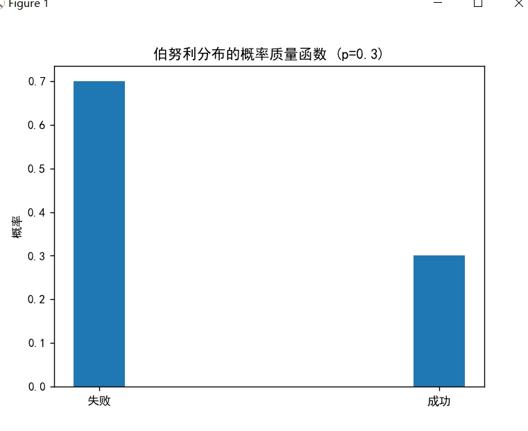


####  二项分布

二项分布（Binomial Distribution）是一种离散型概率分布，用于描述在n次独立重复试验中成功次数的概率分布。每次试验只有两种可能的结果：成功（记为1）或失败（记为0）。成功的概率为p，失败的概率为1-p。

这样的单次成功/失败试验又称为伯努利试验。实际上，当n=1时，二项分布就是伯努利分布

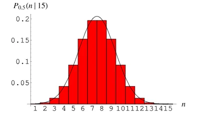

参数

    n：总共进行的试验次数。
    p：单次试验成功的概率。


概率质量函数

```math
P(X=k) = \binom{n}{k} p^k (1-p)^{n-k} = C_n^k p^k (1-p)^{n-k}
```

其中，P(X=k)表示成功次数为的概率，$\binom{n}{k}$ 是组合数，即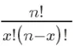
，又记为$C_n^k$或者$C(n,k)$,表示从n次试验中选择k次成功的组合数，是成功的概率，取值范围在0和1之间，n是试验次数。

性质

- 二项分布中的随机变量X是一个离散型随机变量，其取值范围是从0到n（包含0和n）。
- 当试验次数n趋于无穷大，且成功概率p不随试验次数变化时，如果np和n(1-p)都趋于正无穷，则二项分布会趋近于泊松分布。

实际应用

二项分布在实际中的应用：如在医学研究中，患者接受某种治疗的成功率；在工程中，产品在生产过程中的合格率等

示例代码

如下代码定义了一个二项分布，其中试验次数n为100，成功概率p为0.6。然后使用scipy库中的binom函数创建二项分布对象，绘制出所有可能成功次数对应的概率质量函数图，以直观展示二项分布的特点。

```
import matplotlib.pyplot as plt
import numpy as np
from matplotlib.font_manager import FontProperties
from scipy import stats
from scipy.stats import binom

### 二项分布

font = FontProperties(fname=r"C:\Windows\Fonts\simsun.ttc", size=14)
plt.rcParams['font.family'] = 'sans-serif'
plt.rcParams['font.sans-serif'] = ['SimHei']


# 定义二项分布参数
n = 100  # 总共进行100次试验
p = 0.6  # 每次试验成功的概率

# 创建一个二项分布对象
binomial_dist = binom(n, p)

# 绘制二项分布的概率质量函数
x = np.arange(0, n+1)  # 成功次数的可能取值范围
y = binomial_dist.pmf(x)  # 对应的成功次数概率
plt.plot(x, y)
plt.xlabel('成功次数')
plt.ylabel('概率')
plt.title('100次独立重复试验中成功次数的概率分布（p=0.6）')

# 显示图像
plt.show()
```

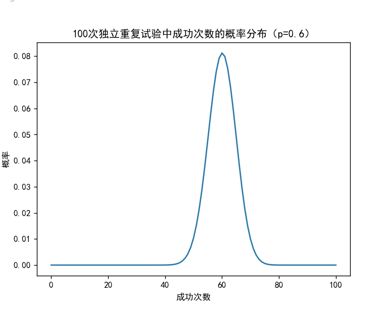


#### 泊松分布

泊松分布（Poisson Distribution）是一种离散型概率分布，它主要用来描述单位时间（或单位面积、单位体积等）内随机事件发生次数的概率分布情况。当这些事件在各个小的时间间隔内独立地以恒定的平均速率发生时，该分布尤为适用。

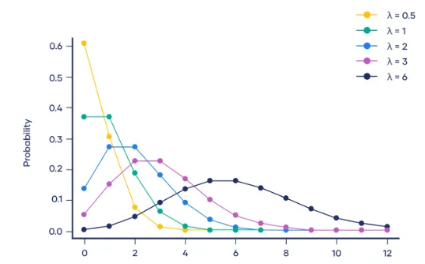


参数

- λ（lambda）：这是泊松分布的唯一参数，表示单位时间内事件发生的平均数量，或指的是事件发生的强度。

概率质量函数

P(X=k)表示在单位时间内事件发生k次的概率，其公式为：

```math
P(X=k) = \frac{e^{-\lambda} \cdot \lambda^k}{k!}
```

其中，e 是自然对数的底数，约为2.71828；λ 是事件的平均发生率；k! 表示k的阶乘，即1到k的所有整数相乘的结果


实际应用

泊松分布在实际中的应用：例如在电话呼叫中心，每分钟打进的电话数量可以看作是泊松分布，平均每分钟打进的电话数量即为λ

示例代码

如下代码定义了一个泊松分布，其中参数λ表示平均每分钟打进的电话数量为5。然后创建了一个泊松分布对象，并绘制了泊松分布的概率质量函数图，直观展示了不同电话数量下的概率分布情况。

```
import matplotlib.pyplot as plt
import numpy as np
from matplotlib.font_manager import FontProperties
from scipy.stats import poisson

#### 泊松分布（Poisson Distribution）

# 设置中文字体为SimHei
font = FontProperties(fname=r"C:\Windows\Fonts\simsun.ttc", size=14)
plt.rcParams['font.family'] = 'sans-serif'
plt.rcParams['font.sans-serif'] = ['SimHei']

# 定义泊松分布参数
lambda_val = 5  # 平均每分钟打进的电话数量

# 创建一个泊松分布对象
poisson_dist = poisson(lambda_val)

# 绘制泊松分布的概率质量函数
x = np.arange(0, 20)  # 可能的电话数量取值范围
y = poisson_dist.pmf(x)  # 对应的电话数量概率
plt.plot(x, y)
plt.xlabel('每分钟打进的电话数量')
plt.ylabel('概率')
plt.title('平均每分钟打进5个电话的泊松分布')
plt.show()
```

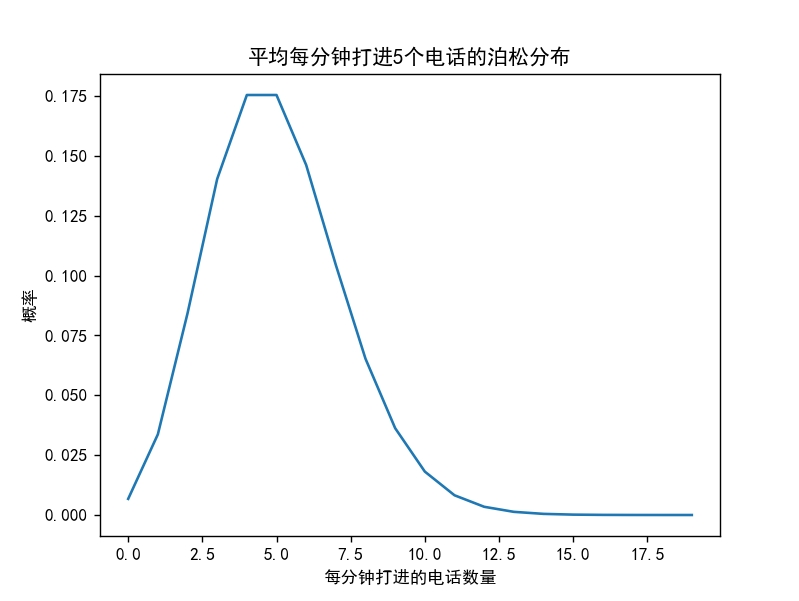


#### 指数分布

指数分布（Exponential  Distribution）是一种连续型概率分布，用于描述在固定时间内，事件发生的概率。指数分布适用于那些事件相互独立，且平均发生速率恒定的情况

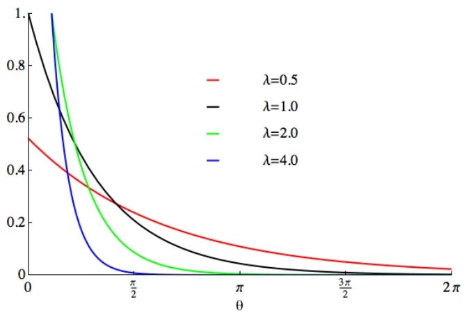

参数

    λ（lambda）：这是指数分布的唯一参数，表示事件的平均发生速率或单位时间内事件发生的平均次数。λ的倒数则为事件的平均等待时间。

概率密度函数

f(x, λ) 表示在给定时间 x 内事件首次发生的概率密度，其公式为：

```math
f(x; \lambda) = \lambda e^{-\lambda x}
```
其中，x 是观察的时间间隔，λ 是事件的平均发生速率，e 是自然对数的底数，约为2.71828。

实际应用

指数分布在实际中的应用：放射性衰变中，放射性原子核衰变的时间可以看作是指数分布，平均衰变时间即为λ。

「示例代码

如下代码定义了一个指数分布，其中参数λ等于1/衰变周期（在这里为每小时衰变一次）。然后创建了指数分布对象，并计算并打印了一些特定时间点上事件发生的概率密度。最后，绘制了指数分布的概率密度函数图像，直观展示了不同时间点上的概率分布情况。

```
import matplotlib.pyplot as plt
import numpy as np
from matplotlib.font_manager import FontProperties
from scipy.stats import expon

#### 指数分布

# 设置中文字体为SimHei
font = FontProperties(fname=r"C:\Windows\Fonts\simsun.ttc", size=14)
plt.rcParams['font.family'] = 'sans-serif'
plt.rcParams['font.sans-serif'] = ['SimHei']

# 定义指数分布参数
lambda_val = 0.5  # 平均每小时衰变一次，则λ=1/衰变周期（小时）

# 创建一个指数分布对象
exponential_dist = expon(scale=1 / lambda_val)  # 注意scipy库中指数分布参数为1/λ

# 计算并打印一些时间点上事件发生的概率密度
times = np.array([0.1, 0.5, 1.0, 1.5])  # 时间点（小时）
probabilities = exponential_dist.pdf(times)
for time, prob in zip(times, probabilities):
    print(f"在{time}小时后发生衰变的概率密度: {prob}")

# 绘制指数分布的概率密度函数
x = np.linspace(0, 4, 1000)  # 时间范围
y = exponential_dist.pdf(x)
plt.plot(x, y)
plt.xlabel('时间（小时）')
plt.ylabel('概率密度')
plt.title('平均每小时衰变一次的指数分布')
plt.show()
```

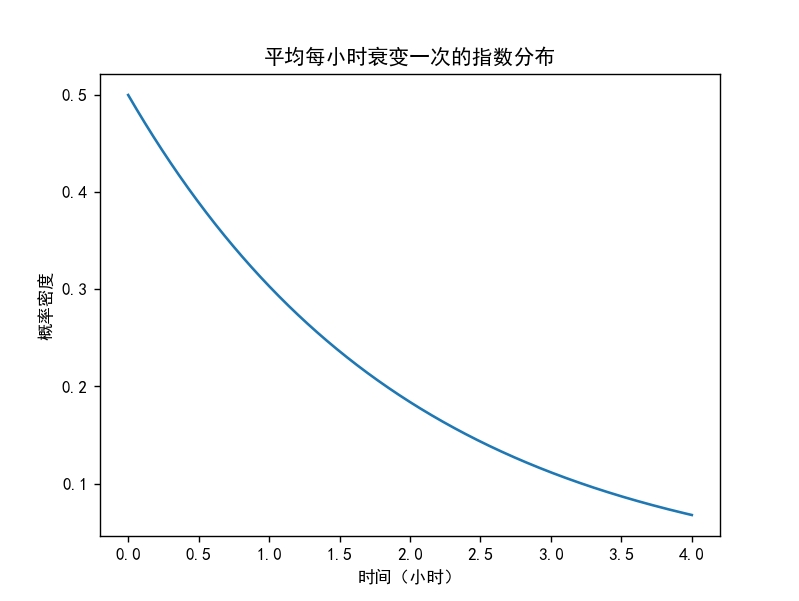


#### 伽玛分布

伽玛分布（Gamma  Distribution）是一种连续型概率分布，用于描述在给定时间内，事件发生的概率。伽玛分布适用于那些事件相互独立，且平均发生速率恒定的情况。

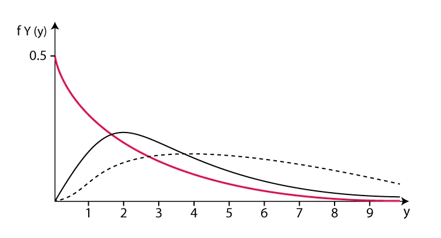


参数

    α（alpha）：形状参数，决定了分布曲线的形状，取值范围为(0, +∞)。
    β（beta）：尺度参数，也被称为速率参数，与事件的平均等待时间成反比。平均等待时间为 E(X) = α/β，取值范围也为(0, +∞)。

概率密度函数

假设随机变量X为等到第α件事发生所需之等候时间，且每个事件之间的等待时间是互相独立的，α为事件发生的次数，β代表事件发生一次的概率，那么这α个事件的时间之和服从伽马分布

f(x; α, β) 表示在给定时间 x 内事件发生的概率密度，其公式为：

```math

f(x; \alpha, \beta) = \frac{\beta^\alpha}{\Gamma(\alpha)} x^{\alpha - 1} e^{-\beta x}

```
其中，x 是观察的时间间隔，Γ(α) 是伽玛函数，它是阶乘在实数域上的推广。

当 α=1时，伽马分布就变成了指数分布

性质：

    如果固定α =4, 增加θ（或减小β），x轴的scale在增加，其分布相对就越广（或越窄）。
    如果放在同一个x轴上，增加θ（或β）将得到更平缓的曲线（或更陡的曲线）。：


实际应用

在实际应用中，例如放射性衰变，可以根据已知的平均衰变时间和形状特征来模拟原子核衰变的时间分布，利用伽玛分布来描述这样的随机变量。

示例代码

如下代码定义了一个伽玛分布，其中参数α表示形状，β通过scale=1/beta_val来设定，这样平均等待时间就是α/β。然后创建了伽玛分布对象，并计算并打印了一些特定时间点上事件发生的概率密度。最后，绘制了伽玛分布的概率密度函数图像，直观展示了不同时间点上的概率分布情况。


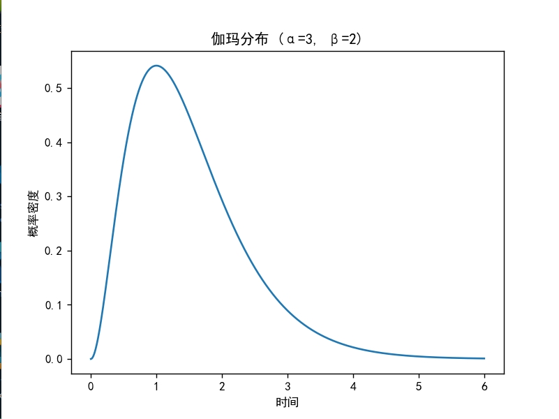


#### 贝塔分布

贝塔分布（Beta  distribution）是一种连续型概率分布，用于表示随机变量的概率分布，尤其是在我们对该随机变量的概率没有先验知识，但知道其概率上下限均为0和1时。

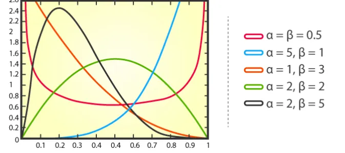

参数

    α（alpha）：第一个形状参数，反映了成功次数相对于总试验次数的比例的累积证据。
    β（beta）：第二个形状参数，反映了失败次数相对于总试验次数的比例的累积证据。

beta分布可以看作一个概率的概率分布

概率密度函数

f(x; α, β) 表示成功概率为x的概率密度，其公式为：

```math

f(x; \alpha, \beta) = \frac{x^{(\alpha-1)}(1-x)^{(\beta-1)}}{B(\alpha,\beta)}

```

其中，x 是成功概率的取值，位于[0,1]区间内，B(α, β) 是贝塔函数，是伽玛函数的积分结果，用于归一化概率分布。

实际应用

贝塔分布在许多实际问题中都有应用，例如，在基因编辑中，研究人员可能会使用贝塔分布来预测基因编辑技术成功编辑某个目标位点的概率。在金融领域，贝塔分布可以用于描述资产价格的波动性，或者用于计算投资组合的预期收益。

```
# beat 分布
# 当α = β = 1时，等于（0，1）均匀分布；
# 当α = β < 1时，表现为两头的概率大，中间的概率小，
# 当α = β → 0时，相当于{0，1}二项分布，要么取0，要么取1，等于原始数据没有增强
# 当α = β > 1时，表现为两头概率小，中间概率大，类似正态分布，
# 当α = β → ∞时，概率恒等于0.5，相当于两个样本各取一半。所以使用Beta分布相当灵活，
# 只需要调整参数α , β的值，就可以得到多样化的[0,1]区间内的概率分布，使用非常方便。
import matplotlib.pyplot as plt
import numpy as np
from matplotlib.font_manager import FontProperties
from scipy.stats import beta

# 设置中文字体为SimHei
font = FontProperties(fname=r"C:\Windows\Fonts\simsun.ttc", size=14)
plt.rcParams['font.family'] = 'sans-serif'
plt.rcParams['font.sans-serif'] = ['SimHei']


# 定义贝塔分布参数
alpha_val = 1.5  # 第一个形状参数
beta_val = 1.5  # 第二个形状参数


data = np.random.beta(alpha_val, beta_val, 2000)


# 创建一个贝塔分布对象
beta_dist = beta(alpha_val, beta_val)

plt.hist(data, bins=50, density=True, alpha=0.7)
x = np.linspace(0, 1, 2000)
y = beta_dist.pdf(x)
plt.xlabel('成功概率')
plt.ylabel('概率密度')
plt.title(f'贝塔分布 (α={alpha_val}, β={beta_val})')

plt.plot(x, y)

plt.show()
```

#### 均匀分布

均匀分布是一种概率分布，用于描述一组数值在某个区间内均匀地分布。均匀分布有两种类型：离散均匀分布和连续均匀分布。

    离散均匀分布：如果一个离散随机变量X的取值范围是有限整数集{0, 1, ..., n}，且每个整数值出现的概率相等，则称这个随机变量服从离散均匀分布。
    连续均匀分布：如果一个连续随机变量X在区间[a, b]内具有恒定的概率密度函数，则称X服从连续均匀分布。