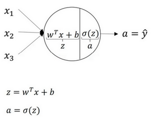
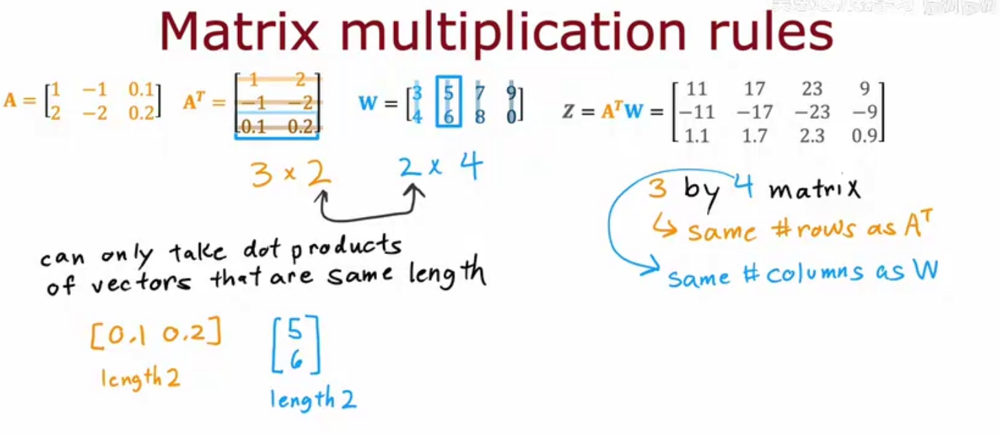

我们之前学的，无论是线性回归还是逻辑回归都有这样一个缺点，即：当特征太多时，计算的负荷会非常大

下面是一个例子：


当我们使用 $x_1$ 的多次项式进行预测时，我们可以应用的很好。 之前我们已经看到过，使用非线性的多项式项，能够帮助我们建立更好的分类模型。假设我们有非常多的特征，例如大于100个变量，我们希望用这100个特征来构建一个非线性的多项式模型，结果将是数量非常惊人的特征组合，即便我们只采用两两特征的组合 $(x_1x_2+x_1x_3+x_1x_4+...+x_2x_3+x_2x_4+...+x_{99}x_{100})$ ，我们也会有接近5000个组合而成的特征。这对于一般的逻辑回归来说需要计算的特征太多了。

假如我们只选用灰度图片，每个像素则只有一个值（而非 RGB值），我们可以选取图片上的两个不同位置上的两个像素，然后训练一个逻辑回归算法利用这两个像素的值来判断图片上是否是汽车

假使我们采用的都是50x50像素的小图片，并且我们将所有的像素视为特征，则会有 2500个特征，如果我们要进一步将两两特征组合构成一个多项式模型，则会有约 ${{2500}^{2}}/2$ 个（接近3百万个）特征。普通的逻辑回归模型，不能有效地处理这么多的特征，这时候我们需要神经网络。


#### 神经网络表示

我们首先关注一个例子，本例中的神经网络只包含一个隐藏层（图3.2.1）。这是一张神经网络的图片，让我们给此图的不同部分取一些名字


我们有输入特征 $x_1$ 、 $x_2$ 、 $x_3$ ，它们被竖直地堆叠起来，这叫做神经网络的**输入层**
它包含了神经网络的输入；然后这里有另外一层我们称之为**隐藏层**
在本例中最后一层只由一个结点构成，而这个只有一个结点的层被称为**输出层**，它负责产生预测值

在一个神经网络中，当你使用监督学习训练它的时候，训练集包含了输入 $x$ 也包含了目标输出 $y$ ，所以术语隐藏层的含义是在训练集中，这些中间结点的准确值我们是不知道到的，也就是说你看不见它们在训练集中应具有的值。你能看见输入的值，你也能看见输出的值，但是隐藏层中的东西，在训练集中你是无法看到的。所以这也解释了词语隐藏层，只是表示你无法在训练集中看到他们

现在我们再引入几个符号，就像我们之前用向量 $x$ 表示输入特征。这里有个可代替的记号 $a^{[0]}$ 可以用来表示输入特征。 $a$ 表示激活的意思，它意味着网络中不同层的值会传递到它们后面的层中，输入层将 $x$ 传递给隐藏层，所以我们将输入层的激活值称为 $a^{[0]}$ 。下一层即隐藏层也同样会产生一些激活值，那么我将其记作 $a^{[1]}$ ，所以具体地，这里的第一个单元或结点我们将其表示为 $a^{[1]}_{1}$ ，第二个结点的值我们记为 $a^{[1]}_{2}$ 以此类推。所以这里的是一个四维的向量如果写成Python代码，那么它是一个规模为4x1的矩阵或一个大小为4的列向量，如下公式，它是四维的，因为在本例中，我们有四个结点或者单元，或者称为四个隐藏层单元； 公式3.7 
```math
 a^{[1]} = \left[ \begin{array}{ccc} a^{[1]}_{1}\ a^{[1]}_{2}\ a^{[1]}_{3}\ a^{[1]}_{4} \end{array} \right]
```


其中，$x$表示输入特征，$a$表示每个神经元的输出，$W$表示特征的权重，上标表示神经网络的层数（隐藏层为1），下标表示该层的第几个神经元。这是神经网络的符号惯例，下同

最后，我们要看到的隐藏层以及最后的输出层是带有参数的，这里的隐藏层将拥有两个参数$W$和$b$，我将给它们加上上标 $^{[1]}$ ( $W^{[1]}$ , $b^{[1]}$ )，表示这些参数是和第一层这个隐藏层有关系的。之后在这个例子中我们会看到 $W$ 是一个4x3的矩阵，而 $b$ 是一个4x1的向量，第一个数字4源自于我们有四个结点或隐藏层单元，然后数字3源自于这里有三个输入特征，我们之后会更加详细地讨论这些矩阵的维数，到那时你可能就更加清楚了。相似的输出层也有一些与之关联的参数 $W^{[2]}$ 以及 $b^{[2]}$ 。从维数上来看，它们的规模分别是1x4以及1x1。1x4是因为隐藏层有四个隐藏层单元而输出层只有一个单元，之后我们会对这些矩阵和向量的维度做出更加深入的解释，所以现在你已经知道一个两层的神经网络什么样的了，即它是一个只有一个隐藏层的神经网络

#### 神经网络的计算

神经网络模型建立在很多神经元之上，每一个神经元又是一个个学习模型。这些神经元（也叫激活单元，activation unit）采纳一些特征作为输出，并且根据本身的模型提供一个输出。下图是一个以逻辑回归模型作为自身学习模型的神经元示例，在神经网络中，参数又可被成为权重（weight）


关于神经网络是怎么计算的，从我们之前提及的逻辑回归开始，如下图所示。用圆圈表示神经网络的计算单元，逻辑回归的计算有两个步骤，首先你按步骤计算出$z$，然后在第二步中你以sigmoid函数为激活函数计算 $z$ （得出 $a$ ），一个神经网络只是这样子做了好多次重复计算



回到两层的神经网络，我们从隐藏层的第一个神经元开始计算，如上图第一个最上面的箭头所指。从上图可以看出，输入与逻辑回归相似，这个神经元的计算与逻辑回归一样分为两步，小圆圈代表了计算的两个步骤

第一步，计算 $z^{[1]}_1,z^{[1]}_1 = w^{[1]T}_1x + b^{[1]}_1$
第二步，通过激活函数计算 $a^{[1]}_1,a^{[1]}_1 = \sigma(z^{[1]}_1)$ 。

隐藏层的第二个以及后面两个神经元的计算过程一样，只是注意符号表示不同，最终分别得到 $a^{[1]}_2、a^{[1]}_3、a^{[1]}_4$ ，详细结果见下

$z^{[1]}_1 = w^{[1]T}_1x + b^{[1]}_1, a^{[1]}_1 = \sigma(z^{[1]}_1)$

$z^{[1]}_2 = w^{[1]T}_2x + b^{[1]}_2, a^{[1]}_2 = \sigma(z^{[1]}_2)$

$z^{[1]}_3 = w^{[1]T}_3x + b^{[1]}_3, a^{[1]}_3 = \sigma(z^{[1]}_3)$

$z^{[1]}_4 = w^{[1]T}_4x + b^{[1]}_4, a^{[1]}_4 = \sigma(z^{[1]}_4)$

**向量化计算**如果你执行神经网络的程序，用for循环来做这些看起来真的很低效。所以接下来我们要做的就是把这四个等式向量化。向量化的过程是将神经网络中的一层神经元参数纵向堆积起来，例如隐藏层中的$w$纵向堆积起来变成一个$(4,3)$的矩阵，用符号$W^{[1]}$表示。另一个看待这个的方法是我们有四个逻辑回归单元，且每一个逻辑回归单元都有相对应的参数——向量$w$，把这四个向量堆积在一起，你会得出这4×3的矩阵。因此公式：
$z^{[n]} = w^{[n]}x + b^{[n]}$

$a^{[n]}=\sigma(z^{[n]})$

详细过程见下:
```math
a^{[1]} =
	\left[
		\begin{array}{c}
		a^{[1]}_{1}\\
		a^{[1]}_{2}\\
		a^{[1]}_{3}\\
		a^{[1]}_{4}
		\end{array}
		\right]
		= \sigma(z^{[1]})
```

```math
\left[
		\begin{array}{c}
		z^{[1]}_{1}\\
		z^{[1]}_{2}\\
		z^{[1]}_{3}\\
		z^{[1]}_{4}\\
		\end{array}
		\right]
		 =
	\overbrace{
	\left[
		\begin{array}{c}
		...W^{[1]T}_{1}...\\
		...W^{[1]T}_{2}...\\
		...W^{[1]T}_{3}...\\
		...W^{[1]T}_{4}...
		\end{array}
		\right]
		}^{W^{[1]}}
		*
	\overbrace{
	\left[
		\begin{array}{c}
		x_1\\
		x_2\\
		x_3\\
		\end{array}
		\right]
		}^{input}
		+
	\overbrace{
	\left[
		\begin{array}{c}
		b^{[1]}_1\\
		b^{[1]}_2\\
		b^{[1]}_3\\
		b^{[1]}_4\\
		\end{array}
		\right]
		}^{b^{[1]}}
```

对于神经网络的第一层，给予一个输入 $x$ ，得到 $a^{[1]}$ ， $x$ 可以表示为 $a^{[0]}$ 。通过相似的衍生你会发现，后一层的表示同样可以写成类似的形式，得到 $a^{[2]}$，$\hat{y} = a^{[2]}$


如上图左半部分所示为神经网络，把网络左边部分盖住先忽略，那么最后的输出单元就相当于一个逻辑回归的计算单元。当你有一个包含一层隐藏层的神经网络，你需要去实现以计算得到输出的是右边的四个等式，并且可以看成是一个向量化的计算过程，计算出隐藏层的四个逻辑回归单元和整个隐藏层的输出结果，如果编程实现需要的也只是这四行代码。

总结你能够根据给出的一个单独的输入特征向量，运用四行代码计算出一个简单神经网络的输出。接下来你将了解的是如何一次能够计算出不止一个样本的神经网络输出，而是能一次性计算整个训练集的输出


#### 模型表示2

( FORWARD PROPAGATION ) 相对于使用循环来编码，利用向量化的方法会使得计算更为简便。以上面的神经网络为例，试着计算第二层的值


我们令 ${{z}^{\left( 2 \right)}}={{\theta }^{\left( 1 \right)}}x$，则 ${{a}^{\left( 2 \right)}}=g({{z}^{\left( 2 \right)}})$ ，计算后添加 $a_{0}^{\left( 2 \right)}=1$。 计算输出的值为


我们令 ${{z}^{\left( 3 \right)}}={{\theta }^{\left( 2 \right)}}{{a}^{\left( 2 \right)}}$，则 $h_\theta(x)={{a}^{\left( 3 \right)}}=g({{z}^{\left( 3 \right)}})$。

这只是针对训练集中一个训练实例所进行的计算。如果我们要对整个训练集进行计算，我们需要将训练集特征矩阵进行转置，使得同一个实例的特征都在同一列里。即：
${{z}^{\left( 2 \right)}}={{\Theta }^{\left( 1 \right)}}\times {{X}^{T}} $

 ${{a}^{\left( 2 \right)}}=g({{z}^{\left( 2 \right)}})$

为了更好了了解**Neuron Networks**的工作原理，我们先把左半部分遮住


右半部分其实就是以 $a_0, a_1, a_2, a_3$ , 按照**Logistic Regression**的方式输出$h_\theta(x)$：


其实神经网络就像是logistic regression，只不过我们把logistic regression中的输入向量 $\left[ x_1\sim {x_3} \right]$ 变成了中间层的 $\left[ a_1^{(2)}\sim a_3^{(2)} \right]$ , 即: 
 我们可以把 $a_0, a_1, a_2, a_3$ 看成更为高级的特征值，也就是 $x_0, x_1, x_2, x_3$ 的进化体，并且它们是由 $x$ 与 $\theta$ 决定的，因为是梯度下降的，所以 $a$ 是变化的，并且变得越来越厉害，所以这些更高级的特征值远比仅仅将 $x$ 次方厉害，也能更好的预测新数据。 这就是神经网络相比于逻辑回归和线性回归的优势。


#### 向量化实现的解释（Justification for vectorized implementation）

我们先手动对几个样本计算一下前向传播，看看有什么规律： $z^{1} = W^{[1]}x^{(1)} + b^{[1]}$

$z^{1} = W^{[1]}x^{(2)} + b^{[1]}$

$z^{1} = W^{[1]}x^{(3)} + b^{[1]}$

这里，为了描述的简便，我们先忽略掉 $b^{[1]}$ 后面你将会看到利用Python 的广播机制，可以很容易的将 $b^{[1]}$ 加进来。

现在 $W^{[1]}$ 是一个矩阵， $x^{(1)},x^{(2)},x^{(3)}$ 都是列向量，矩阵乘以列向量得到列向量，下面将它们用图形直观的表示出来:

```math
 W^{[1]} x = \left[ \begin{array}{ccc} \cdots \ \cdots \ \cdots \ \end{array} \right] \left[
	\begin{array}{c}
	\vdots &\vdots & \vdots & \vdots \\
	x^{(1)} & x^{(2)} & x^{(3)} & \vdots\\
	\vdots &\vdots & \vdots & \vdots \\
	\end{array}
	\right]
	=
	\left[
	\begin{array}{c}
	\vdots &\vdots & \vdots & \vdots \\
	w^{(1)}x^{(1)} & w^{(1)}x^{(2)} & w^{(1)}x^{(3)} & \vdots\\
	\vdots &\vdots & \vdots & \vdots \\
	\end{array}
	\right]
	=\\
	\left[
	\begin{array}{c}
	\vdots &\vdots & \vdots & \vdots \\
	z^{[1](1)} & z^{[1](2)} & z^{[1](3)} & \vdots\\
	\vdots &\vdots & \vdots & \vdots \\
	\end{array}
	\right]
	=
	Z^{[1]}
```

所以从图中可以看出，当加入更多样本时，只需向矩阵$X$中加入更多列。

所以从这里我们也可以了解到，为什么之前我们对单个样本的计算要写成
 $z^{[1](i)} = W^{[1]}x^{(i)} + b^{[1]}$
这种形式，因为当有不同的训练样本时，将它们堆到矩阵$X$的各列中，那么它们的输出也就会相应的堆叠到矩阵 $Z^{[1]}$ 的各列中。现在我们就可以直接计算矩阵 $Z^{[1]}$ 加上 $b^{[1]}$ ，因为列向量 $b^{[1]}$ 和矩阵 $Z^{[1]}$ 的列向量有着相同的尺寸，而**Python**的广播机制对于这种矩阵与向量直接相加的处理方式是，将向量与矩阵的每一列相加。
所以这一节只是说明了为什么公式 $Z^{[1]} =W^{[1]}X + \ b^{[1]}$ 是前向传播的第一步计算的正确向量化实现，但事实证明，类似的分析可以发现，前向传播的其它步也可以使用非常相似的逻辑，即如果将输入按列向量横向堆叠进矩阵，那么通过公式计算之后，也能得到成列堆叠的输出。

使用向量化的方法，可以不需要显示循环，而直接通过矩阵运算从 $x​$ 就可以计算出 $a^{[1]}​$ ，实际上 $x$ 可以记为 $a^{[0]}$，使用同样的方法就可以由神经网络中的每一层的输入 $a^{[i-1]}​$ 计算输出 $a^{[i]}$ 。其实这些方程有一定对称性，其中第一个方程也可以写成 $Z^{[1]} = W^{[1]}a^{[0]} + b^{[1]}$ ，你看这对方程，还有这对方程形式其实很类似，只不过这里所有指标加了1。所以这样就显示出神经网络的不同层次，你知道大概每一步做的都是一样的，或者只不过同样的计算不断重复而已。这里我们有一个双层神经网络，我们在下周视频里会讲深得多的神经网络，你看到随着网络的深度变大，基本上也还是重复这两步运算，只不过是比这里你看到的重复次数更多。在下周的视频中将会讲解更深层次的神经网络，随着层数的加深，基本上也还是重复同样的运算。

#### 做出预测（向前传播）

前向传播（foward propagation, FP）作用于每一层的输入，通过逐层计算得到输出结果


向前传播的一般实现




#### 反向传播

反向传播（backward propagation, BP）作用于网络的输出，通过计算梯度由深到浅更新网络参数


由于我们前向传播最终得到的结果，以分类为例，最终总是有误差的，那么怎么减少误差呢，当前应用广泛的一个算法就是梯度下降算法，但是求梯度就要求偏导数，下面以图中字母为例讲解一下：

设最终误差为 $E$ 且输出层的激活函数为线性激活函数，对于输出那么 $E$  对于输出节点 $y_l$ 的偏导数是 $y_l - t_l$ ，其中 $t_l$ 是真实值,  $\frac{\partial y_l}{\partial z_l}$ 是指上面提到的激活函数， $z_l$  是上面提到的加权和，那么这一层的 $E$ 对于 $z_l$ 的偏导数为 $\frac{\partial E}{\partial z_l} = \frac{\partial E}{\partial y_l} \frac{\partial y_l}{\partial z_l}$ 。同理，下一层也是这么计算，只不过 $\frac{\partial E}{\partial y_k}$ 计算方法变了，一直反向传播到输入层，最后有 $\frac{\partial E}{\partial x_i} = \frac{\partial E}{\partial y_j} \frac{\partial y_j}{\partial z_j}$，且 $\frac{\partial z_j}{\partial x_i} = w_i j$ 。然后调整这些过程中的权值，再不断进行前向传播和反向传播的过程，最终得到一个比较好的结果。

#### 随机初始化（Random+Initialization）

当你训练神经网络时，权重随机初始化是很重要的。对于逻辑回归，把权重初始化为0当然也是可以的。但是对于一个神经网络，如果你把权重或者参数都初始化为0，那么梯度下降将不会起作用

让我们看看这是为什么。有两个输入特征， $n^{[0]} = 2$ ，2个隐藏层单元  $n^{[1]}$ 就等于2。
因此与一个隐藏层相关的矩阵，或者说 $W^{[1]}$ 是2\*2 的矩阵，假设把它初始化为0的2\*2矩阵， $b^{[1]}$ 也等于 $[0\;0]^T$ ，把偏置项 $b$ 初始化为0是合理的，但是把 $w$ 初始化为0就有问题了。
那这个问题如果按照这样初始化的话，你总是会发现 $a_{1}^{[1]}$ 和 $a_{2}^{[1]}$ 相等，这个激活单元和这个激活单元就会一样。因为两个隐含单元计算同样的函数，当你做反向传播计算时，这会导致 $\text{dz}_{1}^{[1]}$  和  $\text{dz}_{2}^{[1]}$  也会一样，对称这些隐含单元会初始化得一样，这样输出的权值也会一模一样，由此 $W^{[2]}$ 等于 $[0\;0]$ ；


但是如果你这样初始化这个神经网络，那么这两个隐含单元就会完全一样，因此他们完全对称，也就意味着计算同样的函数，并且肯定的是最终经过每次训练的迭代，这两个隐含单元仍然是同一个函数，令人困惑。 $dW$ 会是一个这样的矩阵，每一行有同样的值因此我们做权重更新把权重 $W^{[1]}\implies{W^{[1]}-adW}$ 每次迭代后的 $W^{[1]}$ ，第一行等于第二行。

由此可以推导，如果你把权重都初始化为0，那么由于隐含单元开始计算同一个函数，所有的隐含单元就会对输出单元有同样的影响。一次迭代后同样的表达式结果仍然是相同的，即隐含单元仍是对称的。通过推导，两次、三次、无论多少次迭代，不管你训练网络多长时间，隐含单元仍然计算的是同样的函数。因此这种情况下超过1个隐含单元也没什么意义，因为他们计算同样的东西。当然更大的网络，比如你有3个特征，还有相当多的隐含单元。

如果你要初始化成0，由于所有的隐含单元都是对称的，无论你运行梯度下降多久，他们一直计算同样的函数。这没有任何帮助，因为你想要两个不同的隐含单元计算不同的函数，这个问题的解决方法就是随机初始化参数。你应该这么做：把 $W^{[1]}$ 设为`np.random.randn(2,2)`(生成高斯分布)，通常再乘上一个小的数，比如0.01，这样把它初始化为很小的随机数。然后 $b$ 没有这个对称的问题（叫做**symmetry breaking problem**），所以可以把 $b$ 初始化为0，因为只要随机初始化$W$你就有不同的隐含单元计算不同的东西，因此不会有**symmetry breaking**问题了。相似的，对于 $W^{[2]}$ 你可以随机初始化， $b^{[2]}$ 可以初始化为0

```math
W^{[1]} = np.random.randn(2,2)\;*\;0.01\;,\;b^{[1]} = np.zeros((2,1))
```
```math
W^{[2]} = np.random.randn(2,2)\;*\;0.01\;,\;b^{[2]} = 0
```

你也许会疑惑，这个常数从哪里来，为什么是0.01，而不是100或者1000。我们通常倾向于初始化为很小的随机数。因为如果你用**tanh**或者**sigmoid**激活函数，或者说只在输出层有一个**Sigmoid**，如果（数值）波动太大，当你计算激活值时$z^{[1]} = W^{[1]}x + b^{[1]}\;,\;a^{[1]} = \sigma(z^{[1]})=g^{[1]}(z^{[1]})$如果$W$很大，$z$就会很大或者很小，因此这种情况下你很可能停在**tanh**/**sigmoid**函数的平坦的地方(见图3.8.2)，这些地方梯度很小也就意味着梯度下降会很慢，因此学习也就很慢。

回顾一下：如果$w$很大，那么你很可能最终停在（甚至在训练刚刚开始的时候）$z$很大的值，这会造成**tanh**/**Sigmoid**激活函数饱和在龟速的学习上，如果你没有**sigmoid**/**tanh**激活函数在你整个的神经网络里，就不成问题。但如果你做二分类并且你的输出单元是**Sigmoid**函数，那么你不会想让初始参数太大，因此这就是为什么乘上0.01或者其他一些小数是合理的尝试。对于$w^{[2]}$一样，就是`np.random.randn((1,2))`，我猜会是乘以0.01

事实上有时有比0.01更好的常数，当你训练一个只有一层隐藏层的网络时（这是相对浅的神经网络，没有太多的隐藏层），设为0.01可能也可以。但当你训练一个非常非常深的神经网络，你可能要试试0.01以外的常数。下一节课我们会讨论怎么并且何时去选择一个不同于0.01的常数，但是无论如何它通常都会是个相对小的数。

#### 梯度检验

当我们对一个较为复杂的模型（例如神经网络）使用梯度下降算法时，可能会存在一些不容易察觉的错误，意味着，虽然代价看上去在不断减小，但最终的结果可能并不是最优解。

为了避免这样的问题，我们采取一种叫做梯度的数值检验（Numerical Gradient Checking）方法。这种方法的思想是通过估计梯度值来检验我们计算的导数值是否真的是我们要求的。


对梯度的估计采用的方法是在代价函数上沿着切线的方向选择离两个非常近的点然后计算两个点的平均值用以估计梯度。即对于某个特定的 $\theta$，我们计算出在 $\theta$-$\varepsilon$ 处和 $\theta$+$\varepsilon$ 的代价值（$\varepsilon $是一个非常小的值，通常选取 0.001），然后求两个代价的平均，用以估计在 $\theta$ 处的代价值。


当$\theta$是一个向量时，我们则需要对偏导数进行检验。因为代价函数的偏导数检验只针对一个参数的改变进行检验，下面是一个只针对 $\theta_1$ 进行检验的示例： 
```math
\frac{\partial}{\partial\theta_1}=\frac{J\left(\theta_1+\varepsilon_1,\theta_2,\theta_3...\theta_n \right)-J \left( \theta_1-\varepsilon_1,\theta_2,\theta_3...\theta_n \right)}{2\varepsilon}
```

最后我们还需要对通过反向传播方法计算出的偏导数进行检验。

根据上面的算法，计算出的偏导数存储在矩阵 $D_{ij}^{(l)}$ 中。检验时，我们要将该矩阵展开成为向量，同时我们也将 $\theta$ 矩阵展开为向量，我们针对每一个 $\theta$ 都计算一个近似的梯度值，将这些值存储于一个近似梯度矩阵中，最终将得出的这个矩阵同 $D_{ij}^{(l)}$ 进行比较。


#### 激活函数

**为什么需要激活函数？**
- 激活函数对模型学习、理解非常复杂和非线性的函数具有重要作用
- 激活函数可以引入非线性因素。如果不使用激活函数，则输出信号仅是一个简单的线性函数。线性函数一个一级多项式，线性方程的复杂度有限，从数据中学习复杂函数映射的能力很小。没有激活函数，神经网络将无法学习和模拟其他复杂类型的数据，例如图像、视频、音频、语音等。
- 激活函数可以把当前特征空间通过一定的线性映射转换到另一个空间，让数据能够更好的被分类

**为什么激活函数需要非线性函数？**
- 假若网络中全部是线性部件，那么线性的组合还是线性，与单独一个线性分类器无异。这样就做不到用非线性来逼近任意函数
- 使用非线性激活函数 ，以便使网络更加强大，增加它的能力，使它可以学习复杂的事物，复杂的表单数据，以及表示输入输出之间非线性的复杂的任意函数映射。使用非线性激活函数，能够从输入输出之间生成非线性映射。

**常见的激活函数及图像**

sigmoid 激活函数

函数的定义为： $f(x)=\frac{1}{1+e^{-x}}$ ，其值域为 $(0,1)$ 。


tanh激活函数

函数的定义为： $f(x)=tanh(x)=\frac{e^x-e^{-x}}{e^x + e^{-x}}$ ，值域为 $(-1,1)$ 。


Relu激活函数

函数的定义为： $f(x) = max(0, x)$ ，值域为 $[0,+∞)$ ；


Leak Relu 激活函数

函数定义为： 

```math
    f(x) = {\begin{aligned} ax, \quad x<0 \ x, \quad x>0 \end{aligned}} 
```
值域为 $(-∞,+∞)$
图像如下（ $a = 0.5$ ）


PReLU激活函数

PReLU (Parametric Rectified Linear Unit) 首次由何凯明团队提出，算是 ReLU 的改进版本，在几乎没有增加额外参数的前提下既可以提升模型的拟合能力，又能减小过拟合风险


从上图中不难看出 PReLU的定义，重新表示如下：


该定义和上一篇介绍的 Leaky ReLU 一样，但不要混淆，其不同在于系数 是需要学习的参数，负责控制负半轴的斜率。若学得的w=0 ，那么 PReLU 退化为 ReLU；若学得的 是一个很小的固定值(如 w=0.01)，则 PReLU退化为 Leaky ReLU。

w默认被初始化为0.25

SoftPlus 激活函数

函数的定义为：$f(x) = ln( 1 + e^x)$ ，值域为 $(0,+∞)$


hardswish激活函数

hardswish激活函数。在MobileNet v3中被提出，相较于swish函数，具有数值稳定性好，计算速度快等优点

Swish激活函数代替ReLU，显著提高了神经网络的准确性，具体定义为：$Swish(x) = x⋅σ(x)$， 虽然这种非线性提高了精度，然而sigmoid函数是由指数构成的，在移动设备上的计算成本要高得多。Sigmoid激活函数可以用分段线性函数HardSigmoid拟合

```math

\begin{aligned}Hardsigmoid(x) = \begin{cases} 0, &x\le -3 \\ 1 ,&x\ge 3\\\frac{x}{6}+\frac{1}{2}, & otherwise\\\end{cases}\end{aligned}

```
由此，用Hardsigmoid替代sigmoid可以大大减少运算成本，由此诞生了HardSwish，具体的公式为：

```math
\begin{aligned} HardSwish(x) = x \cdot HardSigmoid(x)= x\cdot \frac{ReLU6(x+3)}{6}= x\cdot \begin{cases} 1, &x\ge3\\ \frac{x}{6}+\frac{1}{2}, &-3<x<3\\ 0, &x\le -3 \\\end{cases}\end{aligned}
```
> ReLU6(x)=min(max(0,x),6)


该函数的对x的导数为：

```math
\begin{cases} 1, &x\ge3\\ \frac{x}{3}+\frac{1}{2}, &-3<x<3\\ 0, &x\le -3 \\\end{cases}
```


softmax 函数

函数定义为： $\sigma(z)j =\frac{e^{z_j}}{\sum_{k=1}^K e^{z_k}}$

Softmax 多用于多分类神经网络输出

对常见激活函数，导数计算如下
| 原函数          | 函数表达式                                   | 导数                                                         | 备注                                                         |
| --------------- | -------------------------------------------- | ------------------------------------------------------------ | ------------------------------------------------------------ |
| Sigmoid激活函数 | $f(x)=\frac{1}{1+e^{-x}}$                    | $f^{'}(x)=\frac{1}{1+e^{-x}}\left( 1- \frac{1}{1+e^{-x}} \right)=f(x)(1-f(x))$ | 当$x=10$,或$x=-10​$，$f^{'}(x) \approx0​$,当$x=0​$$f^{'}(x) =0.25​$ |
| Tanh激活函数    | $f(x)=tanh(x)=\frac{e^x-e^{-x}}{e^x+e^{-x}}$ | $f^{'}(x)=-(tanh(x))^2$                                      | 当$x=10$,或$x=-10$，$f^{'}(x) \approx0$,当$x=0$$f^{`}(x) =1$ |
| Relu激活函数    | $f(x)=max(0,x)$                              | $c(u)=\begin{cases} 0,x<0 \\ 1,x>0 \\ undefined,x=0\end{cases}$ | 通常$x=0$时，给定其导数为1和0                                |


**激活函数有哪些性质？**

1. 非线性： 当激活函数是非线性的，一个两层的神经网络就可以基本上逼近所有的函数。但如果激活函数是恒等激活函数的时候，即 $ f(x)=x $，就不满足这个性质，而且如果 MLP 使用的是恒等激活函数，那么其实整个网络跟单层神经网络是等价的；
2. 可微性： 当优化方法是基于梯度的时候，就体现了该性质；
3. 单调性： 当激活函数是单调的时候，单层网络能够保证是凸函数；
4. $ f(x)≈x $： 当激活函数满足这个性质的时候，如果参数的初始化是随机的较小值，那么神经网络的训练将会很高效；如果不满足这个性质，那么就需要详细地去设置初始值；
5. 输出值的范围： 当激活函数输出值是有限的时候，基于梯度的优化方法会更加稳定，因为特征的表示受有限权值的影响更显著；当激活函数的输出是无限的时候，模型的训练会更加高效，不过在这种情况下，一般需要更小的 Learning Rate。

**如何选择激活函数？**

选择一个适合的激活函数并不容易，需要考虑很多因素，通常的做法是，如果不确定哪一个激活函数效果更好，可以把它们都试试，然后在验证集或者测试集上进行评价。然后看哪一种表现的更好，就去使用它。


1. 如果输出是 0、1 值（二分类问题），则输出层选择 sigmoid 函数，然后其它的所有单元都选择 Relu 函数。

2. 如果在隐藏层上不确定使用哪个激活函数，那么通常会使用 Relu 激活函数。有时，也会使用 tanh 激活函数，但 Relu 的一个优点是：当是负值的时候，导数等于 0。
3. sigmoid 激活函数：除了输出层是一个二分类问题基本不会用它。
4. tanh 激活函数：tanh 是非常优秀的，几乎适合所有场合。
5. ReLu 激活函数：最常用的默认函数，如果不确定用哪个激活函数，就使用 ReLu 或者 Leaky ReLu，再去尝试其他的激活函数。
6. 如果遇到了一些死的神经元，我们可以使用 Leaky ReLU 函数。


**使用 ReLu 激活函数的优点？**
1. 在区间变动很大的情况下，ReLu 激活函数的导数或者激活函数的斜率都会远大于 0，在程序实现就是一个 if-else 语句，而 sigmoid 函数需要进行浮点四则运算，在实践中，使用 ReLu 激活函数神经网络通常会比使用 sigmoid 或者 tanh 激活函数学习的更快。

2. sigmoid 和 tanh 函数的导数在正负饱和区的梯度都会接近于 0，这会造成梯度弥散，而 Relu 和Leaky ReLu 函数大于 0 部分都为常数，不会产生梯度弥散现象。

3. 需注意，Relu 进入负半区的时候，梯度为 0，神经元此时不会训练，产生所谓的稀疏性，而 Leaky ReLu 不会产生这个问题。

**什么时候可以用线性激活函数？**

1. 输出层，大多使用线性激活函数。
2. 在隐含层可能会使用一些线性激活函数。
3. 一般用到的线性激活函数很少


**怎样理解 Relu（< 0 时）是非线性激活函数？**

根据图像可看出具有如下特点：

1. 单侧抑制；

2. 相对宽阔的兴奋边界；

3. 稀疏激活性；

   ReLU 函数从图像上看，是一个分段线性函数，把所有的负值都变为 0，而正值不变，这样就成为单侧抑制。

   因为有了这单侧抑制，才使得神经网络中的神经元也具有了稀疏激活性。

   **稀疏激活性**：从信号方面来看，即神经元同时只对输入信号的少部分选择性响应，大量信号被刻意的屏蔽了，这样可以提高学习的精度，更好更快地提取稀疏特征。当 $ x<0 $ 时，ReLU 硬饱和，而当 $ x>0 $ 时，则不存在饱和问题。ReLU 能够在 $ x>0 $ 时保持梯度不衰减，从而缓解梯度消失问题。


**Softmax 定义及作用**

Softmax 是一种形如下式的函数： $$ P(i) = \frac{e^{(\theta_i^T x)}}{\sum_{k=1}^{K} e^{(\theta_i^T x)}} $$​ 其中，$ \theta_i $ 和 $ x $ 是列向量，$ \theta_i^T x $ 可能被换成函数关于 $ x $ 的函数 $ f_i(x) $

通过 softmax 函数，可以使得 $ P(i) $ 的范围在 $ [0,1] $ 之间。在回归和分类问题中，通常 $ \theta $ 是待求参数，通过寻找使得 $ P(i) $ 最大的 $ \theta_i $ 作为最佳参数

但是，使得范围在 $ [0,1] $ 之间的方法有很多，为啥要在前面加上以 $ e $ 的幂函数的形式呢？参考 logistic 函数： $$ P(i) = \frac{1}{1+e^{(-\theta_i^T x)}} $$​ 这个函数的作用就是使得 $ P(i) $ 在负无穷到 0 的区间趋向于 0， 在 0 到正无穷的区间趋向 1,。同样 softmax 函数加入了 $ e $ 的幂函数正是为了两极化：正样本的结果将趋近于 1，而负样本的结果趋近于 0。这样为多类别提供了方便（可以把 $ P(i) $ 看做是样本属于类别的概率）。可以说，Softmax 函数是 logistic 函数的一种泛化。

softmax 函数可以把它的输入，通常被称为 logits 或者 logit scores，处理成 0 到 1 之间，并且能够把输出归一化到和为 1。这意味着 softmax 函数与分类的概率分布等价。它是一个网络预测多分类问题的最佳输出激活函数。

softmax 用于多分类过程中，它将多个神经元的输出，映射到 $ (0,1) $ 区间内，可以看成概率来理解，从而来进行多分类！


从下图看，神经网络中包含了输入层，然后通过两个特征层处理，最后通过 softmax 分析器就能得到不同条件下的概率，这里需要分成三个类别，最终会得到 $ y=0, y=1, y=2 $ 的概率值。


​ softmax 直白来说就是将原来输出是 $ 3,1,-3 $ 通过 softmax 函数一作用，就映射成为 $ (0,1) $ 的值，而这些值的累和为 $ 1 $（满足概率的性质），那么我们就可以将它理解成概率，在最后选取输出结点的时候，我们就可以选取概率最大（也就是值对应最大的）结点，作为我们的预测目标！


#### Adam


#### 深度学习和机器学习有什么不同?

- ​ 机器学习：利用计算机、概率论、统计学等知识，输入数据，让计算机学会新知识。机器学习的过程，就是训练数据去优化目标函数
- 深度学习：是一种特殊的机器学习，具有强大的能力和灵活性。它通过学习将世界表示为嵌套的层次结构，每个表示都与更简单的特征相关，而抽象的表示则用于计算更抽象的表示

​传统的机器学习需要定义一些手工特征，从而有目的的去提取目标信息， 非常依赖任务的特异性以及设计特征的专家经验。而深度学习可以从大数据中先学习简单的特征，并从其逐渐学习到更为复杂抽象的深层特征，不依赖人工的特征工程，这也是深度学习在大数据时代受欢迎的一大原因。


## 损失函数

### 回归

#### L1 loss

均绝对误差（Mean Absolute Error,MAE) 是指模型预测值f(x)和真实值y之间距离的均值，其公式如下

```math

MAE = \frac{1}{n} \sum_{i=1}^n| f(x_{i})- y_{i}|
```

忽略下标i ，设n=1，以f(x)−y为横轴，MAE的值为纵轴，得到函数的图形如下


MAE曲线连续，但是在y−f(x)=0处不可导。而且 MAE 大部分情况下梯度都是相等的，这意味着即使对于小的损失值，其梯度也是大的。这不利于函数的收敛和模型的学习。但是，无论对于什么样的输入值，都有着稳定的梯度，不会导致梯度爆炸问题，具有较为稳健性的解。
相比于MSE，MAE有个优点就是，对于离群点不那么敏感。因为MAE计算的是误差y−f(x)的绝对值，对于任意大小的差值，其惩罚都是固定的

```
loss_l1 = F.l1_loss(pred_bboxes_pos, assigned_bboxes_pos)
```

#### DF Loss

对于任意分布来建模框的表示，它可以用积分形式嵌入到任意已有的和框回归相关的损失函数上，例如最近比较流行的GIoU Loss。这个实际上也就够了，不过涨点不是很明显，我们又仔细分析了一下，发现如果分布过于任意，网络学习的效率可能会不高，原因是一个积分目标可能对应了无穷多种分布模式。如下图所示：


考虑到真实的分布通常不会距离标注的位置太远，所以我们又额外加了个loss，希望网络能够快速地聚焦到标注位置附近的数值，使得他们概率尽可能大。基于此，我们取了个名字叫Distribution Focal Loss (DFL)：

```math

DFL(S_i, S_{i+1}) = -((y_{i+1}-y)log(S_i) + (y-y_i)log(S_{i+1}))
```
其形式上与QFL的右半部分很类似，含义是以类似交叉熵的形式去优化与标签y最接近的一左一右两个位置的概率，从而让网络快速地聚焦到目标位置的邻近区域的分布中去


#### GIoULoss


GIOU的计算很简单，对于两个bounding box A，B。我们可以算出其最小凸集（包围A、B的最小包围框）C。有了最小凸集，就可以计算GIOU：

```math
GIOU = IOU - \frac{C - A \cup B}{C}
```
计算方法很简单，从公式可以看出，GIOU有几个特点：

- GIOU是IOU的下界，且取值范围为(-1, 1]。当两个框不重合时，IOU始终为0，不论A、B相隔多远，但是对于GIOU来说，A，B不重合度越高（离的越远），GIOU越趋近于-1
- GIOU其实就是在IOU的基础上减掉了一个东西，这个减掉的东西，让我门避免了两个bbox不重合时Loss为0的情况
- 可导：这一点需要强调下，由于max，min，分段函数(比如ReLU)这些都是可导的，所以用1-GIOU作为Loss是可导的。
当IOU=0时

```math

GIOU = -1 + \frac{A \cup B}{C}
```

显然， A∪B值不变，最大化GIOU就是要最小化C，最小化C就会促成2个框不断靠近，而不是像最小化IOU那样loss为0。

在TOOD中，bbox(Bouding box)通过对齐的anchor(具有更大的分类得分、更精确的定位)预测得到，这样的bbox通常经过NMS后仍可以得以保留。此外，t可以在训练阶段通过对损失加权选择高质量的bbox。因此，采用t度量bbox的质量，同时结合GIoU Loss定义了TOOD的Reg Loss如下:


#### Crossentropy


```
>>> input
Tensor(shape=[1, 2, 4], dtype=float64, place=Place(gpu:0), stop_gradient=True,
       [[[0.78953893, 0.65640318, 0.13578333, 0.72890999],
         [0.56095980, 0.76536849, 0.69641530, 0.92179645]]])
>>> label
Tensor(shape=[1, 2], dtype=int64, place=Place(gpu:0), stop_gradient=True,
       [[0, 2]])
```


```math
H(p,q) = - \sum_i P(i)log Q(i)，其中P为真实值，Q为预测值，i是第i个类别 
```
1、对input按列先进行softmax，将score转化为 -> 每个样本出现第j个类别的概率。得到input_soft

```math
Softmax(z_i) = \frac{exp(z_i)}{\sum_j exp(z_j)} 
```

2、对input_soft进行log运算，记为input_soft_log


```
>>> F.softmax(input)
Tensor(shape=[1, 2, 4], dtype=float64, place=Place(gpu:0), stop_gradient=True,
       [[[0.29970561, 0.26234619, 0.15587355, 0.28207465],
         [0.20805650, 0.25524359, 0.23823681, 0.29846310]]])
```

计算第一个样本的损失，这里：P = [1 0 0 0]，Q = [0.29970561, 0.26234619, 0.15587355, 0.28207465]

```
- (1 * log(0.29970561)+ 0 * log(0.26234619) + ... ) = -1 * log(0.29970561) =  1.2049545861159938
```

```
>>> F.cross_entropy(input, label, reduction='none')
Tensor(shape=[1, 2], dtype=float64, place=Place(gpu:0), stop_gradient=True,
       [[1.20495458, 1.43449012]])

```


### 分类

#### Binary Crossentropy

```math
L_{ce}(y, \hat{y}) =
\begin{cases}
-log(\hat{y}),& if y=1\\
-log(1-\hat{y}),& if y=0
\end{cases}
```

```math

Loss = L(y, \hat{y}) =  -y *log(\hat{y}) - (1 - y) * log(1 - \hat{y}) \\
Out = -Labels * \log(\sigma(Logit)) - (1 - Labels) * \log(1 - \sigma(Logit))


```
> 其中$\hat{y}$为预测概率大小，y为label，在二分类中对应0，1。


在二分类的任务中，标签值为[0, 1]。从公式中我们可以看出当
$y_i$的标签值为0时，只有蓝色的部分起作用，$y_i$的标签值为1时，只有红色的部分起作用。binary_crossentropy通常结合sigmoid激活函数使用，作为二分类的损失函数。同时也可以用于多分类的损失函数，其原理就是将多分类拆成多个二分类，每个类别都相互独立预测，categorical_crossentropy则限制各个类别的概率值相加和为1

```
loss = keras.losses.BinaryCrossentropy()
y_true = [0, 1]
y_pred = [0.2, 0.9]
loss(y_true, y_pred).numpy()
# 0.1642519

# 计算过程
loss = -1/2 * (
    0*tf.math.log(0.2) + (1-0)*tf.math.log(1-0.2 ) +
    1*tf.math.log(0.9) + (1-1)*tf.math.log(1-0.9 ) 
)
```

样本不均衡问题

对于所有样本，损失函数为：
```math
L=\frac{1}{N}\sum_{i=1}^N l(y_i, \hat{y}_i)

```
对于二分类问题，损失函数可以写为：

```math

L=\frac{1}{N}(\sum_{y_i =1}^m -log(\hat{y})+\sum_{y_i=0}^{n}-log(1-\hat{y}))
```

其中m为正样本个数，n为负样本个数，N为样本总数，m+n=N

当样本分布失衡时，在损失函数L的分布也会发生倾斜，如`m<<n`时，负样本就会在损失函数占据主导地位。由于损失函数的倾斜，模型训练过程中会倾向于样本多的类别，造成模型对少样本类别的性能较差。


#### 平衡交叉熵函数(balanced cross entropy)

基于样本非平衡造成的损失函数倾斜，一个直观的做法就是在损失函数中添加权重因子，提高少数类别在损失函数中的权重，平衡损失函数的分布。如在上述二分类问题中，添加权重参数


```math

\alpha \in [0, 1]  \alpha \in [0, 1]
```


```math
L_{ce}(y, \hat{y}) =
\begin{cases}
-\alpha log(\hat{y}),& if y=1\\
-(1-\alpha) log(1-\hat{y}),& if y=0
\end{cases}
```


```math
L=\frac{1}{N}(\sum_{y_i =1}^m -\alpha log(\hat{y})+\sum_{y_i=0}^{n}-(1-\alpha)log(1-\hat{y}))
```

其中 $\frac {\alpha}{1-\alpha} = \frac {n}{m}$，即权重的大小根据正负样本的分布进行设置

尽管${\alpha}$平衡了正负样本，但对难易样本的不平衡没有任何帮助。**而实际上，目标检测中大量的候选目标都是像下图一样的易分样本


这些样本的损失很低，但是由于数量极不平衡，易分样本的数量相对来讲太多，最终主导了总的损失。而本文的作者认为，易分样本（即，置信度高的样本）对模型的提升效果非常小，模型应该主要关注与那些难分样本。这时候，Focal Loss就上场了

#### Focal loss


Focal loss是最初由何恺明提出的，最初用于图像领域解决数据不平衡造成的模型性能问题。本文试图从交叉熵损失函数出发，分析数据不平衡问题，focal loss与交叉熵损失函数的对比，给出focal loss有效性的解释

一个简单的思想：把高置信度$\hat{p}$样本的损失再降低一些不就好了吗！


```math

\begin{aligned}L_{fl} = \begin{cases} -(1-\hat{p})^\gamma log(\hat{p}), &y = 1 \\ -\hat{p}^\gamma log(1-\hat{p}) ,&y=0 \\\end{cases}\end{aligned}


```
> 举个例，$\gamma$ 取2时，如果 $\hat{p}=0.968$ , (1-0.968)**2 = 0.001 ，损失衰减了1000倍！ $\gamma$用于控制难易分类样本的权重，$Pt$越大，则该样本越易分类，则对损失的贡献越小。


令

```math

p_t=\begin{cases} \hat{p} & if {y=1} \\ 1-\hat{p} & otherwise \end{cases}

```

将focal loss表达式统一为一个表达式

```math

L_{fl}=-(1-p_t)^\gamma log(p_t)
```


Focal Loss的最终形式结合了上面的公式。解决了难易样本的不平衡，（bce）解决了正负样本的不平衡，将公式结合使用，同时解决正负难易2个问题！


```math

\begin{aligned}L_{fl} = \begin{cases} -\alpha (1-\hat{p})^\gamma log(\hat{p}), &y = 1 \\ -(1-\alpha) \hat{p}^\gamma log(1-\hat{p}) ,&y=0 \\\end{cases}\end{aligned}
```

```math

{FL}(y,\hat{p}) = - α(1-\hat{p})^γy\log (\hat{p}) -(1-α) \hat{p}^γ(1 - y)\log (1 - \hat{p}) 
             
```

> 实验表明$\gamma$ 取2, $\alpha$ 取0.25的时候效果最佳。这样以来，训练过程关注对象的排序为正难>负难>正易>负易。


代码实现 

```python
def py_sigmoid_focal_loss(pred,
                          target,
                          weight=None,
                          gamma=2.0,
                          alpha=0.25,
                          reduction='mean',
                          avg_factor=None):
    pred_sigmoid = pred.sigmoid()
    target = target.type_as(pred)
    pt = (1 - pred_sigmoid) * target + pred_sigmoid * (1 - target)
    focal_weight = (alpha * target + (1 - alpha) *
                    (1 - target)) * pt.pow(gamma)
    loss = F.binary_cross_entropy_with_logits(
        pred, target, reduction='none') * focal_weight
    loss = weight_reduce_loss(loss, weight, reduction, avg_factor)
    return loss
```

先定义一个pt：


即`pt = (1 - pred_sigmoid) * target + pred_sigmoid * (1 - target)`

然后计算：`focal_weight = (alpha * target + (1 - alpha) *(1 - target)) * pt.pow(gamma)`

也就是这个公式：


再把BCE损失*focal_weight就行了


```python
    @staticmethod
    def _focal_loss(score, label, alpha=0.25, gamma=2.0):
        weight = (score - label).pow(gamma)
        if alpha > 0:
            alpha_t = alpha * label + (1 - alpha) * (1 - label)
            weight *= alpha_t
        loss = F.binary_cross_entropy(
            score, label, weight=weight, reduction='sum')
        return loss
```

#### Quality Focal Loss

其与Focal Loss的主要不同为：

- 将分类分数与检测框IoU结合，提出一种与IoU关联的软标签，将目标实际标签变为连续值
	- soft ont-hot label(iou label)：IoU值表示该类别，0表示其他类别
	- ont-hot label(catgory label)：1表示该类别，0表示其他类别
- 修改了Focal Loss中的难易样本分类权重，用实际标签与预测标签的距离表征样本的分类难易度

Quality Focal Loss公式如下：

```math

 {QFL}(y,p) = - |y-p|^γ(αy\log (p) -(1-α)(1 - y)\log (1 - p)) 
```

其中$p$表示目标的soft ont-hot label(iou label)，超参数$\gamma$与Focal Loss中概念一致，y与p越接近，则该样本越易分类，对损失的贡献则越小。


#### VariFocal Loss (VFL)

- Focal Loss 针对正样本和负样本均进行难易分类样本抑制，降低了正样本质量；VariFocal Loss仅针对负样本进行难易分类样本抑制

- 使用Quality Focal Loss中的软标签以及难易样本分类权重


VariFocal Loss公式如下：

```math
         
VFL(y,p)= \begin{cases} -y(ylog(p)+(1-y)log(1-p))，y>0 \\ αp^γlog(1-p)，y=0\ \end{cases}
```

其中$\gamma$用于减少易分类负样本对损失的贡献，$\alpha$用于防止过度抑制。  p是预测的IACS, y是目标的IOU得分。

- 对于一个正样本的例子，y设为生成的边界框与ground-truth之间的IoU (gt IoU)，
- 而对于负样本训练目标y的所用类别是0


```
one_hot_label = F.one_hot(assigned_labels,
                                      self.num_classes + 1)[..., :-1]

loss_cls = self._varifocal_loss(pred_scores, assigned_scores,
								one_hot_label)

# pred_scores 预测类别  纬度[n,anchors, num_classes]
# one_hot_label anchor对应的真实类别  纬度[n,anchors, num_classes]
# assigned_scores 为 one_hot_label * iou （真实框和预测框的最大IOU）
```

```
    @staticmethod
    def _varifocal_loss(pred_score, gt_score, label, alpha=0.75, gamma=2.0):
        weight = alpha * pred_score.pow(gamma) * (1 - label) + gt_score * label
        loss = F.binary_cross_entropy(
            pred_score, gt_score, weight=weight, reduction='sum')
        return loss
```
