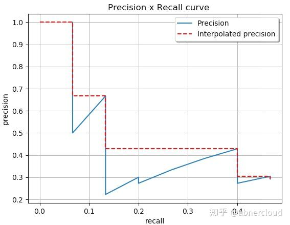
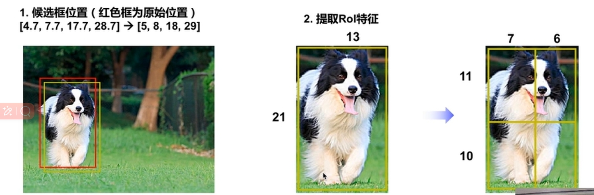
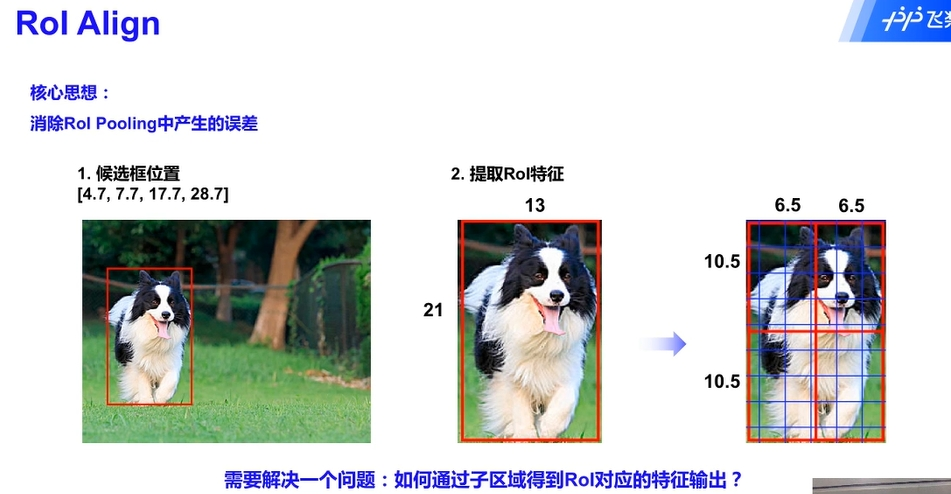
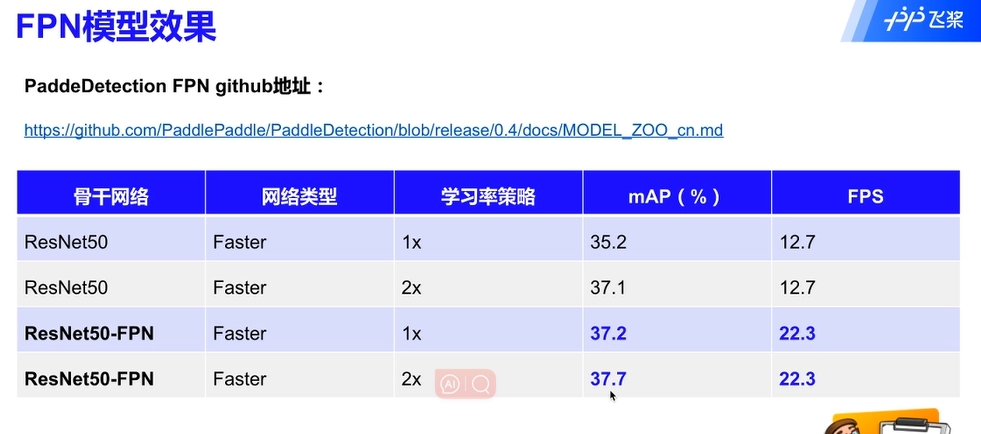
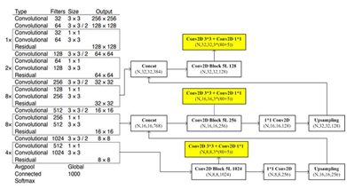
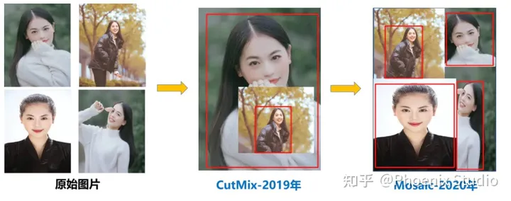

### 目标检测


#### 目标检测发展历程

对计算机而言，能够“看到”的是图像被编码之后的数字，但它很难理解高层语义概念，比如图像或者视频帧中出现的目标是人还是物体，更无法定位目标出现在图像中哪个区域。目标检测的主要目的是让计算机可以自动识别图片或者视频帧中所有目标的类别，并在该目标周围绘制边界框，标示出每个目标的位置，如 图1 所示。 


> 图1：图像分类和目标检测示意图。(a)是图像分类任务，只需识别出这是一张斑马的图片。(b)是目标检测任务，不仅要识别出这是一张斑马的图片，还要标出图中斑马的位置。

图像分类处理基本流程，先使用卷积神经网络提取图像特征，然后再用这些特征预测分类概率，最后选出概率最大的类别，即为当前图片的类别，流程如 图2 所示。


但对于目标检测问题，按照 图2 的流程则行不通。因为在图像分类任务中，对整张图提取特征的过程中没能体现出不同目标之间的区别，最终也就没法分别标示出每个物体所在的位置。

为了解决这个问题，结合图片分类任务取得的成功经验，我们可以将目标检测任务进行拆分。假设我们现在有某种方式可以在输入图片上生成一系列可能包含物体的区域，这些区域称为候选区域，在一张图上可以生成很多个候选区域。然后对每个候选区域，可以把它单独当成一幅图像来看待，使用图像分类模型对它进行分类，看它属于哪个类别或者背景（即不包含任何物体的类别）。

上一节我们学过如何解决图像分类任务，使用卷积神经网络对一幅图像进行分类不再是一件困难的事情。那么，现在问题的关键就是如何产生候选区域？比如我们可以使用穷举法来产生候选区域，如图3所示。 


A为图像上的某个像素点，B为A右下方另外一个像素点，A、B两点可以确定一个矩形框，记作AB。

- 如图（a）所示：A在图片左上角位置，B遍历除A之外的所有位置，生成矩形框A1B1, …, A1Bn, …
- 如图（b）所示：A在图片中间某个位置，B遍历A右下方所有位置，生成矩形框AkB1, …, AkBn, …

当A遍历图像上所有像素点，B则遍历它右下方所有的像素点，最终生成的矩形框集合{AiBj}将会包含图像上所有可以选择的区域。

研究员开始思考，是否可以应用传统图像算法先产生候选区域，然后再用卷积神经网络对这些区域进行分类？只要我们对每个候选区域的分类足够的准确，则一定能找到跟实际物体足够接近的区域来。穷举法也许能得到正确的预测结果，但其计算量也是非常巨大的，其所生成的总候选区域数目约为 $\frac{W^2 H^2}{4}$ ，假设H=W=100，总数将会达到 $2.5 \times 10^{7}$ 个，如此多的候选区域使得这种方法几乎没有什么实用性。但是通过这种方式，我们可以看出，假设分类任务完成的足够完美，从理论上来讲检测任务也是可以解决的，亟待解决的问题是如何设计出合适的方法来产生候选区域。需要关注两点，一个是产生候选区域的方法，另一个是提升候选区域分类效率。目标检测算法就是解决这类问题的，图4 给出了基于深度学习的目标检测算法，主要分为Anchor-Based和Anchor-Free，其中Anchor-Based方法又可以分为两阶段检测算法和单阶段检测算法。


其中，Anchor(锚框)指人为预先设定好比例的一组候选框集合。

Anchor-Based使用Anchor提取候选目标框，然后在特征图上的每一个点，对Anchor进行分类和回归。两阶段检测算法先使用Anchor在图像上产生候选区域，划分前景和背景，再对候选区域进行分类并预测目标物体位置。典型的两阶段检测算法是R-CNN系列(Fast R-CNN、Faster R-CNN等)，经典的Faster R-CNN通过RPN(Region Proposal Network)学习候选区域(Region Propposal, RP)，再对候选区域进行分类和回归，输出最终目标框和类别。基于先产生候选区域再检测的两阶段模型通常具有较优的精度，但是预测速度较慢。

此外，Anchor-Based还有一些单阶段模型，这类模型在产生候选区域的同时即可预测出物体类别和位置，不需要分成两阶段来完成检测任务。典型的单阶段算法是YOLO系列(YOLOV2、YOLOv3、YOLOv4、PP-YOLO、PP-YOLOV2等)。单阶段算法摒弃两阶段算法中的RPN产生候选区域这一步骤，将候选区域和检测两个阶段合二为一，使得网络结构更加简单，检测速度快。

但是Anchor-Based方法在实际应用中存在一些缺点，比如：手工设计Anchor需要考虑Anchor的数量、尺寸(长宽比)；在特征图上像素点密集滑动会生成的检测框会存在大量负样本区域，就需要考虑正负样本不均衡的问题；Anchor的设计导致网络超参数变多，模型学习比较困难；更换不同的数据集需要重新调整Anchor。因此研究者提出了Anchor-Free方法，不再使用预先设定Anchor，通常通过预测目标的中心或角点，对目标进行检测。包含基于中心区域预测的方法(FCOS、CenterNet等)和基于多关键点联合表达的方法(CorNert、RepPoints等)。Anchor-Free算法不再需要设计Anchor，模型更为简单，减少模型耗时，但是精度也比Anchor-Based方法精度低。


**无论使用传统方法还是深度学习的方法来完成目标检测任务，一定要遵循三个步骤：检测窗口的选择+图像特征提取+分类器设计**


#### 目标检测基础概念

- 边界框(Bounding Box, BBox) 
- 锚框(Anchor box) 
- 候选区域/框(Region Proposal, RP)
- 交并比 (IOU  )
- 非极大值抑制（NMS, Non-Maximun Suppression)
- P-R 曲线 以Precision  ReCall 为纵、横坐标的曲线
- AP （avg Precision） 某一类P-R曲线下的面积
- mAP （mean avg Precision） 所以类别AP平均


#### 边界框（Bounding Box，BBox）

检测任务需要同时预测物体的类别和位置，因此需要引入一些跟位置相关的概念。通常使用边界框（bounding box，bbox）来表示物体的位置，边界框是正好能包含物体的矩形框，如 图6 所示，图中3个人分别对应3个边界框。

检测任务需要同时预测物体的类别和位置，因此需要引入一些跟位置相关的概念。通常使用边界框（bounding box，bbox）来表示物体的位置，边界框是正好能包含住物体的矩形框，如图所示，图中3个人分别对应3个边界框


通常有两种格式来表示边界框的位置：

- xyxy，即(x1,y1,x2,y2)，其中(x1,y1)是矩形框左上角的坐标，(x2,y2)是矩形框右下角的坐标。图中3个红色矩形框用xyxy格式表示如下
- 左：
- 中：
- 右：

- xywh，即(x,y,w,h)，其中(x,y)是矩形框中心点的坐标，w是矩形框的宽度，h是矩形框的高度。 

在检测任务中，训练数据集的标签里会给出目标物体真实边界框所对应的

(x1,y1,x2,y2)这样的边界框也被称为真实框（ground truth box），如上图所示，图中画出了3个人像所对应的真实框。模型会对目标物体可能出现的位置进行预测，由模型预测出的边界框则称为预测框（prediction box）。

> 图片坐标的原点在左上角，x轴向右为正方向，y轴向下为正方向。

要完成一项检测任务，我们通常希望模型能够根据输入的图片，输出一些预测的边界框，以及边界框中所包含的物体的类别或者说属于某个类别的概率，例如这种格式: 

[L,P,x1,y1,x2,y2]，其中L是类别标签，P是物体属于该类别的概率

#### 锚框(Anchor box)

锚框与物体边界框不同，是由人们假想出来的一种框。先设定好锚框的大小和形状，再以图像上某一个点为中心画出矩形框。在下图中，以像素点[300, 500]为中心可以使用下面的程序生成3个框，如图中蓝色框所示，其中锚框A1跟人像区域非常接近。


在目标检测模型中，通常会以某种规则在图片上生成一系列锚框，将这些锚框当成可能的候选区域。模型对这些候选区域是否包含物体进行预测，如果包含目标物体，则还需要进一步预测出物体所属的类别。还有更为重要的一点是，由于锚框位置是固定的，它不大可能刚好跟物体边界框重合，所以需要在锚框的基础上进行微调以形成能准确描述物体位置的预测框，模型需要预测出微调的幅度。在训练过程中，模型通过学习不断的调整参数，最终能学会如何判别出锚框所代表的候选区域是否包含物体，如果包含物体的话，物体属于哪个类别，以及物体边界框相对于锚框位置需要调整的幅度。

Anchors（锚点/锚框）指由一组矩阵，每个矩阵对应不同的检测尺度大小。如下矩阵：

```
[[ -84.  -40.  99.  55.]
 [-176.  -88. 191. 103.]
 [-360. -184. 375. 199.]
 [ -56.  -56.  71.  71.]
 [-120. -120. 135. 135.]
 [-248. -248. 263. 263.]
 [ -36.  -80.  51.  95.]
 [ -80. -168.  95. 183.]
 [-168. -344. 183. 359.]]
```
其中每行4个值（x1,y1,x2,y2 ），对应矩形框左上角、右下角相对于中心点的偏移量。9个矩形共有三种形状，即1:1, 1:2, 2:1，即进行多尺度检测。


例如，一张800x600的原始图片，经过VGG下采样后(生成特征矩阵)16倍大小，大小变为50x38，每个点设置9个anchor，则总数为：

`ceil(800 / 16) * ceil(600 / 16) * 9 = 50 * 38 * 9 = 17100`


#### 候选区域

 候选区域（Region proposal），就是预先找出图中目标可能出现的位置，通过利用图像中的纹理、边缘、颜色等信息，保证在选取较少窗口的情况下保持较高的召回率。

 Region Proposal方法比传统的滑动窗口方法获取的质量要更高。比较常用的Region Proposal方法有：SelectiveSearch(SS，选择性搜索)、Edge Boxes（EB）

其实物体候选框获取当前主要使用图像分割与区域生长技术。区域生长(合并)主要由于检测图像中存在的物体具有局部区域相似性(颜色、纹理等)。目标识别与图像分割技术的发展进一步推动有效提取图像中信息。滑窗法作为一种经典的物体检测方法，不同大小的窗口在图像上进行滑动时候，进行卷积运算后的结果与已经训练好的分类器判别存在物体的概率。选择性搜索(Selective Search)是主要运用图像分割技术来进行物体检测。

**滑动窗口**

通过滑窗法流程图可以很清晰理解其主要思路：首先对输入图像进行不同窗口大小的滑窗进行从左往右、从上到下的滑动。每次滑动时候对当前窗口执行分类器(分类器是事先训练好的)。如果当前窗口得到较高的分类概率，则认为检测到了物体。对每个不同窗口大小的滑窗都进行检测后，会得到不同窗口检测到的物体标记，这些窗口大小会存在重复较高的部分，最后采用非极大值抑制(Non-Maximum Suppression, NMS)的方法进行筛选。最终，经过NMS筛选后获得检测到的物体。 滑窗法简单易于理解，但是不同窗口大小进行图像全局搜索导致效率低下，而且设计窗口大小时候还需要考虑物体的长宽比。所以，对于实时性要求较高的分类器，不推荐使用滑窗法。

**选择性搜索**

滑窗法类似穷举进行图像子区域搜索，但是一般情况下图像中大部分子区域是没有物体的。学者们自然而然想到只对图像中最有可能包含物体的区域进行搜索以此来提高计算效率。选择搜索（selective search，简称SS）方法是当下最为熟知的图像bounding boxes提取算法，由Koen E.A于2011年提出。 选择搜索算法的主要思想：图像中物体可能存在的区域应该是有某些相似性或者连续性区域的。因此，选择搜索基于上面这一想法采用子区域合并的方法进行提取bounding boxes。首先，对输入图像进行分割算法产生许多小的子区域。其次，根据这些子区域之间相似性(相似性标准主要有颜色、纹理、大小等等)进行区域合并，不断的进行区域迭代合并。每次迭代过程中对这些合并的子区域做bounding boxes(外切矩形)，这些子区域外切矩形就是通常所说的候选框。

选择搜索流程

    step0：生成区域集R
    step1：计算区域集R里每个相邻区域的相似度S={s1, s2,…}
    step2：找出相似度最高的两个区域，将其合并为新集，添加进R
    step3：从S中移除所有与step2中有关的子集
    step4：计算新集与所有子集的相似度
    step5：跳至step2，直至S为空

选择搜索优点

    计算效率优于滑窗法
    由于采用子区域合并策略，所以可以包含各种大小的疑似物体框
    合并区域相似的指标多样性，提高了检测物体的概率


#### 交并比

（300，500）为中心，生成的三个锚框，我们可以看到锚框A1 与真实框 G1的重合度比较好。那么如何衡量这三个锚框跟真实框之间的关系呢，在检测任务中是使用交并比（Intersection of Union，IoU）作为衡量指标。这一概念来源于数学中的集合，用来描述两个集合A和B之间的关系，它等于两个集合的交集里面所包含的元素个数，除以它们的并集里面所包含的元素个数，具体计算公式如下


我们将用这个概念来描述两个框之间的重合度。两个框可以看成是两个像素的集合，它们的交并比等于两个框重合部分的面积除以它们合并起来的面积。下图a中红色区域是两个框的重合面积，图b中蓝色区域是两个框的相并面积。用这两个面积相除即可得到它们之间的交并比，如图所示


```python
    # 计算IoU，矩形框的坐标形式为xyxy，这个函数会被保存在box_utils.py文件中
    def box_iou_xyxy(box1, box2):
        # 获取box1左上角和右下角的坐标
        x1min, y1min, x1max, y1max = box1[0], box1[1], box1[2], box1[3]
        # 计算box1的面积
        s1 = (y1max - y1min + 1.) * (x1max - x1min + 1.)
        # 获取box2左上角和右下角的坐标
        x2min, y2min, x2max, y2max = box2[0], box2[1], box2[2], box2[3]
        # 计算box2的面积
        s2 = (y2max - y2min + 1.) * (x2max - x2min + 1.)
        # 计算相交矩形框的坐标
        xmin = np.maximum(x1min, x2min)
        ymin = np.maximum(y1min, y2min)
        xmax = np.minimum(x1max, x2max)
        ymax = np.minimum(y1max, y2max)
        # 计算相交矩形行的高度、宽度、面积
        inter_h = np.maximum(ymax - ymin + 1., 0.)
        inter_w = np.maximum(xmax - xmin + 1., 0.)
        intersection = inter_h * inter_w
        # 计算相并面积
        union = s1 + s2 - intersection
        # 计算交并比
        iou = intersection / union
        return iou
    bbox1 = [100., 100., 200., 200.]
    bbox2 = [120., 120., 220., 220.]
    iou = box_iou_xyxy(bbox1, bbox2)
    print('IoU is {}'.format(iou))  
```

```python

    # 计算IoU，矩形框的坐标形式为xywh
    def box_iou_xywh(box1, box2):
        x1min, y1min = box1[0] - box1[2]/2.0, box1[1] - box1[3]/2.0
        x1max, y1max = box1[0] + box1[2]/2.0, box1[1] + box1[3]/2.0
        s1 = box1[2] * box1[3]
        x2min, y2min = box2[0] - box2[2]/2.0, box2[1] - box2[3]/2.0
        x2max, y2max = box2[0] + box2[2]/2.0, box2[1] + box2[3]/2.0
        s2 = box2[2] * box2[3]
        xmin = np.maximum(x1min, x2min)
        ymin = np.maximum(y1min, y2min)
        xmax = np.minimum(x1max, x2max)
        ymax = np.minimum(y1max, y2max)
        inter_h = np.maximum(ymax - ymin, 0.)
        inter_w = np.maximum(xmax - xmin, 0.)
        intersection = inter_h * inter_w
        union = s1 + s2 - intersection
        iou = intersection / union
        return iou
```
为了直观的展示交并比的大小跟重合程度之间的关系，图示意了不同交并比下两个框之间的相对位置关系，从 IoU = 0.95 到 IoU = 0.


#### 非极大值抑制

在目标检测过程中，网络对同一个目标可能会产生多个预测框。因此需要消除重叠较大的冗余预测框。具体的处理方法就是非极大值抑制（Non-maximum suppression，NMS）。

预测结果中，可能多个预测结果间存在重叠部分，需要保留交并比最大的、去掉非最大的预测结果，这就是非极大值抑制（Non-Maximum Suppression，简写作NMS）。如下图所示，对同一个物体预测结果包含三个概率0.8/0.9/0.95，经过非极大值抑制后，仅保留概率最大的预测结果。


NMS基本思想是，如果有多个预测框都对应同一个物体，则只选出得分最高的那个预测框，剩下的预测框被丢弃掉。

如何判断两个预测框对应的是同一个物体呢，标准该怎么设置？

如果两个预测框的类别一样，而且他们的位置重合度比较大，则可以认为他们是在预测同一个目标。非极大值抑制的做法是，选出某个类别得分最高的预测框，然后看哪些预测框跟它的IoU大于阈值，就把这些预测框给丢弃掉。这里IoU的阈值是超参数，需要提前设置，YOLOv3模型里面设置的是0.5。


- Step0：创建选中列表，keep_list = []
- Step1：对得分进行排序，remain_list = [ 3, 5, 10, 2, 9, 0, 1, 6, 4, 7, 8]，
- Step2：选出boxes[3]，此时keep_list为空，不需要计算IoU，直接将其放入keep_list，keep_list = [3]， remain_list=[5, 10, 2, 9, 0, 1, 6, 4, 7, 8]
- Step3：选出boxes[5]，此时keep_list中已经存在boxes[3]，计算出IoU(boxes[3], boxes[5]) = 0.0，显然小于阈值，则keep_list=[3, 5], remain_list = [10, 2, 9, 0, 1, 6, 4, 7, 8]
- Step4：选出boxes[10]，此时keep_list=[3, 5]，计算IoU(boxes[3], boxes[10])=0.0268，IoU(boxes[5], boxes[10])=0.0268 = 0.24，都小于阈值，则keep_list = [3, 5, 10]，remain_list=[2, 9, 0, 1, 6, 4, 7, 8]
- Step5：选出boxes[2]，此时keep_list = [3, 5, 10]，计算IoU(boxes[3], boxes[2]) = 0.88，超过了阈值，直接将boxes[2]丢弃，keep_list=[3, 5, 10]，remain_list=[9, 0, 1, 6, 4, 7, 8]
- Step6：选出boxes[9]，此时keep_list = [3, 5, 10]，计算IoU(boxes[3], boxes[9]) = 0.0577，IoU(boxes[5], boxes[9]) = 0.205，IoU(boxes[10], boxes[9]) = 0.88，超过了阈值，将boxes[9]丢弃掉。keep_list=[3, 5, 10]，remain_list=[0, 1, 6, 4, 7, 8]
- Step7：重复上述Step6直到remain_list为空。

最终得到keep_list=[3, 5, 10]，也就是预测框3、5、10被最终挑选出来了


#### PR曲线

Precision（准确率/查准率P）（TP/（TP+FP））和Recall（召回率/查全率R ） （TP/（TP+FN））

> F 值 —— 准确率 * 召回率 * 2 / 准确率 + 召回率）（F值即为准确率和召回率的调和平均值）

一般来说，P和R是不可兼得的，召回率越高，准确率越低。

TP：实际为正，且被预测为正的实例
FP：实际为负，但被预测为正的实例
TN：实际为负，且被预测为负的实例
FN：实际为正，但被预测为负的实例


PR曲线的评估方法

1.若曲线a完全“包住”曲线b，则a性能优于b。
2.若曲线a和曲线b发生了相交，则无法比较。
3.比较曲线a和曲线b曲线下面积的大小。面积大则性能优。
4.比较“平衡点”。用的较少。  “平衡点”（Break-Event Point，简称BEP）时P值和R值相同的时的取值。


计算 mAP

- PASCAL VOC
    - 11点插值法：Recall值为离散的11个点[0, 0.1, ..., 1]；对每一个点，在 PR图上向右找最大的Precision值，找到11个对应的Precision值，加和求平均即为AP。
    - all点插值法：Recall值为[0, 1]区间内的所有点；对每个点，在 PR图上向右找最大的Precision值，找到无穷个对应的Precision值，对其求定积分即为AP，即近似为PR曲线下的面积。
- COCO
    - 101点插值法：COCO使用101点插值法进行计算。

**Average Precision**

比较目标检测器性能的另一种方法是计算Precision x Recall曲线的曲线下面积（AUC）。由于AP曲线通常是上下弯曲的锯齿形曲线，因此比较同一图中的不同曲线（不同的检测器）通常不是一件容易的事-因为这些曲线往往会频繁地相互交叉。这就是为什么数字精度平均精度（AP）也可以帮助我们比较不同检测器的原因。实际上，AP是在0到1之间的所有召回值上平均的精度。

从2010年开始，通过PASCAL VOC挑战计算AP的方法已经改变。目前，由PASCAL VOC挑战执行的插值使用所有数据点，而不是如其论文所述仅插值11个等距点。

- 11-point interpolation

11点插值法尝试通过在一组11个等间隔的召回级别[0, 0.1, 0.2, ... , 1]上求平均精度来总结Precision x Recall曲线的形状


其中


其中 $p(\overset{\sim} r)$ 是在召回值为 $\overset{\sim} r$时的测量精度。

AP不是使用在每个点上观察到的精度，而是通过只在11个级别 $\overset{\sim} r$ 上插值精度来获得，取召回值大于 $\overset{\sim} r$ 的最大精度。

- Interpolating all points

不仅可以在等距的11个点进行插值，还可以通过以下方式对所有点进行插值：


其中


其中 $p(\overset{\sim} r)$ 是在召回值为 $\overset{\sim} r$时的测量精度。

在这种情况下，AP不再使用仅在几个点上观察到的精度，而是通过插值每个级别r的精度来获得，取召回值大于或等于r+1的最大精度。这样我们就可以计算出曲线下的估计面积。

如下例子

一个例子有助于我们更好地理解插值平均精度的概念。考虑以下检测：


一共有7幅图像，其中15个gt值对象由绿色边界框表示，24个检测对象由红色边界框表示。每个检测到的对象都有一个置信水平，并由字母（A，B，…，Y）标识。

下表显示了具有相应置信度的边界框。最后一列将检测标识为TP或FP。在本例中，如果IOU >= 30%，则认为是TP，否则是FP。通过查看上面的图像，我们可以大致判断检测到的是TP还是FP。


在一些图像中，有多个检测重叠于一个基础真值（图2、3、4、5、6和7）。对于这些情况，第一个检测被认为是TP，而其他检测被认为是FP。该规则适用于PASCAL VOC 2012度量：“例如，单个对象的5次检测（TP）被计算为1次正确检测和4次错误检测”。

Precision x Recall曲线是通过计算累积TP或FP检测的Precision和Recall值来绘制的。为此，我们首先需要对检测进行置信度排序，然后计算每个累积检测的精度和召回率，如下表所示：


绘制精度和召回值，我们有以下Precision x Recall曲线：


如前所述，有两种不同的方法来测量插值的平均精度(ap)：11点插值和插值所有点。下面我们对它们进行比较：

**计算11点插值**

11点插值平均精度的思想是在一组11个召回水平（0,0.1，…，1）上平均精度。内插精度值取召回值大于其当前召回值的最大精度( precision)，如下所示：


通过应用11点插值，我们得到：


```math
AP = \frac{1}{11}(1+0.6666+0.4285+0.4285+0.4285+0+0+0+0+0+0) = 26.84%
```

**计算在所有点上执行的插值**


通过插值所有点，平均精度（AP）可以解释为精度x召回率曲线的近似AUC。这样做的目的是减少曲线波动的影响。通过应用前面给出的方程，我们可以得到下面所示的面积。我们还可以通过查看召回率从最高（0.4666）到0（从右到左查看绘图）来直观地获得插值精度点，并且，当我们减少召回率时，我们收集精度值最高的精度值，如下图所示：



从上图可以看出，AUC可以分为A1、A2、A3、A4 4个区域


计算总面积，我们有AP：

```math
AP = A1+A2+A3+A4
```

A1 = (0.6666-0) X 1 = 0.0666
A2 = (0.1333-0.0666)x 0.6666 = 0.04446222
A3 = (0.4-0.1333) x 0.4285 = 0.11428095
A4 = (0.4666-0.4) x 0.3043 = 0.02026638


AP = 0.24560955 = 24.56%

两种插值方法的插值结果略有不同，每点插值和11点插值的插值结果分别为24.56%和26.84%。

### 目标检测模型

#### R-CNN

R-CNN(全称Regions with CNN features) ，是R-CNN系列的第一代算法，其实没有过多的使用“深度学习”思想，而是将“深度学习”和传统的“计算机视觉”的知识相结合。比如R-CNN pipeline中的第二步和第四步其实就属于传统的“计算机视觉”技术。使用selective search提取region proposals，使用SVM实现分类。


思路

- 给定一张图片，从图片中选出2000个独立的候选区域(Region Proposal)。
- 将每个候选区域输入到预训练好的AlexNet中，提取一个固定长度（4096）的特征向量。
- 对每个目标（类别）训练一SVM分类器，识别该区域是否包含目标。
- 训练一个回归器，修正候选区域中目标的位置：对于每个类，训练一个线性回归模型判断当前框定位是否准确。

训练

- 使用区域生成算法，生成2000个候选区域，这里使用的是Selective search。
- 对生成的2000个候选区域，使用预训练好的AlexNet网络进行特征提取。将候选区域变换到网络需要的尺寸(227×227)。 在进行变换的时候，在每个区域的边缘添加p个像素（即添加边框，设置p=16）。同时，改造预训练好的AlexNet网络，将其最后的全连接层去掉，并将类别设置为21（20个类别，另外一个类别代表背景）。每个候选区域输入到网络中，最终得到4096×21个特征。


利用上面提取到的候选区域的特征，对每个类别训练一个SVM分类器（二分类），判断候选框中物体的类别，输出Positive/Negative。如果该区域与Ground truth的IOU低于某个阈值，就将给区域设置为Negative（阈值设置为0.3）。如下图所示：


R-CNN在VOC 2007测试集上mAP达到58.5%，打败当时所有的目标检测算法


缺点

- 重复计算，训练耗时，每个region proposal，都需要经过一个AlexNet特征提取，为所有的RoI（region of interest）提取特征大约花费47秒。
- 训练占用空间，特征文件需要保存到文件，5000张的图片会生成几百G的特征文件。
- selective search方法生成region proposal 质量不够好，且对一帧图像，需要花费2秒。
- 三个模块（提取、分类、回归）是分别训练的，并且在训练时候，对于存储空间消耗较大。


#### Fast R-CNN

Fast R-CNN是基于R-CNN和SPPnets进行的改进。SPPnets，其创新点在于只进行一次图像特征提取（而不是每个候选区域计算一次），然后根据算法，将候选区域特征图映射到整张图片特征图中。


流程

- 使用selective search生成region proposal，大约2000个左右区域候选框
- 使用CNN对图像进行卷积运算，得到整个图像的特征图
- 对于每个候选框，通过RoI Projection映射算法取出该候选框的特征图，再通过RoI池化层形成固定长度的特征向量
- 每个特征向量被送入一系列全连接（fc）层中，最终分支成两个同级输出层 ：一个输出个类别加上1个背景类别的Softmax概率估计，另一个为个类别的每一个类别输出4个定位信息


改进

- 和RCNN相比，训练时间从84小时减少为9.5小时，测试时间从47秒减少为0.32秒。在VGG16上，Fast RCNN训练速度是RCNN的9倍，测试速度是RCNN的213倍；训练速度是SPP-net的3倍，测试速度是SPP-net的3倍
- Fast RCNN在PASCAL VOC 2007上准确率相差无几，约在66~67%之间
- 加入RoI Pooling，采用一个神经网络对全图提取特征
- 在网络中加入了多任务函数边框回归，实现了端到端的训练

缺点

- 依旧采用selective search提取region proposal（耗时2~3秒，特征提取耗时0.32秒）
- 无法满足实时应用，没有真正实现端到端训练测试
- 利用了GPU，但是region proposal方法是在CPU上实现的

#### Faster RCNN


经过R-CNN和Fast-RCNN的积淀，Ross B.Girshick在2016年提出了新的Faster RCNN，在结构上将特征抽取、region proposal提取， bbox regression，分类都整合到了一个网络中，使得综合性能有较大提高，在检测速度方面尤为明显


 整体流程

 - Conv Layers。作为一种CNN网络目标检测方法，Faster RCNN首先使用一组基础的卷积/激活/池化层提取图像的特征，形成一个特征图，用于后续的RPN层和全连接层。
- Region Proposal Networks（RPN）。RPN网络用于生成候选区域，该层通过softmax判断锚点（anchors）属于前景还是背景，在利用bounding box regression（包围边框回归）获得精确的候选区域。
- RoI Pooling。该层收集输入的特征图和候选区域，综合这些信息提取候选区特征图（proposal feature maps），送入后续全连接层判定目标的类别。
- Classification。利用取候选区特征图计算所属类别，并再次使用边框回归算法获得边框最终的精确位置。

**Conv Layers**


Conv layers包含了conv，pooling，relu三种层。以python版本中的VGG16模型中的faster_rcnn_test.pt的网络结构为例，如图2，Conv layers部分共有13个conv层，13个relu层，4个pooling层。这里有一个非常容易被忽略但是又无比重要的信息，在Conv layers中：

所有的conv层都是：kernel_size=3，pad=1，stride=1
所有的pooling层都是：kernel_size=2，pad=0，stride=2

为何重要？在Faster RCNN Conv layers中对所有的卷积都做了扩边处理（ pad=1，即填充一圈0），导致原图变为 (M+2)x(N+2)大小，再做3x3卷积后输出MxN 。正是这种设置，导致Conv layers中的conv层不改变输入和输出矩阵大小。如图3：


类似的是，Conv layers中的pooling层kernel_size=2，stride=2。这样每个经过pooling层的MxN矩阵，都会变为(M/2)x(N/2)大小。综上所述，在整个Conv layers中，conv和relu层不改变输入输出大小，只有pooling层使输出长宽都变为输入的1/2。

 那么，一个MxN大小的矩阵经过Conv layers固定变为(M/16)x(N/16)！这样Conv layers生成的feature map中都可以和原图对应起来。

#### RPN 网络


经典的检测方法生成检测框都非常耗时，如OpenCV adaboost使用滑动窗口+图像金字塔生成检测框；或如R-CNN使用SS(Selective Search)方法生成检测框。而Faster RCNN则抛弃了传统的滑动窗口和SS方法，直接使用RPN生成检测框，这也是Faster R-CNN的巨大优势，能极大提升检测框的生成速度。


如果每个点生成15个Anchor, RPNHead如下

```
RPNHead(
  (anchor_generator): AnchorGenerator()
  (loss_rpn_bbox): SmoothL1Loss()
  (rpn_feat): RPNFeat(
    (rpn_conv): Conv2D(1024, 1024, kernel_size=[3, 3], padding=1, data_format=NCHW)
  )
  (rpn_rois_score): Conv2D(1024, 15, kernel_size=[1, 1], data_format=NCHW)
  (rpn_rois_delta): Conv2D(1024, 60, kernel_size=[1, 1], data_format=NCHW)
)
```
>4 * num_anchors(15)  RPN ROI bbox回归delta

RPN网络全称Region Proposal Network（区域提议网络），是专门用来从特征图生成候选区域的网络。其结构如下所示：


> 图中256-d: ZF backbone 维度为256  VGG16 backbone 为512

流程步骤：

（1）输入：通过主干网卷积得到的特征图
（2）对于特征图上的每一个点（称之为anchor point，锚点）,生成具有不同 尺度 和 宽高比 的锚点框，这个锚点框的坐标(x,y,w,h)是在原图上的坐标
（3）然后将这些锚点框输入到两个网络层中去，一个（rpn_cls_score ）用来分类，即这个锚点框里面的特征图是否属于前景；另外一个（rpn_bbox_pred）输出四个位置坐标（相对于真实物体框的偏移）
（4）将锚点框与Ground Truth中的标签框进行 IoU 对比，如果其 IoU 高于某个阈值，则该锚点框标定为前景框，否则属于背景框；对于前景框，还要计算其与真实标签框的4个位置偏移；将这个标注好的锚点框（带有 前背景类别 和 位置偏移 标注）与3中卷积网络层的两个输出进行loss比较(类别：CrossEntrpy loss 和 位置回归：smooth L1 loss)，从而学习到如何提取前景框

（5）学习到如何提取前景框后，就根据 rpn_cls_score 层的输出概率值确定前景框；位置偏移值则被整合到锚点框的坐标中以得到实际的框的坐标；这样子就得到了前景框，起到了selective search的作用。RPN生成的proposal就称为 Region of Interest.由于他们具有不同的尺度和长度，因此需要通过一个 ROI pooling层获得统一的大小


**proposal代码实现**

- 以飞浆的`paddle.vision.ops.generate_proposals` 函数为例
    - 通过转置操作将 scores 和 bbox_deltas 的大小分别调整为 （H * W * A，1） 和 （H * W * A，4）
    - 计算出候选框的位置。
    - 将检测框的坐标限定到图像尺寸范围内。
    - 删除面积较小的候选框。
    - 通过非极大抑制(non-maximum suppression, NMS), 选出满足条件的候选框作为结果

```
# 以一个anchor 为例
scores = paddle.rand((1,1,1,1), dtype=paddle.float32)
bbox_deltas = paddle.rand((1, 4, 1, 1), dtype=paddle.float32)
>>> bbox_deltas
Tensor(shape=[1, 4, 1, 1], dtype=float32, place=Place(cpu), stop_gradient=True,
       [[[[0.40491790]],

         [[0.88431013]],

         [[0.93087065]],

         [[0.94150990]]]])

img_size = paddle.to_tensor([[10.0, 10.0]])
anchors = paddle.rand((1,4), dtype=paddle.float32)
anchors[0] = [-2., -2.,  2.,  2.]
variances = paddle.ones_like(anchors)

rois, roi_probs, roi_nums = paddle.vision.ops.generate_proposals(scores, bbox_deltas,img_size, anchors, variances, return_rois_num=True, min_size=0.0)
>>> rois
Tensor(shape=[1, 4], dtype=float32, place=Place(cpu), stop_gradient=True,
       [[0.        , 0.        , 6.69310474, 8.66493988]])

# 通过anchor 知道anchor 的宽和高 及中心坐标w = 4, h = 4, Cx = 0,Cy = 0
# bbox_deltas表示预测出的候选框的位置和 anchor 的位置之间的距离
# dx = 0.404， dy=0.884， dw=0.930, dh=0.9415

pred_x = dx*w + Cx = 1.61967158
pred_y = dy*h + Cy = 3.53724051
pred_w = paddle.exp(dw)* w =  10.14686680
pred_h = paddle.exp(dh)* h = 10.25539875

# 将上述转换成x1，y1,x2,y2 坐标格式
x1 = -3.4574
y1 = -1.590458
x2 = pred_x + pred_w/2 = 6.69310498
y2 = pred_y + pred_h/2  8.664939884999999

# 由于负坐标超出了边界，要限定到图像尺寸范围内 所以x1 =0  y1=0
# 接着删除面积小的proposal
# pre_topN
# NMS
# topN（按照scores排序）
```

**RPN 损失**

`RPNTargetAssign`

- 将anchor和 input中的gt_bbox 匹配起来,计算 每个anchors和gt匹配的最大IOU
    
    paddle.topk （最大iou）
    ```
    # 沿着可选的 axis 查找 topk 最大或者最小的结果和结果所在的索引信息
    >>> data_1 = paddle.to_tensor([[1, 4, 5, 7],[2,2,2,9]])
    >>>
    >>> value_1, indices_1 = paddle.topk(data_1, k=1, axis=0)
    >>> indices_1
    Tensor(shape=[1, 4], dtype=int64, place=Place(cpu), stop_gradient=True,
        [[1, 0, 0, 1]])
    >>> value_1
    Tensor(shape=[1, 4], dtype=int64, place=Place(cpu), stop_gradient=True,
        [[2, 4, 5, 9]])
    ```
- 正负样本的cls 损失
- 边界框损失（只计算正样本）


其它写法

```math

 L(\{p_i\},\{t_i\}) = \frac{1}{N_{cls}}\sum{L_{cls}(p_i, p_i^*)} + \lambda\frac{1}{N_{reg}}\sum{p_i^*L_{reg}(t_i, t_i^*)} 
```

- i是一个mini-batch中anchor的索引
- $p_i$是anchor[i] 的预测分类概率
- Anchor[i]是正样本时, $p_i^* = 1$ ；Anchor[i]是负样本时，  $p_i^* = 0$;

什么是正样本与负样本

> 满足以下条件的Anchor是正样本：
与Ground Truth Box的IOU(Intersection-Over-Union) 的重叠区域最大的Anchor；
与Gound Truth Box的IOU的重叠区域>0.7;
>
> 满足以下条件的Anchor是负样本：
与Gound Truth Box的IOU的重叠区域 <0.3;
既不属于正样本又不属于负样本的Anchor不参与训练。

- $t_i$ Anchor[i]预测的Bounding Box的参数化坐标(parameterized coordinates);
- $t_i^*$ Anchor[i]的Ground Truth的Bounding Box的参数化坐标；


- $N_{cls}$: mini-batch size;
- $N_{reg}$: Anchor Location的数量; （程序中这两项都为batch_size*batch_size_per_im）
- λ: 权重平衡参数，在论文中作者设置 λ=10 ，但实际实验显示，结果对的λ变化不敏感，如下表所示，λ取值从1变化到100，对最终结果的影响在1%以内


**RoI Pooling**

指的是 Faster R-CNN 结构中，经过 RPN 层后，产生的 proposal 对应的 box 框。

感兴趣区域池化（Region of interest pooling）（也称为RoI pooling）是使用卷积神经网络在目标检测任务中广泛使用的操作。例如，在单个图像中检测多个汽车和行人。其目的是对非均匀尺寸的输入执行最大池化以获得固定尺寸的特征图（例如7×7）。

输出是 batch 个 vector，其中 batch 的值等于 roi 的个数，vector的大小为channle * w  * h；ROI Pooling 的过程就是将一个个大小不同的 box 矩形框，都映射成大小为w * h的矩形框； 


我们有一个8*8 大小的 feature map，一个ROI，以及输出大小为 2 * 2;输入的固定大小的feature map， region proposal 投影之后位置（左上角，右下角坐标）：（0，3）（7，8）  将其划分为（2 * 2）个 sections（因为输出大小为2 * 2），我们可以得到： 对每个section做max pooling，可以得到：


> 说明：在此案例中 region proposals 是 5 * 7 大小的，在 pooling 之后需要得到 2 * 2 的，所以在 5 * 7 的特征图划分成 2 * 2 的时候不是等分的，行是 5/2，第一行得到2，剩下的那一行是3，列是7/2，第一列得到3，剩下那一列是4。

总结一下roi pooling的缺点: 
- 由于两次量化（quantization）操作（一次是mapping到feature maps的时候，一次是裁剪到k*k的时候）会导致misalign这个问题，不够精确。

    - 候选框的位置取整，当Roi位置不是整数时，Roi的位置需要取整。
    - 提取特征时取整。划分4个子区域做Max pooling，框的长度需要近似取整。



**roi align**

roi align就避免了两次量化操作，并且使用插值操作




> https://zhuanlan.zhihu.com/p/594788037


#### bbox head

**BBoxAssigner**
- 并将gt bbox添加到2000个proposal中 
- 选择正负样本，通过正负样本比例为（0.25）将样本总数降到512个
- 


**损失函数**


- 分类损失
p：候选边界框经分类器预测的概率分布(softmax) p = (p0,p1, ... pn)
u：真是边界框中的真是类别标签
其中 $L_{cls} = -logp_u$

多分类


二分类

```math

 L_{cls}(p_i, p_i^*) = -log[p_i^*p_i + (1-p_i^*)(1-p_i)] 
```

 改进

- 在VOC2007测试集测试mAP达到73.2%，目标检测速度可达5帧/秒
- 提出Region Proposal Network(RPN)，取代selective search，生成待检测区域，时间从2秒缩减到了10毫秒
- 真正实现了一个完全的End-To-End的CNN目标检测模型
- 共享RPN与Fast RCNN的特征 

 缺点

- 还是无法达到实时检测目标
- 获取region proposal， 再对每个proposal分类计算量还是较大


#### Faster Rcnn + FPN



#### Cascade R-CNN


#### Libra R-CNN


https://github.com/PaddlePaddle/PaddleDetection/tree/2d3517aa0b8adeec2752db2411c61ee56ec5a0af/configs/rcnn_enhance

#### 模型优化策略


#### SSD

SSD有哪些创新点？

- 基于Faster R-CNN中的Anchor，提出了相似的先验框（Prior box）
- 从不同比例的特征图（多尺度特征）中产生不同比例的预测，并明确地按长宽比分离预测。

不同于前面的R-CNN系列，SSD属于one-stage方法。SSD使用 VGG16 网络作为特征提取器（和 Faster R-CNN 中使用的 CNN 一样），将后面的全连接层替换成卷积层，并在之后添加自定义卷积层，并在最后直接采用卷积进行检测。在多个特征图上设置不同缩放比例和不同宽高比的先验框以融合多尺度特征图进行检测，靠前的大尺度特征图可以捕捉到小物体的信息，而靠后的小尺度特征图能捕捉到大物体的信息，从而提高检测的准确性和定位的准确性。如下图是SSD的网络结构图。


1. 怎样设置default boxes？ SSD中default box的概念有点类似于Faster R-CNN中的anchor。不同于Faster R-CNN只在最后一个特征层取anchor, SSD在多个特征层上取default box，可以得到不同尺度的default box。在特征图的每个单元上取不同宽高比的default box,一般宽高比在{1,2,3,1/2,1/3}中选取，有时还会额外增加一个宽高比为1但具有特殊尺度的box。如下图所示，在8x8的feature map和4x4的feature map上的每个单元取4个不同的default box。原文对于300x300的输入，分别在conv4_3, conv7,conv8_2,conv9_2,conv10_2,conv11_2的特征图上的每个单元取4,6,6,6,4,4个default box. 由于以上特征图的大小分别是38x38,19x19,10x10,5x5,3x3,1x1，所以一共得到38x38x4+19x19x6+10x10x6+5x5x6+ 3x3x4+1x1x4=8732个default box.对一张300x300的图片输入网络将会针对这8732个default box预测8732个边界框。


2. 怎样对先验框进行匹配？ SSD在训练的时候只需要输入图像和图像中每个目标对应的ground truth. 先验框与ground truth 的匹配遵循两个原则：

（1）对图片中的每个ground truth, 在先验框中找到与其IOU最大的先验框，则该先验框对应的预测边界框与ground truth 匹配。

（2）对于（1）中每个剩下的没有与任何ground truth匹配到的先验框，找到与其IOU最大的ground truth，若其与该ground truth的IOU值大于某个阈值（一般设为0.5），则该先验框对应的预测边界框与该ground truth匹配。

按照这两个原则进行匹配，匹配到ground truth的先验框对应的预测边界框作为正样本，没有匹配到ground truth的先验框对应的预测边界框作为负样本。尽管一个ground truth可以与多个先验框匹配，但是ground truth的数量相对先验框还是很少，按照上面的原则进行匹配还是会造成负样本远多于正样本的情况。为了使正负样本尽量均衡（一般保证正负样本比例约为1：3），SSD采用hard negative mining, 即对负样本按照其预测背景类的置信度进行降序排列，选取置信度较小的top-k作为训练的负样本。

3. 怎样得到预测的检测结果？

最后分别在所选的特征层上使用3x3卷积核预测不同default boxes所属的类别分数及其预测的边界框location。由于对于每个box需要预测该box属于每个类别的置信度（假设有c类，包括背景，例如20class的数据集合，c=21）和该box对应的预测边界框的location(包含4个值，即该box的中心坐标和宽高)，则每个box需要预测c+4个值。所以对于某个所选的特征层，该层的卷积核个数为（c+4）x 该层的default box个数.最后将每个层得到的卷积结果进行拼接。对于得到的每个预测框，取其类别置信度的最大值，若该最大值大于置信度阈值，则最大值所对应的类别即为该预测框的类别，否则过滤掉此框。对于保留的预测框根据它对应的先验框进行解码得到其真实的位置参数（这里还需注意要防止预测框位置超出图片），然后根据所属类别置信度进行降序排列，取top-k个预测框，最后进行NMS，过滤掉重叠度较大的预测框，最后得到检测结果。

SSD优势是速度比较快，整个过程只需要一步，首先在图片不同位置按照不同尺度和宽高比进行密集抽样，然后利用CNN提取特征后直接进行分类与回归，所以速度比较快，但均匀密集采样会造成正负样本不均衡的情况使得训练比较困难，导致模型准确度有所降低。另外，SSD对小目标的检测没有大目标好，因为随着网络的加深，在高层特征图中小目标的信息丢失掉了，适当增大输入图片的尺寸可以提升小目标的检测效果。

#### DSSD

DSSD有哪些创新点？

- Backbone：将ResNet替换SSD中的VGG网络，增强了特征提取能力
- 添加了Deconvolution层，增加了大量上下文信息

为了解决SSD算法检测小目标困难的问题，DSSD算法将SSD算法基础网络从VGG-16更改为ResNet-101，增强网络特征提取能力，其次参考FPN算法思路利用去Deconvolution结构将图像深层特征从高维空间传递出来，与浅层信息融合，联系不同层级之间的图像语义关系，设计预测模块结构，通过不同层级特征之间融合特征输出预测物体类别信息。

DSSD算法中有两个特殊的结构：Prediction模块；Deconvolution模块。前者利用提升每个子任务的表现来提高准确性，并且防止梯度直接流入ResNet主网络。后者则增加了三个Batch Normalization层和三个3×3卷积层，其中卷积层起到了缓冲的作用，防止梯度对主网络影响太剧烈，保证网络的稳定性。

SSD和DSSD的网络模型如下图所示：


### YOLO系列

#### YOLOv1（2016）

1、基本思想

YOLO（You Only Look Once ）是继RCNN，fast-RCNN和faster-RCNN之后，Ross Girshick针对DL目标检测速度问题提出的另一种框架，其核心思想是生成RoI+目标检测两阶段（two-stage）算法用一套网络的一阶段（one-stage）算法替代，直接在输出层回归bounding box的位置和所属类别。 

之前的物体检测方法首先需要产生大量可能包含待检测物体的先验框, 然后用分类器判断每个先验框对应的边界框里是否包含待检测物体，以及物体所属类别的概率或者置信度，同时需要后处理修正边界框，最后基于一些准则过滤掉置信度不高和重叠度较高的边界框，进而得到检测结果。这种基于先产生候选区再检测的方法虽然有相对较高的检测准确率，但运行速度较慢。

YOLO创造性的将物体检测任务直接当作回归问题（regression problem）来处理，将候选区和检测两个阶段合二为一。只需一眼就能知道每张图像中有哪些物体以及物体的位置。下图展示了各物体检测系统的流程图。


实际上，YOLO并没有真正去掉候选区，而是采用了预定义候选区的方法，也就是将图片划分为7*7个网格，每个网格允许预测出2个边框，总共49*2个bounding box，可以理解为98个候选区域，它们很粗略地覆盖了图片的整个区域。YOLO以降低mAP为代价，大幅提升了时间效率。

每个网格单元预测这些框的2个边界框和置信度分数。这些置信度分数反映了该模型对框是否包含目标的可靠程度，以及它预测框的准确程度。置信度定义为： 如果该单元格中不存在目标，则置信度分数应为零。否则，我们希望置信度分数等于预测框与真实值之间联合部分的交集（IOU）。

每个边界框包含5个预测： x，y，w，h和置信度。 (x，y) 坐标表示边界框相对于网格单元边界框的中心。宽度和高度是相对于整张图像预测的。最后，置信度预测表示预测框与实际边界框之间的IOU。

每个网格单元还预测C个条件类别概率Pr(Classi|Object) 。这些概率以包含目标的网格单元为条件。每个网格单元我们只预测的一组类别概率，而不管边界框的的数量B是多少。

2、网络结构

YOLOv1网络有24个卷积层，后面是2个全连接层。我们只使用降维层，后面是 卷积层。如下图所示：


为了快速实现快速目标检测，YOLOV1还训练了快速版本。快速YOLO使用具有较少卷积层（9层而不是24层）的神经网络，在这些层中使用较少的滤波器。除了网络规模之外，YOLO和快速YOLO的所有训练和测试参数都是相同的。网络的最终输出是7*7*30(1470)的预测张量。

3、优点与缺点

（1）优点 - YOLO检测物体速度非常快，其增强版GPU中能跑45fps（frame per second），简化版155fps - YOLO在训练和测试时都能看到一整张图的信息（而不像其它算法看到局部图片信息），因此YOLO在检测物体是能很好利用上下文信息，从而不容易在背景上预测出错误的物体信息 - YOLO可以学到物体泛化特征

（2）缺点 - 精度低于其它state-of-the-art的物体检测系统 - 容易产生定位错误 - 对小物体检测效果不好，尤其是密集的小物体，因为一个栅格只能检测2个物体 - 由于损失函数的问题，定位误差是影响检测效果的主要原因，尤其是大小物体处理上还有待加强

#### YOLOv2（2016）

Ross Girshick吸收fast-RCNN和SSD算法，设计了YOLOv2（论文原名《YOLO9000: Better, Faster, Stronger 》），在精度上利用一些列训练技巧，在速度上应用了新的网络模型DarkNet19，在分类任务上采用联合训练方法，结合wordtree等方法，使YOLOv2的检测种类扩充到了上千种，作者在论文中称可以检测超过9000个目标类别，所以也称YOLO9000. YOLOv2模型可以以不同的尺寸运行，从而在速度和准确性之间提供了一个简单的折衷，在67FPS时，YOLOv2在VOC 2007上获得了76.8 mAP。在40FPS时，YOLOv2获得了78.6 mAP，比使用ResNet的Faster R-CNN和SSD等先进方法表现更出色，同时仍然运行速度显著更快。

1、改进策略

YOLOv2对YOLOv1采取了很多改进措施，以提高模型mAP，如下图所示：


（1）Batch Normalization（批量正则化）。YOLOv2中在每个卷积层后加Batch Normalization(BN)层，去掉dropout. BN层可以起到一定的正则化效果，能提升模型收敛速度，防止模型过拟合。YOLOv2通过使用BN层使得mAP提高了2%。
（2）High Resolution Classifier（高分辨率分类器）。原来的YOLO网络在预训练的时候采用的是224x224的输入（这是因为一般预训练的分类模型都是在ImageNet数据集上进行的），然后在detection的时候采用448x448的输入，这会导致从分类模型切换到检测模型的时候，模型还要适应图像分辨率的改变。而YOLOv2则将预训练分成两步：先用224x224的输入从头开始训练网络，大概160个epoch（表示将所有训练数据循环跑160次），然后再将输入调整到448x448，再训练10个epoch。注意这两步都是在ImageNet数据集上操作。最后再在检测的数据集上fine-tuning，也就是detection的时候用448*448的图像作为输入就可以顺利过渡了。作者的实验表明这样可以提高几乎4%的mAP。
（3）Convolutional With Anchor Boxes（带Anchor Boxes的卷积）。 YOLOv1利用全连接层直接对边界框进行预测，导致丢失较多空间信息，定位不准。YOLOv2去掉了YOLOv1中的全连接层，使用Anchor Boxes预测边界框，同时为了得到更高分辨率的特征图，YOLOv2还去掉了一个池化层。由于图片中的物体都倾向于出现在图片的中心位置，若特征图恰好有一个中心位置，利用这个中心位置预测中心点落入该位置的物体，对这些物体的检测会更容易。所以总希望得到的特征图的宽高都为奇数。YOLOv2通过缩减网络，使用416x416的输入，模型下采样的总步长为32，最后得到13x13的特征图，然后对13x13的特征图的每个cell预测5个anchor boxes，对每个anchor box预测边界框的位置信息、置信度和一套分类概率值。使用anchor boxes之后，YOLOv2可以预测13x13x5=845个边界框，模型的召回率由原来的81%提升到88%，mAP由原来的69.5%降低到69.2%.召回率提升了7%，准确率下降了0.3%。
（4）Dimension Clusters（维度聚类）。在Faster R-CNN和SSD中，先验框都是手动设定的，带有一定的主观性。YOLOv2采用k-means聚类算法对训练集中的边界框做了聚类分析，选用boxes之间的IOU值作为聚类指标。综合考虑模型复杂度和召回率，最终选择5个聚类中心，得到5个先验框，发现其中中扁长的框较少，而瘦高的框更多，更符合行人特征。通过对比实验，发现用聚类分析得到的先验框比手动选择的先验框有更高的平均IOU值，这使得模型更容易训练学习。
（5）New Network：Darknet-19 YOLOv2采用Darknet-19，其网络结构如下图所示，包括19个卷积层和5个max pooling层，主要采用3x3卷积和1x1卷积，这里1x1卷积可以压缩特征图通道数以降低模型计算量和参数，每个卷积层后使用BN层以加快模型收敛同时防止过拟合。最终采用global avg pool 做预测。采用YOLOv2，模型的mAP值没有显著提升，但计算量减少了


（6）直接定位预测 (Direct location prediction) Faster R-CNN使用anchor boxes预测边界框相对先验框的偏移量，由于没有对偏移量进行约束，每个位置预测的边界框可以落在图片任何位置，会导致模型不稳定，加长训练时间。YOLOv2沿用YOLOv1的方法，根据所在网格单元的位置来预测坐标,则Ground Truth的值介于0到1之间。网络中将得到的网络预测结果再输入sigmoid函数中，让输出结果介于0到1之间。设一个网格相对于图片左上角的偏移量是cx，cy。先验框的宽度和高度分别是pw和ph，则预测的边界框相对于特征图的中心坐标(bx，by)和宽高bw、bh的计算公式如下图所示。


YOLOv2结合Dimention Clusters, 通过对边界框的位置预测进行约束，使模型更容易稳定训练，这种方式使得模型的mAP值提升了约5%。

（7）细粒度特征（Fine-Grained Features）。 YOLOv2借鉴SSD使用多尺度的特征图做检测，提出pass through层将高分辨率的特征图与低分辨率的特征图联系在一起，从而实现多尺度检测。YOLOv2提取Darknet-19最后一个max pool层的输入，得到26x26x512的特征图。经过1x1x64的卷积以降低特征图的维度，得到26x26x64的特征图，然后经过pass through层的处理变成13x13x256的特征图（抽取原特征图每个2x2的局部区域组成新的channel，即原特征图大小降低4倍，channel增加4倍），再与13x13x1024大小的特征图连接，变成13x13x1280的特征图，最后在这些特征图上做预测。使用Fine-Grained Features，YOLOv2的性能提升了1%。

（8）多尺度训练（Multi-Scale Training）。 YOLOv2中使用的Darknet-19网络结构中只有卷积层和池化层，所以其对输入图片的大小没有限制。YOLOv2采用多尺度输入的方式训练，在训练过程中每隔10个batches,重新随机选择输入图片的尺寸，由于Darknet-19下采样总步长为32，输入图片的尺寸一般选择32的倍数{320,352,…,608}（最小的选项是320×320，最大的是608×608。我们调整网络的尺寸并继续训练）。采用Multi-Scale Training, 可以适应不同大小的图片输入，当采用低分辨率的图片输入时，mAP值略有下降，但速度更快，当采用高分辨率的图片输入时，能得到较高mAP值，但速度有所下降。


YOLOv2借鉴了很多其它目标检测方法的一些技巧，如Faster R-CNN的anchor boxes, SSD中的多尺度检测。除此之外，YOLOv2在网络设计上做了很多tricks,使它能在保证速度的同时提高检测准确率，Multi-Scale Training更使得同一个模型适应不同大小的输入，从而可以在速度和精度上进行自由权衡

2、YOLOv2的训练

YOLOv2的训练主要包括三个阶段。 
第一阶段：先在ImageNet分类数据集上预训练Darknet-19，此时模型输入为 $224\times 224$ ,共训练160个epochs。 
第二阶段：将网络的输入调整为 $448\times 448$ ,继续在ImageNet数据集上finetune分类模型，训练10个epochs，此时分类模型的top-1准确度为76.5%，而top-5准确度为93.3%。 
第三个阶段：修改Darknet-19分类模型为检测模型，并在检测数据集上继续fine-tune网络。 网络修改包括（网路结构可视化）：移除最后一个卷积层、global avgpooling层以及softmax层，并且新增了三个 $3\times 3 \times 2014$ 卷积层，同时增加了一个passthrough层，最后使用 $1\times 1$ 卷积层输出预测结果。

3、优点与缺点

（1）优点

    YOLOv2使用了一个新的分类器作为特征提取部分，较多使用了3*3卷积核，在每次池化后操作后把通道数翻倍。网络使用了全局平均池化，把1*1卷积核置于3*3卷积核之间，用来压缩特征。也用了batch normalization稳定模型训练
    最终得出的基础模型就是Darknet-19，包含19个卷积层，5个最大池化层，运算次数55.8亿次，top-1图片分类准确率72.9%，top-5准确率91.2%
    YOLOv2比VGG16更快，精度略低于VGG16

（2）缺点

    YOLOv2检测准确率不够，比SSD稍差
    不擅长检测小物体
    对近距离物体准确率较低


#### YOLOv3（2018）

YOLOv3总结了自己在YOLOv2的基础上做的一些尝试性改进，有的尝试取得了成功，而有的尝试并没有提升模型性能。其中有两个值得一提的亮点，一个是使用残差模型，进一步加深了网络结构；另一个是使用FPN架构实现多尺度检测。

1、改进

- 新网络结构：DarkNet-53；
- 用逻辑回归替代softmax作为分类器；
- 融合FPN（特征金字塔网络），实现多尺度检测。

2、YOLOv3对网络结构做了哪些改进？

YOLOv3在之前Darknet-19的基础上引入了残差块，并进一步加深了网络，改进后的网络有53个卷积层，取名为Darknet-53，网络结构如下图所示（以256*256的输入为例）


为了比较Darknet-53与其它网络结构的性能，作者在TitanX上，采用相同的实验设置，将256x256的图片分别输入以Darknet-19，ResNet-101，ResNet-152和Darknet-53为基础网络的分类模型中，实验得到的结果如下图所示。可以看到Darknet-53比ResNet-101的性能更好，而且速度是其1.5倍，Darknet-53与ResNet-152性能相似但速度几乎是其2倍。注意到，Darknet-53相比于其它网络结构实现了每秒最高的浮点计算量，说明其网络结构能更好的利用GPU。


3、YOLOv3中怎样实现多尺度检测？

YOLOv3借鉴了FPN的思想，从不同尺度提取特征。相比YOLOv2，YOLOv3提取最后3层特征图，不仅在每个特征图上分别独立做预测，同时通过将小特征图上采样到与大的特征图相同大小，然后与大的特征图拼接做进一步预测。用维度聚类的思想聚类出9种尺度的anchor box，将9种尺度的anchor box均匀的分配给3种尺度的特征图.如下图是在网络结构图的基础上加上多尺度特征提取部分的示意图（以在COCO数据集(80类)上256x256的输入为例）




从YOLOv1到YOLOv2再到YOLO9000、YOLOv3, YOLO经历三代变革，在保持速度优势的同时，不断改进网络结构，同时汲取其它优秀的目标检测算法的各种trick，先后引入anchor box机制、引入FPN实现多尺度检测等。


4、效果

（1）兼顾速度与准确率。在COCO数据机上，mAP指标与SSD模型相当，但速度提高了3倍；mAP指标比RetinaNet模型差些，但速度要高3.8倍。


（2）小目标检测有所提升，但中等和更大尺寸的物体上的表现相对较差。


yolov3 不适合检测掩盖的物体或者两个真实框重叠


#### YOLOv4（2020）

YOLOv4 将最近几年 CV 界大量的研究成果集中在一套模型中，从检测速度、精度、定位准确率上有了明显改善（相对于YOLOv3，AP值和FPS分别上涨了10%和12%）。YOLOv4主要改进点有：

- 输入端。采用更大的输入图像，采用新的样本增强方法；
- 骨干网。采用新的、改进的骨干网CSPDarknet53；新的激活函数和dropout策略；
- 特征融合部分。插入SPP，FPN+PAN等新的结构；
- 输出端。采用改进的损失函数。

1、Backbone, Neck, Head

首先，作者提出了一个目标检测的通用框架，将一个目标检测框架分为Input，Backbone，Neck，Head几个部分：

- Input（输入）：输入部分，如图像、批次样本、图像金字塔
- Backbone（骨干网）：各类CNN，主要作用是对图像中的特征做初步提取
- Neck（脖子）：特征融合部分，主要作用是实现多尺度检测
- Head（头）：产生预测结果

YOLOv4从以上几个结构部分均进行了优化和改进，取得了较好的综合效果。

2、模型结构

YOLOv4模型结构如下图所示


3、主要改进

输入端

（1）Mosaic数据增强。Mosaic是参考2019年提出的CutMix数据增强的方式，但CutMix只使用了两张图片进行拼接，而Mosaic数据增强则采用了4张图片，随机缩放，随机裁剪，随机排布的方式进行拼接 。这样使得模型更获得更多相关或不相关的上下文信息，学习到更加鲁棒的特征。



（2）自对抗训练（SAT，Self Adversarial Trainning）。自对抗训练代表了一种新的数据增强技术，操作在两个向前后阶段。在第一阶段，神经网络改变原始图像而不是网络权值。通过这种方式，神经网络对自己进行了对抗性的攻击，改变原始图像来制造图像上没有需要的对象的假象。在第二阶段，训练神经网络以正常的方式在修改后的图像上检测目标。

（3）CmBN（交叉小批量归一化）。BN策略可以缓解梯度消失、过拟合，增加模型稳定性。BN在计算时仅仅利用当前迭代批次样本进行计算，而CBN在计算当前时刻统计量时候会考虑前k个时刻统计量，从而实现扩大batch size操作。CmBN是CBN的修改版，CBN在第t时刻，也会考虑前3个时刻的统计量进行汇合。

Backbone部分

（1）CSPDarknet53。CSPDarknet53是在YOLOv3主干网络Darknet53的基础上，借鉴2019年的CSPNet的经验，产生的Backbone结构，其中包含了5个CSP模块。 其结构如下图所示：


CSPNet（Cross Stage Partial Network，跨阶段局部网络）主要用来提高学习能力同时，降低模型对资源的消耗。每个CSPX中包含3+2 × X个卷积层，因此整个主干网络Backbone中一共包含 2+（3+2×1）+2+（3+2×2）+2+（3+2×8）+2+（3+2×8）+2+（3+2×4）+1=72 个卷积层。每个CSP模块前面的卷积核大小都是3x3，步长为2，因此可以起到下采样的作用。因为Backbone有5个CSP模块，输入图像是608 x 608，所以特征图的变化规律是：608->304->152->76->38->19经过5次CSP模块后得到19*19大小的特征图。Backbone采用Mish激活函数。

（2）Mish激活函数。一种新的、非单调、平滑激活函数，其表达式为$f(x) = x*tanh(log(1+e^x))$,更适合于深度模型。根据论文实验，精度比ReLU略高。


（3）Dropblock策略。Dropblock是一种针对卷积层的正则化方法，实验在ImageNet分类任务上，使用Resnet-50结构，能够将分类精度提高1.6%，在COCO检测任务上，精度提升1.6%。其原理是在特征图上通过dropout一部分相邻的区域，使得模型学习别的部位的特征，从而表现出更好的泛化能力。


Dropblock模块主要有两个参数，block_size和γ。其中，block_size表示区域的大小，正常可以取3，5, 7，当block_size=1时，dropout退化为传统的dropout。

Neck部分

（1）SPP模块。SPP模块位于Backbone网络之后，使用k={1x1, 5 x 5, 9 x 9, 13 x 13}最大池化操作，再将不同尺度的特征图进行Concat融合。


（2）FPN + PAN. FTP指特征金字塔，其思想是将高层次卷积得到的较小特征图进行上采样，和低层次较大的特征图进行特征融合（自顶向下），这样做的优点是将高层次较强的语义特征传递下来。而PAN结构借鉴2018年图像分割领域PANet（Path Aggregation Network，路径聚合网络）的创新点，FPN的后面添加一个自底向上的特征金字塔，将低层次强定位特征传递上来（自底向上），从而形成对FPN的补充。如下图所示：


Head部分

（1）CIOU_loss。IOU用来度量预测定位是否准确，但存在一定的问题，如下图所示：


针对以上问题，出现了几个IOU的改进策略：

- GIOU_loss：在IOU的基础上，解决了边界框不重合的问题
- DIOU_loss：在IOU和GIOU的基础上，考虑了边界框中心点距离的信息
- CLOU_Loss: 在DIOU的基础上，考虑边界框宽高比的尺度信

所以，CIOU_loss在定义预测box、真实box损失值时，考虑了重叠面积大小、中心点距离、长宽比例，定位更加精确

（2）DIOU_NMS。NMS主要用于预测框的筛选，YOLOv4使用DIOU来进行NMS（即选择DIOU最大的值），实验证明在重叠目标的检测中，DIOU_NMS的效果优于传统的NMS。如下图所示：


#### PP-YOLO

PP-YOLO系列，均是基于百度自研PaddlePaddle深度学习框架发布的算法，2020年基于YOLOv3改进发布PP-YOLO，2021年发布PP-YOLOv2和移动端检测算法PP-PicoDet，2022年发布PP-YOLOE和PP-YOLOE-R。由于均是一个系列，所以放一起解读，方便对比前后改进地方。


**算法概述**

直接从论文摘要可以看出，PP-YOLO的目标是想实现一种可以直接应用于实际应用场景的检测精度和检测速度相对平衡的目标检测器，而不是提出一种新的检测模型。鉴于YOLOv3在实际中得到了广泛的应用，所以PP-YOLO的作者基于YOLOv3开发新型目标检测器。作者主要尝试结合现有的各种几乎不增加模型参数和FLOPs数量的技巧（看到这里有点像YOLOv4利用BoF改进啊!!!），以达到在保证速度几乎不变的情况下尽可能提高检测器精度的目的。由于本文中所有的实验都是基于百度的PaddlePaddle框架进行的，所以算法被命名为PP-YOLO。通过结合多种技巧，PP-YOLO在COCO上达到45.2%mAP和72.9FPS。上图：


与YOLOv4不同，PP-YOLO没有探索不同的骨干网络和数据增强方法，也没有使用NAS查询超参数。对于骨干网，作者直接使用最常见的ResNet作为PP-YOLO的骨干网。对于数据增强，直接使用最基本的MixUp。一个原因是ResNet的使用更加广泛，各种深度学习框架都针对ResNet系列进行了深度优化，在实际部署中会更加方便，在实践中会有更好的推断速度。另一个原因是主干的替换和数据增强是相对独立的因素，几乎与所讨论的技巧无关。


- **主干网络ResNet50vd-DCN** :  PP-YOLO将YOLOv3的DarkNet-53替换成ResNet50-vd-dcn。由于直接替换成ResNet50-vd会掉点，所以将最后一个stage的3x3卷积替换成了DCN(Deformable Convolutional Networks，可变形卷积)。用来做预测的特征图为C3，C4，C5。
- **neck**  通过Backbone输出的C3，C4，C5特征图应用FPN进行特征提取，其中FPN经过DropBlock、CoordConv和SPP改进。
- 训练策略 Large batch size + EMA + DropBlock
- 损失函数 IoULoss  + IoU Aware
- 后处理 Grid Sensitive + Matrix NMS
- 其它 SSLD pretrain + 2x schedule

**数据增强**

- image mixup （图像混合） 以随机权重将两张图片混合起来，提高网络在空间上的抗干扰能力。以下图为例，将任意两张图片加权叠加作为输入，训练过程中使用的损失为两张图片的损失乘以各自权重的加和
    

```
  sample_transforms:
    - Decode: {}
    # 对图片做mixup增强,(2张图片合二为一) 处理后的类别（gt_score）
    - Mixup: {alpha: 1.5, beta: 1.5}
```

> cooc 数据集精度提升1% 左右


**Synchronize Batch Normalization（同步批归一化）**：多卡训练时，一般实现的批归一化只统计单卡上均值和方差，而检测任务中，受显存的限制，batch size比较小，多卡同步，会使得均值和方差统计的更加准确

```
norm_type: sync_bn
```


**Label Smooth（标签平滑）**：通过在真实的分类标签one-hot编码中真实类别的1上减去一个小量，非真实标签的0上加上一个小量，将硬标签变成一个软的标签，起到正则化的作用，防止过拟合，提升模型泛化能力

```
YOLOv3Loss:
  ignore_thresh: 0.7
  downsample: [32, 16, 8]
  label_smooth: false
```

> cooc 数据集提升0.2 ~ 0.3


**ResNet-D**

- 默认的resnat（ResNet-b）下采样block丢失3/4的信息


**deformable conv**

DCN（Deformable Convolution）可变形卷积的特点在于：其卷积核在每一个元素上额外增加了一个可学习的偏移参数。这样的卷积核在学习过程中可以调整卷积的感受野，从而能够更好的提取图像特征，以达到提升目标检测精度的目的。但它会在一定程度上引入额外的计算开销。经过多翻尝试，PaddleDetection团队发现只在ResNet的最后一个stage（C5）增加可变形卷积，是实现引入极少计算量并提升模型精度的最佳策略

```
ResNet:
  depth: 50
  variant: d
  return_idx: [1, 2, 3]
  dcn_v2_stages: [3]
```

在使用ResNet50vd-DCN作为骨干网络后，YOLOv3模型的检测精度从原先的38.9% 达到39.1%，而推理速度得到了36%的大幅提高（58.2FPS -> 79.2FPS）

**Drop Block**

PP-YOLO的优化过程中使用了DropBlock算法来减少过拟合。如下图所示，相比于Dropout算法，DropBlock算法在Drop特征的时候不是以特征点的形式来Drop的，而是会集中Drop掉某一块区域，从而更适合被应用到目标检测任务中来提高网络的泛化能力

```
PPYOLOFPN:
  coord_conv: true
  drop_block: true
  block_size: 3
  keep_prob: 0.9
  spp: true
```

**exponential moving  Average**  (ema) 指数滑动平均值： 在模型训练过程中，对参数进行历史滑动平均训练来让训练过程更加平缓稳定

计算方式

```math

   EMA_0 = 0 \\
   EMA_t = decay* EMA_{t-1} + (1-decay) * \theta_t

```

```
use_ema: true
ema_decay: 0.9998
```


**Larger Batch size**

增大batch size

- 增加batch size 后每次迭代计算的样本数增多，模型训练更加稳定
- 每卡mini-batch-size 由8增加到24
- 学习率调整到0.01

通过训练过程中的指数滑动平均和DropBlock策略，结合适当增大训练的batch size（将单卡的batch size调整到24，8卡总batch size为192，使训练更加稳定，获取更优的结果），YOLOv3此时在COCO minival数据集精度提升了2.5%（39.1%->41.4%）。


**IoU Loss**  预测框特征图和真实框特征图计算IOU

```math
   Iou Loss = (1-Iou*Iou) * lossweight
```

```
IouLoss:
  loss_weight: 2.5
  loss_square: true
```

对于目标检测任务，IoU是我们常用的评估指标，即预测框与真实框的IoU越大，检测效果越好。基于“所见即所得”的思想，PP-YOLO使用了业界提出的一种新的Loss——IoU Loss，即在训练过程中使用模型产生的预测框和真实框求IoU，对其取反并加入到损失计算中，这样相当于在优化损失的时候就是在提升IoU。
注：在PP-YOLO中，飞桨采用了最基础的IoU损失计算方法，即IoU Loss = 1 - IoU * IoU


**Iou Aware** 

- 准确的检测框score不高，反而被NMS滤掉
- socre = objectness*classification
- 将定位精度指标加入score中

计算方式

增加一个channel来学习IOu，即输出通道数由B*（5+C）增加为B*（6+C）
预测时，objectness通道的预测值更新如下
```math
    S_{det} = P_i^{\alpha}IoU^{1-\alpha}
```

另一方面，我们知道YOLOv3模型里的预测框评分score = objectness score * classification score，即该预测框处存在目标的概率和对应目标类别的概率的乘积，而此种评分方式并没有考虑预测框的定位精度。而目标检测模型都需要对最后的预测框进行非极大值抑制（NMS），即按照预测框评分进行排序，然后删除得分低的框。因此很容易出现如下图的情况，即IoU低的预测框因为评分高而在NMS过程中将IoU高的预测框挤掉了。

而使用IoU Aware可以很好的避免这种情况，即在训练过程中增加一个通道来学习预测框和真实框之间的IoU，在推理过程中，将这个通道学习的IoU预测值也作为评分的因子之一，这样就能一定程度上避免高IoU预测框被挤掉的情况，从而提升模型的精度。同时，由于只是输出层的每个anchor上增加了一个通道，对于推理计算量的增加也基本可以忽略不计。


```
IouAwareLoss:
  loss_weight: 1.0
```

**Grid Sensitive**

- 真实框中心坐标落在网格边缘时，会倾向于向将logits向+/- ∞ (通label smooth)
- YoLo v4 作者引入Grid Sensitive 计算中心坐标时，加上一个偏移和缩放


```
YOLOv3Loss:
   ...
   scale_x_y: 1.05
  ...
```


**Matrix NMS**

在目标检测任务中，通常会生成大量的候选框，这些候选框可能存在重叠的情况。为了准确地定位目标并消除冗余框，需要使用非极大值抑制算法。Matrix NMS是一种基于矩阵操作的非极大值抑制算法，相比传统的非极大值抑制方法

在推理过程中，NMS还会删除与得分高的框的重合度大于一定阈值的其它预测框，这样对于存在两个同类别物体重叠的的图像检测任务来说，就会出现一个物体的预测框把另一个物体的预测框抑制掉的情况，导致漏检。

因此又引入了Soft NMS这个概念，其解决思路并不是粗暴的将与得分高的预测框重合度大于阈值的框直接滤除，而是降低这个预测框的评分，对预测框评分的惩罚系数与这两个框的重合度，也就是IoU正相关，采用这种软化的滤除方式就能有效的避免重叠的同类物体预测框互相冲突的情况，提高检测的精度

- soft nms 直接抑制-> 惩罚系数


但引入Soft NMS会使推理速度变慢。因此此轮模型优化采用了更优的Matrix NMS：一种并行化进行Soft NMS的实现思路。Matrix NMS通过一个矩阵并行运算的方式计算出任意两个框之间的IoU，例如对某一个预测框B计算抑制系数时，Matrix NMS通过矩阵并行方式计算出所有得分高于B的预测框与预测框B的IoU，然后根据这些IOU和得分高于B的预测框的被抑制概率做近似估算，估算出B的抑制系数，从而实现并行化的计算Soft NMS，在提高检测精度的同时，避免了推理速度的降低。


```
BBoxPostProcess:
  decode:
    name: YOLOBox
    conf_thresh: 0.01
    downsample_ratio: 32
    clip_bbox: true
    scale_x_y: 1.05
  nms:
    name: MatrixNMS
    keep_top_k: 100
    score_threshold: 0.01
    post_threshold: 0.01
    nms_top_k: -1
    background_label: -1
```


**Coord Conv**

特征提取优化: CoordConv

另外PP-YOLO还引入了两种几乎不增加计算量但是能优化特征提取的方法。我们知道深度学习里的卷积运算是具有平移等变性的，这样可以在图像的不同位置共享统一的卷积核参数，但是这样卷积学习过程中是不能感知当前特征在图像中的坐标的。CoordConv就是通过在卷积的输入特征图中新增对应的通道来表征特征图像素点的坐标，让卷积学习过程中能够一定程度感知坐标来提升检测精度

```
PPYOLOFPN:
  coord_conv: true
  drop_block: true
  block_size: 3
  keep_prob: 0.9
  spp: true
```


**SPP**

空间金字塔池化是SPPNet提出的，如下图所示通过多个不同尺度的池化窗口提取不同尺度的池化特征，把特征组合在一起作为输出特征，在骨干网络提取特征后加入空间金字塔池化，能有效的增加特征的感受野，是一种广泛应用的特征提取优化方法。


使用CoordConv和SPP两种特征提取优化方法后，精度进一步提升了0.8%（43.5%->44.3%）， 这两种方式新增的推理计算量并不大，所以推理速度仅有少量下降（74.1FPS -> 72.9FPS）


**更优的预训练模型: SSLD**

通过上述优化方法，PP-YOLO模型在COCO minival数据集上的精度优化到了44.3%，V100上预测速度为72.9FPS。另外飞桨推出的图像分类端到端套件PaddleClas还提供了ResNet50vd的SSLD知识蒸馏模型及权重，使ResNet50vd模型在ImageNet上的Top-1分类精度从79.1%优化到82.4%，感兴趣的同学可以通过下面的地址了解PaddleClas SSLD蒸馏方案。PP-YOLO模型在使用了SSLD知识蒸馏之后更优的预训练权重进行训练后，COCO minival数据集的精度又提升了0.5%（44.3%->44.8%）


#### PP-yolov2 (2021.4.21)

基于现有的改进trick，在保持推理时间基本不变的情况下，尽量提升PP-YOLO的mAP指标。通过结合多种有效的改进，作者将PP-YOLO在COCO2017test-dev数据集中的性能从45.9%mAP提高到49.5%mAP。PP-YOLOv2在640x640输入尺寸下运行速率为68.9FPS。如果将模型转换为TensorRT并且以FP16的推理精度在batchsize为1的情况下，推理速度可以提升至106.5FPS，远远超越了相同参数量下的YOLOv4-CSP和YOLOv5l。另外，如果用ResNet101作为PP-YOLOv2的主干网络，在COCO2017test-dev集上的mAP可达到50.3%mAP。和其他算法mAP及FPS指标对比如图：


主要改的地方还是集中在Neck和head部分，直接看网络结构图：


- **Path Aggregation Network**： 直接翻译叫路径增强网络，用于加强不同层特征图进行融合。PP-YOLO中neck部分仅仅使用了FPN，特征融合还不够，现在增强特征金字塔融合的子网络有很多，比如：BiFPN，PAN，RFP等等；参考YOLOv4,PP-YOLOv2也在neck部分使用了PAN。
- **Mish Activation Function：**  YOLOv4和YOLOv5中都使用了Mish激活函数用于提升检测器的性能，但是它们是在主干网络中使用的。我们为了保持强大的主干预训练模型不变，所以只在neck部分使用mish激活函数。
- **Larger Input Size：** 输入尺寸由608变到768，多尺度训练变换集为[320,352,384,…,704,736,768]
- **IoU Aware Branch：**  改进IoU感知分支的损失计算方式，PP-YOLO是以软权重方式计算，这里改为以软标签形式计算损失：


其中t代表anchor和匹配到的gt框的IoU大小，p是IoU感知分支的预测输出，σ代表sigmoid激活函数。注意这里只有正样本的anchor才参与损失的计算。通过这个改进，IoU感知分支比上一个版本工作得更好。


#### PP-PicoDet (2021.10)

从论文标题可以看出来，该算法主要是针对移动端设备提出来的，所以该算法特点是模型小推理速度快。本文中，作者致力于研究目标检测的关键优化和神经网络架构选择，以提高准确性和推理速度。作者研究了无锚框策略在轻量级目标检测模型中的适用性，并且增强了主干结构，设计了颈部轻量化结构，提高了网络的特征提取能力。改进了标签分配策略和损失函数，使训练更加稳定和高效。通过这些优化，作者建立了一个新的实时目标检测器系列，名为PP-PicoDet，它在移动设备的目标检测上实现了卓越的性能。与其他流行的模型相比，该模型在准确性和延迟之间实现了更好的权衡。只有0.99M个参数的PicoDet-S实现了30.6%的mAP，与YOLOX-Nano相比，mAP值提高了4.8%，同时将移动CPU推理延迟降低了55%；与NanoDet相比，mAP提高了7.1%。当输入大小为320时，它在移动ARM CPU上达到123 FPS(使用Paddle Lite时为150 FPS)。仅使用330万个参数的PicoDet-L实现了40.9%的mAP, mAP提高了3.7%，比YOLOv5s快44%。在COCO数据集上的表现为：


PP-PicoDet细节

PP-PicoDet网络结构图如下所示：
- Backbone：基于shuffleNetV2改进，ESNet，输出C3,C4,C5特征图进入neck； 
- Neck：CSP-PAN，接受C3，C4，C5输入，输出P3,P4,P5,P6；


Better Backbone

手工设计的backbone：基于之前的经验，作者发现ShuffleNetV2在移动端设备上比其他网络更强大，为了进一步提高ShuffleNetV2的性能，作者遵循了PPLCNet的一些方法优化网络结构，构建新的骨干网络，即Enhanced ShuffleNet(ESNet)。ESNet主要由ES Block组成，其结构如下：


神经网络结构搜索：作者首次提出了单次搜索目标探测器的方法。配备了用于分类的高性能主干的对象检测器可能不是最优的，因为分类和检测是两个不同的任务。所以作者不是搜索更好的分类器，而是直接在检测数据集上训练和搜索检测超级网络(the detection supernet)，这可以节省大量的计算量并优化检测任务而不是优化分类任务。该框架包括两个步骤:(1)在检测数据集上训练单次超级网络;(2)在训练好的超级网络上使用进化算法(EA)进行架构搜索。为了方便起见，作者在这里简单地使用通道搜索主干网。具体来说，作者提供了灵活的比率选项来选择不同的通道比率。比如：[0.5, 0.675, 0.75, 0.875, 1]。


**CSPPAN and Detector Head**


本文使用PAN结构获得多层次特征图，使用CSP结构进行相邻特征图之间的特征拼接和融合。具体的使用用1x1卷积减少参数的情况下提升了特征提取能力，用5x5的深度可分离卷积提升感受野大小。具体参考上图CSP-PAN结构图。

在detector head部分，作者也使用5x5的深度可分离卷积提升感受野大小，不像YOLOX解耦了回归分支和分类分支，PP-PicoDet没有将两者解耦，获得的性能相同。


**Label Assignment Strategy and Loss**

作者采用了SimOTA动态分配标签策略(和YOLOX一样)，SimOTA首先通过中心先验确定候选区域，然后计算预测框和候选区域中gt框的IoU，最后通过对每个gt框的n个最大IoU求和得到参数k。成本矩阵(The cost matrix)是通过直接计算所有预测框的损失与候选区域内的gt框得到的。原始的SimOTA是CEloss和IoUloss加权求和得到成本矩阵。为了使SimOTA中的代价与目标函数保持一致，作者使用Varifocal损失和GIoU损失的加权和作为成本矩阵。公式为：


 实验中λ设置为6。 在检测头中，对于分类任务，作者利用Varifocal损失将分类预测和质量预测结合起来；对于回归任务，作者利用GIoU损失和Distribution Focal Loss，公式如下：


与其他检测算法对比


#### PP-PicoDet (2022.03.20)

发布全新系列PP-PicoDet模型:
- (1)引入TAL及ETA Head，优化PAN等结构，精度提升2个点以上；
- (2)优化CPU端预测速度，同时训练速度提升一倍；
- (3)导出模型将后处理包含在网络中，预测直接输出box结果，无需二次开发，迁移成本更低，端到端预测速度提升10%-20%。

- head为PicoHeadV2
- backbone 为 LCNet
- neck 为 LCPAN