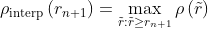

### 目标检测


#### 目标检测发展历程

对计算机而言，能够“看到”的是图像被编码之后的数字，但它很难理解高层语义概念，比如图像或者视频帧中出现的目标是人还是物体，更无法定位目标出现在图像中哪个区域。目标检测的主要目的是让计算机可以自动识别图片或者视频帧中所有目标的类别，并在该目标周围绘制边界框，标示出每个目标的位置，如 图1 所示。 


> 图1：图像分类和目标检测示意图。(a)是图像分类任务，只需识别出这是一张斑马的图片。(b)是目标检测任务，不仅要识别出这是一张斑马的图片，还要标出图中斑马的位置。

图像分类处理基本流程，先使用卷积神经网络提取图像特征，然后再用这些特征预测分类概率，最后选出概率最大的类别，即为当前图片的类别，流程如 图2 所示。


但对于目标检测问题，按照 图2 的流程则行不通。因为在图像分类任务中，对整张图提取特征的过程中没能体现出不同目标之间的区别，最终也就没法分别标示出每个物体所在的位置。

为了解决这个问题，结合图片分类任务取得的成功经验，我们可以将目标检测任务进行拆分。假设我们现在有某种方式可以在输入图片上生成一系列可能包含物体的区域，这些区域称为候选区域，在一张图上可以生成很多个候选区域。然后对每个候选区域，可以把它单独当成一幅图像来看待，使用图像分类模型对它进行分类，看它属于哪个类别或者背景（即不包含任何物体的类别）。

上一节我们学过如何解决图像分类任务，使用卷积神经网络对一幅图像进行分类不再是一件困难的事情。那么，现在问题的关键就是如何产生候选区域？比如我们可以使用穷举法来产生候选区域，如图3所示。 


A为图像上的某个像素点，B为A右下方另外一个像素点，A、B两点可以确定一个矩形框，记作AB。

- 如图（a）所示：A在图片左上角位置，B遍历除A之外的所有位置，生成矩形框A1B1, …, A1Bn, …
- 如图（b）所示：A在图片中间某个位置，B遍历A右下方所有位置，生成矩形框AkB1, …, AkBn, …

当A遍历图像上所有像素点，B则遍历它右下方所有的像素点，最终生成的矩形框集合{AiBj}将会包含图像上所有可以选择的区域。

研究员开始思考，是否可以应用传统图像算法先产生候选区域，然后再用卷积神经网络对这些区域进行分类？只要我们对每个候选区域的分类足够的准确，则一定能找到跟实际物体足够接近的区域来。穷举法也许能得到正确的预测结果，但其计算量也是非常巨大的，其所生成的总候选区域数目约为 $\frac{W^2 H^2}{4}$ ，假设H=W=100，总数将会达到 $2.5 \times 10^{7}$ 个，如此多的候选区域使得这种方法几乎没有什么实用性。但是通过这种方式，我们可以看出，假设分类任务完成的足够完美，从理论上来讲检测任务也是可以解决的，亟待解决的问题是如何设计出合适的方法来产生候选区域。需要关注两点，一个是产生候选区域的方法，另一个是提升候选区域分类效率。目标检测算法就是解决这类问题的，图4 给出了基于深度学习的目标检测算法，主要分为Anchor-Based和Anchor-Free，其中Anchor-Based方法又可以分为两阶段检测算法和单阶段检测算法。


其中，Anchor(锚框)指人为预先设定好比例的一组候选框集合。

Anchor-Based使用Anchor提取候选目标框，然后在特征图上的每一个点，对Anchor进行分类和回归。两阶段检测算法先使用Anchor在图像上产生候选区域，划分前景和背景，再对候选区域进行分类并预测目标物体位置。典型的两阶段检测算法是R-CNN系列(Fast R-CNN、Faster R-CNN等)，经典的Faster R-CNN通过RPN(Region Proposal Network)学习候选区域(Region Propposal, RP)，再对候选区域进行分类和回归，输出最终目标框和类别。基于先产生候选区域再检测的两阶段模型通常具有较优的精度，但是预测速度较慢。

此外，Anchor-Based还有一些单阶段模型，这类模型在产生候选区域的同时即可预测出物体类别和位置，不需要分成两阶段来完成检测任务。典型的单阶段算法是YOLO系列(YOLOV2、YOLOv3、YOLOv4、PP-YOLO、PP-YOLOV2等)。单阶段算法摒弃两阶段算法中的RPN产生候选区域这一步骤，将候选区域和检测两个阶段合二为一，使得网络结构更加简单，检测速度快。

但是Anchor-Based方法在实际应用中存在一些缺点，比如：手工设计Anchor需要考虑Anchor的数量、尺寸(长宽比)；在特征图上像素点密集滑动会生成的检测框会存在大量负样本区域，就需要考虑正负样本不均衡的问题；Anchor的设计导致网络超参数变多，模型学习比较困难；更换不同的数据集需要重新调整Anchor。因此研究者提出了Anchor-Free方法，不再使用预先设定Anchor，通常通过预测目标的中心或角点，对目标进行检测。包含基于中心区域预测的方法(FCOS、CenterNet等)和基于多关键点联合表达的方法(CorNert、RepPoints等)。Anchor-Free算法不再需要设计Anchor，模型更为简单，减少模型耗时，但是精度也比Anchor-Based方法精度低。


**无论使用传统方法还是深度学习的方法来完成目标检测任务，一定要遵循三个步骤：检测窗口的选择+图像特征提取+分类器设计**


#### 目标检测基础概念

- 边界框(Bounding Box, BBox) 
- 锚框(Anchor box) 
- 候选区域/框(Region Proposal, RP)
- 交并比 (IOU  )
- 非极大值抑制（NMS, Non-Maximun Suppression)
- P-R 曲线 以Precision  ReCall 为纵、横坐标的曲线
- AP （avg Precision） 某一类P-R曲线下的面积
- mAP （mean avg Precision） 所以类别AP平均
- 特定的感兴趣的区域 (Rol,  region of Interest  )
- Anchor-based的两阶段提取候选框的网络(RPN，（Region Proposal Network）  )


#### 边界框（Bounding Box，BBox）

检测任务需要同时预测物体的类别和位置，因此需要引入一些跟位置相关的概念。通常使用边界框（bounding box，bbox）来表示物体的位置，边界框是正好能包含物体的矩形框，如 图6 所示，图中3个人分别对应3个边界框。

检测任务需要同时预测物体的类别和位置，因此需要引入一些跟位置相关的概念。通常使用边界框（bounding box，bbox）来表示物体的位置，边界框是正好能包含住物体的矩形框，如图所示，图中3个人分别对应3个边界框


通常有两种格式来表示边界框的位置：

- xyxy，即(x1,y1,x2,y2)，其中(x1,y1)是矩形框左上角的坐标，(x2,y2)是矩形框右下角的坐标。图中3个红色矩形框用xyxy格式表示如下
- 左：
- 中：
- 右：

- xywh，即(x,y,w,h)，其中(x,y)是矩形框中心点的坐标，w是矩形框的宽度，h是矩形框的高度。 

在检测任务中，训练数据集的标签里会给出目标物体真实边界框所对应的

(x1,y1,x2,y2)这样的边界框也被称为真实框（ground truth box），如上图所示，图中画出了3个人像所对应的真实框。模型会对目标物体可能出现的位置进行预测，由模型预测出的边界框则称为预测框（prediction box）。

> 图片坐标的原点在左上角，x轴向右为正方向，y轴向下为正方向。

要完成一项检测任务，我们通常希望模型能够根据输入的图片，输出一些预测的边界框，以及边界框中所包含的物体的类别或者说属于某个类别的概率，例如这种格式: 

[L,P,x1,y1,x2,y2]，其中L是类别标签，P是物体属于该类别的概率

#### 锚框(Anchor box)

锚框与物体边界框不同，是由人们假想出来的一种框。先设定好锚框的大小和形状，再以图像上某一个点为中心画出矩形框。在下图中，以像素点[300, 500]为中心可以使用下面的程序生成3个框，如图中蓝色框所示，其中锚框A1跟人像区域非常接近。


在目标检测模型中，通常会以某种规则在图片上生成一系列锚框，将这些锚框当成可能的候选区域。模型对这些候选区域是否包含物体进行预测，如果包含目标物体，则还需要进一步预测出物体所属的类别。还有更为重要的一点是，由于锚框位置是固定的，它不大可能刚好跟物体边界框重合，所以需要在锚框的基础上进行微调以形成能准确描述物体位置的预测框，模型需要预测出微调的幅度。在训练过程中，模型通过学习不断的调整参数，最终能学会如何判别出锚框所代表的候选区域是否包含物体，如果包含物体的话，物体属于哪个类别，以及物体边界框相对于锚框位置需要调整的幅度。

Anchors（锚点/锚框）指由一组矩阵，每个矩阵对应不同的检测尺度大小。如下矩阵：

```
[[ -84.  -40.  99.  55.]
 [-176.  -88. 191. 103.]
 [-360. -184. 375. 199.]
 [ -56.  -56.  71.  71.]
 [-120. -120. 135. 135.]
 [-248. -248. 263. 263.]
 [ -36.  -80.  51.  95.]
 [ -80. -168.  95. 183.]
 [-168. -344. 183. 359.]]
```
其中每行4个值（x1,y1,x2,y2 ），对应矩形框左上角、右下角相对于中心点的偏移量。9个矩形共有三种形状，即1:1, 1:2, 2:1，即进行多尺度检测。


例如，一张800x600的原始图片，经过VGG下采样后(生成特征矩阵)16倍大小，大小变为50x38，每个点设置9个anchor，则总数为：

`ceil(800 / 16) * ceil(600 / 16) * 9 = 50 * 38 * 9 = 17100`


#### 候选区域

 候选区域（Region proposal），就是预先找出图中目标可能出现的位置，通过利用图像中的纹理、边缘、颜色等信息，保证在选取较少窗口的情况下保持较高的召回率。

 Region Proposal方法比传统的滑动窗口方法获取的质量要更高。比较常用的Region Proposal方法有：SelectiveSearch(SS，选择性搜索)、Edge Boxes（EB）

其实物体候选框获取当前主要使用图像分割与区域生长技术。区域生长(合并)主要由于检测图像中存在的物体具有局部区域相似性(颜色、纹理等)。目标识别与图像分割技术的发展进一步推动有效提取图像中信息。滑窗法作为一种经典的物体检测方法，不同大小的窗口在图像上进行滑动时候，进行卷积运算后的结果与已经训练好的分类器判别存在物体的概率。选择性搜索(Selective Search)是主要运用图像分割技术来进行物体检测。

**滑动窗口**

通过滑窗法流程图可以很清晰理解其主要思路：首先对输入图像进行不同窗口大小的滑窗进行从左往右、从上到下的滑动。每次滑动时候对当前窗口执行分类器(分类器是事先训练好的)。如果当前窗口得到较高的分类概率，则认为检测到了物体。对每个不同窗口大小的滑窗都进行检测后，会得到不同窗口检测到的物体标记，这些窗口大小会存在重复较高的部分，最后采用非极大值抑制(Non-Maximum Suppression, NMS)的方法进行筛选。最终，经过NMS筛选后获得检测到的物体。 滑窗法简单易于理解，但是不同窗口大小进行图像全局搜索导致效率低下，而且设计窗口大小时候还需要考虑物体的长宽比。所以，对于实时性要求较高的分类器，不推荐使用滑窗法。

**选择性搜索**

滑窗法类似穷举进行图像子区域搜索，但是一般情况下图像中大部分子区域是没有物体的。学者们自然而然想到只对图像中最有可能包含物体的区域进行搜索以此来提高计算效率。选择搜索（selective search，简称SS）方法是当下最为熟知的图像bounding boxes提取算法，由Koen E.A于2011年提出。 选择搜索算法的主要思想：图像中物体可能存在的区域应该是有某些相似性或者连续性区域的。因此，选择搜索基于上面这一想法采用子区域合并的方法进行提取bounding boxes。首先，对输入图像进行分割算法产生许多小的子区域。其次，根据这些子区域之间相似性(相似性标准主要有颜色、纹理、大小等等)进行区域合并，不断的进行区域迭代合并。每次迭代过程中对这些合并的子区域做bounding boxes(外切矩形)，这些子区域外切矩形就是通常所说的候选框。

选择搜索流程

    step0：生成区域集R
    step1：计算区域集R里每个相邻区域的相似度S={s1, s2,…}
    step2：找出相似度最高的两个区域，将其合并为新集，添加进R
    step3：从S中移除所有与step2中有关的子集
    step4：计算新集与所有子集的相似度
    step5：跳至step2，直至S为空

选择搜索优点

    计算效率优于滑窗法
    由于采用子区域合并策略，所以可以包含各种大小的疑似物体框
    合并区域相似的指标多样性，提高了检测物体的概率


#### 交并比

（300，500）为中心，生成的三个锚框，我们可以看到锚框A1 与真实框 G1的重合度比较好。那么如何衡量这三个锚框跟真实框之间的关系呢，在检测任务中是使用交并比（Intersection of Union，IoU）作为衡量指标。这一概念来源于数学中的集合，用来描述两个集合A和B之间的关系，它等于两个集合的交集里面所包含的元素个数，除以它们的并集里面所包含的元素个数，具体计算公式如下


我们将用这个概念来描述两个框之间的重合度。两个框可以看成是两个像素的集合，它们的交并比等于两个框重合部分的面积除以它们合并起来的面积。下图a中红色区域是两个框的重合面积，图b中蓝色区域是两个框的相并面积。用这两个面积相除即可得到它们之间的交并比，如图所示


```python
    # 计算IoU，矩形框的坐标形式为xyxy，这个函数会被保存在box_utils.py文件中
    def box_iou_xyxy(box1, box2):
        # 获取box1左上角和右下角的坐标
        x1min, y1min, x1max, y1max = box1[0], box1[1], box1[2], box1[3]
        # 计算box1的面积
        s1 = (y1max - y1min + 1.) * (x1max - x1min + 1.)
        # 获取box2左上角和右下角的坐标
        x2min, y2min, x2max, y2max = box2[0], box2[1], box2[2], box2[3]
        # 计算box2的面积
        s2 = (y2max - y2min + 1.) * (x2max - x2min + 1.)
        # 计算相交矩形框的坐标
        xmin = np.maximum(x1min, x2min)
        ymin = np.maximum(y1min, y2min)
        xmax = np.minimum(x1max, x2max)
        ymax = np.minimum(y1max, y2max)
        # 计算相交矩形行的高度、宽度、面积
        inter_h = np.maximum(ymax - ymin + 1., 0.)
        inter_w = np.maximum(xmax - xmin + 1., 0.)
        intersection = inter_h * inter_w
        # 计算相并面积
        union = s1 + s2 - intersection
        # 计算交并比
        iou = intersection / union
        return iou
    bbox1 = [100., 100., 200., 200.]
    bbox2 = [120., 120., 220., 220.]
    iou = box_iou_xyxy(bbox1, bbox2)
    print('IoU is {}'.format(iou))  
```

```python

    # 计算IoU，矩形框的坐标形式为xywh
    def box_iou_xywh(box1, box2):
        x1min, y1min = box1[0] - box1[2]/2.0, box1[1] - box1[3]/2.0
        x1max, y1max = box1[0] + box1[2]/2.0, box1[1] + box1[3]/2.0
        s1 = box1[2] * box1[3]
        x2min, y2min = box2[0] - box2[2]/2.0, box2[1] - box2[3]/2.0
        x2max, y2max = box2[0] + box2[2]/2.0, box2[1] + box2[3]/2.0
        s2 = box2[2] * box2[3]
        xmin = np.maximum(x1min, x2min)
        ymin = np.maximum(y1min, y2min)
        xmax = np.minimum(x1max, x2max)
        ymax = np.minimum(y1max, y2max)
        inter_h = np.maximum(ymax - ymin, 0.)
        inter_w = np.maximum(xmax - xmin, 0.)
        intersection = inter_h * inter_w
        union = s1 + s2 - intersection
        iou = intersection / union
        return iou
```
为了直观的展示交并比的大小跟重合程度之间的关系，图示意了不同交并比下两个框之间的相对位置关系，从 IoU = 0.95 到 IoU = 0.


#### 非极大值抑制

在目标检测过程中，网络对同一个目标可能会产生多个预测框。因此需要消除重叠较大的冗余预测框。具体的处理方法就是非极大值抑制（Non-maximum suppression，NMS）。

预测结果中，可能多个预测结果间存在重叠部分，需要保留交并比最大的、去掉非最大的预测结果，这就是非极大值抑制（Non-Maximum Suppression，简写作NMS）。如下图所示，对同一个物体预测结果包含三个概率0.8/0.9/0.95，经过非极大值抑制后，仅保留概率最大的预测结果。


NMS基本思想是，如果有多个预测框都对应同一个物体，则只选出得分最高的那个预测框，剩下的预测框被丢弃掉。

如何判断两个预测框对应的是同一个物体呢，标准该怎么设置？

如果两个预测框的类别一样，而且他们的位置重合度比较大，则可以认为他们是在预测同一个目标。非极大值抑制的做法是，选出某个类别得分最高的预测框，然后看哪些预测框跟它的IoU大于阈值，就把这些预测框给丢弃掉。这里IoU的阈值是超参数，需要提前设置，YOLOv3模型里面设置的是0.5。


- Step0：创建选中列表，keep_list = []
- Step1：对得分进行排序，remain_list = [ 3, 5, 10, 2, 9, 0, 1, 6, 4, 7, 8]，
- Step2：选出boxes[3]，此时keep_list为空，不需要计算IoU，直接将其放入keep_list，keep_list = [3]， remain_list=[5, 10, 2, 9, 0, 1, 6, 4, 7, 8]
- Step3：选出boxes[5]，此时keep_list中已经存在boxes[3]，计算出IoU(boxes[3], boxes[5]) = 0.0，显然小于阈值，则keep_list=[3, 5], remain_list = [10, 2, 9, 0, 1, 6, 4, 7, 8]
- Step4：选出boxes[10]，此时keep_list=[3, 5]，计算IoU(boxes[3], boxes[10])=0.0268，IoU(boxes[5], boxes[10])=0.0268 = 0.24，都小于阈值，则keep_list = [3, 5, 10]，remain_list=[2, 9, 0, 1, 6, 4, 7, 8]
- Step5：选出boxes[2]，此时keep_list = [3, 5, 10]，计算IoU(boxes[3], boxes[2]) = 0.88，超过了阈值，直接将boxes[2]丢弃，keep_list=[3, 5, 10]，remain_list=[9, 0, 1, 6, 4, 7, 8]
- Step6：选出boxes[9]，此时keep_list = [3, 5, 10]，计算IoU(boxes[3], boxes[9]) = 0.0577，IoU(boxes[5], boxes[9]) = 0.205，IoU(boxes[10], boxes[9]) = 0.88，超过了阈值，将boxes[9]丢弃掉。keep_list=[3, 5, 10]，remain_list=[0, 1, 6, 4, 7, 8]
- Step7：重复上述Step6直到remain_list为空。

最终得到keep_list=[3, 5, 10]，也就是预测框3、5、10被最终挑选出来了


#### PR曲线

Precision（准确率/查准率P）（TP/（TP+FP））和Recall（召回率/查全率R ） （TP/（TP+FN））

> F 值 —— 准确率 * 召回率 * 2 / 准确率 + 召回率）（F值即为准确率和召回率的调和平均值）

一般来说，P和R是不可兼得的，召回率越高，准确率越低。

TP：实际为正，且被预测为正的实例
FP：实际为负，但被预测为正的实例
TN：实际为负，且被预测为负的实例
FN：实际为正，但被预测为负的实例


PR曲线的评估方法

1.若曲线a完全“包住”曲线b，则a性能优于b。
2.若曲线a和曲线b发生了相交，则无法比较。
3.比较曲线a和曲线b曲线下面积的大小。面积大则性能优。
4.比较“平衡点”。用的较少。  “平衡点”（Break-Event Point，简称BEP）时P值和R值相同的时的取值。


计算 mAP

- PASCAL VOC
    - 11点插值法：Recall值为离散的11个点[0, 0.1, ..., 1]；对每一个点，在 PR图上向右找最大的Precision值，找到11个对应的Precision值，加和求平均即为AP。
    - all点插值法：Recall值为[0, 1]区间内的所有点；对每个点，在 PR图上向右找最大的Precision值，找到无穷个对应的Precision值，对其求定积分即为AP，即近似为PR曲线下的面积。
- COCO
    - 101点插值法：COCO使用101点插值法进行计算。

**Average Precision**

比较目标检测器性能的另一种方法是计算Precision x Recall曲线的曲线下面积（AUC）。由于AP曲线通常是上下弯曲的锯齿形曲线，因此比较同一图中的不同曲线（不同的检测器）通常不是一件容易的事-因为这些曲线往往会频繁地相互交叉。这就是为什么数字精度平均精度（AP）也可以帮助我们比较不同检测器的原因。实际上，AP是在0到1之间的所有召回值上平均的精度。

从2010年开始，通过PASCAL VOC挑战计算AP的方法已经改变。目前，由PASCAL VOC挑战执行的插值使用所有数据点，而不是如其论文所述仅插值11个等距点。

- 11-point interpolation

11点插值法尝试通过在一组11个等间隔的召回级别[0, 0.1, 0.2, ... , 1]上求平均精度来总结Precision x Recall曲线的形状


其中


其中 $p(\overset{\sim} r)$ 是在召回值为 $\overset{\sim} r$时的测量精度。

AP不是使用在每个点上观察到的精度，而是通过只在11个级别 $\overset{\sim} r$ 上插值精度来获得，取召回值大于 $\overset{\sim} r$ 的最大精度。

- Interpolating all points

不仅可以在等距的11个点进行插值，还可以通过以下方式对所有点进行插值：


其中



其中 $p(\overset{\sim} r)$ 是在召回值为 $\overset{\sim} r$时的测量精度。

在这种情况下，AP不再使用仅在几个点上观察到的精度，而是通过插值每个级别r的精度来获得，取召回值大于或等于r+1的最大精度。这样我们就可以计算出曲线下的估计面积。

如下例子

一个例子有助于我们更好地理解插值平均精度的概念。考虑以下检测：


一共有7幅图像，其中15个gt值对象由绿色边界框表示，24个检测对象由红色边界框表示。每个检测到的对象都有一个置信水平，并由字母（A，B，…，Y）标识。

下表显示了具有相应置信度的边界框。最后一列将检测标识为TP或FP。在本例中，如果IOU >= 30%，则认为是TP，否则是FP。通过查看上面的图像，我们可以大致判断检测到的是TP还是FP。


在一些图像中，有多个检测重叠于一个基础真值（图2、3、4、5、6和7）。对于这些情况，第一个检测被认为是TP，而其他检测被认为是FP。该规则适用于PASCAL VOC 2012度量：“例如，单个对象的5次检测（TP）被计算为1次正确检测和4次错误检测”。

Precision x Recall曲线是通过计算累积TP或FP检测的Precision和Recall值来绘制的。为此，我们首先需要对检测进行置信度排序，然后计算每个累积检测的精度和召回率，如下表所示：


