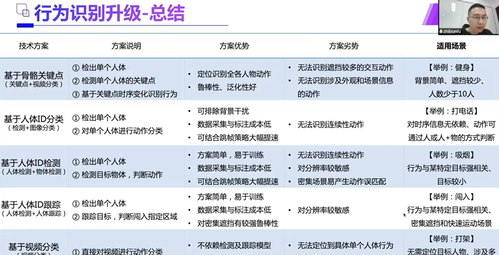

### AnchorFree系列算法介绍和实践

#### CornerNet - 基于关键点的Anchor Free 检测算法


#### FCOS - 基于中心的Anchor Free 检测算法


#### CenterNet - 基于中心的Anchor Free 检测算法


#### TTFNet


#### PP-YOLOE (2022-03-30)

**简介**

PaddleDetection团队提供了针对VisDrone-DET、DOTA水平框、Xview等小目标场景数据集的基于PP-YOLOE的检测模型，以及提供了一套使用SAHI(Slicing Aided Hyper Inference)工具切图和拼图的方案，用户可以下载模型进行使用。

**算法概述**

基于PP-YOLOv2进行改进，PP-YOLOE是一个anchor-free算法(受到YOLOX算法影响)，用了更强的backbone，带CSPRepResStage的neck和ET-head，并且利用了TAL标签分配算法。为了更好的适配各种硬件平台，PP-YOLOE避免使用可变形卷积和Matrix NMS，而且PP-YOLOE提供s/m/l/x四个版本的网络模型以适应各个平台应用。PP-YOLOE-l在Tesla V100平台上实现了COCO test-dev集51.4%mAP和78.1FPS。若是将模型转换为TensorRT并且以FP16精度进行推理，可实现149.2FPS。与现如今最新算法的对比情况如下图所示：


PP-YOLOE的整个网络框架如下所示，整个算法是anchor-free的，主干部分为CSPRepResNet，neck部分为PAN，head部分为ET-head(Efficient Task-aligned head)。


- Anchor-free： 受到FCOS算法的启发，PP-YOLOE将PP-YOLOv2的标签匹配规则替换为了anchor-free，这种改进使得模型更快但是掉了0.3%mAP。
- Backbone和Neck： 受到YOLOv5和YOLOX等网络借鉴CSPNet带来的提升效果，作者也在backbone和neck中应用了RepResBlock (其中激活函数为Swish)。其结构如下图所示：


图(a)是TreeNet中的TreeBlock结构，图(b)是本文中RepResBlock在训练阶段的结构，图©是RepResBlock在推理阶段的结构，即该模块被重参数化后的样子，这来源于RepVGG，图(d)是CSPRepResStage的结构,将CSP与RepResBlock结合就是CSPRepResStage,作者将其应用在Backbone中，neck部分是RepResBlock和CSPRepResStage混合用的。 除此之外，作者根据网络宽度和深度设置不同比例得到不同规模的网络结构s/m/l/x，如下表：


**CSPRepResStage 种eSE模块**

EffectiveSELayer （Effective Squeeze-Excitation） 有效挤压增强

Effective Squeeze-Excitation（eSE）是一种改进的通道注意力模块，旨在减少计算复杂性和信息丢失。eSE基于原始的Squeeze-Excitation（SE）模块，但通过一些关键改进来提高效率。

基本原理
SE模块的核心思想是通过建模特征图通道之间的相互依赖性来增强模型的表现。SE模块的主要步骤包括：

- ?Squeeze?操作：通过全局平均池化将每个通道的空间信息压缩成一个值，获得一个包含所有通道全局信息的特征向量。
- ?Excitation?操作：通过两个全连接层来预测每个通道的重要性权重，并通过ReLU激活函数和Sigmoid激活函数得到每个通道的权重，这些权重反映了通道的重要性?


eSE的主要改进在于减少计算复杂性和信息丢失：

- ?单层全连接层?：eSE使用一个全连接层代替SE模块中的两个全连接层，从而减少了计算复杂性和信息丢失?
- ?残差连接?：在VoVNetV2骨干网络中，eSE通过残差连接缓解了大网络的优化问题?

```
    def __init__(self, channels, act='hardsigmoid'):
        super(EffectiveSELayer, self).__init__()
        self.fc = nn.Conv2D(channels, channels, kernel_size=1, padding=0)
        self.act = get_act_fn(act) if act is None or isinstance(act, (
            str, dict)) else act

    def forward(self, x):
        x_se = x.mean((2, 3), keepdim=True)  # adaptive_avg_pool = paddle.nn.AdaptiveAvgPool2D(output_size=1)全局池化
        x_se = self.fc(x_se)  # 全连接 即每个通道的权重
        return x * self.act(x_se) # 每个通道的值，乘以对应的权重
```


**任务一致性学习(Task Alignment Learning, TAL)：**  YOLOX采用SimOTA来作为标签分配策略，为了进一步克服分类与定位的错位，TOOD提出了任务一致性学习(TAL)，它由动态标签分配和任务对齐损失组成的。多态标签分配意味着预测和当前损失是相关的，根据预测，为每个真值标签动态调整分配的正锚点个数。 通过显式地对齐这两个任务，TAL可以同时获得最高的分类分数和最精确的边界框。TAL示意图如下(图片来自TOOD论文)：


**ATSS**

通过自适应训练样本选择弥合基于锚点和无锚点检测之间的距离

1、计算gt和anchor之间的IOU
2、计算所有anchor与gt之间的中心距离
3、在每个金字塔级别上，根据中心距离选择最接近的topk候选对象
4、得到这些候选者对应的iou，并计算mean和std,
5、将mean + std 设置为iou阈值
6、在gt中检查阳性样品的中心（选择正样本）
7、如果一个achor分配给多个gts，则将选择iou最高


**TaskAlignedAssigner**

为每个bbox分配相应的gt bbox或背景
- 0:负样本，未分配gt
- 正整数:指定gt的正样本

1. 计算所有bbox(所有金字塔级别的bbox)和gt之间的对齐度量
2. 选择top-k bbox作为每个gt的候选项
3. 将阳性样品的中心限制在gt(因为无锚检测器只能预测正距离)
4. 如果一个锚框被分配给多个gts，则具有
最高的分数将被选中。


1、对齐分数计算，得到实际目标类别标签gt_labels在所有预测类别分数pred_labels中对应的分数s，计算目标位置标签gt_bboxes和所有位置预测信息pred_bboxes的CIoU值（这里用的IOU）

```math

  t = s^α + u^β
```
其中α和β是超参数 （分别是1和6）

2、初筛正样本，选取中心点在gt_bboxes内的预测点作为正样本匹配位置；
3、精选正样本，根据对齐分数t在初步筛选的正样本中进一步选取topk个预测点作为正样本匹配位置；
4、过滤正样本，若一个预测点匹配到多个gt_bboxs，则选取具有最大CIoU的gt作为该预测点匹配的正样本；


**高效的任务一致检测头(Efficient Task-aligned Head, ET-head)：**  YOLOX的方法，解耦头部提升了检测器性能，但解耦的头部可能会使分类和定位任务分离和独立，缺乏针对任务的学习。作者使用ESE模块来代替TOOD中的层注意力，TOOD论文提出的T-Head结构如下所示，详细结构见上面PP-YOLOE网络细节。


**Generalized Focal Loss**

中心点就是通过meshgrid(range(feature_width), range(feature_height))*stride得到的从特征图映射到输入图像尺度中的点，而(left,top,right,bottom)的预测作者使用的是Generalized Focal Loss(GFL)中提出的离散化回归的方法。

Generalized Focal Loss(GFL)是南开大学的李翔 (opens new window)在2020年6月发表的论文中提出的。该方法是离散化检测框回归的范围，选取range(0, reg_max+1)上的离散值作为回归目标，reg_max是最大回归范围。

如上选reg_max=7,则可以理解为在特征图上将检测框上下左右边距离中心的距离设置为[0,1,...,7]这8种离散值，网络输出预测的分别是上下左右边落在[0,1,..,7]上的概率，因此输入的大小为4*(reg_max+1)，为求边距中心的距离，需求落在[0,1,..7]上各点的期望，然后再利用stride将检测框映射到输入图尺寸上即可。当reg_max=7,stride=8时，对应检测框的最大尺寸为(7x8+7x8)x(7x8+7x8)=112x112,因此检测框范围可以覆盖(0-112)

**分类损失varifocal loss**

Focal loss定义:


其中a是前景背景的损失权重，p的y次是不同样本的权重，难分样本的损失权重会增大。当训练一个密集的物体检测器使连续的IACS回归时，本文从focal loss中借鉴了样本加权思想来解决类不平衡问题。但是，与focal loss同等对待正负样本的损失不同，而varifocal loss选择不对称地对待它们。varifocal loss定义如下：


其中p是预测的IACS得分，q是目标IoU分数。对于训练中的正样本，将q设置为生成的bbox和gt box之间的IoU（gt IoU），而对于训练中的负样本，所有类别的训练目标q均为0。
备注：Varifocal Loss会预测Iou-aware Cls_score（IACS）与分类两个得分，通过p的y次来有效降低负样本损失的权重，正样本选择不降低权重。此外，通过q（Iou感知得分）来对Iou高的正样本损失加大权重，相当于将训练重点放在高质量的样本上面。


#### PP-YOLOE+ (2022.08)

- 使用大规模数据集obj365预训练模型
- 在backbone中block分支中增加alpha参数
- 优化端到端推理速度，提升训练收敛速度


#### PP-YOLOE-SOD 

- SOD表示使用基于向量的DFL算法和针对小目标的中心先验优化策略，并在模型的Neck结构中加入transformer。


基于注意的尺度内特征交互（AIFI，Attention-based Intra-scale Feature Interaction，基于注意力的尺度内特征交互）:只在`$S_5$`内进行尺度内交互，可以进一步降低计算成本，将自注意力机制应用于捕捉到实体间联系的高级特征，有助于后续模块对实体的定位和识别。对缺乏语义的低级特征和高级特征的之间的尺度交互式完全没有必要的。这方法不仅能够提高计算速度，还能提高ap


1、位置编码增强

```math
X_{pe} = X + PositionalEncoding(H,W)
```

2、自注意力计算

```math
\begin{aligned}
Q &= X_{pe}W_q, \quad K = X_{pe}W_k, \quad V = X_{pe}W_v \\
\text{Attention} &= \text{Softmax}\left(\frac{QK^T}{\sqrt{d_k}}\right)V
\end{aligned}
```
3、Add & Layer normalization

```math
X = LayerNorm(X + dropout(Attention))
```

4、特征增强

```math
X_{out} = LayerNorm(X+FFN(X))
```
> https://www.cnblogs.com/qian-li-xju/articles/18448554

#### pp-human





