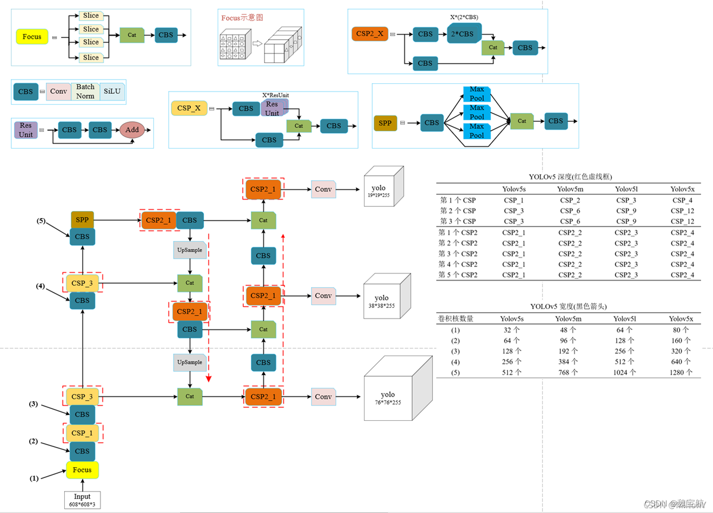
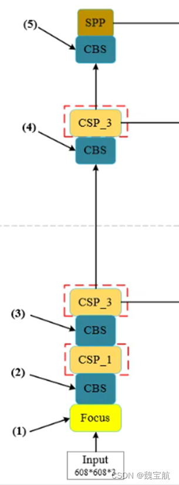

#### Yolov5

**数据处理**

- Mosaic(马赛克数据增强和透视)数据增强。Yolov5的输入端采用了和Yolov4一样的Mosaic数据增强的方式
- HSV 增强：随机改变图像的色调、饱和度和值
- 随机水平翻转一种水平随机翻转图像的增强方法


**自适应锚框计算**

在Yolo算法中，针对不同的数据集，都会有初始设定长宽的锚框。

在网络训练中，网络在初始锚框的基础上输出预测框，进而和真实框groundtruth进行比对，计算两者差距，再反向更新，迭代网络参数。

```
  anchors: [[10, 13], [16, 30], [33, 23],
            [30, 61], [62, 45], [59, 119],
            [116, 90], [156, 198], [373, 326]]
```


**架构图**





**backbone**
主干网络 CSPDarkNet (Conv、C3、SPPF) 输入[4, 3, 640, 640] 返回其特征映射的阶段的索引 [2, 3, 4]
在最新的YOLOv5中，使用stem Conv和SPPF(快速，只有单个spp内核大小)

