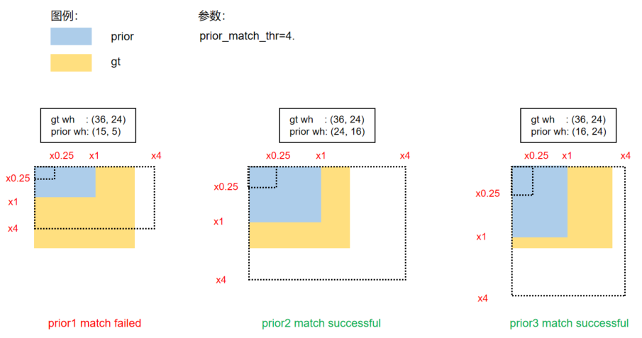

### Yolov5 （2021）

> 没有特殊说明情况下，本文默认描述的是 P5 模型。

**数据处理**

- Mosaic(马赛克数据增强和透视)数据增强。Yolov5的输入端采用了和Yolov4一样的Mosaic数据增强的方式

  其中 Mosaic 数据增强概率为 1，表示一定会触发，而对于 small 和 nano 两个版本的模型不使用 MixUp，其他的 l/m/x 系列模型则采用了 0.1 的概率触发 MixUp。小模型能力有限，一般不会采用 MixUp 等强数据增强策略。

- HSV 增强：随机改变图像的色调、饱和度和值
- 随机水平翻转一种水平随机翻转图像的增强方法


**自适应锚框计算**

在Yolo算法中，针对不同的数据集，都会有初始设定长宽的锚框。

在网络训练中，网络在初始锚框的基础上输出预测框，进而和真实框groundtruth进行比对，计算两者差距，再反向更新，迭代网络参数。

```
  anchors: [[10, 13], [16, 30], [33, 23],
            [30, 61], [62, 45], [59, 119],
            [116, 90], [156, 198], [373, 326]]  # w,h
```

**SiLU 激活函数**

‌SiLU（Sigmoid Linear Unit）激活函数是一种结合了Sigmoid和线性变换的平滑非线性函数，其公式为SiLU(x)=x⋅σ(x)，其中σ(x)是Sigmoid函数。‌它被广泛应用于深度学习模型（如YOLOv5）中，因其平滑性、可微性和对负值的非零响应优于ReLU等传统激活函数


**架构图**

YOLOv5-P5模型: 3个输出层P3， P4， P5在步长(缩放倍数)8,16,32。输入尺寸为640


<center>图 1：YOLOv5-l-P5 模型结构</center> 
<br>

YOLOv5-P6大尺度模型：4个输出层P3、P4、P5、P6，步长8,16,32,64。输入尺寸为1280


<p align="center">图 2：YOLOv5-l-P6 模型结构</p> 

如图 1 和 2 所示，YOLOv5 的 P5 和 P6 版本主要差异在于网络结构和图片输入分辨率。其他区别，如 anchors 个数和 loss 权重可详见配置文件。


**backbone**
主干网络 CSPDarkNet (Conv、C3、SPPF) 输入[4, 3, 640, 640] 返回其特征映射的阶段的索引 [2, 3, 4]


在最新的YOLOv5中(p5/p6)

- Stem Layer 是 1 个 （k=6, s=2, p=2） 的 ConvModule，相较于 v6.1 版本之前的 Focus 模块更加高效
- 新的SPPF(快速PPF。只有单个spp内核大小)层取代SPP层以减少操作
- 将P3骨干层C3重复次数从9次减少到6次，以提高速度
- 重新排序将SPPF置于主干的末端
- 在最后的C3骨干层重新引入shortcut 

YOLOv5 网络结构大小由 deepen_factor(depth_mult) 和 widen_factor(width_mult) 两个参数决定。其中 deepen_factor 控制网络结构深度，即 CSPLayer 中 DarknetBottleneck 模块堆叠的数量；widen_factor 控制网络结构宽度，即模块输出特征图的通道数。以 YOLOv5-l 为例，其 deepen_factor = widen_factor = 1.0 。P5 和 P6 的模型整体结构分别如图 1 和图 2 所示


- 除了最后一个 Stage Layer，其他均由 1 个 ConvModule 和 1 个 CSPLayer 组成。如上图 Details 部分所示。 其中 ConvModule 为 3x3的 Conv2d + BatchNorm + SiLU 激活函数。CSPLayer 即 YOLOv5 官方仓库中的 C3 模块，由 3 个 ConvModule + n 个 DarknetBottleneck(带残差连接) 组成。

- 最后一个 Stage Layer 在最后增加了 SPPF 模块。SPPF 模块是将输入串行通过多个 5x5 大小的 MaxPool2d 层，与 SPP 模块效果相同，但速度更快。

- P5 模型会在 Stage Layer 2-4 之后分别输出一个特征图进入 Neck 结构。以 640x640 输入图片为例，其输出特征为 (B,256,80,80)、(B,512,40,40) 和 (B,1024,20,20)，对应的 stride 分别为 8/16/32。

- P6 模型会在 Stage Layer 2-5 之后分别输出一个特征图进入 Neck 结构。以 1280x1280 输入图片为例，其输出特征为 (B,256,160,160)、(B,512,80,80)、(B,768,40,40) 和 (B,1024,20,20)，对应的 stride 分别为 8/16/32/64。


**neck**


CSP-PAN 

Neck 模块输出的特征图和 Backbone 完全一致。
即 
P5 模型为 (B,256,80,80)、 (B,512,40,40) 和 (B,1024,20,20)；
P6 模型为 (B,256,160,160)、(B,512,80,80)、(B,768,40,40) 和 (B,1024,20,20)


**head**

前面的 neck 依然是输出 3 个不同尺度的特征图，shape 为 (B,256,80,80)、 (B,512,40,40) 和 (B,1024,20,20)。 由于 YOLOv5 是非解耦输出，即分类和 bbox 检测等都是在同一个卷积的不同通道中完成。以 COCO 80 类为例：

- P5 模型在输入为 640x640 分辨率情况下，其 Head 模块输出的 shape 分别为 (B, 3x(4+1+80),80,80), (B, 3x(4+1+80),40,40) 和 (B, 3x(4+1+80),20,20)

- P6 模型在输入为 1280x1280 分辨率情况下，其 Head 模块输出的 shape 分别为 (B, 3x(4+1+80),160,160), (B, 3x(4+1+80),80,80), (B, 3x(4+1+80),40,40) 和 (B, 3x(4+1+80),20,20)

> 其中 3 表示 3 个 anchor，4 表示 bbox 预测分支，1 表示 obj 预测分支，80 表示 COCO 数据集类别预测分支。


#### 正负样本匹配策略


正负样本匹配策略的核心是确定预测特征图的所有位置中哪些位置应该是正样本，哪些是负样本，甚至有些是忽略样本。 匹配策略是目标检测算法的核心，一个好的匹配策略可以显著提升算法性能。

YOLOV5 的匹配策略简单总结为：**采用了 anchor 和 gt_bbox 的 shape 匹配度作为划分规则，同时引入跨邻域网格策略来增加正样本**。 其主要包括如下两个核心步骤：

- 对于任何一个输出层，抛弃了常用的基于 Max IoU 匹配的规则，而是直接采用 shape 规则匹配，也就是该 GT Bbox 和当前层的 Anchor 计算宽高比，如果宽高比例大于设定阈值，则说明该 GT Bbox 和 Anchor 匹配度不够，将该 GT Bbox 暂时丢掉，在该层预测中该 GT Bbox 对应的网格内的预测位置认为是负样本

- 对于剩下的 GT Bbox(也就是匹配上的 GT Bbox)，计算其落在哪个网格内，同时利用四舍五入规则，找出最近的两个网格，将这三个网格都认为是负责预测该 GT Bbox 的，可以粗略估计正样本数相比之前的 YOLO 系列，至少增加了三倍


**生成Anchor**
在yolo系列模型中，大多数情况下使用默认的anchor设置即可, 你也可以运行`tools/anchor_cluster.py`来得到适用于你的数据集Anchor，使用方法如下：
``` bash
python tools/anchor_cluster.py -c configs/ppyolo/ppyolo.yml -n 9 -s 608 -m v2 -i 1000
```
目前`tools/anchor_cluster.py`支持的主要参数配置如下表所示：

|    参数    |    用途    |    默认值    |    备注    |
|:------:|:------:|:------:|:------:|
| -c/--config | 模型的配置文件 | 无默认值 | 必须指定 |
| -n/--n | 聚类的簇数 | 9 | Anchor的数目 |
| -s/--size | 图片的输入尺寸 | None | 若指定，则使用指定的尺寸，如果不指定, 则尝试从配置文件中读取图片尺寸 |
|  -m/--method  |  使用的Anchor聚类方法  |  v2  |  目前只支持yolov2的聚类算法  |
|  -i/--iters  |  kmeans聚类算法的迭代次数  |  1000  | kmeans算法收敛或者达到迭代次数后终止 |

**匹配策略**

无论网络是 Anchor-based 还是 Anchor-free，**我们统一使用 prior 称呼 Anchor**


正样本匹配包含以下两步：

- **“比例”比较**

将 GT Bbox 的 WH 与 Prior 的 WH 进行“比例”比较。

```math
r_w = w_{gt} / w_{pt} \\
r_h = h_{gt} / h_{pt}  \\
r_w^{max}=max(r_w, 1/r_w)  \\
r_h^{max}=max(r_h, 1/r_h)  \\
r^{max}=max(r_w^{max}, r_h^{max})  \\
if  r_{max} < prior-match-thr:   match!
``` 

此处我们用一个 GT Bbox 与 P3 特征图的 Prior 进行匹配的案例进行讲解和图示：



prior1 匹配失败的原因是 $h\_{gt}\ /\ h\_{prior}\ =\ 4.8\ >\ priormatchthr$

- **为步骤 1 中 match 的 GT 分配对应的正样本**

依然沿用上面的例子：

GT Bbox (cx, cy, w, h) 值为 (26, 37, 36, 24)，

Prior WH 值为 [(15, 5), (24, 16), (16, 24)]，在 P3 特征图上，stride 为 8。通过计算，prior2 和 prior3 能够 match。

计算过程如下：

将 GT Bbox 的中心点坐标对应到 P3 的 grid 上

```math
GT_x^{center\_grid}=26/8=3.25  
```
```math
GT_y^{center\_grid}=37/8=4.625
```


将 GT Bbox 中心点所在的 grid 分成四个象限，由于中心点落在了左下角的象限当中，那么会将物体的左、下两个 grid 也认为是正样本


下图展示中心点落到不同位置时的正样本分配情况：


那么 YOLOv5 的 Assign 方式具体带来了哪些改进？
- 一个 GT Bbox 能够匹配多个 Prior
- 一个 GT Bbox 和一个Prior 匹配时，能分配 1-3 个正样本
- 以上策略能适度缓解目标检测中常见的正负样本不均衡问题。