### Yolov5 （2021）

> 没有特殊说明情况下，本文默认描述的是 P5 模型。

**数据处理**

- Mosaic(马赛克数据增强和透视)数据增强。Yolov5的输入端采用了和Yolov4一样的Mosaic数据增强的方式

  其中 Mosaic 数据增强概率为 1，表示一定会触发，而对于 small 和 nano 两个版本的模型不使用 MixUp，其他的 l/m/x 系列模型则采用了 0.1 的概率触发 MixUp。小模型能力有限，一般不会采用 MixUp 等强数据增强策略。

- HSV 增强：随机改变图像的色调、饱和度和值
- 随机水平翻转一种水平随机翻转图像的增强方法


**自适应锚框计算**

在Yolo算法中，针对不同的数据集，都会有初始设定长宽的锚框。

在网络训练中，网络在初始锚框的基础上输出预测框，进而和真实框groundtruth进行比对，计算两者差距，再反向更新，迭代网络参数。

```
  anchors: [[10, 13], [16, 30], [33, 23],   #  P3/8
            [30, 61], [62, 45], [59, 119],   # P4/16
            [116, 90], [156, 198], [373, 326]]  # P5/32  w,h
```

**SiLU 激活函数**

‌SiLU（Sigmoid Linear Unit）激活函数是一种结合了Sigmoid和线性变换的平滑非线性函数，其公式为SiLU(x)=x⋅σ(x)，其中σ(x)是Sigmoid函数。‌它被广泛应用于深度学习模型（如YOLOv5）中，因其平滑性、可微性和对负值的非零响应优于ReLU等传统激活函数


**架构图**

YOLOv5-P5模型: 3个输出层P3， P4， P5在步长(缩放倍数)8,16,32。输入尺寸为640


<center>图 1：YOLOv5-l-P5 模型结构</center> 
<br>

YOLOv5-P6大尺度模型：4个输出层P3、P4、P5、P6，步长8,16,32,64。输入尺寸为1280

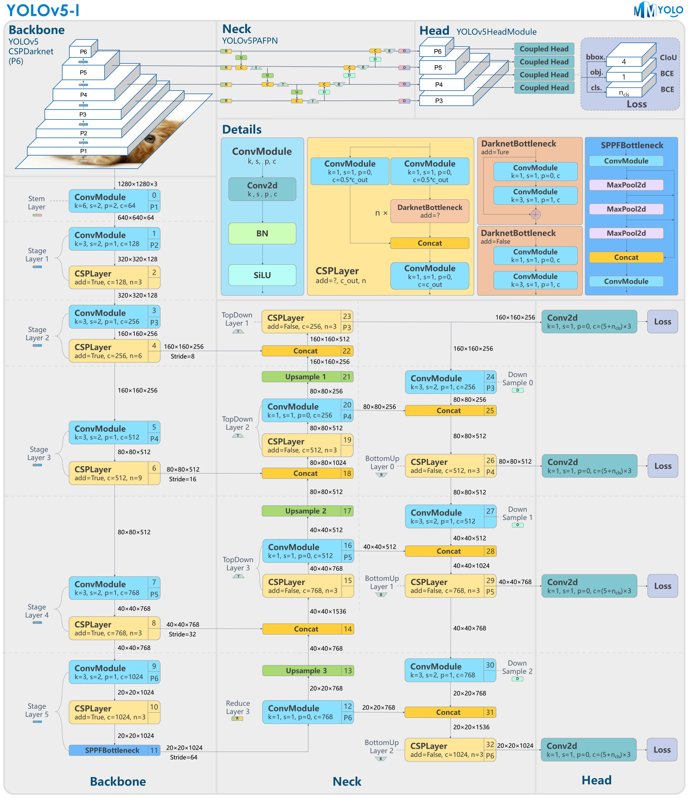
<p align="center">图 2：YOLOv5-l-P6 模型结构</p> 

如图 1 和 2 所示，YOLOv5 的 P5 和 P6 版本主要差异在于网络结构和图片输入分辨率。其他区别，如 anchors 个数和 loss 权重可详见配置文件。


**backbone**
主干网络 CSPDarkNet (Conv、C3、SPPF) 输入[4, 3, 640, 640] 返回其特征映射的阶段的索引 [2, 3, 4]


在最新的YOLOv5中(p5/p6)

- Stem Layer 是 1 个 （k=6, s=2, p=2） 的 ConvModule，相较于 v6.1 版本之前的 Focus 模块更加高效
- 新的SPPF(快速PPF。只有单个spp内核大小)层取代SPP层以减少操作
- 将P3骨干层C3重复次数从9次减少到6次，以提高速度
- 重新排序将SPPF置于主干的末端
- 在最后的C3骨干层重新引入shortcut 

YOLOv5 网络结构大小由 deepen_factor(depth_mult) 和 widen_factor(width_mult) 两个参数决定。其中 deepen_factor 控制网络结构深度，即 CSPLayer 中 DarknetBottleneck 模块堆叠的数量；widen_factor 控制网络结构宽度，即模块输出特征图的通道数。以 YOLOv5-l 为例，其 deepen_factor = widen_factor = 1.0 。P5 和 P6 的模型整体结构分别如图 1 和图 2 所示


- 除了最后一个 Stage Layer，其他均由 1 个 ConvModule 和 1 个 CSPLayer 组成。如上图 Details 部分所示。 其中 ConvModule 为 3x3的 Conv2d + BatchNorm + SiLU 激活函数。CSPLayer 即 YOLOv5 官方仓库中的 C3 模块，由 3 个 ConvModule + n 个 DarknetBottleneck(带残差连接) 组成。

- 最后一个 Stage Layer 在最后增加了 SPPF 模块。SPPF 模块是将输入串行通过多个 5x5 大小的 MaxPool2d 层，与 SPP 模块效果相同，但速度更快。

- P5 模型会在 Stage Layer 2-4 之后分别输出一个特征图进入 Neck 结构。以 640x640 输入图片为例，其输出特征为 (B,256,80,80)、(B,512,40,40) 和 (B,1024,20,20)，对应的 stride 分别为 8/16/32。

- P6 模型会在 Stage Layer 2-5 之后分别输出一个特征图进入 Neck 结构。以 1280x1280 输入图片为例，其输出特征为 (B,256,160,160)、(B,512,80,80)、(B,768,40,40) 和 (B,1024,20,20)，对应的 stride 分别为 8/16/32/64。


**neck**


CSP-PAN 

Neck 模块输出的特征图和 Backbone 完全一致。
即 
P5 模型为 (B,256,80,80)、 (B,512,40,40) 和 (B,1024,20,20)；
P6 模型为 (B,256,160,160)、(B,512,80,80)、(B,768,40,40) 和 (B,1024,20,20)


**head**

前面的 neck 依然是输出 3 个不同尺度的特征图，shape 为 (B,256,80,80)、 (B,512,40,40) 和 (B,1024,20,20)。 由于 YOLOv5 是非解耦输出，即分类和 bbox 检测等都是在同一个卷积的不同通道中完成。以 COCO 80 类为例：

- P5 模型在输入为 640x640 分辨率情况下，其 Head 模块输出的 shape 分别为 (B, 3x(4+1+80),80,80), (B, 3x(4+1+80),40,40) 和 (B, 3x(4+1+80),20,20)

- P6 模型在输入为 1280x1280 分辨率情况下，其 Head 模块输出的 shape 分别为 (B, 3x(4+1+80),160,160), (B, 3x(4+1+80),80,80), (B, 3x(4+1+80),40,40) 和 (B, 3x(4+1+80),20,20)

> 其中 3 表示 3 个 anchor，4 表示 bbox 预测分支，1 表示 obj 预测分支，80 表示 COCO 数据集类别预测分支。


#### 正负样本匹配策略


正负样本匹配策略的核心是确定预测特征图的所有位置中哪些位置应该是正样本，哪些是负样本，甚至有些是忽略样本。 匹配策略是目标检测算法的核心，一个好的匹配策略可以显著提升算法性能。

YOLOV5 的匹配策略简单总结为：**采用了 anchor 和 gt_bbox 的 shape 匹配度作为划分规则，同时引入跨邻域网格策略来增加正样本**。 其主要包括如下两个核心步骤：

- 对于任何一个输出层，抛弃了常用的基于 Max IoU 匹配的规则，而是直接采用 shape 规则匹配，也就是该 GT Bbox 和当前层的 Anchor 计算宽高比，如果宽高比例大于设定阈值，则说明该 GT Bbox 和 Anchor 匹配度不够，将该 GT Bbox 暂时丢掉，在该层预测中该 GT Bbox 对应的网格内的预测位置认为是负样本

- 对于剩下的 GT Bbox(也就是匹配上的 GT Bbox)，计算其落在哪个网格内，同时利用四舍五入规则，找出最近的两个网格，将这三个网格都认为是负责预测该 GT Bbox 的，可以粗略估计正样本数相比之前的 YOLO 系列，至少增加了三倍


**生成Anchor**
在yolo系列模型中，大多数情况下使用默认的anchor设置即可, 你也可以运行`tools/anchor_cluster.py`来得到适用于你的数据集Anchor，使用方法如下：
``` bash
python tools/anchor_cluster.py -c configs/ppyolo/ppyolo.yml -n 9 -s 608 -m v2 -i 1000
```
目前`tools/anchor_cluster.py`支持的主要参数配置如下表所示：

|    参数    |    用途    |    默认值    |    备注    |
|:------:|:------:|:------:|:------:|
| -c/--config | 模型的配置文件 | 无默认值 | 必须指定 |
| -n/--n | 聚类的簇数 | 9 | Anchor的数目 |
| -s/--size | 图片的输入尺寸 | None | 若指定，则使用指定的尺寸，如果不指定, 则尝试从配置文件中读取图片尺寸 |
|  -m/--method  |  使用的Anchor聚类方法  |  v2  |  目前只支持yolov2的聚类算法  |
|  -i/--iters  |  kmeans聚类算法的迭代次数  |  1000  | kmeans算法收敛或者达到迭代次数后终止 |

**Bbox 编解码过程**

在 Anchor-based 算法中，预测框通常会基于 Anchor 进行变换，然后预测变换量，这对应 GT Bbox 编码过程，而在预测后需要进行 Pred Bbox 解码，还原为真实尺度的 Bbox，这对应 Pred Bbox 解码过程。

在 YOLOv3 中，回归公式为:

```math
\begin{split}b_x=\sigma(t_x)+c_x  \\
b_y=\sigma(t_y)+c_y  \\
b_w=a_w\cdot e^{t_w} \\
b_h=a_h\cdot e^{t_h} \\\end{split}
```

> $a_w$ 代表 Anchor 的宽度, $c_x$ 代表 Grid 所处的坐标, $\sigma$ 代表 Sigmoid 公式。

而在 YOLOv5 中，回归公式为:

```math
\begin{split}b_x=(2\cdot\sigma(t_x)-0.5)+c_x   \\
b_y=(2\cdot\sigma(t_y)-0.5)+c_y   \\
b_w=a_w\cdot(2\cdot\sigma(t_w))^2   \\
b_h=a_h\cdot(2\cdot\sigma(t_h))^2\end{split}
```

改进之处主要有以下两点
- 中心点坐标范围从 (0, 1) 调整至 (-0.5, 1.5)
- 宽高范围从 $(0，+\infty)$  调整至 $(0，4a_{wh})$

这个改进具有以下好处：

新的中心点设置能更好的预测到 0 和 1。这有助于更精准回归出 box 坐标


宽高回归公式中 exp(x) 是无界的，这会导致梯度失去控制，造成训练不稳定。YOLOv5 中改进后的宽高回归公式优化了此问题。


**匹配策略**

无论网络是 Anchor-based 还是 Anchor-free，**我们统一使用 prior 称呼 Anchor**


正样本匹配包含以下两步：

- **“比例”比较**

将 GT Bbox 的 WH 与 Prior 的 WH 进行“比例”比较。

```math
r_w = w_{gt} / w_{pt} \\
r_h = h_{gt} / h_{pt}  \\
r_w^{max}=max(r_w, 1/r_w)  \\
r_h^{max}=max(r_h, 1/r_h)  \\
r^{max}=max(r_w^{max}, r_h^{max})  \\
if  r_{max} < prior-match-thr:   match!
``` 

此处我们用一个 GT Bbox 与 P3 特征图的 Prior 进行匹配的案例进行讲解和图示：


prior1 匹配失败的原因是 $h\_{gt}\ /\ h\_{prior}\ =\ 4.8\ >\ priormatchthr$

- **为步骤 1 中 match 的 GT 分配对应的正样本**

依然沿用上面的例子：

GT Bbox (cx, cy, w, h) 值为 (26, 37, 36, 24)，

Prior WH 值为 [(15, 5), (24, 16), (16, 24)]，在 P3 特征图上，stride 为 8。通过计算，prior2 和 prior3 能够 match。

计算过程如下：

将 GT Bbox 的中心点坐标对应到 P3 的 grid 上

```math
GT_x^{center\_grid}=26/8=3.25  
```
```math
GT_y^{center\_grid}=37/8=4.625
```


将 GT Bbox 中心点所在的 grid 分成四个象限，由于中心点落在了左下角的象限当中，那么会将物体的左、下两个 grid 也认为是正样本


下图展示中心点落到不同位置时的正样本分配情况：


```
    ...
    gxy = t[:, 2:4]  # grid xy
    gxi = gain[[2, 3]] - gxy  # inverse
    # j 表示x小于0.5 gt样本左边grid可以选择为正样本（pos）
    # k 表示小于0.5，gt样本上边grid可以选择为正样本（pos）
    j, k = ((gxy % 1 < g) & (gxy > 1)).T  
    # 反转后的坐标
    # l 表示gt样本右边grid可以选择为正样本（pos）
    # m 表示gt样本下边grid可以选择为正样本（pos）
    l, m = ((gxi % 1 < g) & (gxi > 1)).T
    # gt bbox 所在的中心、及选取的左、上、右、下 grid 
    j = np.stack((np.ones_like(j), j, k, l, m))
    t = np.tile(t, [5, 1, 1])[j]
    offsets = (np.zeros_like(gxy)[None] + self.off[:, None])[j]
  else:
    t = targets_labels[0]
    offsets = 0  

  # Define
  b, c = t[:, :2].astype(np.int64).T  # image, class
  gxy = t[:, 2:4]  # grid xy
  gwh = t[:, 4:6]  # grid wh
  gij = (gxy - offsets).astype(np.int64)
  gi, gj = gij.T  # grid xy indices


# self.off  偏移量
array([[ 0. ,  0. ],
       [ 0.5,  0. ],
       [ 0. ,  0.5],
       [-0.5,  0. ],
       [ 0. , -0.5]], dtype=float32)
```

那么 YOLOv5 的 Assign 方式具体带来了哪些改进？
- 一个 GT Bbox 能够匹配多个 Prior
- 一个 GT Bbox 和一个Prior 匹配时，能分配 1-3 个正样本
- 以上策略能适度缓解目标检测中常见的正负样本不均衡问题。


而 YOLOv5 中的回归方式，和 Assign 方式是相互呼应的：

1、中心点回归方式


2、WH 回归方式：


#### loss

YOLOv5 中总共包含 3 个 Loss，分别为：

- Classes loss：使用的是 BCE loss
- Objectness loss：使用的是 BCE loss
- Location loss：使用的是 CIoU loss


BCEWithLogitsLoss (sigmoid + BCELoss)


```
>>> logit = paddle.to_tensor([5.0, 1.0, 3.0], dtype="float32")
>>> label = paddle.to_tensor([1.0, 0.0, 1.0], dtype="float32")
>>> bce_logit_loss = paddle.nn.BCEWithLogitsLoss()
>>> output = bce_logit_loss(logit, label)
>>> print(output)
Tensor(shape=[], dtype=float32, place=Place(cpu), stop_gradient=True,
0.45618808)
# 计算过程
s = paddle.nn.Sigmoid()
>>> s(logit)
Tensor(shape=[3], dtype=float32, place=Place(gpu:0), stop_gradient=True,
   [0.99330717, 0.73105854, 0.95257413])
o1 = 1*math.log(0.99330717) + (1-1)* ln(1-0.99330717) = -0.42159449003804794
o2 = 0*ln(0.73105854) + (1-0)*math.log(1-0.73105854) = -1.313261543880988
o3 = 1*math.log(0.95257413) + (1-1)* ln(1-0.95257413) = -0.04858734823797353
out = -(o1+o2+o3) /3 = 0.45618807318093607
```


三个 loss 按照一定比例汇总：

```math
Loss=\lambda_1L_{cls}+\lambda_2L_{obj}+\lambda_3L_{loc}
```

P3、P4、P5 层对应的 Objectness loss 按照不同权重进行相加，默认的设置是
```
obj_level_weights=[4., 1., 0.4]
```

```math
L_{obj}=4.0\cdot L_{obj}^{small}+1.0\cdot L_{obj}^{medium}+0.4\cdot L_{obj}^{large}
```

####  yolov5u
YOLOv5结构使用YOLOv8的head和loss，是Anchor Free的检测方案

####  yolov5_seg (2022.11)

yolov5_seg 是yolov5 7.0 版本的一个实例分割模型


### yolov6(2022)

YOLOv6 是美团视觉智能部研发的一款目标检测框架，致力于工业应用。

官方论文:

- [YOLOv6 v3.0: A Full-Scale Reloading （2023） 🔥](https://arxiv.org/abs/2301.05586)
- [YOLOv6: A Single-Stage Object Detection Framework for Industrial Applications](https://arxiv.org/abs/2209.02976)


**骨干网络**


> YOLOv6 框架（显示了 N 和 S）。对于 M/L，RepBlocks 被替换为 CSPStackRep
- 在Backbone方面，YOLOv6在小规模模型（n/t/s模型）采用RepBlock进行构建(EfficientRep)；对于大规模模型（m/l模型）采用CSPStackRepBlock进行构建；
- 在Neck方面，YOLOv6延续了YOLOv4与YOLOv5的设计思想，依旧使用的是PAN-FPN架构，同时采用RepBlock（n/t/s模型）与CSPStackRepBlock（m/l模型）并相应调整宽度和深度。YOLOv6 的颈部被称为 Rep-PAN。
- 在Head方面，对Decoupled Head进行改进，最终使用Efficient Decouple Head；
- YOLOv6 l 模型默认激活函数为silu(Conv 与 SiLU 在精度上表现最佳)，其余 n s m 模型则默认为relu(RepConv 与 ReLU 的组合实现了更好的权衡)。我们选择在 YOLOv6-N/T/S/M 中使用 RepConv/ReLU 组合以获得更高的推理速度，并在大型模型 YOLOv6-L 中使用 Conv/SiLU 组合以加速训练并提升性能
- YOLOv6 n t模型训练默认使用siou loss，其余s m l模型则默认使用giou loss


> (a) RepBlock 由带有 ReLU 激活的 RepVGG 块堆叠组成。
> (b) 在推理时，RepVGG 块转换为 RepConv。
> (c) CSPStackRep Block 包含三个 1 × 1 卷积层，以及 ReLU 激活后的双 RepConv 子块堆叠，并带有残差连接

SPP

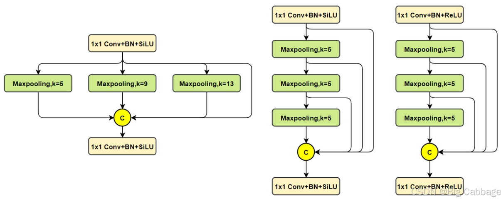

> 依次是SPP, SPPF,以及SimSPPF

**Efficient decoupled head**

YOLOv5 的检测头是一个参数在分类和定位分支之间共享的耦合头，而 FCOS[41]和 YOLOX[7]中的对应部分则将两个分支解耦，并在每个分支中引入了两个 3x3 卷积层来提升性能

在 YOLOv6 中，我们采用混合通道策略来构建一个更高效的解耦头。具体来说，我们将中间的3×3卷积层减少到仅 1 个。头的宽度由骨干网络和颈部的宽度倍数共同缩放。这些修改进一步降低了计算成本，实现了更低的推理延迟。

**Probability Loss 概率损失**

分布焦点损失 (DFL) 将框位置的基本连续分布简化为离散概率分布。它考虑了数据中的模糊性和不确定性，而未引入任何其他强先验，这有助于提高框定位精度，尤其是在真实框的边界模糊时。基于 DFL，DFLv2 [19] 开发了一个轻量级子网络，以利用分布统计与实际定位质量之间的紧密相关性，从而进一步提升检测性能。然而，DFL 通常比一般框回归输出多 17 个回归值，导致显著的额外开销。额外的计算成本严重阻碍了小模型的训练。而 DFLv2 由于额外的子网络，进一步增加了计算负担。在我们的实验中，DFLv2 在我们的模型上带来的性能提升与 DFL 相似。因此，我们在 YOLOv6-M/L 中仅采用 DFL。

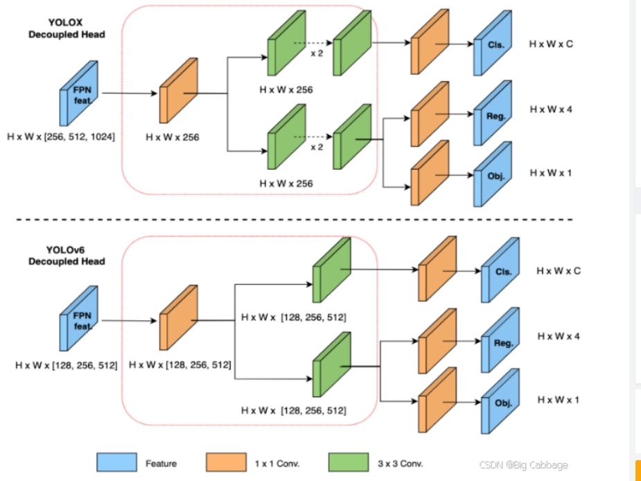


#### 正负样本匹配与损失函数

**TaskAligned样本匹配**

在YOLOv6的早期版本中使用了SimOTA作为标签分配方法。SimOTA 减少了额外的超参数并保持了性能，但是在实践中发现引入SimOTA会减慢训练过程。同时可能会使训练陷入不稳定。 之后，YOLOv6最新版本找到一个替代SimOTA的匹配方法，TaskAlign。

任务对齐学习（TAL）最初在 TOOD [ 5]中被提出，其中设计了一种统一的分类分数和预测框质量的度量标准。IoU 被该度量标准取代，用于分配对象标签。在一定程度上，任务错位（分类和bbox回归）的问题得到了缓解。

TOOD 的另一个主要贡献是关于任务对齐头（T-head）。T-head 堆叠卷积层来构建交互特征，在此基础上使用任务对齐预测器（TAP）。PP-YOLOE [ 45] 通过用轻量级的 ESE 注意力机制替换 T-head 中的层注意力机制来改进 T-head，形成了 ET-head。然而，我们发现 ET-head 会降低我们模型的推理速度，并且没有带来精度提升。因此，我们保留了我们高效解耦头的设计。

此外，我们观察到 TAL 能够比 SimOTA 带来更多的性能提升，并稳定训练。因此，我们在 YOLOv6 中采用 TAL 作为默认的标签分配策略

此外，TOOD [ 5] 的实现采用 ATSS [ 51] 作为早期训练 epoch 中的预热标签分配策略。我们也保留了预热策略，并对其进行了进一步的探索。
```math
t = s^{\alpha} \times u^{\beta} 
```
> s 是分类得分，u是定位精度iou （pred_bboxes与gt_bboxes）
>  $\alpha$ 和 $\beta$ 为权重超参

- 计算所有pred bbox（所有金字塔级别的bbox）和gt之间的对齐度量（alignment metric）
    ```
    alpha: 1.0
    beta: 6.0
    # compute alignment metrics, [B, n, L]
    alignment_metrics = bbox_cls_scores.pow(self.alpha) * ious.pow(
            self.beta)
    ```
- 选择top-k alignment metrics bbox作为每个gt的候选项
- 将阳性样品的中心（anchor_points）限制在gt bbox中（因为无锚检测器）只能预测正距离)
- 如果一个锚框被分配给多个gts，则具有最高的分数将被选中。

**VFL Loss 分类损失函数**

```math

VFL(p,q) = \left\{ 
    \begin{matrix} 
    -q(qlog(p) + (1-q)log(1-p))&& q >0 \\
    -{\alpha}p^{\gamma}log(1-p) && q=0 \\
    \end{matrix} \right\}
```

q是label，正样本时候q为bbox和gt的IoU，负样本时候q=0，当为正样本时候其实没有采用FL，而是普通的BCE，只不过多了一个自适应IoU加权，用于突出主样本。而为负样本时候就是标准的FL了。可以明显发现VFL比QFL更加简单，主要特点是正负样本非对称加权、突出正样本为主样本。

```
weight = alpha * pred_score.pow(gamma) * (1 - label) + gt_score * label
loss = F.binary_cross_entropy(
    pred_score, gt_score, weight=weight, reduction='sum')
return loss
```

- pred_score 为预测相关anchor是相关类别的得分
- gt_score   对于训练中的正样本，设置为生成的bbox和gt box之间的IoU（gt IoU）。而对于训练中的负样本，所有类别的训练目标均为0
- label 类别one_hot编码


**SIOU 损失**

IOU: 预测框与目标框之间的重叠程度
GIOU: 在IOU的基础上通过引入预测框和真实框的最小外接矩形。（不仅关注重叠区域，还关注其他的非重合区域）
DIOU: DIOU在IoU的基础上直接回归两个框中心点的欧式距离,DIOU的惩罚项是基于中心点的距离和对角线距离(同时包含预测框和真实框的最小闭包区域的对角线距离)的比值.
CIOU: 在DIOU的基础上添加了长宽比的惩罚项

SIoU 损失函数通过引入了所需回归之间的向量角度，重新定义了距离损失，有效降低了回归的自由度，加快了网络模型的收敛，并且在小规模模型（n/t/s模型）上可以一定程度上提升精度。

YOLOv6对小模型采用SIoU损失，大模型采用GIoU损失。


**DFL损失**

这里的DFL（Distribution Focal Loss），其主要是将框的位置建模成一个 general distribution，让网络快速的聚焦于和目标位置距离近的位置的分布。

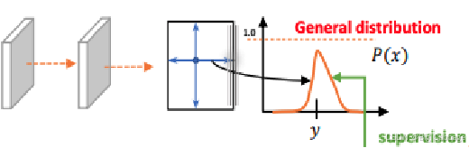

```math
DFL(S_i, S_{i+1}) = -((y_{i+1}-y)log(S_i) + (y-y_i)log(S_{i+1}))
```

> yi和 yi+1是浮点值 y 的左右整数值，S是输出分布，长度为17；
> DFL 能够让网络更快地聚焦于目标 y 附近的值，增大它们的概率；
> DFL的含义是以交叉熵的形式去优化与标签y最接近的一左一右2个位置的概率，从而让网络更快的聚焦到目标位置的邻近区域的分布；
> 也就是说学出来的分布理论上是在真实浮点坐标的附近，并且以线性插值的模式得到距离左右整数坐标的权重。

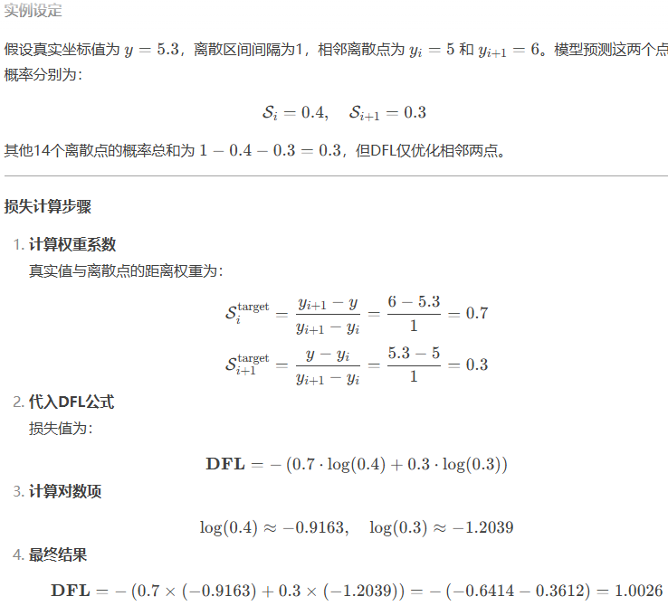

**YOLOv6 v3.0的主要贡献简述如下**
- 对检测器的Neck部件进行了翻新：引入BiC(Bi-directional Concatenation)提供更精确的定位信息；将SPPF简化为SimCSPSPPF，牺牲较少的速度提升更多的性能。（SimCSPSPPF 模块被引入 YOLOv6-N/S。对于 YOLOv6-M/L，采用 SimSPPF 模块。）
- 提出一种AAT(Anchor-aided training)策略，在不影响推理效率的情况下同时受益于Anchor-basedAnchor-free设计理念。
- 对YOLOv6的Backbone与Neck进行加深，在更高分辨率输入下达成新的SOTA性能
- 提出一种新的自蒸馏策略提升YOLOv6小模型的性能，训练阶段采用更大的DFL作为增强版辅助回归分支。

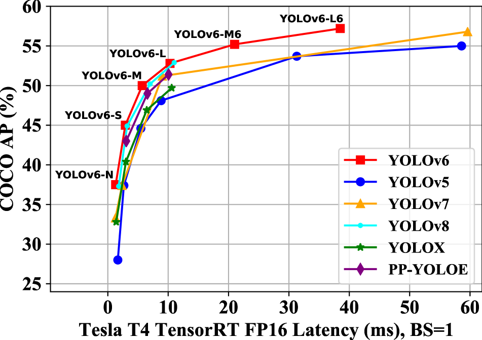


> (a) YOLOv6 的颈部结构（N 和 S 所示）。注意对于 M/L，RepBlocks 被替换为 CSPStackRep
> (b) 使用双向拼接（BiC）模块更新检测器的颈部，以提供更精确的位置信号
> (c) SPPF [ 5] 被简化为 SimCSPSPPF 模块，该模块在几乎不降低速度的情况下带来了性能提升。 
> SimCSPSPPF的激活函数为relu, CSPSPPF的激活函数为silu

**网络设置**

在实际应用中，多尺度特征融合已被证明是目标检测中关键且有效的组成部分。
特征金字塔网络（FPN）通过自顶向下的路径聚合高层语义特征和低层特征，从而提供更精确的位置定位。随后，出现了多项关于双向 FPN 的研究，旨在增强层次化特征表示能力。
PANet在 FPN 基础上增加了一条额外的自底向上路径，以缩短低层和高层特征的信息路径，从而促进从低层特征传播精确信号。
BiFPN引入了可学习的权重用于不同输入特征，并简化了 PAN，以实现高效的高性能。
PRB-FPN通过并行 FP 结构实现双向融合及相关改进，保留了高质量特征以实现精确位置定位。

受上述工作的启发，我们设计了一种增强型 PAN 作为我们的检测颈。为了在不引入过多计算负担的情况下增强定位信号，我们提出了一种双向拼接（BiC）模块，用于整合三个相邻层的特征图，将骨干网络 $c_{i-1}$的一个额外低级特征融合到 $p_i$  中（图 2）。**在这种情况下，可以保留更精确的定位信号，这对小物体的定位非常重要**


**Anchor-Aided Training （基于锚点的训练）**

YOLOv6 是一种无锚点检测器，旨在追求更高的推理速度。然而，我们通过实验发现，与无锚点检测器相比，在相同设置下，基于锚点的范式为 YOLOv6-N 带来了额外的性能提升，如表 1 所示。此外，基于锚点的 ATSS [ 18]被用作 YOLOv6 早期版本中的预热标签分配策略，从而稳定了训练。


基于此，我们提出了辅助锚点训练（AAT），其中引入了基于锚点的辅助分支，以结合基于锚点和无锚点范式的优势。这些辅助分支应用于分类头和回归头。图 3 展示了带辅助分支的检测头。


> 训练期间带基于锚点的辅助分支的检测头。推理时移除辅助分支。‘af’和‘ab’分别代表‘无锚点’和‘基于锚点’。

在训练阶段，辅助分支和锚点无关分支从独立的损失中学习，同时信号被整体传播。因此，辅助分支的额外嵌入引导信息被整合到主要的锚点无关头部中。值得一提的是，在推理时移除了辅助分支，这提升了准确率性能而不降低速度。


**Self-distillation (自我蒸馏)**


在 YOLOv6 的早期版本中，自我蒸馏仅在大型模型（即 YOLOv6-M/L）中引入，通过最小化教师模型和学生模型在类别预测之间的 KL 散度来应用原味知识蒸馏技术。同时，采用 DFL 作为回归损失，对边界框回归进行自我蒸馏。

知识蒸馏损失的表达式为：

```math
L_{KD} = KL(p_t^{cls} || p_s^{cls}) + KL(p_t^{reg} || p_s^{reg}) \\
L_{total} = L_{det} + \alpha L_{KD}

```

其中 $p_t^{cls}$ 和 $p_s^{cls}$ 分别是教师模型和学生模型的类别预测，相应地 $p_t^{reg}$ 和 $p_s^{reg}$ 是边界框回归预测

其中 $L_{det}$ 是使用预测和标签计算出的检测损失。引入超参数 
α来平衡两种损失。在训练的早期阶段，教师生成的软标签更容易学习。随着训练的进行，学生的性能将匹配教师，因此硬标签将更有助于学生。基于此，我们对 α 应用余弦权重衰减，以动态调整来自硬标签和教师软标签的信息。 
α 的公式为：

```math
\alpha=-0.99*((1-cos(\pi*E_{i}/E_{max}))/2)+1,
```


> 其中 $E_i$ 表示当前训练的轮次， $E_{max}$ 代表最大训练轮次

由于DFL会对回归分支引入额外的参数，极大程度影响小模型的推理速度。因此，作者针对小模型设计了一种DLD(Decoupled Localization Distillation)以提升性能且不影响推理速度。具体来说，在小模型中插入一个增强版回归分支作为辅助。在自蒸馏阶段，小模型受普通回归分支与增强回归分支加持，老师模型近使用辅助分支。需要注意：普通分支仅采用硬标签进行训练，而辅助分支则用硬标签与源自老师模型的软标签进行训练。完成蒸馏后，仅普通分支保留，辅助分支被移除。这种训练策略又是一种加量不加价的"赠品"。


### yolov7（2022）

Trainable bag-of-freebies sets new state-of-the-art for real-time object detectors


YOLOV7 是 YOLOV4 的原班人马于 2022 年提出的最新的 YOLO 版本。 YOLOv7 的在速度和精度上的表现也优于 YOLOR、YOLOX、Scaled-YOLOv4、YOLOv5、DETR 等多种目标检测器

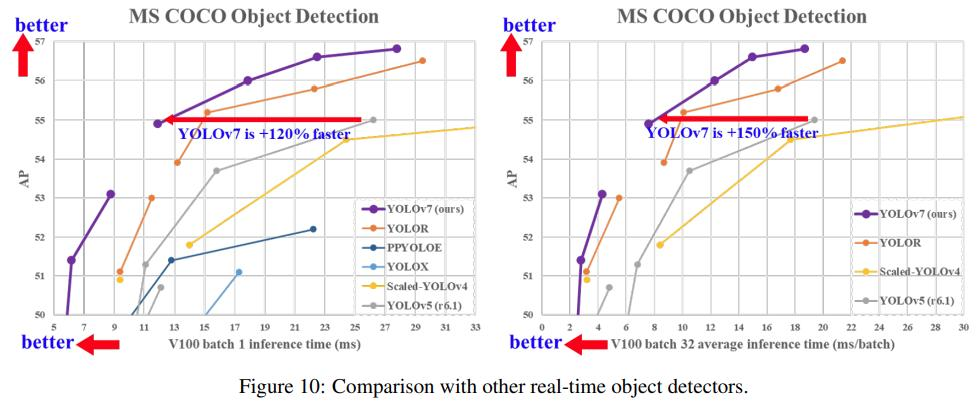


**YOLOV7 整体网络结构**
YOLOV7 跟 V4、V5 的结构差不多，依然是 Backbone+Neck+Head

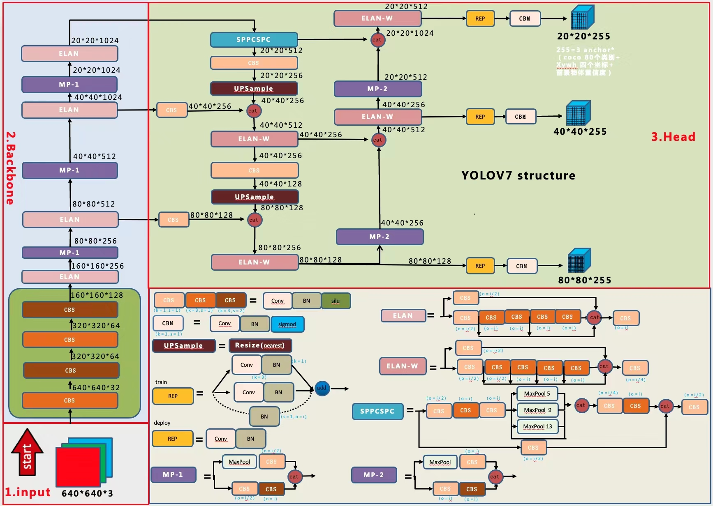

在 Backbone 中，输入的图像会先经过 4 个普通卷积 CBS (Conv2D+BatchNorm+SiLu)，这 4 个 CBS 都是 3*3 的卷积核，它们的不同在于橙色的 CBS 步长为 1，不会改变特征图的尺寸；而褐色的 CBS 步长为 2，会进行下采样；YOLOV5 只有两个普通卷积 CBS

#### ELAN
YOLOV5 在进一步的 Backbone 中使用的是 CSPLayer（C3） 结构，V7 中改成了 ELAN 结构 + MP 结构

扩展高效层聚合网络(efficient layer aggregation networks,ELAN) ELAN 结构

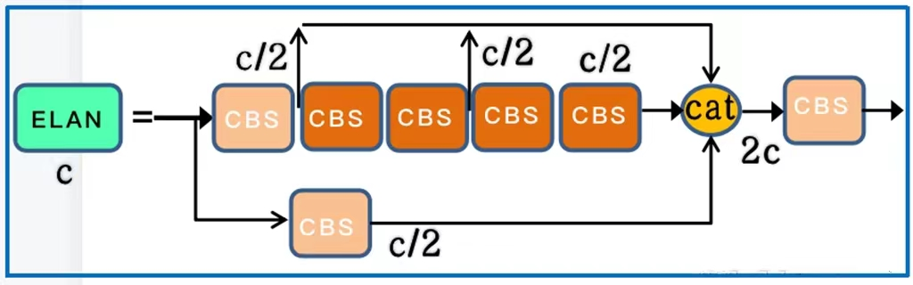

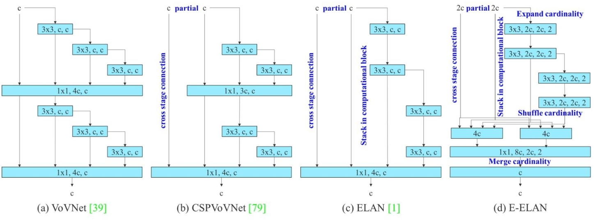

> Extended efficient layer aggregation networks, E-ELAN

通过控制最短最长的梯度路径，更深的网络可以有效地学习和收敛。ELAN 由多个 CBS 构成，其输入输出特征大小保持不变，通道数在开始的两个 CBS 会有变化， 后面的几个输入通道都是和输出通道保持一致的，经过最后一个 CBS 输出为需要的通道。上图中粉色的 CBS 是 1*1 的卷积核，橙色的 CBS 是 3*3 的卷积核。经过 concat 输出的是 2c。

#### MP-1 结构

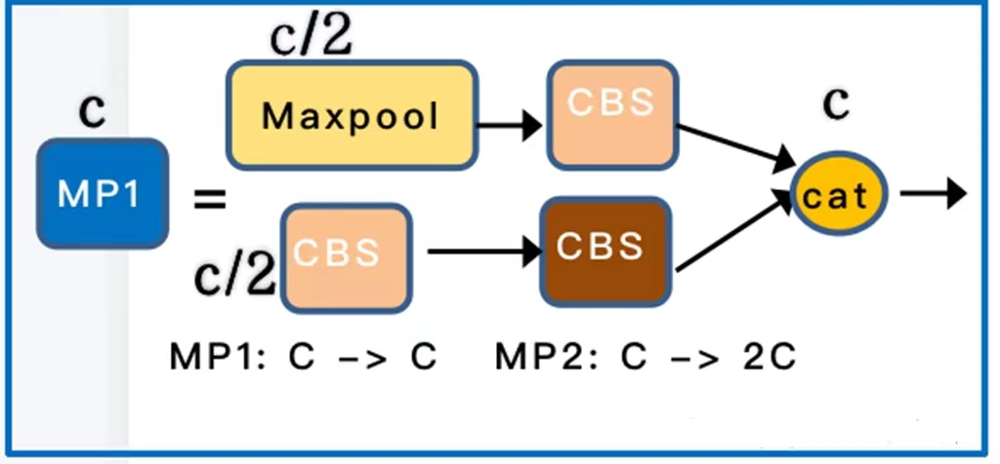

这里就是使用了最大池化 (上层) 和步长为 2 的 CBS (下层) 同时进行降采样，通道数通过 concat 合并后 MP1 前后保持不变

#### SPPCSPC 结构

YOLOV7 的 Backbone 最深层的网络输出的特征图会经过一个叫 SPPCSPC 的结构再输入到 Neck 中，YOLOV5 中则是 SPPF 的结构

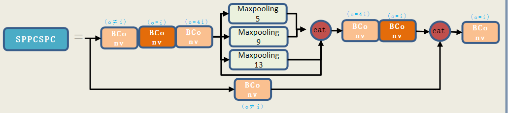

上图中首先会通过两个 1x1 的 CBS 分成两个通路，上面的通路会再接一个 3x3 的 CBS，再 1x1 的 CBS。YOLOV5 的 SPPF 中只有一个 CBS 就接最大池化了。YOLOV7 的最大池化改回了 YOLOV4 的结构，使用的是最大池化核数 5、9、13 并行的结构，而 YOLOV5 的 SPPF 使用的是 5x5 的最大池化串行的结构


**Neck 部分**

YOLOV7 依然是一个分层输出的特征金字塔结构。Backbone 在第 2、3、4 个 ELAN 后进行特征分层输出。Neck 部分依然采用的是 PAN 的双向特征融合，从深层到浅层进行上采样，再从浅层到深层进行下采样。PAN 的上采样部分主要有 CBS 普通卷积，UpSample 反卷积和 ELAN-W 的结构

PAN 的下采样部分包括 ELAN-W 和 MP-2 两种结构
#### ELAN-W 结构

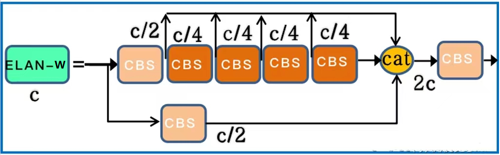

LAN-W 跟 ELAN 基本上是一样的，但是它的 concat 合并是 6 层合并，ELAN 是 4 层合并

MP-2 结构和 MP-1 结构是一样的，它们的区别在于输出通道数不同，MP-2 的输出通道数是 MP-1 的 2 倍

**Head 部分**

YOLOV7 的 Head 部分也是三个检测头，对不同尺度的特征图进行坐标预测和分类。

相比于 YOLOV5 的 PAN 每一层的直接输出，YOLOV7 用到了现今比较流行的重参的 REP 结构。

#### REP 结构

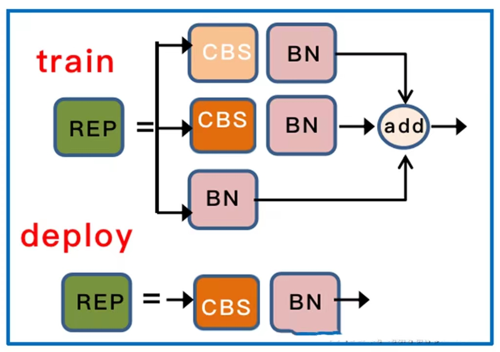


REP 在部署和训练的时候结构不同。在训练的时候，如果输入输出通道数相同，则包含了第三层 BN 的直连通道，否则只有第一层的 1*1 卷积 + BN 以及第二层的 3*3 卷积 + BN，上面虽然画的是 CBS，但其实这里是没有激活函数 SiLu 的，只有三层相加才会被最后激活。在部署时，为了方便部署，会将分支的参数重参数化到主分支上，取 3*3 的主分支卷积输出，但这里是没有 BN 的，只有激活。所以上面这个图是存在歧义的，需要指出


YOLOv7 的 W6、E6、D6 和 E6E 模型是官方发布的一系列高性能变体，专门针对高分辨率输入（1280x1280）设计。这些模型在原始 YOLOv7 基础上进行了深度和宽度的扩展，显著提升了检测精度。


模型架构对比
模型|	参数量|	GFLOPs|	层级深度|	特征金字塔|	适用场景
---|---|---|---|---|---
W6|	≈70M|	180|	中等|	P3-P8|	通用高精度
E6|	≈97M|	250|	最深|	P3-P8|	服务器端/最高精度
D6|	≈80M|	210|	较深|	P3-P8|	精度-速度平衡
E6E|	≈115M|	300|	最深|	P3-P8|	极限精度/研究

> 所有模型均支持 1280x1280 输入分辨率，使用 6 级特征金字塔（P3-P8）


