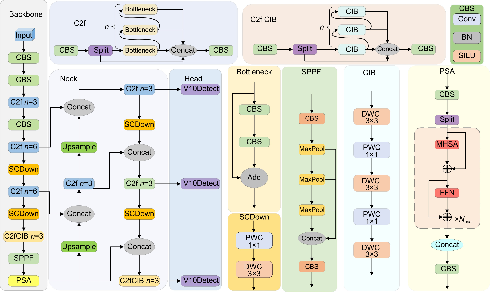

### Yolov10 （2024）实时端到端目标检测

YOLOv10 的核心在于，它通过一个端到端的架构，**彻底摆脱了传统 YOLO 模型所依赖的非极大值抑制（NMS, Non-Maximum Suppression）后处理步骤**，并大幅优化了网络结构，实现了推理速度与检测精度的新平衡。它由清华大学的研究团队于 2024 年提出，架构延续了经典的“主干（Backbone）- 颈部（Neck）- 头部（Head）”三段式设计

#### 概述

实时目标检测旨在以低延迟准确预测图像中的目标类别和位置。由于在性能和效率之间取得了平衡，YOLO 系列一直处于这项研究的最前沿。然而，对 NMS 的依赖和架构上的低效阻碍了性能的进一步优化。YOLOv10 通过引入用于无 NMS 训练的一致性双重分配以及全方位的效率-精度驱动模型设计策略来解决这些问题。

#### 架构

 YOLOv10s架构图如下

     

YOLOv10 的架构建立在以往 YOLO 模型优势的基础上，同时引入了多项关键创新。模型架构包含以下组件：

- 主干网络：负责特征提取，YOLOv10 中的主干网络使用了增强版的 CSPNet（跨阶段部分网络），以改善梯度流并减少计算冗余。
- 颈部网络：颈部网络旨在聚合不同尺度的特征并将其传递给头部网络。它包含用于有效多尺度特征融合的 PAN（路径聚合网络）层。
- 多对一头部：在训练期间为每个目标生成多个预测，以提供丰富的监督信号并提高学习精度。
- 一对一头部：在推理期间为每个目标生成一个最佳预测，从而消除了对 NMS 的需求，进而降低延迟并提高效率。

#### 主要特性

- 无 NMS 训练：利用一致性双重分配消除对 NMS 的需求，降低推理延迟。
- 整体模型设计：从效率和精度两个角度对各个组件进行全面优化，包括轻量级分类头部、空间-通道解耦下采样以及基于秩引导的模块设计。
- 增强的模型能力：集成了大核卷积和部分自注意力模块，在不增加显著计算成本的情况下提高性能。

#### 模型变体

YOLOv10 提供多种模型尺度，以满足不同的应用需求：

    YOLOv10n：适用于资源极其受限环境的 Nano 版本。
    YOLOv10s：在速度和精度之间取得平衡的小型版本。
    YOLOv10m：用于通用用途的中等版本。
    YOLOv10b：通过增加宽度以获得更高精度的平衡版本。
    YOLOv10l：以增加计算资源为代价换取更高精度的大型版本。
    YOLOv10x：实现最大精度和性能的超大型版本。

#### 比较

与其他最先进的检测器相比：

- 在精度相似的情况下，YOLOv10s / x 比 RT-DETR-R18 / R101 快 1.8 倍 / 1.3 倍
- 在精度相同的情况下，YOLOv10b 比 YOLOv9-C 参数减少 25%，延迟降低 46%
- YOLOv10l / x 的精度分别比 YOLOv8l / x 高 0.3 AP / 0.5 AP，同时参数减少 1.8 倍 / 2.3 倍

#### 主干网络 (Backbone)

主干网络负责从输入图像中提取丰富的特征，YOLOv10 在此处进行了深度优化，在降低计算成本的同时保证特征质量

- 增强版 CSPNet：采用 1:2 的通道拆分比例（而非传统的 1:1），进一步减少了计算冗余，同时保持梯度信息的有效流动
- C2fCIB 模块：将 YOLOv8 中的 C2f 模块的瓶颈层替换为 CIB（卷积倒置瓶颈块），用并行小卷积核组合替代传统的大卷积核，提升了特征多样性并降低了约 40% 的计算量
- SCDown 下采样：将传统卷积的同时下采样与通道变换解耦，先池化降分辨率，再用 1x1 卷积调整通道数，减少了约 20% 的信息损失
- PSA 部分自注意力：仅在深层特征图的关键区域（约 1/4）计算自注意力，以较低的计算成本捕捉全局上下文信息，增强模型对大目标的理解能力

#### head

双头协同预测

YOLOv10的Head由两个结构一致但功能互补的检测头构成：One-to-Many Head 和 One-to-One Head

- One-to-Many Head：在训练阶段作为核心监督信号源，为每个真实目标（GT）生成多个正样本候选框。这种“一对多”分配提供了密集的监督信号，促进模型学习收敛，保证了高召回率

- One-to-One Head：在训练阶段与前者联合优化，但它的独特之处在于采用一对一匹配策略，例如通过匈牙利算法等机制为每个GT目标匹配唯一的预测框。这确保了模型能学习输出一个最佳结果

训练与推理的巧妙分离：

- 训练阶段：上述两个Head会同步工作，联合优化，兼顾问号管理的丰富监督与One-to-One Head的精准匹配。

- 推理阶段：系统会将One-to-Many Head完全丢弃，仅使用由一对一策略优化的One-to-One Head进行预测。由于此时每个目标只对应一个最优预测框，自然就消除了大量冗余框，从而彻底摆脱了对传统NMS后处理的依赖

https://docs.ultralytics.com/zh/models/yolov10