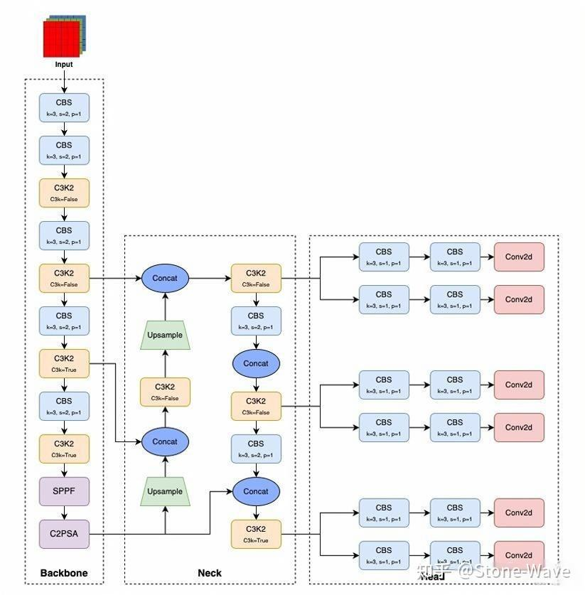
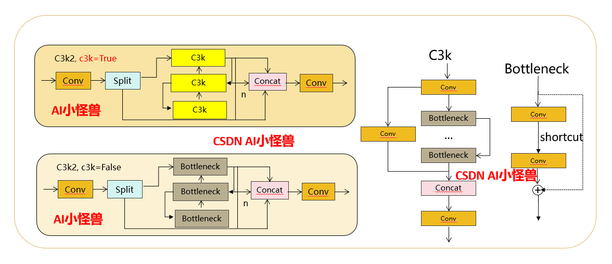
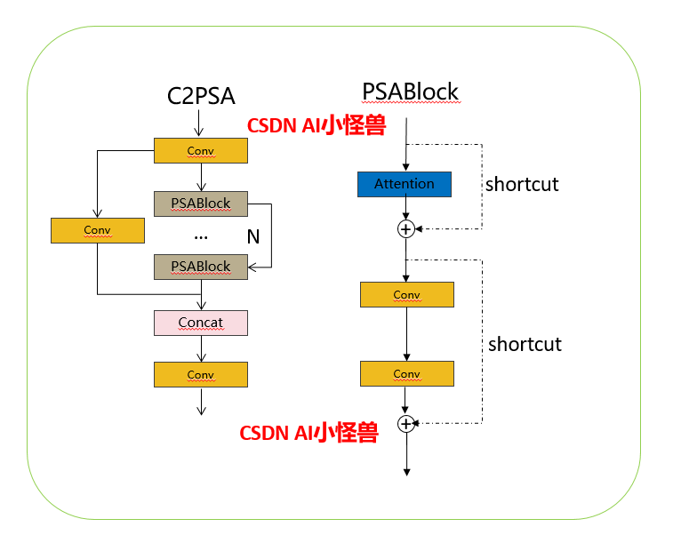

### Yolov11 （2024）实时端到端目标检测

YOLO11 由 Ultralytics 于 2024 年 9 月 10 日发布，提供了卓越的 accuracy、速度和效率。YOLO11 基于以往 YOLO 版本取得的显著进步，在架构和训练方法上进行了重大改进，使其成为应对广泛 computer vision 任务的多功能选择

#### 主要特性

- **增强的特征提取**： YOLO11 采用了改进的 backbone 和 neck 架构，增强了 feature extraction 能力，从而实现更精准的目标检测和复杂的任务表现。
- **针对效率和速度的优化**： YOLO11 引入了精炼的架构设计和优化的训练管线，在提供更快处理速度的同时，保持了准确性和性能之间的最佳平衡。
- **在更少参数下实现更高的准确性**： 凭借模型设计的进步，YOLO11m 在 COCO 数据集上实现了更高的 mean Average Precision (mAP)，同时比 YOLOv8m 少使用 22% 的参数，使其在不牺牲准确性的前提下具备了计算效率。
- **跨环境的适应性**： YOLO11 可无缝部署在各种环境中，包括边缘设备、云平台以及支持 NVIDIA GPU 的系统，确保了最大的灵活性。
- **广泛的受支持任务**： 无论是目标检测、实例分割、图像分类、姿态估计还是旋转目标检测 (OBB)，YOLO11 旨在满足多种多样的计算机视觉挑战。

#### 主干网络 (Backbone)

- 主干的核心是C3K2块，它是早期版本中引入的CSP（跨阶段部分）瓶颈的演变。C3K2模块通过分割特征图并应用一系列较小的内核卷积（3x3）来优化网络中的信息流，这与较大的内核卷积比更快，计算成本更低。

- 在 Spatial Pyramid Pooling – Fast （SPPF） 模块之后引入跨阶段部分空间注意力 （C2PSA） 模块，以增强空间注意力。这种注意力机制使模型能够更有效地关注图像中的重要区域，从而有可能提高检测准确性。

https://docs.ultralytics.com/zh/models/yolo11