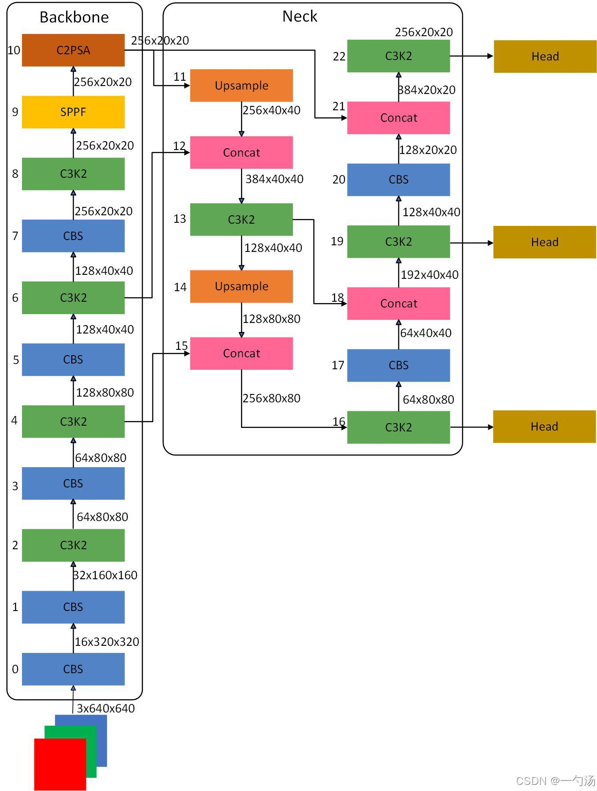

### Yolov26 （2026）实时端到端目标检测

Ultralytics YOLO26 是 YOLO 系列实时目标检测器的最新演进，专为边缘和低功耗设备从零构建。它引入了精简设计，去除了不必要的复杂性，同时整合了针对性创新，从而实现更快、更轻量且更易于部署的效果。

#### YOLO26 的架构遵循三个核心原则：

- 简洁性： YOLO26 是一种原生端到端模型，直接生成预测结果，无需非极大值抑制（NMS）。通过消除这一后处理步骤，推理变得更快、更轻量，且更易于在实际系统中部署。这种突破性的方法最初由清华大学的王傲在 YOLOv10 中首创，并在 YOLO26 中得到了进一步优化。
- 部署效率： 端到端设计省去了整个流程中的一个阶段，极大简化了集成，降低了延迟，并使部署在各种环境下更加稳健。
- 训练创新： YOLO26 引入了 MuSGD 优化器，这是 SGD 和 Muon 的混合体，灵感源自月之暗面 (Moonshot AI) 的 Kimi K2 在大语言模型训练中的突破。该优化器带来了更强的稳定性和更快的收敛速度，将大语言模型的优化进展应用到了计算机视觉领域。
- 特定任务优化： YOLO26 为专业任务引入了针对性改进，包括用于语义分割的语义分割损失和多尺度 proto 模块、用于高精度姿态估计的残差对数似然估计（RLE），以及通过角度损失优化解码以解决 OBB 边界问题。

这些创新共同构建了一个模型家族，在处理小目标时实现了更高的准确度，提供了无缝的部署体验，并且在 CPU 上运行速度提升高达 43% — 使 YOLO26 成为目前资源受限环境下最实用、最易部署的 YOLO 模型之一。

#### 主要特性

- **移除 DFL** 分布焦点损失（DFL）模块虽然有效，但往往会使导出复杂化并限制硬件兼容性。YOLO26 完全移除了 DFL，简化了推理过程，并拓宽了对边缘和低功耗设备的支持。

- **端到端无需 NMS 的推理** 与依赖 NMS 作为独立后处理步骤的传统检测器不同，YOLO26 是原生端到端的。预测结果直接生成，降低了延迟，并使集成到生产系统中的过程变得更快、更轻量且更可靠。

- **ProgLoss + STAL** 改进的损失函数提高了检测精度，特别是在小目标识别方面有显著提升，这对于物联网、机器人、航空影像及其他边缘应用至关重要。

    - ProgLoss（渐进式损失平衡）：其核心思想是在训练前期让模型先专注于学会"是什么"（分类），后期再精修"在哪里"（回归），从而实现更平滑、高效的学习过程。

    - STAL（小目标感知标签分配）：它为图像中较小、不显眼的目标与真实边界框建立更精确的匹配关系，直接提升了模型识别小物体的能力。

- **MuSGD 优化器** 一种结合了 SGD 与 Muon 的新型混合优化器。受月之暗面 (Moonshot AI) 的 Kimi K2 启发，MuSGD 将大语言模型训练中的先进优化方法引入计算机视觉，从而实现更稳定的训练和更快的收敛。

- **CPU 推理速度提升高达 43%** 专为边缘计算优化，YOLO26 显著提升了 CPU 推理速度，确保在没有 GPU 的设备上也能实现实时性能。

- **实例分割增强** 引入语义分割损失以改进模型收敛，并升级了 proto 模块，利用多尺度信息实现卓越的掩膜质量。

- **高精度姿态估计** 集成了 残差对数似然估计 (RLE) 以实现更精确的关键点定位，并优化了解码过程以提高推理速度。

- **精炼的 OBB 解码** 引入专门的角度损失以提高正方形物体的检测精度，并优化了 OBB 解码以解决边界不连续的问题。

#### YOLO26 支持的多种任务和多尺寸模型

- 支持多尺寸模型，适配多场景任务需求

    YOLO26提供五种尺寸规格，从Nano（n）到Extra Large（x），开发者可根据部署设备的硬件限制，灵活平衡运行速度、检测精度与模型体积：

        Nano（n）：极致轻量化，专为低功耗边缘设备设计
        Small（s）/Medium（m）：兼顾速度与精度，适用于多数终端场景
        Large（l）/Extra Large（x）：高精度优先，满足复杂场景检测需求
    每个尺寸变体（n、s、m、l、x）都支持所有任务。

- YOLO26支持多种视觉任务

    YOLO26以统一模型架构支撑多种计算机视觉任务，训练、验证、推理与导出流程高度统一，降低技术落地门槛：

        图像分类：分析整图场景，精准匹配类别标签
        目标检测：定位并识别图像/视频中的多个目标
        实例分割：以像素级精度勾勒目标轮廓
        姿态估计：识别人体及物体关键点，还原姿态信息
        旋转边界框（OBB）检测：精准识别倾斜目标，适配航拍、卫星影像等场景

#### 网络结构分析

#### 主干网络 (Backbone)

Backbone部分负责特征提取，采用了一系列卷积和反卷积层，同时使用了残差连接和瓶颈结构来减小网络的大小并提高性能。YOLO26使用C3k2块来处理主干不同阶段的特征提取。较小的3x3内核允许更有效的计算，同时保留模型捕获图像中基本特征的能力。YOLO26主干的核心是C3k2块，它是早期版本中引入的CSP（跨阶段部分）瓶颈的演变。C3k2模块通过分割特征图并应用一系列较小的内核卷积（3x3）来优化网络中的信息流，这比较大的内核卷积更快，计算成本更低。通过处理较小的独立特征图并在几次卷积后合并它们，C3k2模块与YOLOv8的C2f模块相比，使用更少的参数来改进特征表示。

### loss

双头训练机制中的损失计算

在双头训练中，YOLOv26的损失计算分为三个关键步骤：

- 基础损失计算：复用 v8DetectionLoss 的逻辑，为 one-to-many 和 one-to-one 两个检测头分别独立计算出各自的边界框回归损失、分类损失和置信度损失。

- 双头损失叠加：YOLOv26的总损失并非简单地将两个头的损失相加，而是引入了 E2ELoss 或 ProgLoss 机制，对两个头的损失进行动态权重平衡。

- 最终综合：外层机制会根据训练阶段等因素，决定 one-to-many 和 one-to-one 两个分支损失对最终梯度更新的贡献程度。

**ProgLoss (渐进式损失平衡)**

ProgLoss 是一种动态损失平衡策略，它不修改单个检测头的内部损失计算方式，而是作为一个外层控制器，动态调整 one-to-many 和 one-to-one 两个头对总损失的贡献权重。

它的目的是在不同的训练阶段，让损失函数的优化侧重点有所不同，使模型学习更加平滑、高效。

**STAL 通过改进正负样本的匹配策略来间接影响损失函数。**

技术详情：它采用多尺度、动态阈值策略。例如，对深层特征图（负责大目标）使用严格阈值（0.7-0.9），避免误检；对浅层特征图（负责小目标）则采用宽松阈值（0.4-0.6），确保小目标锚框被充分激活，从而增加正样本数量。

作用：STAL通过让更多小目标被识别为正样本来参与损失计算，直接为损失函数提供了更优质、更平衡的监督信号。

#### E2ELoss

E2ELoss的运作可以分为三步：

- 🔍 分配任务：在两个检测头上分别调用TaskAlignedAssigner为每个真实目标匹配正负样本。

- 📊 计算基础损失：分别调用v8DetectionLoss（由BboxLoss和BCEWithLogitsLoss等组合）计算出基础的Bbox损失、分类损失等。

- ⚖️ 动态平衡：这是最关键的一步，E2ELoss在其内部实现了ProgLoss算法，以动态调整“一对多”和“一对一”这两个头的损失权重