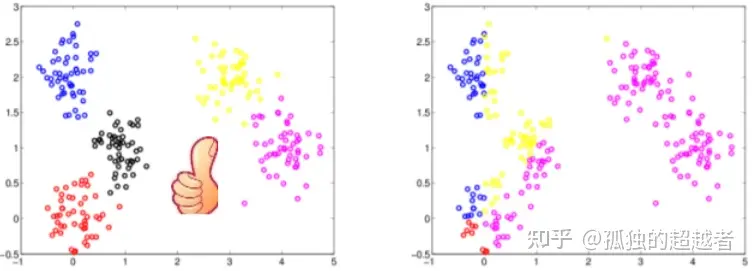
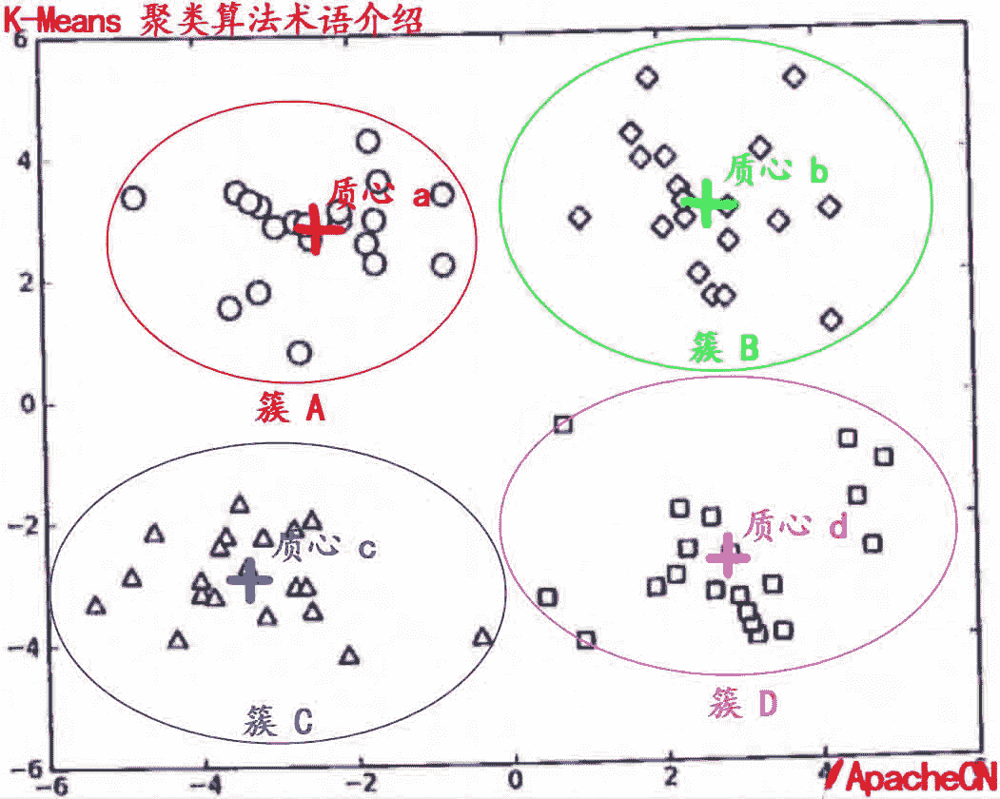
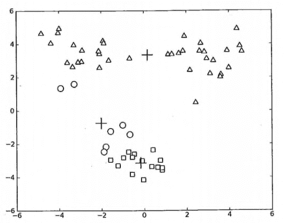
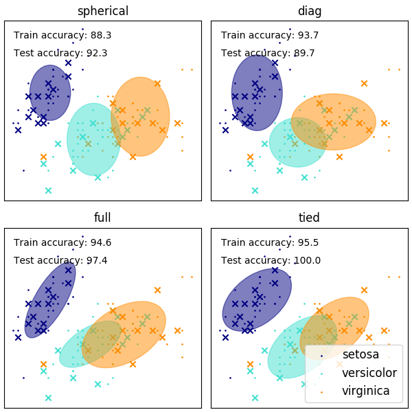
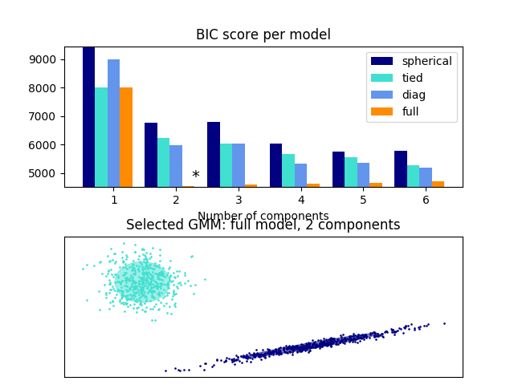
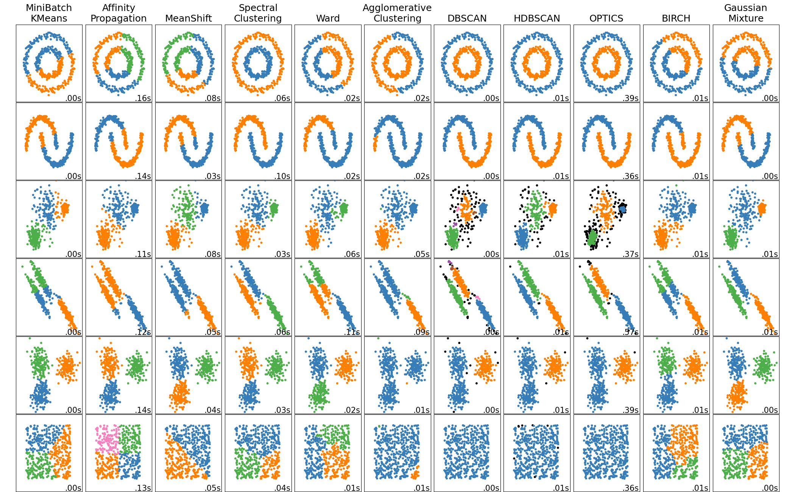

#### 聚类

聚类就是将相似的对象归入同一个“类”。

发现数据的结构，使得同一个类中的对象互相之间关联更强。
- 同一个类中的对象相似(similarity)
- 不同类中的对象有明显的差异

核心问题：相似度的定义
- 簇/类内(intra-cluster)相似度
- 簇/类间(inter-cluster)相似度

一个好的聚类是类内距离小，类间距离大。




聚类，简单来说，就是将一个庞杂数据集中具有相似特征的数据自动归类到一起，称为一个簇，簇内的对象越相似，聚类的效果越好。它是一种无监督的学习(Unsupervised Learning)方法,不需要预先标注好的训练集。聚类与分类最大的区别就是分类的目标事先已知，例如猫狗识别，你在分类之前已经预先知道要将它分为猫、狗两个种类；而在你聚类之前，你对你的目标是未知的，同样以动物为例，对于一个动物集来说，你并不清楚这个数据集内部有多少种类的动物，你能做的只是利用聚类方法将它自动按照特征分为多类，然后人为给出这个聚类结果的定义（即簇识别）。例如，你将一个动物集分为了三簇（类），然后通过观察这三类动物的特征，你为每一个簇起一个名字，如大象、狗、猫等，这就是聚类的基本思想。


至于“相似”这一概念，是利用距离这个评价标准来衡量的，我们通过计算对象与对象之间的距离远近来判断它们是否属于同一类别，即是否是同一个簇。至于距离如何计算，科学家们提出了许多种距离的计算方法，其中欧式距离是最为简单和常用的，除此之外还有曼哈顿距离和余弦相似性距离等。


**聚类的类型**

软聚类（soft clustering） vs. 硬聚类（hard clustering）
- 软：同一个对象可以属于不同类
- 硬：同一个对象只能属于一个类


#### 聚类算法
 - 层次聚类
 - K-means、K-mediods


 #### K-Means 算法

 K-Means 是发现给定数据集的 K 个簇的聚类算法, 之所以称之为 K-均值 是因为它可以发现 K 个不同的簇, 且每个簇的中心采用簇中所含值的均值计算而成.
簇个数 K 是用户指定的, 每一个簇通过其质心（centroid）, 即簇中所有点的中心来描述.
聚类与分类算法的最大区别在于, 分类的目标类别已知, 而聚类的目标类别是未知的.

KMeans 算法通过把样本分离成 n 个具有相同方差的类的方式来聚集数据，最小化称为 惯量(inertia) 或 簇内平方和(within-cluster sum-of-squares)的标准（criterion）。该算法需要指定簇的数量。它可以很好地扩展到大量样本(large number of samples)，并已经被广泛应用于许多不同领域的应用领域。


优点:

    属于无监督学习，无须准备训练集
    原理简单，实现起来较为容易
    结果可解释性较好

缺点:

    需手动设置k值。 在算法开始预测之前，我们需要手动设置k值，即估计数据大概的类别个数，不合理的k值会使结果缺乏解释性
    可能收敛到局部最小值, 在大规模数据集上收敛较慢
    对于异常点、离群点敏感

使用数据类型 : 数值型数据


惯性被认为是测量簇内聚程度的度量(measure)。 它有各种缺点:

- 惯性假设簇是凸(convex)的和各项同性(isotropic)，这并不是总是对的。它对 细长的簇或具有不规则形状的流行反应不佳。
- 惯性不是一个归一化度量(normalized metric): 我们只知道当惯量的值较低是较好的，并且零是最优的。但是在非常高维的空间中，欧氏距离往往会膨胀（这就是所谓的 “维度诅咒/维度惩罚”(curse of dimensionality)）。在 k-means 聚类算法之前运行诸如 **PCA** 之类的降维算法可以减轻这个问题并加快计算速度。


#### K-Means 术语

    簇: 所有数据的点集合，簇中的对象是相似的。
    质心: 簇中所有点的中心（计算所有点的均值而来）.
    SSE: Sum of Sqared Error（误差平方和）, 它被用来评估模型的好坏，SSE 值越小，表示越接近它们的质心. 聚类效果越好。由于对误差取了平方，因此更加注重那些远离中心的点（一般为边界点或离群点）。详情见kmeans的评价标准。




#### K-Means 聚类算法的缺陷


>在 kMeans 的函数测试中，可能偶尔会陷入局部最小值（局部最优的结果，但不是全局最优的结果）.

局部最小值的的情况如下:



出现这个问题有很多原因，可能是k值取的不合适，可能是距离函数不合适，可能是最初随机选取的质心靠的太近，也可能是数据本身分布的问题。

为了解决这个问题，我们可以对生成的簇进行后处理，一种方法是将具有最大SSE值的簇划分成两个簇。具体实现时可以将最大簇包含的点过滤出来并在这些点上运行K-均值算法，令k设为2。

为了保持簇总数不变，可以将某两个簇进行合并。从上图中很明显就可以看出，应该将上图下部两个出错的簇质心进行合并。那么问题来了，我们可以很容易对二维数据上的聚类进行可视化， 但是如果遇到40维的数据应该如何去做？

有两种可以量化的办法: 合并最近的质心，或者合并两个使得SSE增幅最小的质心。 第一种思路通过计算所有质心之间的距离， 然后合并距离最近的两个点来实现。第二种方法需要合并两个簇然后计算总SSE值。必须在所有可能的两个簇上重复上述处理过程，直到找到合并最佳的两个簇为止。

因为上述后处理过程实在是有些繁琐，所以有更厉害的大佬提出了另一个称之为二分K-均值（bisecting K-Means）的算法.


#### 二分 K-Means 聚类算法

该算法首先将所有点作为一个簇，然后将该簇一分为二。
之后选择其中一个簇继续进行划分，选择哪一个簇进行划分取决于对其划分时候可以最大程度降低 SSE（平方和误差）的值。
上述基于 SSE 的划分过程不断重复，直到得到用户指定的簇数目为止。


####  小批量 K-Means

MiniBatchKMeans 是 KMeans 算法的一个变种，它使用小批量(mini-batches)来减少计算时间，而这多个批次仍然尝试优化相同的目标函数。小批量是输入数据的子集，在每次训练迭代中随机抽样。这些小批量大大减少了收敛到局部解所需的计算量。 与其他降低 k-means 收敛时间的算法不同，小批量 k-means 产生的结果通常只比标准算法略差。

该算法在两个步骤之间进行迭代，类似于 vanilla k-means 。在第一步， b 样本是从数据集中随机抽取的，形成一个小批量。然后将它们分配到最近的质心。 在第二步，质心被更新。与 k-means 不同, 该变种算法是基于每个样本(per-sample)。对于小批量中的每个样本，通过取样本的流平均值(streaming average)和分配给该质心的所有先前样本来更新分配的质心。 这具有随时间降低质心的变化率（rate of change）的效果。执行这些步骤直到达到收敛或达到预定次数的迭代。

MiniBatchKMeans 收敛速度比 KMeans快 ，但是结果的质量会降低。在实践中，质量差异可能相当小，如示例和引用的参考


#### 高斯分布


#### 高斯混合

GaussianMixture 对象实现了用来拟合高斯混合模型的 期望最大化 (EM) 算法。它还可以为多变量模型绘制置信椭圆体，同时计算 BIC（Bayesian Information Criterion，贝叶斯信息准则）来评估数据中聚类的数量。而其中的GaussianMixture.fit 方法可以从训练数据中拟合出一个高斯混合模型。

如果给定测试数据，通过使用 GaussianMixture.predict 方法，可以为每个样本分配最适合的高斯分布模型。

GaussianMixture 方法中自带了不同的选项来约束不同估类的协方差：spherical，diagonal，tied 或 full 协方差



- 优点
    - 速度: 是混合模型学习算法中最快的算法．
    - 无偏差性: 这个算法仅仅只是最大化可能性，并不会使均值偏向于0，或是使聚类大小偏向于可能适用或者可能不适用的特殊结构。
- 缺点
    - 奇异性: 当每个混合模型没有足够多的点时，会很难去估算对应的协方差矩阵，同该算法会发散并且去寻找具有无穷大似然函数值的解，除非人为地正则化相应的协方差。
    - 分量的数量: 这个算法总是会使用它所能用的全部分量，所以在缺失外部线索的情况下，需要留存数据或者信息理论标准来决定用多少个分量


**选择经典高斯混合模型中分量的个数**

通过BIC（贝叶斯信息准则）来选择高斯混合的分量数是一种高效的方法。 理论上，它仅当在近似状态下可以恢复正确的分量数（即如果有大量数据可用，并且假设这些数据（具有独立同分布属性）实际上是一个混合高斯模型生成的）。注意：使用 变分贝叶斯高斯混合 可以避免高斯混合模型中分量数量的选择。




如下 展示了不同聚类算法在数据集上的特征



#### sklearn

未标记的数据的 聚类(Clustering) 可以使用模块`sklearn.cluster` 来实现

每个聚类算法(clustering algorithm)都有两个变体: 一个是 类（class）, 它实现了 fit 方法来学习训练数据的簇（cluster），还有一个 函数（function），当给定训练数据，返回与不同簇对应的整数标签数组（array）。对于类来说，训练数据上的标签可以在 labels_ 属性中找到。


给定足够的时间，K-means 将总是收敛的，但这可能是局部最小。这很大程度上取决于质心的初始化。 因此，通常会进行几次初始化不同质心的计算。帮助解决这个问题的一种方法是 k-means++ 初始化方案，它已经在 scikit-learn 中实现（使用 `init='k-means++'` 参数）。 这将初始化质心（通常）彼此远离，导致比随机初始化更好的结果，如参考文献所示。

该算法支持样本权重功能，该功能可以通过参数`sample_weight`实现。该功能允许在计算簇心和惯性值的过程中，给部分样本分配更多的权重。 例如，给某个样本分配一个权重值2，相当于在dataset X 中增加一个该样本的拷贝。

存在一个参数，以允许 K-means 并行运行，称为 `n_jobs`。给这个参数赋予一个正值指定使用处理器的数量（默认值: 1）。值 -1 使用所有可用的处理器，-2 使用全部可用处理器减一，等等。并行化(Parallelization)通常以内存的代价(cost of memory)加速计算（在这种情况下，需要存储多个质心副本，每个作业(job)使用一个副本）。


由于KMeans和MiniBatchKMeans都是优化非凸目标函数，因此它们的聚类不能保证对于给定的随机初始化是最优的。更进一步，在稀疏的高维数据上，比如使用Bag of Words方法进行矢量化的文本，k-means可以在极其孤立的数据点上初始化质心。这些数据点可以一直保持自己的质心

下面的代码说明了之前的现象有时如何导致高度不平衡的集群，这取决于随机初始化:

```
from sklearn.cluster import KMeans

for seed in range(5):
    kmeans = KMeans(
        n_clusters=true_k,
        max_iter=100,
        n_init=1,
        random_state=seed,
    ).fit(X_tfidf)
    cluster_ids, cluster_sizes = np.unique(kmeans.labels_, return_counts=True)
    print(f"Number of elements assigned to each cluster: {cluster_sizes}")
print()
print(
    "True number of documents in each category according to the class labels: "
    f"{category_sizes}"
)

Number of elements assigned to each cluster: [2050  711  180  446]
Number of elements assigned to each cluster: [ 575  619  485 1708]
Number of elements assigned to each cluster: [   1    1    1 3384]
Number of elements assigned to each cluster: [1887  311  332  857]
Number of elements assigned to each cluster: [1688  636  454  609]

True number of documents in each category according to the class labels: [799 973 987 628]

```

为了避免这个问题，一种可能性是增加独立随机初始化`n_init`的运行次数。在这种情况下，选择具有最佳惯性(k-means的目标函数)的聚类。