### BlazeFace


BlazeFace是Google专为移动端GPU定制的人脸检测方案。主要创新点如下：

<ol>
<li>专为轻量级检测定制的紧凑型特征提取网络，类似于MobielNet</li>
<li>相比SSD模型，对GPU更友好的anchor机制。</li>
<li>采用“tie resolution strategy”而非NMS处理重叠的预测结果。</li>
</ol>


#### BlazeBlock模块

<p>我们知道<code>深度可分离卷积</code>是轻量网络经常采用的卷积形式。它使用两步卷积运算，即Depthwise卷积与Pointwise卷积替代常规的单次卷积。</p>

<p>作者在iPhone上实测后发现，一个56×56×128大小、16-bit张量的Depthwise卷积运算耗时0.07ms，而伴随其后128-128通道的Pointwise卷积运算耗时0.3ms，是前者的4倍以上（作者认为是内存存取的固定开销造成）。因此作者提出在<code>Depthwise卷积中使用较大的卷积核(即使用5*5卷积核代替3*3卷积核，扩大感受野)</code>，这样只需要较少的bottleneck数量就可以获得指定大小的感受野范围。作者将该结构命名为 <em>BlazeBlock</em>。</p>

<p>另外为了促进感受野Size的传递，提出了double BlazeBlock 模块。该模块在bottleneck的最前端又塞入了一层深度可分离卷积，并增加了Max Pooling与Channel Padding作为可选旁路。</p>


#### 特征提取


<ul><li> <p>对于前置摄像头这种人脸占图像很大面积、人脸尺度变化较小的场景，作者定义了更加轻量级的特征提取。</p> </li><li> <p>作者使用了128×128像素的RGB输入，后跟1个常规5×5卷积、5个BlazeBlock、6个Double BlazeBlock，其中通道数最大值为96（网络结构可以参考原文）。</p> </li><li> <p>BlazeFace最低的空间分辨率为8×8 即缩放16倍（SSD分辨率一直降低到1×1）。</p> </li></ul>


#### 检测回归器的设计

检测回归器的设计，作者主要还是参考了SSD的工作。由于该算法主要需处理的任务为正脸的检测，其anchor在大多数的情况下，使用比例为1.0的anchor即可以得到很好的效果。相比于传统的SSD通过级联6个尺度下的特征（本文作者实现的MSSD级联了4个尺度下的特征），BlazeFace仅仅级联了2个尺度的特征进行人脸检测，且在16x16特征下每个点仅采用2个anchor，在8x8特征下每个点采用6个anchor，在数据分布不复杂的情况下，既能解决问题，又可以提升网络推理的速度，一举两得。

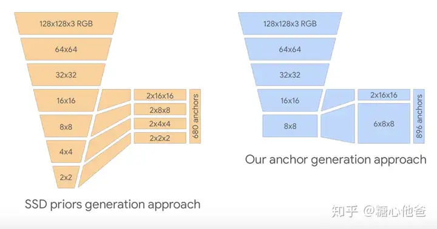


#### Paddle 代码分析


```
# 定义前5个BlazeBlock信息【输入通道，输出通道，stride】。
blaze_filters: [[24, 24], [24, 24], [24, 48, 2], [48, 48], [48, 48]]
# 定义后6个Double BlazeBlock信息 
# 【inp, oup, double_oup，stride】
double_blaze_filters: [[48, 24, 96, 2], [96, 24, 96], [96, 24, 96],
                          [96, 24, 96, 2], [96, 24, 96], [96, 24, 96]]
act: relu  # 激活函数
```

```
# 输入[8, 3, 640, 640]
Conv1 = ConvBNLayer(
  (_conv): Conv2D(3, 24, kernel_size=[3, 3], stride=[2, 2], padding=1, data_format=NCHW)
  (_batch_norm): BatchNorm2D(num_features=24, momentum=0.9, epsilon=1e-05)
) # [8, 24, 320, 320 ]

Conv2 = BlazeBlock(
  (blaze_01_dw): ConvBNLayer(
    (_conv): Conv2D(24, 24, kernel_size=[5, 5], padding=2, groups=24, data_format=NCHW)
    (_batch_norm): BatchNorm2D(num_features=24, momentum=0.9, epsilon=1e-05)
  )
  (conv_pw): ConvBNLayer(
    (_conv): Conv2D(24, 24, kernel_size=[1, 1], data_format=NCHW)
    (_batch_norm): BatchNorm2D(num_features=24, momentum=0.9, epsilon=1e-05)
  )
)  # [8, 24, 320, 320 ] 
# F.relu(paddle.add(input, output))
Conv3  同上   # [8, 24, 320, 320 ] 
Conv4 = BlazeBlock(
  (blaze_21_dw): ConvBNLayer(
    (_conv): Conv2D(24, 24, kernel_size=[5, 5], stride=[2, 2], padding=2, groups=24, data_format=NCHW)
    (_batch_norm): BatchNorm2D(num_features=24, momentum=0.9, epsilon=1e-05)
  ) # [8, 24, 160, 160 ] 
  (conv_pw): ConvBNLayer(
    (_conv): Conv2D(24, 48, kernel_size=[1, 1], data_format=NCHW)
    (_batch_norm): BatchNorm2D(num_features=48, momentum=0.9, epsilon=1e-05)
  ) # [8, 48, 160, 160 ] 
  
  (blaze_2_shortcut_pool): MaxPool2D(kernel_size=2, stride=2, padding=0) # [8, 24, 320, 320 ] --> [8, 24, 160, 160 ] 
  (blaze_2_shortcut_conv): ConvBNLayer(
    (_conv): Conv2D(24, 48, kernel_size=[1, 1], data_format=NCHW)
    (_batch_norm): BatchNorm2D(num_features=48, momentum=0.9, epsilon=1e-05)
  ) # [8, 24, 160, 160 ] --> [8, 48, 160, 160 ]
) 
# F.relu(paddle.add(input, output))
Conv5 同Conv3  # [8, 48, 160, 160 ]
Conv6 同Conv3  # [8, 48, 160, 160 ]

Conv7 = BlazeBlock(
  (double_blaze_01_dw): ConvBNLayer(
    (_conv): Conv2D(48, 48, kernel_size=[5, 5], stride=[2, 2], padding=2, groups=48, data_format=NCHW)
    (_batch_norm): BatchNorm2D(num_features=48, momentum=0.9, epsilon=1e-05)
  ) # [8, 48, 80, 80 ]
  (conv_pw): ConvBNLayer(
    (_conv): Conv2D(48, 24, kernel_size=[1, 1], data_format=NCHW)
    (_batch_norm): BatchNorm2D(num_features=24, momentum=0.9, epsilon=1e-05)
  ) # [8, 24, 80, 80 ]
  (double_blaze_02_dw): ConvBNLayer(
    (_conv): Conv2D(24, 24, kernel_size=[5, 5], padding=2, groups=24, data_format=NCHW)
    (_batch_norm): BatchNorm2D(num_features=24, momentum=0.9, epsilon=1e-05)
  )  # [8, 24, 80, 80 ]
  (conv_pw2): ConvBNLayer(
    (_conv): Conv2D(24, 96, kernel_size=[1, 1], data_format=NCHW)
    (_batch_norm): BatchNorm2D(num_features=96, momentum=0.9, epsilon=1e-05)
  ) # [8, 96, 80, 80 ]
  
   # [8, 48, 160, 160 ] --> [8, 48, 80, 80 ]
  (double_blaze_0_shortcut_pool): MaxPool2D(kernel_size=2, stride=2, padding=0)
  # [8, 48, 160, 160 ] --> [8, 96, 80, 80 ]
  (double_blaze_0_shortcut_conv): ConvBNLayer(
    (_conv): Conv2D(48, 96, kernel_size=[1, 1], data_format=NCHW)
    (_batch_norm): BatchNorm2D(num_features=96, momentum=0.9, epsilon=1e-05)
  )
)
# F.relu(paddle.add(input, output)) -> [8, 96, 80, 80 ]

Conv8 同上 但是没有shortcut_pool # [8, 96, 80, 80 ]
Conv9 同上 # [8, 96, 80, 80 ]
Conv10 同 Conv7  # [8, 96, 40, 40 ]
conv11 同 Conv8 # [8, 96, 40, 40 ] 
Conv12 同上  # [8, 96, 40, 40 ]
# 最终返回Conv12 和Conv9 [8,96,80,80] [8,96,40,40]
```


```
self.conv1 = conv_bn(3, 24, stride=2)
self.conv2 = BlazeBlock(24, 24)
self.conv3 = BlazeBlock(24, 24)
self.conv4 = BlazeBlock(24, 48, stride=2)
self.conv5 = BlazeBlock(48, 48)
self.conv6 = BlazeBlock(48, 48)
self.conv7 = BlazeBlock(48, 24, 96, stride=2)
self.conv8 = BlazeBlock(96, 24, 96)
self.conv9 = BlazeBlock(96, 24, 96)
self.conv10 = BlazeBlock(96, 24, 96, stride=2)
self.conv11 = BlazeBlock(96, 24, 96)
self.conv12 = BlazeBlock(96, 24, 96)
```


### BlazeFace_FPN_SSH


利用上下文信息可以进一步提高模型的检测性能。SSH是将上下文信息用于单阶段人脸检测模型的早期方案

SSH(Single Stage Headless Face Detector)人脸检测算法中的上下文模块：

SSH中的上下文模块也是特征融合的的一种。上下文网络模块的作用是用于增大感受野，一般在two-stage 的目标检测模型当中，都是通过增大候选框的尺寸大小以合并得到更多的上下文信息，SSH通过单层卷积层的方法对上下文（context）信息进行了合并，其结构图如下图所示：

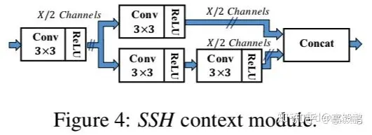

通过2个3✖️3的卷积层和3个3✖️3的卷积层并联，从而增大了卷积层的感受野，并作为各检测模块的目标尺寸。通过该方法构造的上下文的检测模块比候选框生成的方法具有更少的参数量，并且上下文模块可以在WIDER数据集上的AP提升0.5个百分点 。

我们可以看到SSH是多个并联3*3卷积的方式提升感受野，但是这样操作计算量还是比较大的。

```
        conv0 = self.conv0_ssh(x)
        conv1 = self.conv1_ssh(conv0)
        conv2 = self.conv2_ssh(conv1)
        conv3 = self.conv3_ssh(conv2)
        conv4 = self.conv4_ssh(conv3)
        concat = paddle.concat([conv0, conv2, conv4], axis=1)
        return F.relu(concat)
```


### 人脸识别

#### Arcface

预训练模型

Model| structure|	lfw	cfp_fp|	agedb30	|CPU time cost|	GPU time cost|
---|---|---|---|---|---|
MobileFace-Paddle|	0.9952|	0.9280|	0.9612|	4.3ms|	2.3ms

https://paddle-model-ecology.bj.bcebos.com/model/insight-face/mobileface_v1.0_infer.tar


Mode | Datasets | Backbone | Precision | DataFormat | Ratio | agedb30 | cfp_fp | lfw | checkpoint&log
|---|---|---|---|---|---|---|---|---|---|
| Dynamic | MS1MV3 | MobileFaceNet | FP32 | NCHW | 0.1 | 0.96200 | 0.96571 | 0.99567 | [download](https://plsc.bj.bcebos.com/pretrained_model/MS1M_v3_arcface_MobileFaceNet_dynamic_0.1_NCHW_FP32_v2.2.tgz) |
| Dynamic | MS1MV3 | MobileFaceNet | FP32 | NCHW | 1.0 | 0.96167 | 0.96657 | 0.99533 | [download](https://plsc.bj.bcebos.com/pretrained_model/MS1M_v3_arcface_MobileFaceNet_dynamic_1.0_NCHW_FP32_v2.2.tgz)|


- MobileFaceNet 
- SlimFaceNet


#### AdaFace

本文作者提出了一种新的损失函数，来通过图像质量强调不同的困难样本的重要性。主要采用自适应边缘函数，实现了使用feature norms来近似图像质量的方法。该方法在多个数据集上提高了现有（SOTA）的人脸识别性能


高质量和低质量的图像都包含姿态、遮挡和分辨率的变化，这些变化有时会使识别任务变得困难，但仍然是可实现的。根据退化程度，一些图像可能变得无法识别。通过研究这些图像在训练中的不同影响，这项工作旨在设计一种新型损失函数，该函数能够根据图像质量自适应于样本的可识别性

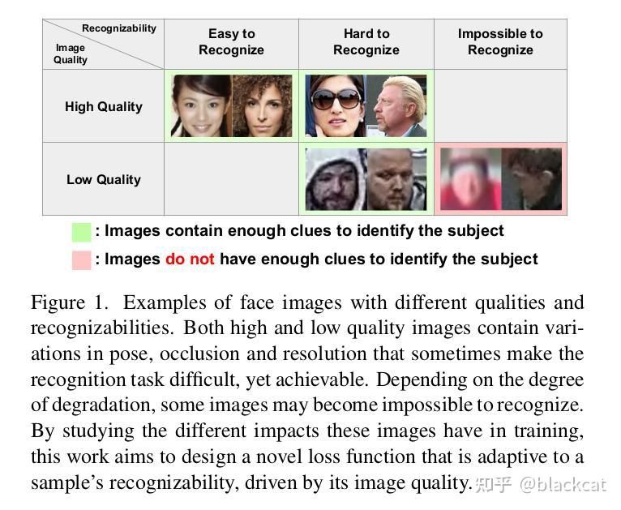

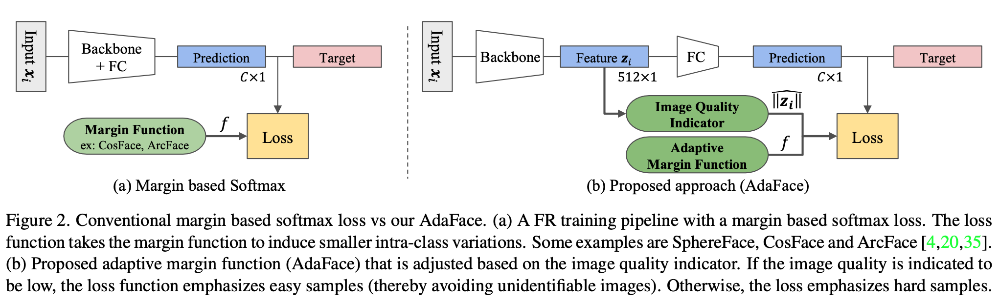


**图片质量描述**

论文通过实验证明特征的范数和图片质量之间有较高的相关度，所以本文使用特征的范数作为图片质量的衡量指标.按照BRISQUE定义，BRISQUE越小图片质量越高，因此特征范数越小说明图像质量越好。

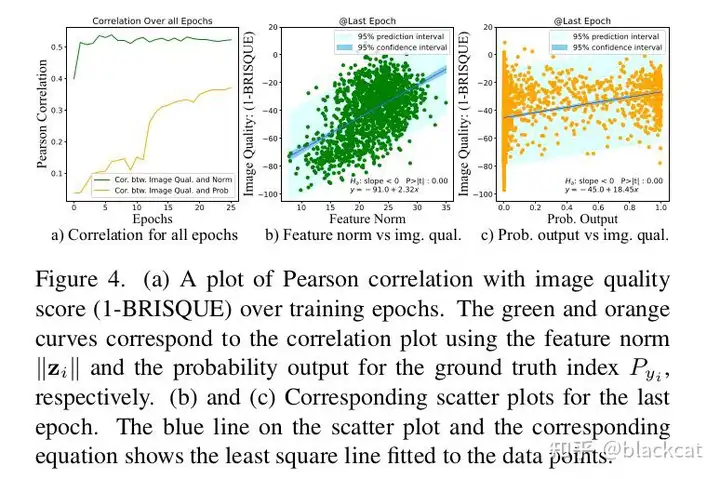

- (a) Pearson相关性随图像质量评分（1-BRISQUE）在训练周期中的变化图。绿色和橙色曲线分别表示使用特征范数$||\hat z_i||$和真实索引$||P_{yi}||$的概率输出的相关性图

- (a)中显示了特征范数与图像质量( 1-brisque )作为绿色曲线计算的图像质量(IQ)得分之间的相关图。从训练数据集随机抽取1534张图像(MS1MV2)并使用预先训练好的模型计算 特征范数 。在最后一个阶段， 特征规范 与 IQ score 之间的相关性得分达到0.5235（超过−1和1）

- (a)中还展示了概率输出 与 IQ score 之间的相关图，其曲线为 橙色曲线 。注意，特征范数的相关性总是比其高。此外，特征范数与 IQ score 之间的相关性在训练的早期阶段是可见的。这对于使用 特征范数 作为 图像质量的代理 是一个有用的属性，因为可以依赖于训练的早期阶段的代理

- (b) 和 (c) 为最后周期的相应散点图。散点图上的蓝线及其对应的方程表示拟合到数据点的最小平方线
- (b)所示, 特征范数 和 IQ score 之间的高相关性支持了使用 特征范数 作为 图像质量 的代理

- (c)中展示了输出与 IQ score 之间的散点图。注意， 输出 和 图像质量 之间存在非线性关系。描述样本难度的一种方法是使用 ，图中显示了样本难度的分布随图像质量的不同而不同。因此， 根据难度调整样本重要性 时考虑图像质量是有意义的


**Adaptive Margin based on Norm**

为了解决不可识别图像引起的问题，作者提出基于特征范数来适应 Margin 函数。使用不同的 Margin 函数可以强调样本的不同困难成都。另外，观察到特征规范是寻找低质量图像的好方法。

但具体实现中，不是直接用BRISQUE思路评估质量，而是假设数据集中大部分数据是高质量的，基于整个数据集BRISQUE构造一个高斯分布，偏离较大的图就是质量较差的图。如下采用一个batch内的特征范数作截断归一化，确保 $||\hat z_i|| \in [-1,1]$
 ，作为图片质量描述，参与计算loss

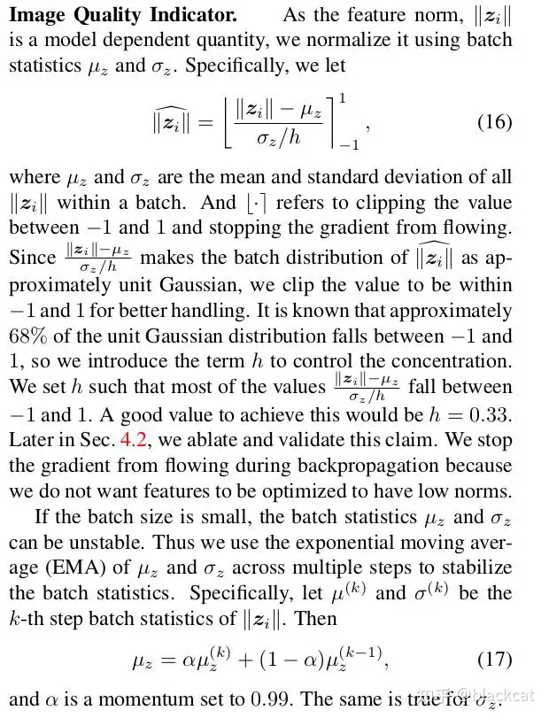


图像质量指标

作为特征范数$||\hat z_i||$， 是一个模型依赖的量，使用batch统计$\mu_z$和$\sigma_z$对其进行归一化。具体来说

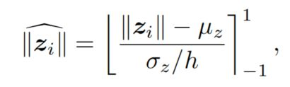

其中，$\mu_z$和$\sigma_z$为一个batch内所有$||z_i||$的平均值和标准差。[ ]是指在−1和1之间裁剪值，阻止梯度流动。

由于$ \frac {||z_i|| - \mu_z} {\sigma_z/h} $ 将 $||\hat z_i||$的 Batch分布近似为单位高斯分布 ，因此将该值剪辑在−1和−1范围内，以便更好地处理。

已知，大约68%的单位高斯分布落在−1和1之间，因此引入项 h 来控制集中度 。设置h，使大多数值落在−1和1之间。实现这一点的将是 h=0.33 （99.7%都落在-1和1之间）

如果 Batch size 较小，则Batch统计信息$\mu_z$和$\sigma_z$可能不稳定。因此，使用$\mu_z$和$\sigma_z$跨多个步骤的指数移动平均数(EMA)来稳定Batch统计数据。具体来说，设$\mu^k$ 和$\sigma^k$是$|| z_i||$ 的第k步批统计。然后:

```math

  \mu_z = \alpha\mu_z^k + (1-\alpha)\mu_z^{k-1} 
```


α的动量设定为0.99。对于$\sigma_z$也是如此


**我们在反向传播过程中阻止梯度流动，因为我们不希望被优化为具有较低的特征规范**


**margin Based Loss Function**

基于Margin的softmax损失函数被广泛应用于人脸识别训练中(FR)。在Softmax损失中加入了Margin，是因为加入Margin后模型可以学习到更好的类间表征和类内表征，特征也就更具有可判别性。典型的形式有： SphereFace 、 CosFace 和 ArcFace 引入了不同形式的 Margin函数 。具体来说，它可以t同意写成


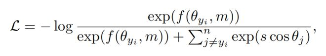

式中， θ 为特征向量与第$j^{th}$个分类器权值向量之间的夹角， $y_i$为Ground Truth(GT)的索引，m为 Margin 是一个标量超参数。 $f$是一个边际函数，其中, SphereFace 、 CosFace 和 ArcFace 可以用一下3中不同的 Margin函数 表达

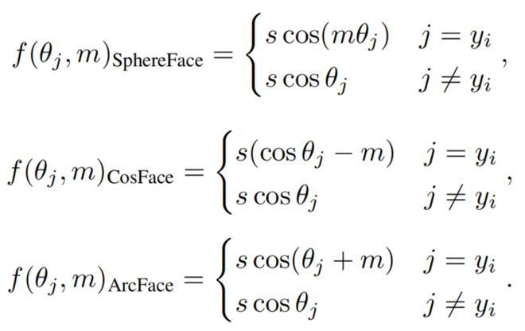


https://arxiv.org/html/2312.05281v2

有时， ArcFace 被称为 angular margin ，而CosFace被称为 additive margin 。这里s是一个用于缩放的超参数。 P2SGrad 中注意到 m 和 s 是敏感的超参数，并建议直接修改梯度，使其没有 m 和 s 超参数

AdaFace 旨在将 Margin 建模为图像质量的函数，因为 影响在训练过程中哪些样本贡献了更多的梯度(即学习信号)。

ArcFace/CosFace等margin based loss可以统一到如下的公式中，其中$θ_j$表示某个样本和第j个类别对应的权重的夹角. $θ_j$越小, $cosθ_j$ 越大,表示样本越可能属于类别j.

其中 SphereFace的margin是和θ相乘, CosFace的margin是和 θ
 相减，ArcFace的margin是和θ像加.


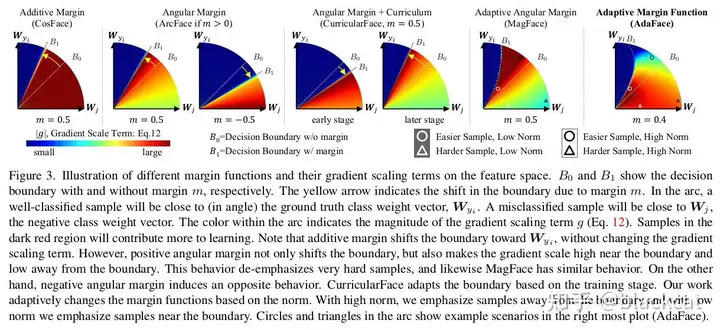

- 不同边距函数及其在特征空间上的梯度尺度项的示意图。B0和B1分别表示有边距和无边距的决策边界。黄色箭头表示由于边距m导致的边界移动。在图中，一个被正确分类的样本将在角度上与真实类别权重向量$W_{y_i}$接近。一个被错误分类的样本将接近$W_j$，即负类别权重向量。弧内的颜色表示梯度尺度项g的大小。处于深红色区域的样本将对学习做出更多贡献。加性边距(additive margin)会使边界向$W_{y_i}$移动，但不会改变梯度尺度项。然而，正角度边距不仅移动边界，还会使边界附近的梯度尺度变高，远离边界时变低。这种行为淡化了非常难的样本，同样，MagFace也有类似的行为。另一方面，负角度边距则产生相反的行为，根据范数自适应地改变边距函数。在高范数时，我们强调远离边界的样本；在低范数时，我们强调靠近边界的样本。弧中的圆圈和三角形显示了最右侧图（AdaFace）中的示例场景。


**Adaptive Loss Functions**


许多研究在训练目标中引入了适应性元素，用于 hard sample mining 、训练期间的调度困难或寻找最优超参数。例如， CurricularFace 将 课程学习 的思想引入到损失函数中。在训练的最初阶段， (负余弦相似度)的 Margin 被设置为很小，以便容易样本的学习，在后期阶段， Margin 被增加，以便 Hard样本 可以学习。具体来说，它被写成:

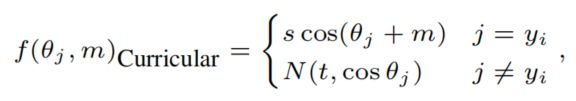

其中，

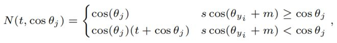


而t是一个随着训练的进展而增加的参数。因此，在 CurricularFace 中， Margin 的适应性是基于训练的进展（Curricular）。

相反，作者认为 Margin 的适应性应该基于图像质量。在高质量的图像，如果样本是很困难的(对模型)，网络应该学会利用图像中的信息；但在低质量的图像，如果样本是很困难的，它更有可能是缺乏适当的身份的线索，那么网络不应该去学习相关的特征。


 MagFace 探索了基于可识别性应用不同 Margin 的想法。它在 high norm features 易于识别的前提下，对 high norm features 应用大角度 Margin 。大 Margin 推动 high norm features 更接近 class中心 。然而，它并没有强调困难的训练样本，但是这些困难样本对学习鉴别特征也很重要。

同样值得一提的是， DDL 使用蒸馏损失来最小化简单和困难样本特征之间的差距。

**低质量图像的人脸识别**

最近的 FR模型 在人脸属性可识别的数据集上取得了较高性能，例如 LFW 、 CFP-FP 、 CPLFW 、 AgeDB 和 CALFW 。当 FR模型 学习不受 光照 、 年龄 或 姿态变化 影响的鉴别特征时，可以在这些数据集上获得良好的性能


然而，在不受约束的情况下，如监控或低质量的视频，FR便会带来很多的问题。这种配置下的数据集包括 IJB-B 、 IJB-C 和 IJB-S ，其中大多数图像质量很低，有些甚至不包含足够的身份信息，即使是对人工检查人员来说。良好表现的关键包括:

> 学习低质量图像的可鉴别特征; 学习丢弃包含少量识别线索的图像(质量感知融合)。


为了进行质量感知融合，人们提出了概率方法来预测FR表示中的不确定性。假设特征是分布，其中方差可以用来计算预测的确定性。然而，由于训练目标的不稳定性，概率方法会分别采用学习 均值 和 方差 ，这在训练过程中并不简单，因为 方差 是用一个固定的 均值 来优化的。然而， AdaFace 是对传统的 softmax损失 的一个修改，使框架易于使用。此外， AdaFace 使用 feature norms 作为 质量感知融合 过程中预测质量的代理。


合成数据 或 数据扩充 可以用来模拟低质量的数据。有方法通过训练人脸属性标记器生成训练数据的伪标签。这些辅助步骤只会使训练过程复杂化，并使其难以推广到其他数据集或领域。 AdaFace 方法只涉及简单的 裁剪 、 模糊 和 光照增强 ，这也适用于其他数据集和域。

**Adaptive Margin Function**


adaFace的loss根据图片质量$|| \hat  z_i||$ 的取值不同而调整Positive sample 损失，当图片质量比较高，$|| \hat  z_i||$ = 0 当图片质量较差时 $|| \hat  z_i|| \in (-1, 1)$ 

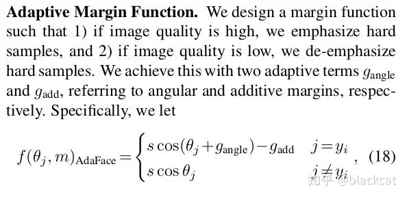

作者设计了一个 Margin 函数
- 如果图像质量高，强调困难样本 
- 如果图像质量低，不强调困难样本

用2个自适应项$g_{angle}$ 和 $g_{add}$ 来实现这一点，分别指 angular margin 和 additive margins 。具体来说:

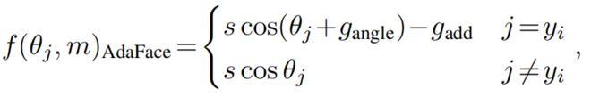

其中$g_{angle}$ 和 $g_{add}$ 是$|| \hat  z_i||$ 的函数

```math

g_{angle} = -m * || \hat  z_i|| \\
g_{add} = m * || \hat  z_i|| + m

```

请注意，当$|| \hat  z_i||$=−1时，建议的函数变成了 ArcFace 。当 $|| \hat  z_i||$=0时，它就变成了 CosFace 。当$|| \hat  z_i||$ =1时，它变成了 negative angular margin 。


**消融实验**

图像质量指标h的影响

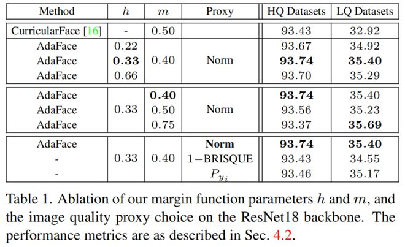


如表1所示。当h=0.33时，模型表现最佳。当h=0.22或h=0.66时，成绩仍然高于curriculum face。只要把h设置成类似的情况， 就仅仅只是一些变化，h不是很敏感。这里设h=0.33


超参数m的影响

Margin m既对应于 angular margin 的最大范围，也对应于 additive margins 的大小。从表1可以看出：

    对于HQ数据集，m=0.4时性能最好，

    对于LQ数据集，m=0.75时性能最好。

m越大，基于图像质量的 angular margin 变化也越大，自适应能力越强。在后续的实验中，选择m=0.4，因为它在LQ数据集上有很好的性能，而在HQ数据集上又不牺牲性能

https://www.163.com/dy/article/H7GTETSI0511DPVD.html


**主干网络** 


```
AdaFace_IR_18
AdaFace_IR_34
AdaFace_IR_50
AdaFace_IR_101
AdaFace_IR_152
AdaFace_IR_200  # ir
AdaFace_IR_SE_50    # ir_se
AdaFace_IR_SE_101   # ir_se
AdaFace_IR_SE_152   # ir_se
AdaFace_IR_SE_200   # ir_se
```

- AdaFace_IR_18

  - 经过一个输入层，通过变成64， 激活函数为PReLU

  ```
      (input_layer): Sequential(
        (0): Conv2D(3, 64, kernel_size=[3, 3], padding=1, data_format=NCHW)
        (1): BatchNorm2D(num_features=64, momentum=0.9, epsilon=1e-05)
        (2): PReLU(num_parameters=64, data_format=NCHW, init=0.25, dtype=float32)
      )
  ```

  - 经过一个输出层,全连接输出特征为512，归一化、随机0.4的Dropout、平铺Flatten、

  ```
    (output_layer): Sequential(
      (0): BatchNorm2D(num_features=512, momentum=0.9, epsilon=1e-05)
      (1): Dropout(p=0.4, axis=None, mode=upscale_in_train)
      (2): Flatten()
      (3): Linear(in_features=25088, out_features=512, dtype=float32)
      (4): BatchNorm1D(num_features=512, momentum=0.9, epsilon=1e-05, data_format=NCL)
    )
  ```

**AdaFace_IR_18**

|BasicBlockIR| operator | kernel | stripe | padding | input | output|
| --- | --- | --- | --- | --- |---|---|
|input |Conv2D  | 3*3 | 1 |  1|  [N,3,112,112] |[N,64,112,112]|
|BasicBlockIR0_0| MaxPool2D | 1*1 | 2 | 0 | [N,64,112,112] |[N,64,56,56]|
|BasicBlockIR0_1  | BatchNorm2D |  |  |  |[N,64,112,112]|[N,64,112,112]|
|  | Conv2D | 3*3 | 1 | 1|[N,64,112,112]|[N,64,112,112]|
|  | BatchNorm2D |  |  |  |[N,64,112,112]|[N,64,112,112]|
|  | PReLU |  |  |  |
|  | Conv2D | 3*3 | 2 | 1 |[N,64,112,112]|[N,64,56,56]|
|  | BatchNorm2D |  |  |  |[N,64,56,56]|[N,64,56,56]|
|BasicBlockIR0_0 + BasicBlockIR0_1||||||[N,64,56,56]|
|BasicBlockIR1_0| MaxPool2D | 1*1 | 1 | 0 | [N,64,56,56] |[N,64,56,56]|
|BasicBlockIR1_1  | BatchNorm2D |  |  |  |[N,64,56,56]|[N,64,56,56]|
|  | Conv2D | 3*3 | 1 | 1|[N,64,56,56]|[N,64,56,56]|
|  | BatchNorm2D |  |  |  |[N,64,56,56]|[N,64,56,56]|
|  | PReLU |  |  |  |
|  | Conv2D | 3*3 | 1 | 1 |[N,64,56,56]|[N,64,56,56]|
|  | BatchNorm2D |  |  |  |[N,64,56,56]|[N,64,56,56]|
|BasicBlockIR1_0 + BasicBlockIR1_1||||||[N,64,56,56]|
|BasicBlockIR2_0| Conv2D | 1*1 | 2 | 0 | [N,64,56,56] |[N,128,28,28]|
|BasicBlockIR2_0| BatchNorm2D |  | |  | [N,128,28,28] |[N,128,28,28]|
|BasicBlockIR2_1  | BatchNorm2D |  |  |  |[N,64,56,56]|[N,64,56,56]|
|  | Conv2D | 3*3 | 1 | 1|[N,64,56,56]|[N,128,56,56]|
|  | BatchNorm2D |  |  |  |[N,128,56,56]|[N,128,56,56]|
|  | PReLU |  |  |  |
|  | Conv2D | 3*3 | 2 | 1 |[N,128,56,56]|[N,128,28,28]|
|  | BatchNorm2D |  |  |  |[N,128,28,28]|[N,128,28,28]|
|BasicBlockIR2_0 + BasicBlockIR2_1||||||[N,128,28,28]|
|BasicBlockIR3_0| MaxPool2D | 1*1 | 1 | 0 | [N,128,28,28] |[N,128,28,28]|
|BasicBlockIR3_1  | BatchNorm2D |  |  |  |[N,128,28,28]|[N,128,28,28]|
|  | Conv2D | 3*3 | 1 | 1|[N,128,28,28]|[N,128,28,28]|
|  | BatchNorm2D |  |  |  |[N,128,28,28]|[N,128,28,28]|
|  | PReLU |  |  |  |
|  | Conv2D | 3*3 | 1 | 1 |[N,128,28,28]|[N,128,28,28]|
|  | BatchNorm2D |  |  |  |[N,128,28,28]|[N,128,28,28]|
|BasicBlockIR3_0 + BasicBlockIR3_1||||||[N,128,28,28]|
|BasicBlockIR4_0| Conv2D | 1*1 | 2 | 0 | [N,128,28,28] |[N,256,14,14]|
|BasicBlockIR4_0| BatchNorm2D |  | |  | [N,256,14,14]|[N,256,14,14]|
|BasicBlockIR4_1  | BatchNorm2D |  |  |  |[N,128,28,28]|[N,128,28,28]|
|  | Conv2D | 3*3 | 1 | 1|[N,128,28,28]|[N,128,28,28]|
|  | BatchNorm2D |  |  |  |[N,128,28,28]|[N,128,28,28]|
|  | PReLU |  |  |  |
|  | Conv2D | 3*3 | 2 | 1 |[[N,128,28,28]|[N,128,14,14]|
|  | BatchNorm2D |  |  |  |[N,256,14,14]|[N,256,14,14]|
|BasicBlockIR4_0 + BasicBlockIR4_1||||||[N,256,14,14]|
|BasicBlockIR5_0| MaxPool2D | 1*1 | 1 | 0 | [N,256,14,14] |[N,256,14,14]|
|BasicBlockIR5_1  | BatchNorm2D |  |  |  |[N,256,14,14]|[N,256,14,14]|
|  | Conv2D | 3*3 | 1 | 1|[N,256,14,14]|[N,256,14,14]|
|  | BatchNorm2D |  |  |  |[N,256,14,14]|[N,256,14,14]|
|  | PReLU |  |  |  |
|  | Conv2D | 3*3 | 1 | 1 |[N,256,14,14]|[N,256,14,14]|
|  | BatchNorm2D |  |  |  |[N,256,14,14]|[N,256,14,14]|
|BasicBlockIR5_0 + BasicBlockIR5_1||||||[N,256,14,14]|
|BasicBlockIR6_0| Conv2D | 1*1 | 2 | 0 | [N,256,14,14] |[N,512,7,7]|
|BasicBlockIR6_0| BatchNorm2D |  | |  | [N,512,7,7]|[N,512,7,7]|
|BasicBlockIR6_1  | BatchNorm2D |  |  |  |[N,256,14,14]|[N,256,14,14]|
|  | Conv2D | 3*3 | 1 | 1|[N,256,14,14]|[N,256,14,14]|
|  | BatchNorm2D |  |  |  |[N,256,14,14]|[N,256,14,14]|
|  | PReLU |  |  |  |
|  | Conv2D | 3*3 | 2 | 1 |[N,256,14,14]|[N,512,7,7]|
|  | BatchNorm2D |  |  |  |[N,512,7,7]|[N,512,7,7]|
|BasicBlockIR6_0 + BasicBlockIR6_1||||||[N,512,7,7]|
|BasicBlockIR7_0| MaxPool2D | 1*1 | 1 | 0 | [N,512,7,7] |[N,512,7,7]|
|BasicBlockIR7_1  | BatchNorm2D |  |  |  |[N,512,7,7]|[N,512,7,7]|
|  | Conv2D | 3*3 | 1 | 1|[N,512,7,7]|[N,512,7,7]|
|  | BatchNorm2D |  |  |  |[N,512,7,7]|[N,512,7,7]|
|  | PReLU |  |  |  |
|  | Conv2D | 3*3 | 1 | 1 |[N,512,7,7]|[N,512,7,7]|
|  | BatchNorm2D |  |  |  |[N,512,7,7]|[N,512,7,7]|
|BasicBlockIR7_0 + BasicBlockIR7_1||||||[N,512,7,7]|
|output|BatchNorm2D||||[N,512,7,7]|[N,512,7,7]|
||Dropout(p=0.4)||||[N,512,7,7]|[N,512,7,7]|
||Flatten||||[N,512,7,7]| [N,512x7x7]|
||Linear||||[N,512x7x7]|[N,512]|
||BatchNorm2D||||[N,512]|[N,512]|


**head**

```
  Head:
    name: "AdaMargin"  
    embedding_size: 512
    class_num: 1000
    m: 0.4
    s: 64
    h: 0.333
    t_alpha: 0.01
```
论文通过实验证明特征的范数和图片质量之间有较高的相关度，所以本文使用特征的范数作为图片质量的衡量指标.按照BRISQUE定义，BRISQUE越小图片质量越高，因此特征范数越小说明图像质量越好。


**CEloss**

交叉熵损失
