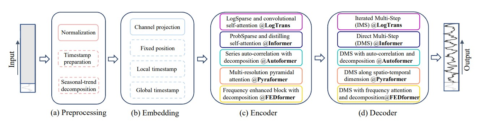
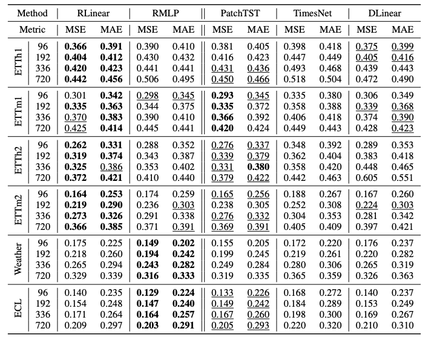
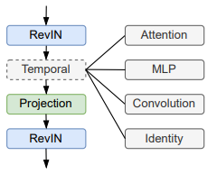

### 时间序列
长期时间序列预测（LTSF）

Transformers的主要工作动力来自于它的多头自注意机制，它具有显著的提取长序列元素之间语义相关性的能力（例如，文本中的单词或图像中的二维patches）。 然而，自我注意在一定程度上具有排列不变性和“反序性”。虽然使用各种类型的位置编码技术可以保留一些有序信息，但在其上加上自注意后，仍然不可避免地存在时间信息丢失。对于语义丰富的应用程序，如NLP，这通常不是一个严重的问题，例如，即使我们重新排序其中的一些单词，句子的语义也会在很大程度上保留下来。然而，在分析时间序列数据时，通常数值数据本身缺乏语义，我们主要感兴趣的是对连续点之间的时间变化进行建模。也就是说，秩序本身起着最关键的作用。因此，我们提出了以下有趣的问题：**Transformers对长期时间序列预测真的有效吗？**

这些解决方案在预测准确性方面相较于传统方法有了显著提升。在他们的实验中，所有被比较的（非 Transformer）基准模型都采用自回归或迭代多步（IMS）预测[1,2,22,24]，而这些方法对于长时序列预测（LTSF）问题来说，众所周知会遭受严重的误差累积效应。因此，在这项工作中，我们用直接多步骤（DMS）预测策略挑战基于Transformer的LTSF解决方案，以验证其真实性能。

并非所有的时间序列都是可预测的，更不用说长期预测了（例如，对于chaotic系统）。我们假设长期预测只适用于那些趋势和周期性相对明显的时间序列。由于线性模型已经可以提取这些信息，我们引入了一组令人尴尬的简单模型，称为LTSF-Linear，作为比较的新基线。LTSF-Linear用单层线性模型对历史时间序列进行回归，直接预测未来时间序列。我们在九个广泛使用的基准数据集上进行了广泛的实验，这些数据集涵盖了各种现实生活中的应用：交通、能源、经济、天气和疾病预测。令人惊讶的是，我们的结果表明
LTSF-Linear在所有情况下都优于现有的基于Transformer的复杂模型，并且通常有很大的优势（20%～50%)。此外，我们发现，与现有的transformer中的声明相反，它们中的大多数不能从长序列中提取时间关系，即随着look-back窗口大小的增加，预测误差并没有减少（有时甚至增加）。最后，我们对现有的基于Transformer的TSF解决方案进行了各种消融实验，以研究其中各种设计元素的影响。

综上所述，我们得出结论，transformer对时间序列的时间建模能力被夸大了，至少对于现有的LTSF基准来说是这样。

将普通Transformer模型应用于LTSF问题存在一些局限性，包括原始自注意方案的二次时间/内存复杂度和自回归解码器设计引起的误差累积。Informer[30]解决了这些问题，并提出了一种具有较低复杂性和DMS预测策略的新颖Transformer体系结构。后来，更多的Transformer变体在其模型中引入了各种时间序列特征以提高性能或效率[18,28,31]。我们将现有的基于变压器的LTSF解决方案的设计元素总结如下



> 现有的基于Transformer的TSF解决方案的管道。在(a)和(b)中，实线框为基本操作，虚线框为可选应用。(c)和(d)对于不同的方法是不同的[16,18,28,30,31]


**时间序列分解**：对于数据预处理，零均值归一化在TSF中很常见。除此之外,自耦器[28]首先在每个神经块后面应用季节趋势分解，这是时间序列分析中的标准方法，使原始数据更具可预测性[6,13]。具体来说，他们在输入序列上使用移动平均核来提取时间序列的趋势周期成分。将原始序列与趋势分量之差作为季节分量。在Autoformer分解方案的基础上，FEDformer[31]进一步提出了混合专家策略，将不同核大小的移动平均核提取的趋势分量进行混合。

**输入嵌入策略**：Transformer体系结构中的自关注层不能保存时间序列的位置信息。然而，局部位置信息，即时间序列的排序，是重要的。此外，全局时间信息，如分层时间戳（周、月、年）和不可知时间戳（节假日和活动），也是一个信息丰富的[30] 。为了增强时间序列输入的时间上下文，基于SOTA变换的方法的一个实用设计是在输入序列中注入几个嵌入，如固定位置编码、通道投影嵌入和可学习的时间嵌入。此外，还引入了带有时间卷积层[16]或可学习时间戳[28]的时间嵌入。

**self-attention 方案**：Transformers依靠自关注机制来提取成对元素之间的语义依赖关系。出于降低原始 Transformer 的 O(L2) 时间和内存复杂度的考虑，近期的研究提出了两种提高效率的策略。
一方面，LogTrans和Pyraformer明确地在自关注方案中引入了稀疏性偏差。具体而言，LogTrans 使用 LogSparse 标签来
将计算复杂度降低至 O(LlogL)；而 Pyraformer 则采用了金字塔注意力机制，能够以 O(L) 的时间复杂度和内存复杂度来捕捉具有层次结构的多尺度时间依赖关系。另一方面，Informer 和 FEDformer 利用了自注意力矩阵中的低秩特性。Informer 提出了一个概率稀疏自注意力机制和一个自注意力提炼操作，以将复杂度降低至 O (LlogL)，而 FEDformer 设计了傅里叶增强块和小波增强块，并通过随机选择来实现 O (L) 的复杂度。最后，Autoformer设计了一种串联自相关机制来取代原有的自关注层。

**解码**：普通的Transformer解码器以自回归的方式输出序列，导致推理速度慢和错误积累效应，特别是对于长期预测。Informer为DMS预测设计了一种生成式解码器。其他Transformer变体采用类似的DMS策略。例如，Pyraformer使用一个连接时空轴的全连接层作为解码器。Autoformer将趋势周期分量和季节分量的叠加自相关机制两种特征进行精细化分解，得到最终预测结果。FEDformer还使用一种分解方案与提出的频率注意块解码最终结果。


LTSF-Linear是一组线性模型。Vanilla Linear是一个单层线性模型。为了处理跨不同领域（例如，金融、交通和能源领域）的时间序列，我们进一步引入了两种具有两种预处理方法的变体，称为DLinear和NLinear。

- 具体来说，DLinear是一种结合了Autoformer和FEDformer中使用的线性层分解方案。它首先通过移动平均核和剩余（季节）分量将原始数据输入分解为趋势分量。然后，对每个分量应用两个单层线性层，将两个特征相加得到最终的预测结果。通过显式地处理趋势，当数据中有明显的趋势时，DLinear增强了普通线性的性能

- 同时，为了提高LTSF-Linear在数据集中出现分布移位时的性能，NLinear首先用序列的最后一个值减去输入。然后，输入经过一个线性层，在进行最终预测之前，将减去的部分加回来。在 NLinear 中，减法和加法操作是对输入序列的一种简单归一化处理。

#### 实验设置

##### 数据集

我们在九个广泛使用的真实世界数据集上进行了广泛的实验，包括ETT（电力）变压器温度[30](ETTh1, ETTh2, ETTm1，交通、电力、天气、ILI、外汇b[15]。它们都是多元时间序列。我们在附录中留下了数据描述。 

##### 评估度量

我们使用均方误差（MSE）和平均绝对值误差（MAE）作为比较性能的核心指标。

##### 损失

损失为mse，用于计算预测值和目标值的均方差误差


##### 代码

两个单层线性层初始化权重

```
# layer Linear(in_features=96, out_features=96, dtype=float32)
nn.initializer.KaimingUniform(
    negative_slope=math.sqrt(5), nonlinearity='leaky_relu')(layer.weight)
```
> https://www.jb51.net/python/2977049ts.htm


移动平均块来突出时间序列的趋势

```python

class moving_avg(paddle.nn.Layer):
    """
    Moving average block to highlight the trend of time series
    """

    def __init__(self, kernel_size, stride):
        super(moving_avg, self).__init__()
        self.kernel_size = kernel_size
        self.avg = paddle.nn.AvgPool1D(
            kernel_size=kernel_size, stride=stride, padding=0)

    def forward(self, x):
        # 开头重复12次
        front = x[:, 0:1, :].tile(
            repeat_times=[1, (self.kernel_size - 1) // 2, 1])
        # 结尾重复12次
        end = x[:, -1:, :].tile(
            repeat_times=[1, (self.kernel_size - 1) // 2, 1])
        # 合并
        x = paddle.concat(x=[front, x, end], axis=1)
        # 应用平均池化
        x = self.avg(x.transpose(perm=[0, 2, 1]))
        x = x.transpose(perm=[0, 2, 1])
        return x
```

```python
class series_decomp(paddle.nn.Layer):
    """
    Series decomposition block
    """

    def __init__(self, kernel_size):
        super(series_decomp, self).__init__()
        self.moving_avg = moving_avg(kernel_size, stride=1)

    def forward(self, x):
        moving_mean = self.moving_avg(x)
        res = x - moving_mean   # 相减
        return res, moving_mean
```

```python

def forward(self, x):
    x = x['past_target']
    seasonal_init, trend_init = self.decompsition(x)
    seasonal_init, trend_init = seasonal_init.transpose(
        perm=[0, 2, 1]), trend_init.transpose(perm=[0, 2, 1])
    if self.individual:

        seasonal_output = paddle.zeros(
            shape=[
                seasonal_init.shape[0], seasonal_init.shape[1],
                self.pred_len
            ],
            dtype=seasonal_init.dtype)

        trend_output = paddle.zeros(
            shape=[
                trend_init.shape[0], trend_init.shape[1], self.pred_len
            ],
            dtype=trend_init.dtype)
        for i in range(self.channels):
            seasonal_output[:, (i), :] = self.Linear_Seasonal[i](
                seasonal_init[:, (i), :])
            trend_output[:, (i), :] = self.Linear_Trend[i](trend_init[:, (
                i), :])
    else:
        # 线性变换 再相加
        seasonal_output = self.Linear_Seasonal(seasonal_init)
        trend_output = self.Linear_Trend(trend_init)
    x = seasonal_output + trend_output
    return x.transpose(perm=[0, 2, 1])
```


DLinear模型
DLinear模型结合了Autoformer和FEDformer中使用的线性层分解策略。它首先通过移动平均核将原始数据输入分解为趋势分量和季节分量。然后，每个分量分别用作单层线性层的输入，再两个输出相加就得到最终的预测结果。通过显式地处理趋势，当数据中有明显的趋势时，DLinear增强了普通线性的性能。

NLinear模型
NLinear模型的设计是为了提高线性模型在数据集出现分布移位时的性能。首先用序列的最后一个值减去输入，然后，输入经过一个线性层，在进行最终预测之前，将减去的部分加回来。这样可以避免曲线出现较大的偏移。


#### 协变量

协变量：通常对时间序列建模任务有帮助的相关时间序列数据。

目前，它支持表示：
1. 单目标双协变量时间序列。
2. 多目标的双协变量时间序列。

协变量可分为以下3种：
1. 观察到的协变量（' observved_cov '）：
指那些只能在历史数据中观察到的变量，如测量温度
2. 已知协变量（' known_cov '）：
指的是那些目前可以确定的变量，用于将来的时间步骤，例如天气预报
3. 静态协变量（' static_cov '）：
指的是那些随时间保持不变的变量

#### DLinear

DLinear模型是一种用于长时间序列预测（Long-Term Time Series Forecasting, LTSF）的轻量级线性模型，由中大与IDEA研究团队在2022年提出，核心论文为《Are Transformers Effective for Time Series Forecasting?》该模型挑战了当时主流的复杂Transformer架构，提出“分解+线性建模?”的极简设计，在多个基准数据集上性能超越Transformer类模型。

核心思想
- 时间序列分解：将原始序列分解为?趋势项?（Trend）和?季节性项?（Seasonality），通过?移动平均?（Moving Average）实现。
- 双线性分支：对趋势和季节性成分分别使用?独立的线性层?进行预测。
- 结果融合：将两个线性分支的输出相加，得到最终预测值。

模型结构要点
- 无非线性激活函数：仅使用线性变换（全连接层），结构极简。
- 两种配置模式：
    - individual=False：所有变量共享同一组线性层（参数少、训练快）。
    - individual=True：每个变量有独立线性层（适配异构特征）
- 输入输出：输入长度为 L 直接映射到预测长度 T 采用直接多步预测（DMS）策略，避免自回归误差累积

优势与适用场景
- 计算高效：训练和推理速度远快于Transformer、LSTM等模型
- 参数量少：适合边缘设备或低资源环境部署
- 可解释性强：显式分解趋势与季节性，便于分析误差来源
- 适用数据：具有明显趋势或周期性的时间序列，如：
    电力负荷预测
    交通流量预测
    气象数据建模
    销售额预测

局限性
- 无法捕捉复杂非线性关系：对高度非平稳或噪声大的序列效果较差
- 分解方式固定：依赖滑动平均，缺乏自适应学习能力
- 长序列建模能力有限：虽优于部分Transformer，但不如专门设计的长序列模型（如FITS、xPatch）


#### NLinear

NLinear模型是一种用于时间序列预测的简单而有效的线性模型。它因其在长期预测任务上表现优异、架构简单且计算高效而受到关注，其核心创新在于一种独特的减去最后值再加回的归一化技巧，用以应对数据中的分布偏移问题

1. 预测精度高：在多个公开数据集上，其性能超越了当时复杂的Transformer模型。
2. 计算效率高：模型结构简单，时间复杂度低，训练和推理速度快。
3. 有效处理分布偏移：其独特的归一化设计能更好地应对训练数据和测试数据分布不一致的情况

```python
class _NLinearModule(paddle.nn.Layer):
    """
    The NLinear implementation based on PaddlePaddle.

    The original article refers to
    Ailing Zeng, Muxi Chen, et al. "Are Transformers Effective for Time Series Forecasting?"
    (https://arxiv.org/pdf/2205.13504.pdf)
    """

    def __init__(self,
                 c_in=7,
                 seq_len=96,
                 pred_len=96,
                 individual=False,
                 pretrain=None):
        super(_NLinearModule, self).__init__()
        self.seq_len = seq_len
        self.pred_len = pred_len
        self.channels = c_in
        self.individual = individual
        self.pretrain = pretrain

        if self.individual:
            self.Linear = paddle.nn.LayerList()
            for i in range(self.channels):
                self.Linear.append(
                    paddle.nn.Linear(
                        in_features=self.seq_len, out_features=self.pred_len))
        else:
            self.Linear = paddle.nn.Linear(
                in_features=self.seq_len, out_features=self.pred_len)

        self.init_weight()

    def forward(self, x):
        x = x['past_target']
        # 序列的最后一个值
        seq_last = paddle.assign(x[:, -1:, :]).detach()
        # 相减
        x = x - seq_last
        if self.individual:
            output = paddle.zeros(
                shape=[x.shape[0], self.pred_len, x.shape[2]], dtype=x.dtype)
            for i in range(self.channels):
                output[:, :, i] = self.Linear[i](x[:, :, i])
            x = output
        else:
            x = self.Linear(x.transpose(perm=[0, 2, 1])).transpose(
                perm=[0, 2, 1])
        # 加回来
        x = x + seq_last
        return x
```
> individual 默认为True

#### RLinear


时序预测领域的 RLinear（Revisiting Linear）：一种用于长期时间序列预测的线性模型。它的核心思想是线性映射 + 可逆归一化（RevIN），在多个数据集上达到了领先水平 。其特点包括结构简单（主要是单层线性）、能有效捕捉周期性、并且引入了通道独立（CI）建模来应对多通道数据的复杂性 。近期有研究指出，包括RLinear在内的多种线性模型在功能上与标准线性回归等价

RLinear是一种结合RevIN和CI两种有效的结构的线性时序预测模型，在多个数据集达到SoTA. 例如在Electricity数据集上，预测长度为96时，DLinear基于139.7K的参数量，实现了0.140的MSE和0.235的MAE性能指标


**技术方案**
RLinear基于以下三点结果，提出了结合RevIN和CI结合的单层线性模型，具体地：

1）线性映射对长期时间序列预测工作至关重要；

2） RevIN（可逆归一化）和CI（信道无关）在提高整体预测性能方面发挥着至关重要的作用；

3）线性映射可以有效地捕捉时间序列中的周期性特征，并且在增加输入范围时对跨信道的不同周期具有鲁棒性




```python
class _RLinearModule(paddle.nn.Layer):
    """
    The RLinear implementation based on PaddlePaddle.

    The original article refers to
    Zhe Li, Shiyi Qi, "Revisiting Long-term Time Series Forecasting: An Investigation on Linear Mapping"
    (https://arxiv.org/pdf/2305.10721.pdf)
    """

    def __init__(self,
                 c_in=7,
                 seq_len=96,
                 pred_len=96,
                 dropout=0.0,
                 revin=1,
                 individual=False,
                 pretrain=None):
        super(_RLinearModule, self).__init__()
        self.Linear = paddle.nn.LayerList(sublayers=[
            paddle.nn.Linear(
                in_features=seq_len, out_features=pred_len) for _ in range(c_in)
        ]) if individual else paddle.nn.Linear(
            in_features=seq_len, out_features=pred_len)
        self.dropout = paddle.nn.Dropout(p=dropout)
        self.rev = RevIN(c_in) if revin else None
        self.individual = individual
        self.pretrain = pretrain
        self.init_weight()

    def forward(self, x):
        x = x['past_target']
        # 可逆归一化- 归一化((x-mean) / stdev)
        x = self.rev(x, 'norm') if self.rev else x
        x = self.dropout(x)   # 默认0.0

        if self.individual:
            pred = paddle.zeros_like(x)
            for idx, proj in enumerate(self.Linear):
                pred[:, :, (idx)] = proj(x[:, :, (idx)])
        else:
            x = x
            perm_0 = list(range(x.ndim))
            perm_0[1] = 2
            perm_0[2] = 1
            # 应用线性变化
            x = self.Linear(x.transpose(perm=perm_0))
            perm_1 = list(range(x.ndim))
            perm_1[1] = 2
            perm_1[2] = 1
            pred = x.transpose(perm=perm_1)
        # 可逆归一化---逆归一化((x-mean) / stdev)
        pred = self.rev(pred, 'denorm') if self.rev else pred
        return pred
...
```
> individual 默认为False


#### MLP

`MLPRegressor`: 多层感知器（MLP）回归模型，是一种前馈人工神经网络，它可以学习非线性复杂的函数映射关系


```
# paddle.nn.Linear(in_dim, out_dim)
# in_dim 输入序列长度
# out_dim 配置的hidden_config值 默认【100】
Linear(in_features=752, out_features=100, dtype=float32)
# 是否批量标准，use_bn 默认false 
paddle.nn.BatchNorm1D(target_dim)  # target_dim一般为1
paddle.nn.ReLU()
# paddle.nn.Linear(dimensions[-1], out_chunk_dim)
# dimensions[-1] 配置的hidden_config值 默认【100】
# out_chunk_dim 预测的序列长度
Linear(in_features=100, out_features=96, dtype=float32)
```

参数
```python
# case1 (参数全部合法)
param1 = {
    "batch_size": 1,
    "max_epochs": 1,
    "verbose": 1,
    "patience": 1
    # "hidden_config": [100],
    # "use_bn": False  
    # "optimizer_params": {'learning_rate=1e-3'}  # 增加 gamma=0.5 将使用Adam优化器
    # eval_metrics 默认None将设置为["mse", "mae"]
    # callbacks 指定回调 默认None 
}
mlp = MLPRegressor(
    in_chunk_len=7 * 96 + 20 * 4,
    out_chunk_len=96,
    skip_chunk_len=4 * 4,
    **param1)

mlp.fit(tsdataset1)
```

> 不支持observved_cov、 known_cov 、static_cov 协变量


