### PP-OCRv3

- 超轻量PP-OCRv3系列：检测（3.6M）+ 方向分类器（1.4M）+ 识别（12M）= 17.0M

PP-OCRv3在PP-OCRv2的基础上，针对检测模型和识别模型，进行了共计9个方面的升级：

PP-OCRv3检测模型对PP-OCRv2中的CML协同互学习文本检测蒸馏策略进行了升级，分别针对教师模型和学生模型进行进一步效果优化。其中，在对教师模型优化时，提出了大感受野的PAN结构LK-PAN和引入了DML蒸馏策略；在对学生模型优化时，提出了残差注意力机制的FPN结构RSE-FPN。
PP-OCRv3的识别模块是基于文本识别算法SVTR优化。SVTR不再采用RNN结构，通过引入Transformers结构更加有效地挖掘文本行图像的上下文信息，从而提升文本识别能力。PP-OCRv3通过轻量级文本识别网络SVTR_LCNet、Attention损失指导CTC损失训练策略、挖掘文字上下文信息的数据增广策略TextConAug、TextRotNet自监督预训练模型、UDML联合互学习策略、UIM无标注数据挖掘方案，6个方面进行模型加速和效果提升。

#### 简介

PP-OCRv3在PP-OCRv2的基础上进一步升级。整体的框架图保持了与PP-OCRv2相同的pipeline，针对检测模型和识别模型进行了优化。其中，检测模块仍基于DB算法优化，而识别模块不再采用CRNN，换成了IJCAI 2022最新收录的文本识别算法SVTR，并对其进行产业适配。PP-OCRv3系统框图如下所示（粉色框中为PP-OCRv3新增策略）：


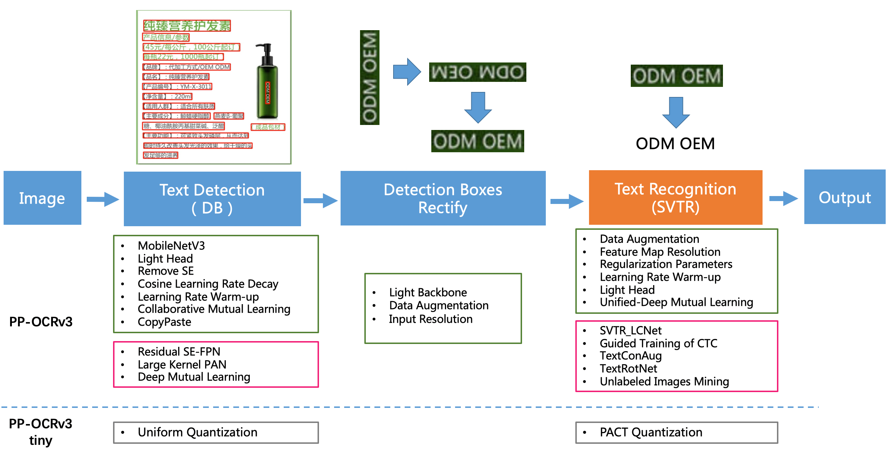


从算法改进思路上看，分别针对检测和识别模型，进行了共9个方面的改进：

检测模块：

- LK-PAN：大感受野的PAN结构；
- DML：教师模型互学习策略；
- RSE-FPN：残差注意力机制的FPN结构；

识别模块：

- SVTR_LCNet：轻量级文本识别网络；
- GTC：Attention指导CTC训练策略；
- TextConAug：挖掘文字上下文信息的数据增广策略；
- TextRotNet：自监督的预训练模型；
- UDML：联合互学习策略；
- UIM：无标注数据挖掘方案。

从效果上看，速度可比情况下，多种场景精度均有大幅提升：

- 中文场景，相对于PP-OCRv2中文模型提升超5%；
- 英文数字场景，相比于PP-OCRv2英文模型提升11%；
- 多语言场景，优化80+语种识别效果，平均准确率提升超5%。

#### 检测优化

PP-OCRv3检测模型是对PP-OCRv2中的CML（Collaborative Mutual Learning) 协同互学习文本检测蒸馏策略进行了升级。如下图所示，CML的核心思想结合了①传统的Teacher指导Student的标准蒸馏与 ②Students网络之间的DML互学习，可以让Students网络互学习的同时，Teacher网络予以指导。PP-OCRv3分别针对教师模型和学生模型进行进一步效果优化。其中，在对教师模型优化时，提出了大感受野的PAN结构LK-PAN和引入了DML（Deep Mutual Learning）蒸馏策略；在对学生模型优化时，提出了残差注意力机制的FPN结构RSE-FPN。

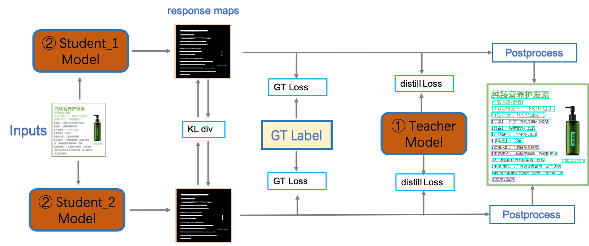

消融实验如下：

序号|	策略|	模型大小|	hmean	|速度（cpu + mkldnn)
---|---|---|---|---|
baseline teacher|	PP-OCR server|	49.0M|	83.20%|	171ms
teacher1|	DB-R50-LK-PAN|	124.0M|	85.00%|	396ms
teacher2|	DB-R50-LK-PAN-DML|	124.0M|	86.00%|	396ms
baseline student|	PP-OCRv2|	3.0M|	83.20%|	117ms
student0|	DB-MV3-RSE-FPN|	3.6M|	84.50%|	124ms
student1|	DB-MV3-CML（teacher2）|	3.0M|	84.30%|	117ms
student2|	DB-MV3-RSE-FPN-CML（teacher2）|	3.60M|	85.40%|	124ms

##### （1）LK-PAN：大感受野的PAN结构

LK-PAN (Large Kernel PAN) 是一个具有更大感受野的轻量级PAN结构，核心是将PAN结构的path augmentation中卷积核从3*3改为9*9。通过增大卷积核，提升特征图每个位置覆盖的感受野，更容易检测大字体的文字以及极端长宽比的文字。使用LK-PAN结构，可以将教师模型的hmean从83.2%提升到85.0%。

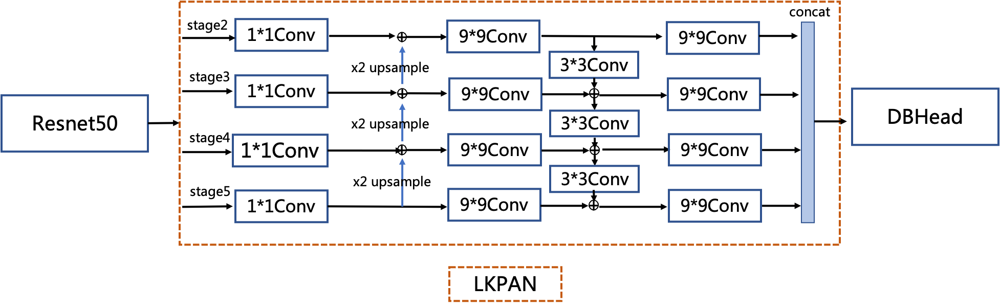

##### （2）DML：教师模型互学习策略

DML （Deep Mutual Learning）互学习蒸馏方法，如下图所示，通过两个结构相同的模型互相学习，可以有效提升文本检测模型的精度。教师模型采用DML策略，hmean从85%提升到86%。将PP-OCRv2中CML的教师模型更新为上述更高精度的教师模型，学生模型的hmean可以进一步从83.2%提升到84.3%。


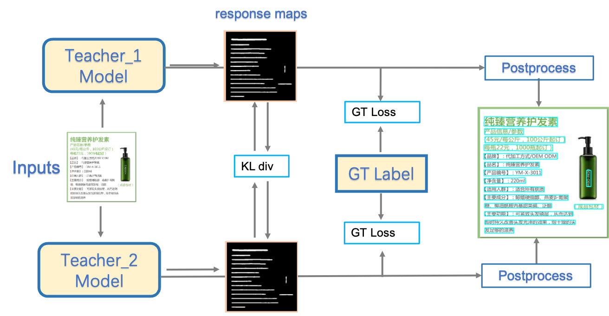


##### （3）RSE-FPN：残差注意力机制的FPN结构

RSE-FPN（Residual Squeeze-and-Excitation FPN）如下图所示，引入残差结构和通道注意力结构，将FPN中的卷积层更换为通道注意力结构的RSEConv层，进一步提升特征图的表征能力。考虑到PP-OCRv2的检测模型中FPN通道数非常小，仅为96，如果直接用SEblock代替FPN中卷积会导致某些通道的特征被抑制，精度会下降。RSEConv引入残差结构会缓解上述问题，提升文本检测效果。进一步将PP-OCRv2中CML的学生模型的FPN结构更新为RSE-FPN，学生模型的hmean可以进一步从84.3%提升到85.4%。

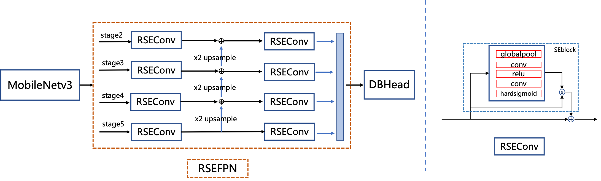


#### 识别优化

PP-OCRv3的识别模块是基于文本识别算法SVTR优化。SVTR不再采用RNN结构，通过引入Transformers结构更加有效地挖掘文本行图像的上下文信息，从而提升文本识别能力。直接将PP-OCRv2的识别模型，替换成SVTR_Tiny，识别准确率从74.8%提升到80.1%（+5.3%），但是预测速度慢了将近11倍，CPU上预测一条文本行，将近100ms。因此，如下图所示，PP-OCRv3采用如下6个优化策略进行识别模型加速。

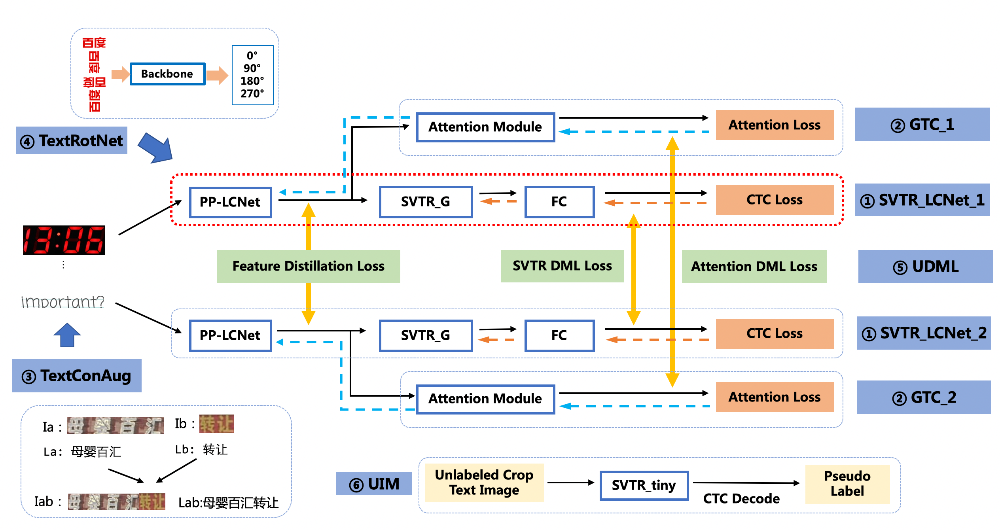

基于上述策略，PP-OCRv3识别模型相比PP-OCRv2，在速度可比的情况下，精度进一步提升4.6%。 具体消融实验如下所示：

| ID | 策略 |  模型大小 | 精度 | 预测耗时（CPU + MKLDNN)|
|-----|-----|--------|----| --- |
| 01 | PP-OCRv2 | 8.0M | 74.80% | 8.54ms |
| 02 | SVTR_Tiny | 21.0M | 80.10% | 97.00ms |
| 03 | SVTR_LCNet(h32) | 12.0M | 71.90% | 6.60ms |
| 04 | SVTR_LCNet(h48) | 12.0M | 73.98% | 7.60ms |
| 05 | + GTC | 12.0M | 75.80% | 7.60ms |
| 06 | + TextConAug | 12.0M | 76.30% | 7.60ms |
| 07 | + TextRotNet | 12.0M | 76.90% | 7.60ms |
| 08 | + UDML | 12.0M | 78.40% | 7.60ms |
| 09 | + UIM | 12.0M | 79.40% | 7.60ms |

注： 测试速度时，实验01-03输入图片尺寸均为(3,32,320)，04-08输入图片尺寸均为(3,48,320)。在实际预测时，图像为变长输入，速度会有所变化。测试环境： Intel Gold 6148 CPU，预测时开启MKLDNN加速。

##### （1）SVTR_LCNet：轻量级文本识别网络


SVTR_LCNet是针对文本识别任务，将基于Transformer的[SVTR](https://arxiv.org/abs/2205.00159)网络和轻量级CNN网络[PP-LCNet](https://arxiv.org/abs/2109.15099) 融合的一种轻量级文本识别网络。使用该网络，预测速度优于PP-OCRv2的识别模型20%，但是由于没有采用蒸馏策略，该识别模型效果略差。此外，进一步将输入图片规范化高度从32提升到48，预测速度稍微变慢，但是模型效果大幅提升，识别准确率达到73.98%（+2.08%），接近PP-OCRv2采用蒸馏策略的识别模型效果。

SVTR_Tiny 网络结构如下所示：

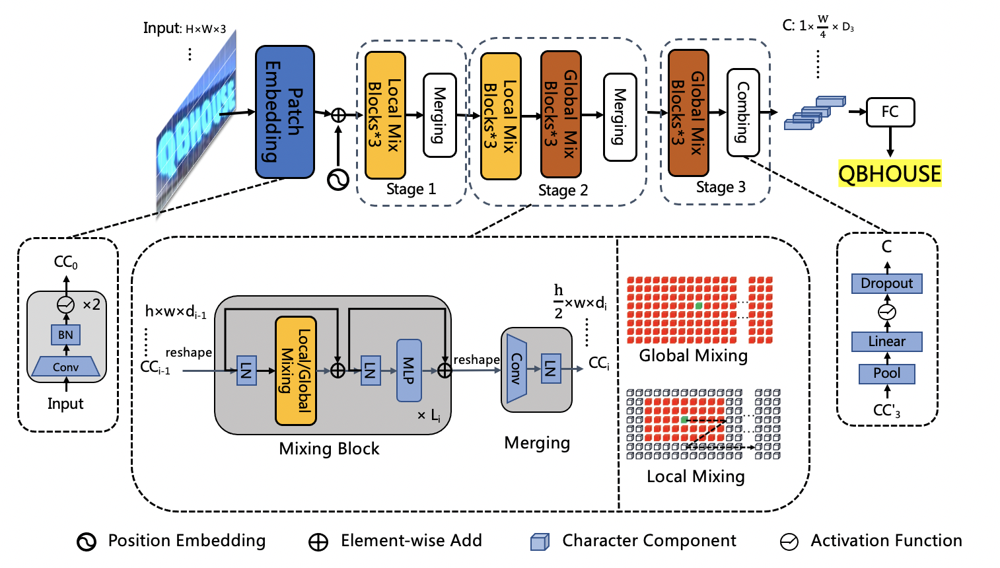

由于 MKLDNN 加速库支持的模型结构有限，SVTR 在 CPU+MKLDNN 上相比 PP-OCRv2 慢了10倍。PP-OCRv3 期望在提升模型精度的同时，不带来额外的推理耗时。通过分析发现，SVTR_Tiny 结构的主要耗时模块为 Mixing Block，因此我们对 SVTR_Tiny 的结构进行了一系列优化（详细速度数据请参考下方消融实验表格）:

1、将 SVTR 网络前半部分替换为 PP-LCNet 的前三个stage，保留4个 Global Mixing Block ，精度为76%，加速69%，网络结构如下所示：

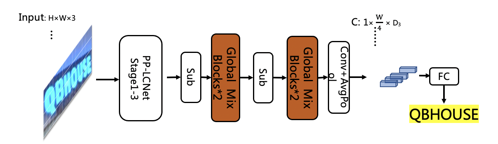

2、将4个 Global Mixing Block 减小到2个，精度为72.9%，加速69%，网络结构如下所示：

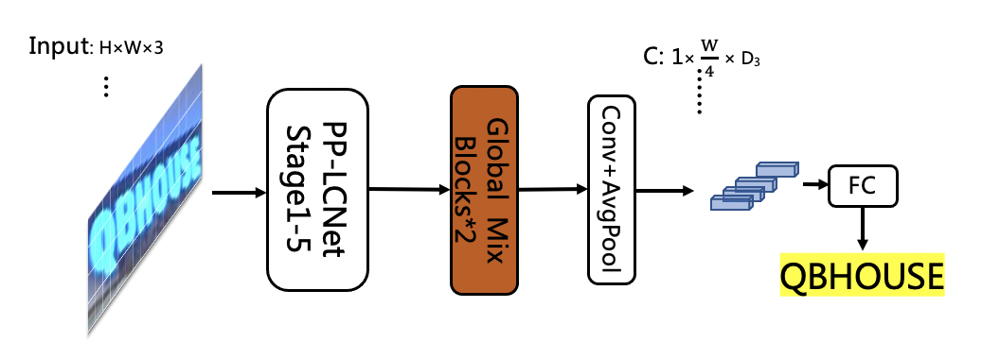

3、实验发现 Global Mixing Block 的预测速度与输入其特征的shape有关，因此后移 Global Mixing Block 的位置到池化层之后，精度下降为71.9%，速度超越基于CNN结构的PP-OCRv2-baseline 22%，网络结构如下所示：

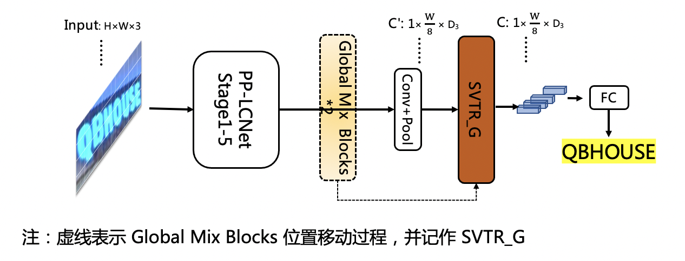

具体消融实验如下所示：

| ID | 策略 |  模型大小 | 精度 | 速度（CPU + MKLDNN)|
|-----|-----|--------|----| --- |
| 01 | PP-OCRv2-baseline | 8.0M | 69.30%  | 8.54ms |
| 02 | SVTR_Tiny | 21.0M | 80.10% | 97.00ms |
| 03 | SVTR_LCNet(G4) | 9.2M | 76.00% | 30.00ms |
| 04 | SVTR_LCNet(G2) | 13.0M | 72.98% | 9.37ms |
| 05 | SVTR_LCNet(h32) | 12.0M | 71.90% | 6.60ms |
| 06 | SVTR_LCNet(h48)  | 12.0M | 73.98% | 7.60ms |

> 注： 测试速度时，01-05输入图片尺寸均为(3,32,320)； PP-OCRv2-baseline 代表没有借助蒸馏方法训练得到的模型

##### （2）GTC：Attention指导CTC训练策略

GTC（Guided Training of CTC），利用Attention模块CTC训练，融合多种文本特征的表达，是一种有效的提升文本识别的策略。使用该策略，预测时完全去除 Attention 模块，在推理阶段不增加任何耗时，识别模型的准确率进一步提升到75.8%（+1.82%）。训练流程如下所示：


##### （3）TextConAug：挖掘文字上下文信息的数据增广策略

TextConAug是一种挖掘文字上下文信息的数据增广策略，主要思想来源于论文ConCLR，作者提出ConAug数据增广，在一个batch内对2张不同的图像进行联结，组成新的图像并进行自监督对比学习。PP-OCRv3将此方法应用到有监督的学习任务中，设计了TextConAug数据增强方法，可以丰富训练数据上下文信息，提升训练数据多样性。使用该策略，识别模型的准确率进一步提升到76.3%（+0.5%）。TextConAug示意图如下所示：

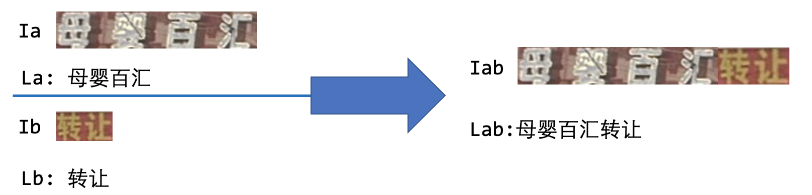

##### （4）TextRotNet：自监督的预训练模型

TextRotNet是使用大量无标注的文本行数据，通过自监督方式训练的预训练模型，参考于论文STR-Fewer-Labels。该模型可以初始化SVTR_LCNet的初始权重，从而帮助文本识别模型收敛到更佳位置。使用该策略，识别模型的准确率进一步提升到76.9%（+0.6%）。TextRotNet训练流程如下图所示：

##### （5）UDML：联合互学习策略

UDML（Unified-Deep Mutual Learning）联合互学习是PP-OCRv2中就采用的对于文本识别非常有效的提升模型效果的策略。在PP-OCRv3中，针对两个不同的SVTR_LCNet和Attention结构，对他们之间的PP-LCNet的特征图、SVTR模块的输出和Attention模块的输出同时进行监督训练。使用该策略，识别模型的准确率进一步提升到78.4%（+1.5%）

##### （6）UIM：无标注数据挖掘方案

UIM（Unlabeled Images Mining）是一种非常简单的无标注数据挖掘方案。核心思想是利用高精度的文本识别大模型对无标注数据进行预测，获取伪标签，并且选择预测置信度高的样本作为训练数据，用于训练小模型。使用该策略，识别模型的准确率进一步提升到79.4%（+1%）。实际操作中，我们使用全量数据集训练高精度SVTR-Tiny模型（acc=82.5%）进行数据挖掘，点击获取模型下载地址和使用教程。

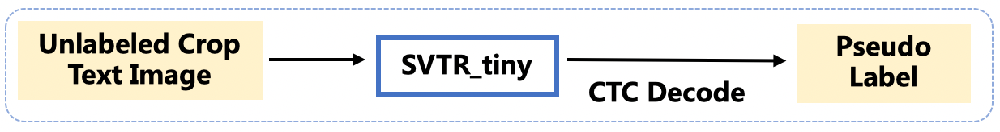

####  端到端评估

经过以上优化，最终PP-OCRv3在速度可比情况下，中文场景端到端Hmean指标相比于PP-OCRv2提升5%，效果大幅提升。具体指标如下表所示：

Model|	Hmean|	Model Size (M)|	Time Cost (CPU, ms)|	Time Cost (T4 GPU, ms)
---|---|---|---|---
PP-OCR mobile|	50.30%|	8.1|	356.00|	116.00
PP-OCR server|	57.00%|	155.1|	1056.00|	200.00
PP-OCRv2|	57.60%|	11.6|	330.00|	111.00
PP-OCRv3|	62.90%|	15.6|	331.00|	86.64


除了更新中文模型，本次升级也同步优化了英文数字模型，端到端效果提升11%，如下表所示：

Model	|Recall|	Precision|	Hmean
---|---|---|---
PP-OCR_en|	38.99%|	45.91%|	42.17%
PP-OCRv3_en|	50.95%|	55.53%|	53.14%

同时，也对已支持的80余种语言识别模型进行了升级更新，在有评估集的四种语系识别准确率平均提升5%以上，如下表所示：


Model|	拉丁语系|	阿拉伯语系|	日语|	韩语
---|---|---|---|---
PP-OCR_mul|	69.60%|	40.50%|	38.50%|	55.40%
PP-OCRv3_mul|	75.20%|	45.37%|	45.80%|	60.10%


> https://www.paddleocr.ai/v2.10.0/ru/ppocr/blog/PP-OCRv3_introduction.html

### 技术点
#### EncoderWithSVTR


`EncoderWithSVTR` 是PaddleOCR框架中实现的一个特定网络模块，其核心作用是在文字识别（OCR）模型中作为特征提取的“颈部”（Neck）结构。它基于 SVTR（Scene Text Recognition with a Single Visual Model）算法

通过SVTR进行编码 EncoderWithSVTR

`EncoderWithSVTR` 的目标是将一个输入的文字图像（例如 [128, 512, 1, 40]，即 [Batch, Channel, Height, Width]）转换成一个富有上下文信息的特征序列，这个序列随后会被送入一个解码器（通常是基于CTC或Attention的解码器）来预测文本。

**Patch Embedding（图像块嵌入）**

这里通过骨干网络实现输出 [Batch, C, H, W]
将二维的图像转换为一个一维的序列，并为每个图像块生成一个初始的特征向量（嵌入）

- 切块与展平 [Batch, C, H, W] -> [Batch, C, H*W]
- 线性投影 reduce dim
    使用一个全连接层（Linear Layer）将每个展平后的图像块向量投影到一个固定的隐藏维度 D（例如 D=120）
- 添加位置编码


**SVTR Blocks（SVTR核心模块堆叠）**

目的： 通过堆叠多个相同的SVTR Block，对序列中的每个Visual Token进行深层次的特征提取，并建模它们之间复杂的全局依赖关系。这是模型获得强大表征能力的关键。

一个标准的 SVTR Block 通常由以下部分组成，处理输入为

- **LayerNorm1**： 对输入 $Z_{i-1}$  进行层归一化。

- **多头自注意力**：MSA允许序列中的每一个Token（图像块）与序列中的所有其他Token进行交互，从而捕获全局上下文信息。这对于识别形状怪异、有遮挡或有复杂背景的文本至关重要。输出与输入同维度的特征。

- **残差连接 1**： $Z‘_i = MSA(LN(Z_{i-1})) + Z_{i-1}$ 。这有助于缓解梯度消失问题。

- **LayerNorm 2**： 对 $Z‘_i$ 进行层归一化。

- **前馈网络：**
    - 通常是一个两层的MLP，带有激活函数（如GELU）和Dropout。
    - 它对每个Token的特征进行非线性变换和增强。

- **残差连接 2**： $Z_i = FFN(LN(Z‘_i)) + Z‘_i$ 。

- **重复堆叠**：这个过程会重复 N 次（例如 N=2）。最终输出为 Z_N，形状仍然是 [B, L, D]（[128, 40, 120]）。

**Sequence Aggregation（序列聚合）**

last stage
- **重塑：** 将序列 `$Z_N$` 的形状从 [B, L, D] 重塑回与2D空间对应的形状 [B, D, H', W']。其中 在我们的例子中，就是 [128, 120, 1, 40]。

- **宽度方向的挤压**：
    - 使用一个 卷积层 或 AdaptiveAvgPool2d 在宽度方向上进行压缩。
    - 例如： 使用一个核大小为 (1, 2)，步长为 (1, 2) 的卷积，或者一个目标大小为 (H', 1) 的自适应平均池化。
    - 这个操作将特征图的宽度 W' 大幅减小。

    而且paddleocr v3也没有使用论文里面的AdaptiveAvgPool2D，而是使用卷积的方式，很好的解决了out_char_num问题。

**Linear Projection（线性投影）**

通过conv1x1实现


**（可选）混合架构**
原始的SVTR论文还提出了一种“混合架构”，在堆叠SVTR Blocks之前，先使用几层轻量级的CNN（如MobileNet块）来提取局部特征。这可以看作是一个“CNN前端 + Transformer后端”的结构，结合了CNN的局部性优势和Transformer的全局性优势。EncoderWithSVTR 有时也指代这种混合架构。


SVTR 编码过程

```
    # z -> [B,512,1,40]
    # reduce dim
    z = self.conv1(z) #  Conv2D(512, 64, kernel_size=[3, 3], padding=[1, 1]
    z = self.conv2(z) #  Conv2D(64, 120, kernel_size=[1, 1]
    # z -> [B,120,1,40]
    
    # SVTR global block
    z = z.flatten(2).transpose([0, 2, 1]) # z -> [B,40,120]
    # 再经过depth=2层svtr_block
    
    x = self.norm1(z)
    x = self.mixer(x)
    
    # self.mixer (多头注意力模块)
        qkv = (
            self.qkv(x)  # Linear(in_features=120, out_features=360, dtype=float32)
            .reshape((0, -1, 3, self.num_heads, self.head_dim)) #  num_heads=8, head_dim= 120(hidden_dims)//8 = 15
            .transpose((2, 0, 3, 1, 4))
        )  # -> [3,B,num_heads,40,head_dim]
        
        # 获取q,k,v  self.scale = self.head_dim**-0.5
        q, k, v = qkv[0] * self.scale, qkv[1], qkv[2] 
        
        # attn
        attn = q.matmul(k.transpose((0, 1, 3, 2)))
        attn = nn.functional.softmax(attn, axis=-1)
        attn = self.attn_drop(attn)  # 0.1
        # [B,num_heads,40,head_dim] -> [B,40,num_heads,head_dim] -> [B,40,hidden_dims]
        x = (attn.matmul(v)).transpose((0, 2, 1, 3)).reshape((0, -1, self.dim))
        x = self.proj(x) # Linear(in_features=120, out_features=120, dtype=float32)
        x = self.proj_drop(x)  # 0.1 drop_rate
    
    z = z + self.drop_path(x)  # Identity
    
    x = self.norm2(z)
    x = self.mlp(x)  # 前馈网络（多层感知机）
        FFN = Dropout(FC2(Dropout(Activation(FC1(x)))))  # swish 0.1
        
    out = z + Identity(x)  # [B,40,120]

    z = self.norm(out)
    
    # last stage
    z = z.reshape([0, H, W, C]).transpose([0, 3, 1, 2]) # [B,120,1,40]
    z = self.conv3(z)   # [B,512,1,40]
    z = paddle.concat((h, z), axis=1) # [B,1024,1,40]
    z = self.conv1x1(self.conv4(z)) # [B,64,1,40]
```

#### Im2Seq

Im2Seq 是一个连接CNN骨干网络和CTC解码器的桥梁模块，主要作用是将2D特征图 [B, C, H, W] 转换为1D特征序列 [B, T, C']，其中 T 是序列长度，通常对应文本的最大识别长度

```
# x  [B,64,1,40] B, C, H, W
x = x.squeeze(axis=2)
x = x.transpose([0, 2, 1])  # (NTC)(batch, width, channels)
```

#### CTCHead

核心思想
- 输入：特征序列 [T, B, C] 或 [B, T, C]
- 输出：每个时间步的字符概率分布
- 目标：处理序列标注问题，无需精确的序列对齐
  
通过一个全连接预测输出（字符个数）

```
# out_features 为所有字符串的长度
Linear(in_features=64, out_features=97, dtype=float32)

# 预测模式
if not self.training:
    predicts = F.softmax(predicts, axis=2)
    result = predicts
```

CTC的优点是速度极快，因为每一帧的预测是并行的，没有复杂的依赖关系，所以推理速度非常快。但也具有明显的缺点：

- 条件独立假设： 它假设每一帧的预测是相互独立的，这导致它很难学习到字符之间的长程上下文关系
- 对齐不精确： 因为没有显式的对齐机制，有时会出现对齐错误，导致识别精度，尤其是对于不规则、弯曲文本的识别精度不高。

所以我们引入attention机制，在解码生成每一个字符时，Attention 模型都会“回头看”一遍完整的输入特征序列，并给每一帧分配一个“注意力权重”，然后加权求和，最后再预测当前字符。它打破了条件独立假设，能显式地学习输入与输出之间的依赖关系，上下文建模能力强，对不规则文本识别效果好。


#### CTCLabelEncode

CTCLabelEncode的核心目的是为模型训练准备“标准答案”（Ground Truth）。将我们易于理解的文本标签（如“hello”），转换为模型可以学习的数字索引序列

1、初始化加载字符字典文件`character_dict_path`来构建字典：建立一个包含所有可能字符（如字母、数字、标点等）的字典，如果支持识别`空格`类别 即`use_space_char=true` 则在字符串列表添加`' '`。 并在字符串列表起始位置添加特色字符`blank`。生成字典（每个字符分配一个唯一的数字索引）。

```
character = ['blank', '1','2', ..., ' ']
dict = {"blank": 0, "1": 1, "2": 2, ...}
```
- blank 的索引为0 即为后边填充0 做占位符

2、判断label的最大长度（max_text_len 默认25）。label字符的长度大于该值或者为0 则忽略。

3、编码文本：将标签中的每个字符，逐一替换成其在字典中对应的数字索引 如 `text_index = [44, 47, 43, 63, 62, 67]`

4、将所有编码后的序列用0填充（Padding）到最大长度（max_text_len）  `text_index = [44, 47, 43, 63, 62, 67,0,0,0,0, ...]`


#### CTCLabelDecode

后处理 (CTCLabelDecode)：将模型输出的特征序列解码成最终的文本字符串

1、同`CTCLabelEncode`


#### sar （Sequence-Aware Representation）head

https://aistudio.baidu.com/projectdetail/3734933?channelType=0&channel=0
https://arxiv.org/pdf/1811.00751
