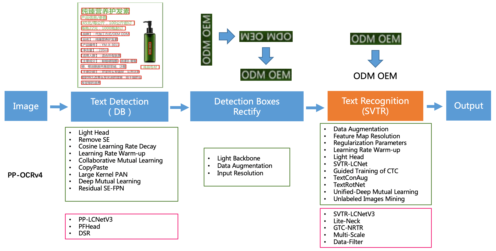
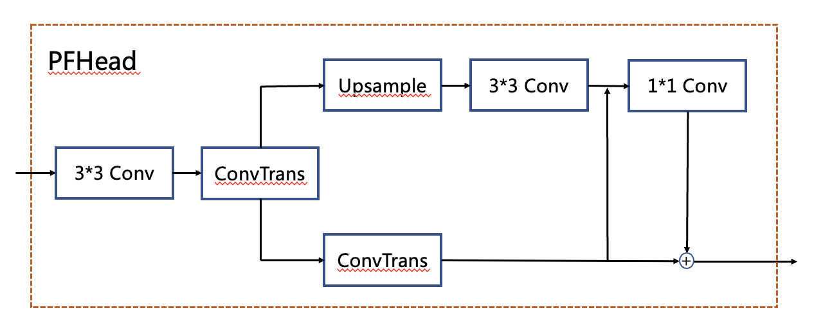
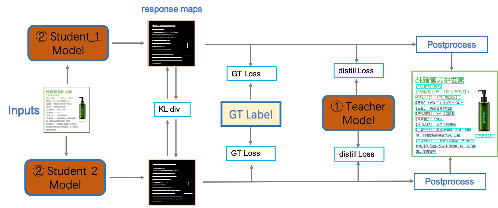
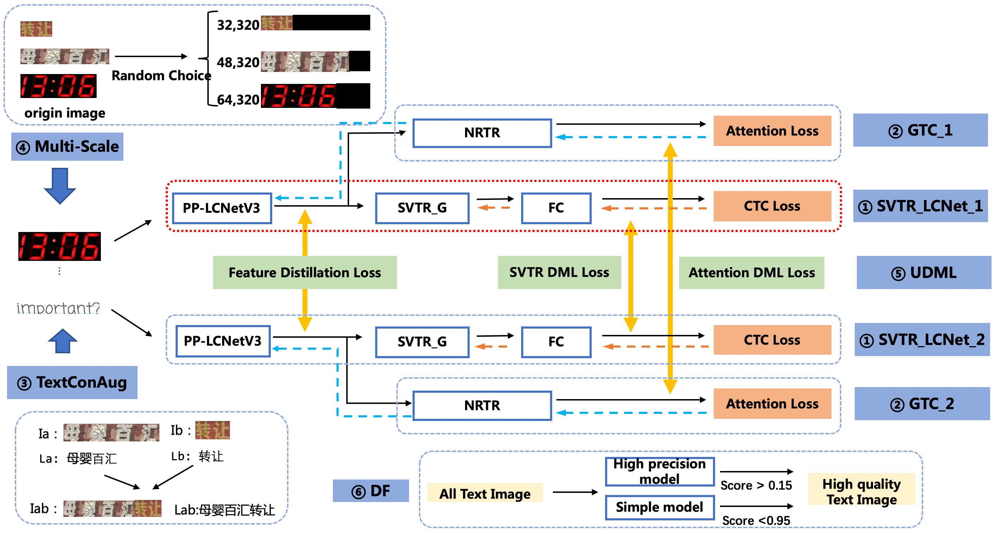
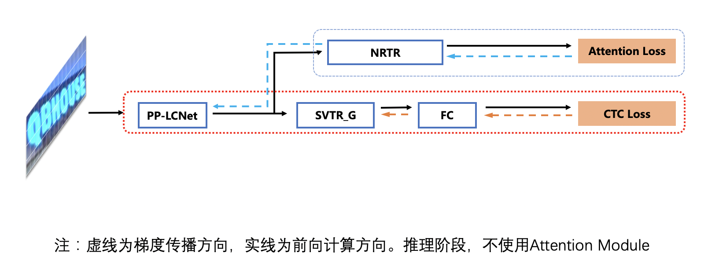
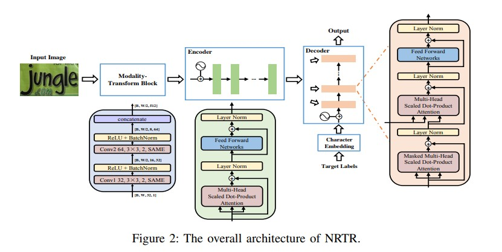
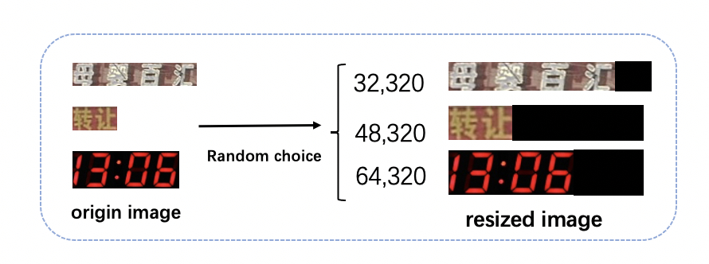

**PP-OCRv4-mobile**：速度可比情况下，中文场景效果相比于 PP-OCRv3 再提升 4.5%，英文场景提升 10%，80 语种多语言模型平均识别准确率提升 8%以上
**PP-OCRv4-server**：发布了目前精度最高的 OCR 模型，中英文场景上检测模型精度提升 4.9%， 识别模型精度提升 2%

PP-OCRv4在PP-OCRv3的基础上进一步升级。整体的框架图保持了与PP-OCRv3相同的pipeline，针对检测模型和识别模型进行了数据、网络结构、训练策略等多个模块的优化。 PP-OCRv4系统框图如下所示：



从算法改进思路上看，分别针对检测和识别模型，进行了共10个方面的改进：

- 检测模块：
    - LCNetV3：精度更高的骨干网络
    - PFHead：并行head分支融合结构
    - DSR: 训练中动态增加shrink ratio
    - CML：添加Student和Teacher网络输出的KL div loss

- 识别模块：
    - SVTR_LCNetV3：精度更高的骨干网络
    - Lite-Neck：精简的Neck结构
    - GTC-NRTR：稳定的Attention指导分支
    - Multi-Scale：多尺度训练策略
    - DF: 数据挖掘方案
    - DKD ：DKD蒸馏策略

从效果上看，速度可比情况下，多种场景精度均有大幅提升：

- 中文场景，相对于PP-OCRv3中文模型提升超4%；
- 英文数字场景，相比于PP-OCRv3英文模型提升6%；
- 多语言场景，优化80个语种识别效果，平均准确率提升超8%。


### 检测优化

PP-OCRv4检测模型在PP-OCRv3检测模型的基础上，在网络结构，训练策略，蒸馏策略三个方面做了优化。首先，PP-OCRv4检测模型使用PP-LCNetV3替换MobileNetv3，并提出并行分支融合的PFhead结构；其次，训练时动态调整shrink ratio的比例；最后，PP-OCRv4对CML的蒸馏loss进行优化，进一步提升文字检测效果。

消融实验如下：
序号| 	策略| 	模型大小| 	hmean| 	速度（cpu + mkldnn)
---|---|---|---|---|
baseline| 	PP-OCRv3| 	3.4M| 	78.84%| 	69ms
baseline student| 	PP-OCRv3 student| 	3.4M| 	76.22%| 	69ms
01| 	+PFHead| 	3.6M| 	76.97%| 	96ms
02|	+Dynamic Shrink Ratio| 	3.6M| 	78.24%| 	96ms
03| 	+PP-LCNetv3| 	4.8M| 	79.08%| 	94ms
03| 	+CML| 	4.8M| 	79.87%| 	67ms

测试环境： Intel Gold 6148 CPU，预测引擎使用openvino。


#### （1）PFhead：多分支融合Head结构

PFhead结构如下图所示，PFHead在经过第一个转置卷积后，分别进行上采样和转置卷积，上采样的输出通过3x3卷积得到输出结果，然后和转置卷积的分支的结果级联并经过1x1卷积层，最后1x1卷积的结果和转置卷积的结果相加得到最后输出的概率图。PP-OCRv4学生检测模型使用PFhead，hmean从76.22%增加到76.97%。


#### （2）DSR: 收缩比例动态调整策略

动态shrink ratio(dynamic shrink ratio): 在训练中，shrink ratio由固定值调整为动态变化，随着训练epoch的增加，shrink ratio从0.4线性增加到0.6。该策略在PP-OCRv4学生检测模型上，hmean从76.97%提升到78.24%。

#### (3) PP-LCNetV3：精度更高的骨干网络

PP-LCNetV3系列模型是PP-LCNet系列模型的延续，覆盖了更大的精度范围，能够适应不同下游任务的需要。PP-LCNetV3系列模型从多个方面进行了优化，提出了可学习仿射变换模块，对重参数化策略、激活函数进行了改进，同时调整了网络深度与宽度。最终，PP-LCNetV3系列模型能够在性能与效率之间达到最佳的平衡，在不同精度范围内取得极致的推理速度。使用PP-LCNetV3替换MobileNetv3 backbone，PP-OCRv4学生检测模型hmean从78.24%提升到79.08%。

#### （4）CML: 融合KD的互学习策略

PP-OCRv4检测模型对PP-OCRv3中的CML（Collaborative Mutual Learning) 协同互学习文本检测蒸馏策略进行了优化。如下图所示，在计算Student Model和Teacher Model的distill Loss时，额外添加KL div loss，让两者输出的response maps分布接近，由此进一步提升Student网络的精度，检测Hmean从79.08%增加到79.56%，端到端指标从61.31%增加到61.87%。




### 识别优化

PP-OCRv4识别模型在PP-OCRv3的基础上进一步升级。如下图所示，整体的框架图保持了与PP-OCRv3识别模型相同的pipeline，分别进行了数据、网络结构、训练策略等方面的优化。



经过如图所示的策略优化，PP-OCRv4识别模型相比PP-OCRv3，在速度可比的情况下，精度进一步提升4%。 具体消融实验如下所示：

ID| 	策略| 	模型大小| 	精度| 	预测耗时（CPU openvino)
--|---|---|---|---|
01| 	PP-OCRv3| 	12M| 	71.50%| 	8.54ms
02| 	+DF| 	12M| 	72.70%| 	8.54ms
03| 	+ LiteNeck + GTC| 	9.6M| 	73.21%| 	9.09ms
04| 	+ PP-LCNetV3| 	11M| 	74.18%| 	9.8ms
05| 	+ multi-scale| 	11M| 	74.20%| 	9.8ms
06| 	+ TextConAug|	11M| 	74.72%| 	9.8ms
08| 	+ UDML| 	11M| 	75.45%| 	9.8ms

> 注： 测试速度时，输入图片尺寸均为(3,48,320)。在实际预测时，图像为变长输入，速度会有所变化。测试环境： Intel Gold 6148 CPU，预测时使用Openvino预测引擎。


#### （1）DF：数据挖掘方案

DF(Data Filter) 是一种简单有效的数据挖掘方案。核心思想是利用已有模型预测训练数据，通过置信度和预测结果等信息，对全量的训练数据进行筛选。具体的：首先使用少量数据快速训练得到一个低精度模型，使用该低精度模型对千万级的数据进行预测，去除置信度大于0.95的样本，该部分被认为是对提升模型精度无效的冗余样本。其次使用PP-OCRv3作为高精度模型，对剩余数据进行预测，去除置信度小于0.15的样本，该部分被认为是难以识别或质量很差的样本。 使用该策略，千万级别训练数据被精简至百万级，模型训练时间从2周减少到5天，显著提升了训练效率，同时精度提升至72.7%(+1.2%)。


#### （2）PP-LCNetV3：精度更优的骨干网络

PP-LCNetV3系列模型是PP-LCNet系列模型的延续，覆盖了更大的精度范围，能够适应不同下游任务的需要。PP-LCNetV3系列模型从多个方面进行了优化，提出了可学习仿射变换模块，对重参数化策略、激活函数进行了改进，同时调整了网络深度与宽度。最终，PP-LCNetV3系列模型能够在性能与效率之间达到最佳的平衡，在不同精度范围内取得极致的推理速度。

#### （3）Lite-Neck：精简参数的Neck结构

Lite-Neck整体结构沿用PP-OCRv3版本的结构，在参数上稍作精简，识别模型整体的模型大小可从12M降低到8.5M，而精度不变；在CTCHead中，将Neck输出特征的维度从64提升到120，此时模型大小从8.5M提升到9.6M。

#### （4）GTC-NRTR：Attention指导CTC训练策略

GTC（Guided Training of CTC），是PP-OCRv3识别模型的最有效的策略之一，融合多种文本特征的表达，有效的提升文本识别精度。在PP-OCRv4中使用训练更稳定的Transformer模型NRTR作为指导分支，相比V3版本中的SAR基于循环神经网络的结构，NRTR基于Transformer实现解码过程泛化能力更强，能有效指导CTC分支学习，解决简单场景下快速过拟合的问题。使用Lite-Neck和GTC-NRTR两个策略，识别精度提升至73.21%(+0.5%)。






##### NRTRHead

输入序列化策略

- 将2D特征图转换为1D序列 [B, C, H, W]-> [B, C, L] (批次大小, 特征维度,序列长度 L = H*W)
- 使用全连接FC调整通道数到hidden_size（nrtr_dim） [B, L, C] -> [B, L, nrtr_dim]

```
# src [B, L, nrtr_dim]
# tgt [B, 2 + max_len]
max_len = targets[1].max()   # 改批次中标签文本字符最长的
tgt = targets[0][:, : 2 + max_len]  # gtc （经过NRTRLabelEncode编码的）
return self.forward_train(src, tgt)
```

##### NRTR

NRTR由三个子网络组成：编码器、解码器和作为预处理的模态变换块。
由于编码器和解码器都基于自注意机制，我们首先回顾了它，然后描述了三个主要的子网络。


```
tgt = tgt[:, :-1]   # 去掉最长的字符的结束字符</s>的索引

tgt = self.embedding(tgt)
tgt = self.positional_encoding(tgt)  # 位置编码
tgt_mask = self.generate_square_subsequent_mask(tgt.shape[1])

if self.encoder is not None:  # 为None
    src = self.positional_encoding(src)
    for encoder_layer in self.encoder:
        src = encoder_layer(src)
    memory = src  # B N C
else:
    memory = src  # B N C
for decoder_layer in self.decoder:
    # self attn + cross attn
    tgt = decoder_layer(tgt, memory, self_mask=tgt_mask)
output = tgt
logit = self.tgt_word_prj(output)
return logit
```
**embedding**

- Embedding 默认层采用 XavierUniform 分布进行初始化。其核心思想是让每一层输出的方差保持一致，从而避免梯度在深层网络中消失或爆炸。采样范围 [-limit, limit] 由嵌入维度 d_model 决定

```
limit = gain * sqrt(6 / (fan_in + fan_out))
```
- gain 是一个可选的缩放因子，通常取 1.0
- fan_in 嵌入字典大小
- fan_out 是嵌入向量的维度d_model


```python
class Embeddings(nn.Layer):
    def __init__(self, d_model, vocab, padding_idx=None, scale_embedding=True):
        super(Embeddings, self).__init__()
        self.embedding = nn.Embedding(vocab, d_model, padding_idx=padding_idx)
        # 手动初始化权重：从均值为0、标准差为 d_model^(-0.5) 的正态分布采样
        w0 = np.random.normal(0.0, d_model**-0.5, (vocab, d_model)).astype(np.float32)
        self.embedding.weight.set_value(w0)
        self.d_model = d_model
        self.scale_embedding = scale_embedding

    def forward(self, x):
        if self.scale_embedding: # 开启缩放
            x = self.embedding(x)
            # 嵌入值乘以 √d_model，目的是平衡嵌入向量与位置编码的尺度
            return x * math.sqrt(self.d_model) 
        return self.embedding(x)
```
- 这里初始化权重w0： 其中均值为0，标准差为1 / math.sqrt(d_model)， 方差为 1/d_model 的正态分布， 
- 开启缩放 (True)：x * sqrt(d_model) 的方差变为 (1/d_model)×d_model=1。这使得嵌入向量的方差稳定在 ~1 左右，

| 步骤                     | 效果                 | 目的                  |
| ---------------------- | ------------------ | ------------------- |
| 初始化 `std = 1/√d_model` | 每个维度方差 `1/d_model` | 防止初始值过大，训练稳定        |
| 前向 `× √d_model`        | 方差恢复为 1            | 与位置编码（~\[-1,1]）量级匹配 |

**解码decode**

- 非自回归解码：与传统自回归模型逐字生成不同，NRTR 模块在推理时可并行输出所有字符概率，显著降低延迟 。
- 注意力掩码（Mask）：模块内部包含特殊的 src_mask 和 trg_mask 机制，确保编码器忽略填充区域，且解码器在训练时仅关注当前时刻之前的信息，防止未来泄露 

解码器由 $N_d$ （这里是4）个相连的相同解码器块组成。与编码器类似，解码器块基于多头尺度点积注意和位置全连接网络，但有两点不同。

首先，由于自回归特性，在每个解码器块中添加了一个被屏蔽的多头注意，**以确保位置j的预测只能依赖于j之前的已知输出**。我们通过屏蔽（设置为-∞）softmax输入中对应于非法连接的所有值来实现这一点

```python
# Generate a square mask for the sequence. The masked positions are filled with float('-inf'). Unmasked positions are filled with float(0.0)
# tgt_mask
mask = paddle.zeros([sz, sz], dtype="float32")
mask_inf = paddle.triu(
    paddle.full(shape=[sz, sz], dtype="float32", fill_value=float("-inf")),
    diagonal=1,
)
mask = mask + mask_inf
return mask.unsqueeze([0, 1])
```

**最终输出是通过线性投影转换为字符类的概率**

```
Linear(in_features=512, out_features=18714, dtype=float32)
```

##### NRTRLoss

**NRTRLabelDecode**

```
max_len = batch[2].max()  # 获取改批次中label字符最大的
tgt = batch[1][:, 1 : 2 + max_len]  # 过滤开始<s> 字符索引
```

默认 smoothing 为True  ， 如果设置为False，NRTR采用了 Cross-Entropy Loss，但它需要一个方式来将输出序列映射到目标序列

##### NRTRLabelEncode

`NRTRLabelEncode` 的核心任务与 `CTCLabelEncode` 一样，都是将可读的文本标签，转换为模型可以处理的数字索引序列

但由于NRTR模型本质上是基于Transformer的Encoder-Decoder架构，其编码方式也带有Transformer的典型特征


1、**添加特殊标记**：与CTC不同，NRTR模型在解码时是自回归的（逐个生成字符）。因此，编码过程中需要加入起始符（BOS, Beginning of Sequence） 和结束符（EOS, End of Sequence）。模型通过识别这些特殊标记来知道何时开始和停止生成

```
character = ["blank", "<unk>", "<s>", "</s>"] + character
```

2、判断label的最大长度（max_text_len 默认25）。label字符的长度大于该值或者为0 则忽略

3、编码文本：将标签中的每个字符，逐一替换成其在字典中对应的数字索引 如 `text_index = [44, 47, 43, 63, 62, 67]` 且长度不能大于等于 `max_text_len -1`, 并在字符的0位置插入`<s>`开始标志的索引 在字符的最后插入`</s>` 结束标识索引

```
text 编码  <s> + labels + </s>  -> [2, 21, 74, 57, 3] 不足 max_text_len 后边补零
# [2, 21, 74, 57, 3, 0, 0, 0, 0, 0, 0, 0, 0, 0, 0, 0, 0, 0, 0, 0, 0, 0, 0, 0, 0]
```


#### （5）Multi-Scale：多尺度训练策略

动态尺度训练策略，是在训练过程中随机resize输入图片的高度，以增强识别模型在端到端串联使用时的鲁棒性。在训练时，每个iter从（32，48，64）三种高度中随机选择一种高度进行resize。实验证明，使用该策略，尽管在识别测试集上准确率没有提升，但在端到端串联评估时，指标提升0.5%。



相关配置
```
  sampler:
    name: MultiScaleSampler   # 多尺度取样器
    scales: [[320, 32], [320, 48], [320, 64]]  # 多尺度（w,h）
    first_bs: &bs 192
    fix_bs: false  # 不同的尺度是否固定batch size
    divided_factor: [8, 16] # w, h   确保宽和高分别时8和16的倍数
    is_training: True
    # ratio_wh=0.8
    # max_w=480.0
```

#### （6）DKD：蒸馏策略

识别模型的蒸馏包含两个部分，NRTRhead蒸馏和CTCHead蒸馏;

对于NRTR head，使用了DKD loss蒸馏，拉近学生模型和教师模型的NRTR head logits。最终NRTR head的loss是学生与教师间的DKD loss和与ground truth的cross entropy loss的加权和，用于监督学生模型的backbone训练。通过实验，我们发现加入DKD loss后，计算与ground truth的cross entropy loss时去除label smoothing可以进一步提高精度，因此我们在这里使用的是不带label smoothing的cross entropy loss。

对于CTCHead，由于CTC的输出中存在Blank位，即使教师模型和学生模型的预测结果一样，二者的输出的logits分布也会存在差异，影响教师模型向学生模型的知识传递。PP-OCRv4识别模型蒸馏策略中，将CTC输出logits沿着文本长度维度计算均值，将多字符识别问题转换为多字符分类问题，用于监督CTC Head的训练。使用该策略融合NRTRhead DKD蒸馏策略，指标从74.72%提升到75.45%。


### 端到端评估

经过以上优化，最终PP-OCRv4在速度可比情况下，中文场景端到端Hmean指标相比于PP-OCRv3提升4.5%，效果大幅提升。具体指标如下表所示：

Model| 	Hmean| 	Model Size (M)| 	Time Cost (CPU, ms)
---|---|---|---
PP-OCRv3| 	57.99%| 	15.6| 	78
PP-OCRv4| 	62.24%| 	15.8| 	76

测试环境：CPU型号为Intel Gold 6148，CPU预测时使用openvino。

除了更新中文模型，本次升级也优化了英文数字模型，在自有评估集上文本识别准确率提升6%，如下表所示：

Model| 	ACC
---|---
PP-OCR_en| 	54.38%
PP-OCRv3_en| 	64.04%
PP-OCRv4_en| 	70.1%
