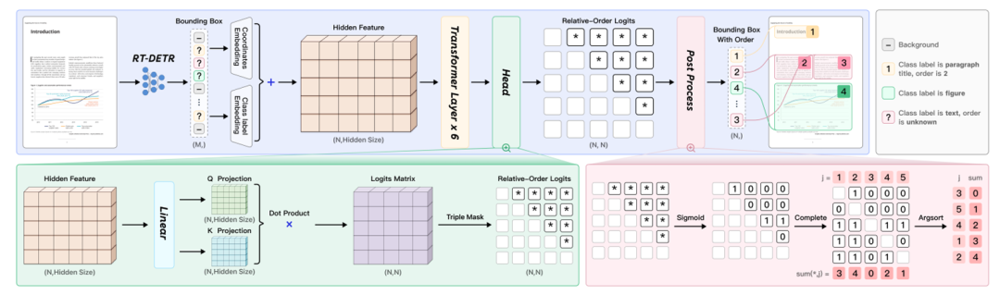
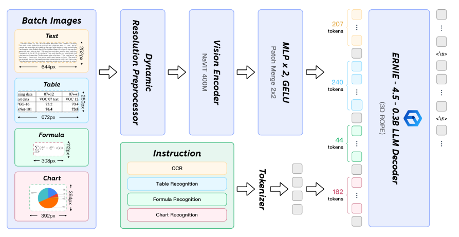

### PaddleOCR-VL(2025.10.16)

PaddleOCR-VL 是一款先进、高效的文档解析模型，专为文档中的元素识别设计。其核心组件为 PaddleOCR-VL-0.9B，这是一种紧凑而强大的视觉语言模型（VLM），它由 NaViT 风格的动态分辨率视觉编码器与 ERNIE-4.5-0.3B 语言模型组成，能够实现精准的元素识别。该模型支持 109 种语言，并在识别复杂元素（如文本、表格、公式和图表）方面表现出色，同时保持极低的资源消耗。通过在广泛使用的公开基准与内部基准上的全面评测，PaddleOCR-VL 在页级级文档解析与元素级识别均达到 SOTA 表现。它显著优于现有的基于Pipeline方案和文档解析多模态方案以及先进的通用多模态大模型，并具备更快的推理速度。这些优势使其非常适合在真实场景中落地部署。

#### 关键指标

#### 核心特征

**紧凑而强大的视觉语言模型架构**： 我们提出了一种新的视觉语言模型，专为资源高效的推理而设计，在元素识别方面表现出色。通过将NaViT风格的动态高分辨率视觉编码器与轻量级的ERNIE-4.5-0.3B语言模型结合，我们显著增强了模型的识别能力和解码效率。这种集成在保持高准确率的同时降低了计算需求，使其非常适合高效且实用的文档处理应用。

**文档解析的SOTA性能**： PaddleOCR-VL在页面级文档解析和元素级识别中达到了最先进的性能。它显著优于现有的基于流水线的解决方案，并在文档解析中展现出与领先的视觉语言模型（VLMs）竞争的强劲实力。此外，它在识别复杂的文档元素（如文本、表格、公式和图表）方面表现出色，使其适用于包括手写文本和历史文献在内的各种具有挑战性的内容类型。这使得它具有高度的多功能性，适用于广泛的文档类型和场景。

**多语言支持**： PaddleOCR-VL支持109种语言，覆盖了主要的全球语言，包括但不限于中文、英文、日文、拉丁文和韩文，以及使用不同文字和结构的语言，如俄语（西里尔字母）、阿拉伯语、印地语（天城文）和泰语。这种广泛的语言覆盖大大增强了我们系统在多语言和全球化文档处理场景中的适用性。

#### 技术架构
PaddleOCR-VL 是个两阶段的结构：
- 第一阶段采用 PP-DocLayoutV2 进行版面分析，负责定位语义区域并预测阅读顺序
- 第二阶段通过 PaddleOCR-VL-0.9B 模型，基于版面预测结果对文本、表格、公式和图表等多样化内容进行细粒度识别，最后将文档结构化转换为Markdown与JSON格式。

##### PP-DocLayoutV2

PP-DocLayoutV2 具体结构是由两个顺序连接的网络组成：
- 第一个：基于RT-DETR的检测模型，负责执行布局元素检测与分类
- 第二个：输入检测到的边界框和类别标签，通过指针网络对这些布局元素进行排序

##### PaddleOCR-VL-0.9B

PaddleOCR-VL-0.9B 的核心是通过 ERNIE-4.5-0.3B 这个语言模型驱动的，它的输入包括两部分：
- 第一部分：不同的任务指令(文本识别/表格识别)，通过分词器(tokenizer)，再进行向量化嵌入
- 第二部分：不同的图像元素通过NaViT风格编码?之后，再经过两层MLP和GELU之后，跟在指令输出后面

### PaddleOCR-VL-1.5(2026.1.29)

PaddleOCR-VL-1.5 在1.0版本上进行了进一步能力的扩展和升级优化，在文档解析 OmniDocBench v1.5 上取得了 94.5% 的更高的新 SOTA（最佳）结果。为了严格评估其对现实世界物理畸变的鲁棒性——包括扫描伪影、倾斜、弯曲、屏摄和光照变化——我们提出了 Real5-OmniDocBench 基准测试。实验结果表明，该增强模型在这一新构建的基准测试中各个场景都达到了 SOTA 性能。此外，我们通过加入印章识别和文字检测识别任务扩展了模型能力，同时保持了 0.9B 的超紧凑 VLM 规模和高效率。

#### 关键指标

#### 核心特性

- **文档解析的SOTA性能**： 凭借 0.9B 的参数量，PaddleOCR-VL-1.5 在 OmniDocBench v1.5 上达到了 94.5% 的准确率，超越了之前的 SOTA 模型 PaddleOCR-VL。在表格、公式和文本识别方面观察到了显著提升。
- **现实5大场景文档解析的SOTA性能**： 引入了一种创新的文档解析方法，支持不规则形状定位，能够在文档倾斜和弯曲条件下实现精确的多边形检测。在扫描、弯曲、倾斜、屏摄和光照变化这五个现实场景的评估中，表现优于主流的开源和闭源模型。
- **0.9B紧凑架构扩充能力**： 模型引入了文本行定位与识别 以及 印章识别，所有相关指标均在各自任务中创下了新的 SOTA 结果。
- **强化多元素识别能力**： PaddleOCR-VL-1.5 进一步增强了在特定场景和多语言识别方面的能力。针对特殊符号、古籍、多语言表格、下划线和复选框的识别性能得到提升，语言覆盖范围扩展至包括中国藏文和孟加拉语。
- **长文档跨页解析**： 模型支持跨页表格自动合并和跨页段落标题识别，有效缓解了长文档解析中的内容碎片化问题。

#### 技术架构

<fcel>分组<fcel>频数<fcel>频率<nl><fcel>[41,51)<fcel>2<fcel>\\( \\frac{2}{30} \\)<nl><fcel>[51,61)<fcel>1<fcel>\\( \\frac{1}{30} \\)<nl><fcel>[61,71)<fcel>4<fcel>\\( \\frac{4}{30} \\)<nl><fcel>[71,81)<fcel>6<fcel>\\( \\frac{6}{30} \\)<nl><fcel>[81,91)<fcel>10<fcel>\\( \\frac{10}{30} \\)<nl><fcel>[91,101)<fcel>5<fcel>\\( \\frac{5}{30} \\)<nl><fcel>[101,111)<fcel>2<fcel>\\( \\frac{2}{30} \\)<nl>
