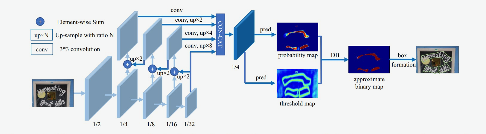

### 文本检测

文本检测任务是找出图像或视频中的文字位置。不同于目标检测任务，目标检测不仅要解决定位问题，还要解决目标分类问题。

文本在图像中的表现形式可以视为一种‘目标‘，通用的目标检测的方法也适用于文本检测，从任务本身上来看：

* 目标检测：给定图像或者视频，找出目标的位置（box），并给出目标的类别；
* 文本检测：给定输入图像或者视频，找出文本的区域，可以是单字符位置或者整个文本行位置；

目标检测和文本检测同属于“定位”问题。但是文本检测无需对目标分类，并且文本形状复杂多样。

当前所说的文本检测一般是自然场景文本检测，其难点在于：

1. 自然场景中文本具有多样性：文本检测受到文字颜色、大小、字体、形状、方向、语言、以及文本长度的影响；
2. 复杂的背景和干扰；文本检测受到图像失真，模糊，低分辨率，阴影，亮度等因素的影响；
3. 文本密集甚至重叠会影响文字的检测；
4. 文字存在局部一致性，文本行的一小部分，也可视为是独立的文本；


#### 文本检测方法介绍

近些年来基于深度学习的文本检测算法层出不穷，这些方法大致可以分为两类：

1. 基于回归的文本检测方法
2. 基于分割的文本检测方法

本节筛选了2017-2021年的常用文本检测方法，按照如上两类方法分类如下表格所示：


##### 基于回归的文本检测

早期基于深度学习的文本检测算法是从目标检测的方法改进而来，支持水平文本检测。比如Textbox算法基于SSD算法改进而来，CTPN根据二阶段目标检测Fast-RCNN算法改进而来。

在TextBoxes[1]算法根据一阶段目标检测器SSD调整，将默认文本框更改为适应文本方向和宽高比的规格的四边形，提供了一种端对端训练的文字检测方法，并且无需复杂的后处理。

* 采用更大长宽比的预选框
* 卷积核从3x3变成了1x5，更适合长文本检测
* 采用多尺度输入


任意角度文本检测

TextBoxes++[2]在TextBoxes基础上进行改进，支持检测任意角度的文本。从结构上来说，不同于TextBoxes，TextBoxes++针对多角度文本进行检测，首先修改预选框的宽高比，调整宽高比aspect  ratio为1、2、3、5、1/2、1/3、1/5。其次是将1∗51\*5**1**∗**5**的卷积核改为3∗53\*5**3**∗**5**，更好的学习倾斜文本的特征；最后，TextBoxes++的输出旋转框的表示信息


EAST[4]针对倾斜文本的定位问题，提出了two-stage的文本检测方法，包含  FCN特征提取和NMS部分。EAST提出了一种新的文本检测pipline结构，可以端对端训练并且支持检测任意朝向的文本，并且具有结构简单，性能高的特点。FCN支持输出倾斜的矩形框和水平框，可以自由选择输出格式。

* 如果输出检测形状为RBox，则输出Box旋转角度以及AABB文本形状信息，AABB表示到文本框上下左右边的偏移。RBox可以旋转矩形的文本。
* 如果输出检测框为四点框，则输出的最后一个维度为8个数字，表示从四边形的四个角顶点的位置偏移。该输出方式可以预测不规则四边形的文本。

考虑到FCN输出的文本框是比较冗余的，比如一个文本区域的邻近的像素生成的框重合度较高，但不是同一个文本生成的检测框，重合度都很小，因此EAST提出先按行合并预测框，最后再把剩下的四边形用原始的NMS筛选。


弯曲文本检测

利用回归的方法解决弯曲文本的检测问题，一个简单的思路是用多点坐标描述弯曲文本的边界多边形，然后直接预测多边形的顶点坐标。

- CTD
- LOMO
- Contournet
- PCR

##### 基于分割的文本检测

基于回归的方法虽然在文本检测上取得了很好的效果，但是对解决弯曲文本往往难以得到平滑的文本包围曲线，并且模型较为复杂不具备性能优势。于是研究者们提出了基于图像分割的文本分割方法，先从像素层面做分类，判别每一个像素点是否属于一个文本目标，得到文本区域的概率图，通过后处理方式得到文本分割区域的包围曲线。


此类方法通常是基于分割的方法实现文本检测，基于分割的方法对不规则形状的文本检测有着天然的优势。基于分割的文本检测方法主体思想为，通过分割方法得到图像中文本区域，再利用opencv，polygon等后处理得到文本区域的最小包围曲线。

针对基于分割的文本算法难以区分相邻文本的问题，PSENet[10]提出渐进式的尺度扩张网络学习文本分割区域，预测不同收缩比例的文本区域，并逐个扩大检测到的文本区域，该方法本质上是边界学习方法的变体，可以有效解决任意形状相邻文本的检测问题。


假设用了PSENet后处理用了3个不同尺度的kernel，如上图s1,s2,s3所示。首先，从最小kernel  s1开始，计算文本分割区域的连通域，得到(b)，然后，对连通域沿着上下左右做尺度扩张，对于扩张区域属于s2但不属于s1的像素，进行归类，遇到冲突点时，采用“先到先得”原则，重复尺度扩张的操作，最终可以得到不同文本行的独立的分割区域。

DBNet[12]针对基于分割的方法需要使用阈值进行二值化处理而导致后处理耗时的问题，提出了可学习阈值并巧妙地设计了一个近似于阶跃函数的二值化函数，使得分割网络在训练的时候能端对端的学习文本分割的阈值。自动调节阈值不仅带来精度的提升，同时简化了后处理，提高了文本检测的性能。


FCENet[16]提出将文本包围曲线用傅立叶变换的参数表示，由于傅里叶系数表示在理论上可以拟合任意的封闭曲线，通过设计合适的模型预测基于傅里叶变换的任意形状文本包围框表示，从而实现了自然场景文本检测中对于高度弯曲文本实例的检测精度的提升。


#### DB 文本检测算法原理

[DB](https://arxiv.org/pdf/1911.08947.pdf)是一个基于分割的文本检测算法，其提出可微分阈值Differenttiable Binarization module（DB module）采用动态的阈值区分文本区域与背景。


基于分割的普通文本检测算法其流程如上图中的蓝色箭头所示，此类方法得到分割结果之后采用一个固定的阈值得到二值化的分割图，之后采用诸如像素聚类的启发式算法得到文本区域。

DB算法的流程如图中红色箭头所示，最大的不同在于DB有一个阈值图，通过网络去预测图片每个位置处的阈值，而不是采用一个固定的值，更好的分离文本背景与前景。

DB算法有以下几个优势：

1. 算法结构简单，无需繁琐的后处理
2. 在开源数据上拥有良好的精度和性能

在传统的图像分割算法中，获取概率图后，会使用标准二值化（Standard Binarize）方法进行处理，将低于阈值的像素点置0，高于阈值的像素点置1，公式如下:

```math
 B_{i,j}=\left\{
\begin{aligned}
1 , if P_{i,j} >= t ,\\
0 , otherwise. 
\end{aligned}
\right.

```

但是标准的二值化方法是不可微的，导致网络无法端对端训练。为了解决这个问题，DB算法提出了可微二值化（Differentiable Binarization，DB）。可微二值化将标准二值化中的阶跃函数进行了近似，使用如下公式进行代替：

```math
\hat{B} = \frac{1}{1 + e^{-k(P_{i,j}-T_{i,j})}}

```

其中，P是上文中获取的概率图，T是上文中获取的阈值图，k是增益因子，在实验中，根据经验选取为50。标准二值化和可微二值化的对比图如 **下图3（a）** 所示。

当使用交叉熵损失时，正负样本的loss分别为 $l_+$ 和 $l_-$

```math
l_+ = -log(\frac{1}{1 + e^{-k(P_{i,j}-T_{i,j})}}) \\
l_- = -log(1-\frac{1}{1 + e^{-k(P_{i,j}-T_{i,j})}})

```

对输入x求偏导则会得到：

```math
\frac{\delta{l_+}}{\delta{x}} = -kf(x)e^{-kx} \\
\frac{\delta{l_-}}{\delta{x}} = -kf(x)

```

可以发现，增强因子会放大错误预测的梯度，从而优化模型得到更好的结果。图3（b） 中，x<0 的部分为正样本预测为负样本的情况，可以看到，增益因子k将梯度进行了放大；而 图3（c） 中x>0 的部分为负样本预测为正样本时，梯度同样也被放大了


DB算法整体结构如下图所示：



输入的图像经过网络Backbone和FPN提取特征，提取后的特征级联在一起，得到原图四分之一大小的特征，然后利用卷积层分别得到文本区域预测概率图和阈值图，进而通过DB的后处理得到文本包围曲线。

DB文本检测模型构建

- backbone网络: DB文本检测网络的Backbone部分采用的是图像分类网络，论文中使用了ResNet50, 本节实验中，为了加快训练速度，采用MobileNetV3 large结构作为backbone
- FPN网络
- Head网络: 计算文本区域概率图，文本区域阈值图以及文本区域二值图

##### 数据准备

本次实验选取了场景文本检测和识别(Scene Text Detection and Recognition)任务最知名和常用的数据集ICDAR2015。icdar2015数据集的示意图如下图所示

```
~/train_data/icdar2015/text_localization 
  └─ icdar_c4_train_imgs/         icdar数据集的训练数据
  └─ ch4_test_images/             icdar数据集的测试数据
  └─ train_icdar2015_label.txt    icdar数据集的训练标注
  └─ test_icdar2015_label.txt     icdar数据集的测试标注
```

提供的标注文件格式为：

```
" 图像文件名                    json.dumps编码的图像标注信息"
ch4_test_images/img_61.jpg    [{"transcription": "MASA", "points": [[310, 104], [416, 141], [418, 216], [312, 179]], ...}]
```

json.dumps编码前的图像标注信息是包含多个字典的list，字典中的points表示文本框的四个点的坐标(x,  y)，从左上角的点开始顺时针排列。 transcription中的字段表示当前文本框的文字，在文本检测任务中并不需要这个信息。  如果您想在其他数据集上训练PaddleOCR，可以按照上述形式构建标注文件。

如果"transcription"字段的文字为'\*'或者'###‘，表示对应的标注可以被忽略掉，因此，如果没有文字标签，可以将transcription字段设置为空字符串。

##### 数据预处理

训练时对输入图片的格式、大小有一定的要求，同时，还需要根据标注信息获取阈值图以及概率图的真实标签。所以，在数据输入模型前，需要对数据进行预处理操作，使得图片和标签满足网络训练和预测的需要。另外，为了扩大训练数据集、抑制过拟合，提升模型的泛化能力，还需要使用了几种基础的数据增广方法。

本实验的数据预处理共包括如下方法：

* 图像解码(DecodeImage)：将图像转为Numpy格式；
* 标签解码(DetLabelEncode)：解析txt文件中的标签信息，并按统一格式进行保存；
* 基础数据增广(IaaAugment)：包括：随机水平翻转、随机旋转，随机缩放，随机裁剪等；
* 获取阈值图标签(MaskBorderMap)：使用扩张的方式获取算法训练需要的阈值图标签；
  ```python
  ppocr/data/imaug/make_border_map.py
  ```
* 获取概率图标签(MakeShrinkMap)：使用收缩的方式获取算法训练需要的概率图标签；
* 归一化：通过规范化手段，把神经网络每层中任意神经元的输入值分布改变成均值为0，方差为1的标准正太分布，使得最优解的寻优过程明显会变得平缓，训练过程更容易收敛；
* 通道变换：图像的数据格式为[H, W, C]（即高度、宽度和通道数），而神经网络使用的训练数据的格式为[C, H, W]，因此需要对图像数据重新排列，例如[224, 224, 3]变为[3, 224, 224]；

##### DB模型后处理

DB head网络的输出形状和原图相同，实际上DB head网络输出的三个通道特征分别为文本区域的概率图、阈值图和二值图。

在训练阶段，3个预测图与真实标签共同完成损失函数的计算以及模型训练；

在预测阶段，只需要使用概率图即可，DB后处理函数根据概率图中文本区域的响应计算出包围文本响应区域的文本框坐标。

由于网络预测的概率图是经过收缩后的结果，所以在后处理步骤中，使用相同的偏移值将预测的多边形区域进行扩张，即可得到最终的文本框。代码实现如下所示。

```python
ppocr/postprocess/db_postprocess.py
```

从可视化结果中可以发现DB的输出结果是文本区域的二值图，属于文本区域的响应更高，非文本的背景区域响应值低。DB的后处理即是求这些响应区域的最小包围框，进而得到每个文本区域的坐标。 另外，通过修改后处理参数可以调整文本框的大小，或者过滤检测效果差的文本框。

DB后处理有四个参数，分别是：

* thresh: DBPostProcess中分割图进行二值化的阈值，默认值为0.3
* box\_thresh: DBPostProcess中对输出框进行过滤的阈值，低于此阈值的框不会输出
* unclip\_ratio: DBPostProcess中对文本框进行放大的比例, 默认为1.5
* max\_candidates: DBPostProcess中输出的最大文本框数量，默认1000

从上述代码的运行结果可以发现，增大DB后处理的unclip\_ratio参数之后，预测的文本框明显变大了。因此，当训练结果不符合我们预期时，可以通过调整后处理参数调整文本检测结果。另外，可以尝试调整其他三个参数thresh，box\_thresh，max\_candidates对比检测结果。

##### 损失函数定义

由于训练阶段获取了3个预测图，所以在损失函数中，也需要结合这3个预测图与它们对应的真实标签分别构建3部分损失函数。总的损失函数的公式定义如下:

```math
L = L_b + \alpha \times L_s + \beta \times L_t
```

其中，**L**为总的损失，**L**_s为概率图损失，在本实验中使用了带 OHEM（online hard example mining） 的 Dice 损失，L_t为阈值图损失，在本实验中使用了预测值和标签间的**L**1距离，**L**_b为文本二值图的损失函数。α和β为权重系数，本实验中分别将其设为5和10。

三个loss $L_b，L_s，L_t$ 分别是Dice Loss、Dice Loss(OHEM)、MaskL1 Loss，接下来分别定义这3个部分：

- Dice Loss是比较预测的文本二值图和标签之间的相似度，常用于二值图像分割，代码实现参考[链接](https://github.com/PaddlePaddle/PaddleOCR/blob/81ee76ad7f9ff534a0ae5439d2a5259c4263993c/ppocr/losses/det_basic_loss.py?_pjax=%23js-repo-pjax-container%2C%20div%5Bitemtype%3D%22http%3A%2F%2Fschema.org%2FSoftwareSourceCode%22%5D%20main%2C%20%5Bdata-pjax-container%5D#L109)。公式如下

  ```math
  dice\_loss = 1 - \frac{2 \times intersection\_area}{total\_area}
  ```
- Dice Loss(OHEM)是采用带OHEM的Dice Loss，目的是为了改善正负样本不均衡的问题。OHEM为一种特殊的自动采样方式，可以自动的选择难样本进行loss的计算，从而提升模型的训练效果。这里将正负样本的采样比率设为1:3。代码实现参考[链接](https://github.com/PaddlePaddle/PaddleOCR/blob/81ee76ad7f9ff534a0ae5439d2a5259c4263993c/ppocr/losses/det_basic_loss.py?_pjax=%23js-repo-pjax-container%2C%20div%5Bitemtype%3D%22http%3A%2F%2Fschema.org%2FSoftwareSourceCode%22%5D%20main%2C%20%5Bdata-pjax-container%5D#L95)。
- MaskL1 Loss是计算预测的文本阈值图和标签间的L1距离。

##### 评估指标

考虑到DB后处理检测框多种多样，并不是水平的，本次试验中采用简单计算IOU的方式来评测，计算代码参考[icdar Challenges 4的文本检测评测方法](https://rrc.cvc.uab.es/?ch=4&com=mymethods&task=1)。

文本检测的计算指标有三个，分别是Precision，Recall和Hmean，三个指标的计算逻辑为：

* 创建[n, m]大小的一个矩阵叫做iouMat，其中n为GT(ground truth)box的个数，m为检测到的框数量；其中n,m为除去了文本标定为###的框数量；
* 在iouMat中，统计IOU大于阈值0.5的个数，将这个值除以gt个数n得到Recall；
* 在iouMat中，统计IOU大于阈值0.5的个数，将这个值除以检测框m的个数得到Precision；
* Hmean的指标计算方式同F1-score的计算方式，公式如下

```math
Hmean = 2.0* \frac{Precision * Recall}{Precision + Recall }

```

##### 模型训练

`date_mv3_db.yml`

```yaml
Architecture:
  model_type: det
  algorithm: DB
  Transform:
  Backbone:
    name: MobileNetV3
    scale: 0.5
    model_name: large
  Neck:
    name: DBFPN
    out_channels: 256
  Head:
    name: DBHead
    k: 50
# 优化器
Optimizer:
  name: Adam
  beta1: 0.9
  beta2: 0.999
  lr:
    learning_rate: 0.001
  regularizer:
    name: 'L2'
    factor: 0
# 后处理
PostProcess:
  name: DBPostProcess
  thresh: 0.3
  box_thresh: 0.6
  max_candidates: 1000
  unclip_ratio: 1.5
```

### 文本识别

文本识别是OCR（Optical Character Recognition）的一个子任务，其任务为识别一个固定区域的的文本内容。在OCR的两阶段方法里，它接在文本检测后面，将图像信息转换为文字信息。

文本识别的应用场景很多，有文档识别、路标识别、车牌识别、工业编号识别等等，根据实际场景可以把文本识别任务分为两个大类：**规则文本识别**和**不规则文本识别**。

* 规则文本识别：主要指印刷字体、扫描文本等，认为文本大致处在水平线位置
* 不规则文本识别： 往往出现在自然场景中，且由于文本曲率、方向、变形等方面差异巨大，文字往往不在水平位置，存在弯曲、遮挡、模糊等问题。

下图展示的是 IC15 和 IC13 的数据样式，它们分别代表了不规则文本和规则文本。可以看出不规则文本往往存在扭曲、模糊、字体差异大等问题，更贴近真实场景，也存在更大的挑战性。

因此目前各大算法都试图在不规则数据集上获得更高的指标。


不同的识别算法在对比能力时，往往也在这两大类公开数据集上比较。对比多个维度上的效果，目前较为通用的英文评估集合分类如下：


#### 文本识别算法分类

在传统的文本识别方法中，任务分为3个步骤，即图像预处理、字符分割和字符识别。需要对特定场景进行建模，一旦场景变化就会失效。面对复杂的文字背景和场景变动，基于深度学习的方法具有更优的表现。

多数现有的识别算法可用如下统一框架表示，算法流程被划分为4个阶段：


我们整理了主流的算法类别和主要论文，参考下表：


| 算法类别    | 主要思路                              | 主要论文                        |
| ----------- | ------------------------------------- | ------------------------------- |
| 传统算法    | 滑动窗口、字符提取、动态规划          | -                               |
| ctc         | 基于ctc的方法，序列不对齐，更快速识别 | CRNN, Rosetta                   |
| Attention   | 基于attention的方法，应用于非常规文本 | RARE, DAN, PREN                 |
| Transformer | 基于transformer的方法                 | SRN, NRTR, Master, ABINet       |
| 校正        | 校正模块学习文本边界并校正成水平方向  | RARE, ASTER, SAR                |
| 分割        | 基于分割的方法，提取字符位置再做分类  | Text Scanner， Mask TextSpotter |

##### 规则文本识别

文本识别的主流算法有两种，分别是基于 CTC (Conectionist Temporal Classification) 的算法和 Sequence2Sequence 算法，区别主要在解码阶段。

基于 CTC 的算法是将编码产生的序列接入 CTC 进行解码；基于 Sequence2Sequence 的方法则是把序列接入循环神经网络(Recurrent Neural Network, RNN)模块进行循环解码，两种方式都验证有效也是主流的两大做法。


左：基于CTC的方法，右：基于Sequece2Sequence的方法

**基于CTC的算法**

基于 CTC 最典型的算法是CRNN (Convolutional Recurrent Neural  Network)[1]，它的特征提取部分使用主流的卷积结构，常用的有ResNet、MobileNet、VGG等。由于文本识别任务的特殊性，输入数据中存在大量的上下文信息，卷积神经网络的卷积核特性使其更关注于局部信息，缺乏长依赖的建模能力，因此仅使用卷积网络很难挖掘到文本之间的上下文联系。为了解决这一问题，CRNN文本识别算法引入了双向  LSTM(Long Short-Term Memory)  用来增强上下文建模，通过实验证明双向LSTM模块可以有效的提取出图片中的上下文信息。最终将输出的特征序列输入到CTC模块，直接解码序列结果。该结构被验证有效，并广泛应用在文本识别任务中。Rosetta[2]是FaceBook提出的识别网络，由全卷积模型和CTC组成。Gao  Y[3]等人使用CNN卷积替代LSTM，参数更少，性能提升精度持平。


**Sequence2Sequence 算法**

Sequence2Sequence 算法是由编码器 Encoder  把所有的输入序列都编码成一个统一的语义向量，然后再由解码器Decoder解码。在解码器Decoder解码的过程中，不断地将前一个时刻的输出作为后一个时刻的输入，循环解码，直到输出停止符为止。一般编码器是一个RNN，对于每个输入的词，编码器输出向量和隐藏状态，并将隐藏状态用于下一个输入的单词，循环得到语义向量；解码器是另一个RNN，它接收编码器输出向量并输出一系列字以创建转换。受到  Sequence2Sequence 在翻译领域的启发，  Shi[4]提出了一种基于注意的编解码框架来识别文本,通过这种方式，rnn能够从训练数据中学习隐藏在字符串中的字符级语言模型。


以上两个算法在规则文本上都有很不错的效果，但由于网络设计的局限性，这类方法很难解决弯曲和旋转的不规则文本识别任务。为了解决这类问题，部分算法研究人员在以上两类算法的基础上提出了一系列改进算法。

##### 不规则文本识别

- 不规则文本识别算法可以被分为4大类：基于校正的方法；基于 Attention 的方法；基于分割的方法；基于 Transformer 的方法。

**基于校正的方法**

基于校正的方法利用一些视觉变换模块，将非规则的文本尽量转换为规则文本，然后使用常规方法进行识别。

RARE[4]模型首先提出了对不规则文本的校正方案，整个网络分为两个主要部分：一个空间变换网络STN(Spatial  Transformer Network)  和一个基于Sequence2Squence的识别网络。其中STN就是校正模块，不规则文本图像进入STN，通过TPS(Thin-Plate-Spline)变换成一个水平方向的图像，该变换可以一定程度上校正弯曲、透射变换的文本，校正后送入序列识别网络进行解码。


RARE论文指出，该方法在不规则文本数据集上有较大的优势，特别比较了CUTE80和SVTP这两个数据集，相较CRNN高出5个百分点以上，证明了校正模块的有效性。基于此[6]同样结合了空间变换网络(STN)和基于注意的序列识别网络的文本识别系统。

**基于Attention的方法**

基于 Attention  的方法主要关注的是序列之间各部分的相关性，该方法最早在机器翻译领域提出，认为在文本翻译的过程中当前词的结果主要由某几个单词影响的，因此需要给有决定性的单词更大的权重。在文本识别领域也是如此，将编码后的序列解码时，每一步都选择恰当的context来生成下一个状态，这样有利于得到更准确的结果。

R^2AM [7] 首次将 Attention  引入文本识别领域，该模型首先将输入图像通过递归卷积层提取编码后的图像特征，然后利用隐式学习到的字符级语言统计信息通过递归神经网络解码输出字符。在解码过程中引入了Attention  机制实现了软特征选择，以更好地利用图像特征，这一有选择性的处理方式更符合人类的直觉。


后续有大量算法在Attention领域进行探索和更新，例如SAR[8]将1D attention拓展到2D attention上，校正模块提到的RARE也是基于Attention的方法。实验证明基于Attention的方法相比CTC的方法有很好的精度提升。

**基于分割的方法**

基于分割的方法是将文本行的各字符作为独立个体，相比与对整个文本行做矫正后识别，识别分割出的单个字符更加容易。它试图从输入的文本图像中定位每个字符的位置，并应用字符分类器来获得这些识别结果，将复杂的全局问题简化成了局部问题解决，在不规则文本场景下有比较不错的效果。然而这种方法需要字符级别的标注，数据获取上存在一定的难度。Lyu[9]等人提出了一种用于单词识别的实例分词模型，该模型在其识别部分使用了基于  FCN(Fully Convolutional Network)  的方法。[10]从二维角度考虑文本识别问题，设计了一个字符注意FCN来解决文本识别问题，当文本弯曲或严重扭曲时，该方法对规则文本和非规则文本都具有较优的定位结果

**基于Transformer的方法**

随着 Transformer 的快速发展，分类和检测领域都验证了 Transformer  在视觉任务中的有效性。如规则文本识别部分所说，CNN在长依赖建模上存在局限性，Transformer  结构恰好解决了这一问题，它可以在特征提取器中关注全局信息，并且可以替换额外的上下文建模模块（LSTM）。

一部分文本识别算法使用 Transformer 的 Encoder 结构和卷积共同提取序列特征，Encoder 由多个  MultiHeadAttentionLayer 和 Positionwise Feedforward Layer  堆叠而成的block组成。MulitHeadAttention 中的 self-attention  利用矩阵乘法模拟了RNN的时序计算，打破了RNN中时序长时依赖的障碍。也有一部分算法使用 Transformer 的 Decoder  模块解码，相比传统RNN可获得更强的语义信息，同时并行计算具有更高的效率。

SRN[11]  算法将Transformer的Encoder模块接在ResNet50后，增强了2D视觉特征。并提出了一个并行注意力模块，将读取顺序用作查询，使得计算与时间无关，最终并行输出所有时间步长的对齐视觉特征。此外SRN还利用Transformer的Eecoder作为语义模块，将图片的视觉信息和语义信息做融合，在遮挡、模糊等不规则文本上有较大的收益。

NRTR[12] 使用了完整的Transformer结构对输入图片进行编码和解码，只使用了简单的几个卷积层做高层特征提取，在文本识别上验证了Transformer结构的有效性。


#### CRNN 识别模型

CRNN 是基于CTC的算法，在理论部分介绍的分类图中，处在如下位置。可以看出CRNN主要用于解决规则文本，基于CTC的算法有较快的预测速度并且很好的适用长文本。因此CRNN是PPOCR选择的中文识别算法(v2)


CRNN 的网络结构体系如下所示，从下往上分别为卷积层、递归层和转录层三部分


**backbone**

PaddleOCR 使用 MobileNetV3 作为骨干网络，组网顺序与网络结构一致

卷积网络作为底层的骨干网络，用于从输入图像中提取特征序列。由于 `conv`、`max-pooling`、`elementwise`   和激活函数都作用在局部区域上，所以它们是平移不变的。因此，特征映射的每一列对应于原始图像的一个矩形区域(称为感受野)，并且这些矩形区域与它们在特征映射上对应的列从左到右的顺序相同。由于CNN需要将输入的图像缩放到固定的尺寸以满足其固定的输入维数，因此它不适合长度变化很大的序列对象。为了更好的支持变长序列，CRNN将backbone最后一层输出的特征向量送到了RNN层，转换为序列特征。


**neck**

neck 部分将backbone输出的视觉特征图转换为1维向量输入送到 LSTM 网络中，输出序列特征

递归层，在卷积网络的基础上，构建递归网络，将图像特征转换为序列特征，预测每个帧的标签分布。 RNN具有很强的捕获序列上下文信息的能力。使用上下文线索进行基于图像的序列识别比单独处理每个像素更有效。以场景文本识别为例，宽字符可能需要几个连续的帧来充分描述。此外，有些歧义字符在观察其上下文时更容易区分。其次，RNN可以将误差差分反向传播回卷积层，使网络可以统一训练。第三，RNN能够对任意长度的序列进行操作，解决了文本图片变长的问题。CRNN使用双层LSTM作为递归层，解决了长序列训练过程中的梯度消失和梯度爆炸问题。


**head**

转录层，通过全连接网络和softmax激活函数，将每帧的预测转换为最终的标签序列。最后使用 CTC Loss  在无需序列对齐的情况下，完成CNN和RNN的联合训练。CTC  有一套特别的合并序列机制，LSTM输出序列后，需要在时序上分类得到预测结果。可能存在多个时间步对应同一个类别，因此需要对相同结果进行合并。为避免合并本身存在的重复字符，CTC  引入了一个 `blank` 字符插入在重复字符之间。


预测头部分由全连接层和softmax组成，用于计算序列特征时间步上的标签概率分布，本示例仅支持模型识别小写英文字母和数字（26+10）36个类别

##### 数据输入

- 数据送入网络前需要缩放到统一尺寸(3,32,320)，并完成归一化处理
- 数据增强（CTCLabelEncode）

后处理：识别网络最终返回的结果是各个时间步上的最大索引值，最终期望的输出是对应的文字结果，因此CRNN的后处理是一个解码过程

##### 准备训练数据

PaddleOCR 支持两种数据格式:

* `lmdb` 用于训练以lmdb格式存储的数据集(LMDBDataSet);
* `通用数据` 用于训练以文本文件存储的数据集(SimpleDataSet);

```
ic15_data.tar  # 通用数据格式读取
```

解压完成后，训练图片都在同一个文件夹内，并有一个txt文件（rec\_gt\_train.txt）记录图片路径和标签，txt文件里的内容如下:

```
" 图像文件名         图像标注信息 "

train/word_1.png	Genaxis Theatre
train/word_2.png	[06]
...
```

##### 数据预处理


送入网络的训练数据，需要保证一个batch内维度一致，同时为了不同维度之间的特征在数值上有一定的比较性，需要对数据做统一尺度**缩放**和**归一化**。

为了增加模型的鲁棒性，抑制过拟合提升泛化性能，需要实现一定的**数据增广**

- 缩放和归一化 缩放到统一尺寸(3,32,320)
- 数据增广

`rec_icdar15_train.yml`

```yaml
Train:
  dataset:
    name: SimpleDataSet
    # 训练数据根目录
    data_dir: ./train_data/ic15_data/
    # 训练数据标签
    label_file_list: ["./train_data/ic15_data/rec_gt_train.txt"]
    transforms:
      - DecodeImage: # load image
          img_mode: BGR
          channel_first: False
      - CTCLabelEncode: # Class handling label
      - RecResizeImg:
          image_shape: [3, 32, 100]  # [3,32,320] for ch
      - KeepKeys:
          keep_keys: ['image', 'label', 'length'] # dataloader will return list in this order
  loader:
    shuffle: True
    batch_size_per_card: 256
    drop_last: True
    num_workers: 8
    use_shared_memory: False

Eval:
  dataset:
    name: SimpleDataSet
    # 评估数据根目录
    data_dir: ./train_data/ic15_data
    # 评估数据标签
    label_file_list: ["./train_data/ic15_data/rec_gt_test.txt"]
    transforms:
      - DecodeImage: # load image
          img_mode: BGR
          channel_first: False
      - CTCLabelEncode: # Class handling label
      - RecResizeImg:
          image_shape: [3, 32, 100]
      - KeepKeys:
          keep_keys: ['image', 'label', 'length'] # dataloader will return list in this order
  loader:
    shuffle: False
    drop_last: False
    batch_size_per_card: 256
    num_workers: 4
    use_shared_memory: False
```

##### 损失

CRNN 模型的损失函数为 CTC loss, 飞桨集成了常用的 Loss 函数，只需调用实现即可

CTC Loss（Connectionist Temporal Classification Loss）是一种用于序列到序列任务的损失函数，主要用于解决输入与输出长度不匹配且对齐关系未知的问题，例如语音识别、手写识别和光学字符识别（OCR）。其核心思想是通过引入空白符号（blank token）和合并相邻重复字符，将所有可能的输出路径折叠成有效序列，从而计算损失

> https://zhuanlan.zhihu.com/p/256423385

##### 评估指标

metric 部分用于计算模型指标，PaddleOCR的文本识别中，将整句预测正确判断为预测正确，因此准确率计算主要逻辑如下：

```
def metric(preds, labels):  
    correct_num = 0
    all_num = 0
    norm_edit_dis = 0.0
    for (pred), (target) in zip(preds, labels):
        pred = pred.replace(" ", "")
        target = target.replace(" ", "")
        if pred == target:
            correct_num += 1
        all_num += 1
    correct_num += correct_num
    all_num += all_num
    return {
        'acc': correct_num / all_num,
    }
```

```
preds = ["aaa", "bbb", "ccc", "123", "456"]
labels = ["aaa", "bbb", "ddd", "123", "444"]
acc = metric(preds, labels)
print("acc:", acc)
# 五个预测结果中,完全正确的有3个，因此准确率应为0.6
```

##### 模型训练评估

```python
wget -nc -P ./pretrain_models/ https://paddleocr.bj.bcebos.com/dygraph_v2.0/en/rec_mv3_none_bilstm_ctc_v2.0_train.tar

python3 tools/train.py -c configs/rec/rec_icdar15_train.yml \
   -o Global.pretrained_model=rec_mv3_none_bilstm_ctc_v2.0_train/best_accuracy \
   Global.character_dict_path=ppocr/utils/ic15_dict.txt \
   Global.eval_batch_step=[0,200] \
   Global.epoch_num=40

python tools/eval.py -c configs/rec/rec_icdar15_train.yml -o Global.checkpoints=output/rec/ic15/best_accuracy \
        Global.character_dict_path=ppocr/utils/ic15_dict.txt
```


相关问题 https://aistudio.baidu.com/projectdetail/9537386
