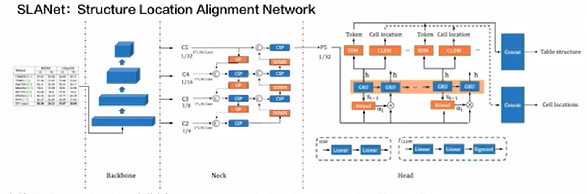
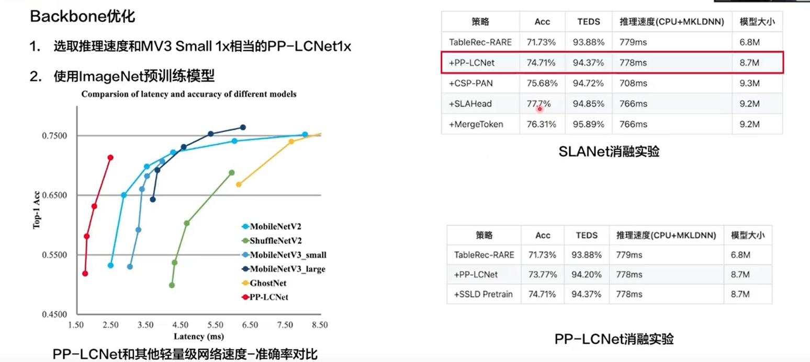
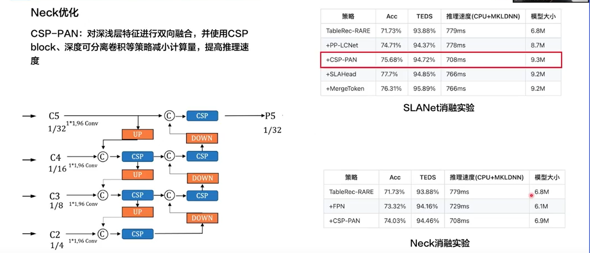
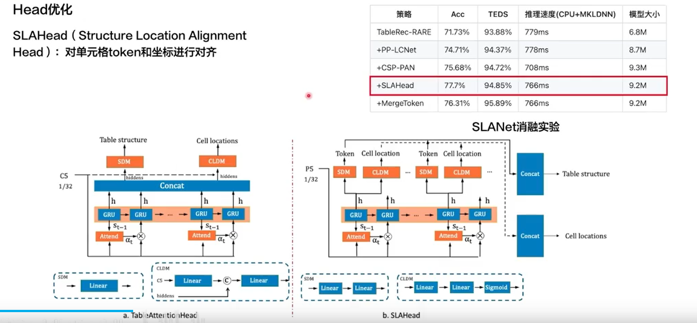
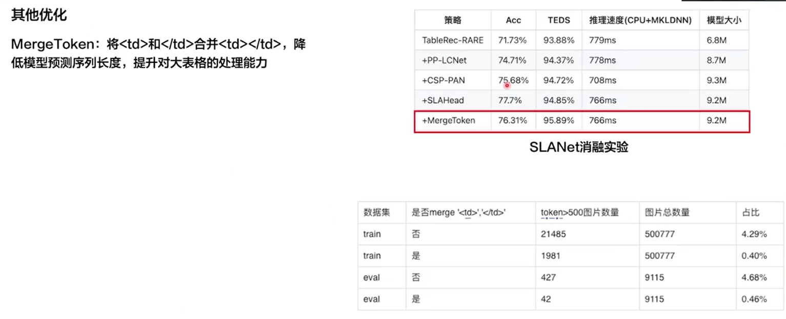
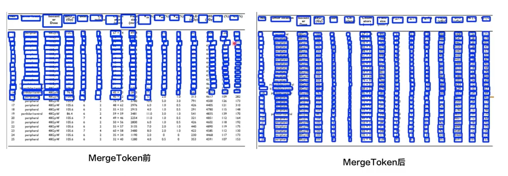
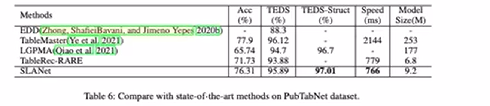
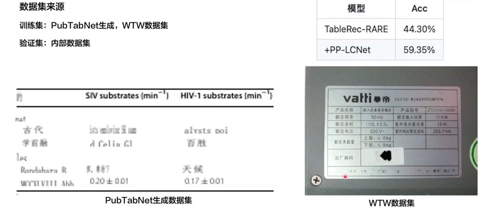
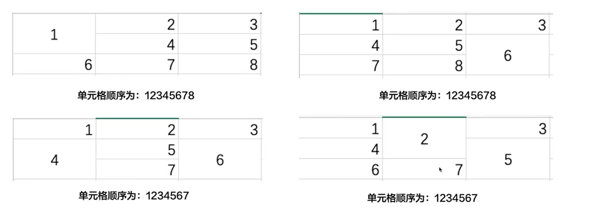

表格识别是一种自动从文档或图像中识别和提取表格内容及其结构的技术，广泛应用于数据录入、信息检索和文档分析等领域。通过使用计算机视觉和机器学习算法，表格识别能够将复杂的表格信息转换为可编辑的格式，方便用户进一步处理和分析数据。

通用表格识别产线用于解决表格识别任务，对图片中的表格进行识别，并以HTML格式输出。本产线集成了业界知名的 SLANet 和 SLANet_plus 表格结构识别模型。基于本产线，可实现对表格的精准预测，使用场景覆盖通用、制造、金融、交通等各个领域。本产线同时提供了灵活的服务化部署方式，支持在多种硬件上使用多种编程语言调用。不仅如此，本产线也提供了二次开发的能力，您可以基于本产线在您自己的数据集上训练调优，训练后的模型也可以无缝集成。

### 表格结构识别

表格结构识别是表格识别系统中的重要组成部分，能够将不可编辑表格图片转换为可编辑的表格形式（例如html）。表格结构识别的目标是对表格的行、列和单元格位置进行识别，该模块的性能直接影响到整个表格识别系统的准确性和效率。表格结构识别模块通常会输出表格区域的html代码或Latex代码，这些代码将作为输入传递给表格内容识别模块进行后续处理。

<table>
<tbody><tr>
<th>模型</th><th>模型下载链接</th>
<th>精度（%）</th>
<th>GPU推理耗时（ms） [常规模式 / 高性能模式]</th>
<th>CPU推理耗时（ms） [常规模式 / 高性能模式]</th>
<th>模型存储大小（MB）</th>
<th>介绍</th>
</tr>
<tr>
<td>SLANet</td>
<td><a href="https://paddle-model-ecology.bj.bcebos.com/paddlex/official_inference_model/paddle3.0.0/SLANet_infer.tar">推理模型</a>/<a href="https://paddle-model-ecology.bj.bcebos.com/paddlex/official_pretrained_model/SLANet_pretrained.pdparams">训练模型</a></td>
<td>59.52</td>
<td>23.96 / 21.75</td>
<td>- / 43.12</td>
<td>6.9</td>
<td rowspan="1">SLANet 是百度飞桨视觉团队自研的表格结构识别模型。该模型通过采用 CPU 友好型轻量级骨干网络 PP-LCNet、高低层特征融合模块 CSP-PAN、结构与位置信息对齐的特征解码模块 SLA Head，大幅提升了表格结构识别的精度和推理速度。</td>
</tr>
<tr>
<td>SLANet_plus</td>
<td><a href="https://paddle-model-ecology.bj.bcebos.com/paddlex/official_inference_model/paddle3.0.0/SLANet_plus_infer.tar">推理模型</a>/<a href="https://paddle-model-ecology.bj.bcebos.com/paddlex/official_pretrained_model/SLANet_plus_pretrained.pdparams">训练模型</a></td>
<td>63.69</td>
<td>23.43 / 22.16</td>
<td>- / 41.80</td>
<td>6.9</td>
<td rowspan="1">SLANet_plus 是百度飞桨视觉团队自研的表格结构识别模型 SLANet 的增强版。相较于 SLANet，SLANet_plus 对无线表、复杂表格的识别能力得到了大幅提升，并降低了模型对表格定位准确性的敏感度，即使表格定位出现偏移，也能够较准确地进行识别。
</td>
</tr>
<tr>
<td>SLANeXt_wired</td>
<td><a href="https://paddle-model-ecology.bj.bcebos.com/paddlex/official_inference_model/paddle3.0.0/SLANeXt_wired_infer.tar">推理模型</a>/<a href="https://paddle-model-ecology.bj.bcebos.com/paddlex/official_pretrained_model/SLANeXt_wired_pretrained.pdparams">训练模型</a></td>
<td rowspan="2">69.65</td>
<td rowspan="2">85.92 / 85.92</td>
<td rowspan="2">- / 501.66</td>
<td rowspan="2">351M</td>
<td rowspan="2">SLANeXt 系列是百度飞桨视觉团队自研的新一代表格结构识别模型。相较于 SLANet 和 SLANet_plus，SLANeXt 专注于对表格结构进行识别，并且对有线表格(wired)和无线表格(wireless)的识别分别训练了专用的权重，对各类型表格的识别能力都得到了明显提高，特别是对有线表格的识别能力得到了大幅提升。</td>
</tr>
<tr>
<td>SLANeXt_wireless</td>
<td><a href="https://paddle-model-ecology.bj.bcebos.com/paddlex/official_inference_model/paddle3.0.0/SLANeXt_wireless_infer.tar">推理模型</a>/<a href="https://paddle-model-ecology.bj.bcebos.com/paddlex/official_pretrained_model/SLANeXt_wireless_pretrained.pdparams">训练模型</a></td>
</tr>
</tbody></table>

#### SLANet

SLANet: Structure Location Alignment Network

##### backbone

##### Neck

##### head

##### MergeToken

相比TableRec-RARE，改进如下

- PP-LCNet cpu 友好型轻量级骨干网络
- CSP-PAN 轻量级高低特征融合模块
- SLAHead 结果与位置信息对齐解码模块

相比TableRec-RARE，性能提升如下

- PubTabNet数据集模型精度提升6.00%，中文数据集模型精度提升15.00%
- PubTabNet数据集TEDS提升2.00%，中文数据集TEDS提升8.75%
- 推理速度保持不变

在PubTabNet数据集上和其他SOTA算法进行比较

- Acc:模型对每张图像里表格结构的识别准确率，错一个token就算错误- TEDS:模型对表格信息还服的准确度，此指评价内容不仅包含表格结构，还包含表格内的文字内容
- TEDS-Struct:模型对表格结构信息还服的准确度，此指标评价内容仅包含表格结构
- Speed:模型在CPU机器上，开启MKL的情况下，单张图片的推理速度

中文模型

表格标注排序

https://www.bilibili.com/video/BV1wR4y1v7JE/?share_source=copy_web&vd_source=cf1f9d24648d49636e3d109c9f9a377d&t=1998
