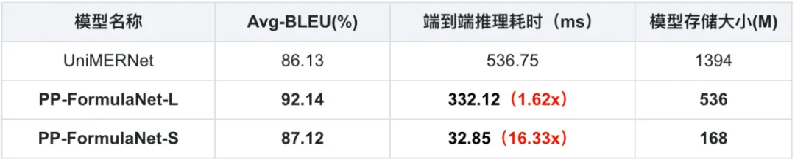
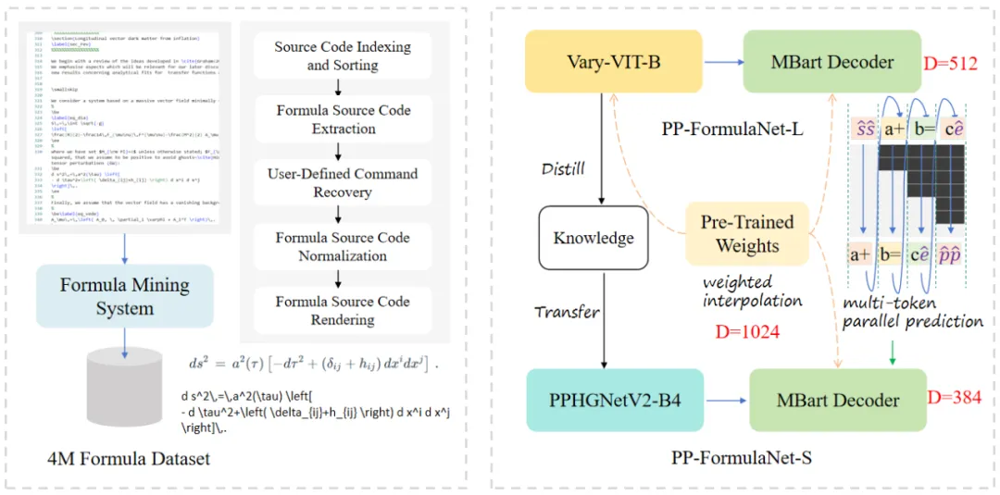
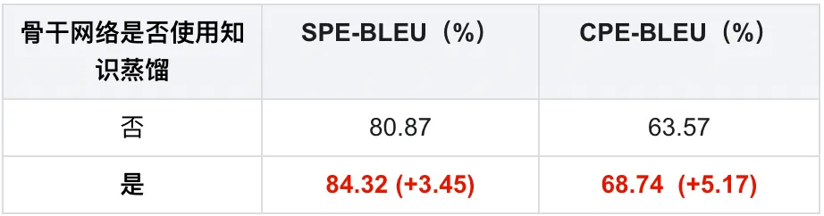
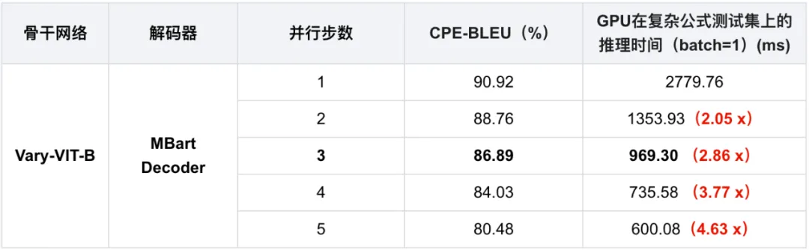

### 

### OCR前沿算法

虽然OCR是一个相对具体的任务，但涉及了多方面的技术，包括文本检测、文本识别、端到端文本识别、文档分析等等。学术上关于OCR各项相关技术的研究层出不穷，下文将简要介绍OCR任务中的几种关键技术的相关工作。

#### 文本检测

文本检测的任务是定位出输入图像中的文字区域。近年来学术界关于文本检测的研究非常丰富，一类方法将文本检测视为目标检测中的一个特定场景，基于通用目标检测算法进行改进适配，如TextBoxes[1]基于一阶段目标检测器SSD[2]算法，调整目标框使之适合极端长宽比的文本行，CTPN[3]则是基于Faster   RCNN[4]架构改进而来。但是文本检测与目标检测在目标信息以及任务本身上仍存在一些区别，如文本一般长宽比较大，往往呈“条状”，文本行之间可能比较密集，弯曲文本等，因此又衍生了很多专用于文本检测的算法，如EAST[5]、PSENet[6]、DBNet[7]等等

目前较为流行的文本检测算法可以大致分为**基于回归**和**基于分割**的两大类文本检测算法，也有一些算法将二者相结合。基于回归的算法借鉴通用物体检测算法，通过设定anchor回归检测框，或者直接做像素回归，这类方法对规则形状文本检测效果较好，但是对不规则形状的文本检测效果会相对差一些，比如CTPN[3]对水平文本的检测效果较好，但对倾斜、弯曲文本的检测效果较差，SegLink[8]对长文本比较好，但对分布稀疏的文本效果较差；基于分割的算法引入了Mask-RCNN[9]，这类算法在各种场景、对各种形状文本的检测效果都可以达到一个更高的水平，但缺点就是后处理一般会比较复杂，因此常常存在速度问题，并且无法解决重叠文本的检测问题。

图8 （左）基于回归的CTPN[3]算法优化anchor （中）基于分割的DB[7]算法优化后处理 （右）回归+分割的SAST[10]算法

#### 文本识别

文本识别的任务是识别出图像中的文字内容，一般输入来自于文本检测得到的文本框截取出的图像文字区域。文本识别一般可以根据待识别文本形状分为**规则文本识别**和**不规则文本识别**两大类。规则文本主要指印刷字体、扫描文本等，文本大致处在水平线位置；不规则文本往往不在水平位置，存在弯曲、遮挡、模糊等问题。不规则文本场景具有很大的挑战性，也是目前文本识别领域的主要研究方向。

        （左）规则文本 VS. （右）不规则文本

规则文本识别的算法根据解码方式的不同可以大致分为基于CTC和Sequence2Sequence两种，将网络学习到的序列特征 转化为 最终的识别结果 的处理方式不同。基于CTC的算法以经典的CRNN[11]为代表。

图10  基于CTC的识别算法 VS. 基于Attention的识别算法

不规则文本的识别算法相比更为丰富，如STAR-Net[12]等方法通过加入TPS等矫正模块，将不规则文本矫正为规则的矩形后再进行识别；RARE[13]等基于Attention的方法增强了对序列之间各部分相关性的关注；基于分割的方法将文本行的各字符作为独立个体，相比与对整个文本行做矫正后识别，识别分割出的单个字符更加容易；此外，随着近年来Transfomer[14]的快速发展和在各类任务中的有效性验证，也出现了一批基于Transformer的文本识别算法，这类方法利用transformer结构解决CNN在长依赖建模上的局限性问题，也取得了不错的效果。

图11 基于字符分割的识别算法[15]

#### 文档结构化识别

传统意义上的OCR技术可以解决文字的检测和识别需求，但在实际应用场景中，最终需要获取的往往是结构化的信息，如身份证、发票的信息格式化抽取，表格的结构化识别等等，多在快递单据抽取、合同内容比对、金融保理单信息比对、物流业单据识别等场景下应用。OCR结果+后处理是一种常用的结构化方案，但流程往往比较复杂，并且后处理需要精细设计，泛化性也比较差。在OCR技术逐渐成熟、结构化信息抽取需求日益旺盛的背景下，版面分析、表格识别、关键信息提取等关于智能文档分析的各种技术受到了越来越多的关注和研究。

##### 版面分析

版面分析（Layout Analysis）主要是对文档图像进行内容分类，类别一般可分为纯文本、标题、表格、图片等。现有方法一般将文档中不同的板式当做不同的目标进行检测或分割，如Soto Carlos[16]在目标检测算法Faster R-CNN的基础上，结合上下文信息并利用文档内容的固有位置信息来提高区域检测性能；Sarkar Mausoom[17]等人提出了一种基于先验的分割机制，在非常高的分辨率的图像上训练文档分割模型，解决了过度缩小原始图像导致的密集区域不同结构无法区分进而合并的问题。

##### 表格识别

表格识别（Table Recognition）的任务就是将文档里的表格信息进行识别和转换到excel文件中。文本图像中表格种类和样式复杂多样，例如不同的行列合并，不同的内容文本类型等，除此之外文档的样式和拍摄时的光照环境等都为表格识别带来了极大的挑战。这些挑战使得表格识别一直是文档理解领域的研究难点。

图13 表格识别任务示意图

表格识别的方法种类较为丰富，早期的基于启发式规则的传统算法，如Kieninger[18]等人提出的T-Rect等算法，一般通过人工设计规则，连通域检测分析处理；近年来随着深度学习的发展，开始涌现一些基于CNN的表格结构识别算法，如Siddiqui Shoaib Ahmed[19]等人提出的DeepTabStR，Raja Sachin[20]等人提出的TabStruct-Net等；此外，随着图神经网络（Graph Neural Network）的兴起，也有一些研究者尝试将图神经网络应用到表格结构识别问题上，基于图神经网络，将表格识别看作图重建问题，如Xue Wenyuan[21]等人提出的TGRNet；基于端到端的方法直接使用网络完成表格结构的HTML表示输出，端到端的方法大多采用Seq2Seq方法来完成表格结构的预测，如一些基于Attention或Transformer的方法，如TableMaster[22]。

图14 表格识别方法示意图

##### 关键信息提取

关键信息提取（Key Information Extraction，KIE）是Document VQA中的一个重要任务，主要从图像中提取所需要的关键信息，如从身份证中提取出姓名和公民身份号码信息，这类信息的种类往往在特定任务下是固定的，但是在不同任务间是不同的。

图15 DocVQA任务示意图

KIE通常分为两个子任务进行研究：

- SER: 语义实体识别 (Semantic Entity Recognition)，对每一个检测到的文本进行分类，如将其分为姓名，身份证。如下图中的黑色框和红色框。
- RE: 关系抽取 (Relation Extraction)，对每一个检测到的文本进行分类，如将其分为问题和的答案。然后对每一个问题找到对应的答案。如下图中的红色框和黑色框分别代表问题和答案，黄色线代表问题和答案之间的对应关系。

图16 ser与re任务

一般的KIE方法基于命名实体识别(Named Entity Recognition,NER)[4]来研究，但是这类方法只利用了图像中的文本信息，缺少对视觉和结构信息的使用，因此精度不高。在此基础上，近几年的方法都开始将视觉和结构信息与文本信息融合到一起，按照对多模态信息进行融合时所采用的的原理可以将这些方法分为下面四种：

    基于Grid的方法
    基于Token的方法
    基于GCN的方法
    基于End to End 的方法

### 产业级OCR开发套件PaddleOCR

OCR产业实践需要一套完整全流程的解决方案，来加快研发进度，节约宝贵的研发时间。也就是说，超轻量模型及其全流程解决方案，尤其对于算力、存储空间有限的移动端、嵌入式设备而言，可以说是刚需。

在此背景下，产业级OCR开发套件PaddleOCR应运而生。

#### PP-OCR与PP-Structrue

##### PP-OCR中英文模型

PP系列特色模型是飞桨各视觉开发套件针对产业实践需求进行深度优化的模型，力求速度与精度平衡。PaddleOCR中的PP系列特色模型包括针对文字检测识别任务的PP-OCR系列模型和针对文档分析的PP-Structure系列模型。

PP-OCR中英文模型采用的典型的两阶段OCR算法，即检测模型+识别模型的组成方式，具体的算法框架如下： 

图 PP-OCR系统pipeline示意图

可以看到，除输入输出外，PP-OCR核心框架包含了3个模块，分别是：文本检测模块、检测框矫正模块、文本识别模块。

- 文本检测模块：核心是一个基于DB检测算法训练的文本检测模型，检测出图像中的文字区域；
- 检测框矫正模块：将检测到的文本框输入检测框矫正模块，在这一阶段，将四点表示的文本框矫正为矩形框，方便后续进行文本识别，另一方面会进行文本方向判断和校正，例如如果判断文本行是倒立的情况，则会进行转正，该功能通过训练一个文本方向分类器实现；
- 文本识别模块：最后文本识别模块对矫正后的检测框进行文本识别，得到每个文本框内的文字内容，PP-OCR中使用的经典文本识别算法CRNN。

PaddleOCR先后推出了PP-OCR[23]和PP-OCRv2[24]模型。 目前最新版本PP-OCRV5

PP-OCR模型分为mobile版（轻量版）和server版（通用版），其中mobile版模型主要基于轻量级骨干网络MobileNetV3进行优化，优化后模型（检测模型+文本方向分类模型+识别模型）大小仅8.1M，CPU上平均单张图像预测耗时350ms，T4 GPU上约110ms，裁剪量化后，可在精度不变的情况下进一步压缩到3.5M，便于端侧部署，在骁龙855上测试预测耗时仅260ms。更多的PP-OCR评估数据可参考benchmark。

PP-OCRv2保持了PP-OCR的整体框架，主要做了效果上的进一步策略优化。提升包括3个方面：

- 在模型效果上，相对于PP-OCR mobile版本提升超7%；
- 在速度上，相对于PP-OCR server版本提升超过220%；
- 在模型大小上，11.6M的总大小，服务器端和移动端都可以轻松部署。

除了中英文模型，PaddleOCR也基于不同的数据集训练并开源了英文数字模型、多语言识别模型，以上均为超轻量模型，适用于不同的语言场景。

##### PP-Structure文档分析模型

PP-Structure支持版面分析（layout analysis）、表格识别（table recognition）、文档视觉问答（DocVQA）三种子任务。

PP-Structure核心功能点如下：

- 支持对图片形式的文档进行版面分析，可以划分文字、标题、表格、图片以及列表5类区域（与Layout-Parser联合使用）
- 支持文字、标题、图片以及列表区域提取为文字字段（与PP-OCR联合使用）
- 支持表格区域进行结构化分析，最终结果输出Excel文件
- 支持Python whl包和命令行两种方式，简单易用
- 支持版面分析和表格结构化两类任务自定义训练
- 支持VQA任务-SER和RE

#### 工业级部署方案

飞桨支持全流程、全场景推理部署，模型来源主要分为三种，第一种使用PaddlePaddle API构建网络结构进行训练所得，第二种是基于飞桨套件系列，飞桨套件提供了丰富的模型库、简洁易用的API，具备开箱即用，包括视觉模型库PaddleCV、智能语音库PaddleSpeech以及自然语言处理库PaddleNLP等，第三种采用X2Paddle工具从第三方框架（PyTorh、ONNX、TensorFlow等）产出的模型。

飞桨模型可以选用PaddleSlim工具进行压缩、量化以及蒸馏，支持五种部署方案，分别为服务化Paddle Serving、服务端/云端Paddle Inference、移动端/边缘端Paddle Lite、网页前端Paddle.js, 对于Paddle不支持的硬件，比如MCU、地平线、鲲云等国产芯片，可以借助Paddle2ONNX转化为支持ONNX的第三方框架。

### 公式识别

#### PP-FormulaNet

为了解决当前公式识别领域的技术挑战，飞桨团队从模型结构、预训练模型、并行解码预测方式、数据挖掘等方面入手，研发了可应对复杂公式结构识别的PP-FormulaNet-L（比当前最佳开源模型精度高6%）以及推理速度超快的PP-FormulaNet-S（比当前最佳开源模型快16倍）。在此基础上，飞桨团队也将自研的PP-DocLayout和PP-FormulaNet组合了公式识别产线，支持从海量PDF文件中对公式进行高精度定位和识别。

针对公式识别任务，PP-FormulaNet 系列支持5万种LaTeX常见词汇的识别，涵盖科研论文、试卷中的绝大多数LaTeX语法，允许更精准的文档处理和分析，为后续AI数学推理的精准性和完备性提供有力保障。同时，支持简单印刷公式、复杂印刷公式、手写公式的识别，适用于拍照搜题、论文总结等各种公式识别下游任务，提升文档版面解析的质量。

PP-FormulaNet 系列提供了两个不同尺度的模型，以满足不同场景的需求：

1. 高精度模型：PP-FormulaNet-L，采用Vary-ViT-B作为视觉编码器、维度为512的MBart Decoder作为公式解码器，其在精度上达到了 92.14 % Avg-BLEU，尤其适合需要高精度的任务场景；在效率上也有所保障，高精度 PP-FormulaNet-L 模型在 NVIDIA Tesla V100 GPU 上平均推理耗时 332.12 ms（batch=15）。
2. 高效率模型：PP-FormulaNet-S，采用PP-HGNetV2-B4作为视觉编码器，维度为384的MBart Decoder作为解码器，以提升推理速度和降低模型大小为目标，适合于资源受限的环境和实时应用场景。高效率模型在 NVIDIA Tesla V100 GPU上平均推理耗时 32.85 ms (batch=15)，相比于UniMERNet速度提升16倍。

##### PP-FormulaNet 在数据和算法层面均做了优化

在数据构建层面，设计了一套智能且精准的公式挖掘系统，能够高效解析论文源码，并支持用户自定义命令的公式自动恢复，从而提高复杂公式的提取效率。

在算法层面，我们从三个方面进行了优化：

- 基于权重插值的预训练模型加载：

  在当今大模型的时代，从头开始对模型进行预训练的成本已经变得极为昂贵。例如，GOT-OCR2.0 训练使用了 64 块 L40s GPU。然而，在实际生产中，为了提高模型的推理效率，通常需要对模型的维度或层数进行裁剪，例如将维度从 1024 降低到 512 或 384，这导致原始预训练权重无法直接应用于裁剪后的模型。鉴于大多数预训练模型采用的是 transformer 架构，我们假设注意力模块中相邻维度具有相似的语义表达，并通过最近邻插值对原始权重进行自适应调整，以便能够有效利用预训练权重的公式表征。在公式识别任务中，加载经过权重插值的预训练权重可以加速模型收敛，并提升其精度和泛化能力。结合表征能力更强的 Vary-ViT-B 视觉编码器，该方法在复杂公式上的 BLEU 分数甚至超越了原始网络。
  
- 基于知识蒸馏的骨干网络轻量化：

  PP-FormulaNet-S 的骨干网络采用了蒸馏技术，骨干网络基于Vary-ViT-B蒸馏得到，大幅增强模型在OCR领域的泛化能力。在这里，我们将基于大规模文档数据训练得到的 GOT-OCR2.0 模型的视觉编码器Vary-VIT-B作为“教师”模型，而将飞桨自研的高精度骨干网络 PP-HGNetV2-B4 作为“学生”模型。我们收集了大量多种类型的约 50 万文档图像数据，并利用 L2 损失函数，将大模型的输出作为目标，指导小模型的学习。在我们的公式识别任务中，蒸馏后PP-HGNetV2-B4网络相比于原始网络，在简单公式、复杂公式的BLEU分数分别提升了3.45%和5.17%。

  
- 多token并行预测技术的公式推理加速：

  与传统视觉模型不同，现有公式识别算法一般采用自回归生成架构，对于单张公式图像往往需要循环多步进行推理，裁剪网络深度和维度会影响到模型的精度，进而影响到网络对终止步数的判断，并延长网络的推理步数，因此并不一定可以带来公式识别模型推理效率的提升。为了解决这一问题，我们通过改进因果注意力掩码和训练中输入输出的对应关系，使得公式解码器可以在一步中预测多个 token 序列，从而大幅提高模型的推理效率。基于这一技术，在牺牲一定精度的情况下，并行步数为 2、3、4 和 5 分别可以带来 2.05 倍、2.86 倍、3.77 倍和 4.63 倍的速度提升。由于自回归模型的推理耗时主要集中在解码器的循环解码部分，而骨干网络仅需进行一次推理，对整体公式模型的推理耗时影响较小。因此，在Vary-VIT-B上获得的实验结果对于PP-HGNetV2-B4同样具有适用性。经过对准确性和速度的权衡，PP-FormulaNet-S 模型最终选择了 3 作为多 token 预测的并行步数。

  
-
