#### 真阳率、假阳率

真阳率 TPR

TPR = TP/(TP+FN)

含义是检测出来的真阳性样本数除以所有真实阳性样本数


假阳率 FPR

FPR = FP/FP+TN

含义是检测出来的假阳性样本数除以所有真实阴性样本数


#### 余弦退火 调度器

Cosine


### Loss


#### Margin Ranking Loss

Margin Ranking Loss 也被成为Pairwise Ranking Loss或者Hinge Loss，常用于排序的任务，如推荐系统、信息检索等。损失函数的目标是确保正例的得分高于负例的得分，且两者的得分差距至少为一个给定的边界（margin）。

Margin Ranking Loss的计算通用公式如下

```math
Loss(x_1,x_2) = max(0, -y*(x_1-x_2)+margin) 
```

其中，如果x1和x2对应的样本ground truth为x1应该排在x2前面，则 
y=1，否则y=-1为了计算的方便，一般会在组织训练数据的时候，统一把
x1存放ground truth靠前的样本的模型得分,x2存放ground truth排序靠后的样本的模型得分，这样计算公式减少了变量$y，Loss(x_1,x_2) = max(0,x_2-x_1+margin)$

pytorch自带loss的实现，举例如下：

```
import torch
import torch.nn as nn

# 创建 MarginRankingLoss 对象，margin默认为0
loss_fn = nn.MarginRankingLoss(margin=0.5)

# 创建输入数据
output1 = torch.tensor([1.0, 2.0, 3.0])
output2 = torch.tensor([0.5, 1.5, 2.5])
target = torch.tensor([1, -1, 1])

# 计算损失
loss = loss_fn(output1, output2, target)
print(loss)  # 输出：0.333
```

paddle

```
import paddle

input = paddle.to_tensor([[1, 2], [3, 4]], dtype="float32")
other = paddle.to_tensor([[2, 1], [2, 4]], dtype="float32")
label = paddle.to_tensor([[1, -1], [-1, -1]], dtype="float32")
margin_rank_loss = paddle.nn.MarginRankingLoss()
loss = margin_rank_loss(input, other, label)
print(loss)
Tensor(shape=[], dtype=float32, place=Place(cpu), stop_gradient=True,
0.75000000)
```


#### Triplet Margin Loss （Triplet Loss）

三元组边界损失/三元组损失

由Google研究团队在论文《FaceNet：A Unified Embedding for Face Recognition》所提出，常用于人脸识别任务。主要是为了非同类极相似样本的区分，例如同卵双胞胎的区分。Triplet loss的优势在于细节区分，即当两个输入相似时，Triplet loss能够更好地对细节进行建模，相当于加入了两个输入差异性差异的度量，学习到输入的更好表示，从而在上述两个任务中有出色的表现


【缺点】

三元组的选取导致数据的分布并不一定均匀，所以在模型训练过程表现很不稳定，而且收敛慢，需要根据结果不断调节参数，而且Triplet loss比分类损失更容易过拟合。

【优势】

基于Triplet loss的神经网络模型可以很好的对细节进行区分，Triplet loss通常能在训练中学习到更好的细微的特征feature，更特别的是Triplet loss能够根据模型训练的需要设定一定的阈值。

带Triplet loss的网络结构在进行训练的时候一般都会设置一个阈值margin，设计者可以通过改变margin的值来控制正负样本的距离。


Triplet loss的思想用欧氏距离形式化表示为：

```math

Loss(a,p,n) = max(0, d(a_i,p_i) - d(a_i, n_i) + margin)
```

三元组由 a (anchor)，p (正样本) 和 n (负样本)组成.

其中d 表示距离函数，一般指在Embedding下的欧式距离计算。很显然，Triplet-Loss是希望让a和p的距离尽可能小，而a和n的距离尽可能大。

在训练中使用Triplet loss的一个重要选择就是我们需要对负样本进行挑选，称之为负样本选择或者三元组采集。选择的策略会对训练效率和最终性能结果有着重要的影响。一个明显的策略就是：简单的三元组应该尽可能被避免采样到，因为其loss为0，对优化并没有任何帮助。


对于阈值margin的设置需要注意选择合适大小的值，理论上来说，较大的margin能够增强模型对不同类样本的区分度，但是如果在训练初期就将margin设置得比较大，则可能会增加模型训练的难度，进而出现网络不收敛的情况。在模型训练初期先使用一个较小的值对网络进行初始化训练，之后再根据测试的结果对margin的值进行适当的增大或缩小，这样可以在保证网络收敛的同时让模型也能拥有一个较好的性能。

在这里设样本为 x，f ( x ) 为映射函数，整个训练集的大小为N，则每个triplet的输入<a, p, n>，对应的Triplet loss形式化表示就可以写作：

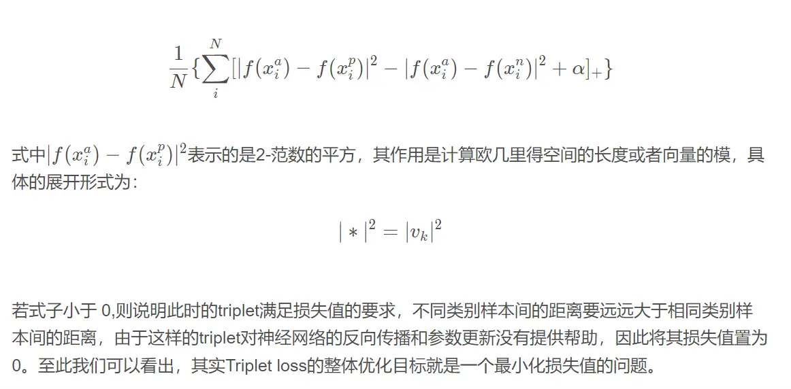


其中样本可以分为三类：

- easy triplets： $L=0$，即 $d(a,p) + margin < d(d,n)$
 ，这种情况不需要优化，天然a和p的距离很近，a和n的距离很远
- hard triplets： $L > margin$，即 $d(d,n) < d(d, p)$和n的距离近，a和p的距离远，这种情况损失最大，需要优化
- semi-hard triplets： $L < margin$ ，即 $d(d,p)< d(d,n) < d(d, p) + margin$ ,即a和p的距离比a和n的距离近，但是近的不够多，不满足margin，这种情况存在损失，但损失比hard triplets要小，也需要优化

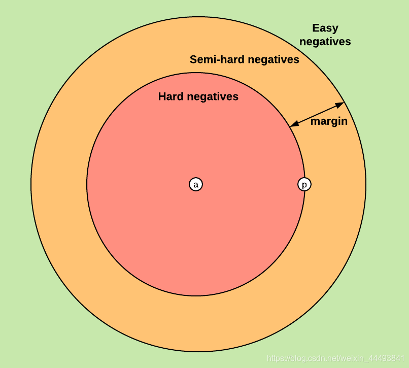


**应用场景**：
- 确定样本之间的相对相似性
- 用于基于内容的检索问题

```
anchor = torch.randn(100, 128, requires_grad=True)
positive = torch.randn(100, 128, requires_grad=True)
negative = torch.randn(100, 128, requires_grad=True)
triplet_margin_loss = torch.nn.TripletMarginLoss(margin=1.0, p=2)
output = triplet_margin_loss(anchor, positive, negative)
```

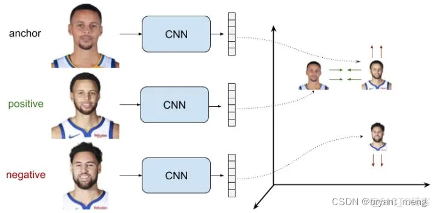


#### TripletAngularMarginLoss

一个更稳健的三重态损失，在角边界上进行硬正/负挖掘，而不是d(A,p)和d(A,n)之间的相对距离 (飞浆)


**先了解向量的点积**

$\vec p · \left[
 \begin{matrix}
   x \\
   y  \\
   z  
  \end{matrix} 
\right]$ = $p_1x + p_2y + p_3z$点积的几何意义将其他向量投影到p上，然后将投影的长度与p的长度相乘 即


```math
a · b = |a| * |b| * cos(\theta)
```

|a|、|b|表示向量的模（长度），θ表示向量a和b之间的夹角


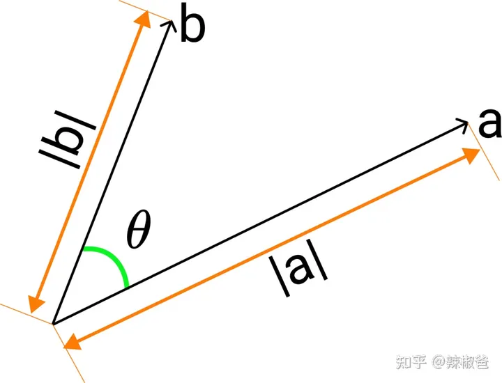


```
# 向量a,b的定义
a = [4, 8, 10]
b = [9, 2, 7]
# 向量的点积
dot_product = dot(a, b)
# 求向量a，b的模长
length_a = norm(a)
length_b = norm(b)
# 求θ角的余弦值
cos_θ = dot_product / (length_a * length_b)
```

**余弦相似度**

用向量空间中的两个向量夹角的余弦值作为衡量两个个体间差异大小的度量，值越接近1，就说明夹角角度越接近0°，也就是两个向量越相似，就叫做余弦相似

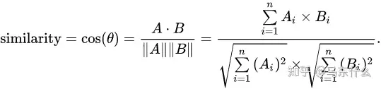


余弦相似度衡量两个向量在方向上的相似性，而不care两个向量的实际长度，A和B的长度即使是一个超级短一个超级长的情况下，二者的余弦相似性也可能为1（即theta=0，此时两个向量重合）；

> 存在的问题[1]：
余弦相似度更多的是从方向上区分差异，而对绝对的数值不敏感

> 需要修正这种不合理性，就出现了调整余弦相似度，即所有维度上的数值都减去一个均值。
修正的余弦相似度可以说就是对余弦相似度进行归一化处理的算法

点积 + L2归一化就相当于计算余弦相似度


### 数据增强


### PP-LCNet 轻量级骨干网络


#### 模型简介

在计算机视觉领域中，骨干网络的好坏直接影响到整个视觉任务的结果。在之前的一些工作中，相关的研究者普遍将 FLOPs 或者 Params 作为优化目的，但是在工业界真实落地的场景中，推理速度才是考量模型好坏的重要指标，然而，推理速度和准确性很难兼得。考虑到工业界有很多基于 Intel CPU 的应用，所以我们本次的工作旨在使骨干网络更好的适应 Intel CPU，从而得到一个速度更快、准确率更高的轻量级骨干网络，与此同时，目标检测、语义分割等下游视觉任务的性能也同样得到提升。

近年来，有很多轻量级的骨干网络问世，尤其最近两年，各种 NAS 搜索出的网络层出不穷，这些网络要么主打 FLOPs 或者 Params 上的优势，要么主打 ARM 设备上的推理速度的优势，很少有网络专门针对 Intel CPU 做特定的优化，导致这些网络在 Intel CPU 端的推理速度并不是很完美。基于此，我们针对 Intel CPU 设备以及其加速库 MKLDNN 设计了特定的骨干网络 PP-LCNet，比起其他的轻量级的 SOTA 模型，该骨干网络可以在不增加推理时间的情况下，进一步提升模型的性能，最终大幅度超越现有的 SOTA 模型。与其他模型的对比图如下。 

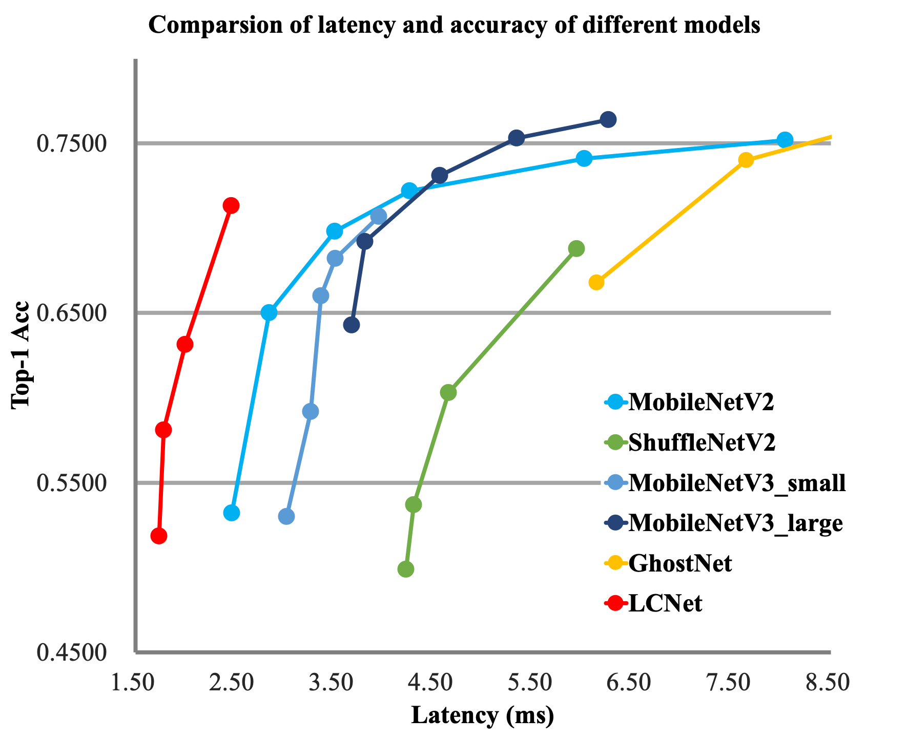


#### 模型细节

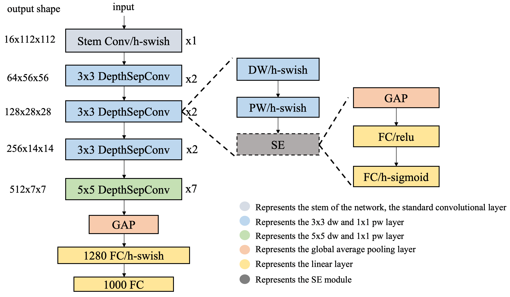
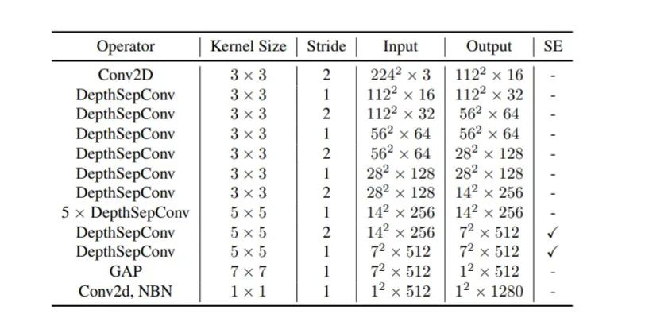

我们经过大量的实验发现，在基于 Intel CPU 设备上，尤其当启用 MKLDNN 加速库后，很多看似不太耗时的操作反而会增加延时，比如 elementwise-add 操作、split-concat 结构等。所以最终我们选用了结构尽可能精简、速度尽可能快的 block 组成我们的 BaseNet（类似 MobileNetV1）。基于 BaseNet，我们通过实验，总结了四条几乎不增加延时但是可以提升模型精度的方法，融合这四条策略，我们组合成了 PP-LCNet。下面对这四条策略一一介绍：


**更好的激活函数**

自从卷积神经网络使用了 ReLU 激活函数后，网络性能得到了大幅度提升，近些年 ReLU 激活函数的变体也相继出现，如 Leaky-ReLU、P-ReLU、ELU 等，2017 年，谷歌大脑团队通过搜索的方式得到了 swish 激活函数，该激活函数在轻量级网络上表现优异，在 2019 年，MobileNetV3 的作者将该激活函数进一步优化为 H-Swish，该激活函数去除了指数运算，速度更快，网络精度几乎不受影响。我们也经过很多实验发现该激活函数在轻量级网络上有优异的表现。所以在 PP-LCNet 中，我们选用了该激活函数。

**合适的位置添加 SE 模块**

SE 模块是 SENet 提出的一种通道注意力机制，可以有效提升模型的精度。但是在 Intel CPU 端，该模块同样会带来较大的延时，如何平衡精度和速度是我们要解决的一个问题。虽然在 MobileNetV3 等基于 NAS 搜索的网络中对 SE 模块的位置进行了搜索，但是并没有得出一般的结论，我们通过实验发现，SE 模块越靠近网络的尾部对模型精度的提升越大。下表也展示了我们的一些实验结果：

| SE Location       | Top-1 Acc(\%) | Latency(ms) |
|:--:|:--:|:--:|
| 1100000000000     | 61.73           | 2.06         |
| 0000001100000     | 62.17           | 2.03         |
| <b>0000000000011<b>     | <b>63.14<b>           | <b>2.05<b>         |
| 1111111111111     | 64.27           | 3.80         |

最终，PP-LCNet 中的 SE 模块的位置选用了表格中第三行的方案。


**合适的位置添加更大的卷积核**

在 MixNet 的论文中，作者分析了卷积核大小对模型性能的影响，结论是在一定范围内大的卷积核可以提升模型的性能，但是超过这个范围会有损模型的性能，所以作者组合了一种 split-concat 范式的 MixConv，这种组合虽然可以提升模型的性能，但是不利于推理。我们通过实验总结了一些更大的卷积核在不同位置的作用，类似 SE 模块的位置，更大的卷积核在网络的中后部作用更明显，下表展示了 5x5 卷积核的位置对精度的影响：

| large-kernel Location       | Top-1 Acc(\%) | Latency(ms) |
|:--:|:--:|:--:|
| 1111111111111     | 63.22           | 2.08         |
| 1111111000000     | 62.70           | 2.07        |
| <b>0000001111111<b>     | <b>63.14<b>           | <b>2.05<b>         |

实验表明，更大的卷积核放在网络的中后部即可达到放在所有位置的精度，与此同时，获得更快的推理速度。PP-LCNet 最终选用了表格中第三行的方案

**GAP 后使用更大的 1x1 卷积层**

在 GoogLeNet 之后，GAP（Global-Average-Pooling）后往往直接接分类层，但是在轻量级网络中，这样会导致 GAP 后提取的特征没有得到进一步的融合和加工。如果在此后使用一个更大的 1x1 卷积层（等同于 FC 层），GAP 后的特征便不会直接经过分类层，而是先进行了融合，并将融合的特征进行分类。这样可以在不影响模型推理速度的同时大大提升准确率。
BaseNet 经过以上四个方面的改进，得到了 PP-LCNet。下表进一步说明了每个方案对结果的影响：

| Activation | SE-block | Large-kernel | last-1x1-conv | Top-1 Acc(\%) | Latency(ms) |
|:--:|:--:|:--:|:--:|:--:|:--:|
| 0       | 1       | 1               | 1                | 61.93 | 1.94 |
| 1       | 0       | 1               | 1                | 62.51 | 1.87 |
| 1       | 1       | 0               | 1                | 62.44 | 2.01 |
| 1       | 1       | 1               | 0                | 59.91 | 1.85 |
| <b>1<b>       | <b>1<b>       | <b>1<b>               | <b>1<b>                | <b>63.14<b> | <b>2.05<b> |


#### 实验结果

**图像分类**

图像分类我们选用了 ImageNet 数据集，相比目前主流的轻量级网络，PP-LCNet 在相同精度下可以获得更快的推理速度。当使用百度自研的 SSLD 蒸馏策略后，精度进一步提升，在 Intel cpu 端约 5ms 的推理速度下 ImageNet 的 Top-1 Acc 超过了 80%。

| Model | Params(M) | FLOPs(M) | Top-1 Acc(\%) | Top-5 Acc(\%) | Latency(ms) | 预训练模型下载地址 | inference模型下载地址 |
|:--:|:--:|:--:|:--:|:--:|:--:|:--:|:--:|
| PPLCNet_x0_25  | 1.5 | 18  | 51.86 | 75.65 | 0.44 | [下载链接](https://paddle-imagenet-models-name.bj.bcebos.com/dygraph/legendary_models/PPLCNet_x0_25_pretrained.pdparams) | [下载链接](https://paddle-imagenet-models-name.bj.bcebos.com/dygraph/inference/PPLCNet_x0_25_infer.tar) |
| PPLCNet_x0_35  | 1.6 | 29  | 58.09 | 80.83 | 0.45 | [下载链接](https://paddle-imagenet-models-name.bj.bcebos.com/dygraph/legendary_models/PPLCNet_x0_35_pretrained.pdparams) | [下载链接](https://paddle-imagenet-models-name.bj.bcebos.com/dygraph/inference/PPLCNet_x0_35_infer.tar) |
| PPLCNet_x0_5   | 1.9 | 47  | 63.14 | 84.66 | 0.44 | [下载链接](https://paddle-imagenet-models-name.bj.bcebos.com/dygraph/legendary_models/PPLCNet_x0_5_pretrained.pdparams) | [下载链接](https://paddle-imagenet-models-name.bj.bcebos.com/dygraph/inference/PPLCNet_x0_5_infer.tar) |
| PPLCNet_x0_75  | 2.4 | 99  | 68.18 | 88.30 | 0.44 | [下载链接](https://paddle-imagenet-models-name.bj.bcebos.com/dygraph/legendary_models/PPLCNet_x0_75_pretrained.pdparams) | [下载链接](https://paddle-imagenet-models-name.bj.bcebos.com/dygraph/inference/PPLCNet_x0_75_infer.tar) |
| PPLCNet_x1_0     | 3.0 | 161 | 71.32 | 90.03 | 0.47 | [下载链接](https://paddle-imagenet-models-name.bj.bcebos.com/dygraph/legendary_models/PPLCNet_x1_0_pretrained.pdparams) | [下载链接](https://paddle-imagenet-models-name.bj.bcebos.com/dygraph/inference/PPLCNet_x1_0_infer.tar) |
| PPLCNet_x1_5   | 4.5 | 342 | 73.71 | 91.53 | 0.54 | [下载链接](https://paddle-imagenet-models-name.bj.bcebos.com/dygraph/legendary_models/PPLCNet_x1_5_pretrained.pdparams) | [下载链接](https://paddle-imagenet-models-name.bj.bcebos.com/dygraph/inference/PPLCNet_x1_5_infer.tar) |
| PPLCNet_x2_0     | 6.5 | 590 | 75.18 | 92.27 | 0.64 | [下载链接](https://paddle-imagenet-models-name.bj.bcebos.com/dygraph/legendary_models/PPLCNet_x2_0_pretrained.pdparams) | [下载链接](https://paddle-imagenet-models-name.bj.bcebos.com/dygraph/inference/PPLCNet_x2_0_infer.tar) |
| PPLCNet_x2_5   | 9.0 | 906 | 76.60 | 93.00 | 0.71 | [下载链接](https://paddle-imagenet-models-name.bj.bcebos.com/dygraph/legendary_models/PPLCNet_x2_5_pretrained.pdparams) | [下载链接](https://paddle-imagenet-models-name.bj.bcebos.com/dygraph/inference/PPLCNet_x2_5_infer.tar) |
| PPLCNet_x0_5_ssld | 1.9 | 47  | 66.10 | 86.46 | 0.44 | [下载链接](https://paddle-imagenet-models-name.bj.bcebos.com/dygraph/legendary_models/PPLCNet_x0_5_ssld_pretrained.pdparams) | [下载链接](https://paddle-imagenet-models-name.bj.bcebos.com/dygraph/inference/PPLCNet_x0_5_ssld_infer.tar) |
| PPLCNet_x1_0_ssld | 3.0 | 161 | 74.39 | 92.09 | 0.47 | [下载链接](https://paddle-imagenet-models-name.bj.bcebos.com/dygraph/legendary_models/PPLCNet_x1_0_ssld_pretrained.pdparams) | [下载链接](https://paddle-imagenet-models-name.bj.bcebos.com/dygraph/inference/PPLCNet_x1_0_ssld_infer.tar) |
| PPLCNet_x2_5_ssld | 9.0 | 906 | 80.82 | 95.33 | 0.71 | [下载链接](https://paddle-imagenet-models-name.bj.bcebos.com/dygraph/legendary_models/PPLCNet_x2_5_ssld_pretrained.pdparams) | [下载链接](https://paddle-imagenet-models-name.bj.bcebos.com/dygraph/inference/PPLCNet_x2_5_ssld_infer.tar) |

其中 `_ssld` 表示使用 `SSLD 蒸馏`后的模型。关于 `SSLD蒸馏` 的内容，详情 [SSLD 蒸馏](../../training/advanced/knowledge_distillation.md)。


与其他轻量级网络的性能对比：

| Model | Params(M) | FLOPs(M) | Top-1 Acc(\%) | Top-5 Acc(\%) | Latency(ms) |
|:--:|:--:|:--:|:--:|:--:|:--:|
| MobileNetV2_x0_25  | 1.5 | 34  | 53.21 | 76.52 | 2.47 |
| MobileNetV3_small_x0_35  | 1.7 | 15  | 53.03 | 76.37 | 3.02 |
| ShuffleNetV2_x0_33  | 0.6 | 24  | 53.73 | 77.05 | 4.30 |
| <b>PPLCNet_x0_25<b>  | <b>1.5<b> | <b>18<b>  | <b>51.86<b> | <b>75.65<b> | <b>1.74<b> |
| MobileNetV2_x0_5  | 2.0 | 99  | 65.03 | 85.72 | 2.85 |
| MobileNetV3_large_x0_35  | 2.1 | 41  | 64.32 | 85.46 | 3.68 |
| ShuffleNetV2_x0_5  | 1.4 | 43  | 60.32 | 82.26 | 4.65 |
| <b>PPLCNet_x0_5<b>   | <b>1.9<b> | <b>47<b>  | <b>63.14<b> | <b>84.66<b> | <b>2.05<b> |
| MobileNetV1_x1_0 | 4.3 | 578  | 70.99 | 89.68 | 3.38 |
| MobileNetV2_x1_0 | 3.5 | 327  | 72.15 | 90.65 | 4.26 |
| MobileNetV3_small_x1_25  | 3.6 | 100  | 70.67 | 89.51 | 3.95 |
| <b>PPLCNet_x1_0<b>     |<b> 3.0<b> | <b>161<b> | <b>71.32<b> | <b>90.03<b> | <b>2.46<b> |


**目标检测**

目标检测的方法我们选用了百度自研的 PicoDet，该方法主打轻量级目标检测场景，下表展示了在 COCO 数据集上、backbone 选用 PP-LCNet 与 MobileNetV3 的结果的比较，无论在精度还是速度上，PP-LCNet 的优势都非常明显。

| Backbone | mAP(%) | Latency(ms) |
|:--:|:--:|:--:|
MobileNetV3_large_x0_35 | 19.2 | 8.1 |
<b>PPLCNet_x0_5<b> | <b>20.3<b> | <b>6.0<b> |
MobileNetV3_large_x0_75 | 25.8 | 11.1 |
<b>PPLCNet_x1_0<b> | <b>26.9<b> | <b>7.9<b> |


### PP-LCNetV2

骨干网络对计算机视觉下游任务的影响不言而喻，不仅对下游模型的性能影响很大，而且模型效率也极大地受此影响，但现有的大多骨干网络在真实应用中的效率并不理想，特别是缺乏针对 Intel CPU 平台所优化的骨干网络，我们测试了现有的主流轻量级模型，发现在 Intel CPU 平台上的效率并不理想，然而目前 Intel CPU 平台在工业界仍有大量使用场景，因此我们提出了 PP-LCNet 系列模型，PP-LCNetV2 是在 PP-LCNetV1 基础上所改进的。

#### 模型细节

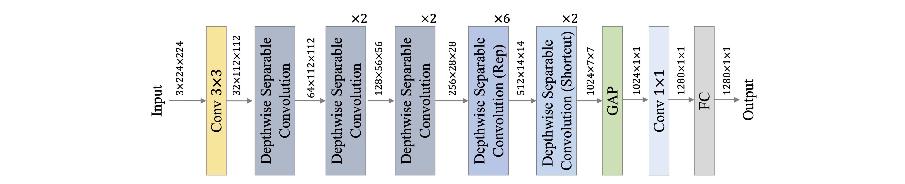

PP-LCNetV2 模型的网络整体结构如上图所示。PP-LCNetV2 模型是在 PP-LCNetV1 的基础上优化而来，主要使用重参数化策略组合了不同大小卷积核的深度卷积，并优化了点卷积、Shortcut等

#### Rep 策略

卷积核的大小决定了卷积层感受野的大小，通过组合使用不同大小的卷积核，能够获取不同尺度的特征，因此 PPLCNetV2 在 Stage4、Stage5 中，在同一层组合使用 kernel size 分别为 5、3、1 的 DW 卷积，同时为了避免对模型效率的影响，使用重参数化（Re parameterization，Rep）策略对同层的 DW 卷积进行融合，如下图所示。

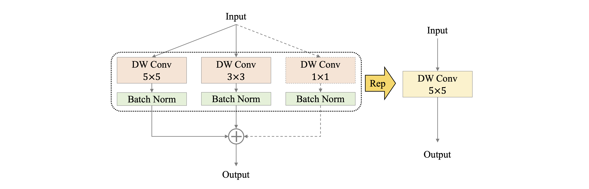


#### PW 卷积

深度可分离卷积通常由一层 DW 卷积和一层 PW 卷积组成，用以替换标准卷积，为了使深度可分离卷积具有更强的拟合能力，我们尝试使用两层 PW 卷积，同时为了控制模型效率不受影响，两层 PW 卷积设置为：第一个在通道维度对特征图压缩，第二个再通过放大还原特征图通道，如下图所示。通过实验发现，该策略能够显著提高模型性能，同时为了平衡对模型效率带来的影响，PPLCNetV2 仅在 Stage4 中使用了该策略。


####  Shortcut

残差结构（residual）自提出以来，被诸多模型广泛使用，但在轻量级卷积神经网络中，由于残差结构所带来的元素级（element-wise）加法操作，会对模型的速度造成影响，我们在 PP-LCNetV2 中，以 Stage 为单位实验了残差结构对模型的影响，发现残差结构的使用并非一定会带来性能的提高，因此 PPLCNetV2 仅在最后一个 Stage 中的使用了残差结构：在 Block 中增加 Shortcut，如下图所示


#### 激活函数

在目前的轻量级卷积神经网络中，ReLU、Hard-Swish 激活函数最为常用，虽然在模型性能方面，Hard-Swish 通常更为优秀，然而我们发现部分推理平台对于 Hard-Swish 激活函数的效率优化并不理想，因此为了兼顾通用性，PP-LCNetV2 默认使用了 ReLU 激活函数，并且我们测试发现，ReLU 激活函数对于较大模型的性能影响较小。

#### SE 模块

虽然 SE 模块能够显著提高模型性能，但其对模型速度的影响同样不可忽视，在 PP-LCNetV1 中，我们发现在模型中后部使用 SE 模块能够获得最大化的收益。在 PP-LCNetV2 的优化过程中，我们以 Stage 为单位对 SE 模块的位置做了进一步实验，并发现在 Stage4 中使用能够取得更好的平衡。


在不使用额外数据的前提下，PPLCNetV2_base 模型在图像分类 ImageNet 数据集上能够取得超过 77% 的 Top1 Acc，同时在 Intel CPU 平台的推理时间在 4.4 ms 以下，如下表所示，其中推理时间基于 Intel(R) Xeon(R) Gold 6271C CPU @ 2.60GHz 硬件平台，OpenVINO 推理平台。


| Model | Params(M) | FLOPs(M) | Top-1 Acc(\%) | Top-5 Acc(\%) | Latency(ms) |
|:--:|:--:|:--:|:--:|:--:|:--:|
| MobileNetV3_Large_x1_25 | 7.4 | 714  | 76.4 | 93.00 | 5.19 |
| PPLCNetV1_x2_5  | 9 | 906  | 76.60 | 93.00 | 7.25 |
| <b>PPLCNetV2_base<b>  | <b>6.6<b> | <b>604<b>  | <b>77.04<b> | <b>93.27<b> | <b>0.68<b> |
| <b>PPLCNetV2_base_ssld<b>  | <b>6.6<b> | <b>604<b>  | <b>80.07<b> | <b>94.87<b> | <b>0.68<b> |


https://github.com/PaddlePaddle/PaddleClas/blob/release/2.5.2/docs/zh_CN/models/ImageNet1k/PP-LCNetV2.md

### PP-LCNetV3

PP-LCNetV3是PP-LCNet系列模型的最新版本，属于轻量级卷积网络，专为CPU设备优化设计。

PP-LCNetV3 是百度飞桨团队在 PP-LCNet 系列基础上推出的轻量级卷积神经网络，其核心思想是：不追求极致的计算量（FLOPs）最低，而是追求在保证极快推理速度的前提下，实现最佳的精度-速度平衡。

PP-LCNet 系列的成功基于一个关键洞察：在Intel CPU上，一些在FLOPs上“廉价”的操作（如深度可分离卷积）在实际推理中可能很慢，而一些“昂贵”的操作（如普通的卷积）反而更快。

因此，PP-LCNetV3 的设计哲学是：

- 以实际推理速度为第一优化目标，而非仅仅优化理论FLOPs。
- 充分利用CPU的并行计算能力，偏好使用 3x3 标准卷积和 1x1 卷积。
- 在关键位置引入精心设计和放置的模块来提升精度，同时对速度影响最小。

PP-LCNetV3 在 PP-LCNetV2 的基础上，主要带来了三项核心改进

#### 更高效的 Network Structure

**更大的卷积核放在后端**
- 在网络的后期（depth3 和 depth4 阶段）使用 5x5 卷积来替换部分 3x3 卷积。

  网络后期的特征图尺寸小，通道数多，使用更大的卷积核可以扩大感受野，捕获更复杂的全局信息，且计算量增加可控。在CPU上，由于计算密度高，大kernel卷积的效率损失相对较小。

**重新思考 Shortcut 的位置**
- 移除了网络早期（depth1 和 depth2 阶段）的 Shortcut 连接。

  早期特征图尺寸大，Shortcut 中的张量相加操作（Element-wise Add）会带来显著的内存读写开销，在CPU上成为瓶颈。移除它们可以加快速度。
- 在深层（depth3 和 depth4）保留 Shortcut，因为那里的特征图尺寸小，Shortcut 的开销可以忽略，同时能稳定训练和促进梯度流动。

#### 更高效的激活函数：Star激活函数

- 提出了一种新的激活函数 Star-ReLU。

```math
Star-ReLU(x) = (ReLU(x))^2 * (a * x + b) + c
```
可以看作是 ReLU 和 Powerful CNN 激活函数 的折衷

优点
- 比简单的 ReLU/PReLU 表达能力强，能带来明显的精度提升。
- 比更复杂的激活函数（如 DynamicReLU, MetaFormer 中用的 GELU）在CPU上计算效率高得多。
- 它是一个单调且无上界的激活函数，有利于优化。

#### 更高效的分支结构：Rep 策略
- 在 depth3 和 depth4 阶段的某些块中，引入了 Rep 结构（重参数化结构）
- 训练时：使用一个多分支结构，包含：
    一个 3x3 深度可分离卷积
    一个 1x1 卷积分支
    一个恒等映射分支
- 推理时：通过结构重参数化技术，将这三个分支合并成一个单一的 3x3 卷积。

好处：
- 训练时：多分支结构提供了更丰富的梯度流，相当于一个高效的模型集成，显著提升了模型性能。
- 推理时：合并为单一卷积，不引入任何额外的计算开销，保持了模型的高速度。

#### 整体网络结构

PP-LCNetV3 的主体结构仍然是分阶段的（Stage），下表是 PP-LCNetV3 的一个典型配置（例如 1.0x 版本）：

Stage|	Operator|	Output Size|	Channels|	Blocks|	Stride
---|---|---|---|---|---|
1|	Conv2d|	112x112|	16|	1|	2
2|	DepthwiseSepBlock|	56x56|	32|	2|	2
3|	LCNetBlock|	28x28|	64|	2|	2
4|	LCNetBlock|	14x14| 128|	6| 2
5|	LCNetBlock|	7x7|	256|	2|	2
6|	Conv2d, Pooling, FC|	1x1|	1000|	1|	-


### PP-HGNet


#### 模型简介

PP-HGNet(High Performance GPU Net) 是百度飞桨视觉团队自研的更适用于 GPU 平台的高性能骨干网络，该网络在 VOVNet 的基础上使用了可学习的下采样层（LDS Layer），融合了 ResNet_vd、PPHGNet 等模型的优点，该模型在 GPU 平台上与其他 SOTA 模型在相同的速度下有着更高的精度。在同等速度下，该模型高于 ResNet34-D 模型 3.8 个百分点，高于 ResNet50-D 模型 2.4 个百分点，在使用百度自研 SSLD 蒸馏策略后，超越 ResNet50-D 模型 4.7 个百分点。与此同时，在相同精度下，其推理速度也远超主流 VisionTransformer 的推理速度。


#### 模型细节

PP-HGNet 作者针对 GPU 设备，对目前 GPU 友好的网络做了分析和归纳，尽可能多的使用 3x3 标准卷积（计算密度最高）。在此将 VOVNet 作为基准模型，将主要的有利于 GPU 推理的改进点进行融合。从而得到一个有利于 GPU 推理的骨干网络，同样速度下，精度大幅超越其他 CNN 或者 VisionTransformer 模型。

PP-HGNet 骨干网络的整体结构如下：

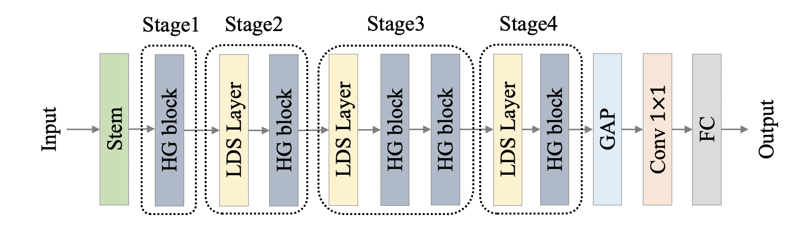

其中，PP-HGNet是由多个HG-Block组成，HG-Block的细节如下：

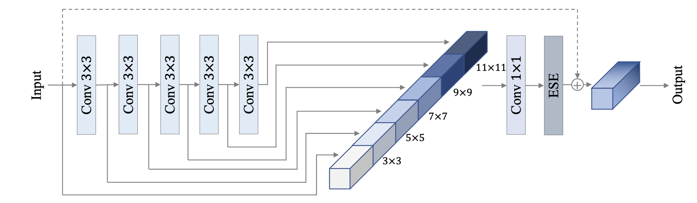


#### 实验结果
PP-HGNet 目前提供的模型的精度、速度指标及预训练权重链接如下：

| Model | Top-1 Acc(\%) | Top-5 Acc(\%) | Latency(ms) | 预训练模型下载地址 | inference模型下载地址 |
|:--: |:--: |:--: |:--: | :--: |:--: |
| PPHGNet_tiny      | 79.83 | 95.04 | 1.72 | [下载链接](https://paddle-imagenet-models-name.bj.bcebos.com/dygraph/legendary_models/PPHGNet_tiny_pretrained.pdparams) | [下载链接](https://paddle-imagenet-models-name.bj.bcebos.com/dygraph/inference/PPHGNet_tiny_infer.tar) |
| PPHGNet_tiny_ssld  | 81.95 | 96.12 | 1.77 | [下载链接](https://paddle-imagenet-models-name.bj.bcebos.com/dygraph/legendary_models/PPHGNet_tiny_ssld_pretrained.pdparams) | [下载链接](https://paddle-imagenet-models-name.bj.bcebos.com/dygraph/inference/PPHGNet_tiny_ssld_infer.tar) |
| PPHGNet_small     | 81.51| 95.82 | 2.46  | [下载链接](https://paddle-imagenet-models-name.bj.bcebos.com/dygraph/legendary_models/PPHGNet_small_pretrained.pdparams) | [下载链接](https://paddle-imagenet-models-name.bj.bcebos.com/dygraph/inference/PPHGNet_small_infer.tar) |
| PPHGNet_small_ssld | 83.82| 96.81 | 2.52  | [下载链接](https://paddle-imagenet-models-name.bj.bcebos.com/dygraph/legendary_models/PPHGNet_small_ssld_pretrained.pdparams) | [下载链接](https://paddle-imagenet-models-name.bj.bcebos.com/dygraph/inference/PPHGNet_small_ssld_infer.tar) |
| PPHGNet_base_ssld | 85.00| 97.35 | 5.97   | [下载链接](https://paddle-imagenet-models-name.bj.bcebos.com/dygraph/legendary_models/PPHGNet_base_ssld_pretrained.pdparams) | [下载链接](https://paddle-imagenet-models-name.bj.bcebos.com/dygraph/inference/PPHGNet_base_ssld_infer.tar) |

PP-HGNet 与其他模型的比较如下，其中测试机器为 NVIDIA® Tesla® V100，开启 TensorRT 引擎，精度类型为 FP32。在相同速度下，PP-HGNet 精度均超越了其他 SOTA CNN 模型，在与 SwinTransformer 模型的比较中，在更高精度的同时，速度快 2 倍以上。

| Model | Top-1 Acc(\%) | Top-5 Acc(\%) | Latency(ms) |
|:--: |:--: |:--: |:--: |
| ResNet34                 | 74.57      | 92.14       | 1.83        |
| ResNet34_vd              | 75.98      | 92.98       | 1.87        |
| EfficientNetB0           | 77.38      | 93.31       | 1.58        |
| <b>PPHGNet_tiny<b>       | <b>79.83<b> | <b>95.04<b> | <b>1.72<b> |
| <b>PPHGNet_tiny_ssld<b>  | <b>81.95<b> | <b>96.12<b> | <b>1.72<b> |
| ResNet50                 | 76.50      | 93.00       | 2.19        |
| ResNet50_vd              | 79.12      | 94.44       | 2.23        |
| ResNet50_rsb             | 80.40      |         |     2.54        |
| EfficientNetB1           | 79.15      | 94.41       | 2.29        |
| SwinTransformer_tiny     | 81.2      | 95.5       | 6.59        |
| <b>PPHGNet_small<b>      | <b>81.51<b>| <b>95.82<b> | <b>2.46<b>  |
| <b>PPHGNet_small_ssld<b> | <b>83.82<b>| <b>96.81<b> | <b>2.46<b>  |
| Res2Net200_vd_26w_4s_ssld| 85.13      | 97.42       | 10.80       |
| ResNeXt101_32x48d_wsl    | 85.37      | 97.69       | 69.81       |
| SwinTransformer_base     | 85.2       | 97.5        | 13.53       |  
| <b>PPHGNet_base_ssld<b> | <b>85.00<b>| <b>97.35<b> | <b>5.97<b>   |


#### PP-HGNet_base 网络流程

```
stem_channels =  [96, 96, 160]
input shape =  [128, 3, 224, 224]
layer_num=7  # 每个HG block 7层  
stage_config =  {
        # in_channels, mid_channels, out_channels, blocks, downsample
        "stage1": [160, 192, 320, 1, False],
        "stage2": [320, 224, 640, 2, True],
        "stage3": [640, 256, 960, 3, True],
        "stage4": [960, 288, 1280, 2, True],
    }
```

- stem 

```
  (stem): Sequential(
    (0): ConvBNAct(
      (conv): Conv2D(3, 96, kernel_size=[3, 3], stride=[2, 2], padding=1, data_format=NCHW)
      (bn): BatchNorm2D(num_features=96, momentum=0.9, epsilon=1e-05)
      (act): ReLU()
    )
    (1): ConvBNAct(
      (conv): Conv2D(96, 96, kernel_size=[3, 3], padding=1, data_format=NCHW)
      (bn): BatchNorm2D(num_features=96, momentum=0.9, epsilon=1e-05)
      (act): ReLU()
    )
    (2): ConvBNAct(
      (conv): Conv2D(96, 160, kernel_size=[3, 3], padding=1, data_format=NCHW)
      (bn): BatchNorm2D(num_features=160, momentum=0.9, epsilon=1e-05)
      (act): ReLU()
    )
  )
```
> 经过stem 输出 [128, 160, 112, 112]   缩放2倍

- 最大池化
```
(pool): MaxPool2D(kernel_size=3, stride=2, padding=1)
```
> 输出 [128, 160, 56, 56]   缩放4倍

- stage1 HG_Block

```
 (layers): LayerList(
            (0): ConvBNAct(
              (conv): Conv2D(160, 192, kernel_size=[3, 3], padding=1, data_format=NCHW)
              (bn): BatchNorm2D(num_features=192, momentum=0.9, epsilon=1e-05)
              (act): ReLU()
            )
            (1): ConvBNAct(
              (conv): Conv2D(192, 192, kernel_size=[3, 3], padding=1, data_format=NCHW)
              (bn): BatchNorm2D(num_features=192, momentum=0.9, epsilon=1e-05)
              (act): ReLU()
            )
            ... 一共layer_num 7层 加上input做paddle.concat操作 输出[128, 192*7+160, 56, 56]
            (aggregation_conv): ConvBNAct(
            (conv): Conv2D(1504, 320, kernel_size=[1, 1], data_format=NCHW)
            (bn): BatchNorm2D(num_features=320, momentum=0.9, epsilon=1e-05)
            (act): ReLU()
            )  # 输出 [128, 320, 56, 56]
            ESEModule(
              (avg_pool): AdaptiveAvgPool2D(output_size=1)
              (conv): Conv2D(320, 320, kernel_size=[1, 1], data_format=NCHW)
              (sigmoid): Sigmoid() 
            )  # input 经过上输步骤后输出 [128, 320, 1, 1]， 再和input相乘
            paddle.multiply(input, x) 最终输出 [128, 320, 56, 56]
        )
```

- stage2 HG_Block

```
    LDS 下采样
      (downsample): ConvBNAct(
        (conv): Conv2D(320, 320, kernel_size=[3, 3], stride=[2, 2], padding=1, groups=320, data_format=NCHW)
        (bn): BatchNorm2D(num_features=320, momentum=0.9, epsilon=1e-05)
      ) # 输出 [128, 320, 28, 28]
      
    HG_Block1 同stage1  输出 [128, 640, 28, 28]
    HG_Block2 输入和输出相加  最终输出 [128, 320, 28, 28]
```
> 缩放8倍

- stage3 HG_Block

```
    LDS 下采样
        (downsample): ConvBNAct(
        (conv): Conv2D(640, 640, kernel_size=[3, 3], stride=[2, 2], padding=1, groups=640, data_format=NCHW)
        (bn): BatchNorm2D(num_features=640, momentum=0.9, epsilon=1e-05)
        )  # 输出 [128, 640, 14, 14]
    HG_Block1 同stage1  输出 [128, 960, 14, 14]
    HG_Block2 输入和输出相加  最终输出 [128, 960, 14, 14]
    HG_Block3 输入和输出相加  最终输出 [128, 960, 14, 14]
```
> 缩放16倍

- stage4 HG_Block

```
    LDS 下采样
        (downsample): ConvBNAct(
        (conv): Conv2D(960, 960, kernel_size=[3, 3], stride=[2, 2], padding=1, groups=960, data_format=NCHW)
        (bn): BatchNorm2D(num_features=960, momentum=0.9, epsilon=1e-05)
        )  # 输出 [128, 960, 7, 7]
    HG_Block1 同stage1  输出 [128, 1280, 7, 7]
    HG_Block2 输入和输出相加  最终输出 [128, 1280, 7, 7]
```
> 缩放32倍

```
  (avg_pool): AdaptiveAvgPool2D(output_size=1) # [128, 1280, 1, 1]
  (last_conv): Conv2D(1280, 2048, kernel_size=[1, 1], data_format=NCHW)
  (act): ReLU()
  (dropout): Dropout(p=0.2, axis=None, mode=downscale_in_infer)
  (flatten): Flatten()   # [128, 2048]
  (fc): Linear(in_features=2048, out_features=2, dtype=float32) # [128, 2]
```


### PP-HGNeV2

PP-HGNetV2(High Performance GPU Network V2) 是百度飞桨视觉团队自研的 PP-HGNet 的下一代版本，其在 PP-HGNet 的基础上，做了进一步优化和改进，最终在 NVIDIA GPU 设备上，将 "Accuracy-Latency Balance" 做到了极致，精度大幅超过了其他同样推理速度的模型。其在单标签分类、多标签分类、目标检测、语义分割等任务中，均有较强的表现，与常见的服务器端模型在精度-预测耗时的比较如下图所示。


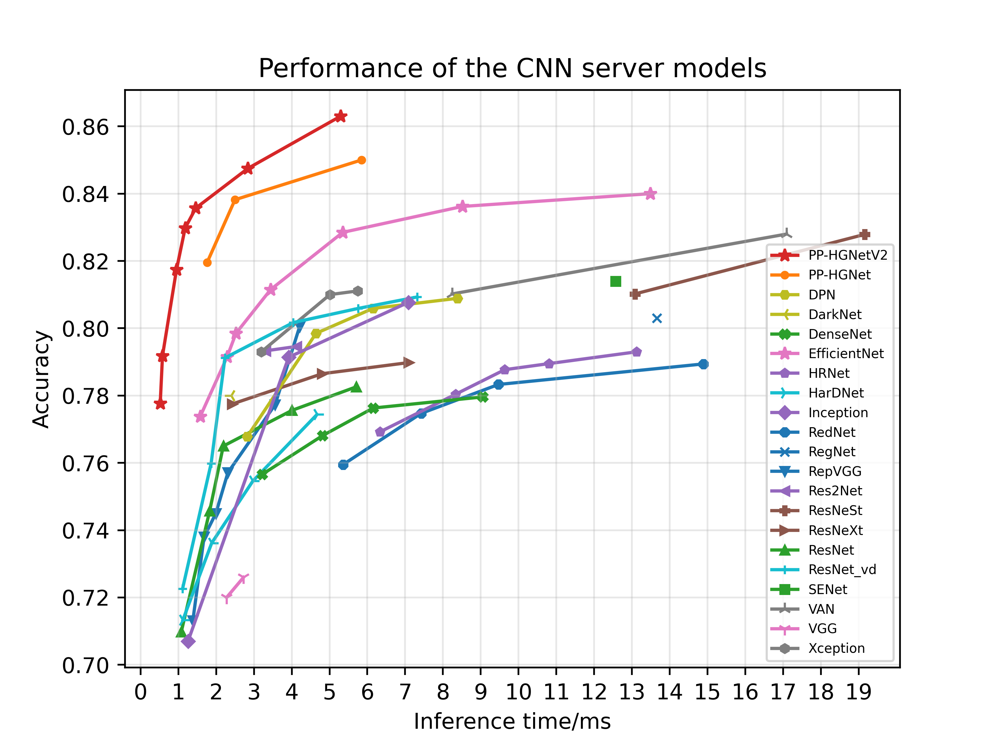

#### 模型细节
PP-HGNetV2 在 PP-HGNet 上的具体改进点如下：

- 改进了 PPHGNet 网络 stem 部分，堆叠更多的 2x2 卷积核以学习更丰富的局部特征，使用更小的通道数以提升大分辨率任务如目标检测、语义分割等的推理速度；
- 替换了 PP-HGNet 中靠后 stage 的较冗余的标准卷积层为 PW + DW5x5 组合，在获得更大感受野的同时网络的参数量更少，且精度可以进一步提升；
- 增加了 LearnableAffineBlock 模块，其可以在增加极少参数量的同时大幅提升较小模型的精度，且对推理时间无损；
- 重构了 PP-HGNet 网络的 stage 分布，使其涵盖了从 B0-B6 不同量级的模型，从而满足不同任务的需求。

除以上改进点之外，相比 PaddleClas 提供的其他模型，PP-HGNetV2 默认提供了精度更高、泛化能力更强的 SSLD 预训练权重，其在下游任务中表现更佳。

https://github.com/PaddlePaddle/PaddleClas/blob/release/2.5.2/docs/zh_CN/models/ImageNet1k/PP-HGNetV2.md


以PP-HGNetV2_B4 为例

```
stage_config = {
        # in_channels, mid_channels, out_channels, num_blocks, is_downsample, light_block, kernel_size, layer_num
        "stage1": [48, 48, 128, 1, False, False, 3, 6],
        "stage2": [128, 96, 512, 1, True, False, 3, 6],
        "stage3": [512, 192, 1024, 3, True, True, 5, 6],
        "stage4": [1024, 384, 2048, 1, True, True, 5, 6],
    }
stem_channels=[3, 32, 48]
use_lab=False  # 是否使用LAB操作。默认为False  B0-B3 默认为True 增加小模型的精度
```


### Swin Transformer

<p>Swin-Transformer是2021年微软研究院发表在ICCV上的一篇文章，并且已经获得<code>ICCV 2021 best paper</code>的荣誉称号。虽然<code>Vision Transformer (ViT)</code>在图像分类方面的结果令人鼓舞，但是由于其<code>低分辨率特性映射和复杂度随图像大小的二次增长</code>，其结构不适合作为<code>密集视觉任务</code>或<code>高分辨率输入图像</code>的通过骨干网路。为了<code>最佳的精度和速度的权衡</code>，提出了Swin-Transformer结构。</p>


如下图所示为：Swin-Transformer与ViT的对比结构。

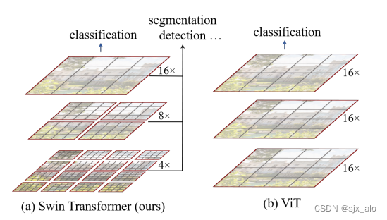


 从上图中可以看出两种网络结构的部分区别：

- Swin-Transformer开始采用4倍下采样的方式，后续采用8倍下采样，最终采用16倍下采样
- ViT则一开始就使用16倍下采样
- Swin-Transformer中，通过4倍、8倍、16倍下采样的结果分别作为目标检测所用数据，可以使网络以不同感受野训练目标检测任务，实现对大目标、小目标的检测
- ViT则只使用16倍下采样，只有单一分辨率特征


接下来，简单看下原论文中给出的关于Swin Transformer（Swin-T）网络的架构图。其中，图(a)表示Swin Transformer的网络结构流程，图(b)表示两阶段的Swin Transformer Block结构。注意：在Swin Transformer中，每个阶段的Swin Transformer Block结构都是2的倍数，因为里面使用的都是两阶段的Swin Transformer Block结构。

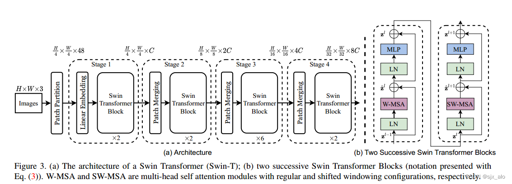


#### Swin-Transformer结构详解

首先，介绍Swin-Transformer的基础流程。
- 输入一张图片 [ H ∗ W ∗ 3 ]
- 图片经过Patch Partition层进行图片分割
- 分割后的数据经过Linear Embedding层进行特征映射
- 将特征映射后的数据输入具有改进的自关注计算的Transformer块(Swin Transformer块)，并与Linear Embedding一起被称为第1阶段
- 与阶段1不同，阶段2-4在输入模型前需要进行Patch Merging进行下采样，产生分层表示。
- 最终将经过阶段4的数据经过输出模块（包括一个LayerNorm层、一个AdaptiveAvgPool1d层和一个全连接层）进行分类。


