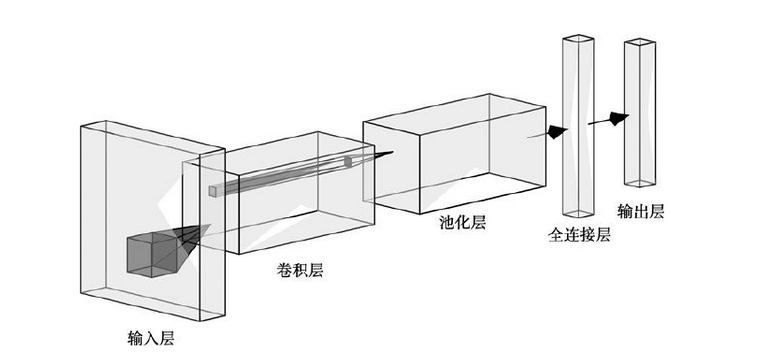
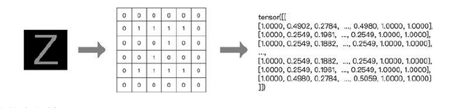
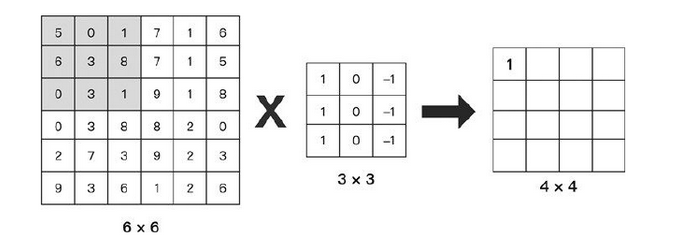
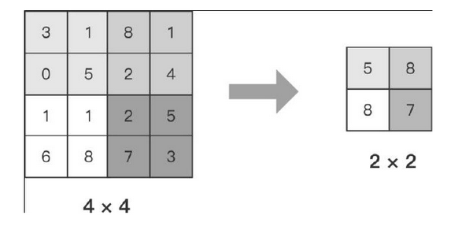
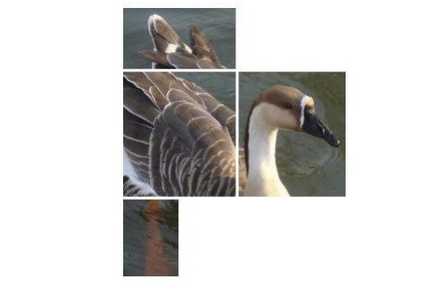
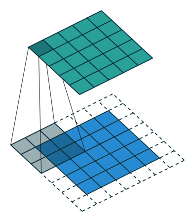
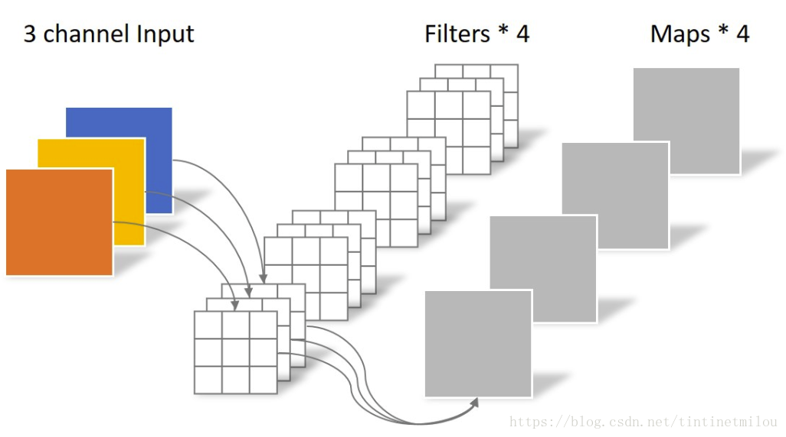
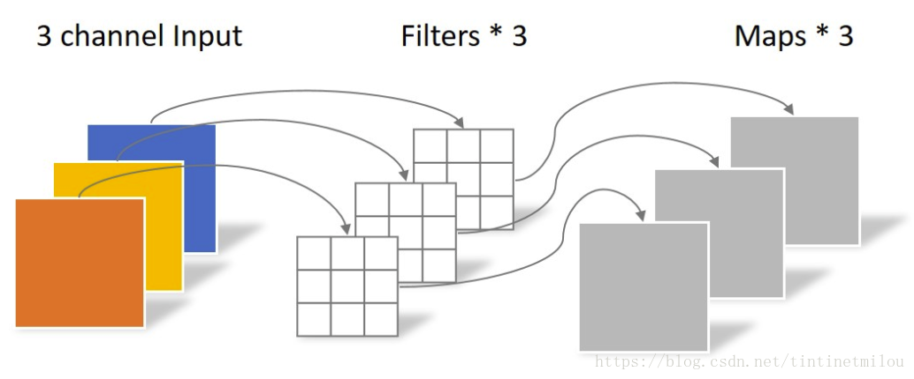

卷积神经网络（Convolutional Neural Network，CNN）是包含卷积计算且具有深度结构的前馈神经网络。它是深度学习技术领域中非常具有代表性的神经网络之一。相对于其他神经网络结构来说，卷积神经网络需要的参数更少，运算效率也更高。

卷积神经网络中常见的概念有输入层、图片数字化处理、卷积层、卷积运算、池化层、全连接层和输出层等。一个简单的卷积神经网络结构如图 

以图像分类任务为例，在如下所示卷积神经网络中，一般包含5种类型的网络层次结构

| CNN层次结构 |             输出尺寸              | 作用                                                         |
| :---------: | :-------------------------------: | :----------------------------------------------------------- |
|   输入层    |      $W_1\times H_1\times 3$      | 卷积网络的原始输入，可以是原始或预处理后的像素矩阵           |
|   卷积层    |      $W_1\times H_1\times K$      | 参数共享、局部连接，利用平移不变性从全局特征图提取局部特征   |
|   激活层    |      $W_1\times H_1\times K$      | 将卷积层的输出结果进行非线性映射                             |
|   池化层    |      $W_2\times H_2\times K$      | 进一步筛选特征，可以有效减少后续网络层次所需的参数量         |
|  全连接层   | $(W_2 \cdot H_2 \cdot K)\times C$ | 将多维特征展平为2维特征，通常低维度特征对应任务的学习目标（类别或回归值） |

> $W_1\times H_1\times 3$对应原始图像或经过预处理的像素值矩阵，3对应RGB图像的通道;$K$表示卷积层中卷积核（滤波器）的个数;$W_2\times H_2$ 为池化后特征图的尺度，在全局池化中尺度对应$1\times 1$;$(W_2 \cdot H_2 \cdot K)$是将多维特征压缩到1维之后的大小，$C$对应的则是图像类别个数。

####  输入层

输入层(Input Layer)通常是输入卷积神经网络的原始数据或经过预处理的数据，可以是图像识别领域中原始三维的多彩图像，也可以是音频识别领域中经过傅利叶变换的二维波形数据，甚至是自然语言处理中一维表示的句子向量。以图像分类任务为例，输入层输入的图像一般包含RGB三个通道，是一个由长宽分别为$H$和$W$组成的3维像素值矩阵$H\times W \times 3$，卷积网络会将输入层的数据传递到一系列卷积、池化等操作进行特征提取和转化，最终由全连接层对特征进行汇总和结果输出。根据计算能力、存储大小和模型结构的不同，卷积神经网络每次可以批量处理的图像个数不尽相同，若指定输入层接收到的图像个数为$N$，则输入层的输出数据为$N\times H\times W\times 3$。

输入层用于输入整个神经网络的数据。举个例子，在用于处理图片验证码的卷积神经网络中，输入的数据是一张验证码图片。计算机擅长处理数字，在将图片传入卷积神经网络前，我们需要将图片进行如图 所示的数字化处理

图片数字化处理是先将图片转换为像素矩阵，然后将像素矩阵转换为张量的过程。图片的像素值通常在0~255，图片数字化实际上是将 [0, 255] 的PIL.Image对象转换成取值范围是 [0, 1.0000] 的 Tensor 对象

#### 卷积层

卷积层(Convolution Layer)通常用作对输入层输入数据进行特征提取，通过卷积核矩阵对原始数据中隐含关联性的一种抽象。卷积操作原理上其实是对两张像素矩阵进行点乘求和的数学操作，其中一个矩阵为输入的数据矩阵，另一个矩阵则为卷积核（滤波器或特征矩阵），求得的结果表示为原始图像中提取的特定局部特征。

卷积运算是卷积神经网络最基本的组成部分之一。假设有一张大小为 6×6 的灰度图片，我们使用大小为3×3 的卷积核提取图片中的特征，具体过程如下图

进行卷积运算时，通常用卷积核中的值与传入数据对应位置的值相乘，然后将乘积相加，得到输出结果，具体过程如下图所示

输出矩阵左上角的值是由输入矩阵的值与卷积核的值相乘并将乘积相加得到的结果，输出矩阵左上角的值运算如下
5×1 + 6×1 + 0×1 + 0×0 + 3×0 + 3×0 + 1×(-1) + 8×(-1) + 1×(-1) = 1
输出矩阵其他位置的值也是按照这个方法进行运算的，最终会得到一个大小为 4×4 的矩阵

#### 激活层

激活层(Activation Layer)负责对卷积层抽取的特征进行激活，由于卷积操作是由输入矩阵与卷积核矩阵进行相差的线性变化关系，需要激活层对其进行非线性的映射。激活层主要由激活函数组成，即在卷积层输出结果的基础上嵌套一个非线性函数，让输出的特征图具有非线性关系。卷积网络中通常采用ReLU来充当激活函数（还包括tanh和sigmoid等）ReLU的函数形式如公式（5-1）所示，能够限制小于0的值为0,同时大于等于0的值保持不变。 $$ f(x)=\begin{cases} 0 &\text{if } x<0 \ x &\text{if } x\ge 0 \end{cases} \tag{5-1} $$

#### 池化层

池化层又称为降采样层(Downsampling Layer)，作用是对感受域内的特征进行筛选，提取区域内最具代表性的特征，能够有效地降低输出特征尺度，进而减少模型所需要的参数量。按操作类型通常分为最大池化(Max Pooling)、平均池化(Average Pooling)和求和池化(Sum Pooling)，它们分别提取感受域内最大、平均与总和的特征值作为输出，最常用的是最大池化。

最大池化实际上是将卷积层传递的矩阵拆分成 个单位区域，然后保留该区域像素值中的最大值。假设卷积层传递 4×4 大小的矩阵到池化层，该特征数据左上区域的最大值为 5，右上区域的最大值为 8，左下区域的最大值为 8，右下区域的最大值为 7。在池化层中使用大小为 2×2、步长为 2 的过滤器提取特征数据，最后输出大小为 2×2 的矩阵。平均池化则是将 大小的像素值的平均值作为特征。可以看到，在保留明显特征（最大数字）的情况下，池化层将卷积层传入的矩阵宽高缩小了一半

#### 全连接层

全连接层(Full Connected Layer)负责对卷积神经网络学习提取到的特征进行汇总，将多维的特征输入映射为二维的特征输出，高维表示样本批次，低位常常对应任务目标

全连接层通常出现在卷积神经网络的最后几层。它将当前向量进行维度变换，对卷积层和池化层提取到的特征进行加权计算，最后经过降维转到 Label 的维度。它的本质是由一个特征空间线性变换到另一个特征空间。
我们可以将卷积层理解为获取局部特征，而全连接则是将卷积层获取的局部特征组装成如图所示的完整特征图的过程

#### 输出层

输出层通常使用归一化函数softmax 输出分类标签

#### 卷积在图像中有什么直观作用

在卷积神经网络中，卷积常用来提取图像的特征，但不同层次的卷积操作提取到的特征类型是不相同的，特征类型粗分如表5.2所示。 ​ 表5.2 卷积提取的特征类型

| 卷积层次 | 特征类型 |
| :------: | :------: |
| 浅层卷积 | 边缘特征 |
| 中层卷积 | 局部特征 |
| 深层卷积 | 全局特征 |

图像与不同卷积核的卷积可以用来执行边缘检测、锐化和模糊等操作

|         卷积作用         |                            卷积核                            |                    卷积后图像                     |
| :----------------------: | :----------------------------------------------------------: | :-----------------------------------------------: |
|         输出原图         | $\begin{bmatrix} 0 & 0 & 0 \\ 0 & 1 & 0 \\ 0 & 0 & 0 \end{bmatrix}$ |                   |
| 边缘检测（突出边缘差异） | $\begin{bmatrix} 1 & 0 & -1 \\ 0 & 0 & 0 \\ -1 & 0 & 1 \end{bmatrix}$ |      |
|  边缘检测（突出中间值）  | $\begin{bmatrix} -1 & -1 & -1 \\ -1 & 8 & -1 \\ -1 & -1 & -1 \end{bmatrix}$ |    |
|         图像锐化         | $\begin{bmatrix} 0 & -1 & 0 \\ -1 & 5 & -1 \\ 0 & -1 & 0 \end{bmatrix}$ |          |
|         方块模糊         | $\begin{bmatrix} 1 & 1 & 1 \\ 1 & 1 & 1 \\ 1 & 1 & 1 \end{bmatrix} \times \frac{1}{9}$ |             |
|         高斯模糊         | $\begin{bmatrix} 1 & 2 & 1 \\ 2 & 4 & 2 \\ 1 & 2 & 1 \end{bmatrix} \times \frac{1}{16}$ |  |

#### 卷积层有哪些基本参数

卷积层中需要用到卷积核（滤波器或特征检测器）与图像特征矩阵进行点乘运算，利用卷积核与对应的特征感受域进行划窗式运算时，需要设定卷积核对应的大小、步长、个数以及填充的方式

|          参数名           | 作用                                                         | 常见设置                                                     |
| :-----------------------: | :----------------------------------------------------------- | :----------------------------------------------------------- |
| 卷积核大小 (Kernel Size)  | 卷积核的大小定义了卷积的感受野                               | 在过去常设为5，如LeNet-5；现在多设为3，通过堆叠$3\times3$的卷积核来达到更大的感受域 |
|    卷积核步长 (Stride)    | 定义了卷积核在卷积过程中的步长                               | 常见设置为1，表示滑窗距离为1，可以覆盖所有相邻位置特征的组合；当设置为更大值时相当于对特征组合降采样 |
|    填充方式 (Padding)     | 在卷积核尺寸不能完美匹配输入的图像矩阵时需要进行一定的填充策略 | 设置为'SAME'表示对不足卷积核大小的边界位置进行某种填充（通常零填充）以保证卷积输出维度与与输入维度一致；当设置为'VALID'时则对不足卷积尺寸的部分进行舍弃，输出维度就无法保证与输入维度一致 |
| 输入通道数 (In Channels)  | 指定卷积操作时卷积核的深度                                   | 默认与输入的特征矩阵通道数（深度）一致；在某些压缩模型中会采用通道分离的卷积方式 |
| 输出通道数 (Out Channels) | 指定卷积核的个数                                             | 若设置为与输入通道数一样的大小，可以保持输入输出维度的一致性；若采用比输入通道数更小的值，则可以减少整体网络的参数量 |

> 卷积操作维度变换公式：
>
> $O_d =\begin{cases} \lceil \frac{(I_d - k_{size})+ 1)}{s}\rceil ,& \text{padding=VALID}\\ \lceil \frac{I_d}{s}\rceil,&\text{padding=SAME} \end{cases}$
>
> 其中，$I_d$为输入维度，$O_d$为输出维度，$k_{size}$为卷积核大小，$s$为步长

#### 卷积核有什么类型？

常见的卷积主要是由连续紧密的卷积核对输入的图像特征进行滑窗式点乘求和操作，除此之外还有其他类型的卷积核在不同的任务中会用到

|            卷积类别            |            示意图             | 作用                                                         |
| :----------------------------: | :---------------------------: | :----------------------------------------------------------- |
|            标准卷积            |   | 最常用的卷积核，连续紧密的矩阵形式可以提取图像区域中的相邻像素之间的关联关系，$3\times3$的卷积核可以获得$3\times3$像素范围的感受视野 |
| 扩张卷积（带孔卷积或空洞卷积） |   | 引入一个称作扩张率（Dilation Rate）的参数，使同样尺寸的卷积核可以获得更大的感受视野，相应的在相同感受视野的前提下比普通卷积采用更少的参数。同样是$3\times3$的卷积核尺寸，扩张卷积可以提取$5\times5$范围的区域特征，在实时图像分割领域广泛应用 |
|            转置卷积            |  | 先对原始特征矩阵进行填充使其维度扩大到适配卷积目标输出维度，然后进行普通的卷积操作的一个过程，其输入到输出的维度变换关系恰好与普通卷积的变换关系相反，但这个变换并不是真正的逆变换操作，通常称为转置卷积(Transpose Convolution)而不是反卷积(Deconvolution)。转置卷积常见于目标检测领域中对小目标的检测和图像分割领域还原输入图像尺度。 |
|           可分离卷积           |  | 标准的卷积操作是同时对原始图像$H\times W\times C$三个方向的卷积运算，假设有$K$个相同尺寸的卷积核，这样的卷积操作需要用到的参数为$H\times W\times C\times K$个；若将长宽与深度方向的卷积操作分离出变为$H\times W$与$C$的两步卷积操作，则同样的卷积核个数$K$，只需要$(H\times W + C)\times K$个参数，便可得到同样的输出尺度。可分离卷积(Seperable Convolution)通常应用在模型压缩或一些轻量的卷积神经网络中，如MobileNet$^{[1]}$、Xception$^{[2]}$等 |

#### 有哪些池化方法？

池化操作通常也叫做子采样(Subsampling)或降采样(Downsampling)，在构建卷积神经网络时，往往会用在卷积层之后，通过池化来降低卷积层输出的特征维度，有效减少网络参数的同时还可以防止过拟合现象。池化操作可以降低图像维度的原因，本质上是因为图像具有一种“静态性”的属性，这个意思是说在一个图像区域有用的特征极有可能在另一个区域同样有用。因此，为了描述一个大的图像，很直观的想法就是对不同位置的特征进行聚合统计。例如，可以计算图像在固定区域上特征的平均值 (或最大值)来代表这个区域的特征

|                  池化类型                   |                      示意图                       | 作用                                                         |
| :-----------------------------------------: | :-----------------------------------------------: | :----------------------------------------------------------- |
|          一般池化(General Pooling)          |      | 通常包括最大池化(Max Pooling)和平均池化(Mean Pooling)。以最大池化为例，池化范围$(2\times2)$和滑窗步长$(stride=2)$ 相同，仅提取一次相同区域的范化特征。 |
|        重叠池化(Overlapping Pooling)        |  | 与一般池化操作相同，但是池化范围$P_{size}$与滑窗步长$stride$关系为$P_{size}>stride$，同一区域内的像素特征可以参与多次滑窗提取，得到的特征表达能力更强，但计算量更大。 |
| 空间金字塔池化$^*$(Spatial Pyramid Pooling) |  | 在进行多尺度目标的训练时，卷积层允许输入的图像特征尺度是可变的，紧接的池化层若采用一般的池化方法会使得不同的输入特征输出相应变化尺度的特征，而卷积神经网络中最后的全连接层则无法对可变尺度进行运算，因此需要对不同尺度的输出特征采样到相同输出尺度。 |

> SPPNet$^{[3]}$就引入了空间池化的组合，对不同输出尺度采用不同的滑窗大小和步长以确保输出尺度相同$(win_{size}=\lceil \frac{in}{out}\rceil; stride=\lfloor \frac{in}{out}\rfloor; )$，同时用如金字塔式叠加的多种池化尺度组合，以提取更加丰富的图像特征。常用于多尺度训练和目标检测中的区域提议网络(Region Proposal Network)的兴趣区域(Region of Interest)提取

#### 深度可分离卷积

Depthwise(DW)卷积与Pointwise(PW)卷积，合起来被称作Depthwise Separable Convolution(参见Google的Xception)，该结构和常规卷积操作类似，可用来提取特征，但相比于常规卷积操作，其参数量和运算成本较低。所以在一些轻量级网络中会碰到这种结构如MobileNet。

常规卷积操作

对于一张5×5像素、三通道彩色输入图片（shape为5×5×3）。经过3×3卷积核的卷积层（假设输出通道数为4，则卷积核shape为3×3×3×4），最终输出4个Feature Map，如果有same padding则尺寸与输入层相同（5×5），如果没有则为尺寸变为3×3。

 Depthwise Separable Convolution是将一个完整的卷积运算分解为两步进行，即Depthwise Convolution与Pointwise Convolution。

**Depthwise Convolution**

不同于常规卷积操作，Depthwise Convolution的一个卷积核负责一个通道，一个通道只被一个卷积核卷积。上面所提到的常规卷积每个卷积核是同时操作输入图片的每个通道。

同样是对于一张5×5像素、三通道彩色输入图片（shape为5×5×3），Depthwise Convolution首先经过第一次卷积运算，不同于上面的常规卷积，DW完全是在二维平面内进行。卷积核的数量与上一层的通道数相同（通道和卷积核一一对应）。所以一个三通道的图像经过运算后生成了3个Feature map(如果有same padding则尺寸与输入层相同为5×5)，如下图所示。

**Pointwise Convolution**
Pointwise Convolution的运算与常规卷积运算非常相似，它的卷积核的尺寸为 1×1×M，M为上一层的通道数。所以这里的卷积运算会将上一步的map在深度方向上进行加权组合，生成新的Feature map。有几个卷积核就有几个输出Feature map。如下图所示。

