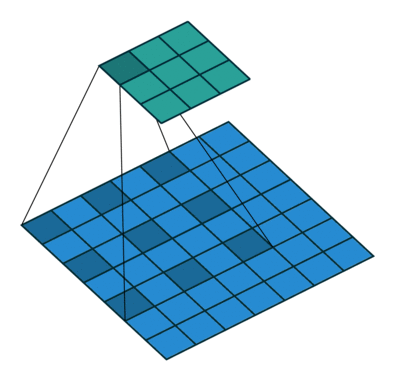
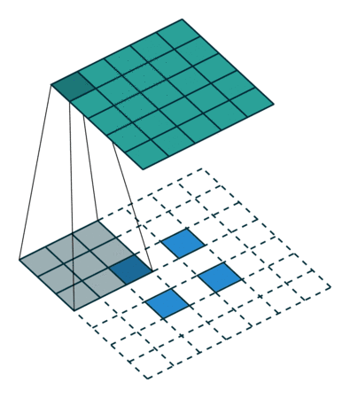
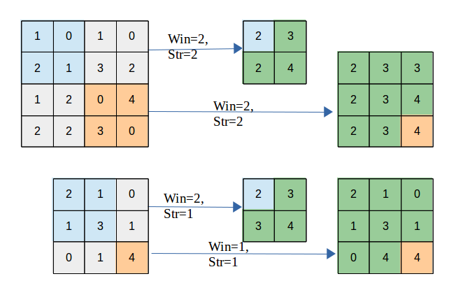

卷积神经网络(Convolutional neural network, CNN)是受生物学上感受野机制的启发而提出的，是目前计算机视觉中使用最普遍的模型结构

CNN是包含卷积计算且具有深度结构的前馈神经网络。它是深度学习技术领域中非常具有代表性的神经网络之一。相对于其他神经网络结构来说，卷积神经网络需要的参数更少，运算效率也更高。

卷积神经网络中常见的概念有输入层、图片数字化处理、卷积层、卷积运算、池化层、全连接层和输出层等。一个简单的卷积神经网络结构如图 


以图像分类任务为例，在如下所示卷积神经网络中，一般包含5种类型的网络层次结构


| CNN层次结构 |             输出尺寸              | 作用                                                         |
| :---------: | :-------------------------------: | :----------------------------------------------------------- |
|   输入层    |      $W_1\times H_1\times 3$      | 卷积网络的原始输入，可以是原始或预处理后的像素矩阵           |
|   卷积层    |      $W_1\times H_1\times K$      | 参数共享、局部连接，利用平移不变性从全局特征图提取局部特征   |
|   激活层    |      $W_1\times H_1\times K$      | 将卷积层的输出结果进行非线性映射                             |
|   池化层    |      $W_2\times H_2\times K$      | 进一步筛选特征，可以有效减少后续网络层次所需的参数量         |
|  全连接层   | $(W_2 \cdot H_2 \cdot K)\times C$ | 将多维特征展平为2维特征，通常低维度特征对应任务的学习目标（类别或回归值） |


> $W_1\times H_1\times 3$ 对应原始图像或经过预处理的像素值矩阵，3对应RGB图像的通道; $K$ 表示卷积层中卷积核（滤波器）的个数; $W_2\times H_2$ 为池化后特征图的尺度，在全局池化中尺度对应 $1\times 1$ ; $(W_2 \cdot H_2 \cdot K)$ 是将多维特征压缩到1维之后的大小，$C$ 对应的则是图像类别个数。


####  输入层

输入层(Input Layer)通常是输入卷积神经网络的原始数据或经过预处理的数据，可以是图像识别领域中原始三维的多彩图像，也可以是音频识别领域中经过傅利叶变换的二维波形数据，甚至是自然语言处理中一维表示的句子向量。以图像分类任务为例，输入层输入的图像一般包含RGB三个通道，是一个由长宽分别为 $H$ 和 $W$ 组成的3维像素值矩阵 $H\times W \times 3$ ，卷积网络会将输入层的数据传递到一系列卷积、池化等操作进行特征提取和转化，最终由全连接层对特征进行汇总和结果输出。根据计算能力、存储大小和模型结构的不同，卷积神经网络每次可以批量处理的图像个数不尽相同，若指定输入层接收到的图像个数为$N$，则输入层的输出数据为 $N\times H\times W\times 3$。

输入层用于输入整个神经网络的数据。举个例子，在用于处理图片验证码的卷积神经网络中，输入的数据是一张验证码图片。计算机擅长处理数字，在将图片传入卷积神经网络前，我们需要将图片进行如图 所示的数字化处理


图片数字化处理是先将图片转换为像素矩阵，然后将像素矩阵转换为张量的过程。图片的像素值通常在0~255，图片数字化实际上是将 [0, 255] 的PIL.Image对象转换成取值范围是 [0, 1.0000] 的 Tensor 对象


#### 卷积层

卷积层(Convolution Layer)通常用作对输入层输入数据进行特征提取，通过卷积核矩阵对原始数据中隐含关联性的一种抽象。卷积操作原理上其实是对两张像素矩阵进行点乘求和的数学操作，其中一个矩阵为输入的数据矩阵，另一个矩阵则为卷积核（滤波器或特征矩阵），求得的结果表示为原始图像中提取的特定局部特征。


卷积运算是卷积神经网络最基本的组成部分之一。假设有一张大小为 6×6 的灰度图片，我们使用大小为3×3 的卷积核提取图片中的特征，具体过程如下图


进行卷积运算时，通常用卷积核中的值与传入数据对应位置的值相乘，然后将乘积相加，得到输出结果，具体过程如下图所示


输出矩阵左上角的值是由输入矩阵的值与卷积核的值相乘并将乘积相加得到的结果，输出矩阵左上角的值运算如下
5×1 + 6×1 + 0×1 + 0×0 + 3×0 + 3×0 + 1×(-1) + 8×(-1) + 1×(-1) = 1
输出矩阵其他位置的值也是按照这个方法进行运算的，最终会得到一个大小为 4×4 的矩阵


> 卷积核（kernel）也被叫做滤波器（filter），假设卷积核的高和宽分别为 $k_h$ ​和 $k_w$ ​，则将称为 $k_h$ ​和 $k_w$ ​卷积，比如3×5卷积，就是指卷积核的高为3, 宽为5。


如图2（a）所示：左边的图大小是3×3，表示输入数据是一个维度为3×3的二维数组；中间的图大小是2×2，表示一个维度为2×2的二维数组，我们将这个二维数组称为卷积核。先将卷积核的左上角与输入数据的左上角（即：输入数据的(0, 0)位置）对齐，把卷积核的每个元素跟其位置对应的输入数据中的元素相乘，再把所有乘积相加，得到卷积输出的第一个结果

```math
0\times1 + 1\times2 + 2\times4 + 3\times5 = 25  \ \ \ \ \ \ \ (a)
```
卷积核的计算过程可以用下面的数学公式表示，其中 a 代表输入图片， b 代表输出特征图，w 是卷积核参数，它们都是二维数组，∑u,v  表示对卷积核参数进行遍历并求和。

```math
b[i, j] = \sum_{u,v}{a[i+u, j+v]\cdot w[u, v]}
```

举例说明，假如上图中卷积核大小是2×2，则u可以取0和1，v也可以取0和1，也就是说：

```math
b[i, j] = a[i+0, j+0]\cdot w[0, 0] + a[i+0, j+1]\cdot w[0, 1] + a[i+1, j+0]\cdot w[1, 0] + a[i+1, j+1]\cdot w[1, 1]

```

在卷积神经网络中，一个卷积算子除了上面描述的卷积过程之外，还包括加上偏置项(引入非线性运算、增强模型拟合能力)的操作。例如假设偏置为1，则上面卷积计算的结果为：

```math
0\times1 + 1\times2 + 2\times4 + 3\times5 \mathbf{\  + 1}  = 26 \\
0\times2 + 1\times3 + 2\times5 + 3\times6 \mathbf{\  + 1} = 32 \\
0\times4 + 1\times5 + 2\times7 + 3\times8 \mathbf{\  + 1} = 44 \\
0\times5 + 1\times6 + 2\times8 + 3\times9 \mathbf{\  + 1} = 50

```

**填充（padding）**

在上面的例子中，输入图片尺寸为3×3，输出图片尺寸为2×2，经过一次卷积之后，图片尺寸变小。卷积输出特征图的尺寸计算方法如下（卷积核的高和宽分别为 $k_h$ ​和 $k_w$ ​）

```math
H_{out} = H - k_h + 1
\\
W_{out} = W - k_w + 1

```

如果输入尺寸为4，卷积核大小为3时，输出尺寸为4−3+1=2。当卷积核尺寸大于1时，输出特征图的尺寸会小于输入图片尺寸。如果经过多次卷积，输出图片尺寸会不断减小，边界和角落像素丢失越来越多，导致模型训练效果不佳。且当卷积核的高度和宽度不同，通过填充(padding)使输入和输出具有相同的宽和高。填充如 图3 所示。


- 如图8（a）所示：填充的大小为1，填充值为0。填充之后，输入图片尺寸从4×4变成了6×6，使用3×3的卷积核，输出图片尺寸为4×4
- 如图8（b）所示：填充的大小为2，填充值为0。填充之后，输入图片尺寸从4×4变成了8×8，使用3×3的卷积核，输出图片尺寸为6×6

如果在图片高度方向，在第一行之前填充 $p_{h1}$ ​行，在最后一行之后填充 $p_{h2}$ ​行；在图片的宽度方向，在第1列之前填充 $p_{w1}$ ​列，在最后1列之后填充 $p_{w2}$ ​列；则填充之后的图片尺寸为 $(H + p_{h1} + p_{h2})\times(W + p_{w1} + p_{w2})$ 。经过大小为 $k_h\times k_w$ ​的卷积核操作之后，输出图片的尺寸为

```math
H_{out} = H + p_{h1} + p_{h2} - k_h + 1
```
```math
W_{out} = W + p_{w1} + p_{w2} - k_w + 1
```

在卷积计算过程中，通常会在高度或者宽度的两侧采取等量填充，即 $p_{h1} = p_{h2} = p_h$ , $p_{w1} = p_{w2} = p_w$ ，上面计算公式也就变为：

```math
H_{out} = H + 2p_h - k_h + 1
```
```math
W_{out} = W + 2p_w - k_w + 1
```
卷积核大小通常使用1，3，5，7这样的奇数，如果使用的填充大小为 $p_h=(k_h-1)/2 ，p_w=(k_w-1)/2$ ，则卷积之后图像尺寸不变。例如当卷积核大小为3时，padding大小为1，卷积之后图像尺寸不变；同理，如果卷积核大小为5，padding大小为2，也能保持图像尺寸不变

**步幅（stride）**

图4 中卷积核每次滑动一个像素点，这是步幅为1的特殊情况。图9 是步幅为2的卷积过程，卷积核在图片上移动时，每次移动大小为2个像素点


当宽和高方向的步幅分别为 $s_h$ ​和 $s_w$ 时，输出特征图尺寸的计算公式是:

```math
H_{out} = \frac{H + 2p_h - k_h}{s_h} + 1
```
```math
W_{out} = \frac{W + 2p_w - k_w}{s_w} + 1
```

假设输入图片尺寸是 $H\times W = 100 \times 100$ ，卷积核大小 $k_h \times k_w = 3 \times 3$ ，填充 $p_h = p_w = 1$ ，步幅为 $s_h = s_w = 2$ ，则输出特征图的尺寸为

```math
H_{out} = \frac{100 + 2 - 3}{2} + 1 = 50
```
```math
W_{out} = \frac{100 + 2 - 3}{2} + 1 = 50
```

**感受野（Receptive Field）**

输出特征图上每个点的数值，是由输入图片上大小为 $k_h\times k_w$ 的区域的元素与卷积核每个元素相乘再相加得到的，所以输入图像上 $k_h\times k_w$ ​区域内每个元素数值的改变，都会影响输出点的像素值。我们将这个区域叫做输出特征图上对应点的感受野。感受野内每个元素数值的变动，都会影响输出点的数值变化。比如3×3卷积对应的感受野大小就是3×3，如 图5 所示。


而当通过两层3×3的卷积之后，感受野的大小将会增加到5×5，如 图6 所示。


因此，当增加卷积网络深度的同时，感受野将会增大，输出特征图中的一个像素点将会包含更多的图像语义信息。

多输入通道、多输出通道和批量操作

前面介绍的卷积计算过程比较简单，实际应用时，处理的问题要复杂的多。例如：对于彩色图片有RGB三个通道，需要处理多输入通道的场景。输出特征图往往也会具有多个通道，而且在神经网络的计算中常常是把一个批次的样本放在一起计算，所以卷积算子需要具有批量处理多输入和多输出通道数据的功能，下面将分别介绍这几种场景的操作方式。

**多输入通道场景**

上面的例子中，卷积层的数据是一个2维数组，但实际上一张图片往往含有RGB三个通道，要计算卷积的输出结果，卷积核的形式也会发生变化。假设输入图片的通道数为 $C_{in}$​，输入数据的形状是  $C_{in}\times{H_{in}}\times{W_{in}}$​，计算过程如 图7 所示

1、对每个通道分别设计一个2维数组作为卷积核，卷积核数组的形状是 $C_{in}\times{k_h}\times{k_w}$ ​。
2、对任一通道 $C_{in} \in [0, C_{in})$ ，分别用大小为 $k_h\times{k_w}$ ​的卷积核在大小为 $H_{in}\times{W_{in}}$ 的二维数组上做卷积。
3、将这 $C_{in}$ ​个通道的计算结果相加，得到的是一个形状为 $H_{out}\times{W_{out}}$ ​的二维数组。 


**多输出通道场景**

一般来说，卷积操作的输出特征图也会具有多个通道 $C_{out}$ ​，这时我们需要设计 $C_{out}$ ​个维度为 $C_{in}\times{k_h}\times{k_w}$ ​的卷积核，卷积核数组的维度是 $C_{out}\times C_{in}\times{k_h}\times{k_w}$ ​，如 图8 所示

1、对任一输出通道 $c_{out} \in [0, C_{out})$ ，分别使用上面描述的形状为 $C_{in}\times{k_h}\times{k_w}$ 的卷积核对输入图片做卷积
2、将这 $C_{out}$ ​个形状为 $H_{out}\times{W_{out}}$ ​的二维数组拼接在一起，形成维度为 $C_{out}\times{H_{out}}\times{W_{out}}$ ​的三维数组。

> 通常将卷积核的输出通道数叫做卷积核的个数。


**批量操作**

在卷积神经网络的计算中，通常将多个样本放在一起形成一个mini-batch进行批量操作，即输入数据的维度是 $N\times{C_{in}}\times{H_{in}}\times{W_{in}}$ ​。由于会对每张图片使用同样的卷积核进行卷积操作，卷积核的维度与上面多输出通道的情况一样，仍然是 $C_{out}\times C_{in}\times{k_h}\times{k_w}$ ，输出特征图的维度是 $N\times{C_{out}}\times{H_{out}}\times{W_{out}}$ ​，如 图9 所示


#### 卷积算子应用举例

**案例1——简单的黑白边界检测**

下面是使用Conv2D算子完成一个图像边界检测的任务。图像左边为光亮部分，右边为黑暗部分，需要检测出光亮跟黑暗的分界处。

设置宽度方向的卷积核为[1,0,−1]，此卷积核会将宽度方向间隔为1的两个像素点的数值相减。当卷积核在图片上滑动时，如果它所覆盖的像素点位于亮度相同的区域，则左右间隔为1的两个像素点数值的差为0。只有当卷积核覆盖的像素点有的处于光亮区域，有的处在黑暗区域时，左右间隔为1的两个点像素值的差才不为0。将此卷积核作用到图片上，输出特征图上只有对应黑白分界线的地方像素值才不为0。具体代码如下所示，结果输出在下方的图案中。

```python
import matplotlib.pyplot as plt
import numpy as np
import paddle
from paddle.nn import Conv2D
from paddle.nn.initializer import Assign

# 创建初始化权重参数w
w = np.array([1, 0, -1], dtype='float32')
# 将权重参数调整成维度为[cout, cin, kh, kw]的四维张量
w = w.reshape([1, 1, 1, 3])
# 创建卷积算子，设置输出通道数，卷积核大小，和初始化权重参数
# kernel_size = [1, 3]表示kh = 1, kw=3
# 创建卷积算子的时候，通过参数属性weight_attr指定参数初始化方式
# 这里的初始化方式时，从numpy.ndarray初始化卷积参数
conv = Conv2D(in_channels=1, out_channels=1, kernel_size=[1, 3],
       weight_attr=paddle.ParamAttr(
          initializer=Assign(value=w)))


# 创建输入图片，图片左边的像素点取值为1，右边的像素点取值为0
img = np.ones([50,50], dtype='float32')
img[:, 30:] = 0.

# 将图片形状调整为[N, C, H, W]的形式
x = img.reshape([1,1,50,50])

# 将numpy.ndarray转化成paddle中的tensor
x = paddle.to_tensor(x)

# 使用卷积算子作用在输入图片上
y = conv(x)

# 将输出tensor转化为numpy.ndarray
out = y.numpy()

print(out)


f = plt.subplot(121)
f.set_title('input image', fontsize=15)
plt.imshow(img, cmap='gray')
f = plt.subplot(122)
f.set_title('output featuremap', fontsize=15)
# 卷积算子Conv2D输出数据形状为[N, C, H, W]形式
# 此处N, C=1，输出数据形状为[1, 1, H, W]，是4维数组
# 但是画图函数plt.imshow画灰度图时，只接受2维数组
# 通过numpy.squeeze函数将大小为1的维度消除
plt.imshow(out.squeeze(), cmap='gray')
plt.show()
```


```
# 查看卷积层的权重参数名字和数值
print(conv.weight)
# 参看卷积层的偏置参数名字和数值
print(conv.bias)
```

**案例2——图像中物体边缘检测**

上面展示的是一个人为构造出来的简单图片，使用卷积网络检测图片明暗分界处的示例。对于真实的图片，也可以使用合适的卷积核(3*3卷积核的中间值是8，周围一圈的值是8个-1)对其进行操作，用来检测物体的外形轮廓，观察输出特征图跟原图之间的对应关系，如下代码所示：

```python
import matplotlib.pyplot as plt
import numpy as np
import paddle
from paddle.nn import Conv2D
from paddle.nn.initializer import Assign
from PIL import Image

img = Image.open('./tests/imgs/20250206104719.png')

# 设置卷积核参数
w = np.array([[-1,-1,-1], [-1,8,-1], [-1,-1,-1]], dtype='float32')
w = w.reshape([1, 1, 3, 3])
# 由于输入通道数是3，将卷积核的形状从[1,1,3,3]调整为[1,3,3,3]
w = np.repeat(w, 3, axis=1)
# 创建卷积算子，输出通道数为1，卷积核大小为3x3，
# 并使用上面的设置好的数值作为卷积核权重的初始化参数
conv = Conv2D(in_channels=3, out_channels=1, kernel_size=[3, 3], 
            weight_attr=paddle.ParamAttr(
              initializer=Assign(value=w)))

# 将读入的图片转化为float32类型的numpy.ndarray
x = np.array(img).astype('float32')
# 图片读入成ndarry时，形状是[H, W, 3]，
# 将通道这一维度调整到最前面
x = np.transpose(x, (2,0,1))

# 将数据形状调整为[N, C, H, W]格式
x = x.reshape(1, 3, img.height, img.width)
x = paddle.to_tensor(x)
y = conv(x)
out = y.numpy()

plt.figure(figsize=(20, 10))
f = plt.subplot(121)
f.set_title('input image', fontsize=15)
plt.imshow(img)
f = plt.subplot(122)
f.set_title('output feature map', fontsize=15)
plt.imshow(out.squeeze(), cmap='gray')
plt.show()
```


**案例3——图像均值模糊**

另外一种比较常见的卷积核（5*5的卷积核中每个值均为1）是用当前像素跟它邻域内的像素取平均，这样可以使图像上噪声比较大的点变得更平滑，如下代码所示

```python
import matplotlib.pyplot as plt
import numpy as np
import paddle
from paddle.nn import Conv2D
from paddle.nn.initializer import Assign
from PIL import Image

# 读入图片并转成numpy.ndarray
# 换成灰度图
img = Image.open('./tests/imgs/20250206110105.png').convert('L')
img = np.array(img)

# 创建初始化参数
w = np.ones([1, 1, 5, 5], dtype = 'float32')

conv = Conv2D(in_channels=1, out_channels=1, kernel_size=[5, 5], 
        weight_attr=paddle.ParamAttr(
         initializer=Assign(value=w)))

x = img.astype('float32')
x = x.reshape(1,1,img.shape[0], img.shape[1])
x = paddle.to_tensor(x)
y = conv(x)
out = y.numpy()

plt.figure(figsize=(20, 12))
f = plt.subplot(121)
f.set_title('input image')
plt.imshow(img, cmap='gray')

f = plt.subplot(122)
f.set_title('output feature map')
out = out.squeeze()
plt.imshow(out, cmap='gray')

plt.show()
```


#### 池化层

池化层又称为降采样层(Downsampling Layer)，作用是对感受域内的特征进行筛选，提取区域内最具代表性的特征，能够有效地降低输出特征尺度，进而减少模型所需要的参数量。按操作类型通常分为最大池化(Max Pooling)、平均池化(Average Pooling)和求和池化(Sum Pooling)，它们分别提取感受域内最大、平均与总和的特征值作为输出，最常用的是最大池化。


- 如图10（a）：平均池化。这里使用大小为2×2的池化窗口，每次移动的步幅为2，对池化窗口覆盖区域内的像素取平均值，得到相应的输出特征图的像素值
- 如图10（b）：最大池化。对池化窗口覆盖区域内的像素取最大值，得到输出特征图的像素值。当池化窗口在图片上滑动时，会得到整张输出特征图。池化窗口的大小称为池化大小，用 $k_h \times k_w$ 表示。在卷积神经网络中用的比较多的是窗口大小为2×2，步幅为2的池化

与卷积核类似，池化窗口在图片上滑动时，每次移动的步长称为步幅，当宽和高方向的移动大小不一样时，分别用 $s_w$ ​和 $s_h$ ​表示。也可以对需要进行池化的图片进行填充，填充方式与卷积类似，假设在第一行之前填充 $p_{h1}$ ​行，在最后一行后面填充 $p_{h2}$ ​行。在第一列之前填充 $p_{w1}$ ​列，在最后一列之后填充 $p_{w2}$ ​列，则池化层的输出特征图大小为：

```math
H_{out} = \frac{H + p_{h1} + p_{h2} - k_h}{s_h} + 1
```
```math
W_{out} = \frac{W + p_{w1} + p_{w2} - k_w}{s_w} + 1
```
在卷积神经网络中，通常使用2×2大小的池化窗口，步幅也使用2，填充为0，则输出特征图的尺寸为：

```math
H_{out} = \frac{H}{2}
```
```math
W_{out} = \frac{W}{2}
```
通过这种方式的池化，输出特征图的高和宽都减半，但通道数不会改变。由于池化层是使用某一位置的相邻输出的总体统计特征代替网络在该位置的输出，所以其好处是当输入数据做出少量平移时，经过池化运算后的大多数输出还能保持不变。比如：当识别一张图像是否是人脸时，我们需要知道人脸左边有一只眼睛，右边也有一只眼睛，而不需要知道眼睛的精确位置，这时候通过汇聚某一片区域的像素点来得到总体统计特征会显得很有用。这也就体现了池化层的平移不变特性。

随着神经网络的发展，出现更多池化方法，比如SSPNet提出了空间金字塔池化(Spatial Pyramid Pooling，SPP)，对于不同尺寸的输入采用不同的滑窗大小和步长，从而确保输出尺寸相同，这样有利于提取不同尺寸的图像特征信息。全局平均池化(Global Average Pooling，GAP)第一次出现在论文Network in Network中，和Average Pooling的区别是对整个特征图求平均值，减少特征的丢失。除此之外还有Global Max Pooling、NetVLAD池化、随机池化、重叠池化、RoI池化等。

#### 激活层

激活层(Activation Layer)负责对卷积层抽取的特征进行激活，由于卷积操作是由输入矩阵与卷积核矩阵进行相差的线性变化关系，需要激活层对其进行非线性的映射。激活层主要由激活函数组成，即在卷积层输出结果的基础上嵌套一个非线性函数，让输出的特征图具有非线性关系。卷积网络中通常采用ReLU来充当激活函数（还包括tanh和sigmoid等）ReLU的函数形式如公式（5-1）所示，能够限制小于0的值为0,同时大于等于0的值保持不变。 

```math
f(x)=\begin{cases} 0 &\text{if } x<0 \\ x &\text{if } x\ge 0 \end{cases} \tag{5-1}
```

激活函数给神经元引入了非线性因素，使得神经网络可以任意逼近任何非线性函数。

前面介绍的网络结构中，普遍使用Sigmoid函数做激活函数。在神经网络发展的早期，Sigmoid函数和Tanh函数用的比较多，而目前用的较多的激活函数是ReLU。这是因为Sigmoid函数和tanh函数在反向传播过程中，具有软饱和性，一但落入饱和区梯度就会接近0，容易造成梯度消失，让我们仔细观察Sigmoid函数图形


Tanh激活函数图形如 图12 所示：


ReLU激活函数图形如 图13 所示：


从 图13 可以看到当输入x>=0时，ReLU的导数为常数，这样可有效缓解梯度消失问题。同时不涉及幂运算，实现也更加简单。但是当x<0的时，ReLU的梯度总是为0，某些神经元可能永远不会被激活，导致相应参数永远不会被更新。之后出现更多激活函数，如LReLU、PReLU、ELU、swish、hswish等。

**梯度消失现象**

在神经网络里，将经过反向传播之后，梯度值衰减到接近于零的现象称作梯度消失现象。

从上面的函数曲线可以看出，当x为较大的正数的时候，Sigmoid函数数值非常接近于1,函数曲线变得很平滑，在这些区域Sigmoid函数的导数接近于零。当x为较小的负数时，Sigmoid函数值也非常接近于0，函数曲线也很平滑，在这些区域Sigmoid函数的导数也接近于0。只有当xxx的取值在0附近时，Sigmoid函数的导数才比较大。对Sigmoid函数求导数，结果如下所示：

```math
\frac{dy}{dx} = -\frac{1}{(1+e^{-x})^2} \cdot \frac{d(e^{-x})}{dx} = \frac{1}{2 + e^x + e^{-x}}
```
从上面的式子可以看出，Sigmoid函数的导数 $\frac{dy}{dx}$ ​最大值为 $\frac{1}{4}$​。前向传播时，y=Sigmoid(x)；而在反向传播过程中，x的梯度等于y的梯度乘以Sigmoid函数的导数，如下所示：

```math
\frac{\partial{L}}{\partial{x}} = \frac{\partial{L}}{\partial{y}} \cdot \frac{\partial{y}}{\partial{x}}
```
使得x的梯度数值最大也不会超过y的梯度的 $\frac{1}{4}$

由于最开始是将神经网络的参数随机初始化的，x的取值很有可能在很大或者很小的区域，这些地方都可能造成Sigmoid函数的导数接近于0，导致x的梯度接近于0；即使x取值在接近于0的地方，按上面的分析，经过Sigmoid函数反向传播之后，x的梯度不超过y的梯度的 $\frac{1}{4}$ ​，如果有多层网络使用了Sigmoid激活函数，则比较靠后的那些层梯度将衰减到非常小的值。

ReLU函数则不同，虽然在x<0的地方，ReLU函数的导数为0。但是在x≥0的地方，ReLU函数的导数为1，能够将yyy的梯度完整的传递给xxx，而不会引起梯度消失

**批归一化（Batch Normalization）**

批归一化方法（Batch Normalization，BatchNorm）是由Ioffe和Szegedy于2015年提出的，已被广泛应用在深度学习中，其目的是对神经网络中间层的输出进行标准化处理，使得中间层的输出更加稳定。

通常我们会对神经网络的数据进行标准化处理，处理后的样本数据集满足均值为0，方差为1的统计分布，这是因为当输入数据的分布比较固定时，有利于算法的稳定和收敛。对于深度神经网络来说，由于参数是不断更新的，即使输入数据已经做过标准化处理，但是对于比较靠后的那些层，其接收到的输入仍然是剧烈变化的，通常会导致数值不稳定，模型很难收敛。BatchNorm能够使神经网络中间层的输出变得更加稳定，并有如下三个优点：

- 使学习快速进行（能够使用较大的学习率）
- 降低模型对初始值的敏感性
- 从一定程度上抑制过拟合

BatchNorm主要思路是在训练时以mini-batch为单位，对神经元的数值进行归一化，使数据的分布满足均值为0，方差为1。具体计算过程如下

1. 计算mini-batch内样本的均值

```math
\mu_B \leftarrow \frac{1}{m}\sum_{i=1}^mx^{(i)}
```
其中 $x^{(i)}$ 表示mini-batch中的第i个样本

例如输入mini-batch包含3个样本，每个样本有2个特征，分别是：

```math
x^{(1)} = (1,2), \ \ x^{(2)} = (3,6), \ \ x^{(3)} = (5,10)
```

对每个特征分别计算mini-batch内样本的均值：

```math
\mu_{B0} = \frac{1+3+5}{3} = 3, \ \ \ \mu_{B1} = \frac{2+6+10}{3} = 6
```
则样本均值是:

```math
\mu_{B} = (\mu_{B0}, \mu_{B1}) = (3, 6)
```

2. 计算mini-batch内样本的方差

```math
\sigma_B^2 \leftarrow \frac{1}{m}\sum_{i=1}^m(x^{(i)} - \mu_B)^2
```
上面的计算公式先计算一个批次内样本的均值 $\mu_B$ ​和方差 $\sigma_B^2$ ​，然后再对输入数据做归一化，将其调整成均值为0，方差为1的分布。

对于上述给定的输入数据 $x^{(1)}, x^{(2)}, x^{(3)}$ ，可以计算出每个特征对应的方差：

```math
\sigma_{B0}^2 = \frac{1}{3} \cdot ((1-3)^2 + (3-3)^2 + (5-3)^2) = \frac{8}{3}
```
```math
\sigma_{B1}^2 = \frac{1}{3} \cdot ((2-6)^2 + (6-6)^2 + (10-6)^2) = \frac{32}{3}
```
则样本方差是：

```math
\sigma_{B}^2 = (\sigma_{B0}^2, \sigma_{B1}^2) = (\frac{8}{3}, \frac{32}{3})
```
3. 计算标准化之后的输出

```math
\hat{x}^{(i)} \leftarrow \frac{x^{(i)} - \mu_B}{\sqrt{(\sigma_B^2 + \epsilon)}}
```
其中ϵ是一个微小值（例如1e−7），其主要作用是为了防止分母为0。

对于上述给定的输入数据 $x^{(1)}, x^{(2)}, x^{(3)}$ ，可以计算出标准化之后的输出：

```math
\hat{x}^{(1)} = (\frac{1 - 3}{\sqrt{\frac{8}{3}}}, \ \ \frac{2 - 6}{\sqrt{\frac{32}{3}}}) = (-\sqrt{\frac{3}{2}}, \ \ -\sqrt{\frac{3}{2}})
```

```math
\hat{x}^{(2)} = (\frac{3 - 3}{\sqrt{\frac{8}{3}}}, \ \ \frac{6 - 6}{\sqrt{\frac{32}{3}}}) = (0, \ \ 0) 
```

```math
\hat{x}^{(3)} = (\frac{5 - 3}{\sqrt{\frac{8}{3}}}, \ \ \frac{10 - 6}{\sqrt{\frac{32}{3}}}) = (\sqrt{\frac{3}{2}}, \ \ \sqrt{\frac{3}{2}})  
```

> 读者可以自行验证由 $\hat{x}^{(1)}, \hat{x}^{(2)}, \hat{x}^{(3)}$ 构成的mini-batch，是否满足均值为0，方差为1的分布。

如果强行限制输出层的分布是标准化的，可能会导致某些特征模式的丢失，所以在标准化之后，BatchNorm会紧接着对数据做缩放和平移

```math
y_i \leftarrow \gamma \hat{x_i} + \beta
```
> 其中γ和β是可学习的参数，可以赋初始值γ=1,β=0，在训练过程中不断学习调整。

上面列出的是BatchNorm方法的计算逻辑，下面针对两种类型的输入数据格式分别进行举例。飞桨支持输入数据的维度大小为2、3、4、5四种情况，这里给出的是维度大小为2和4的示例。

示例一： 当输入数据形状是[N,K]时，一般对应全连接层的输出，示例代码如下所示。

```python
# 输入数据形状是 [N, K]时的示例
import numpy as np
import paddle
from paddle.nn import BatchNorm1D
# 创建数据
data = np.array([[1,2,3], [4,5,6], [7,8,9]]).astype('float32')
# 使用BatchNorm1D计算归一化的输出
# 输入数据维度[N, K]，num_features等于K
bn = BatchNorm1D(num_features=3)    
x = paddle.to_tensor(data)
y = bn(x)
print('output of BatchNorm1D Layer: \n {}'.format(y.numpy()))

# 使用Numpy计算均值、方差和归一化的输出
# 这里对第0个特征进行验证
a = np.array([1,4,7])
a_mean = a.mean()
a_std = a.std()
b = (a - a_mean) / a_std
print('std {}, mean {}, \n output {}'.format(a_mean, a_std, b))

# 建议读者对第1和第2个特征进行验证，观察numpy计算结果与paddle计算结果是否一致
```

示例二： 当输入数据形状是[N,C,H,W]时， 一般对应卷积层的输出，示例代码如下所示

这种情况下会沿着C这一维度进行展开，分别对每一个通道计算N个样本中总共N×H×W个像素点的均值和方差，数据和参数对应如下

> “BatchNorm里面不是还要对标准化之后的结果做仿射变换吗，怎么使用Numpy计算的结果与BatchNorm算子一致？” 这是因为BatchNorm算子里面自动设置初始值γ=1,β=0\gamma = 1, \beta = 0γ=1,β=0，这时候仿射变换相当于是恒等变换。在训练过程中这两个参数会不断的学习，这时仿射变换就会起作用。

```python
# 输入数据形状是[N, C, H, W]时的batchnorm示例
import numpy as np
import paddle
from paddle.nn import BatchNorm2D

# 设置随机数种子，这样可以保证每次运行结果一致
np.random.seed(100)
# 创建数据
data = np.random.rand(2,3,3,3).astype('float32')
# 使用BatchNorm2D计算归一化的输出
# 输入数据维度[N, C, H, W]，num_features等于C
bn = BatchNorm2D(num_features=3)
x = paddle.to_tensor(data)
y = bn(x)
print('input of BatchNorm2D Layer: \n {}'.format(x.numpy()))
print('output of BatchNorm2D Layer: \n {}'.format(y.numpy()))

# 取出data中第0通道的数据，
# 使用numpy计算均值、方差及归一化的输出
a = data[:, 0, :, :]
a_mean = a.mean()
a_std = a.std()
b = (a - a_mean) / a_std
print('channel 0 of input data: \n {}'.format(a))
print('std {}, mean {}, \n output: \n {}'.format(a_mean, a_std, b))

# 提示：这里通过numpy计算出来的输出
# 与BatchNorm2D算子的结果略有差别，
# 因为在BatchNorm2D算子为了保证数值的稳定性，
# 在分母里面加上了一个比较小的浮点数epsilon=1e-05
```

**预测时使用BatchNorm**

上面介绍了在训练过程中使用BatchNorm对一批样本进行归一化的方法，但如果使用同样的方法对需要预测的一批样本进行归一化，则预测结果会出现不确定性。

例如样本A、样本B作为一批样本计算均值和方差，与样本A、样本C和样本D作为一批样本计算均值和方差，得到的结果一般来说是不同的。那么样本A的预测结果就会变得不确定，这对预测过程来说是不合理的。解决方法是在训练过程中将大量样本的均值和方差保存下来，预测时直接使用保存好的值而不再重新计算。实际上，在BatchNorm的具体实现中，训练时会计算均值和方差的移动平均值。在飞桨中，默认是采用如下方式计算：

```math
saved\_\mu_B \leftarrow \ saved\_\mu_B \times 0.9 + \mu_B \times (1 - 0.9)
```

```math
saved\_\sigma_B^2 \leftarrow \ saved\_\sigma_B^2 \times 0.9 + \sigma_B^2 \times (1 - 0.9)
```

在训练过程的最开始将 $saved_{\mu_B}$ ​和 $saved_{\sigma_B^2}​$ 设置为0，每次输入一批新的样本，计算出 $\mu_B$ ​和 $\sigma_B^2$ ​，然后通过上面的公式更新 $saved_{\mu_B}$ ​和 $saved_{\sigma_B^2}​$ ​，在训练的过程中不断的更新它们的值，并作为BatchNorm层的参数保存下来。预测的时候将会加载参数 $saved_{\mu_B}$ ​和 $saved_{\sigma_B^2}​$ ​，用他们来代替 $\mu_B$ ​和 $\sigma_B^2$ ​。

BatchNorm的变体包括：层归一化(Layer Normalization, LN)、组归一化(Group Normalization, GN)、实例归一化(Instance Normalization, IN)，通过下图进行比较，

其中N知batch size、H和W分别表示特征图的高度和宽度、C表示特征图的通道数，蓝色像素表示使用相同的均值和方差进行归一化：


- LN：对[C,W,H]维度求均值方差进行归一化，即在通道方向做归一化，与batch size大小无关，在小batch size上效果可能更好
- GN：先对通道方向进行分组，然后每个组内对[Ci​,W,H]维度进行归一化，也与batch size大小无关   
- IN：只对[H,W]维度进行归一化，图像风格化任务适合使用IN算法

#### 全连接层

全连接层(Full Connected Layer)负责对卷积神经网络学习提取到的特征进行汇总，将多维的特征输入映射为二维的特征输出，高维表示样本批次，低位常常对应任务目标

全连接层通常出现在卷积神经网络的最后几层。它将当前向量进行维度变换，对卷积层和池化层提取到的特征进行加权计算，最后经过降维转到 Label 的维度。它的本质是由一个特征空间线性变换到另一个特征空间。
我们可以将卷积层理解为获取局部特征，而全连接则是将卷积层获取的局部特征组装成如图所示的完整特征图的过程


#### 输出层

输出层通常使用归一化函数softmax 输出分类标签


#### 卷积在图像中有什么直观作用

在卷积神经网络中，卷积常用来提取图像的特征，但不同层次的卷积操作提取到的特征类型是不相同的，特征类型粗分如表5.2所示。 ​ 表5.2 卷积提取的特征类型


| 卷积层次 | 特征类型 |
| :------: | :------: |
| 浅层卷积 | 边缘特征 |
| 中层卷积 | 局部特征 |
| 深层卷积 | 全局特征 |

图像与不同卷积核的卷积可以用来执行边缘检测、锐化和模糊等操作

1、输出原图

```math
\begin{bmatrix}0&0&0\\0&1&0\\0&0&0\end{bmatrix}
```
2、边缘检测（突出边缘差异）

```math
\begin{bmatrix} 1 & 0 & -1 \\ 0 & 0 & 0 \\ -1 & 0 & 1 \end{bmatrix}
```
3、边缘检测（突出中间值）

```math
\begin{bmatrix} -1 & -1 & -1 \\ -1 & 8 & -1 \\ -1 & -1 & -1 \end{bmatrix}
```
4、图像锐化

```math
\begin{bmatrix} 0 & -1 & 0 \\ -1 & 5 & -1 \\ 0 & -1 & 0 \end{bmatrix}
```
5、方块模糊
```math
\begin{bmatrix} 1 & 1 & 1 \\ 1 & 1 & 1 \\ 1 & 1 & 1 \end{bmatrix} \times \frac{1}{9}
```
6、高斯模糊
```math
\begin{bmatrix} 1 & 2 & 1 \\ 2 & 4 & 2 \\ 1 & 2 & 1 \end{bmatrix} \times \frac{1}{16}
```

|         卷积作用         |                            卷积核                            |                    卷积后图像                     |
| :----------------------: | :----------------------------------------------------------: | :-----------------------------------------------: |
|         输出原图         | 1 |            |
| 边缘检测（突出边缘差异） | 2 |      |
|  边缘检测（突出中间值）  | 3 |    |
|         图像锐化         | 4 |          |
|         方块模糊         | 5 |             |
|         高斯模糊         | 6 |  |

#### 卷积层有哪些基本参数

卷积层中需要用到卷积核（滤波器或特征检测器）与图像特征矩阵进行点乘运算，利用卷积核与对应的特征感受域进行划窗式运算时，需要设定卷积核对应的大小、步长、个数以及填充的方式


|          参数名           | 作用                                                         | 常见设置                                                     |
| :-----------------------: | :----------------------------------------------------------- | :----------------------------------------------------------- |
| 卷积核大小 (Kernel Size)  | 卷积核的大小定义了卷积的感受野                               | 在过去常设为5，如LeNet-5；现在多设为3，通过堆叠 $3\times3$ 的卷积核来达到更大的感受域 |
|    卷积核步长 (Stride)    | 定义了卷积核在卷积过程中的步长                               | 常见设置为1，表示滑窗距离为1，可以覆盖所有相邻位置特征的组合；当设置为更大值时相当于对特征组合降采样 |
|    填充方式 (Padding)     | 在卷积核尺寸不能完美匹配输入的图像矩阵时需要进行一定的填充策略 | 设置为'SAME'表示对不足卷积核大小的边界位置进行某种填充（通常零填充）以保证卷积输出维度与与输入维度一致；当设置为'VALID'时则对不足卷积尺寸的部分进行舍弃，输出维度就无法保证与输入维度一致 |
| 输入通道数 (In Channels)  | 指定卷积操作时卷积核的深度                                   | 默认与输入的特征矩阵通道数（深度）一致；在某些压缩模型中会采用通道分离的卷积方式 |
| 输出通道数 (Out Channels) | 指定卷积核的个数                                             | 若设置为与输入通道数一样的大小，可以保持输入输出维度的一致性；若采用比输入通道数更小的值，则可以减少整体网络的参数量 |


卷积操作维度变换公式：
 
```math
 O_d =\begin{cases} \lceil \frac{(I_d - k_{size})+ 1)}{s}\rceil ,& \text{padding=VALID}\\ \lceil \frac{I_d}{s}\rceil,&\text{padding=SAME} \end{cases}
```

> 其中， $I_d$ 为输入维度， $O_d$ 为输出维度， $k_{size}$ 为卷积核大小， $s$ 为步长


#### 卷积核有什么类型？

常见的卷积主要是由连续紧密的卷积核对输入的图像特征进行滑窗式点乘求和操作，除此之外还有其他类型的卷积核在不同的任务中会用到


|            卷积类别            |            示意图             | 作用                                                         |
| :----------------------------: | :---------------------------: | :----------------------------------------------------------- |
|            标准卷积            |   | 最常用的卷积核，连续紧密的矩阵形式可以提取图像区域中的相邻像素之间的关联关系， $3\times3$ 的卷积核可以获得 $3\times3$ 像素范围的感受视野 |
| 扩张卷积（带孔卷积或空洞卷积） |   | 引入一个称作扩张率（Dilation Rate）的参数，使同样尺寸的卷积核可以获得更大的感受视野，相应的在相同感受视野的前提下比普通卷积采用更少的参数。同样是 $3\times3$ 的卷积核尺寸，扩张卷积可以提取 $5\times5$ 范围的区域特征，在实时图像分割领域广泛应用 |
|            转置卷积            |  | 先对原始特征矩阵进行填充使其维度扩大到适配卷积目标输出维度，然后进行普通的卷积操作的一个过程，其输入到输出的维度变换关系恰好与普通卷积的变换关系相反，但这个变换并不是真正的逆变换操作，通常称为转置卷积(Transpose Convolution)而不是反卷积(Deconvolution)。转置卷积常见于目标检测领域中对小目标的检测和图像分割领域还原输入图像尺度。 |
|           可分离卷积           |  | 标准的卷积操作是同时对原始图像 $H\times W\times C$ 三个方向的卷积运算，假设有 $K$ 个相同尺寸的卷积核，这样的卷积操作需要用到的参数为 $H\times W\times C\times K$ 个；若将长宽与深度方向的卷积操作分离出变为 $H\times W$ 与 $C$ 的两步卷积操作，则同样的卷积核个数 $K$ ，只需要 $(H\times W + C)\times K$ 个参数，便可得到同样的输出尺度。可分离卷积(Seperable Convolution)通常应用在模型压缩或一些轻量的卷积神经网络中，如MobileNet $^{[1]}$ 、Xception $^{[2]}$ 等 |


#### 有哪些池化方法？

池化操作通常也叫做子采样(Subsampling)或降采样(Downsampling)，在构建卷积神经网络时，往往会用在卷积层之后，通过池化来降低卷积层输出的特征维度，有效减少网络参数的同时还可以防止过拟合现象。池化操作可以降低图像维度的原因，本质上是因为图像具有一种“静态性”的属性，这个意思是说在一个图像区域有用的特征极有可能在另一个区域同样有用。因此，为了描述一个大的图像，很直观的想法就是对不同位置的特征进行聚合统计。例如，可以计算图像在固定区域上特征的平均值 (或最大值)来代表这个区域的特征


|                  池化类型                   |                      示意图                       | 作用                                                         |
| :-----------------------------------------: | :-----------------------------------------------: | :----------------------------------------------------------- |
|          一般池化(General Pooling)          |      | 通常包括最大池化(Max Pooling)和平均池化(Mean Pooling)。以最大池化为例，池化范围 $(2\times2)$ 和滑窗步长 $(stride=2)$ 相同，仅提取一次相同区域的范化特征。 |
|        重叠池化(Overlapping Pooling)        |  | 与一般池化操作相同，但是池化范围 $P_{size}$ 与滑窗步长 $stride$ 关系为 $P_{size}>stride$ ，同一区域内的像素特征可以参与多次滑窗提取，得到的特征表达能力更强，但计算量更大。 |
| 空间金字塔池化$^*$(Spatial Pyramid Pooling) |  | 在进行多尺度目标的训练时，卷积层允许输入的图像特征尺度是可变的，紧接的池化层若采用一般的池化方法会使得不同的输入特征输出相应变化尺度的特征，而卷积神经网络中最后的全连接层则无法对可变尺度进行运算，因此需要对不同尺度的输出特征采样到相同输出尺度。 |


> SPPNet $^{[3]}$ 就引入了空间池化的组合，对不同输出尺度采用不同的滑窗大小和步长以确保输出尺度相同 $(win_{size}=\lceil \frac{in}{out}\rceil; stride=\lfloor \frac{in}{out}\rfloor; )$ ，同时用如金字塔式叠加的多种池化尺度组合，以提取更加丰富的图像特征。常用于多尺度训练和目标检测中的区域提议网络(Region Proposal Network)的兴趣区域(Region of Interest)提取


#### 深度可分离卷积

Depthwise(DW)卷积与Pointwise(PW)卷积，合起来被称作Depthwise Separable Convolution(参见Google的Xception)，该结构和常规卷积操作类似，可用来提取特征，但相比于常规卷积操作，其参数量和运算成本较低。所以在一些轻量级网络中会碰到这种结构如MobileNet。

常规卷积操作

对于一张5×5像素、三通道彩色输入图片（shape为5×5×3）。经过3×3卷积核的卷积层（假设输出通道数为4，则卷积核shape为3×3×3×4），最终输出4个Feature Map，如果有same padding则尺寸与输入层相同（5×5），如果没有则为尺寸变为3×3。

<div style='width:300px;height:300px'><center></center></div>

 Depthwise Separable Convolution是将一个完整的卷积运算分解为两步进行，即Depthwise Convolution与Pointwise Convolution。

**Depthwise Convolution**

不同于常规卷积操作，Depthwise Convolution的一个卷积核负责一个通道，一个通道只被一个卷积核卷积。上面所提到的常规卷积每个卷积核是同时操作输入图片的每个通道。

同样是对于一张5×5像素、三通道彩色输入图片（shape为5×5×3），Depthwise Convolution首先经过第一次卷积运算，不同于上面的常规卷积，DW完全是在二维平面内进行。卷积核的数量与上一层的通道数相同（通道和卷积核一一对应）。所以一个三通道的图像经过运算后生成了3个Feature map(如果有same padding则尺寸与输入层相同为5×5)，如下图所示。


**Pointwise Convolution**
Pointwise Convolution的运算与常规卷积运算非常相似，它的卷积核的尺寸为 1×1×M，M为上一层的通道数。所以这里的卷积运算会将上一步的map在深度方向上进行加权组合，生成新的Feature map。有几个卷积核就有几个输出Feature map。如下图所示。


#### 丢弃法（Dropout）

丢弃法（Dropout）是深度学习中一种常用的抑制过拟合的方法，其做法是在神经网络学习过程中，随机删除一部分神经元。训练时，随机选出一部分神经元，将其输出设置为0，这些神经元将不对外传递信号。

图15 是Dropout示意图，左边是完整的神经网络，右边是应用了Dropout之后的网络结构。应用Dropout之后，会将标了×\times×的神经元从网络中删除，让它们不向后面的层传递信号。在学习过程中，丢弃哪些神经元是随机决定，因此模型不会过度依赖某些神经元，能一定程度上抑制过拟合。 


在预测场景时，会向前传递所有神经元的信号，可能会引出一个新的问题：训练时由于部分神经元被随机丢弃了，输出数据的总大小会变小。比如：计算其L1L1L1范数会比不使用Dropout时变小，但是预测时却没有丢弃神经元，这将导致训练和预测时数据的分布不一样。为了解决这个问题，飞桨支持如下两种方法

- downscale_in_infer

训练时以比例r随机丢弃一部分神经元，不向后传递它们的信号；预测时向后传递所有神经元的信号，但是将每个神经元上的数值乘以(1−r)。

- upscale_in_train

训练时以比例ppp随机丢弃一部分神经元，不向后传递它们的信号，但是将那些被保留的神经元上的数值除以 (1−p)；预测时向后传递所有神经元的信号，不做任何处理。