图像分类是根据图像的语义信息对不同类别图像进行区分，是计算机视觉中重要的基础问题，是物体检测、图像分割、物体跟踪、行为分析、人脸识别等其他高层次视觉任务的基础。图像分类在许多领域都有着广泛的应用，如：安防领域的人脸识别和智能视频分析等，交通领域的交通场景识别，互联网领域基于内容的图像检索和相册自动归类，医学领域的图像识别等。

- LeNet：Yan LeCun等人于1998年第一次将卷积神经网络应用到图像分类任务上[1]，在手写数字识别任务上取得了巨大成功。
- AlexNet：Alex Krizhevsky等人在2012年提出了AlexNet[2], 并应用在大尺寸图片数据集ImageNet上，获得了2012年ImageNet比赛冠军(ImageNet Large Scale Visual Recognition Challenge，ILSVRC）。
- VGG：Simonyan和Zisserman于2014年提出了VGG网络结构[3]，是当前最流行的卷积神经网络之一，由于其结构简单、应用性极强而深受广受研究者欢迎。
- GoogLeNet：Christian Szegedy等人在2014提出了GoogLeNet[4]，并取得了2014年ImageNet比赛冠军。
- ResNet：Kaiming He等人在2015年提出了ResNet[5]，通过引入残差模块加深网络层数，在ImagNet数据集上的识别错误率降低到3.6%，超越了人眼识别水平。ResNet的设计思想深刻的影响了后来的深度神经网络的设计。

#### LeNet

LeNet是最早的卷积神经网络之一[1]。1998年，Yan LeCun第一次将LeNet卷积神经网络应用到图像分类上，在手写数字识别任务中取得了巨大成功。LeNet通过连续使用卷积和池化层的组合提取图像特征，其架构如 图1 所示，这里展示的是作者论文中的LeNet-5模型： 


- 第一轮卷积和池化：卷积提取图像中包含的特征模式（激活函数使用sigmoid），图像尺寸从32减小到28。经过池化层可以降低输出特征图对空间位置的敏感性，图像尺寸减到14。
- 第二轮卷积和池化：卷积操作使图像尺寸减小到10，经过池化后变成5。
- 第三轮卷积：将经过第3次卷积提取到的特征图输入到全连接层。第一个全连接层的输出神经元的个数是64，第二个全连接层的输出神经元个数是分类标签的类别数，对于手写数字识别其大小是10。然后使用Softmax激活函数即可计算出每个类别的预测概率


**LeNet的网络结构**

```python
class LeNet(paddle.nn.Layer):

    def __init__(self, num_classes=1):
        super(LeNet, self).__init__()

        # 创建卷积和池化层
        # 创建第1个卷积层
        # 这里的输入是28*28
        self.conv1 = Conv2D(in_channels=1, out_channels=6, kernel_size=5)   # [N,1,28,28]  -> [N, 6, 24, 24]
        self.max_pool1 = MaxPool2D(kernel_size=2, stride=2)  #   [N, 6, 12, 12]
        # 尺寸的逻辑：池化层未改变通道数；当前通道数为6
        # 创建第2个卷积层
        self.conv2 = Conv2D(in_channels=6, out_channels=16, kernel_size=5)  # [N, 16, 8, 8]
        self.max_pool2 = MaxPool2D(kernel_size=2, stride=2)   # [N, 16, 4, 4]

        # 创建第3个卷积层
        self.conv3 = Conv2D(in_channels=16, out_channels=120, kernel_size=4)   # [N, 120, 1, 1]

        # 尺寸的逻辑：输入层将数据拉平[B,C,H,W] -> [B,C*H*W]
        # 输入size是[28,28]，经过三次卷积和两次池化之后，C*H*W等于120
        self.fc1 = Linear(in_features=120, out_features=64)   # [N, 64]
        # 创建全连接层，第一个全连接层的输出神经元个数为64， 第二个全连接层输出神经元个数为分类标签的类别数
        self.fc2 = Linear(in_features=64, out_features=num_classes)

    # 网络的前向计算过程
    def forward(self, x):
        x = self.conv1(x)
        # 每个卷积层使用Sigmoid激活函数，后面跟着一个2x2的池化
        x = F.sigmoid(x)
        x = self.max_pool1(x)
        x = F.sigmoid(x)
        x = self.conv2(x)
        x = self.max_pool2(x)
        x = self.conv3(x)
        # 尺寸的逻辑：输入层将数据拉平[B,C,H,W] -> [B,C*H*W]
        x = paddle.reshape(x, [x.shape[0], -1])
        x = self.fc1(x)
        x = F.sigmoid(x)
        x = self.fc2(x)
        return x
```


#### LeNet在手写数字识别上的应用

#### LeNet在眼疾识别数据集iChallenge-PM上的应用

通过运行结果可以看出，在眼疾筛查数据集iChallenge-PM上，LeNet的loss很难下降，模型没有收敛。这是因为MNIST数据集的图片尺寸比较小（ 28*28 ），但是眼疾筛查数据集图片尺寸比较大（原始图片尺寸约为 2000*2000，经过缩放之后变成 224*224 ），LeNet模型很难进行有效分类。这说明在图片尺寸比较大时，LeNet在图像分类任务上存在局限性

#### AlexNet

通过上面的实际训练可以看到，虽然LeNet在手写数字识别数据集上取得了很好的结果，但在更大的数据集上表现却并不好。自从1998年LeNet问世以来，接下来十几年的时间里，神经网络并没有在计算机视觉领域取得很好的结果，反而一度被其它算法所超越，原因主要有两方面，一是神经网络的计算比较复杂，对当时计算机的算力来说，训练神经网络是件非常耗时的事情；另一方面，当时还没有专门针对神经网络做算法和训练技巧的优化，神经网络的收敛性是件非常困难的事情。

随着技术的进步和发展，计算机的算力越来越强大，尤其是在GPU并行计算能力的推动下，复杂神经网络的计算也变得更加容易实施。另一方面，互联网上涌现出越来越多的数据，极大的丰富了数据库。同时也有越来越多的研究人员开始专门针对神经网络做算法和模型的优化，Alex Krizhevsky等人提出的AlexNet以很大优势获得了2012年ImageNet比赛的冠军。这一成果极大的激发了业界对神经网络的兴趣，开创了使用深度神经网络解决图像问题的途径，随后也在这一领域涌现出越来越多的优秀工作。

AlexNet与LeNet相比，具有更深的网络结构，包含5层卷积和3层全连接，同时使用了如下三种方法改进模型的训练过程：

- 数据增多：深度学习中常用的一种处理方式，通过对训练随机加一些变化，比如平移、缩放、裁剪、旋转、翻转或者增减亮度等，产生一系列跟原始图片相似但又不完全相同的样本，从而扩大训练数据集。通过这种方式，可以随机改变训练样本，避免模型过度依赖于某些属性，能从一定程度上抑制过拟合。
- 使用Dropout抑制过拟合
- 使用ReLU激活函数少梯度消失现象


AlexNet的具体结构如 图2 所示

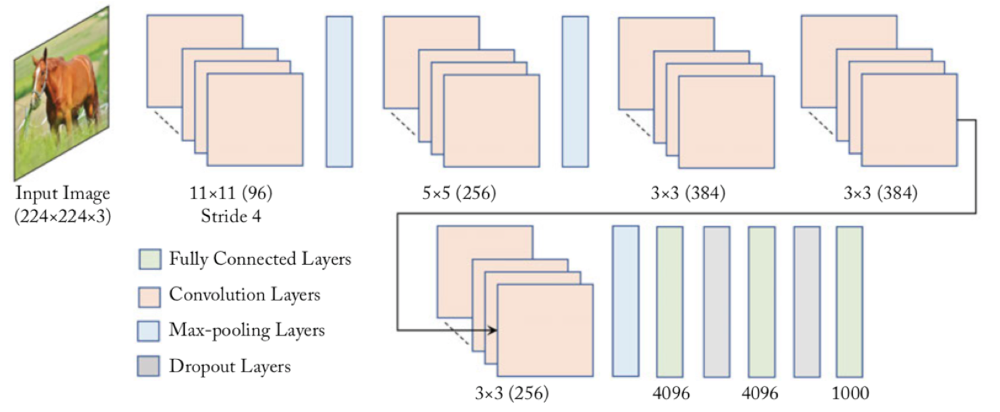


**AlexNet的网络结构**

```python
# 定义 AlexNet 网络结构
class AlexNet(paddle.nn.Layer):
    def __init__(self, num_classes=1):
        super(AlexNet, self).__init__()
        # AlexNet与LeNet一样也会同时使用卷积和池化层提取图像特征
        # 与LeNet不同的是激活函数换成了‘relu’
        self.conv1 = Conv2D(in_channels=3, out_channels=96, kernel_size=11, stride=4, padding=5)
        self.max_pool1 = MaxPool2D(kernel_size=2, stride=2)
        self.conv2 = Conv2D(in_channels=96, out_channels=256, kernel_size=5, stride=1, padding=2)
        self.max_pool2 = MaxPool2D(kernel_size=2, stride=2)
        self.conv3 = Conv2D(in_channels=256, out_channels=384, kernel_size=3, stride=1, padding=1)
        self.conv4 = Conv2D(in_channels=384, out_channels=384, kernel_size=3, stride=1, padding=1)
        self.conv5 = Conv2D(in_channels=384, out_channels=256, kernel_size=3, stride=1, padding=1)
        self.max_pool5 = MaxPool2D(kernel_size=2, stride=2)

        self.fc1 = Linear(in_features=12544, out_features=4096)
        self.drop_ratio1 = 0.5
        self.drop1 = Dropout(self.drop_ratio1)
        self.fc2 = Linear(in_features=4096, out_features=4096)
        self.drop_ratio2 = 0.5
        self.drop2 = Dropout(self.drop_ratio2)
        self.fc3 = Linear(in_features=4096, out_features=num_classes)
    
    def forward(self, x):
        x = self.conv1(x)
        x = F.relu(x)
        x = self.max_pool1(x)
        x = self.conv2(x)
        x = F.relu(x)
        x = self.max_pool2(x)
        x = self.conv3(x)
        x = F.relu(x)
        x = self.conv4(x)
        x = F.relu(x)
        x = self.conv5(x)
        x = F.relu(x)
        x = self.max_pool5(x)
        x = paddle.reshape(x, [x.shape[0], -1])
        x = self.fc1(x)
        x = F.relu(x)
        # 在全连接之后使用dropout抑制过拟合
        x = self.drop1(x)
        x = self.fc2(x)
        x = F.relu(x)
        # 在全连接之后使用dropout抑制过拟合
        x = self.drop2(x)
        x = self.fc3(x)
        return x
```

#### AlexNet在眼疾识别数据集iChallenge-PM上的应用

通过运行结果可以发现，在眼疾筛查数据集iChallenge-PM上使用AlexNet，loss能有效下降，经过5个epoch的训练，在验证集上的准确率可以达到94%左右


#### VGG

VGG是当前最流行的CNN模型之一，2014年由Simonyan和Zisserman提出，其命名来源于论文作者所在的实验室Visual Geometry Group。AlexNet模型通过构造多层网络，取得了较好的效果，但是并没有给出深度神经网络设计的方向。VGG通过使用一系列大小为3x3的小尺寸卷积核和pooling层构造深度卷积神经网络，并取得了较好的效果。VGG模型因为结构简单、应用性极强而广受研究者欢迎，尤其是它的网络结构设计方法，为构建深度神经网络提供了方向。

是VGG-16的网络结构示意图，有13层卷积和3层全连接层。VGG网络的设计严格使用

3x3的卷积层和池化层来提取特征，并在网络的最后面使用三层全连接层，将最后一层全连接层的输出作为分类的预测。 在VGG中每层卷积将使用ReLU作为激活函数，在全连接层之后添加dropout来抑制过拟合。使用小的卷积核能够有效地减少参数的个数，使得训练和测试变得更加有效。比如使用两层3x3卷积层，可以得到感受野为5的特征图，而比使用5x5的卷积层需要更少的参数。由于卷积核比较小，可以堆叠更多的卷积层，加深网络的深度，这对于图像分类任务来说是有利的。VGG模型的成功证明了增加网络的深度，可以更好的学习图像中的特征模式。

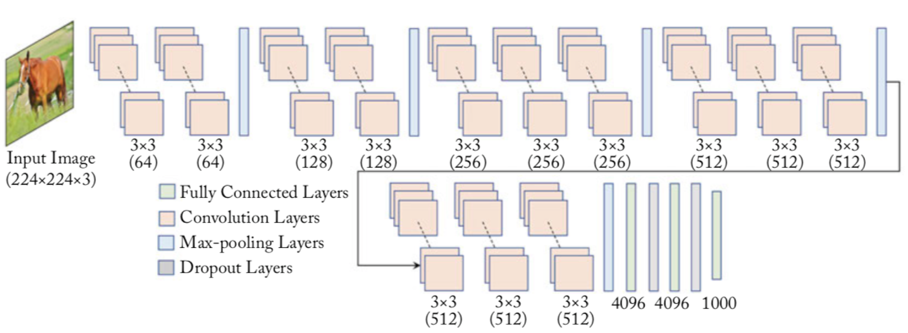


**VGG的网络结构**

```python
# 定义vgg网络
class VGG(paddle.nn.Layer):
    def __init__(self, num_classes=1):
        super(VGG, self).__init__()

        in_channels = [3, 64, 128, 256, 512, 512]
         # 定义第一个block，包含两个卷积
        self.conv1_1 = Conv2D(in_channels=in_channels[0], out_channels=in_channels[1], kernel_size=3, padding=1, stride=1)
        self.conv1_2 = Conv2D(in_channels=in_channels[1], out_channels=in_channels[1], kernel_size=3, padding=1, stride=1)

        # 定义第二个block，包含两个卷积
        self.conv2_1 = Conv2D(in_channels=in_channels[1], out_channels=in_channels[2], kernel_size=3, padding=1, stride=1)
        self.conv2_2 = Conv2D(in_channels=in_channels[2], out_channels=in_channels[2], kernel_size=3, padding=1, stride=1)

        # 定义第三个block，包含三个卷积
        self.conv3_1 = Conv2D(in_channels=in_channels[2], out_channels=in_channels[3], kernel_size=3, padding=1, stride=1)
        self.conv3_2 = Conv2D(in_channels=in_channels[3], out_channels=in_channels[3], kernel_size=3, padding=1, stride=1)
        self.conv3_3 = Conv2D(in_channels=in_channels[3], out_channels=in_channels[3], kernel_size=3, padding=1, stride=1)

        # 定义第四个block，包含三个卷积
        self.conv4_1 = Conv2D(in_channels=in_channels[3], out_channels=in_channels[4], kernel_size=3, padding=1, stride=1)
        self.conv4_2 = Conv2D(in_channels=in_channels[4], out_channels=in_channels[4], kernel_size=3, padding=1, stride=1)
        self.conv4_3 = Conv2D(in_channels=in_channels[4], out_channels=in_channels[4], kernel_size=3, padding=1, stride=1)

        # 定义第五个block，包含三个卷积
        self.conv5_1 = Conv2D(in_channels=in_channels[4], out_channels=in_channels[5], kernel_size=3, padding=1, stride=1)
        self.conv5_2 = Conv2D(in_channels=in_channels[5], out_channels=in_channels[5], kernel_size=3, padding=1, stride=1)
        self.conv5_3 = Conv2D(in_channels=in_channels[5], out_channels=in_channels[5], kernel_size=3, padding=1, stride=1)


        # 使用Sequential 将全连接层和relu组成一个线性结构（fc + relu）
        # 当输入为224x224时，经过五个卷积块和池化层后，特征维度变为[512x7x7]
        self.fc1 = paddle.nn.Sequential(paddle.nn.Linear(512 * 7 * 7, 4096), paddle.nn.ReLU())
        self.drop1_ratio = 0.5
        self.dropout1 = paddle.nn.Dropout(self.drop1_ratio, mode='upscale_in_train')
        # 使用Sequential 将全连接层和relu组成一个线性结构（fc + relu）
        self.fc2 = paddle.nn.Sequential(paddle.nn.Linear(4096, 4096), paddle.nn.ReLU())

        self.drop2_ratio = 0.5
        self.dropout2 = paddle.nn.Dropout(self.drop2_ratio, mode='upscale_in_train')
        self.fc3 = paddle.nn.Linear(4096, 1)

        self.relu = paddle.nn.ReLU()
        self.pool = MaxPool2D(stride=2, kernel_size=2)
    
    def forward(self, x):
        x = self.relu(self.conv1_1(x))
        x = self.relu(self.conv1_2(x))
        x = self.pool(x)

        x = self.relu(self.conv2_1(x))
        x = self.relu(self.conv2_2(x))
        x = self.pool(x)

        x = self.relu(self.conv3_1(x))
        x = self.relu(self.conv3_2(x))
        x = self.relu(self.conv3_3(x))
        x = self.pool(x)

        x = self.relu(self.conv4_1(x))
        x = self.relu(self.conv4_2(x))
        x = self.relu(self.conv4_3(x))
        x = self.pool(x)

        x = self.relu(self.conv5_1(x))
        x = self.relu(self.conv5_2(x))
        x = self.relu(self.conv5_3(x))
        x = self.pool(x)

        x = paddle.flatten(x, 1, -1)
        x = self.dropout1(self.fc1(x))
        x = self.dropout2(self.fc2(x))
        x = self.fc3(x)
        return x
```

#### VGG在眼疾识别数据集iChallenge-PM上的应用

通过运行结果可以发现，在眼疾筛查数据集iChallenge-PM上使用VGG，loss能有效的下降，经过5个epoch的训练，在验证集上的准确率可以达到94%左右


#### GoogLeNet

GoogLeNet是2014年ImageNet比赛的冠军，它的主要特点是网络不仅有深度，还在横向上具有“宽度”。由于图像信息在空间尺寸上的巨大差异，如何选择合适的卷积核大小来提取特征就显得比较困难了。空间分布范围更广的图像信息适合用较大的卷积核来提取其特征，而空间分布范围较小的图像信息则适合用较小的卷积核来提取其特征。为了解决这个问题，GoogLeNet提出了一种被称为Inception模块的方案


- Google的研究人员为了向LeNet致敬，特地将模型命名为GoogLeNet
- Inception一词来源于电影《盗梦空间》（Inception） 

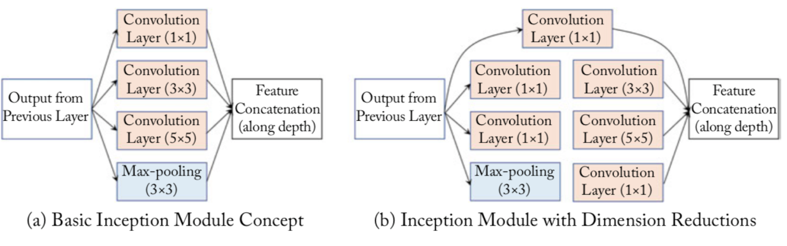


(a)是Inception模块的设计思想，使用3个不同大小的卷积核对输入图片进行卷积操作，并附加最大池化，将这4个操作的输出沿着通道这一维度进行拼接，构成的输出特征图将会包含经过不同大小的卷积核提取出来的特征。Inception模块采用多通路(multi-path)的设计形式，每个支路使用不同大小的卷积核，最终输出特征图的通道数是每个支路输出通道数的总和，这将会导致输出通道数变得很大，尤其是使用多个Inception模块串联操作的时候，模型参数量会变得非常巨大。为了减小参数量，Inception模块使用了图(b)中的设计方式，在每个3x3和5x5的卷积层之前，增加1x1的卷积层来控制输出通道数；在最大池化层后面增加1x1卷积层减小输出通道数。基于这一设计思想，形成了上图(b)中所示的结构。下面这段程序是Inception块的具体实现方式，可以对照图(b)和代码一起阅读。

> 经过3x3的最大池化之后图像尺寸不会减小吗，为什么还能跟另外3个卷积输出的特征图进行拼接？这是因为池化操作可以指定窗口大小 $k_h =  K_w$ =3，stride=1和padding=1，输出特征图尺寸可以保持不变


GoogLeNet的架构如图所示，在主体卷积部分中使用5个模块（block），每个模块之间使用步幅为2的3 ×3最大池化层来减小输出高宽。

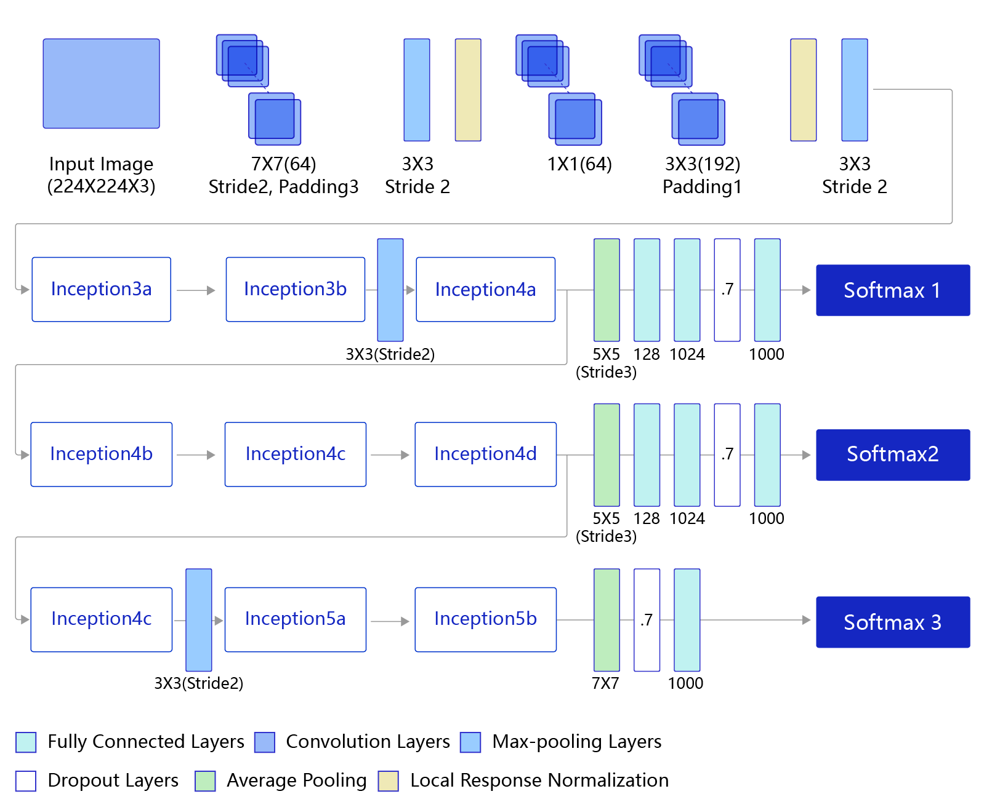

- 第一模块使用一个64通道的7 × 7卷积层。 
- 第二模块使用2个卷积层:首先是64通道的1 × 1卷积层，然后是将通道增大3倍的3 × 3卷积层。 
- 第三模块串联2个完整的Inception块
- 第四模块串联了5个Inception块。
- 第五模块串联了2 个Inception块。
- 第五模块的后面紧跟输出层，使用全局平均池化 层来将每个通道的高和宽变成1，最后接上一个输出个数为标签类别数的全连接层。

**GoogLeNet模型网络结构**

```python
# 定义Inception块
class Inception(paddle.nn.Layer):
    def __init__(self, c0, c1, c2, c3, c4, **kwargs):

        '''
        Inception模块的实现代码，
        
        c1,图(b)中第一条支路1x1卷积的输出通道数，数据类型是整数
        c2,图(b)中第二条支路卷积的输出通道数，数据类型是tuple或list, 
               其中c2[0]是1x1卷积的输出通道数，c2[1]是3x3
        c3,图(b)中第三条支路卷积的输出通道数，数据类型是tuple或list, 
               其中c3[0]是1x1卷积的输出通道数，c3[1]是5x5
        c4,图(b)中第一条支路1x1卷积的输出通道数，数据类型是整数
        '''

        super(Inception, self).__init__()
        # 依次创建Inception块每条支路上使用到的操作
        self.p1_1 = Conv2D(in_channels=c0,out_channels=c1, kernel_size=1)

        self.p2_1 = Conv2D(in_channels=c0,out_channels=c2[0], kernel_size=1)
        self.p2_2 = Conv2D(in_channels=c2[0],out_channels=c2[1], kernel_size=3, padding=1)

        self.p3_1 = Conv2D(in_channels=c0,out_channels=c3[0], kernel_size=1)
        self.p3_2 = Conv2D(in_channels=c3[0],out_channels=c3[1], kernel_size=5, padding=2)

        self.p4_1 = MaxPool2D(kernel_size=3, stride=1, padding=1)
        self.p4_2 = Conv2D(in_channels=c0,out_channels=c4, kernel_size=1)


    def forward(self, x):
        # 支路1只包含一个1x1卷积
        p1 = F.relu(self.p1_1(x))
        # 支路2包含 1x1卷积 + 3x3卷积
        p2 = F.relu(self.p2_2(F.relu(self.p2_1(x))))
        # 支路3包含 1x1卷积 + 5x5卷积
        p3 = F.relu(self.p3_2(F.relu(self.p3_1(x))))
        # 支路4包含 最大池化和1x1卷积
        p4 = F.relu(self.p4_2(self.p4_1(x)))
        # 将每个支路的输出特征图拼接在一起作为最终的输出结果
        return paddle.concat([p1, p2, p3, p4], axis=1)

class GoogLeNet(paddle.nn.Layer):
    def __init__(self):
        super(GoogLeNet, self).__init__()
        # GoogLeNet包含五个模块，每个模块后面紧跟一个池化层
        # 第一个模块包含1个卷积层
        self.conv1 = Conv2D(in_channels=3,out_channels=64, kernel_size=7, padding=3, stride=1)
        # 3x3最大池化
        self.pool1 = MaxPool2D(kernel_size=3, stride=2, padding=1)


        # 第二个模块包含2个卷积层
        self.conv2_1 = Conv2D(in_channels=64,out_channels=64, kernel_size=1, stride=1)
        self.conv2_2 = Conv2D(in_channels=64,out_channels=192, kernel_size=3, padding=1, stride=1)

        # 3x3最大池化
        self.pool2 = MaxPool2D(kernel_size=3, stride=2, padding=1)

        # 第三个模块包含2个Inception块
        self.block3_1 = Inception(192, 64, (96, 128), (16, 32), 32)
        self.block3_2 = Inception(256, 128, (128, 192), (32, 96), 64)

        # 3x3最大池化
        self.pool3 = MaxPool2D(kernel_size=3, stride=2, padding=1)

        # 第四个模块包含5个Inception块
        self.block4_1 = Inception(480, 192, (96, 208), (16, 48), 64)
        self.block4_2 = Inception(512, 160, (112, 224), (24, 64), 64)
        self.block4_3 = Inception(512, 128, (128, 256), (24, 64), 64)
        self.block4_4 = Inception(512, 112, (144, 288), (32, 64), 64)
        self.block4_5 = Inception(528, 256, (160, 320), (32, 128), 128)
        # 3x3最大池化
        self.pool4 = MaxPool2D(kernel_size=3, stride=2, padding=1)
        # 第五个模块包含2个Inception块
        self.block5_1 = Inception(832, 256, (160, 320), (32, 128), 128)
        self.block5_2 = Inception(832, 384, (192, 384), (48, 128), 128)
        # 全局池化，用的是global_pooling，不需要设置pool_stride
        self.pool5 = AdaptiveAvgPool2D(output_size=1)
        self.fc = Linear(in_features=1024, out_features=1)

    def forward(self, x):
        x = self.pool1(F.relu(self.conv1(x)))
        x = self.pool2(F.relu(self.conv2_2(F.relu(self.conv2_1(x)))))
        x = self.pool3(self.block3_2(self.block3_1(x)))
        x = self.block4_3(self.block4_2(self.block4_1(x)))
        x = self.pool4(self.block4_5(self.block4_4(x)))
        x = self.pool5(self.block5_2(self.block5_1(x)))
        x = paddle.reshape(x, [x.shape[0], -1])
        x = self.fc(x)
        return x
```


#### GoogLeNet在眼疾识别数据集iChallenge-PM上的应用

通过运行结果可以发现，使用GoogLeNet在眼疾筛查数据集iChallenge-PM上，loss能有效的下降，经过5个epoch的训练，在验证集上的准确率可以达到95%左右


#### ResNet

ResNet是2015年ImageNet比赛的冠军，将识别错误率降低到了3.6%，这个结果甚至超出了正常人眼识别的精度

通过前面几个经典模型学习，我们可以发现随着深度学习的不断发展，模型的层数越来越多，网络结构也越来越复杂。那么是否加深网络结构，就一定会得到更好的效果呢？从理论上来说，假设新增加的层都是恒等映射，只要原有的层学出跟原模型一样的参数，那么深模型结构就能达到原模型结构的效果。换句话说，原模型的解只是新模型的解的子空间，在新模型解的空间里应该能找到比原模型解对应的子空间更好的结果。但是实践表明，增加网络的层数之后，训练误差往往不降反升。

Kaiming He等人提出了残差网络ResNet来解决上述问题，其基本思想如图所示

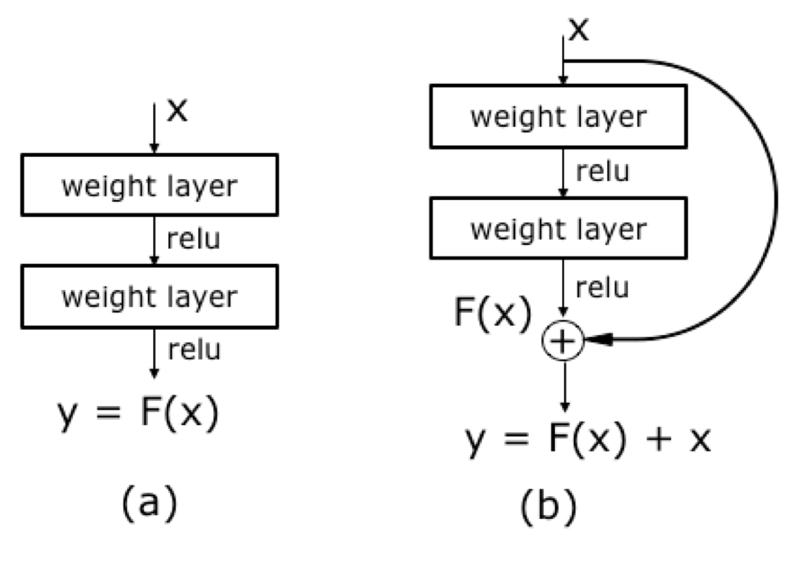

- 图(a)表示增加网络的时候，将x映射成y=F(x)输出
- 图(b)：对图(a)作了改进，输出y=F(x)+x。这时不是直接学习输出特征y的表示，而是学习 y-x
    - 如果想学习出原模型的表示，只需将F(x)的参数全部设置为0，则 y=x是恒等映射
    - F(x) = y-x也叫做残差项，如果x->y 的映射接近恒等映射，图(b)中通过学习残差项也比图(a)学习完整映射形式更加容易。

图(b)的结构是残差网络的基础，这种结构也叫做残差块（Residual block）。输入x通过跨层连接，能更快的向前传播数据，或者向后传播梯度。通俗的比喻，在火热的电视节目《王牌对王牌》上有一个“传声筒”的游戏，排在队首的嘉宾把看到的影视片段表演给后面一个嘉宾看，经过四五个嘉宾后，最后一个嘉宾如果能表演出更多原剧的内容，就能取得高分。我们常常会发现刚开始的嘉宾往往表演出最多的信息（类似于Loss），而随着表演的传递，有效的表演信息越来越少（类似于梯度弥散）。如果每个嘉宾都能看到原始的影视片段，那么相信传声筒的效果会好很多。类似的，由于ResNet每层都存在直连的旁路，相当于每一层都和最终的损失有“直接对话”的机会，自然可以更好的解决梯度弥散的问题。残差块的具体设计方案如 图7 所示，这种设计方案也常称作瓶颈结构（BottleNeck）。1x1的卷积核可以非常方便的调整中间层的通道数，在进入3x3的卷积层之前减少通道数（256->64），经过该卷积层后再恢复通道数(64->256)，可以显著减少网络的参数量。这个结构（256->64->256）像一个中间细，两头粗的瓶颈，所以被称为“BottleNeck”。

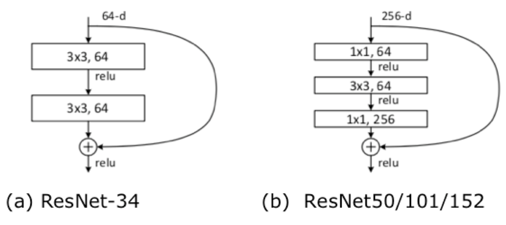


下图表示出了ResNet-50的结构，一共包含49层卷积和1层全连接，所以被称为ResNet-50

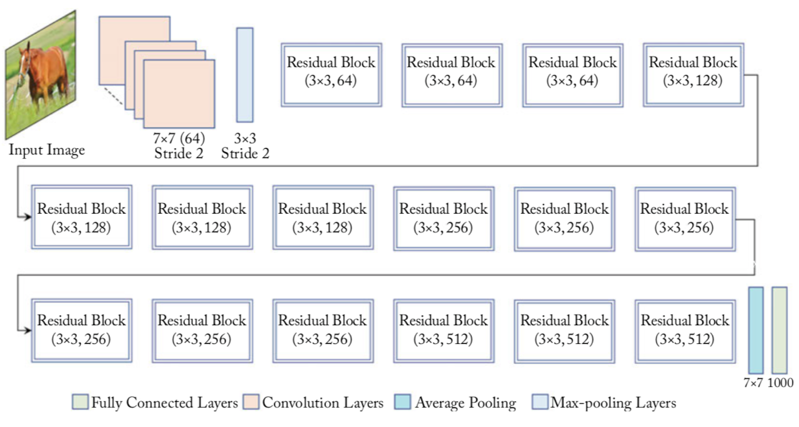


**ResNet-50模型网络结构**

```python
# ResNet中使用了BatchNorm层，在卷积层的后面加上BatchNorm以提升数值稳定性
# 定义卷积批归一化块
class ConvBNLayer(paddle.nn.Layer):
    def __init__(self,
                 num_channels,
                 num_filters,
                 filter_size,
                 stride=1,
                 groups=1,
                 act=None):
        """
        num_channels, 卷积层的输入通道数
        num_filters, 卷积层的输出通道数
        stride, 卷积层的步幅
        groups, 分组卷积的组数，默认groups=1不使用分组卷积
        """
        super(ConvBNLayer, self).__init__()


        # 创建卷积层
        self._conv = Conv2D(
            in_channels=num_channels,
            out_channels=num_filters,
            kernel_size=filter_size,
            stride=stride,
            padding=(filter_size - 1) // 2,
            groups=groups,
            bias_attr=False)

        # 创建BatchNorm层
        self._batch_norm = paddle.nn.BatchNorm2D(num_filters)

        self.act = act


    def forward(self, inputs):
        y = self._conv(inputs)
        y = self._batch_norm(y)
        if self.act == 'leaky':
            y = F.leaky_relu(x=y, negative_slope=0.1)
        elif self.act == 'relu':
            y = F.relu(x=y)
        return y        


# 定义残差块
# 每个残差块会对输入图片做三次卷积，然后跟输入图片进行短接
# 如果残差块中第三次卷积输出特征图的形状与输入不一致，则对输入图片做1x1卷积，将其输出形状调整成一致
class BottleneckBlock(paddle.nn.Layer):
    def __init__(self,
                 num_channels,
                 num_filters,
                 stride,
                 shortcut=True):
        super(BottleneckBlock, self).__init__()

        # 创建第一个卷积层 1x1
        self.conv0 = ConvBNLayer(
            num_channels=num_channels,
            num_filters=num_filters,
            filter_size=1,
            act='relu')
        # 创建第二个卷积层 3x3
        self.conv1 = ConvBNLayer(
            num_channels=num_filters,
            num_filters=num_filters,
            filter_size=3,
            stride=stride,
            act='relu')
        # 创建第三个卷积 1x1，但输出通道数乘以4
        self.conv2 = ConvBNLayer(
            num_channels=num_filters,
            num_filters=num_filters * 4,
            filter_size=1,
            act=None)

        # 如果conv2的输出跟此残差块的输入数据形状一致，则shortcut=True
        # 否则shortcut = False，添加1个1x1的卷积作用在输入数据上，使其形状变成跟conv2一致
        if not shortcut:
            self.short = ConvBNLayer(
                num_channels=num_channels,
                num_filters=num_filters * 4,
                filter_size=1,
                stride=stride)

        self.shortcut = shortcut

        self._num_channels_out = num_filters * 4


    def forward(self, inputs):
        y = self.conv0(inputs)
        conv1 = self.conv1(y)
        conv2 = self.conv2(conv1)

        # 如果shortcut=True，直接将inputs跟conv2的输出相加
        # 否则需要对inputs进行一次卷积，将形状调整成跟conv2输出一致
        if self.shortcut:
            short = inputs
        else:
            short = self.short(inputs)

        y = paddle.add(x=short, y=conv2)   # 相加
        y = F.relu(y)
        return y


# 定义ResNet模型
class ResNet(paddle.nn.Layer):
    def __init__(self, layers=50, class_dim=1):
        """
        
        layers, 网络层数，可以是50, 101或者152
        class_dim，分类标签的类别数
        """
        super(ResNet, self).__init__()
        self.layers = layers
        supported_layers = [50, 101, 152]
        assert layers in supported_layers, \
            "supported layers are {} but input layer is {}".format(supported_layers, layers)
        if layers == 50:
            #ResNet50包含多个模块，其中第2到第5个模块分别包含3、4、6、3个残差块
            depth = [3, 4, 6, 3]
        elif layers == 101:
            #ResNet101包含多个模块，其中第2到第5个模块分别包含3、4、23、3个残差块
            depth = [3, 4, 23, 3]
        elif layers == 152:
            #ResNet152包含多个模块，其中第2到第5个模块分别包含3、8、36、3个残差块
            depth = [3, 8, 36, 3]
        
        # 残差块中使用到的卷积的输出通道数
        num_filters = [64, 128, 256, 512]

        # ResNet的第一个模块，包含1个7x7卷积，后面跟着1个最大池化层
        self.conv = ConvBNLayer(
            num_channels=3,
            num_filters=64,
            filter_size=7,
            stride=2,
            act='relu')   #[N,64,112, 112]

        self.pool2d_max = MaxPool2D(
            kernel_size=3,
            stride=2,
            padding=1) #[N,64,56, 56]


        # ResNet的第二到第五个模块c2、c3、c4、c5
        self.bottleneck_block_list = []
        num_channels = 64
        for block in range(len(depth)): #  0,1,2,3
            shortcut = False
            for i in range(depth[block]):
                # c3、c4、c5将会在第一个残差块使用stride=2；其余所有残差块stride=1
                bottleneck_block = self.add_sublayer(
                    'bb_%d_%d' % (block, i),
                    BottleneckBlock(
                        num_channels=num_channels,
                        num_filters=num_filters[block],
                        stride=2 if i == 0 and block != 0 else 1, 
                        shortcut=shortcut))
                num_channels = bottleneck_block._num_channels_out
                self.bottleneck_block_list.append(bottleneck_block)
                shortcut = True

        # 在c5的输出特征图上使用全局池化
        self.pool2d_avg = paddle.nn.AdaptiveAvgPool2D(output_size=1)

        # stdv用来作为全连接层随机初始化参数的方差
        import math
        stdv = 1.0 / math.sqrt(2048 * 1.0)

        # 创建全连接层，输出大小为类别数目，经过残差网络的卷积和全局池化后，
        # 卷积特征的维度是[B,2048,1,1]，故最后一层全连接的输入维度是2048
        self.out = Linear(in_features=2048, out_features=class_dim,
                      weight_attr=paddle.ParamAttr(
                          initializer=paddle.nn.initializer.Uniform(-stdv, stdv)))


    def forward(self, inputs):
        y = self.conv(inputs)
        y = self.pool2d_max(y)
        for bottleneck_block in self.bottleneck_block_list:
            print(bottleneck_block)

        y = self.pool2d_avg(y)
        y = paddle.reshape(y, [y.shape[0], -1])

        y = self.out(y)
        return y    
```

#### ResNet-50 在眼疾识别数据集iChallenge-PM上的应用

通过运行结果可以发现，使用ResNet在眼疾筛查数据集iChallenge-PM上，loss能有效的下降，经过5个epoch的训练，在验证集上的准确率可以达到95%左右。

### 其它模型

#### ResNet模型改进

改进downsample部分，减少信息流失。前面说过了，每个stage的第一个conv都有下采样的步骤，我们看左边第一张图左侧的通路，input数据进入后在会经历一个stride=2的1*1卷积，将特征图尺寸减小为原先的一半，请注意1x1卷积和stride=2会导致输入特征图3/4的信息不被利用，因此ResNet-B的改进就是就是将下采样移到后面的3x3卷积里面去做，避免了信息的大量流失。ResNet-D则是在ResNet-B的基础上将identity部分的下采样交给avgpool去做，避免出现1x1卷积和stride同时出现造成信息流失。ResNet-C则是另一种思路，将ResNet输入部分的7x7大卷积核换成3个3x3卷积核，可以有效减小计算量，这种做法最早出现在Inception-v2中。其实这个ResNet-C 我比较疑惑，ResNet论文里说它借鉴了VGG的思想，使用大量的小卷积核，既然这样那为什么第一部分依旧要放一个7x7的大卷积核呢，不知道是出于怎样的考虑，但是现在的多数网络都把这部分改成3个3x3卷积核级联。

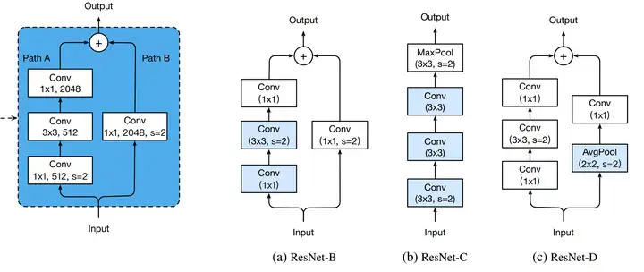

ResNet-b


#### MobileNetV1

MobileNet v1是Google在2017年的工作。虽然过去了很长时间，但它仍然极大地影响了很多移动端设备中（如手机、平板等）使用的模型（如今年Apple出的MobileOne[2]，它可看作是MobileNet的重参数化形式）

之前，总结了一些深度学习的经典网络模型，如LeNet、VGG、GooogleNet等等，详情转移至这篇博客：深度学习经典网络模型汇总。链接博文中的网络模型其实已经达到了相当不错的效果，但是存在一个的问题，就是这些模型非常庞大，参数较多，计算量较大，在一些实际的场景如移动或嵌入式设备中很难被应用。这时候就出现了可以针对这些移动场景的轻量级的网络——MobileNets。【移动的网络，是不是很轻???】


最后，我们来看一下实验结果：可以发现，作为轻量级网络的MobileNet计算量和参数量均小于GoogleNet，同时在分类效果上比GoogleNet还要好，这就是深度可分离卷积的功劳了。VGG16的计算量参数量比MobileNet大了30倍，但是结果也仅仅只高了1%不到。

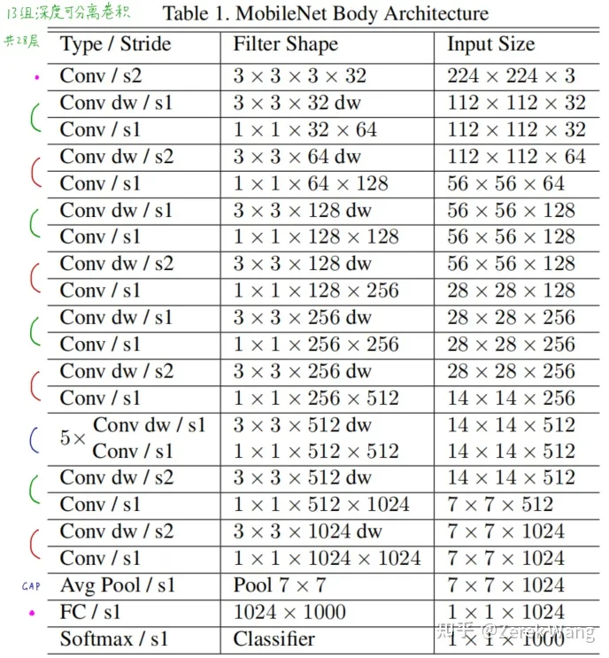


#### MobileNet v2

MobileNet v2在深度可分离卷积的基础上，提出了一种新的变体结构：Inverted bottleneck。它的结构如下图所示。

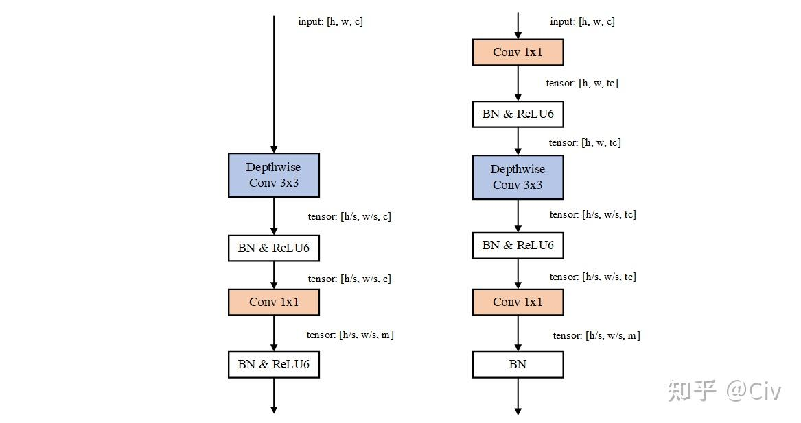

> 图4 深度可分离卷积（左图）与Inverted bottleneck结构（右图）对比。图中h、w表示输入特征图的高、宽。c表示通道数；t是通道扩张倍数；s是卷积核步长。

相比于深度可分离卷积，Inverted bottleneck的主要改动如下：
- 在深度卷积之前额外添加了1x1卷积来将通道扩张t倍。这样做的作用是增加了深度卷积处理的信息维度（通道数），本质上是在增加模型的表达能力。
- 最后一个1x1卷积通常输出维度较低，且之后不接激活函数。理由见下文。
- 当输入、输出特征图尺寸一致时，输入与输出间会额外加上一个跳跃连接（图中未画出）。

Inverted bottleneck的核心假设是：信息的存储可以依靠低维空间；但计算、处理需要在高维空间。

对应到它的改动，就是核心的计算在高维（深度卷积），而最后的信息输出是低维（最后1x1卷积）。因为最后的输出是为了信息存储、传递，所以不接激活函数（激活函数是非线性，单从数据压缩的角度来看具有破坏性）。

MobileNet v2基于Inverted bottleneck堆叠而成，其结构如下图：

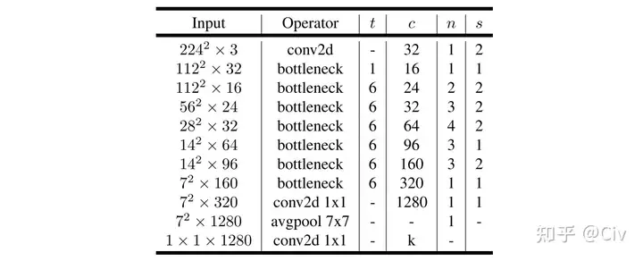

> 图5 MobileNet v2网络结构图。图中符号含义参考图4。

#### MobileNet v3

MobileNet v3仍主要基于MobileNet v2中使用的Inverted bottleneck结构。但相比于MobileNet v2，MobileNet v3的主要改动包括以下几点。

**Hard-swish激活函数**

MobileNet v3在部分网络层中使用了Hard-swish激活函数，其理由是：在MobileNet v3中使用Hard-swish相比于ReLU，可以在更少的参数下获得相近的精度。所以它完全是实验驱动的。

**Squeeze-and-Excite**

Squeeze-and-Excite block（后文简称为SE block）通过一种简单的机制对特征图的不同通道进行rescale

SE block原文中的SE block典型结构如下图所示。

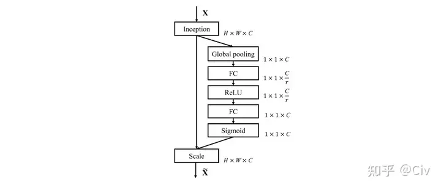

上图中的Inception模块可以替换为任意的卷积模块。例如，在最简单情况下，可以把Inception替换为一个标准卷积。

SE block首先对输入

使用一个卷积模块进行处理，处理后的输出分别流向两条分支。右侧分支的作用是为每一个通道计算出一个缩放因子（0到1的值）。在具体实现上，首先使用一个全局池化层对输出进行池化，输出的特征图尺寸为[1, 1, c]，c为通道数。此时的输出等价于一个c维的向量，其中每一维与输出的每一维一一对应。

接着使用两个全连层对这个c维向量进行处理，然后使用sigmoid将值缩放至0到1。最后将c维向量与原始输出做点积，得到最终输出。

在两个全连层中，为了减少参数量，一般会使用一个缩放因子r将通道缩放至较小的值。

在MobileNet v3中，使用的SE block是将上图中的Inception改为Inverted bottleneck的结构。

MobileNet v3 small版本的完整结构如下图所示：

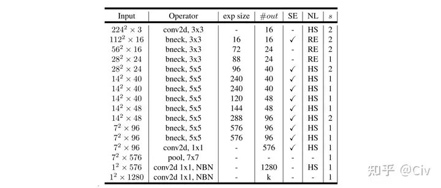

> 上图中，exp size表示经Inverted bottleneck中第一个1x1卷积输出的通道数（该值除以输入通道数就等于扩张系数，对应于图5中的参数t）（由于第一个bneck的input_channel和exp size的channel的大小一致，所以第一个bneck中没有1*1升维的卷积核）；
SE表示该层是否采用SE block结构；NL表示非线性激活函数，其中RE表示ReLU，HS表示Hard-Swish；s表示步长。
> 值得注意的是第一个卷积核的个数为16，并且采用了HS激活函数

MobileNetV3-Large的网络结构：

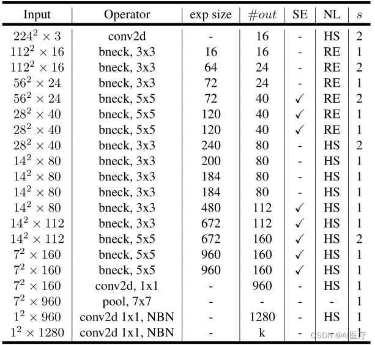


