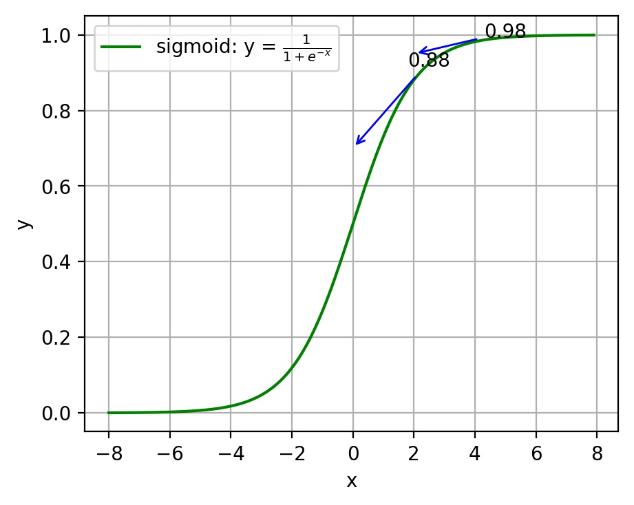
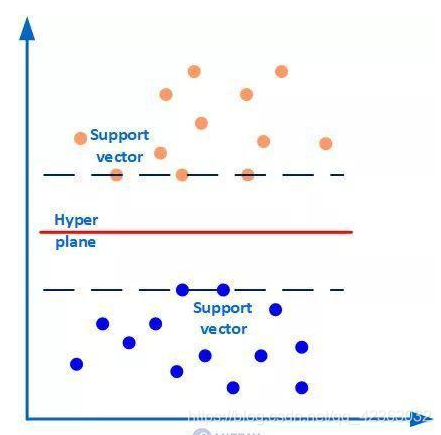
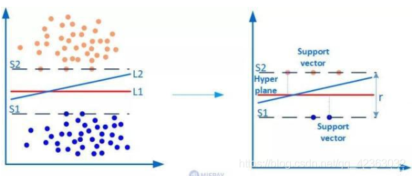
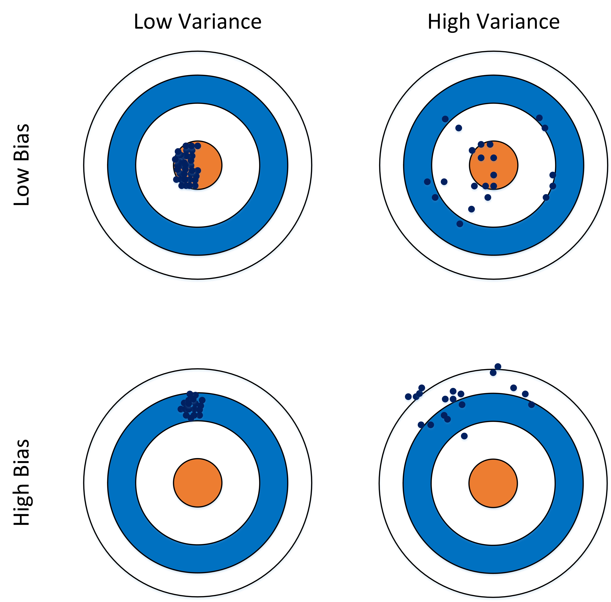
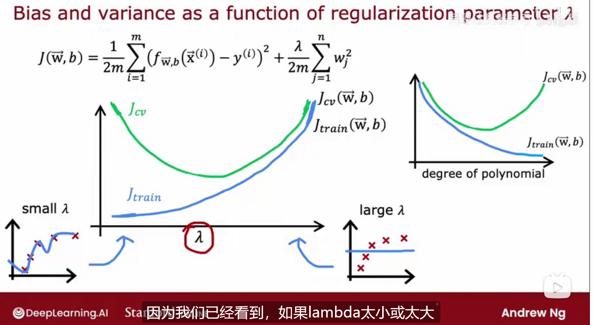
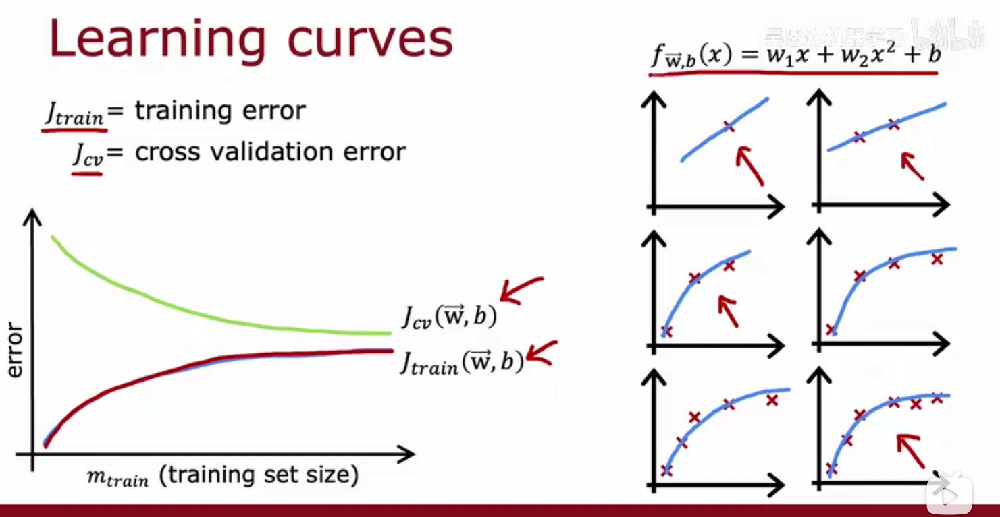

#### 监督学习

监督学习是使用已知正确答案的示例来训练网络。已知数据和其一一对应的标签，训练一个预测模型，将输入数据映射到标签的过程。

监督学习的两种主要类型是回归（Regression）和分类（Classification）

- 回归：学习算法必须从无限多可能的输出数字中预测数字
- 分类： 学习算法必须对一个类别做出预测

常见的有监督机器学习算法包括支持向量机(`Support Vector Machine, SVM`)，朴素贝叶斯(`Naive Bayes`)，逻辑回归(`Logistic Regression`)，K近邻(`K-Nearest Neighborhood, KNN`)，决策树(`Decision Tree`)，随机森林(`Random Forest`)，`AdaBoost`以及线性判别分析(`Linear Discriminant Analysis, LDA`)等。深度学习(`Deep Learning`)也是大多数以监督学习的方式呈现

#### 非监督学习

在非监督式学习中，数据并不被特别标识，适用于你具有数据集但无标签的情况。学习模型是为了推断出数据的一些内在结构

数据仅带有输入x，而没有输出标签y，算法必须在数据中找到结构

聚类算法是一种无监督学习算法，获取没有标签的数据并尝试自动将它们分组到集群中

常见算法包括Apriori算法以及k-Means算法

如： 新闻类似推荐、细分市场

#### 半监督式学习

特点：在此学习方式下，输入数据部分被标记，部分没有被标记，这种学习模型可以用来进行预测。

常见应用场景：应用场景包括分类和回归，算法包括一些对常用监督式学习算法的延伸，通过对已标记数据建模，在此基础上，对未标记数据进行预测。

算法举例：常见算法如图论推理算法（`Graph Inference`）或者拉普拉斯支持向量机（`Laplacian SVM`）等。

#### 代价函数

为什么需要代价函数

- 为了得到训练逻辑回归模型的参数，需要一个代价函数，通过训练代价函数来得到参数。
- 用于找到最优解的目的函数

在回归问题中，通过代价函数来求解最优解，常用的是平方误差代价函数。假设函数图像如图2-4所示，当参数发生变化时，假设函数状态也会随着变化

```math
J(W,B) = \frac1{2m}\sum_{i=1}^m(f_{w,b}(x^{(i)})-y^{(i)})^2
```

线性回归会尝试找到w和b的值，然后使w的J尽可能小

线性回归的目标是找到参数w或者w和b，使成本函数j的值最小

想要拟合图中的离散点，我们需要尽可能找到最优的w和b来使这条直线更能代表所有数据。如何找到最优解呢，这就需要使用代价函数来求解，以平方误差代价函数为例，假设函数为`$h(x)=\theta_0x$`。 ​ 平方误差代价函数的主要思想就是将实际数据给出的值与拟合出的线的对应值做差，求出拟合出的直线与实际的差距。在实际应用中，为了避免因个别极端数据产生的影响，采用类似方差再取二分之一的方式来减小个别数据的影响。因此，引出代价函数：

```math
J(\theta_0, \theta_1) = \frac{1}{m}\sum_{i=1}^m(h(x^{(i)})-y^{(i)})^2
```

> 其中`$x^{i}$`表示第i个样本特征，`$y^{i}$` 表示第i个样本对应的输出，`$h(x^i)$` 为假设函数。

**最优解即为代价函数的最小值**。如果是1个参数，代价函数一般通过二维曲线便可直观看出。如果是2个参数，代价函数通过三维图像可看出效果，参数越多，越复杂。 当参数为2个时，代价函数是三维图像


**为什么代价函数要非负**

目标函数存在一个下界，在优化过程当中，如果优化算法能够使目标函数不断减小，根据单调有界准则，这个优化算法就能证明是收敛有效的。 只要设计的目标函数有下界，基本上都可以，代价函数非负更为方便

**其它代价函数**

- 二次代价函数（quadratic cost）：

```math
    J = \frac{1}{2n}\sum_x\Vert y(x)-a^L(x)\Vert^2
```

其中，`$J$`表示代价函数，`$x$`表示样本，`$y$`表示实际值，`$a$`表示输出值，`$n$`表示样本的总数。使用一个样本为例简单说明，此时二次代价函数为： `$ J = \frac{(y-a)^2}{2} $`假如使用梯度下降法（`Gradient descent`）来调整权值参数的大小，权值`$w$`和偏置`$b$`的梯度推导如下： `$ \frac{\partial J}{\partial w}=(y-a)\sigma'(z)x, \frac{\partial J}{\partial b}=(y-a)\sigma'(z) $` 其中，`$z$`表示神经元的输入，`$\sigma$`表示激活函数。权值`$w$`和偏置`$b$`的梯度跟激活函数的梯度成正比，激活函数的梯度越大，权值`$w$`和偏置`$b$`的大小调整得越快，训练收敛得就越快。

> 注神经网络常用的激活函数为sigmoid函数，该函数的曲线如下图所示



如上图所示，对0.88和0.98两个点进行比较：​ 假设目标是收敛到1.0。0.88离目标1.0比较远，梯度比较大，权值调整比较大。0.98离目标1.0比较近，梯度比较小，权值调整比较小。调整方案合理。​ 假如目标是收敛到0。0.88离目标0比较近，梯度比较大，权值调整比较大。0.98离目标0比较远，梯度比较小，权值调整比较小。调整方案不合理。​ 原因：在使用sigmoid函数的情况下, 初始的代价（误差）越大，导致训练越慢

- 交叉熵代价函数（cross-entropy）：
    $$ J = -\frac{1}{n}\sum_x[y\ln a + (1-y)\ln{(1-a)}] $$

其中，$J$表示代价函数，$x$表示样本，$y$表示实际值，$a$表示输出值，$n$表示样本的总数。 权值$w$和偏置$b​$的梯度推导如下： $$ \frac{\partial J}{\partial w_j}=\frac{1}{n}\sum_{x}x_j(\sigma{(z)}-y);， \frac{\partial J}{\partial b}=\frac{1}{n}\sum_{x}(\sigma{(z)}-y) $$

当误差越大时，梯度就越大，权值$w$和偏置$b$调整就越快，训练的速度也就越快。 二次代价函数适合输出神经元是线性的情况，交叉熵代价函数适合输出神经元是S型函数的情况。

- 对数似然代价函数（log-likelihood cost）：

对数似然函数常用来作为softmax回归的代价函数。深度学习中普遍的做法是将softmax作为最后一层，此时常用的代价函数是对数似然代价函数。 对数似然代价函数与softmax的组合和交叉熵与sigmoid函数的组合非常相似。对数似然代价函数在二分类时可以化简为交叉熵代价函数的形式。 在tensorflow中： 与sigmoid搭配使用的交叉熵函数：tf.nn.sigmoid_cross_entropy_with_logits()。 与softmax搭配使用的交叉熵函数：tf.nn.softmax_cross_entropy_with_logits()。 在pytorch中： 与sigmoid搭配使用的交叉熵函数：torch.nn.BCEWithLogitsLoss()。 与softmax搭配使用的交叉熵函数：torch.nn.CrossEntropyLoss()。


#### 损失函数

损失函数（Loss Function）又叫做误差函数，用来衡量算法的运行情况，估量模型的预测值与真实值的不一致程度，是一个非负实值函数，通常使用`$ L(Y, f(x))$`来表示。损失函数越小，模型的鲁棒性就越好。损失函数是经验风险函数的核心部分，也是结构风险函数重要组成部分。

机器学习通过对算法中的目标函数进行不断求解优化，得到最终想要的结果。分类和回归问题中，通常使用损失函数或代价函数作为目标函数。 ​ 损失函数用来评价预测值和真实值不一样的程度。通常损失函数越好，模型的性能也越好。 ​ 损失函数可分为经验风险损失函数和结构风险损失函数。经验风险损失函数指预测结果和实际结果的差别，结构风险损失函数是在经验风险损失函数上加上正则项。 ​ 下面介绍常用的损失函数：

- **0-1损失函数** 如果预测值和目标值相等，值为0，如果不相等，值为1。 `$ L(Y, f(x)) = \begin{cases} 1,& Y\ne f(x)\ 0,& Y = f(x) \end{cases} $`

    一般的在实际使用中，相等的条件过于严格，可适当放宽条件：

    ```math
    L(Y, f(x)) =
    \begin{cases}
    1,& |Y-f(x)|\geqslant T\\
    0,& |Y-f(x)|< T
    \end{cases}
    ```

- **绝对值损失函数** 和0-1损失函数相似，绝对值损失函数表示为：`$L(Y, f(x)) = |Y-f(x)|$`

- **平方损失函数** `$L(Y, f(x)) = \sum_N{(Y-f(x))}^2$` 这点可从最小二乘法和欧几里得距离角度理解。最小二乘法的原理是，最优拟合曲线应该使所有点到回归直线的距离和最小。
- **对数损失函数** `$L(Y, P(Y|X)) = -\log{P(Y|X)}=-\frac{1}{N}\sum_{i=1}^N\sum_{j=1}^M y_{ij}log(p_{ij})$`

    其中, Y 为输出变量, X为输入变量, L 为损失函数. N为输入样本量, M为可能的类别数, `$y_{ij}$` 是一个二值指标, 表示类别 j 是否是输入实例 xi 的真实类别. `$p_{ij}$` 为模型或分类器预测输入实例 xi 属于类别 j 的概率.

    常见的逻辑回归使用的就是对数损失函数，有很多人认为逻辑回归的损失函数是平方损失，其实不然。逻辑回归它假设样本服从伯努利分布（0-1分布），进而求得满足该分布的似然函数，接着取对数求极值等。逻辑回归推导出的经验风险函数是最小化负的似然函数，从损失函数的角度看，就是对数损失函数。形式上等价于二分类的交叉熵损失函数。
- **指数损失函数** 指数损失函数的标准形式为：`$L(Y, f(x)) = \exp(-Yf(x))$` 例如AdaBoost就是以指数损失函数为损失函数
- **Hinge损失函数** Hinge损失函数的标准形式如下： `$L(y) = \max{(0, 1-ty)}$`

    统一的形式：`$L(Y, f(x)) = \max{(0, Yf(x))}$`
    其中y是预测值，范围为(-1,1)，t为目标值，其为-1或1。

    在线性支持向量机中，最优化问题可等价于`$\underset{\min}{w,b}\sum_{i=1}^N (1-y_i(wx_i+b))+\lambda\Vert w\Vert ^2$`

    上式相似于下式`$\frac{1}{m}\sum_{i=1}^{N}l(wx_i+by_i) + \Vert w\Vert ^2$`

    其中`$l(wx_i+by_i)$`是Hinge损失函数，`$\Vert w\Vert ^2$`可看做为正则化项。

假设逻辑回归模型 `$P(y=1|x;\theta)=\frac{1}{1+e^{-\theta^{T}x}} $` 假设逻辑回归模型的概率分布是伯努利分布，其概率质量函数为： `$ P(X=n)= \begin{cases} 1-p, n=0\ p,n=1 \end{cases} $` 其似然函数为： `$ L(\theta)=\prod_{i=1}^{m} P(y=1|x_i)^{y_i}P(y=0|x_i)^{1-y_i} $` 对数似然函数为： `$ \ln L(\theta)=\sum_{i=1}^{m}[y_i\ln{P(y=1|x_i)}+(1-y_i)\ln{P(y=0|x_i)}]\ =\sum_{i=1}^m[y_i\ln{P(y=1|x_i)}+(1-y_i)\ln(1-P(y=1|x_i))] $` 对数函数在单个数据点上的定义为： `$ cost(y,p(y|x))=-y\ln{p(y|x)-(1-y)\ln(1-p(y|x))} $` 则全局样本损失函数为： `$ cost(y,p(y|x)) = -\sum_{i=1}^m[y_i\ln p(y_i|x_i)+(1-y_i)\ln(1-p(y_i|x_i))] $` 由此可看出，对数损失函数与极大似然估计的对数似然函数本质上是相同的。所以逻辑回归直接采用对数损失函数


**对数损失函数是如何度量损失的**

例如，在高斯分布中，我们需要确定均值和标准差。如何确定这两个参数？最大似然估计是比较常用的方法。最大似然的目标是找到一些参数值，这些参数值对应的分布可以最大化观测到数据的概率。 ​ 因为需要计算观测到所有数据的全概率，即所有观测到的数据点的联合概率。现考虑如下简化情况：

- 假设观测到每个数据点的概率和其他数据点的概率是独立的。
- 取自然对数。 假设观测到单个数据点`$x_i(i=1,2,...n)$`的概率为： `$ P(x_i;\mu,\sigma)=\frac{1}{\sigma \sqrt{2\pi}}\exp \left( - \frac{(x_i-\mu)^2}{2\sigma^2} \right) $`
- 其联合概率为： `$ P(x_1,x_2,...,x_n;\mu,\sigma)=\frac{1}{\sigma \sqrt{2\pi}}\exp \left( - \frac{(x_1-\mu)^2}{2\sigma^2} \right) \ \times \frac{1}{\sigma \sqrt{2\pi}}\exp \left( - \frac{(x_2-\mu)^2}{2\sigma^2} \right) \times ... \times \frac{1}{\sigma \sqrt{2\pi}}\exp \left( - \frac{(x_n-\mu)^2}{2\sigma^2} \right) $`​ 对上式取自然对数，可得： `$ \ln(P(x_1,x_2,...x_n;\mu,\sigma))= \ln \left(\frac{1}{\sigma \sqrt{2\pi}} \right) - \frac{(x_1-\mu)^2}{2\sigma^2} \ + \ln \left( \frac{1}{\sigma \sqrt{2\pi}} \right) - \frac{(x_2-\mu)^2}{2\sigma^2} +...+ \ln \left( \frac{1}{\sigma \sqrt{2\pi}} \right) - \frac{(x_n-\mu)^2}{2\sigma^2} $` 根据对数定律，上式可以化简为： `$ \ln(P(x_1,x_2,...x_n;\mu,\sigma))=-n\ln(\sigma)-\frac{n}{2} \ln(2\pi)\ -\frac{1}{2\sigma^2}[(x_1-\mu)^2+(x_2-\mu)^2+...+(x_n-\mu)^2] $` 然后求导为： `$ \frac{\partial\ln(P(x_1,x_2,...,x_n;\mu,\sigma))}{\partial\mu}= \frac{n}{\sigma^2}[\mu - (x_1+x_2+...+x_n)] $` ​ 上式左半部分为对数损失函数。损失函数越小越好，因此我们令等式左半的对数损失函数为0，可得： `$ \mu=\frac{x_1+x_2+...+x_n}{n} $` 同理，可计算`$\sigma ​$`

#### 梯度下降

梯度下降就是用来求某个函数最小值时自变量对应取值。

梯度下降是机器学习中常见优化算法之一，梯度下降法有以下几个作用：

- 梯度下降是机器学习中常见优化算法之一，梯度下降法有以下几个作用：
- 在求解机器学习算法的模型参数，即无约束优化问题时，主要有梯度下降法（Gradient Descent）和最小二乘法
- 在求解损失函数的最小值时，可以通过梯度下降法来一步步的迭代求解，得到最小化的损失函数和模型参数值
- 如果我们需要求解损失函数的最大值，可通过梯度上升法来迭代。梯度下降法和梯度上升法可相互转换
- 在机器学习中，梯度下降法主要有随机梯度下降法和批量梯度下降法

梯度下降法缺点有以下几点

- 靠近极小值时收敛速度减慢。
- 直线搜索时可能会产生一些问题
- 可能会“之字形”地下降
- 梯度是一个向量，即有方向有大小
- 梯度的方向是最大方向导数的方向
- 梯度的值是最大方向导数的值

**梯度下降法直观理解**

梯度下降法经典图示如下图2.7所示


形象化举例，由上图所示，假如最开始，我们在一座大山上的某处位置，因为到处都是陌生的，不知道下山的路，所以只能摸索着根据直觉，走一步算一步，在此过程中，每走到一个位置的时候，都会求解当前位置的梯度，沿着梯度的负方向，也就是当前最陡峭的位置向下走一步，然后继续求解当前位置梯度，向这一步所在位置沿着最陡峭最易下山的位置走一步。不断循环求梯度，就这样一步步地走下去，一直走到我们觉得已经到了山脚。当然这样走下去，有可能我们不能走到山脚，而是到了某一个局部的山势低处。 ​ 由此，从上面的解释可以看出，梯度下降不一定能够找到全局的最优解，有可能是一个局部的最优解。当然，如果损失函数是凸函数，梯度下降法得到的解就一定是全局最优解

核心思想归纳：

- 初始化参数，随机选取取值范围内的任意数；
- 迭代操作： a）计算当前梯度； b）修改新的变量； c）计算朝最陡的下坡方向走一步； d）判断是否需要终止，如否，返回a）；
- 得到全局最优解或者接近全局最优解。

**梯度下降法算法描述**

1、确定优化模型的假设函数及损失函数。 ​ 举例，对于线性回归，假设函数为： $$ h_\theta(x_1,x_2,...,x_n)=\theta_0+\theta_1x_1+...+\theta_nx_n $$ 其中，$\theta_i,x_i(i=0,1,2,...,n)$分别为模型参数、每个样本的特征值。 对于假设函数，损失函数为： $$ J(\theta_0,\theta_1,...,\theta_n)=\frac{1}{2m}\sum^{m}_{j=0}(h\theta (x^{(j)}_0 ,x^{(j)}_1,...,x^{(j)}_n)-y_j)^2 $$

2、相关参数初始化。 ​ 主要初始化${\theta}_i$、算法迭代步长${\alpha} 、终止距离{\zeta} 。初始化时可以根据经验初始化，即{\theta} 初始化为 0，步长{\alpha} 初始化为 1 。当前步长记为{\varphi}_i $。当然，也可随机初始化

3、迭代计算

- 计算当前位置时损失函数的梯度，对${\theta}_i$ ，其梯度表示为：$ \frac{\partial}{\partial \theta_i}J({\theta}_0,{\theta}1,...,{\theta}n)=\frac{1}{2m}\sum^{m}{j=0}(h\theta (x^{(j)}_0 ,x^{(j)}_1,...,x^{(j)}_n)-y_j)^2 $ ​
- 计算当前位置下降的距离。 $$ {\varphi}_i={\alpha} \frac{\partial}{\partial \theta_i}J({\theta}_0,{\theta}_1,...,{\theta}_n) $$ ​
- 判断是否终止。 ​ 确定是否所有${\theta}_i$梯度下降的距离${\varphi}_i$都小于终止距离${\zeta}$，如果都小于${\zeta}$，则算法终止，当然的值即为最终结果，否则进入下一步。 ​
- 更新所有的${\theta}_i$，更新后的表达式为： $$ {\theta}_i={\theta}_i-\alpha \frac{\partial}{\partial \theta_i}J({\theta}_0,{\theta}1,...,{\theta}n) $$ $$ \theta_i=\theta_i - \alpha \frac{1}{m} \sum^{m}_{j=0}(h\theta (x^{(j)}_0 ,x^{(j)}_1,...,x^{(j)}_n)-y_j)x^{(j)}_i $$ ​ 5）令上式$x^{(j)}_0=1$，更新完毕后转入1)。 ​ 由此，可看出，当前位置的梯度方向由所有样本决定，上式中
、$\alpha \frac{1}{m}​$ 的目的是为了便于理解

参数的初始值选择。 初始值不同，获得的最小值也有可能不同，梯度下降有可能得到的是局部最小值。如果损失函数是凸函数，则一定是最优解。由于有局部最优解的风险，需要多次用不同初始值运行算法，关键损失函数的最小值，选择损失函数最小化的初值

**学习率**

`$w = w - \alpha \frac{d}{dw}J(w)$`  ->  `$ \alpha \frac{1}{m} \sum_{i=1}^m(f_{w,b}(x^{(i)})-y^{(i)})x^{(i)}$`

```math
\frac{d}{dw}J(w) = \frac{d}{dw}\frac{1}{2m}\sum^{m}_{i=1}(f_{w,b}(x^{(i)})-y^{(i)})^2  = \frac{d}{dw}\frac{1}{2m}\sum^{m}_{i=1}(wx^{(i)}+b-y^{(i)})^2

    = \frac{d}{dw}\frac{1}{2m}\sum^{m}_{i=1}(wx^{(i)}+b-y^{(i)})2x^{(i)}

    = \frac{d}{dw}\frac{1}{m}\sum^{m}_{i=1}(f_{w,b}(x^{(i)})-y^{(i)})x^{(i)}
```

`$b = b - \alpha \frac{d}{dw}J(w)$`  ->  `$ \alpha \frac{1}{m} \sum_{i=1}^m(f_{w,b}(x^{(i)})-y^{(i)})$`

`$\alpha$` 表示是学习率， 学习率的选择将对实现梯度下降的效率产生巨大影响。但步长太大，有时会导致迭代速度过快，错过最优解。步长太小，迭代速度慢，算法运行时间长

**随机梯度和批量梯度区别**

随机梯度下降（SGD）和批量梯度下降（BGD）是两种主要梯度下降法，其目的是增加某些限制来加速运算求解。

 **批量梯度下降的求解思路如下**：

- 得到每个`$ \theta$`对应的梯度： `$ \frac{\partial}{\partial \theta_i}J({\theta}_0,{\theta}1,...,{\theta}n)=\frac{1}{m}\sum^{m}_{j=0}(h\theta (x^{j}_0 ,x^{j}_1,...,x^{j}n)-y^j)x^{j}_i $`
- 由于是求最小化风险函数，所以按每个参数 `$ \theta ​$` 的梯度负方向更新 `$ \theta_i ​$` ： `$ \theta_i=\theta_i - \frac{1}{m} \sum^{m}_{j=0}(h\theta (x^{j}_0 ,x^{j}_1,...,x^{j}_n)-y^j)x^{j}_i $`
- 从上式可以注意到，它得到的虽然是一个全局最优解，但每迭代一步，都要用到训练集所有的数据，如果样本数据很大，这种方法迭代速度就很慢。 相比而言，随机梯度下降可避免这种问题。

**随机梯度下降的求解思路如下**：

- 相比批量梯度下降对应所有的训练样本，随机梯度下降法中损失函数对应的是训练集中每个样本的粒度。 损失函数可以写成如下这种形式， `$ J(\theta_0, \theta_1, ... , \theta_n) = \frac{1}{m} \sum^{m}_{j=0}(y^j - h\theta (x^{j}_0 ,x^{j}1,...,x^{j}n))^2 = \frac{1}{m} \sum^{m}_{j=0} cost(\theta,(x^j,y^j)) $`
- 对每个参数 `$ \theta​$` 按梯度方向更新 `$ \theta​$`： `$ \theta_i = \theta_i + (y^j - h\theta (x^{j}_0, x^{j}_1, ... ,x^{j}_n)) $`
- 随机梯度下降是通过每个样本来迭代更新一次。 随机梯度下降伴随的一个问题是噪音较批量梯度下降要多，使得随机梯度下降并不是每次迭代都向着整体最优化方向

随机梯度下降法、批量梯度下降法相对来说都比较极端，简单对比如下：

|     方法     | 特点                                                         |
| :----------: | :----------------------------------------------------------- |
| 批量梯度下降 | a）采用所有数据来梯度下降。<br/>b）批量梯度下降法在样本量很大的时候，训练速度慢。 |
| 随机梯度下降 | a）随机梯度下降用一个样本来梯度下降。<br/>b）训练速度很快。<br />c）随机梯度下降法仅仅用一个样本决定梯度方向，导致解有可能不是全局最优。<br />d）收敛速度来说，随机梯度下降法一次迭代一个样本，导致迭代方向变化很大，不能很快的收敛到局部最优解。 |

下面介绍能结合两种方法优点的小批量梯度下降法。

**小批量（Mini-Batch）梯度下降的求解思路如下**
对于总数为`$m$`个样本的数据，根据样本的数据，选取其中的`$n(1< n< m)$`个子样本来迭代。其参数`$\theta$`按梯度方向更新`$\theta_i$`公式如下：

```math
\theta_i = \theta_i - \alpha \sum^{t+n-1}_{j=t}
  ( h_\theta (x^{j}_{0}, x^{j}_{1}, ... , x^{j}_{n} ) - y^j ) x^{j}_{i}
```

### 2.12.7 各种梯度下降法性能比较

下表简单对比随机梯度下降（SGD）、批量梯度下降（BGD）、小批量梯度下降（Mini-batch GD）、和Online GD的区别：

||BGD|SGD|Mini-batch GD|Online GD|
|:--:|:--:|:-:|:-----------:|:-------:|
|训练集|固定|固定|固定|实时更新|
|单次迭代样本数|整个训练集|单个样本|训练集的子集|根据具体算法定|
|算法复杂度|高|低|一般|低|
|时效性|低|一般|一般|高|
|收敛性|稳定|不稳定|较稳定|不稳定|

BGD、SGD、Mini-batch GD，前面均已讨论过，这里介绍一下Online GD。

Online GD于Mini-batch GD/SGD的区别在于，所有训练数据只用一次，然后丢弃。这样做的优点在于可预测最终模型的变化趋势。

Online GD在互联网领域用的较多，比如搜索广告的点击率（CTR）预估模型，网民的点击行为会随着时间改变。用普通的BGD算法（每天更新一次）一方面耗时较长（需要对所有历史数据重新训练）；另一方面，无法及时反馈用户的点击行为迁移。而Online GD算法可以实时的依据网民的点击行为进行迁移


**梯度下降法实践1-特征缩放**

在我们面对多维特征问题的时候，我们要保证这些特征都具有相近的尺度，这将帮助梯度下降算法更快地收敛。

以房价问题为例，假设我们使用两个特征，房屋的尺寸和房间的数量，尺寸的值为 0-2000平方英尺，而房间数量的值则是0-5，以两个参数分别为横纵坐标，绘制代价函数的等高线图能，看出图像会显得很扁，梯度下降算法需要非常多次的迭代才能收敛。


解决的方法是尝试将所有特征的尺度都尽量缩放到-1到1之间

 

最简单的方法是令：`${{x}{n}}=\frac{{{x}{n}}-{{\mu}{n}}}{{{s}_{n}}}$`，其中 `${{\mu}{n}}$`是平均值，`${s_{n}}$`是标准差

**梯度下降法实践2-学习率**
 
梯度下降算法收敛所需要的迭代次数根据模型的不同而不同，我们不能提前预知，我们可以绘制迭代次数和代价函数的图表来观测算法在何时趋于收敛


也有一些自动测试是否收敛的方法，例如将代价函数的变化值与某个阀值（例如0.001）进行比较，但通常看上面这样的图表更好

梯度下降算法的每次迭代受到学习率的影响，如果学习率`$a$`过小，则达到收敛所需的迭代次数会非常高；如果学习率`$a$`过大，每次迭代可能不会减小代价函数，可能会越过局部最小值导致无法收敛。

通常可以考虑尝试些学习率：

`$a$` = 0.01, 0.03, 0.1, 0.3, 1, 3, 10


#### normal equation（正规方程）

到目前为止，我们都在使用梯度下降算法，但是对于某些线性回归问题，正规方程方法是更好的解决方案

对于给定的数据 X1，预测结果将会通过 `$Y = X1^T w$` 给出。现在的问题是，手里有一些 X 和对应的 y，怎样才能找到 w 呢？一个常用的方法就是找出使误差最小的 w 。这里的误差是指预测 y 值和真实 y 值之间的差值，使用该误差的简单累加将使得正差值和负差值相互抵消，所以我们采用平方误差（实际上就是我们通常所说的最小二乘法）

`$\sum_{i=1}^m(y_{i} - x_{i}^Tw)^2$`

用矩阵表示还可以写做 `$(Y - X_{w})^T(Y-X_{w})$` 。如果对 w 求导，得到 `$X^T(Y-X_{w})$`令其等于零，

解出 w 如下（具体求导过程为: http://blog.csdn.net/nomadlx53/article/details/50849941 ）:

`$\hat w = (X^TX)^{-1}X^TY$`

（`$A$` 为`$m*n$`矩阵，则 `$A^T$` 为 `$n*m$`矩阵)


`$\theta ={{\left( {X^{T}}X \right)}^{-1}}{X^{T}}y$` 的推导过程：

`$J\left( \theta  \right)=\frac{1}{2m}\sum\limits_{i=1}^{m}{{{\left( {h_{\theta}}\left( {x^{(i)}} \right)-{y^{(i)}} \right)}^{2}}}$`
其中：`${h_{\theta}}\left( x \right)={\theta^{T}}X={\theta_{0}}{x_{0}}+{\theta_{1}}{x_{1}}+{\theta_{2}}{x_{2}}+...+{\theta_{n}}{x_{n}}$`

将向量表达形式转为矩阵表达形式，则有`$J(\theta )=\frac{1}{2}{{\left( X\theta -y\right)}^{2}}$` ，其中`$X$`为`$m$`行`$n$`列的矩阵（`$m$`为样本个数，`$n$`为特征个数），`$\theta$`为`$n$`行1列的矩阵，`$y$`为`$m$`行1列的矩阵，对`$J(\theta )$`进行如下变换

`$J(\theta )=\frac{1}{2}{{\left( X\theta -y\right)}^{T}}\left( X\theta -y \right)$`

`$=\frac{1}{2}\left( {{\theta }^{T}}{{X}^{T}}-{{y}^{T}} \right)\left(X\theta -y \right)$`

`$=\frac{1}{2}\left( {{\theta }^{T}}{{X}^{T}}X\theta -{{\theta}^{T}}{{X}^{T}}y-{{y}^{T}}X\theta -{{y}^{T}}y \right)$`

接下来对`$J(\theta )$`偏导，需要用到以下几个矩阵的求导法则:

`$\frac{dAB}{dB}={{A}^{T}}$`

`$\frac{d{{X}^{T}}AX}{dX}=2AX$`                           

所以有:

`$\frac{\partial J\left( \theta  \right)}{\partial \theta }=\frac{1}{2}\left(2{{X}^{T}}X\theta -{{X}^{T}}y -{}({{y}^{T}}X )^{T}-0 \right)$`

`$=\frac{1}{2}\left(2{{X}^{T}}X\theta -{{X}^{T}}y -{{X}^{T}}y -0 \right)$`

`$={{X}^{T}}X\theta -{{X}^{T}}y$`

令`$\frac{\partial J\left( \theta  \right)}{\partial \theta }=0$`

则有`$\theta ={{\left( {X^{T}}X \right)}^{-1}}{X^{T}}y$`


需要对矩阵求逆，因此这个方程只在逆矩阵存在的时候适用，我们在程序代码中对此作出判断。 判断矩阵是否可逆的一个可选方案是:

判断矩阵的行列式是否为 0，若为 0 ，矩阵就不存在逆矩阵，不为 0 的话，矩阵才存在逆矩阵。

**梯度下降与正规方程的比较**：

- 梯度下降：需要选择学习率α，需要多次迭代，当特征数量n大时也能较好适用，适用于各种类型的模型
- 正规方程：不需要选择学习率α，不需要对数据进行归一化处理，一次计算得出，需要计算，如果特征数量n较大则运算代价大，因为矩阵逆的计算时间复杂度为O（n^3），通常来说当小于10000 时还是可以接受的，只适用于线性模型，不适合逻辑回归模型等其他模型


总结一下，只要特征变量的数目并不大，标准方程是一个很好的计算参数`$\theta $`的替代方法。具体地说，只要特征变量数量小于一万，我通常使用标准方程法，而不使用梯度下降法

随着我们要讲的学习算法越来越复杂，例如，当我们讲到分类算法，像逻辑回归算法，我们会看到，实际上对于那些算法，并不能使用标准方程法。对于那些更复杂的学习算法，我们将不得不仍然使用梯度下降法。因此，梯度下降法是一个非常有用的算法，可以用在有大量特征变量的线性回归问题。或者我们以后在课程中，会讲到的一些其他的算法，因为标准方程法不适合或者不能用在它们上。但对于这个特定的线性回归模型，标准方程法是一个比梯度下降法更快的替代算法。所以，根据具体的问题，以及你的特征变量的数量，这两种算法都是值得学习的。

正规方程的python实现
```
import numpy as np
    
 def normalEqn(X, y):
    
   theta = np.linalg.inv(X.T@X)@X.T@y #X.T@X等价于X.T.dot(X)
    
   return theta
```


#### SVM

支持向量机(Support Vector Machines, SVM): 是一种监督学习算法

- 支持向量(Support Vector)就是离分隔超平面最近的那些点。
- 机(Machine)就是表示一种算法，而不是表示机器

**工作原理**


对于上述的苹果和香蕉，我们想象为2种水果类型的炸弹。（保证距离最近的炸弹，距离它们最远）


- 寻找最大分类间距
- 转而通过拉格朗日函数求优化的问题

- 数据可以通过画一条直线就可以将它们完全分开，这组数据叫线性可分(linearly separable)数据，而这条分隔直线称为分隔超平面(separating hyperplane)。
- 如果数据集上升到1024维呢？那么需要1023维来分隔数据集，也就说需要N-1维的对象来分隔，这个对象叫做超平面(hyperlane)，也就是分类的决策边界。





**间隔最大化**

如何找到最合适的分类超平面？依据的原则就是间隔最大化。

所谓间隔最大化，说的是分类超平面跟两类数据的间隔要尽可能大（即远离两边数据），这就要提到我们前面说到的公平原则。“三八线”要划在课桌正中间，不偏向任何一方，才能保证双方利益最大化。对于分类超平面来说，也就是要位于两类数据的正中间，不偏向任何一类，才能保证离两边数据都尽可能远，从而实现间隔最大化。

如左下图所示，有两类样本数据（分别用橙色和蓝色的小圆圈表示），我们可通过红色或蓝色两条直线（L1或L2）将这两类样本数据分开。事实上，我们还可以画出很多条直线将两类样本分开，也就是说，存在有多个可行的线性分类器能将两类样本分类。SVM的最终目标是：以间隔最大化为原则找到最合适的那个分类器。



从直观上看，图中蓝线L2偏向了橙色数据一方，有失公平原则，因而不是我们要找的理想的分类器。红线L1则较注重公平，不偏向任何一类数据，从而能较好地确保离两类数据都尽可能远，实现间隔最大化，这样的分类超平面具有更好的泛化性能，分类更加准确，正是我们要找的最合适的分类器。

我们注意到，图中两条虚线（S1和S2）上的圆点数据即为支持向量（Support vector），它们距离分类超平面最近。现在我们仅保留这些支持向量数据点进行分析（右上图），可以看出两条虚线之间的间隔距离为r。依据公平原则，支持向量到分类超平面的距离则为r/2，这个值即为分类间隔。间隔最大化，就是最大化这个值（r/2）。

由此可以看出，分类间隔值（r/2）只与支持向量数据点有关，与其他非支持向量数据点无关。这也正好诠释了我们在文中开头说到的：SVM的核心理念是支持向量样本会对识别的问题起关键性作用。也就是说，分类超平面的确定仅取决于支持向量。

对于给定的训练样本，首先要找到距离分类超平面最近的点（支持向量），再通过最大化这些点之间的间隔来求解。


#### 参考

<https://blog.csdn.net/jiamenghu/article/details/109484262>

#### 分类算法

表2-1 常用分类算法的优缺点

| 算法                        | 优点                                                         | 缺点                                                         |
| :-------------------------- | :----------------------------------------------------------- | :----------------------------------------------------------- |
| Bayes 贝叶斯分类法          | 1）所需估计的参数少，对于缺失数据不敏感。2）有着坚实的数学基础，以及稳定的分类效率。 | 1）需要假设属性之间相互独立，这往往并不成立。（喜欢吃番茄、鸡蛋，却不喜欢吃番茄炒蛋）。<br />2）需要知道先验概率。<br />3）分类决策存在错误率。 |
| Decision Tree决策树         | 1）不需要任何领域知识或参数假设。<br />2）适合高维数据。<br />3）简单易于理解。<br />4）短时间内处理大量数据，得到可行且效果较好的结果。<br />5）能够同时处理数据型和常规性属性。 | 1）对于各类别样本数量不一致数据，信息增益偏向于那些具有更多数值的特征。<br />2）易于过拟合。<br />3）忽略属性之间的相关性。<br />4）不支持在线学习。 |
| SVM支持向量机               | 1）可以解决小样本下机器学习的问题。<br />2）提高泛化性能。<br />3）可以解决高维、非线性问题。超高维文本分类仍受欢迎。<br />4）避免神经网络结构选择和局部极小的问题。 | 1）对缺失数据敏感。<br />2）内存消耗大，难以解释。<br />3）运行和调参略烦人。 |
| KNN K近邻                   | 1）思想简单，理论成熟，既可以用来做分类也可以用来做回归； <br />2）可用于非线性分类；<br /> 3）训练时间复杂度为O(n)； <br />4）准确度高，对数据没有假设，对outlier不敏感； | 1）计算量太大。<br />2）对于样本分类不均衡的问题，会产生误判。<br />3）需要大量的内存。<br />4）输出的可解释性不强。 |
| Logistic Regression逻辑回归 | 1）速度快。<br />2）简单易于理解，直接看到各个特征的权重。<br />3）能容易地更新模型吸收新的数据。<br />4）如果想要一个概率框架，动态调整分类阀值。 | 特征处理复杂。需要归一化和较多的特征工程。                   |
| Neural Network 神经网络     | 1）分类准确率高。<br />2）并行处理能力强。<br />3）分布式存储和学习能力强。<br />4）鲁棒性较强，不易受噪声影响。 | 1）需要大量参数（网络拓扑、阀值、阈值）。<br />2）结果难以解释。<br />3）训练时间过长。 |
| Adaboosting                 | 1）adaboost是一种有很高精度的分类器。<br />2）可以使用各种方法构建子分类器，Adaboost算法提供的是框架。<br />3）当使用简单分类器时，计算出的结果是可以理解的。而且弱分类器构造极其简单。<br>4）简单，不用做特征筛选。5）不用担心overfitting。 | 对outlier比较敏感                                            |


### 模型评估

​ 一般情况来说，单一评分标准无法完全评估一个机器学习模型。只用good和bad偏离真实场景去评估某个模型，都是一种欠妥的评估方式。下面介绍常用的分类模型和回归模型评估方法

#### 分类模型常用评估方法


|指标|描述|
|:-:|:-:|
|Accuracy|准确率|
|Precision|精准度/查准率|
|Recall|召回率/查全率|
|P-R曲线|查准率为纵轴，查全率为横轴，作图|
|F1|F1值|
|Confusion Matrix|混淆矩阵|
|ROC|ROC曲线|
|AUC|ROC曲线下的面积|


#### 回归模型常用评估方法

|指标|描述|
|:-:|:-:|
|Mean Square Error (MSE, RMSE)|平均方差|
|Absolute Error (MAE, RAE)|绝对误差|
|R-Squared|R平方值|


#### 误差、偏差和方差有什么区别和联系

在机器学习中，Bias(偏差)，Error(误差)，和Variance(方差)存在以下区别和联系

**对于Error**：

- 误差（error）：一般地，我们把学习器的实际预测输出与样本的真是输出之间的差异称为“误差”。

- Error = Bias + Variance + Noise，Error反映的是整个模型的准确度。

**对于Noise:**

噪声：描述了在当前任务上任何学习算法所能达到的期望泛化误差的下界，即刻画了学习问题本身的难度

**对于Bias：**

- Bias衡量模型拟合训练数据的能力（训练数据不一定是整个 training dataset，而是只用于训练它的那一部分数据，例如：mini-batch），Bias反映的是模型在样本上的输出与真实值之间的误差，即模型本身的精准度。
- Bias 越小，拟合能力越高（可能产生overfitting）；反之，拟合能力越低（可能产生underfitting）。
- 偏差越大，越偏离真实数据，如下图第二行所示。


**对于Variance：**

- 方差公式：$S_{N}^{2}=\frac{1}{N}\sum_{i=1}^{N}(x_{i}-\bar{x})^{2}$

- Variance描述的是预测值的变化范围，离散程度，也就是离其期望值的距离。方差越大，数据的分布越分散，模型的稳定程度越差。
- Variance反映的是模型每一次输出结果与模型输出期望之间的误差，即模型的稳定性。
- Variance越小，模型的泛化的能力越高；反之，模型的泛化的能力越低。
- 如果模型在训练集上拟合效果比较优秀，但是在测试集上拟合效果比较差劣，则方差较大，说明模型的稳定程度较差，出现这种现象可能是由于模型对训练集过拟合造成的。 如下图右列所示。




#### 经验误差与泛化误差


经验误差（empirical error）：也叫训练误差（training error），模型在训练集上的误差。 

泛化误差（generalization error）：模型在新样本集（测试集）上的误差称为“泛化误差”


#### 图解欠拟合、过拟合

根据不同的坐标方式，欠拟合与过拟合图解不同。

1、横轴为训练样本数量，纵轴为误差


如上图所示，我们可以直观看出欠拟合和过拟合的区别：

​ 模型欠拟合：在训练集以及测试集上同时具有较高的误差，此时模型的偏差较大；

​ 模型过拟合：在训练集上具有较低的误差，在测试集上具有较高的误差，此时模型的方差较大。

​ 模型正常：在训练集以及测试集上，同时具有相对较低的偏差以及方差。


2、横轴为模型复杂程度，纵轴为误差


​红线为测试集上的Error,蓝线为训练集上的Error

​模型欠拟合：模型在点A处，在训练集以及测试集上同时具有较高的误差，此时模型的偏差较大。
模型过拟合：模型在点C处，在训练集上具有较低的误差，在测试集上具有较高的误差，此时模型的方差较大。
模型正常：模型复杂程度控制在点B处为最优。

3、横轴为正则项系数，纵轴为误差




​ 红线为测试集上的Error,蓝线为训练集上的Error

​ 模型欠拟合：模型在点C处，在训练集以及测试集上同时具有较高的误差，此时模型的偏差较大。

​ 模型过拟合：模型在点A处，在训练集上具有较低的误差，在测试集上具有较高的误差，此时模型的方差较大。 它通常发生在模型过于复杂的情况下，如参数过多等，会使得模型的预测性能变弱，并且增加数据的波动性。虽然模型在训练时的效果可以表现的很完美，基本上记住了数据的全部特点，但这种模型在未知数据的表现能力会大减折扣，因为简单的模型泛化能力通常都是很弱的。

​ 模型正常：模型复杂程度控制在点B处为最优。

#### 如何解决过拟合与欠拟合

如何解决欠拟合：

- 添加其他特征项。组合、泛化、相关性、上下文特征、平台特征等特征是特征添加的重要手段，有时候特征项不够会导致模型欠拟合。
- 添加多项式特征。例如将线性模型添加二次项或三次项使模型泛化能力更强。例如，FM（Factorization Machine）模型、FFM（Field-aware Factorization Machine）模型，其实就是线性模型，增加了二阶多项式，保证了模型一定的拟合程度。
- 可以增加模型的复杂程度。
- 减小正则化系数。正则化的目的是用来防止过拟合的，但是现在模型出现了欠拟合，则需要减少正则化参数。

如何解决过拟合


- 重新清洗数据，数据不纯会导致过拟合，此类情况需要重新清洗数据。
- 增加训练样本数量。
- 降低模型复杂程度。
- 增大正则项系数。
- 采用dropout方法，dropout方法，通俗的讲就是在训练的时候让神经元以一定的概率不工作。
- early stopping。
- 减少迭代次数。
- 增大学习率。
- 添加噪声数据。
- 树结构中，可以对树进行剪枝。
- 减少特征项。

欠拟合和过拟合这些方法，需要根据实际问题，实际模型，进行选择。

#### 交叉验证的主要作用

​ 为了得到更为稳健可靠的模型，对模型的泛化误差进行评估，得到模型泛化误差的近似值。当有多个模型可以选择时，我们通常选择“泛化误差”最小的模型。

​ 交叉验证的方法有许多种，但是最常用的是：留一交叉验证、k折交叉验证。

#### 理解k折交叉验证


- 将含有N个样本的数据集，分成K份，每份含有N/K个样本。选择其中1份作为测试集，另外K-1份作为训练集，测试集就有K种情况。
- 在每种情况中，用训练集训练模型，用测试集测试模型，计算模型的泛化误差。
- 交叉验证重复K次，每份验证一次，平均K次的结果或者使用其它结合方式，最终得到一个单一估测，得到模型最终的泛化误差。
- 将K种情况下，模型的泛化误差取均值，得到模型最终的泛化误差。
- 一般$2\leqslant K \leqslant10$。 k折交叉验证的优势在于，同时重复运用随机产生的子样本进行训练和验证，每次的结果验证一次，10折交叉验证是最常用的。
- 训练集中样本数量要足够多，一般至少大于总样本数的50%。
- 训练集和测试集必须从完整的数据集中均匀取样。均匀取样的目的是希望减少训练集、测试集与原数据集之间的偏差。当样本数量足够多时，通过随机取样，便可以实现均匀取样的效果。


#### 错误率及精度

- 错误率（Error Rate）：分类错误的样本数占样本总数的比例。
- 精度（accuracy）：分类正确的样本数占样本总数的比例。


#### 查准率与查全率

- 正确肯定（True Positive,TP）：预测为真，实际为真
- 正确否定（True Negative,TN）：预测为假，实际为假
- 错误肯定（False Positive,FP）：预测为真，实际为假
- 错误否定（False Negative,FN）：预测为假，实际为真

查准率（Precision）=TP/（TP+FP）

理解：预测出为阳性的样本中，正确的有多少。区别准确率（正确预测出的样本，包括正确预测为阳性、阴性，占总样本比例）。 例，在所有我们预测有恶性肿瘤的病人中，实际上有恶性肿瘤的病人的百分比，越高越好。

查全率（Recall）=TP/（TP+FN）

理解：正确预测为阳性的数量占总样本中阳性数量的比例。 例，在所有实际上有恶性肿瘤的病人中，成功预测有恶性肿瘤的病人的百分比，越高越好


- 正确率（Precision） —— 提取出的正确信息条数 / 提取出的信息条数
- 召回率（Recall） —— 提取出的正确信息条数 / 样本中的信息条数
- F 值 —— 正确率 * 召回率 * 2 / （正确率 + 召回率）（F值即为正确率和召回率的调和平均值）


举个例子如下: 某池塘有 1400 条鲤鱼，300 只虾，300 只乌龟。现在以捕鲤鱼为目的。撒了一张网，逮住了 700 条鲤鱼，200 只 虾， 100 只乌龟。那么这些指标分别如下: 正确率 = 700 / (700 + 200 + 100) = 70% 召回率 = 700 / 1400 = 50% F 值 = 70% * 50% * 2 / (70% + 50%) = 58.3%


https://zhuanlan.zhihu.com/p/306245139


#### 学习曲线





参考链接

[机器学习基础](https://github.com/apachecn/AiLearning/blob/master/docs/ml/1.机器学习基础.md)

[机器学习基础/第二章_机器学习基础](https://github.com/scutan90/DeepLearning-500-questions/blob/master/ch02_机器学习基础/第二章_机器学习基础.md)

。
https://zhuanlan.zhihu.com/p/25197792