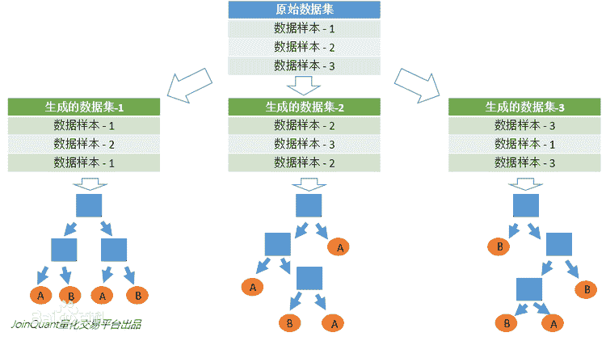

### 决策树（Decision Tree）学习（1）

#### 决策树是什么

它是一种监督学习算法，主要用于分类问题，适用于可分类的、连续的输入和输出变量

决策树是这样的一种数，这棵树的每个分支节点表示多个可以选择的选项，并且每个叶节点表示最终所做的决策

决策树模型呈树形结构，在分类问题中，表示基于特征对实例进行分类的过程。它可以认为是 if-then 规则的集合，也可以认为是定义在特征空间与类空间上的条件概率分布

决策树（Decision Tree）算法是一种基本的分类与回归方法，是最经常使用的数据挖掘算法之一

例如，在下面的图片中，决策树通过if-then-else的决策规则来学习数据从而估测数一个正弦图像。决策树越深入，决策规则就越复杂并且对数据的拟合越好


#### 原理

决策树（Decision Tree）是一种分而治之的决策过程。一个困难的预测问题，通过树的分支节点，被划分成两个或多个较为简单的子集，从结构上划分为不同的子问题。将依规则分割数据集的过程不断递归下去（Recursive Partitioning）。随着树的深度不断增加，分支节点的子集越来越小，所需要提的问题数也逐渐简化。当分支节点的深度或者问题的简单程度满足一定的停止规则（Stopping Rule）时, 该分支节点会停止分裂，此为自上而下的停止阈值（Cutoff Threshold）法；有些决策树也使用自下而上的剪枝（Pruning）法。


#### 决策树的三要素

​	1、特征选择：从训练数据中众多的特征中选择一个特征作为当前节点的分裂标准，如何选择特征有着很多不同量化评估标准，从而衍生出不同的决策树算法。

​	2、决策树生成：根据选择的特征评估标准，从上至下递归地生成子节点，直到数据集不可分则决策树停止生长。树结构来说，递归结构是最容易理解的方式。

​	3、决策树的修剪/剪枝：决策树容易过拟合，一般来需要剪枝，缩小树结构规模、缓解过拟合。剪枝技术有预剪枝和后剪枝两种

#### 决策树的定义：

分类决策树模型是一种描述对实例进行分类的树形结构。决策树由结点（node）和有向边（directed edge）组成。结点有两种类型：内部结点（internal node）和叶结点（leaf node）。内部结点表示一个特征或属性(features)，叶结点表示一个类(labels)。

用决策树对需要测试的实例进行分类：从根节点开始，对实例的某一特征进行测试，根据测试结果，将实例分配到其子结点；这时，每一个子结点对应着该特征的一个取值。如此递归地对实例进行测试并分配，直至达到叶结点。最后将实例分配到叶结点的类中。

适用数据类型： 数值型和标称型

#### 信息熵 


熵（entropy）： 度量随机变量的不确定性.熵指的是体系的混乱的程度，在不同的学科中也有引申出的更为具体的定义，是各领域十分重要的参量。

定义：假设随机变量X的可能取值有$x_{1},x_{2},...,x_{n}$，对于每一个可能的取值$x_{i}$，其概率为$P(X=x_{i})=p_{i},i=1,2...,n$。随机变量的熵为： $$ H(X)=-\sum_{i=1}^{n}p_{i}log_{2}p_{i} $$  对于样本集合，假设样本有k个类别，每个类别的概率为$\frac{|C_{k}|}{|D|}$，其中 ${|C_{k}|}$为类别k的样本个数，$|D|$为样本总数。样本集合D的熵为： $$ H(D)=-\sum_{k=1}^{k}\frac{|C_{k}|}{|D|}log_{2}\frac{|C_{k}|}{|D|} $$

信息论（information theory）中的熵（香农熵）： 是一种信息的度量方式，表示信息的混乱程度，也就是说：信息越有序，信息熵越低。例如：火柴有序放在火柴盒里，熵值很低，相反，熵值很高。

#### 算法


所有种类的决策树算法有哪些以及它们之间的区别？scikit-learn 中实现何种算法呢？

ID3（Iterative Dichotomiser 3）由 Ross Quinlan 在1986年提出。该算法创建一个多路树，找到每个节点（即以贪心的方式）分类特征，这将产生分类目标的最大信息增益。决策树发展到其最大尺寸，然后通常利用剪枝来提高树对未知数据的泛华能力。

C4.5 是 ID3 的后继者，并且通过动态定义将连续属性值分割成一组离散间隔的离散属性（基于数字变量），消除了特征必须被明确分类的限制。C4.5 将训练的树（即，ID3算法的输出）转换成 if-then 规则的集合。然后评估每个规则的这些准确性，以确定应用它们的顺序。如果规则的准确性没有改变，则需要决策树的树枝来解决。

C5.0 是 Quinlan 根据专有许可证发布的最新版本。它使用更少的内存，并建立比 C4.5 更小的规则集，同时更准确。

CART（Classification and Regression Trees （分类和回归树））与 C4.5 非常相似，但它不同之处在于它支持数值目标变量（回归），并且不计算规则集。CART 使用在每个节点产生最大信息增益的特征和阈值来构造二叉树。

scikit-learn 使用 CART 算法的优化版本

#### 信息增益

​	定义：以某特征划分数据集前后的熵的差值。 	熵可以表示样本集合的不确定性，熵越大，样本的不确定性就越大。因此可以使用划分前后集合熵的差值来衡量使用当前特征对于样本集合D划分效果的好坏。 	假设划分前样本集合D的熵为H(D)。使用某个特征A划分数据集D，计算划分后的数据子集的熵为H(D|A)。
​	则信息增益为： $$ g(D,A)=H(D)-H(D|A) $$ ​	*注：*在决策树构建的过程中我们总是希望集合往最快到达纯度更高的子集合方向发展，因此我们总是选择使得信息增益最大的特征来划分当前数据集D。
​	思想：计算所有特征划分数据集D，得到多个特征划分数据集D的信息增益，从这些信息增益中选择最大的，因而当前结点的划分特征便是使信息增益最大的划分所使用的特征。
​	另外这里提一下信息增益比相关知识： ​	$信息增益比=惩罚参数\times信息增益$
​	信息增益比本质：在信息增益的基础之上乘上一个惩罚参数。特征个数较多时，惩罚参数较小；特征个数较少时，惩罚参数较大。
​	惩罚参数：数据集D以特征A作为随机变量的熵的倒数。


#### 例子


X 表示动物的体重
Y [0,1] 表示是否是猫，1表示是猫，0表示不是猫
```
X = np.array([7.2, 8.8, 15, 9.2, 8.4, 7.6, 11, 10.2, 18, 20]).reshape([-1,1])
y = np.array([1,1,0,0,1,1,0,1,0,0])

clf = tree.DecisionTreeClassifier(random_state=0, criterion="entropy")
clf = clf.fit(X, y)

dot_data = tree.export_graphviz(clf, out_file=None,
                     feature_names=['w'],  
                      class_names=['not Cat', 'Cat'],  
                     filled=True, rounded=True,  
                      special_characters=True)  
graph = graphviz.Source(dot_data)  

graph.render("iris")
```


可以看到按照9进行分隔，右边的信息熵为0.65
```
-1/6*np.log2(1/6)-(5/6)*np.log2(5/6)  =  0.65
```

#### 回归


#### 随机森林

随机森林指的是利用多棵树对样本进行训练并预测的一种分类器。

决策树相当于一个大师，通过自己在数据集中学到的知识用于新数据的分类。但是俗话说得好，一个诸葛亮，玩不过三个臭皮匠。随机森林就是希望构建多个臭皮匠，希望最终的分类效果能够超过单个大师的一种算法。

那随机森林具体如何构建呢？
有两个方面:

    数据的随机性化
    待选特征的随机化

使得随机森林中的决策树都能够彼此不同，提升系统的多样性，从而提升分类性能

1、 数据的随机化: 使得随机森林中的决策树更普遍化一点，适合更多的场景。 




2、待选特征的随机化

    子树从所有的待选特征中随机选取一定的特征。
    在选取的特征中选取最优的特征


通俗来说: 当做重要决定时，大家可能都会考虑吸取多个专家而不只是一个人的意见。 机器学习处理问题时又何尝不是如此？ 这就是集成方法背后的思想。

集成方法:

    投票选举(bagging: 自举汇聚法 bootstrap aggregating): 是基于数据随机重抽样分类器构造的方法
    再学习(boosting): 是基于所有分类器的加权求和的方法

目前 bagging 方法最流行的版本是: 随机森林(random forest)
选男友: 美女选择择偶对象的时候，会问几个闺蜜的建议，最后选择一个综合得分最高的一个作为男朋友


> bagging 和 boosting 区别是什么？

- bagging 是一种与 boosting 很类似的技术, 所使用的多个分类器的类型（数据量和特征量）都是一致的。
- bagging 是由不同的分类器（1.数据随机化 2.特征随机化）经过训练，综合得出的出现最多分类结果；boosting 是通过调整已有分类器错分的那些数据来获得新的分类器，得出目前最优的结果。
- bagging 中的分类器权重是相等的；而 boosting 中的分类器加权求和，所以权重并不相等，每个权重代表的是其对应分类器在上一轮迭代中的成功度。


#### XGBoost

XGBoost是boosting算法的其中一种。Boosting算法的思想是将许多弱分类器集成在一起形成一个强分类器。因为XGBoost是一种提升树模型，所以它是将许多树模型集成在一起，形成一个很强的分类器。而所用到的树模型则是CART回归树模型。


该算法思想就是不断地添加树，不断地进行特征分裂来生长一棵树，每次添加一个树，其实是学习一个新函数，去拟合上次预测的残差。当我们训练完成得到k棵树，我们要预测一个样本的分数，其实就是根据这个样本的特征，在每棵树中会落到对应的一个叶子节点，每个叶子节点就对应一个分数，最后只需要将每棵树对应的分数加起来就是该样本的预测值。


注：$w_q(x)$为叶子节点q的分数，f(x)为其中一棵回归树。

如下图例子，训练出了2棵决策树，小孩的预测分数就是两棵树中小孩所落到的结点的分数相加。爷爷的预测分数同理


```
from xgboost import XGBClassifier
model = XGBClassifier()

model.fit(x_train, y_train)

y_pred = model.predict(X_test)
```

XGBoost算法框架，参考随机森林的Bagging方法，支持样本采样和特征采样。由于XGBoost里没有交代是有放回采样，认为这里的样本采样和特征采样都是无放回采样。每次训练时，对数据集采样，可以增加树的多样性，降低模型过拟合的风险。另外，对数据集采样还能减少计算，加快模型的训练速度。在降低过拟合风险中，对特征采样比对样本采样的效果更显著。


#### 剪枝处理的作用及策略

​	剪枝处理是决策树学习算法用来解决过拟合问题的一种办法。

​	在决策树算法中，为了尽可能正确分类训练样本， 节点划分过程不断重复， 有时候会造成决策树分支过多，以至于将训练样本集自身特点当作泛化特点， 而导致过拟合。 因此可以采用剪枝处理来去掉一些分支来降低过拟合的风险。

​	剪枝的基本策略有预剪枝（pre-pruning）和后剪枝（post-pruning）。

​	预剪枝：在决策树生成过程中，在每个节点划分前先估计其划分后的泛化性能， 如果不能提升，则停止划分，将当前节点标记为叶结点。

​	后剪枝：生成决策树以后，再自下而上对非叶结点进行考察， 若将此节点标记为叶结点可以带来泛化性能提升，则修改之

#### 决策树算法优缺点

优点

1、决策树算法易理解，机理解释起来简单。

2、决策树算法可以用于小数据集。

3、决策树算法的时间复杂度较小，为用于训练决策树的数据点的对数。

4、相比于其他算法智能分析一种类型变量，决策树算法可处理数字和数据的类别。

5、能够处理多输出的问题。

6、对缺失值不敏感。

7、可以处理不相关特征数据。

8、效率高，决策树只需要一次构建，反复使用，每一次预测的最大计算次数不超过决策树的深度。

缺点

1、对连续性的字段比较难预测。

2、容易出现过拟合。

3、当类别太多时，错误可能就会增加的比较快。

4、在处理特征关联性比较强的数据时表现得不是太好。

5、对于各类别样本数量不一致的数据，在决策树当中，信息增益的结果偏向于那些具有更多数值的特征。

#### 决策树 构造

如何构造一个决策树?
我们使用 createBranch() 方法，如下所示：

```
def createBranch():
'''
此处运用了迭代的思想。 感兴趣可以搜索 迭代 recursion， 甚至是 dynamic programing。
'''
    检测数据集中的所有数据的分类标签是否相同:
        If so return 类标签
        Else:
            寻找划分数据集的最好特征（划分之后信息熵最小，也就是信息增益最大的特征）
            划分数据集
            创建分支节点
                for 每个划分的子集
                    调用函数 createBranch （创建分支的函数）并增加返回结果到分支节点中
            return 分支节点
```

#### 决策树 开发流程

```
收集数据：可以使用任何方法。
准备数据：树构造算法 (这里使用的是ID3算法，只适用于标称型数据，这就是为什么数值型数据必须离散化。 还有其他的树构造算法，比如CART)
分析数据：可以使用任何方法，构造树完成之后，我们应该检查图形是否符合预期。
训练算法：构造树的数据结构。
测试算法：使用训练好的树计算错误率。
使用算法：此步骤可以适用于任何监督学习任务，而使用决策树可以更好地理解数据的内在含义。
```

#### 实际使用技巧

- 对于拥有大量特征的数据决策树会出现过拟合的现象。获得一个合适的样本比例和特征数量十分重要，因为在高维空间中只有少量的样本的树是十分容易过拟合的
- 考虑事先进行降维( PCA , ICA ，使您的树更好地找到具有分辨性的特征
- 通过 export 功能可以可视化您的决策树。使用 `max_depth=3` 作为初始树深度，让决策树知道如何适应您的数据，然后再增加树的深度
- 请记住，填充树的样本数量会增加树的每个附加级别。使用 max_depth 来控制输的大小防止过拟合
- 通过使用 min_samples_split 和 min_samples_leaf 来控制叶节点上的样本数量。当这个值很小时意味着生成的决策树将会过拟合，然而当这个值很大时将会不利于决策树的对样本的学习。所以尝试 min_samples_leaf=5 作为初始值。如果样本的变化量很大，可以使用浮点数作为这两个参数中的百分比。两者之间的主要区别在于 min_samples_leaf 保证叶结点中最少的采样数，而 min_samples_split 可以创建任意小的叶子，尽管在文献中 min_samples_split 更常见
- 在训练之前平衡您的数据集，以防止决策树偏向于主导类.可以通过从每个类中抽取相等数量的样本来进行类平衡，或者优选地通过将每个类的样本权重 (sample_weight) 的和归一化为相同的值。还要注意的是，基于权重的预修剪标准 (min_weight_fraction_leaf) 对于显性类别的偏倚偏小，而不是不了解样本权重的标准，如 min_samples_leaf
- 如果样本被加权，则使用基于权重的预修剪标准 min_weight_fraction_leaf 来优化树结构将更容易，这确保叶节点包含样本权重的总和的至少一部分
- 所有的决策树内部使用 np.float32 数组 ，如果训练数据不是这种格式，将会复制数据集
- 如果输入的矩阵X为稀疏矩阵，建议您在调用fit之前将矩阵X转换为稀疏的`csc_matrix` ,在调用predict之前将 `csr_matrix` 稀疏。当特征在大多数样本中具有零值时，与密集矩阵相比，稀疏矩阵输入的训练时间可以快几个数量级

#### 总结

决策树是一种最常用和应用最广泛的监督机器学习算法，它既可以执行回归任务，也可以执行分类任务。决策树算法背后的直觉很简单，但也非常强大


参考链接

[决策树](https://github.com/apachecn/AiLearning/blob/master/docs/ml/3.决策树.md)