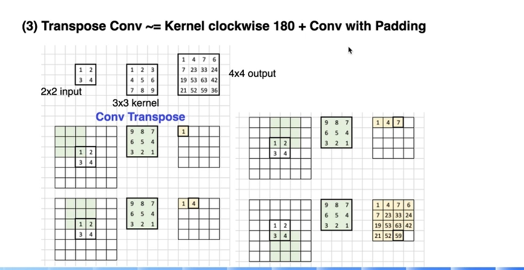

### 语义分割


#### 语义分割性能指标
- MIou  MIoU是指平均交并比，（Mean Intersection over Union），也称为平均IoU（Intersection over Union）。它是一种常用的评估指标，用于衡量语义分割任务中预测结果与真实标签之间的相似度


在语义分割任务中，每个像素都被赋予一个特定的类别标签，我们可以将预测结果和真实标签分别视为两个二值图像。交并比是通过计算预测结果和真实标签之间的重叠区域与它们的并集之间的比例来度量它们的相似程度。

具体地，对于每个类别，我们可以计算该类别的交并比（IoU）并取其平均值，得到MIoU。计算IoU的公式如下

```
IoU = 某类别的交集区域 / 某类别的并集区域
 MIoU = 所有类别的IoU之和 / 类别总数
```

MIoU的取值范围在0到1之间，越接近1表示预测结果与真实标签的相似度越高，相反，越接近0表示相似度越低。


> 语义分割 ~= 像素级分类

#### FCN全卷积网络

全卷积网络（Fully Convolutional Networks，FCN）是Jonathan Long等人于2015年在一文中提出的用于图像语义分割的一种框架，是深度学习用于语义分割领域的开山之作。FCN将传统CNN后面的全连接层换成了卷积层，这样网络的输出将是热力图而非类别；同时，为解决卷积和池化导致图像尺寸的变小，使用上采样方式对图像尺寸进行恢复。


**核心思想**
- 不含全连接层的全卷积网络，可适应任意尺寸输入；
- 反卷积层增大图像尺寸，输出精细结果；
- 结合不同深度层结果的跳级结构，确保鲁棒性和精确性。


**FCN网络**

FCN网络结构主要分为两个部分：全卷积部分和反卷积部分。其中全卷积部分为一些经典的CNN网络（如VGG，ResNet等），用于提取特征；反卷积部分则是通过上采样得到原尺寸的语义分割图像。FCN的输入可以为任意尺寸的彩色图像，输出与输入尺寸相同，通道数为n（目标类别数）+1（背景）。FCN网络结构如下：


**上采样的三种方法**

- Up-pooling  
- Up-sample  
- transpose conv


**上采样 Upsampling**

在卷积过程的卷积操作和池化操作会使得特征图的尺寸变小，为得到原图像大小的稠密像素预测，需要对得到的特征图进行上采样操作。可通过双线性插值（Bilinear）实现上采样


**上采样 Up-pooling**

不常用


**transpose convolution**

卷积核的转置卷积（transposed convolution）实现，转置卷积即为反卷积（deconvolution）。





**VGG backbone**


#### 语义分割U-Net & PSP Net


**PSP 分割网络**

PSP即金字塔场景解析（Pyramid Scene Parsing）主要做语义分割，还需要上采样，进行逐像素的分类，讲究对不同的场景进行解析

> 金字塔池化操作（spatial pyramid pooling）：PSPNet的金字塔池化操作也是增加感受野的方式；

PSPNet 是在FCN上的改进，引入更多的上下文信息进行解决，当分割层有更多全局信息时，出现误分割的概率就会低一些，这种思想目前在许多图像领域都有所应用，引入更多上下文信息的方式也很多，比如：增大感受野，这种方式最直观，视野越广，看到的东西也越多，而增大感受野也有许多方式，比如：


场景解析(Scene Parsing)的难度与场景的标签密切相关。先大多数先进的场景解析框架大多数基于FCN，但FCN存在的几个问题：


- Mismatched Relationship（错误匹配）：上下文关系匹配对理解复杂场景很重要，例如在上图第一行，在水面上的大很可能是“boat”，而不是“car”。虽然“boat和“car”很像。FCN缺乏依据上下文推断的能力。
- Confusion Categories（相似的标签）： 许多标签之间存在关联，可以通过标签之间的关系弥补。上图第二行，把摩天大厦的一部分识别为建筑物，这应该只是其中一个，而不是二者。这可以通过类别之间的关系弥补。
- Inconspicuous Classes（小目标丢失）：模型可能会忽略小的东西，而大的东西可能会超过FCN接收范围，从而导致不连续的预测。如上图第三行，枕头与被子材质一致，被识别成到一起了。为了提高不显眼东西的分割效果，应该注重小面积物体。


**Pyramid Pooling 模块**


**Adaptive Pool**

自适应平均池化

```math

hstar = floor(i∗H_{in}/H_{out}) \\ 
hend = ceil((i+1)∗H_{in}/H_{out}) \\ 
wstart = floor(j∗W_{in}/W_{out}) \\ 
wend = ceil((j+1)∗W_{in}/W_{out}) \\ 
Output(i,j)= \frac{∑Input[hstart:hend,wstart:wend]}{(hend−hstart)∗(wend−wstart)}

```
```
AdaptiveAvgPool2D(output_size=(2, 2))
```
> https://www.paddlepaddle.org.cn/documentation/docs/zh/api/paddle/nn/AdaptiveAvgPool2D_cn.html


PSP 网络的BackBone  **Dilated ResNet**


**Dilated Conv  空洞卷积**


PSPNet特点：

    基础网络ResNet
    基于FCN全卷积网络
    多尺度特征融合
    金字塔场景解析能够提升全局范围信息
    金字塔池化
    四种不同的尺度 1x1, 2x2, 3x3, 6x6
    每个尺度下的filter个数为1/N【N为卷积网络最后输出的通道个数】
    pooling操作后，接1x1卷积
    将不同尺度的特征上采样upsample
    然后把特征进行cancat，作为金字塔池化的特征输出
    通过卷积进行续重的分割预测
    辅助loss网络（类似ResNet中的辅助网络、测试阶段去掉该辅助网络）


#### DeepLab介绍

DeepLabv3+ (2018) 是DeepLab语义分割系列网络的最新作，其前作有 DeepLabv1，DeepLabv2, DeepLabv3, 在最新作中，DeepLab的作者通过encoder-decoder进行多尺度信息的融合，同时保留了原来的空洞卷积和ASSP层， 其骨干网络使用了Xception模型，提高了语义分割的健壮性和运行速率，在 PASCAL VOC 2012 dataset取得新的state-of-art performance，89.0mIOU。


**DeepLab v1**


**DeepLab v2**


**DeepLab v3**


ASPP 升级版模块


**Multi Grid**


**实现**


#### PP-LiteSeg 模型

PP-LiteSeg是PaddleSeg团队自研的轻量化模型，在Cityscapes数据集上超越其他模型，实现最优的精度和速度平衡。 具体而言，PP-LiteSeg模型沿用编解码架构，设计灵活的Decoder模块（FLD）、统一注意力融合模块（UAFM）和简易PPM上下文模块（SPPM），实现高精度和高效率的实时语义分割。

- 轻量级模型设计： PP-LiteSeg 专注于在保持高准确性的同时降低计算开销。这对于实时应用非常重要，因为实时性要求模型能够在短时间内进行推断。
- 灵活轻量级解码器（FLD，Flexible and Lightweight Decoder，灵活轻量的解码器）： FLD 是 PP-LiteSeg 的一部分，它被设计用于减少之前解码器的计算负担。通过灵活的结构，FLD 能够在不损失太多性能的情况下减少计算成本。
- 统一注意力融合模块（UAFM，Unified Attention Fusion Module，统一的注意力融合模块）： UAFM 是用于增强特征表示的关键组件。它利用空间和通道注意力机制，生成权重，并将输入特征与权重融合。这有助于模型更好地捕获关键的语义信息。
- 简单金字塔池化模块（SPPM，Simple Pyramid Pooling Module，简单的金字塔池化模块）： SPPM 的目标是以较低的计算成本汇集全局上下文信息。这有助于提高模型对于环境背景的感知能力，从而增强分割性能。


广泛的评估表明，PP-LiteSeg 在准确性和速度之间实现了卓越的权衡。在 Cityscapes 测试集上，PP-LiteSeg 实现了 72.0% 的 mIoU（273.6 FPS） 和 77.5% 的 mIoU（102.6 FPS） 在 NVIDIA GTX 1080Ti 上。

> PP-LiteSeg 解决的痛点问题就是：目前语义分割模型在 mIoU 和推理速度很难达到一个 tradeoff，于是提出 PP-LiteSeg 以达到在良好 mIoU 下模型可以有优秀的速度表现 —— 整体思想和 Mobilenet v3 很像。


**网络架构**

在语义分割领域，通常采用的是基于深度学习的神经网络模型来实现。这些模型包括了 Encoder、Decoder 以及 Segmentation Head 这些组件，它们各自有着不同的作用，用于将输入图像转换为像素级的语义分割结果。


- Encoder（编码器）：编码器是一个 CNN 的 Backbone，用于从输入图像中提取高级语义特征。它通过一系列卷积层、池化层和激活函数来逐渐减小图像的空间维度[H, W] ，并且增强图像中的语义信息（直观体现就是特征图通道数上升）。编码器的任务是将原始图像转换为具有丰富语义信息的低分辨率特征图，这些特征图包含了图像中的物体、纹理和结构等信息。
- Decoder（解码器）：解码器是与编码器相对应的部分，它负责将编码器产生的低分辨率特征图恢复到原始图像的分辨率，并进行像素级的分类。解码器通常包括上采样层（如反卷积或插值操作）和卷积层，用于逐步恢复特征图的细节，并生成与输入图像大小相同的特征图。解码器的任务是将编码器提取的语义特征映射到像素级别，以便对每个像素进行分类（Decoder 本身不会对像素进行分类，而是通过一个分割头来实现)。
- Segmentation Head（分割头）：是一个全连接层或卷积层，用于将 Decoder 输出的特征图转换为最终的分割结果（将对每一个像素进行分类）。Segmentation Head 的作用是将 Decoder 输出的特征图转换为像素级别的预测结果。


综上所述，在语义分割领域中：
- 编码器（Encoder）用于提取输入图像的语义信息
- 解码器（Decoder）用于将语义信息映射回像素级别
- 分割头（Segmentation）用于最终的像素级别语义分割预测（对每个像素进行最后的分类）


**【Encoder】STDCNet：更强大的 Backbone**

PP-LiteSeg 使用 STDCNet 作为 Backbone。STDCNet 主要有以下优点：


- STDCNet 网络是一种轻量级的卷积神经网络，具有较低的参数量和计算量。它采用了一种名为STDC（Spatial-Temporal Depthwise Convolution）的新型卷积操作，可以有效地提取空间和时间信息，从而提高特征表示能力。
- STDCNet 网络在编码器中使用了多尺度特征融合技术，可以增强编码器对于图像中不同尺度的语义信息的感知能力，提高分割精度。


STDCNet 共有 5 个阶段，每个阶段的步长为 2，因此最终的特征大小是输入图像的 1/32（进行了 32 倍下采样）。基于 STDCNet，作者提出了两种规格的 PP-LiteSeg 网络，如下表所示。


正如表 1 所示，PP-LiteSeg-T 和 PP-LiteSeg-B 的编码器分别是 STDC1 和 STDC2。PP-LiteSeg-B 实现了更高的分割准确性，而 PP-LiteSeg-T 的推断速度更快。


- ConvX包括一个卷积层、一个批量归一化层和ReLU激活层。
- 在STDC模块中，第一个块的内核大小是1，其余的块只需设置为3。给定STDC模块输出N的通道号，第i个块中卷积层的滤波器号为N\2i，但最后一个卷积层的滤波器号与前一个卷积层的滤波器号相同。在图像分类任务中，通常的做法是在更高层使用更多通道。但在语义分割任务中，我们主要关注可伸缩的感受野和多尺度信息
- Down sample只发生在Block2中。为了丰富特征信息，我们通过跳过路径将x1到xn特征映射连接起来作为STDC模块的输出。在连接之前，通过3×3池大小的平均池操作，将STDC模块中不同块的响应映射下采样到相同的空间大小，如图3（c）所示。
- 除输入层和预测层外，它由6个阶段组成。一般来说，第1-5阶段分别以2的步长对输入的空间分辨率进行下采样，第6阶段通过一个ConvX、一个全局平均池层和两个完全连接层输出预测逻辑。
- 为了减少计算量，Stage1和Stage2中只使用1个卷积层。Stage3~Stage5中每个Stage包含若干个STDC模块，其中第1个STDC模块包含下采样操作，其余STDC模块保持feature map尺寸不变。


**【Aggregation】SPPM（简单金字塔池化模块，Simple Pyramid Pooling Module）**

Encoder 使用 STDCNet 作为 Backbone，对输入图片进行一系列的特征和高级语义提取，之后需要将 Encoder 的输出特征图送入 Decoder 中，在这个过程中，一般会经过一个 MMP 模块（和我们之前讲的 ASPP 作用类似），PPM 主要用于捕获不同尺度上的语义信息，并增强模型对物体在不同尺度下的感知能力，具体作用如下：

- 多尺度特征融合：在语义分割任务中，不同尺度上的语义信息都是重要的，因为物体的大小和形状可能在图像中有所变化。PPM 通过金字塔池化操作，在不同尺度上对特征图进行池化，然后将池化后的特征进行拼接或融合，从而获得了多尺度的语义信息。这有助于模型更好地理解和分割图像中的不同尺度物体。
- 增强感受野：PPM 的金字塔池化操作能够有效地扩大神经网络的感受野，使模型能够更好地捕捉图像中的全局和局部信息。通过在不同层级上应用不同大小的池化核，PPM 能够在不丧失分辨率的情况下捕获更广泛的语义信息。
- 提升分割性能：PPM 可以在解码器的输出特征图上应用，从而为分割任务提供更多的上下文信息。这有助于模型更准确地将像素分类为不同的语义类别，从而提高分割的精度和泛化能力。

> ：SPP 和 PPM 是一样的吗？
> ：SPP（Spatial Pyramid Pooling）和 PPM（Pyramid Pooling Module）在一定程度上是类似的概念，它们都涉及到对特征图进行金字塔状的池化操作，以捕捉不同尺度上的语义信息。然而，它们在具体实现和应用上存在一些差异。
SPP 是最早提出的概念，主要应用于图像分类和物体检测任务。它通过对特征图在不同尺度上进行池化，生成固定长度的特征向量，以适应不同尺寸的输入图像。
PPM 则是在语义分割任务中被引入的，它也采用了类似的金字塔池化策略，但通常更加注重不同尺度的语义信息的融合。PPM 在解码器部分对特征图进行金字塔池化，然后将池化后的特征进行拼接或融合，以获得更全面的语义信息。
因此，虽然 SPP 和 PPM 在某种程度上具有相似的思想，但它们的具体设计和应用上存在差异，SPP 更早用于图像分类和物体检测，而 PPM 则更加针对语义分割任务中的特定需求。

作者基于 PPM（Pyramid Pooling Module）提出了一个更加简单的 PPM，即 SPPM（Simple Pyramid Pooling Module，SPPM）。如下图所示。


SPPM 运行流程

- 利用金字塔池化模块来融合输入特征：金字塔池化模块包含三个全局平均池化（AvgPool）操作，对应的池化核大小分别为1X1,2X2,4X4 
- 输出特征经过1X1卷积和上采样操作：卷积操作使用 1X1 的卷积核，输出通道数少于输入通道数（输出特征图的通道减少）。
- 将这些上采样特征相加，并应用 3X3  卷积操作生成精细特征。


相对于原始的金字塔池化模块（PPM），SPPM 减少了中间和输出通道，去除了原有的拼接操作 concat，而是使用了逐元素相加 + 的操作。这个改变旨在降低模型的计算复杂性，使得 SPPM 更加高效，并且适用于实时模型。

SPPM 相比原始 SPP 的优点

SPPM相比原始的SPP（Spatial Pyramid Pooling，空间金字塔池化）有以下优点：
- SPPM 只使用了两种不同尺度的池化操作，分别是平均池化（Average Pooling）和最大池化（Max Pooling），而 SPP 使用了多种不同尺度的池化操作（和之前学习的 ASPP模块 是一样的），例如 1X1、2X2、3X3、6X6 等。这样可以减少池化操作的数量和复杂度，降低计算开销。
- SPPM 将两种不同尺度的池化结果拼接在一起，形成一个多尺度的特征图，而 SPP 将多种不同尺度的池化结果连接在一起，形成一个长向量。这样可以保留更多的空间信息，提高特征表示能力。
- SPPM 在拼接后的特征图上使用了一个 1 X 1 卷积层和一个激活函数，以减少特征图的通道数，并增加非线性变换。这样可以进一步降低计算量，并提高特征表达能力。而 SPP 有使用这样的操作，直接将长向量作为输出。


**【Decoder】FLD（Flexible and Lightweight Decoder，灵活轻量级解码器）**

在语义分割模型中，编码器（Encoder）提取层次化特征，而解码器（Decoder）则融合和上采样特征。对于编码器中从低层到高层的特征，通道数 【C】 增加，空间大小 【H，W】 减小，这是一种高效的设计。

在一般的语义分割网络中，Decoder 中从高层到低层的特征，空间大小 【h,w】 增加，而通道数 [c] 在最近的模型中保持不变，但是这样会导致一个问题。特征图在 Decoder 中的[h,w] 在增加，而 [c] 不变，网络的计算开销太大了。 

于是，作者提出了 FLD（Flexible and Lightweight Decoder，灵活轻量级解码器），主要作用是在 Decoder 运行过程中，在逐渐增加特征图的空间大小 [h,w] 的同时，逐渐减少特征的通道数。这种设计平衡了 Encoder 和 Decoder 的计算复杂性，使整体模型更加高效。FLD 架构如下图所示。


FLD 的优缺点

FLD（Flexible and Lightweight Decoder）相比传统的 Encoder-Decoder 结构的优缺点如下：

- 【 优点 】FLD 可以逐渐减少解码器中的通道数量，增加特征图的空间大小，从而减少解码器的冗余性，并平衡编码器和解码器的计算成本。
- 【 缺点 】FLD 可以逐渐减少解码器中的通道数量，增加特征图的空间大小，从而减少解码器的冗余性，并平衡编码器和解码器的计算成本。


**【Decoder】UAFM（统一注意力融合模块，Unified Attention Fusion Module）**

之前不管是学习 FCN 还是 DeepLab 系列模型，我们都知道一个道理 —— 融合多级特征对于实现高分割准确性是至关重要的

作者基于此提出了一个统一注意力融合模块 (UAFM)，它利用空间和通道注意力机制（两种注意力机制），生成一个权重矩阵 α，并将输入特征与权重矩阵相乘，得到融合后的特征。这样可以使模型更好地捕获图像中的关键语义信息，提高分割精度。UAFM 如下图所示。


如上图所示，UAFM 利用注意力模块生成权重α，并通过 Mul 和 Add 操作将输入特征与 α 融合。具体而言，输入特征被表示为 F_high和 F_low。F_high 是深层模块的输出，F_low 是来自编码器的对应部分。需要注意的是，它们具有相同的通道数。

> 注意力模块可以是空间注意力或者是通道注意力，看具体任务要求定（作者在实验的时候使用的是空间注意力，说是为了提高模型运行速度）。
> 之前的低级语义信息的特征图和高级语义信息的特征图融合可能就是直接 + ，这样非常粗暴，作者就想改善这个过程，因此就在 + 之前添加了一个注意力模块，让注意力模块可以计算出两个特征图的权重，之后再相加后就比直接 + 效果好了。

UAFM 首先使用双线性插值操作将F_high上采样到与 F_low 相同的大小，上采样后的特征表示为 F_up。然后，注意力模块将 F_up和F_low 作为输入，生成权重 α。之后，为了获得注意力加权特征，我们分别对 F_up 和 F_low  进行逐元素乘法操作 X 。最后，UAFM 对注意力加权特征进行逐元素加法操作+，输出融合特征。我们可以将上述过程表示为公式 1。  


```math 
 F_{up} = Upsample(F_{high}) \\
 α = Attention(F_{up}, F_{low}) \\
 F_{out} = αF_{up} + (1-α)F_{low}
```

空间注意力模块

空间注意力模块的动机是利用像素之间的空间关系产生一个权重，该权重表示输入特征中每个像素的重要性，如图4 (a) 所示。


```math
F_{out} = Concat[Mean(F_{up}),Max(F_{up}), Mean(F_{low}), Max(F_{low})] \\
α = Sigmoid(Covn(F_{out}))
```


通道注意力模块

通道注意力模块的关键是利用通道之间的关系生成权重，该权重指示了输入特征中每个通道的重要性，如图 4 (b) 所示。


```math
F_out = Concat[AvgPool(F_{up}),MaxPool(F_{up}), AvgPool(F_{low}), MaxPool(F_{low})] \\
α = Sigmoid(Covn(F_{out}))
```


**PP-LiteSeg 整体框架**


- 因为 PP-LiteSeg 使用了 STDCNet 作为 Backbone，因此作者在训练的时候使用了该模型的预训练权重，从而实现加速训练的效果（预训练模型非常重要，我们一般都是会用的，使用前后准确率相差很大，可以参考我之前做的实验 →
- FLD 包含两个 UAFM 和一个分割头。为了提高运行效率，UAFM 中只采用了空间注意力模块。最后一个 UAFM 会对输入进行 8 倍下采样。
- Segmentation Head 会先执行 Conv-BN-ReLU 操作将 进行了 8 倍通道（Channel）下采样的特征的通道数减少到类别数（num_classes）。接下来进行上采样操作，将特征大小扩展到输入图像大小，并进行 argmax 操作预测每个像素的标签。
- 采用了带有在线难例挖掘的交叉熵（The cross entropy loss with Online Hard Example Mining）作为损失函数来进行模型参数优化

> 在线难例挖掘的交叉熵损失（The cross entropy loss with Online Hard Example Mining）是一种训练深度学习模型的损失函数，在处理具有类别不平衡或者难以分类的样本时特别有效。它结合了交叉熵损失和难例挖掘的思想。 交叉熵损失通常用于分类问题中，用于衡量模型预测的类别分布与真实标签的分布之间的差异。然而，当存在类别不平衡或一些样本难以分类时，普通的交叉熵损失可能会导致模型过于关注容易分类的样本，而忽略了那些难以分类的样本。 在线难例挖掘的交叉熵损失通过选择一些难以分类的样本，将它们的损失权重增加，从而强制模型更多地关注这些难例。具体做法是在每个训练批次中，计算损失后对样本进行排序，然后选择一定数量的难例样本（如前一部分或一定百分比的样本），并为它们分配更高的损失权重。这样可以促使模型更好地适应那些难以分类的情况，提高整体性能。 总之，在线难例挖掘的交叉熵损失是一种用于处理难例和类别不平衡的训练策略，有助于提升模型在困难样本上的表现。


OHEM 步骤流程

- 给 OhemCE Loss 取一个阈值  thresh
    - 那么该像素点的预测概率 > 0.7，则该像素点可以看成是简单样本，不参与损失计算
    - 那么该像素点的预测概率 < 0.7，则该像素点可以看成是困难样本，参与损失计算
- 确定忽略的像素点值 lb_ignore：一般我们将背景的值设置为 255，即如果像素点值的大小是 255，那么就不参与损失计算。
- 设置最少计算的像素点个数 n_min：至少有 n_num 个像素点参与损失计算（不然网络有可能停止更新了）。


Xception介绍

Xception是DeepLabv3+原始实现的backbone网络，兼顾了精度和性能，适用于服务端部署。


### 实例分割（instance segmentation）

目标检测和语义分割的结合，在图像中将目标检测出来（目标检测），然后对每个像素打上标签（语义分割）。如上图，以人为目标，语义分割不区分属于相同类别的不同实例（所有人都标为红色），实例分割区分同类的不同实例（使用不同颜色区分不同的人）。


#### 自上而下的实例分割方法

简单的说，这种方法就是先检测后分割。这类方法的代表选手是Mask R-CNN。它的优点是定位精度高，但也有一定的局限，比如：预测时延高，达不到实时，实例分割结果在物体检测框的束缚下等。

 

业界很多大神都在持续尝试基于Mask R-CNN算法进行改进，希望解决上述局限问题，GCNet、PANet、HTC、DetectoRS等网络就是在Mask R-CNN算法上优化、演进而来的。但是预测速度慢的问题仍得不到解决。

 

第一类可以被称为实时的实例分割的模型是YOLACT和YOLACT++，它们基于RetainNet，将实例分割分为两个并行的子任务，采用单阶段的网络结构，使网络计算量尽量小，后者训练54个epoch左右，最终在COCO test-dev数据集上的mask AP达到34.6%，在Titan Xp的GPU环境中达到27.3~33.5FPS。

 

而CenterMask算法则基于Anchor Free模型FCOS更进一步提升了实例分割的精度和速度，改进了backbone，提出VoVNetV2，同时基于Mask R-CNN的mask分支，引入Spatial Attention-Guided Mask（空间注意力模块），实时的CenterMask-Lite模型在COCO Test-dev数据集上的mask AP达到36.3%，在Titan Xp的GPU环境中达到35.7FPS，成为新的SOTA模型。


#### 自下而上的实例分割方法

这类方法比较好理解，先进行像素级别的语义分割，再通过聚类、度量学习等手段区分不同的实例。PolarMask、SOLO系列算法就是其中的代表。

PolarMask基于FCOS的思想，将回归到检测框四边的距离问题转换为回归基于中心点不同角度的36根射线的距离问题，通过联通整个区域获得分割结果。这种方法创新性很高，但问题也很明显，如：通过角点确定分割区域的方法不够准确，mask AP较低，预测速度也很慢。

 

而SOLO系列算法经过不断的优化，在精度和预测速度的性价比方面超均越了YOLACT++和CenterMask算法，下面我们就着重介绍一下SOLO系列算法的发展历程及PaddleDetection针对SOLOv2算法进行的优化。

#### 经典算法

- Proposal-based/Top-down: Mask RCNN （2017）
- Proposal-free/Bottom-up SOLO (2020)


#### Mask R-CNN

Mask R-CNN有哪些创新点？
- Backbone：ResNeXt-101+FPN
- RoI Align替换RoI Pooling

Mask R-CNN是一个实例分割（Instance segmentation）算法，主要是在目标检测的基础上再进行分割。Mask R-CNN算法主要是Faster R-CNN+FCN，更具体一点就是ResNeXt+RPN+RoI Align+Fast R-CNN+FCN。


#### SOLO

SOLO（Segmenting Objects by Locations）算法的核心思想是将分割问题转化为位置分类问题，从而做到不需要anchor（锚框）及bounding box，而是根据实例的位置和大小，对每个实例的像素点赋予一个类别从而达到对实例对象进行分割的效果。

solo 创新点
- 端到端训练，且无需后处理
- 只需要mask的标注信息，无需 bbox 标注信息
- 在 MASKCOCO 上实现了和 Mask R-CNN 基本持平的效果
- SOLO 只需要解决两个像素级的分类问题，类似于语义分割
- SOLO 通过离散量化，将坐标回归转化为分类问题，可以避免启发式的坐标规范化和 log 变换，通常用于像 YOLO 这样的检测器中，适用与实例级目标识别任务。


solo的主要思想是将实例分割看作是类别感知预测问题。具体地，将输入图片划分成sxs个格子，如果某个目标的中心落入某个格子，这个格子将负责该目标的语义类别预测和目标实例的分割两个任务。

对于每个grid都有c维输出，表示c个类别的概率。输出为S x S x C如图所示：将实例分割看成是两个子任务，类别预测和实例mask的生成。该假设基于每个grid对应一个单独的实例，也就是每个grid里仅有一个物体中心点。


其中，类别分支负责预测物体的语义类别，共产出S×S×C大小的预测结果。Mask分支中每个有类别输出的网格（正样本）都会输出对应类别的mask，这里一个通道负责预测一个网格的mask，因此输出维度是H×W×S2。同时基于SOLOv1，作者又提出了Decoupled-SOLO改进算法，将S2个分类器解耦为两组分类器，每组S个，分别对应S个水平位置类别和S个垂直位置类别，优化之后的输出空间就从H×W×S2降低到了H×W×2S，从而降低了网络计算量，如下图(b)所示，最后将两个通道的特征图做element-wise乘，进行特征的融合。


#### 实时实例分割算法SOLOv2

SOLOv2继承了SOLOv1中的一些设定，将原来的mask分支解耦为mask核分支和mask特征分支，分别预测卷积核和卷积特征，如上图中的Dynamic head所示。

输入为H×W×E的特征，F、E是输入特征的通道数，输出为卷积核S×S×D，其中S是划分的网格数目。


Mask核分支位于预测head内，平行的有语义类别分支。预测 head的输入是FPN输出的特征图。Head内的2个分支都有4个卷积层来提取特征，和1个最终的卷积层做预测。Head 的权重在不同的特征图层级上共享。同时作者在kernel分支上增加了空间性，做法是在第一个卷积内加入了CoordConv，即输入后面跟着两个额外的通道，操作如下图所示。


同时SOLOv2也使用了Matrix NMS，通过矩阵运算所有的操作都可以单阶段地实现，不需要递归，比传统的NMS快9倍。

经过以上的迭代，SOLOv2成为当前产业最实用的实例分割算法。而飞桨PaddleDetection不仅复现了该模型，还对其进行了一系列的深度优化，使其精度和速度相较原网络有了进一步的提升

#### PaddleDetection中的SOLOv2

- 更优的骨干网络：ResNet50vd-DCN+蒸馏: 针对SOLOv2，飞桨使用更加优异的ResNet50vd-DCN作为模型的骨干网络，它相比于原始的ResNet，可以提高1%-2%的检测精度，且推理速度基本保持不变。SOLOv2模型在使用了ResNet50vd的SSLD知识蒸馏之后更优的预训练权重进行训练后，COCO minival数据集的精度提升了1.4%（36.4%->37.8%）。在V100上的预测速度上，从29.4FPS提升至38.6FPS。
- 更稳定的训练方式：EMA、Sync-BN： 飞桨团队采用了EMA（Exponential Moving Average）滑动平均方案，将参数过去一段时间的均值作为新的参数，让参数学习过程中变得更加平缓，有效避免异常值对参数更新的影响，提升模型训练的收敛效果。实验发现，使用EMA后网络收敛速度明显加快。Batch Norm实现只会计算单卡上的均值和方差，相当于‘减小了’批大小。SOLOv2实际训练比较耗费显存，单卡的batch size较小，为2。针对这种情况，我们引入了同步的Batch Norm，即：Sync-BN，它可以统计全局的均值和方差，获得更稳定的统计值，相当于‘增大了‘批大小。
- 更多的数据增强方法： 在SOLOv2中除了采用空间变换（随机尺度变换、随机裁剪图片、随机翻转等）、颜色扭曲（透明度、亮度、饱和度等）、信息删除(增加随机噪声、随机遮挡等)等常用数据增强方法之外，还使用了一种新颖的信息删除方法：Grid-Mask方法


**Grid - Mask**


Grid-Mask方法属于信息删除的方法。其实现方式是随机在图像上丢弃一块区域，作用相当于是在网络上增加一个正则项，避免网络过拟合，相比较改变网络结构来说，这种方法只需要在数据输入的时候进行增广，简单便捷。

经过数据增强之后，SOLOv2模型在保持原有速度的情况下，精度又提升了0.4%（38.4%->38.8%）。


### 全景分割（panoptic segmentation）

语义分割和实例分割的结合，即要对所有目标都检测出来，又要区分出同个类别中的不同实例。如上图，实例分割只对图像中的目标（如上图中的人）进行检测和按像素分割，区分不同实例（使用不同颜色），而全景分割是对图中的所有物体包括背景都要进行检测和分割，区分不同实例（使用不同颜色）。


#### 经典算法

- Proposal-based/Top-down: UPSNet  （2019）
- Proposal-free/Bottom-up Panoptic-DeepLab (2020)


