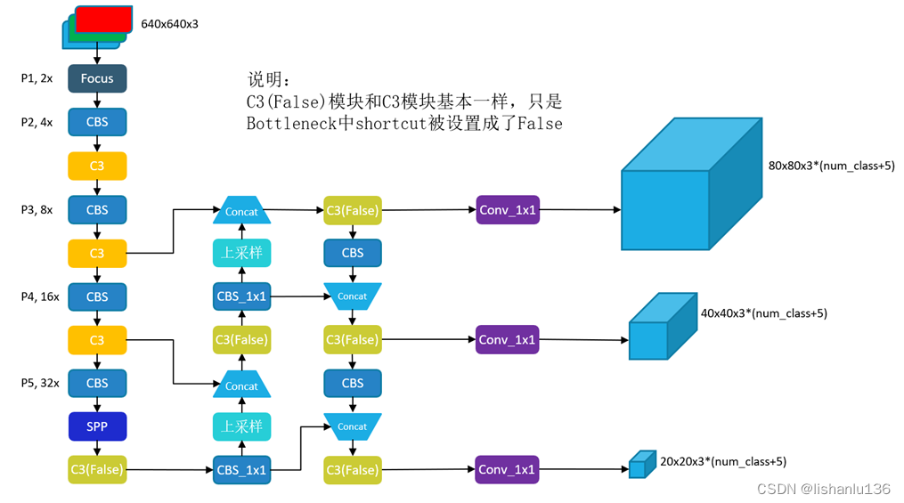
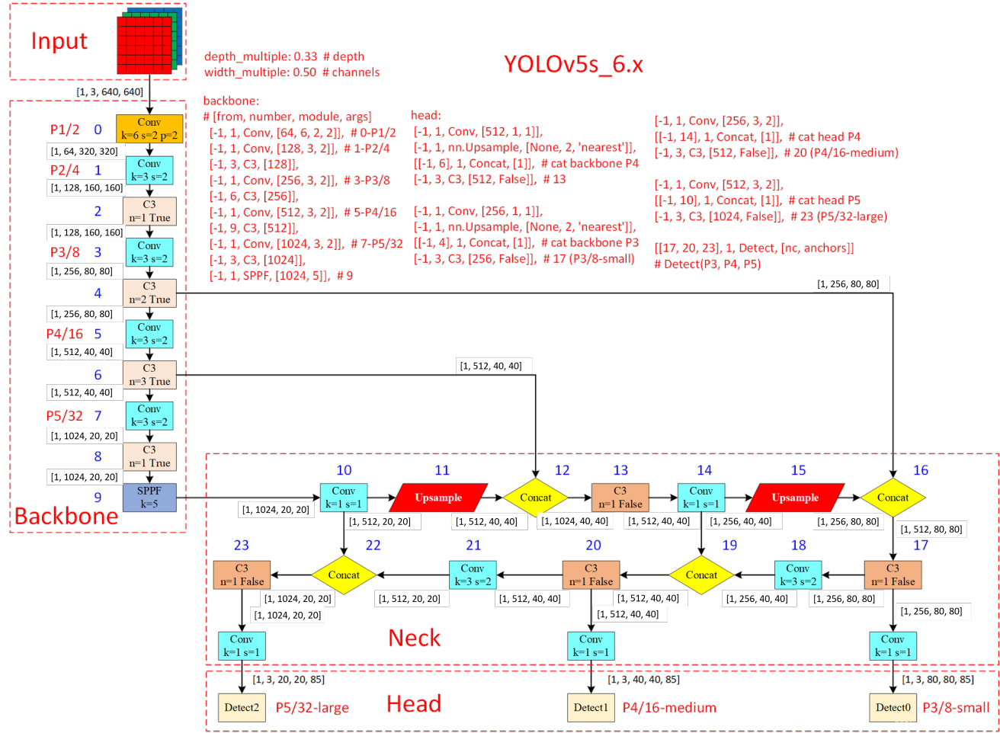
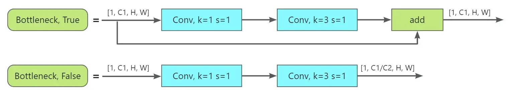
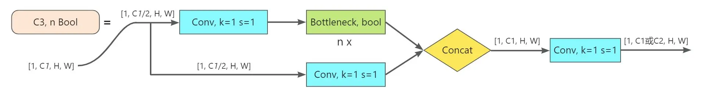
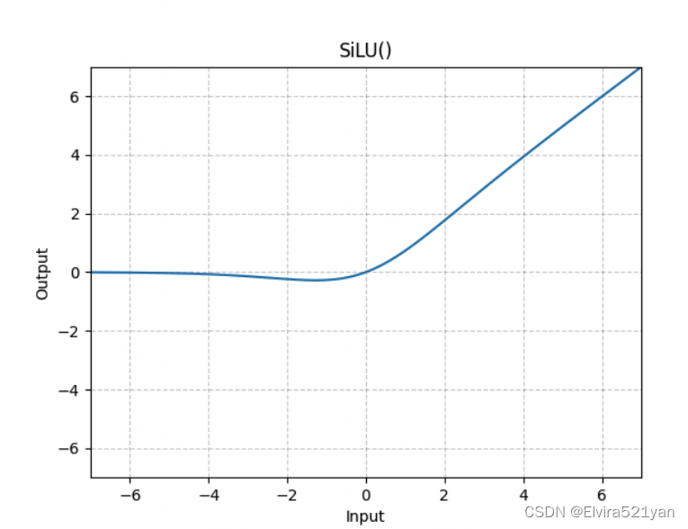

YOLOv5和YOLOv4都是在2020年发布，不同的是YOLOv5没有论文，是以工程的方式发布的，至今在工业界都还有很多应用，且模型泛化性能非常不错，代码中的很多细节处理值得我们学习。且作者也有在持续改进优化代码，现在已经更新到7.0版本了。先看代码结构：


#### 网络结构图




YOLOv5是Glenn Jocher等人研发，它是Ultralytics公司的开源项目。YOLOv5根据参数量分为了n、s、m、l、x五种类型，其参数量依次上升，当然了其效果也是越来越好。从2020年6月发布至2022年11月已经更新了7个大版本，在v7版本中还添加了语义分割的功能

在YOLOv5中，输入图片的尺寸是640640，经过32倍、16倍、8倍下采样，会产生20x20、40x40、80x80大小的特征图（也就是网格尺寸），特征图的每个像素（该像素对应的视野域大小就是网格中的单元格大小）设置3个anchor，因此v5一共有 (2020+4040+8080)3=25200个anchor。


####  YOLOv5 p6
先放上个人对YOLOv5_v6的理解（可结合图1进行阅读），这里我们假设对一组图片进行训练。首先我们要了解，YOLOv5_v6是对三个尺度的特征图进行目标检测的，即large（大）、medium（中）、small（小）三种。
1）准备工作（Input中进行）：图片需要经过数据增强（尤其是Mosaic数据增强），并且初始化一组anchor预设（YOLOv5_v6针对不同参数量的模型给出了不同的通用预设）。
2）特征提取（Backbone中进行）：使用了Conv、C3、SPPF基本结构对输入图片进行特征提取。Conv用于对输入进行下采样（共进行了5次下采样）；C3用于对输入进行特征提取、融合，丰富特征的语义信息，在这个过程中使用了Boottleneck减少参数量和计算量、借鉴CSPNet思想增强CNN学习能力；SPPF利用池化、特征融合的方式丰富特征的语义信息，使得最深层的特征图拥有极丰富的语义信息。
3）加工特征（Neck中进行）：对要进行目标检测的三种尺度的特征图融合浅层特征（浅层特征有利于检测）。v6借鉴了PANet，对提取的特征图融合浅层特征，使得特征图既具有丰富的语义信息又具有物体准确的位置信息。
4）预测目标（Head中进行）：对加工后的特征图进行预测，根据损失函数（Classificition Loss和Bounding Box Regeression Loss）和优化器优化参数权重





#### backbone


- Conv, k=6 s=2，是由2D卷积层+BN层+SiLU激活函数组成的，其目的是减少计算量和参数量，达到提速效果。在YOLOv5_v6之前是使用Focus结构达到的，Conv, k=6 s=2相对于Focus的优点是便于导出其他框架类型的文件
- Conv, k=3 s=2，k、s是可定义的，在YOLOv5_v6中大都是k=3, s=2和k=1, s=1两种。是由2D卷积层+BN层+SiLU激活函数组成的(CBS)，可以理解为广义的卷积（因为卷积层后一般都会紧跟BN层、激活函数）
- C3 Bottleneck用于减少计算量和参数量，与Bottleneck等效的普通卷积计算量和参数量高于Bottleneck。带有短路的Bottleneck还具有丰富特征语义信息的作用。

    


    C3（CSP Bottleneck with 3 convolutions）C3可以增强CNN的学习能力，使网络轻量化的同时提升准确度

    

    C3借鉴了CSPNet处理思想，利用n个Bottleneck、3个卷积模块、Concat来实现。C3减少了梯度信息的重复，这极大地减小了计算量，同时也使准确率有所提升。总结来说就是它增强了backbone的学习能力、消除了计算瓶颈、降低了内存成本。它与CSPNet相比更简单、更迅速、融合性更好，且对CNN网络学习能力的增强基本一致


- SPPF（Spatial Pyramid Pooling - Fast）SPPF顾名思义，就是为了保证准确率相似的条件下爱，减少计算量，以提高速度，使用3个5×5的最大池化，代替原来v6之前的5×5、9×9、13×13最大池化。使用SPPF的目的是为了利用不同的池化核尺寸提取特征的方式可以获得更多的特征信息，提高网络的识别精度。

    


#### Neck

这一部分不能单独进行理解，需要和backbone结合在一起进行理解，Neck和Backbone结合在一起就是PANet中的FPN+Bottom-Up Path Augmentation结构，其目的就是将深层特征的语义信息和浅层特征在三种尺度的特征图中进行充分融合，使其更利于进行目标检测。


#### 自适应锚框

在YOLO算法中针对不同的数据集都会有初始设定长款的锚框，比如YOLOv5s_v6在Coco数据集上初始设定的锚框为：
```
anchors:
  - [10,13, 16,30, 33,23]  # P3/8
  - [30,61, 62,45, 59,119]  # P4/16
  - [116,90, 156,198, 373,326]  # P5/32
```
在网络训练中，网络在初始锚框的基础上输出预测框，进而和真实框groundtruth进行比对，计算损失，再反向更新，迭代网络参数。在Yolov3、Yo1lov4中，训练不同的数据集时，计算初始锚框的值是通过单独的程序运行的。但Yolov5中将此功能嵌入到代码中，每次训练时，自适应的计算不同训练集中的最佳锚框值


**silu 激活函数**

SiLU 函数是一种神经网络中的激活函数，全称是 Sigmoid Gated Linear Unit（Sigmoid门控线性单元）, 也被称为 Swish 函数。它由 Google Brain 在 2017 年提出，是一种非线性激活函数，能够有效地对神经网络的输入进行非线性变换。

定义

```math

f(x) = x * \sigma (x) \\
 \sigma(x) = \frac{1}{1+e^{-x}} 
```

SiLU 函数的特点如下：
- 正数区域内，SiLU 函数的输出与 ReLU 函数的输出相同。
- 在负数区域内，SiLU 函数的输出与 sigmoid 函数的输出相同。
- SiLU 函数在整个定义域内都是可微的，这使得在反向传播过程中的梯度计算更加稳定。
- SiLU函数不是单调递增的，而是在x≈−1.28时达到全局最小值−0.28，这可以起到一个隐式正则化的作用，抑制过大的权重


